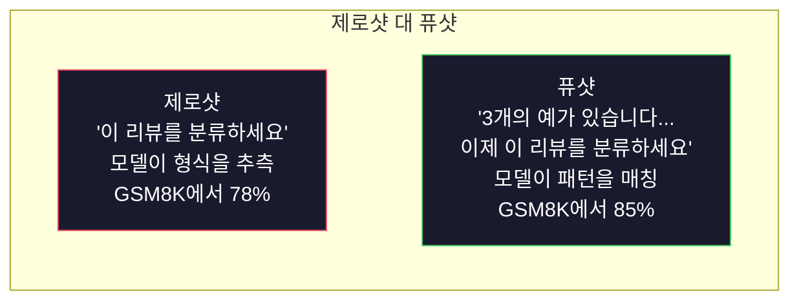
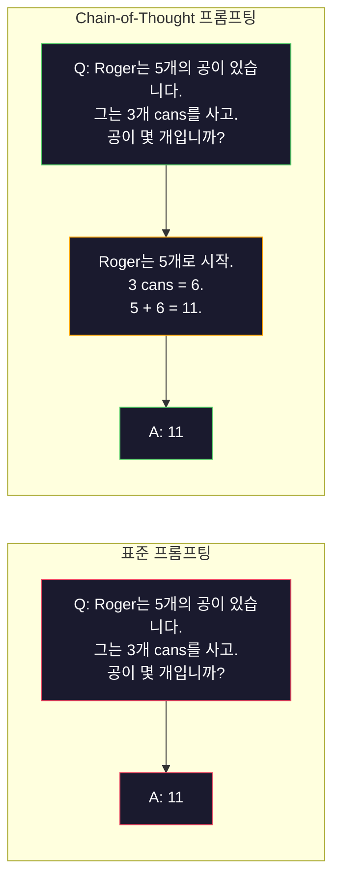
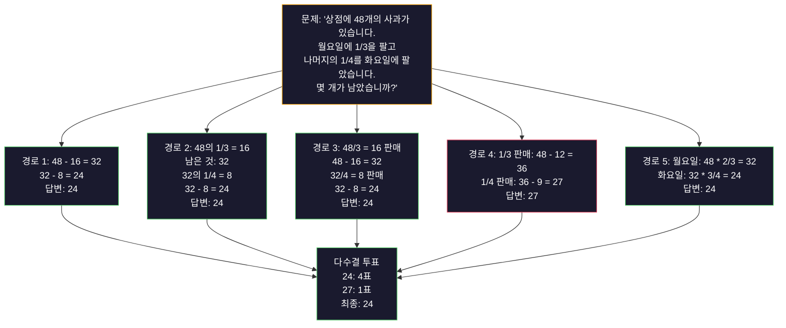
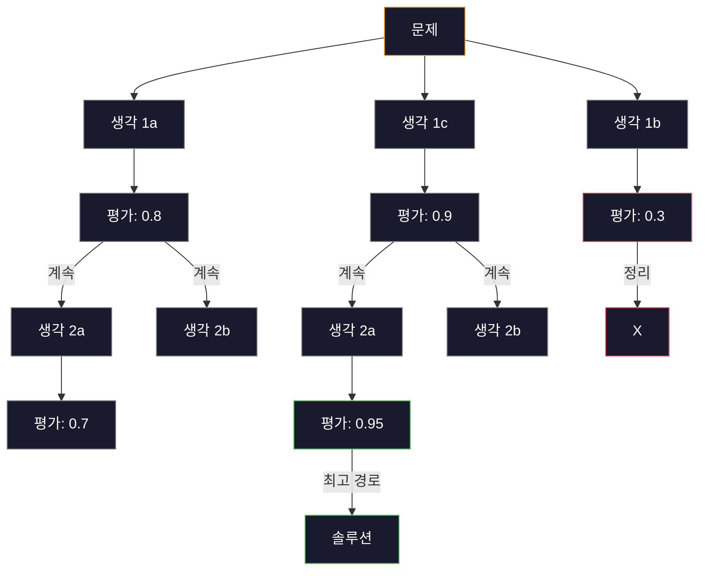
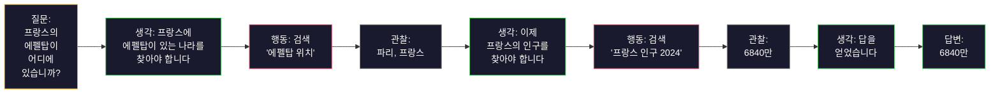

# Few-shot, Chain-of-Thought, Tree-of-Thought

> 모델에게 무엇을 해야 하는지 말하는 것은 프롬프팅입니다. 어떻게 생각해야 하는지 보여주는 것은 엔지니어링입니다. 같은 모델, 같은 작업, 같은 데이터에서 78%와 91% 정확도 사이의 격차는 더 나은 모델이 아닙니다. 더 나은 추론 전략입니다.

**유형:** 실습
**언어:** Python
**선수 과목:** Lesson 11.01 (Prompt Engineering)
**소요 시간:** ~45분

## 학습 목표

- 작업 정확도를 최대화하기 위해 예시 데모를 선택하고 형식화하여 퓨샷 프롬프팅 구현
- 수학 단어 문제와 같은 다단계 문제에서 정확도를 향상시키기 위해 Chain-of-Thought(CoT) 추론 적용
- 여러 추론 경로를 탐색하고 최상을 선택하는 Tree-of-Thought 프롬프트 구축
- 표준 벤치마크에서 제로샷 대 퓨샷 대 CoT의 정확도 향상 측정

## 문제

수학 튜터링 앱을 구축합니다. 프롬프트에 "이 단어 문제를 해결하세요"라고 합니다. GPT-5는 표준 초등 수학 벤치마크인 GSM8K에서 94%의 정확도를 보입니다. 이미 정점에 도달했다고 생각합니다. 그렇지 않습니다. chain-of-thought는 여전히 3-4포인트를 추가합니다.

다섯 단어를 추가합니다 -- "단계별로 생각해 보겠습니다" -- 정확도가 91%로 뛰어오릅니다. 몇 가지 작동된 예제를 추가하면 95%에 도달합니다. 같은 모델. 같은 temperature. 같은 API 비용. 유일한 차이점은 모델에 연습지를 줬다는 것입니다.

이것은 해킹이 아닙니다. 추론이 작동하는 방식입니다. 인간은 다단계 문제를 한 번의 정신적 도약으로 해결하지 않습니다. transformer도 마찬가지입니다. 모델에 중간 토큰을 생성하도록 강제하면 해당 토큰이 다음 토큰에 대한 컨텍스트가 됩니다. 각 추론 단계가 다음 단계를供给합니다. 모델은 문자 그대로 답변으로 계산합니다.

하지만 "단계별로 생각해 보세요"는 시작일 뿐, 끝이 아닙니다. 다섯 개의 추론 경로를 샘플링하고 다수 결정을 취하면 어떨까요? 모델이 가능성의 트리를 탐색하고 분기를 평가 및 정리하도록 허용하면 어떨까요? 추론과 도구 사용을 interleaved하면 어떨까요? 이것들은 가상의 것이 아닙니다. 측정된 개선을 가진 게시된 기술이며, 이 단원에서 모두 구축할 것입니다.

## 개념

### 제로샷 대 퓨샷: 언제 예제가 지시사항을 이기는가

제로샷 프롬프팅은 모델에 작업과 아무것도 없이 제공합니다. 퓨샷 프롬프팅은 먼저 예제를 제공합니다.

Wei et al. (2022)는 8개 벤치마크에서 이것을 측정했습니다. 감정 분류와 같은 간단한 작업에서는 제로샷과 퓨샷이 2% 이내로 수행되었습니다. 다단계 산술 및 기호 추론과 같은 복잡한 작업에서는 퓨샷이 정확도를 10-25% 향상시켰습니다.

직관: 예제는 압축된 지시사항입니다. 출력 형식을 설명하는 대신 보여줍니다. 추론 프로세스를 설명하는 대신 시연합니다. 모델은 추상적 지시사항을 해석하는 것보다 예제에서 패턴을 더 신뢰할 수 있게 매칭합니다.



**퓨샷이 이기는 경우:** 형식 민감 작업, 분류, 구조화된 추출, 도메인 특정 전문 용어, 모델이 특정 패턴을 일치시켜야 하는 모든 작업.

**제로샷이 이기는 경우:** 간단한 사실적 질문, 예제가 창의성을 제약하는 창작 작업, 좋은 예제를 찾는 것이 좋은 지시사항을 작성하는 것보다 어려운 작업.

### 예제 선택: 무작위보다 유사한 것이 낫다

모든 예제가 동일한 것은 아닙니다. 대상 입력과 유사한 예제를 선택하면 분류 작업에서 무작위 선택보다 5-15% 향상됩니다 (Liu et al., 2022). 세 가지 원칙:

1. **의미론적 유사성**: 임베딩 공간에서 입력에 가장 가까운 예제 선택
2. **레이블 다양성**: 예제에서 모든 출력 범주 커버
3. **난이도 매칭**: 대상 문제의 복잡도 수준 매칭

대부분의 작업에 대한 최적의 예제 수는 3-5개입니다. 3개 미만이면 모델이 패턴을 추출하기에 충분한 신호가 없습니다. 5개 이상이면 희미한 수익이 발생하고 컨텍스트 윈도우 토큰이 낭비됩니다. 레이블이 많은 분류에는 레이블당 하나의 예제를 사용하세요.

### Chain-of-Thought: 모델에 연습지 주기

Chain-of-Thought(CoT) 프롬프팅은 Google Brain의 Wei et al. (2022)이 도입했습니다. 아이디어는 단순합니다: 모델에 답변만 요청하는 대신 먼저 reasoning 단계를 보여주도록 요청합니다.



왜 이것이 기계적으로 작동할까요? transformer가 생성하는 각 토큰은 다음 토큰에 대한 컨텍스트가 됩니다. CoT 없이는 모델이 단일 순방향 패스의 은닉 상태에 모든 추론을 압축해야 합니다. CoT를 사용하면 모델이 중간 계산을 토큰으로 외부화합니다. 각 추론 토큰이 유효한 계산 깊이를 확장합니다.

**GSM8K 벤치마크 (초등 수학, 8.5K 문제):**

| 모델 | 제로샷 | 제로샷 CoT | 퓨샷 CoT |
|-------|-----------|---------------|--------------|
| GPT-4o | 78% | 91% | 95% |
| GPT-5 | 94% | 97% | 98% |
| o4-mini (추론) | 97% | — | — |
| Claude Opus 4.7 | 93% | 97% | 98% |
| Gemini 3 Pro | 92% | 96% | 98% |
| Llama 4 70B | 80% | 89% | 94% |
| DeepSeek-V3.1 | 89% | 94% | 96% |

**추론 모델 참고.** OpenAI의 o-series(o3, o4-mini)와 DeepSeek-R1과 같은 모델은 답변을 내보내기 전에 내부적으로 chain-of-thought를 실행합니다. 추론 모델에 "단계별로 생각해 보세요"를 추가하면冗長であり、時に反生産的입니다. 이미 완료했으니까요.

두 가지 풍미의 CoT:

**제로샷 CoT**: 프롬프트에 "단계별로 생각해 보세요"를 추가합니다. 예제가 필요하지 않습니다. Kojima et al. (2022)는 이 단일 문장이 산술, 상식 및 기호 추론 작업 전반에서 정확도를 향상시킴을 보여주었습니다.

**퓨샷 CoT**: reasoning 단계가 포함된 예제를 제공합니다. 모델이 예상하는 정확한 reasoning 형식을 보기 때문에 제로샷 CoT보다 더 효과적입니다.

**CoT가 해로운 경우**: 간단한 사실 검색("프랑스의 수도는?"), 단일 단계 분류, 속도가 정확도보다 중요한 작업. CoT는 쿼리당 50-200 토큰의 reasoning 오버헤드를 추가합니다. 고처리량, 저복잡도 작업의 경우 그건 낭비된 비용입니다.

### 자체 일관성: 여러 번 샘플링, 한 번 투표

Wang et al. (2023)이 자체 일관성을 도입했습니다. 이 통찰력: 단일 CoT 경로에는 reasoning 오류가 포함될 수 있습니다. 하지만 다수결 투표로 N개의 독립적인 reasoning 경로( temperature > 0 사용)를 샘플링하면 오류가 상쇄됩니다.



자체 일관성은 원래 PaLM 540B 실험에서 N=40으로 단일 CoT(56.5%)에서 74.4%로 GSM8K 정확도를 향상시켰습니다. GPT-5에서 개선 폭은 작습니다(97%에서 98%) karena 기본 정확도가 이미 포화 상태이기 때문입니다. 이 기술은 기본 CoT 정확도가 60-85%인 모델에서 가장 빛납니다. 단일 경로 오류가 자주 발생하지만 체계적이지 않은甜蜜점입니다. 추론 모델(o-series, R1)의 경우 자체 일관성은 내장된 내부 샘플링에 의해 absorbed됩니다.

 tradeoff: N 샘플은 N배의 API 비용과 지연시간을 의미합니다. 실제로 N=5가 대부분의 이점을 포착합니다. N=3은 의미 있는 투표를 위한 최소값입니다. N > 10은 대부분의 작업에서 희미한 수익이 있습니다.

### Tree-of-Thought: 분기 탐색

Yao et al. (2023)이 Tree-of-Thought(ToT)를 도입했습니다. CoT가 하나의 선형 reasoning 경로를 따르는 반면, ToT는 여러 분기를 탐색하고 계속하기 전에哪些가 가장 유망한지 평가합니다.



ToT는 세 가지 구성 요소를 가집니다:

1. **생각 생성**: 여러 후보 다음 단계 생산
2. **상태 평가**: 각 후보에 점수 매기기 (평가기로 LLM 자체 사용 가능)
3. **검색 알고리즘**: 트리를 통한 BFS 또는 DFS, 低スコアリング 분기 정리

Game of 24 작업(4개의 숫자를 사용하여 산술로 24를 만드는)에서 표준 프롬프팅으로 GPT-4는 7.3%의 문제를 해결합니다. CoT로 4.0%(검색 공간이 넓기 때문에 CoT는 실제로 여기서 해로움). ToT로 74%.

ToT는 비용이 듭니다. 트리의 각 노드에는 LLM 호출이 필요합니다. 분기 계수 3과 깊이 3이 있는 트리에는 최대 39개의 LLM 호출이 필요합니다. 검색 공간이 크지만 평가 가능한 문제에 대해서만 사용하세요. planning, 퍼즐 해결, 제약 조건이 있는 창의적 문제 해결.

### ReAct: 사고 + 행동

Yao et al. (2022)는 reasoning 추적과 동작을 결합했습니다. 모델은 사고(추론 생성)와 행동(도구 호출, 검색, 계산) 사이를 번갈아 가며 수행합니다.



ReAct는 지식이 풍부한 작업에서 실제 데이터에 추론을 grounding할 수 있기 때문에 순수 CoT보다 뛰어난 성능을 보입니다. HotpotQA(다중 홉 질문 답변)에서 ReAct와 GPT-4는 CoT 단독(29.4%) 대비 35.1% 정확도를 달성합니다. 진짜 힘은 reasoning 오류가 관찰로 교정된다는 것입니다. 모델은 실행 중간에 계획을 업데이트할 수 있습니다.

ReAct는 현대 AI agent의 기반입니다. 모든 agent 프레임워크(LangChain, CrewAI, AutoGen)는 Thought-Action-Observation 루프의 일부 변형을 구현합니다. Phase 14에서 전체 agent를 구축할 것입니다. 이 단원은 프롬프트 패턴을 다룹니다.

### 구조화된 프롬프팅: XML 태그, 구분자, 헤더

프롬프트가 복잡해짐에 따라 구조는 모델이 섹션을 혼동하지 않도록 합니다. 세 가지 접근 방식:

**XML 태그** (Claude와 함께 가장 잘 작동, 어디서나 충분함):
```
<context>
당신은 풀 리퀘스트를 검토하고 있습니다.
코드베이스는 TypeScript와 React를 사용합니다.
</context>

<task>
버그, 보안 문제 및 스타일 위반에 대해 다음 diff를 검토하세요.
</task>

<diff>
{diff_content}
</diff>

<output_format>
문제마다 나열: 파일, 줄, 심각도(critical/warning/info), 설명.
</output_format>
```

**마크다운 헤더** (범용):
```
## 역할
핀테크 기업의 수석 보안 엔지니어.

## 작업
이 API 엔드포인트의 취약점 분석.

## 입력
{api_code}

## 규칙
- OWASP Top 10에 집중
- 각 발견에 대해 평가: critical, high, medium, low
- 재구제 단계 포함
```

**구분자** (최소하지만 효과적):
```
---입력---
{user_text}
---입력 끝---

---지시사항---
위 내용을 3개의 글머리 기호로 요약하세요.
---지시사항 끝---
```

### 프롬프트 체aining: 순차 분해

일부 작업은 단일 프롬프트에는 너무 복잡합니다. 프롬프트 체aining은 하나의 프롬프트 출력이 다음 입력으로 되는 단계로 분해합니다.


체aining이 단일 프롬프트보다 나은 세 가지 이유:

1. **각 단계가 더 간단함**: 모델이 모든 것을 동시에 처리하는 대신 하나의 집중된 작업 처리
2. **중간 출력이 검사 가능함**: 단계 사이에서 검증하고 수정할 수 있음
3. **다른 단계가 다른 모델을 사용할 수 있음**: 추출에는 싼 모델, reasoning에는 비싼 모델 사용

### 성능 비교

| 기법 | 최적の場所 | GSM8K 정확도 (GPT-5) | API 호출 | 토큰 오버헤드 | 복잡도 |
|-----------|----------|------------------------|-----------|----------------|------------|
| 제로샷 | 간단한 작업 | 94% | 1 | 없음 | 자명함 |
| 퓨샷 | 형식 매칭 | 96% | 1 | 200-500 토큰 | 낮음 |
| 제로샷 CoT | 빠른 reasoning 향상 | 97% | 1 | 50-200 토큰 | 자명함 |
| 퓨샷 CoT | 최대 단일 호출 정확도 | 98% | 1 | 300-600 토큰 | 낮음 |
| 자체 일관성 (N=5) | 고위험 reasoning | 98.5% | 5 | 5배 토큰 비용 | 중간 |
| 추론 모델 (o4-mini) | CoT 대체품 | 97% | 1 | 숨김 (내부 2-10배) | 자명함 |
| Tree-of-Thought | 검색/계획 문제 | N/A (Game of 24에서 74%) | 10-40+ | 10-40배 토큰 비용 | 높음 |
| ReAct | 지식 기반 reasoning | N/A (HotpotQA에서 35.1%) | 3-10+ | 가변적 | 높음 |
| 프롬프트 체aining | 복잡한 다단계 작업 | 96% (파이프라인) | 2-5 | 2-5배 토큰 비용 | 중간 |

올바른 기법은 세 가지 요소에 따라 다릅니다: 정확도 요구사항, 지연시간 예산, 비용 허용량. 대부분의 프로덕션 시스템의 경우 3-샘플 자체 일관성 fallback이 있는 퓨샷 CoT가 사용 사례의 90%를カバー합니다.

## 실습

수학 문제 해결제를 구축합니다. 퓨샷 프롬프팅, chain-of-thought reasoning 및 자체 일관성 투표를 단일 파이프라인으로 결합합니다. 그런 다음 어려운 문제에 대해 tree-of-thought를 추가합니다.

전체 구현은 `code/advanced_prompting.py`에 있습니다. 주요 구성 요소는 다음과 같습니다.

### 단계 1: 퓨샷 예제 저장소

첫 번째 구성 요소는 퓨샷 예제를 관리하고 주어진 문제에 가장 관련성 높은 예제를 선택합니다.

```python
GSM8K_EXAMPLES = [
    {
        "question": "Janet's 오리들은 하루에 16개의 알을 낳습니다. 그녀는 매일 아침 3개를 아침으로 먹고 친구들을 위해 머핀을 굽는데 4개를 사용합니다. 그녀는 매일 농산물 시장에서 각 알을 $2에 판매합니다. 그녀는 매일 농산물 시장에서 얼마나 벌었습니까?",
        "reasoning": "Janet's 오리들은 하루에 16개의 알을 낳습니다. 그녀는 3개를 먹고 4개를 굽습니다, 3 + 4 = 7개의 알 사용. 그래서 16 - 7 = 9개의 알이 남습니다. 그녀는 각 알을 $2에 판매하므로 하루에 9 * 2 = $18을 벌었습니다.",
        "answer": "18"
    },
    ...
]
```

각 예제에는 세 부분이 있습니다: 질문, reasoning 체인, 최종 답변. Reasoning 체인은 일반 퓨샷 예제를 CoT 퓨샷 예제로 변환합니다.

### 단계 2: Chain-of-Thought 프롬프트 빌더

프롬프트 빌더는 시스템 메시지, reasoning 체인이 포함된 퓨샷 예제 및 대상 질문을 단일 프롬프트로 assembly합니다.

```python
def build_cot_prompt(question, examples, num_examples=3):
    system = (
        "당신은 수학 문제 해결사입니다. "
        "각 문제에 대해 단계별 추론을 보여준 다음 "
        "마지막 줄에 '답변은 [숫자]' 형식으로 최종 숫자 답변을 주세요."
    )

    example_text = ""
    for ex in examples[:num_examples]:
        example_text += f"Q: {ex['question']}\n"
        example_text += f"A: {ex['reasoning']} 답변은 {ex['answer']}.\n\n"

    user = f"{example_text}Q: {question}\nA:"
    return system, user
```

형식 제약 조건("답변은 [숫자]")이 중요합니다. 없으면 자체 일관성이 샘플 전반에서 답변을 추출하고 비교할 수 없습니다.

### 단계 3: 자체 일관성 투표

N개의 reasoning 경로를 샘플링하고 다수 결정을 취합니다.

```python
def self_consistency_solve(question, examples, client, model, n_samples=5):
    system, user = build_cot_prompt(question, examples)

    answers = []
    reasonings = []
    for _ in range(n_samples):
        response = client.chat.completions.create(
            model=model,
            messages=[
                {"role": "system", "content": system},
                {"role": "user", "content": user}
            ],
            temperature=0.7
        )
        text = response.choices[0].message.content
        reasonings.append(text)
        answer = extract_answer(text)
        if answer is not None:
            answers.append(answer)

    vote_counts = Counter(answers)
    best_answer = vote_counts.most_common(1)[0][0] if vote_counts else None
    confidence = vote_counts[best_answer] / len(answers) if best_answer else 0

    return best_answer, confidence, reasonings, vote_counts
```

Temperature 0.7이 중요합니다. Temperature 0.0에서 모든 N 샘플이 동일하므로 목적이 무색해집니다. 다양한 reasoning 경로에 충분한 무작위성이 필요하지만 모델이 헛소리를 Producing할 정도는 아니어야 합니다.

### 단계 4: Tree-of-Thought 솔버

선형 reasoning이 실패하는 문제의 경우 ToT는 여러 접근 방식을 탐색하고 어떤 방향이 가장 유망한지 평가합니다.

```python
def tree_of_thought_solve(question, client, model, breadth=3, depth=3):
    thoughts = generate_initial_thoughts(question, client, model, breadth)
    scored = [(t, evaluate_thought(t, question, client, model)) for t in thoughts]
    scored.sort(key=lambda x: x[1], reverse=True)

    for current_depth in range(1, depth):
        next_thoughts = []
        for thought, score in scored[:2]:
            extensions = extend_thought(thought, question, client, model, breadth)
            for ext in extensions:
                ext_score = evaluate_thought(ext, question, client, model)
                next_thoughts.append((ext, ext_score))
        scored = sorted(next_thoughts, key=lambda x: x[1], reverse=True)

    best_thought = scored[0][0] if scored else ""
    return extract_answer(best_thought), best_thought
```

평가자는 itself LLM 호출입니다. 모델에 묻습니다: "0.0에서 1.0 척도에서 이 reasoning 경로가 문제를 해결하는 데 얼마나 유망합니까?" 이것이 ToT의 핵심 통찰력입니다. 모델이 자신의 부분 솔루션을 평가합니다.

### 단계 5: 전체 파이프라인

파이프라인은 모든 기법을 결합하여エスカ레이ション 전략을 따릅니다.

```python
def solve_with_escalation(question, examples, client, model):
    system, user = build_cot_prompt(question, examples)
    single_response = call_llm(client, model, system, user, temperature=0.0)
    single_answer = extract_answer(single_response)

    sc_answer, confidence, _, _ = self_consistency_solve(
        question, examples, client, model, n_samples=5
    )

    if confidence >= 0.8:
        return sc_answer, "self_consistency", confidence

    tot_answer, _ = tree_of_thought_solve(question, client, model)
    return tot_answer, "tree_of_thought", None
```

エスカ레이션 로직: 먼저 싼 것(단일 CoT)을 시도합니다. 자체 일관성 신뢰도가 0.8 미만이면(5개 샘플 중 4개 미만이 동의) ToT로 エスカ레이션합니다. 이것은 비용과 정확도를 균형 맞춥니다. 대부분의 문제는 싸게 해결되고, 어려운 문제는 더 많은 계산을 받습니다.

## 활용

### LangChain 사용

LangChain은 퓨샷 및 CoT 패턴을 단순화하는 프롬프트 템플릿 및 출력 파싱에 대한 기본 지원을 제공합니다:

```python
from langchain_core.prompts import FewShotPromptTemplate, PromptTemplate
from langchain_openai import ChatOpenAI

example_prompt = PromptTemplate(
    input_variables=["question", "reasoning", "answer"],
    template="Q: {question}\nA: {reasoning} 답변은 {answer}."
)

few_shot_prompt = FewShotPromptTemplate(
    examples=examples,
    example_prompt=example_prompt,
    suffix="Q: {input}\nA: 단계별로 생각해 보겠습니다.",
    input_variables=["input"]
)

llm = ChatOpenAI(model="gpt-4o", temperature=0.7)
chain = few_shot_prompt | llm
result = chain.invoke({"input": "기차가 120km를 2시간에 여행한다면..."})
```

LangChain에는 의미론적 유사성 선택을 위한 `ExampleSelector` 클래스가 있습니다:

```python
from langchain_core.example_selectors import SemanticSimilarityExampleSelector
from langchain_openai import OpenAIEmbeddings

selector = SemanticSimilarityExampleSelector.from_examples(
    examples,
    OpenAIEmbeddings(),
    k=3
)
```

### DSPy 사용

DSPy는 프롬프팅 전략을 최적화 가능한 모듈로 처리합니다. CoT 프롬프트를 수동으로craft하는 대신 시그니처를 정의하고 DSPy가 프롬프트를 최적화하게 합니다:

```python
import dspy

dspy.configure(lm=dspy.LM("openai/gpt-4o", temperature=0.7))

class MathSolver(dspy.Module):
    def __init__(self):
        self.solve = dspy.ChainOfThought("question -> answer")

    def forward(self, question):
        return self.solve(question=question)

solver = MathSolver()
result = solver(question="Janet's 오리들은 하루에 16개의 알을 낳습니다...")
```

DSPy의 `ChainOfThought`는 자동으로 reasoning 추적을 추가합니다. `dspy.majority`는 자체 일관성을 구현합니다:

```python
result = dspy.majority(
    [solver(question=q) for _ in range(5)],
    field="answer"
)
```

### 비교: 처음부터 대 프레임워크

| 기능 | 처음부터 (이 단원) | LangChain | DSPy |
|---------|--------------------------|-----------|------|
| 프롬프트 형식에 대한 제어 | 완전 | 템플릿 기반 | 자동 |
| 자체 일관성 | 수동 투표 | 수동 | 기본 제공 (`dspy.majority`) |
| 예제 선택 | 사용자 정의 로직 | `ExampleSelector` | `dspy.BootstrapFewShot` |
| Tree-of-Thought | 사용자 정의 트리 검색 | 커뮤니티 체인 | 기본 제공되지 않음 |
| 프롬프트 최적화 | 수동 반복 | 수동 | 자동 컴파일 |
| 최적 | 학습, 사용자 정의 파이프라인 | 표준 워크플로 | 연구, 최적화 |

## 결과물

이 단원은 두 가지 아티팩트를 생성합니다.

**1. Reasoning Chain Prompt** (`outputs/prompt-reasoning-chain.md`): 자체 일관성이 있는 퓨샷 CoT용 프로덕션 준비 프롬프트 템플릿입니다. 예제와 문제 도메인을 연결하세요.

**2. CoT Pattern Selection Skill** (`outputs/skill-cot-patterns.md`): 작업 유형, 정확도 요구사항 및 비용 제약에 따라 올바른 reasoning 기법을 선택하기 위한 결정 프레임워크입니다.

## 연습 문제

1. **격차 측정**: 10개의 GSM8K 문제를 가져옵니다. 제로샷, 퓨샷, 제로샷 CoT 및 퓨샷 CoT로 각각 해결합니다. 각기法の 정확도를 기록합니다. 어떤 기법이 모델에서 가장 큰 향상을 제공합니까?

2. **예제 선택 실험**: 동일한 10개 문제에 대해 무작위 예제 선택 대 손으로 선택한 유사 예제를 비교합니다. 정확도 차이를 측정합니다. 예제 품질이 예제 수량보다 더 중요해지는 시점은 언제입니까?

3. **자체 일관성 비용 곡선**: 20개의 GSM8K 문제에서 N=1, 3, 5, 7, 10로 자체 일관성을 실행합니다. 정확도 대 비용(총 토큰)을 플롯합니다. 모델의 곡선 무릎은 어디입니까?

4. **ReAct 루프 구축**: 계산기 도구로 파이프라인을 확장합니다. 모델이 수학 표현을 생성하면 Python의 `eval()`으로 실행하고(샌드박스에서) 결과를 다시 제공합니다. 도구 기반 reasoning이 순수 CoT보다 뛰어난지 측정합니다.

5. **창의적 작업을 위한 ToT**: Tree-of-Thought 솔버를 창작 글쓰기 작업에 적응: "유머러스하고 슬픈 6단어 이야기를 작성하세요." LLM을 평가자로 사용합니다. 분기 탐색이 단일 샷 생성보다 더 나은 창작 출력을Producing합니까?

## 핵심 용어

| 용어 |人们在说什么 |실제로 의미하는 것 |
|------|----------------|----------------------|
| 퓨샷 프롬프팅 | "몇 가지 예 제공" | 모델의 출력 형식과 동작을 고정하기 위해 프롬프트에 입력-출력 시연 포함 |
| Chain-of-Thought | "단계별로 생각하게 하기" | 최종 답변을Producing하기 전에 모델의 유효한 계산 깊이를 확장하는 중간 추론 토큰 이끌어냄 |
| 자체 일관성 | "여러 번 실행" | temperature > 0에서 N개의 다양한 reasoning 경로를 샘플링하고 다수결 투표로 가장 흔한 최종 답변 선택 |
| Tree-of-Thought | "탐색 허용" | 각 부분 솔루션이 평가되고 유망한 경로만 확장되는 reasoning 분기에 대한 구조화된 검색 |
| ReAct | "사고 + 도구 사용" | Thought-Action-Observation 루프에서 외부 동작(검색, 계산, API 호출)과 reasoning 추적 interleaving |
| 프롬프트 체aining | "단계로分解" | 각 출력이 다음 입력으로 피딩되는 순차 프롬프트로 복잡한 작업을 분해 |
| 제로샷 CoT | "'단계별로 생각'만 추가" | 예제 없이 프롬프트에 reasoning 트리거 문구를 추가하여 모델의 잠재 reasoning 능력에 의존 |

## 추가 자료

- [Chain-of-Thought Prompting Elicits Reasoning in Large Language Models](https://arxiv.org/abs/2201.11903) -- Wei et al. 2022. Google Brain의 원본 CoT 논문. 핵심 결과는 2-3단을 읽으세요.
- [Self-Consistency Improves Chain of Thought Reasoning in Language Models](https://arxiv.org/abs/2203.11171) -- Wang et al. 2023. 자체 일관성 논문. 표 1에 필요한 모든 숫자가 있습니다.
- [Tree of Thoughts: Deliberate Problem Solving with Large Language Models](https://arxiv.org/abs/2305.10601) -- Yao et al. 2023. ToT 논문. 4단의 Game of 24 결과가 하이라이트입니다.
- [ReAct: Synergizing Reasoning and Acting in Language Models](https://arxiv.org/abs/2210.03629) -- Yao et al. 2022. 현대 AI agent의 기반. 3단은 Thought-Action-Observation 루프를 설명합니다.
- [Large Language Models are Zero-Shot Reasoners](https://arxiv.org/abs/2205.11916) -- Kojima et al. 2022. "'단계별로 생각해 보세요'" 논문. 얼마나 단순한지에 놀랍도록 효과적입니다.
- [DSPy: Compiling Declarative Language Model Calls into Self-Improving Pipelines](https://arxiv.org/abs/2310.03714) -- Khattab et al. 2023. 프롬프팅을 컴파일 문제로 처리합니다. 수동 프롬프트 엔지니어링을 넘어기고 싶다면 읽으세요.
- [OpenAI — Reasoning models guide](https://platform.openai.com/docs/guides/reasoning) -- chain-of-thought가 내부 pricing된 "reasoning" 모드가 되는 경우 대 프롬프트 수준 트릭에 대한 공급자 지침.
- [Lightman et al., "Let's Verify Step by Step" (2023)](https://arxiv.org/abs/2305.20050) -- 체인의 각 단계를 채점하는 프로세스 reward models (PRM); 결과만 reward시키는 것보다 성공하는 reasoning 감독 신호.
- [Snell et al., "Scaling LLM Test-Time Compute Optimally" (2024)](https://arxiv.org/abs/2408.03314) -- CoT 길이, 자체 일관성 샘플링 및 MCTS에 대한 체계적 연구; 정확도가 지연시간보다 중요한 경우 "'단계별로 생각'을 어디로 보낼지"입니다.