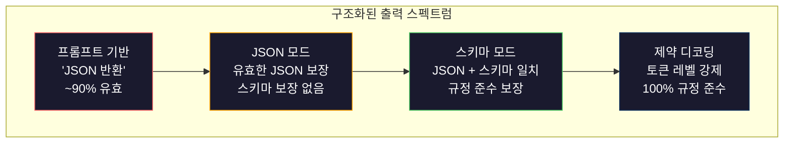
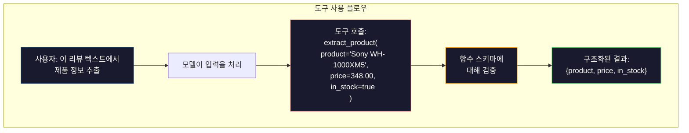

# 구조화된 출력: JSON, 스키마 검증, 제약 디코딩

> LLM은 문자열을 반환합니다. 애플리케이션에는 JSON이 필요합니다. 그 격차는 어떤 모델 할루시네이션보다 더 많은 프로덕션 시스템을クラッシュ시켰습니다. 구조화된 출력은 자연어와 타입이 지정된 데이터 사이의 다리입니다. 올바르게 하면 LLM이 신뢰할 수 있는 API가 됩니다. 잘못하면 새벽 3시에 regex로 자유 텍스트를 파싱하고 있습니다.

**유형:** 실습
**언어:** Python
**선수 과목:** Phase 10, Lessons 01-05 (LLMs from Scratch)
**소요 시간:** ~90분
**관련:** Phase 5 · 20 (Structured Outputs & Constrained Decoding) 은 디코더 레벨 이론(FSM/CFG logit 프로세서, Outlines, XGrammar)을 다룹니다. 이 단원은 프로덕션 SDK 표면(OpenAI `response_format`, Anthropic tool use, Instructor)에 집중합니다. API 아래에서 무슨 일이 일어나는지 이해하려면 먼저 Phase 5 · 20을 읽으세요.

## 학습 목표

- OpenAI 및 Anthropic API 파라미터를 사용하여 JSON 모드 및 스키마 제약 출력을 구현
- 형식이 잘못된 LLM 출력을 거부하고 오류 피드백으로 재시도하는 Pydantic 검증 레이어 구축
- 사후 처리 없이 토큰 레벨에서 유효한 JSON을 강제하는 제약 디코딩의 작동 방식 설명
- 비정형 텍스트를 타입이 지정된 데이터 구조로 신뢰할 수 있게 변환하는 강력한 추출 프롬프트 설계

## 문제

LLM에 묻습니다: "이 텍스트에서 제품 이름, 가격 및 가용성을 추출하세요." 다음과 같이 응답합니다:

```
이 제품은 Sony WH-1000XM5 헤드폰으로, $348.00에 판매 중이며 현재 재고가 있습니다.
```

이는 완전히 올바른 답변입니다. 그러나 애플리케이션에 완전히 쓸모없습니다. 재고 시스템에는 `{"product": "Sony WH-1000XM5", "price": 348.00, "in_stock": true}`이 필요합니다. 특정 키, 특정 타입 및 특정 값 제약 조건이 있는 JSON 객체가 필요합니다. 문장이 필요한 것이 아닙니다.

순진한 해결책: 프롬프트에 "JSON으로 응답"이라고 추가합니다. 이것은 90%의 시간에 작동합니다. 나머지 10%에서 모델은 JSON을 마크다운 코드 펜스에 감싸거나, "다음은 JSON입니다:"와 같은 서론을 추가하거나, 초기 대괄호를 일찍 닫아 구문적으로 유효하지 않은 JSON을 생성합니다. JSON 파서가クラッシュ합니다. 파이프라인이 끊어집니다. try/except와 재시도 루프를 추가합니다. 재시도는 가끔 다른 데이터를 생성합니다. 이제 파싱 문제 위에 일관성 문제가 있습니다.

이것은 프롬프트 엔지니어링 문제가 아닙니다. 디코딩 문제입니다. 모델은 왼쪽에서 오른쪽으로 토큰을 생성합니다. 각 위치에서 100K+ 옵션의 어휘에서 가장 가능성 있는 다음 토큰을 선택합니다. 이러한 옵션 중 대부분은 어떤 위치에서든 유효하지 않은 JSON을 생성할 것입니다. 모델이 `{"price":`만.emit하면 다음 토큰은 숫자, 따옴표(문자열용), `null`, `true`, `false` 또는 마이너스 기호여야 합니다. 다른 것은 모두 유효하지 않은 JSON을 생성합니다. 제약이 없으면 모델은 구문적으로 catastrophically 잘못된 매우 합리적인 영어 단어를 선택할 수 있습니다.

## 개념

### 구조화된 출력 스펙트럼

네 가지 수준의 구조화된 출력 제어, 각각이 이전보다 더 신뢰할 수 있습니다.



**프롬프트 기반** ("유효한 JSON으로 응답"): 시행 없음. 모델은 usually 준수하지만 sometimes 하지 않습니다. 신뢰성: ~90%. 실패 모드: 마크다운 펜스, 서론 텍스트, 잘린 출력, 잘못된 구조.

**JSON 모드**: API가 출력이 유효한 JSON임을 보장합니다. OpenAI의 `response_format: { type: "json_object" }`가 이를 활성화합니다. 출력은 오류 없이 파싱됩니다. 그러나 예상 스키마와 일치하지 않을 수 있습니다.额外的 키, 잘못된 타입, 누락된 필드.

**스키마 모드**: API는 JSON 스키마를 가져와 출력이 일치함을 보장합니다. 2026년 모든 주요 제공자가 이를 기본적으로 지원합니다: OpenAI의 `response_format: { type: "json_schema", json_schema: {...} }` (또한 `tool_choice="required"`로), Anthropic의 `input_schema`가 있는 tool use, Gemini의 `response_schema` + `response_mime_type: "application/json"`. 출력에는 지정한 정확한 키, 타입 및 제약 조건이 있습니다.

**제약 디코딩**: 생성 중 각 토큰 위치에서 디코더는 유효하지 않은 출력을 생성할 모든 토큰을 마스크 아웃합니다. 스키마에 숫자가 필요하고 모델이 문자를.emit하려는 경우 해당 토큰의 확률이 0으로 설정됩니다. 모델은 유효한 출력으로 이어지는 토큰만 생성할 수 있습니다. 이것이 OpenAI의 구조화된 출력 모드와 Outlines 및 Guidance 같은 라이브러리가 내부적으로 구현하는 방식입니다.

### JSON Schema: 계약 언어

JSON Schema는 모델(또는 검증 레이어)에 출력의 모양을 알려주는 방법입니다. 모든 주요 구조화된 출력 시스템이 이를 사용합니다.

```json
{
  "type": "object",
  "properties": {
    "product": { "type": "string" },
    "price": { "type": "number", "minimum": 0 },
    "in_stock": { "type": "boolean" },
    "categories": {
      "type": "array",
      "items": { "type": "string" }
    }
  },
  "required": ["product", "price", "in_stock"]
}
```

이 스키마는 문자열 `product`, 음수가 아닌 숫자 `price`, 부울 `in_stock` 및 선택적 문자열 `categories` 배열이 있는 객체여야 함을 나타냅니다. 일치하지 않는 모든 출력은 거부됩니다.

스키마는 어려운 케이스를 처리합니다: 중첩된 객체, 타입이 지정된 항목이 있는 배열, enum(문자열을 특정 값으로 제약), 패턴 일치(문자열의 regex) 및 combinator(다형성 출력을 위한 oneOf, anyOf, allOf).

### Pydantic 패턴

Python에서는 JSON 스키마를 수동으로 작성하지 않습니다. Pydantic 모델을 정의하면 스키마를 생성합니다.

```python
from pydantic import BaseModel

class Product(BaseModel):
    product: str
    price: float
    in_stock: bool
    categories: list[str] = []
```

이것은 위와 동일한 JSON 스키마를 생성합니다. Instructor 라이브러리(및 OpenAI의 SDK)는 Pydantic 모델을 직접 수락합니다: 모델 클래스를 전달하면 검증된 인스턴스를 다시 얻습니다. LLM 출력이 일치하지 않으면 Instructor은 자동으로 재시도합니다.

### 함수 호출 / 도구 사용

같은 문제에 대한 대체 인터페이스입니다. 모델에 직접 JSON을 생성하도록 요청하는 대신, 타입이 지정된 파라미터가 있는 "도구"(함수)를 정의합니다. 모델은 구조화된 인자로 함수 호출을 출력합니다. OpenAI는 이것을 "function calling"이라고 합니다. Anthropic은 "tool use"라고 합니다. 결과는 동일합니다: 구조화된 데이터.



도구 사용은 모델이 어떤 함수를 호출할지 선택해야 할 때(파라미터를 채우는 것만으로 충분한 경우) 선호됩니다. 10개의 다른 추출 스키마가 있고 모델이 입력에 따라 올바른 스키마를 선택해야 하는 경우 도구 사용은 스키마 선택과 구조화된 출력을 모두 제공합니다.

### 일반적인 실패 모드

스키마 시행이 있어도 구조화된 출력은 미묘한 방식으로 실패할 수 있습니다.

**할루시네이션된 값**: 출력이 스키마와 일치하지만 발명된 데이터가 포함됩니다. 텍스트에 $348라고 나와 있을 때 모델이 `{"price": 299.99}`를 생성합니다. 스키마 검증은 이것을 포착할 수 없습니다. 타입이 올바르고 값이 잘못되었습니다.

**Enum 혼동**: 필드를 `["in_stock", "out_of_stock", "preorder"]`로 제약합니다. 모델이 `"available"`을 출력합니다. 의미론적으로는 올바르지만 허용된 세트에 없습니다. 좋은 제약 디코딩은 이것을 방지합니다. 프롬프트 기반 접근법은 방지하지 않습니다.

**중첩된 객체 깊이**: 깊이 중첩된 스키마(4+ 레벨)가 더 많은 오류를 생성합니다. 중첩의 각 레벨은 모델이 구조를 놓칠 수 있는 또 다른 곳입니다.

**배열 길이**: 모델이 배열에 너무 많거나 너무 적은 항목을 생성할 수 있습니다. 스키마는 `minItems`와 `maxItems`를 지원하지만 모든 제공자가 디코딩 레벨에서 시행하는 것은 아닙니다.

**선택적 필드 생략**: 모델이 기술적으로 선택적이지만 사용 사례에 의미론적으로 중요한 필드를 생략합니다. 데이터가 sometimes 누락되더라도 스키마에서 필수로 설정하세요. 모델에 명시적으로 `null`을 생성하도록 강제합니다.

## 실습

### 단계 1: JSON 스키마 검증기

Python 객체가 JSON 스키마와 일치하는지 확인하는 검증기를 처음부터 구축합니다. 이것은 규정 준수를 확인하기 위해 출력側で実行されます.

```python
import json

def validate_schema(data, schema):
    errors = []
    _validate(data, schema, "", errors)
    return errors

def _validate(data, schema, path, errors):
    schema_type = schema.get("type")

    if schema_type == "object":
        if not isinstance(data, dict):
            errors.append(f"{path}: expected object, got {type(data).__name__}")
            return
        for key in schema.get("required", []):
            if key not in data:
                errors.append(f"{path}.{key}: required field missing")
        properties = schema.get("properties", {})
        for key, value in data.items():
            if key in properties:
                _validate(value, properties[key], f"{path}.{key}", errors)

    elif schema_type == "array":
        if not isinstance(data, list):
            errors.append(f"{path}: expected array, got {type(data).__name__}")
            return
        min_items = schema.get("minItems", 0)
        max_items = schema.get("maxItems", float("inf"))
        if len(data) < min_items:
            errors.append(f"{path}: array has {len(data)} items, minimum is {min_items}")
        if len(data) > max_items:
            errors.append(f"{path}: array has {len(data)} items, maximum is {max_items}")
        items_schema = schema.get("items", {})
        for i, item in enumerate(data):
            _validate(item, items_schema, f"{path}[{i}]", errors)

    elif schema_type == "string":
        if not isinstance(data, str):
            errors.append(f"{path}: expected string, got {type(data).__name__}")
            return
        enum_values = schema.get("enum")
        if enum_values and data not in enum_values:
            errors.append(f"{path}: '{data}' not in allowed values {enum_values}")

    elif schema_type == "number":
        if not isinstance(data, (int, float)):
            errors.append(f"{path}: expected number, got {type(data).__name__}")
            return
        minimum = schema.get("minimum")
        maximum = schema.get("maximum")
        if minimum is not None and data < minimum:
            errors.append(f"{path}: {data} is less than minimum {minimum}")
        if maximum is not None and data > maximum:
            errors.append(f"{path}: {data} is greater than maximum {maximum}")

    elif schema_type == "boolean":
        if not isinstance(data, bool):
            errors.append(f"{path}: expected boolean, got {type(data).__name__}")

    elif schema_type == "integer":
        if not isinstance(data, int) or isinstance(data, bool):
            errors.append(f"{path}: expected integer, got {type(data).__name__}")
```

### 단계 2: Pydantic 스타일 모델 대 스키마

최소 класс-투-스키마 변환기를 구축합니다. Python 클래스를 정의하고 해당 JSON 스키마를 자동으로 생성합니다.

```python
class SchemaField:
    def __init__(self, field_type, required=True, default=None, enum=None, minimum=None, maximum=None):
        self.field_type = field_type
        self.required = required
        self.default = default
        self.enum = enum
        self.minimum = minimum
        self.maximum = maximum

def python_type_to_schema(field):
    type_map = {
        str: "string",
        int: "integer",
        float: "number",
        bool: "boolean",
    }

    schema = {}

    if field.field_type in type_map:
        schema["type"] = type_map[field.field_type]
    elif field.field_type == list:
        schema["type"] = "array"
        schema["items"] = {"type": "string"}
    elif isinstance(field.field_type, dict):
        schema = field.field_type

    if field.enum:
        schema["enum"] = field.enum
    if field.minimum is not None:
        schema["minimum"] = field.minimum
    if field.maximum is not None:
        schema["maximum"] = field.maximum

    return schema

def model_to_schema(name, fields):
    properties = {}
    required = []

    for field_name, field in fields.items():
        properties[field_name] = python_type_to_schema(field)
        if field.required:
            required.append(field_name)

    return {
        "type": "object",
        "properties": properties,
        "required": required,
    }
```

### 단계 3: 제약 토큰 필터

제약 디코딩을 시뮬레이션합니다. 부분 JSON 문자열과 스키마가 주어지면 현재 위치에서 유효한 토큰 범주를 결정합니다.

```python
def next_valid_tokens(partial_json, schema):
    stripped = partial_json.strip()

    if not stripped:
        return ["{"]

    try:
        json.loads(stripped)
        return ["<EOS>"]
    except json.JSONDecodeError:
        pass

    last_char = stripped[-1] if stripped else ""

    if last_char == "{":
        return ['"', "}"]
    elif last_char == '"':
        if stripped.endswith('":'):
            return ['"', "0-9", "true", "false", "null", "[", "{"]
        return ["a-z", '"']
    elif last_char == ":":
        return [" ", '"', "0-9", "true", "false", "null", "[", "{"]
    elif last_char == ",":
        return [" ", '"', "{", "["]
    elif last_char in "0123456789":
        return ["0-9", ".", ",", "}", "]"]
    elif last_char == "}":
        return [",", "}", "]", "<EOS>"]
    elif last_char == "]":
        return [",", "}", "<EOS>"]
    elif last_char == "[":
        return ['"', "0-9", "true", "false", "null", "{", "[", "]"]
    else:
        return ["any"]

def demonstrate_constrained_decoding():
    partial_states = [
        '',
        '{',
        '{"product"',
        '{"product":',
        '{"product": "Sony"',
        '{"product": "Sony",',
        '{"product": "Sony", "price":',
        '{"product": "Sony", "price": 348',
        '{"product": "Sony", "price": 348}',
    ]

    print(f"{'Partial JSON':<45} {'Valid Next Tokens'}")
    print("-" * 80)
    for state in partial_states:
        valid = next_valid_tokens(state, {})
        display = state if state else "(empty)"
        print(f"{display:<45} {valid}")
```

### 단계 4: 추출 파이프라인

모든 것을 추출 파이프라인으로 결합: 스키마 정의, LLM이 구조화된 출력을 생성하는 시뮬레이션, 출력 검증 및 재처리 처리.

```python
def simulate_llm_extraction(text, schema, attempt=0):
    if "headphones" in text.lower() or "sony" in text.lower():
        if attempt == 0:
            return '{"product": "Sony WH-1000XM5", "price": 348.00, "in_stock": true, "categories": ["audio", "headphones"]}'
        return '{"product": "Sony WH-1000XM5", "price": 348.00, "in_stock": true}'

    if "laptop" in text.lower():
        return '{"product": "MacBook Pro 16", "price": 2499.00, "in_stock": false, "categories": ["computers"]}'

    return '{"product": "Unknown", "price": 0, "in_stock": false}'

def extract_with_retry(text, schema, max_retries=3):
    for attempt in range(max_retries):
        raw = simulate_llm_extraction(text, schema, attempt)

        try:
            data = json.loads(raw)
        except json.JSONDecodeError as e:
            print(f"  시도 {attempt + 1}: JSON 파싱 오류 -- {e}")
            continue

        errors = validate_schema(data, schema)
        if not errors:
            return data

        print(f"  시도 {attempt + 1}: 스키마 검증 오류 -- {errors}")

    return None

product_schema = {
    "type": "object",
    "properties": {
        "product": {"type": "string"},
        "price": {"type": "number", "minimum": 0},
        "in_stock": {"type": "boolean"},
        "categories": {"type": "array", "items": {"type": "string"}},
    },
    "required": ["product", "price", "in_stock"],
}
```

### 단계 5: 전체 파이프라인 실행

```python
def run_demo():
    print("=" * 60)
    print("  구조화된 출력 파이프라인 데모")
    print("=" * 60)

    print("\n--- 스키마 정의 ---")
    product_fields = {
        "product": SchemaField(str),
        "price": SchemaField(float, minimum=0),
        "in_stock": SchemaField(bool),
        "categories": SchemaField(list, required=False),
    }
    generated_schema = model_to_schema("Product", product_fields)
    print(json.dumps(generated_schema, indent=2))

    print("\n--- 스키마 검증 ---")
    test_cases = [
        ({"product": "Test", "price": 10.0, "in_stock": True}, "유효한 객체"),
        ({"product": "Test", "price": -5.0, "in_stock": True}, "음수 가격"),
        ({"product": "Test", "in_stock": True}, "가격 누락"),
        ({"product": "Test", "price": "ten", "in_stock": True}, "문자열로 가격"),
        ("not an object", "객체 대신 문자열"),
    ]

    for data, label in test_cases:
        errors = validate_schema(data, product_schema)
        status = "통과" if not errors else f"실패: {errors}"
        print(f"  {label}: {status}")

    print("\n--- 제약 디코딩 시뮬레이션 ---")
    demonstrate_constrained_decoding()

    print("\n--- 추출 파이프라인 ---")
    texts = [
        "Sony WH-1000XM5 헤드폰은 $348에 판매 중이며 현재 이용 가능합니다.",
        "새 MacBook Pro 16인치 노트북은 $2499이지만 품절되었습니다.",
        "이것은 제품 정보가 없는 무작위 문장입니다.",
    ]

    for text in texts:
        print(f"\n  입력: {text[:60]}...")
        result = extract_with_retry(text, product_schema)
        if result:
            print(f"  출력: {json.dumps(result)}")
        else:
            print(f"  출력: 재시도 후 실패")
```

## 활용

### OpenAI 구조화된 출력

```python
# from openai import OpenAI
# from pydantic import BaseModel
#
# client = OpenAI()
#
# class Product(BaseModel):
#     product: str
#     price: float
#     in_stock: bool
#
# response = client.beta.chat.completions.parse(
#     model="gpt-5-mini",
#     messages=[
#         {"role": "system", "content": "제품 정보를 추출하세요."},
#         {"role": "user", "content": "Sony WH-1000XM5, $348, 재고 있음"},
#     ],
#     response_format=Product,
# )
#
# product = response.choices[0].message.parsed
# print(product.product, product.price, product.in_stock)
```

OpenAI의 구조화된 출력 모드는 내부적으로 제약 디코딩을 사용합니다. 모델이 생성하는 모든 토큰은 Pydantic 스키마와 일치하는 출력을 생성할 것이 보장됩니다. 재시도 필요 없음. 검증 필요 없음. 제약이 디코딩 프로세스에 베이킹되었습니다.

### Anthropic 도구 사용

```python
# import anthropic
#
# client = anthropic.Anthropic()
#
# response = client.messages.create(
#     model="claude-opus-4-7",
#     max_tokens=1024,
#     tools=[{
#         "name": "extract_product",
#         "description": "텍스트에서 제품 정보 추출",
#         "input_schema": {
#             "type": "object",
#             "properties": {
#                 "product": {"type": "string"},
#                 "price": {"type": "number"},
#                 "in_stock": {"type": "boolean"},
#             },
#             "required": ["product", "price", "in_stock"],
#         },
#     }],
#     messages=[{"role": "user", "content": "추출: Sony WH-1000XM5, $348, 재고 있음"}],
# )
```

Anthropic은 도구 사용을 통해 구조화된 출력을 달성합니다. 모델은 input_schema와 일치하는 구조화된 인자로 도구 호출을.emit합니다. 같은 결과, 다른 API 표면.

### Instructor 라이브러리

```python
# pip install instructor
# import instructor
# from openai import OpenAI
# from pydantic import BaseModel
#
# client = instructor.from_openai(OpenAI())
#
# class Product(BaseModel):
#     product: str
#     price: float
#     in_stock: bool
#
# product = client.chat.completions.create(
#     model="gpt-5-mini",
#     response_model=Product,
#     messages=[{"role": "user", "content": "Sony WH-1000XM5, $348, 재고 있음"}],
# )
```

Instructor는 자동 재시도와 검증으로 유효한 Pydantic 인스턴스를 반환하기 위해 모든 LLM 클라이언트를 래핑합니다. 첫 번째 시도가 검증에 실패하면 오류를 피드백으로 다시 모델에 보내 출력을 수정하도록 요청합니다. OpenAI뿐만 아니라 모든 제공자와 함께 작동합니다.

## 결과물

이 단원은 `outputs/prompt-structured-extractor.md`를 생성합니다. 스키마 정의가 주어지면 비정형 텍스트에서 구조화된 데이터를 추출하는 재사용 가능한 프롬프트 템플릿입니다. JSON 스키마와 비정형 텍스트를 제공하고 검증된 JSON을 다시 얻습니다.

`outputs/skill-structured-outputs.md`도 생성합니다. 제공자, 신뢰성 요구사항 및 스키마 복잡도에 따라 올바른 구조화된 출력 전략을 선택하기 위한 결정 프레임워크입니다.

## 연습 문제

1. `oneOf`(데이터가 여러 스키마 중 정확히 하나와 일치해야 함)를 지원하도록 스키마 검증기를 확장하세요. 이것은 다형성 출력을 처리합니다. 예를 들어, `Product` 또는 `Service` 객체(다른 모양)일 수 있는 필드를 처리합니다.

2. 두 스키마를 비교하고 breaking 변경(제거된 필수 필드, 변경된 타입)과 non-breaking 변경(추가된 선택적 필드, 느슨해진 제약)을 식별하는 "스키마 diff" 도구를 구축하세요. 이것은 프로덕션에서 추출 스키마를 버전 관리하는 데 필수적입니다.

3. 더 현실적인 제약 디코딩 시뮬레이터를 구현하세요. 100개의 토큰 어휘(문자, 숫자, 문장부호, 키워드)가 있는 JSON 스키마가 주어지면 생성 단계별로 단계별로 진행하여 각 위치에서 유효하지 않은 토큰을 마스킹합니다. 각 단계에서 어휘의 몇 퍼센트가 유효한지 측정합니다.

4. 추출 평가 스위트를 구축하세요. 손으로 레이블이 지정된 JSON 출력이 있는 50개의 제품 설명을 만드세요. 50개 모두에서 추출 파이프라인을 실행하고 완전 일치, 필드 수준 정확도 및 타입 준수를 측정합니다. 어떤 필드가 추출하기 가장 어려운지 식별합니다.

5. 추출 파이프라인에 "신뢰도 점수"를 추가하세요. 각 추출된 필드에 대해 모델의 신뢰도를 추정합니다(토큰 확률 based 또는 3번 실행하여 일관성 측정). 낮은 신뢰도 필드를 인간 검토를 위해 플래그합니다.

## 핵심 용어

| 용어 |人们在说什么 |실제로 의미하는 것 |
|------|----------------|----------------------|
| JSON 모드 | "JSON 반환" | 구문적으로 유효한 JSON 출력을 보장하지만 특정 스키마를 시행하지 않는 API 플래그 |
| 구조화된 출력 | "타입이 지정된 JSON" | 올바른 키, 타입 및 제약 조건이 있는 특정 JSON 스키마와 일치하는 출력 |
| 제약 디코딩 | "안내된 생성" | 각 토큰 위치에서 유효하지 않은 출력을 생성할 토큰을 마스킹 -- 100% 스키마 규정 준 보장 |
| JSON Schema | "JSON 템플릿" | JSON数据的结构, 타입 및 제약条件を記述하기 위한 선언적 언어 (OpenAPI, JSON Forms 등에서 사용) |
| Pydantic | "Python 데이터 클래스+" | FastAPI 및 Instructor가 JSON 스키마 생성을 위해 사용하는 타입 검증이 있는 Python 데이터 모델 라이브러리 |
| 함수 호출 | "도구 사용" | LLM이 자유 텍스트 대신 구조화된 함수 호출(이름 + 타입이 지정된 인자)을 출력 -- OpenAI와 Anthropic 모두 지원 |
| Instructor | "LLM용 Pydantic" | 실패 시 자동 재시도로 유효한 Pydantic 인스턴스를 반환하도록 LLM 클라이언트를 래핑하는 Python 라이브러리 |
| 토큰 마스킹 | "어휘 필터링" | 생성 중 특정 토큰 확률을 0으로 설정하여 모델이它们를 생성할 수 없게 함 |
| 스키마 규정 준수 | "모양과 일치" | 출력에 모든 필수 필드, 올바른 타입, 제약 조건 내의 값이 있고 추가 허용되지 않은 필드가 없음 |
| 재시도 루프 | "작동할 때까지 다시 시도" | 검증 오류를 다시 모델에 보내 출력을 수정하도록 요청 -- Instructor가 자동으로, 구성 가능한 최대까지 수행 |

## 추가 자료

- [OpenAI Structured Outputs Guide](https://platform.openai.com/docs/guides/structured-outputs) -- OpenAI API에서 JSON 스키마 기반 제약 디코딩에 대한 공식 문서
- [Willard & Louf, 2023 -- "Efficient Guided Generation for Large Language Models"](https://arxiv.org/abs/2307.09702) -- 토큰 레벨 제약으로 JSON 스키마를 유한 상태 기계로 컴파일하는 방법을 설명하는 Outlines 논문
- [Instructor documentation](https://python.useinstructor.com/) -- Pydantic 검증 및 재시도로 모든 LLM에서 구조화된 출력을 얻는 표준 라이브러리
- [Anthropic Tool Use Guide](https://docs.anthropic.com/en/docs/tool-use) -- JSON Schema input_schema가 있는 도구 사용을 통해 Claude가 구조화된 출력을 구현하는 방법
- [JSON Schema specification](https://json-schema.org/) -- 모든 주요 구조화된 출력 시스템에서 사용하는 스키마 언어의 전체 사양
- [Outlines library](https://github.com/outlines-dev/outlines) -- regex 및 JSON 스키마를 유한 상태 기계로 컴파일하는 오픈소스 제약 생성
- [Dong et al., "XGrammar: Flexible and Efficient Structured Generation Engine for Large Language Models" (MLSys 2025)](https://arxiv.org/abs/2411.15100) -- 현재最先进的 grammar 엔진; ~100 ns / 토큰으로 토큰을 마스킹하는pushdown 자동자 컴파일.
- [Beurer-Kellner et al., "Prompting Is Programming: A Query Language for Large Language Models" (LMQL)](https://arxiv.org/abs/2212.06094) -- 타입 및 값 제약 조건이 있는 쿼리 언어로 제약 디코딩을 프레임하는 LMQL 논문.
- [Microsoft Guidance (framework docs)](https://github.com/guidance-ai/guidance) -- 템플릿 기반 제약 생성; Outlines 및 XGrammar의 공급자 구애받지 않는 보완.