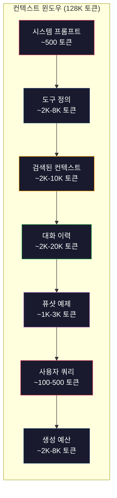
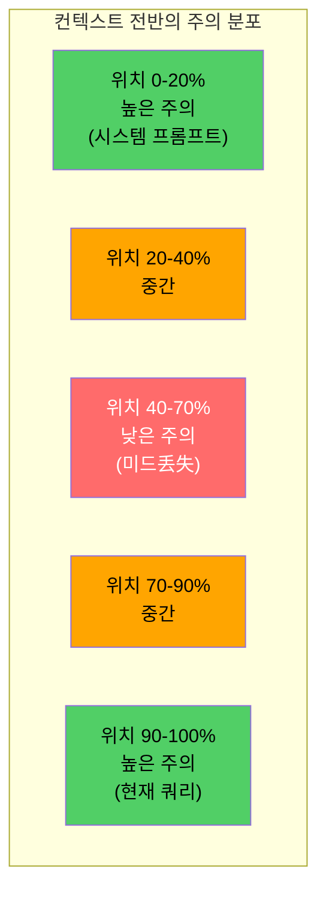
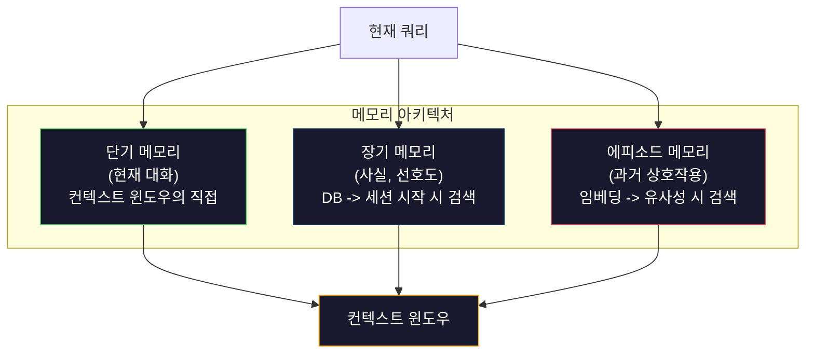

# 컨텍스트 엔지니어링: 윈도우, 예산, 메모리 및 검색

> 프롬프트 엔지니어링은 부분 집합입니다. 컨텍스트 엔지니어링이 전체 게임입니다. 프롬프트는 입력하는 문자열입니다. 컨텍스트는 모델의 윈도우에 들어가는 모든 것입니다: 시스템 지시사항, 검색된 문서, 도구 정의, 대화 이력, 퓨샷 예제 및 프롬프트 자체. 2026년 최고의 AI 엔지니어는 컨텍스트 엔지니어입니다. 그들은 무엇을 넣을지, 무엇을 빼둘지, 어떤 순서로 할지를 결정합니다.

**유형:** 실습
**언어:** Python
**선수 과목:** Phase 10 (LLMs from Scratch), Phase 11 Lesson 01-02
**소요 시간:** ~90분
**관련:** Phase 11 · 15 (Prompt Caching) -- 캐시 친화적 레이아웃은 컨텍스트 엔지니어링의 확장입니다. Phase 5 · 28 (Long-Context Evaluation)는 NIAH/RULER로 미드丢失를 측정하는 방법을 다룹니다.

## 학습 목표

- 모든 컨텍스트 윈도우 구성 요소(시스템 프롬프트, 도구, 이력, 검색된 문서, 생성 공간)에 대한 토큰 예산 계산
- 대화 이력을 위한 트렁케이션, 요약 및 슬라이딩 윈도우와 같은 컨텍스트 윈도우 관리 전략 구현
- 가장 관련성 높은 정보에 대한 모델의 주의를 최대화하기 위해 컨텍스트 구성 요소를 우선순위화하고 순서 지정
- 쿼리 유형 및 사용 가능한 윈도우 공간을 기반으로 토큰을 동적으로 할당하는 컨텍스트 어셈블러 구축

## 문제

Claude Opus 4.7은 200K 토큰 윈도우(beta로 1M)가 있습니다. GPT-5는 400K입니다. Gemini 3 Pro는 2M입니다. Llama 4는 10M라고 주장합니다. 이 숫자는 채울 때까지 엄청나 보입니다.

다음은 코딩 어시스턴트의 실제 분석입니다. 시스템 프롬프트: 500 토큰. 50개 도구에 대한 도구 정의: 8,000 토큰. 검색된 문서: 4,000 토큰. 대화 이력(10턴): 6,000 토큰. 현재 사용자 쿼리: 200 토큰. 생성 예산(최대 출력): 4,000 토큰. 총: 22,700 토큰. 이는 128K 윈도우의 18%입니다.

그러나 주의는 컨텍스트 길이와 선형적으로 비례하지 않습니다. 128K 토큰 컨텍스트가 있는 모델은 2차 주의 비용(vanilla transformer에서 O(n^2), 대부분의 프로덕션 모델은 효율적인 주의 변형을 사용)을 지불합니다. 더 중요한 것은 검색 정확도가 저하된다는 것입니다. "건초 더미에서 바늘" 테스트는 모델이 긴 컨텍스트 중간에 배치된 정보를 찾는 데 어려움을 겪음을 보여줍니다. Liu et al. (2023)의 연구는 LLMs가 긴 컨텍스트의 시작과 끝에서 거의 완벽한 정확도로 정보를 검색하지만 중간에 배치된 정보(컨텍스트의 40-70% 위치)의 정확도가 10-20% 저하됨을 보여주었습니다. 이 "미드丢失" 효과는 모델마다 다르지만 모든 현재 아키텍처에 영향을 미칩니다.

실용적인 교훈: 200K 토큰을 사용할 수 있다는 것이 200K 토큰을 사용하는 것이 효과적이라는 것을 의미하지 않습니다. 신중하게 선택된 10K 토큰 컨텍스트가 often 덤프된 100K 토큰 컨텍스트보다 성능이 좋습니다. 컨텍스트 엔지니어링은 컨텍스트 윈도우 내에서 신호 대 잡음비를 최대화하는 분야입니다.

윈도우에 넣는 모든 토큰은 더 관련성 높은 정보를 담을 수 있었던 토큰을 deslocates. 모든 관련 없는 도구 정의, 모든 오래된 대화 턴, 질문에 답하지 않는 검색된 텍스트의 모든 청크 -- 각각이 작업에서 모델을 조금씩 나쁘게 만듭니다.

## 개념

### 컨텍스트 윈도우는 부족한 자원입니다

컨텍스트 윈도우를 RAM으로, 디스크가 아닌 것으로 생각하세요. 빠르고 직접 접근 가능하지만 제한적입니다. 모든 것을 담을 수 없습니다. 선택해야 합니다.



각 구성 요소가 공간을 차지합니다. 더 많은 도구 정의를 추가하면 대화 이력 공간이 줄어듭니다. 더 많은 검색된 컨텍스트를 추가하면 퓨샷 예제 공간이 줄어듭니다. 컨텍스트 엔지니어링은 작업 성능을 최대화하기 위해 이 예산을 할당하는 예술입니다.

### 미드丢失

컨텍스트 엔지니어링에서 가장 중요한 경험적 발견. 모델은 컨텍스트의 시작과 끝에 있는 정보에 더 잘 attend합니다. 중간에 있는 정보는 더 낮은 주의 점수를 받고 무시될 가능성이 더 높습니다.

Liu et al. (2023)이 이것을 체계적으로 테스트했습니다. 그들은 관련 문서를 다양한 위치에 20개의 관련 없는 문서 사이에 놓고 답변 정확도를 측정했습니다. 관련 문서가 첫 번째 또는 마지막일 때 정확도는 85-90%였습니다. 중간(20개 중 10번째 위치)에 있을 때 정확도는 60-70%로 떨어졌습니다.

이것은 직접적인 엔지니어링 함축을 가집니다:

- 가장 중요한 정보를 먼저 배치합니다(시스템 프롬프트, 중요한 지시사항)
- 현재 쿼리와 가장 관련성 높은 컨텍스트를 마지막에 배치합니다(최근성 편향이 도움됨)
- 컨텍스트의 중간을最低 우선순위 영역으로 취급합니다
- 중간에 정보를 포함해야 하는 경우 핵심 포인트를 끝에 중복합니다



### 컨텍스트 구성 요소

**시스템 프롬프트**: 페르소나, 제약 조건 및 행동 규칙을 설정합니다. 이것이 먼저 가고 턴 전반에 걸쳐 constant로 유지됩니다. Claude Code는 도구 정의 및 행동 지시사항을 포함하여 약 6,000 토큰의 시스템 프롬프트를 사용합니다. 그것을 단단하게 유지하세요. 시스템 프롬프트의 모든 단어가 모든 API 호출에 반복됩니다.

**도구 정의**: 각 도구는 50-200 토큰(이름, 설명, 파라미터 스키마)을 추가합니다. 도구당 150토큰에서 50개 도구는 대화가 시작되기 전에 7,500 토큰입니다. 동적 도구 선택 -- 현재 쿼리와 관련된 도구만 포함 -- 이를 60-80% 줄일 수 있습니다.

**검색된 컨텍스트**: 벡터 데이터베이스, 검색 결과, 파일 내용의 문서. 검색 품질이 직접 응답 품질을 결정합니다. 나쁜 검색은 검색 없음보다 나쁩니다. 창을 잡음으로 채우고 모델을積極的に 오도합니다.

**대화 이력**: 모든 이전 사용자 메시지 및 어시스턴트 응답. 대화 길이와 함께 선형적으로 증가합니다. 턴당 200토큰에서 50턴 대화는 10,000토큰의 이력입니다. 그 중 대부분은 현재 쿼리와 관련이 없습니다.

**퓨샷 예제**: 원하는 동작을 시연하는 입력/출력 쌍. 잘 선택된 2-3개의 예제가often数千 토큰의 지시사항보다 출력 품질을 더 향상시킵니다. 하지만 공간이 필요합니다.

**생성 예산**: 모델 응답을 위해 예약된 토큰. 윈도우를 용량으로 채우면 모델이 답변할 공간이 없습니다. 생성에至少 2,000-4,000 토큰을 예약하세요.

### 컨텍스트 압축 전략

**이력 요약**: 모든 이전 턴을 그대로 유지하는 대신 대화을 주기적으로 요약합니다. "X에 대해 논의했고, Y를 결정했으며, 사용자가 Z를 원합니다" 100토큰에서 2,000토큰이 걸린 10턴을 대체합니다. 이력이しきい値(예: 5,000 토큰)를 초과할 때 요약을 실행합니다.

**관련성 필터링**: 각 검색된 문서를 현재 쿼리에 대해 점수 매기고しきい値아래의 문서를 삭제합니다. 10개의 청크를 검색했지만 3개만 관련성이 있으면 다른 7개를 삭제합니다. 10개의 평범한 것보다 3개의 높은 관련성 청크가 낫습니다.

**도구 정리**: 사용자 쿼리 의도를 분류하고 해당 의도와 관련된 도구만 포함합니다. 코드 질문에는 캘린더 도구가 필요하지 않습니다. 일정 질문에는 파일 시스템 도구가 필요하지 않습니다. 이를 통해 도구 정의를 8,000 토큰에서 1,000으로 줄일 수 있습니다.

**재귀 요약**: 매우 긴 문서의 경우 단계별로 요약합니다. 먼저 각 섹션을 요약한 다음 요약을 요약합니다. 50페이지 문서가 핵심 포인트를 포착하는 500토큰 digest가 됩니다.

### 메모리 시스템

컨텍스트 엔지니어링은 세 가지 시간 지평에 걸쳐 있습니다.

**단기 메모리**: 현재 대화. 컨텍스트 윈도우에 직접 저장됩니다. 각 턴과 함께 증가합니다. 요약 및 트렁케이션으로 관리됩니다.

**장기 메모리**: 대화 전반에 걸쳐 지속되는 사실 및 선호도. "사용자는 TypeScript를 선호합니다." "프로젝트는 PostgreSQL을 사용합니다." 데이터베이스에 저장되고 세션 시작 시 검색됩니다. Claude Code는 이것을 CLAUDE.md 파일에 저장합니다. ChatGPT는 메모리 기능에 저장합니다.

**에피소드 메모리**: 현재 대화와 관련될 수 있는 특정 과거 상호작용. "지난 화요일, 인증 모듈에서 비슷한 문제를 디버깅했습니다." 임베딩으로 저장되고 현재 대화가 과거 에피소드와 유사할 때 검색됩니다.



### 동적 컨텍스트 어셈블리

핵심 통찰력: 다른 쿼리에는 다른 컨텍스트가 필요합니다. 정적 시스템 프롬프트 + 정적 도구 + 정적 이력은 낭비입니다. 최고의 시스템은 쿼리당 동적으로 컨텍스트를 어셈블리합니다.

1. 쿼리 의도를 분류합니다
2. 관련 도구를 선택합니다(모든 도구가 아님)
3. 관련 문서를 검색합니다(고정 세트가 아님)
4. 관련 이력 턴을 포함합니다(모든 이력이 아님)
5. 작업 유형과 일치하는 퓨샷 예제를 추가합니다
6. 모든 것을 중요도별로 순서 지정: 중요한 먼저, 중요한 마지막, 선택적 중간

이것이 좋은 AI 애플리케이션과 훌륭한 AI 애플리케이션을 분리하는 것입니다. 모델은 동일합니다. 컨텍스트가 차별화 요소입니다.

## 실습

### 단계 1: 토큰 카운터

측정할 수 없으면 예산을 책정할 수 없습니다. 간단한 토큰 카운터를 구축합니다(토큰化为 정확한 수는 tokenizer에 따라 다르므로 공백 분할 사용).

```python
import json
import numpy as np
from collections import OrderedDict

def count_tokens(text):
    if not text:
        return 0
    return int(len(text.split()) * 1.3)

def count_tokens_json(obj):
    return count_tokens(json.dumps(obj))
```

### 단계 2: 컨텍스트 예산 관리자

핵심 추상화. 예산 관리자가 각 구성 요소가 사용하는 토큰 수를 추적하고 제한을 시행합니다.

```python
class ContextBudget:
    def __init__(self, max_tokens=128000, generation_reserve=4000):
        self.max_tokens = max_tokens
        self.generation_reserve = generation_reserve
        self.available = max_tokens - generation_reserve
        self.allocations = OrderedDict()

    def allocate(self, component, content, max_tokens=None):
        tokens = count_tokens(content)
        if max_tokens and tokens > max_tokens:
            words = content.split()
            target_words = int(max_tokens / 1.3)
            content = " ".join(words[:target_words])
            tokens = count_tokens(content)

        used = sum(self.allocations.values())
        if used + tokens > self.available:
            allowed = self.available - used
            if allowed <= 0:
                return None, 0
            words = content.split()
            target_words = int(allowed / 1.3)
            content = " ".join(words[:target_words])
            tokens = count_tokens(content)

        self.allocations[component] = tokens
        return content, tokens

    def remaining(self):
        used = sum(self.allocations.values())
        return self.available - used

    def utilization(self):
        used = sum(self.allocations.values())
        return used / self.max_tokens

    def report(self):
        total_used = sum(self.allocations.values())
        lines = []
        lines.append(f"컨텍스트 예산 보고서 ({self.max_tokens:,} 토큰 윈도우)")
        lines.append("-" * 50)
        for component, tokens in self.allocations.items():
            pct = tokens / self.max_tokens * 100
            bar = "#" * int(pct / 2)
            lines.append(f"  {component:<25} {tokens:>6} 토큰 ({pct:>5.1f}%) {bar}")
        lines.append("-" * 50)
        lines.append(f"  {'사용됨':<25} {total_used:>6} 토큰 ({total_used/self.max_tokens*100:.1f}%)")
        lines.append(f"  {'생성 예약':<25} {self.generation_reserve:>6} 토큰")
        lines.append(f"  {'남은 것':<25} {self.remaining():>6} 토큰")
        return "\n".join(lines)
```

### 단계 3: 미드丢失 재정렬

재정렬 전략 구현: 가장 중요한 항목이 먼저와 마지막에 가고, 가장 덜 중요한 항목이 중간에 감니다.

```python
def reorder_lost_in_middle(items, scores):
    paired = sorted(zip(scores, items), reverse=True)
    sorted_items = [item for _, item in paired]

    if len(sorted_items) <= 2:
        return sorted_items

    first_half = sorted_items[::2]
    second_half = sorted_items[1::2]
    second_half.reverse()

    return first_half + second_half

def score_relevance(query, documents):
    query_words = set(query.lower().split())
    scores = []
    for doc in documents:
        doc_words = set(doc.lower().split())
        if not query_words:
            scores.append(0.0)
            continue
        overlap = len(query_words & doc_words) / len(query_words)
        scores.append(round(overlap, 3))
    return scores
```

### 단계 4: 대화 이력 압축기

오래된 대화 턴을 요약하여 토큰 예산을 되찾습니다.

```python
class ConversationManager:
    def __init__(self, max_history_tokens=5000):
        self.turns = []
        self.summaries = []
        self.max_history_tokens = max_history_tokens

    def add_turn(self, role, content):
        self.turns.append({"role": role, "content": content})
        self._compress_if_needed()

    def _compress_if_needed(self):
        total = sum(count_tokens(t["content"]) for t in self.turns)
        if total <= self.max_history_tokens:
            return

        while total > self.max_history_tokens and len(self.turns) > 4:
            old_turns = self.turns[:2]
            summary = self._summarize_turns(old_turns)
            self.summaries.append(summary)
            self.turns = self.turns[2:]
            total = sum(count_tokens(t["content"]) for t in self.turns)

    def _summarize_turns(self, turns):
        parts = []
        for t in turns:
            content = t["content"]
            if len(content) > 100:
                content = content[:100] + "..."
            parts.append(f"{t['role']}: {content}")
        return "이전: " + " | ".join(parts)

    def get_context(self):
        parts = []
        if self.summaries:
            parts.append("[대화 요약]")
            for s in self.summaries:
                parts.append(s)
        parts.append("[최근 대화]")
        for t in self.turns:
            parts.append(f"{t['role']}: {t['content']}")
        return "\n".join(parts)

    def token_count(self):
        return count_tokens(self.get_context())
```

### 단계 5: 동적 도구 선택기

현재 쿼리와 관련된 도구만 포함합니다. 의도를 분류한 다음 필터링합니다.

```python
TOOL_REGISTRY = {
    "read_file": {
        "description": "파일 내용 읽기",
        "tokens": 120,
        "categories": ["code", "files"],
    },
    "write_file": {
        "description": "파일 내용 쓰기",
        "tokens": 150,
        "categories": ["code", "files"],
    },
    "search_code": {
        "description": "코드베이스에서 패턴 검색",
        "tokens": 130,
        "categories": ["code"],
    },
    "run_command": {
        "description": "쉘 명령 실행",
        "tokens": 140,
        "categories": ["code", "system"],
    },
    "create_calendar_event": {
        "description": "새 캘린더 이벤트 생성",
        "tokens": 180,
        "categories": ["calendar"],
    },
    "list_emails": {
        "description": "최근 이메일 나열",
        "tokens": 160,
        "categories": ["email"],
    },
    "send_email": {
        "description": "이메일 메시지 전송",
        "tokens": 200,
        "categories": ["email"],
    },
    "web_search": {
        "description": "웹에서 정보 검색",
        "tokens": 140,
        "categories": ["research"],
    },
    "query_database": {
        "description": "데이터베이스에서 SQL 쿼리 실행",
        "tokens": 170,
        "categories": ["code", "data"],
    },
    "generate_chart": {
        "description": "데이터에서 차트 생성",
        "tokens": 190,
        "categories": ["data", "visualization"],
    },
}

def classify_intent(query):
    query_lower = query.lower()

    intent_keywords = {
        "code": ["code", "function", "bug", "error", "file", "implement", "refactor", "debug", "test"],
        "calendar": ["meeting", "schedule", "calendar", "appointment", "event"],
        "email": ["email", "mail", "send", "inbox", "message"],
        "research": ["search", "find", "what is", "how does", "explain", "look up"],
        "data": ["data", "query", "database", "chart", "graph", "analytics", "sql"],
    }

    scores = {}
    for intent, keywords in intent_keywords.items():
        score = sum(1 for kw in keywords if kw in query_lower)
        if score > 0:
            scores[intent] = score

    if not scores:
        return ["code"]

    max_score = max(scores.values())
    return [intent for intent, score in scores.items() if score >= max_score * 0.5]

def select_tools(query, token_budget=2000):
    intents = classify_intent(query)
    relevant = {}
    total_tokens = 0

    for name, tool in TOOL_REGISTRY.items():
        if any(cat in intents for cat in tool["categories"]):
            if total_tokens + tool["tokens"] <= token_budget:
                relevant[name] = tool
                total_tokens += tool["tokens"]

    return relevant, total_tokens
```

### 단계 6: 전체 컨텍스트 어셈블리 파이프라인

모든 것을 연결합니다. 쿼리가 주어지면 최적의 컨텍스트를 동적으로 어셈블리합니다.

```python
class ContextEngine:
    def __init__(self, max_tokens=128000, generation_reserve=4000):
        self.budget = ContextBudget(max_tokens, generation_reserve)
        self.conversation = ConversationManager(max_history_tokens=5000)
        self.system_prompt = (
            "당신은 코드 편집, 파일 관리, 웹 검색 및 데이터 분석을 위한 도구에 액세스할 수 있는 유용한 AI 어시스턴트입니다. "
            "각 작업에 적합한 도구를 사용하세요. 간결하고 정확하세요."
        )
        self.knowledge_base = [
            "Python 3.12는 괄호 표기법을 사용하여 제네릭 클래스에 대한 유형 파라미터 구문을 도입했습니다.",
            "프로젝트는 임베딩 저장소에 pgvector와 함께 PostgreSQL 16을 사용합니다.",
            "인증은 JWT 토큰으로 Supabase Auth에 의해 처리됩니다.",
            "프론트엔드는 App Router를 사용하는 Next.js 15로 구축되었습니다.",
            "API 속도 제한은 사용자당 분당 100요청으로 설정됩니다.",
            "배포 파이프라인은 Docker 다단계 빌드를 사용하는 GitHub Actions를 사용합니다.",
            "모든 새 모듈의 테스트 커버리지는 80% 이상이어야 합니다.",
            "코드베이스는 데이터 액세스를 위한 저장소 패턴을 따릅니다.",
        ]

    def assemble(self, query):
        self.budget = ContextBudget(self.budget.max_tokens, self.budget.generation_reserve)

        system_content, _ = self.budget.allocate("system_prompt", self.system_prompt, max_tokens=1000)

        tools, tool_tokens = select_tools(query, token_budget=2000)
        tool_text = json.dumps(list(tools.keys()))
        tool_content, _ = self.budget.allocate("tools", tool_text, max_tokens=2000)

        relevance = score_relevance(query, self.knowledge_base)
        threshold = 0.1
        relevant_docs = [
            doc for doc, score in zip(self.knowledge_base, relevance)
            if score >= threshold
        ]

        if relevant_docs:
            doc_scores = [s for s in relevance if s >= threshold]
            reordered = reorder_lost_in_middle(relevant_docs, doc_scores)
            doc_text = "\n".join(reordered)
            doc_content, _ = self.budget.allocate("retrieved_context", doc_text, max_tokens=3000)

        history_text = self.conversation.get_context()
        if history_text.strip():
            history_content, _ = self.budget.allocate("conversation_history", history_text, max_tokens=5000)

        query_content, _ = self.budget.allocate("user_query", query, max_tokens=500)

        return self.budget

    def chat(self, query):
        self.conversation.add_turn("user", query)
        budget = self.assemble(query)
        response = f"[{query[:50]}...]에 대한 응답"
        self.conversation.add_turn("assistant", response)
        return budget


def run_demo():
    print("=" * 60)
    print("  컨텍스트 엔지니어링 파이프라인 데모")
    print("=" * 60)

    engine = ContextEngine(max_tokens=128000, generation_reserve=4000)

    print("\n--- 쿼리 1: 코드 작업 ---")
    budget = engine.chat("JWT 토큰이 너무 일찍 만료되는 인증 모듈의 버그 수정")
    print(budget.report())

    print("\n--- 쿼리 2: 연구 작업 ---")
    budget = engine.chat("PostgreSQL에서 벡터 검색을 구현하는 가장 좋은 접근 방식은 무엇입니까?")
    print(budget.report())

    print("\n--- 쿼리 3: 대화 이력이 쌓인 후 ---")
    for i in range(8):
        engine.conversation.add_turn("user", f"시스템의 구현 세부사항에 대한 후속 질문 번호 {i+1}")
        engine.conversation.add_turn("assistant", f"아키텍처에 대한 기술적 세부사항과 함께 후속 질문 {i+1}에 대한 응답")

    budget = engine.chat("이제 논의한 변경 사항 구현")
    print(budget.report())

    print("\n--- 도구 선택 예제 ---")
    test_queries = [
        "auth.py의 버그 수정",
        "화요일에 팀과 회의 일정 잡기",
        "데이터베이스 쿼리 성능 통계 표시",
        "오류 처리에 대한 모범 사례 검색",
    ]

    for q in test_queries:
        tools, tokens = select_tools(q)
        intents = classify_intent(q)
        print(f"\n  쿼리: {q}")
        print(f"  의도: {intents}")
        print(f"  도구: {list(tools.keys())} ({tokens} 토큰)")

    print("\n--- 미드丢失 재정렬 ---")
    docs = ["문서 A (가장 관련)", "문서 B (어느 정도 관련)", "문서 C (가장 관련 없음)",
            "문서 D (관련)", "문서 E (중간 관련)"]
    scores = [0.95, 0.60, 0.20, 0.80, 0.50]
    reordered = reorder_lost_in_middle(docs, scores)
    print(f"  원래 순서: {docs}")
    print(f"  점수:         {scores}")
    print(f"  재정렬됨:      {reordered}")
    print(f"  (가장 관련이 처음과 마지막, 가장 관련 없음이 중간)")
```

## 활용

### Claude Code의 컨텍스트 전략

Claude Code는 계층화된 접근 방식으로 컨텍스트를 관리합니다. 시스템 프롬프트에는 행동 규칙과 도구 정의(~6K 토큰)가 포함됩니다. 파일을 열면 내용이 컨텍스트로 주입됩니다. 검색할 때 결과가 추가됩니다. 오래된 대화 턴이 요약됩니다. CLAUDE.md는 세션 전반에 걸쳐 유지되는 장기 메모리를 제공합니다.

핵심 엔지니어링 결정: Claude Code는 전체 코드베이스를 컨텍스트에 덤프하지 않습니다. 요청 시 관련 파일을 검색합니다. 이것이 실전에서 컨텍스트 엔지니어링입니다.

### Cursor의 동적 컨텍스트 로딩

Cursor는 전체 코드베이스를 임베딩으로 인덱싱합니다. 쿼리를 입력하면 벡터 유사성을 사용하여 가장 관련성 높은 파일과 코드 블록을 검색합니다. 해당 조각만 컨텍스트 윈도우에 들어갑니다. 500K줄 코드베이스가 5-10개의 가장 관련성 높은 코드 블록으로 압축됩니다.

이것이 패턴입니다: 모든 것을 임베딩하고, 요청 시 검색하고, 중요한 것만 포함합니다.

### ChatGPT 메모리

ChatGPT는 사용자 선호도와 사실을 장기 메모리에 저장합니다. 각 대화 시작 시 관련 메모리가 검색되어 시스템 프롬프트에 포함됩니다. "사용자는 Python을 선호합니다"는 5토큰이 들지만 대화 전반에 걸쳐 반복되는 지시사항의数百 토큰을 절약합니다.

### RAG as 컨텍스트 엔지니어링

검색 증강 생성은 형식화된 컨텍스트 엔지니어링입니다. 지식을 모델 가중치(학습) 또는 시스템 프롬프트(정적 컨텍스트)에 넣는 대신(_training) 쿼리 시간에 관련 문서를 검색하여 컨텍스트 윈도우에 주입합니다. 전체 RAG 파이프라인 -- 청킹, 임베딩, 검색, 리랭킹 --는 하나의 문제를 해결하기 위해 존재합니다: 올바른 정보를 컨텍스트 윈도우에 넣기.

## 결과물

이 단원은 `outputs/prompt-context-optimizer.md`를 생성합니다. -- 컨텍스트 어셈블리 전략을 감사하고 최적화를 권장하는 재사용 가능한 프롬프트입니다. 시스템 프롬프트, 도구 수, 평균 이력 길이 및 검색 전략을 제공하면 토큰 낭비를 식별하고 개선을 제안합니다.

`outputs/skill-context-engineering.md`도 생성합니다. -- 작업 유형, 컨텍스트 윈도우 크기 및 지연시간 예산을 기반으로 컨텍스트 어셈블리 파이프라인을 설계하기 위한 결정 프레임워크입니다.

## 연습 문제

1. ContextBudget 클래스에 "토큰 낭비 감지기"를 추가하세요. 예산의 30% 이상을 사용하는 구성 요소를 플래그하고 각 구성 요소 유형에 특정된 압축 전략(이력 요약, 도구 정리, 문서 재랭킹)을 제안해야 합니다.

2. 검색된 컨텍스트의 의미론적 중복 제거를 구현하세요. 두 검색된 문서가 80% 이상 유사하면(단어 중복 또는 임베딩의 cosine 유사도로) 더 높은 점수가 있는 문서만 유지하세요. 이것이 되찾는 토큰 예산을 측정하세요.

3. "컨텍스트 재생" 도구를 구축하세요. 대화 기록이 주어지면 ContextEngine을 통해 재생하고 예산 할당량이 턴마다 어떻게 변하는지 시각화하세요. 구성 요소별 토큰 사용량을 시간에 따라 플롯하세요. 컨텍스트가 압축되기 시작하는 턴을 식별하세요.

4. 우선순위 기반 도구 선택기를 구현하세요. 이진 포함/제외 대신 현재 쿼리에 대한 각 도구의 관련성 점수를 할당하세요. 도구 예산이 소진될 때까지 관련성 내림차순으로 도구를 포함하세요. 5, 10, 20, 50개 도구 포함 시 작업 성능을 비교하세요.

5. 다중 전략 컨텍스트 압축기를 구축하세요. 세 가지 압축 전략(트렁케이션, 요약, 핵심 문장 추출)을 구현하고 20개 문서 세트에서 벤치마킹하세요. 압축률과 정보 유지(압축된 버전이 여전히 쿼리에 대한 답을 포함하는가?) 사이의 tradeoff를 측정하세요.

## 핵심 용어

| 용어 |人们在说什么 |실제로 의미하는 것 |
|------|----------------|----------------------|
| 컨텍스트 윈도우 | "모델이 읽을 수 있는 양" | 단일 순방향 패스에서 모델이 처리하는 최대 토큰 수(입력 + 출력) -- GPT-5는 400K, Claude Opus 4.7은 200K (beta로 1M), Gemini 3 Pro는 2M |
| 컨텍스트 엔지니어링 | "고급 프롬프트 엔지니어링" | 무엇을 컨텍스트 윈도우에 넣을지, 어떤 순서로, 어떤 우선순위로 넣을지를 결정하는 분야 -- 검색, 압축, 도구 선택 및 메모리 관리를 포괄 |
| 미드丢失 | "모델이 중간 것을 잊음" | 모델이 컨텍스트의 시작과 끝에 더 잘 attend하고 중간에 배치된 정보에 대해 10-20% 정확도 저하가 있다는 경험적 발견 |
| 토큰 예산 | "남은 토큰 수" | 시스템 프롬프트, 도구, 이력, 검색, 생성을 포함한 구성 요소 전반의 컨텍스트 윈도우 용량의 명시적 할당과 구성 요소별 제한 |
| 동적 컨텍스트 | "즉석에서 항목 로드" | 의도 분류, 관련 도구 선택 및 검색 결과에 따라 각 쿼리에 대해 다르게 컨텍스트 윈도우 어셈블리 |
| 이력 요약 | "대화 압축" | 주요 정보를 보존하면서 이전 대화 턴을 간결한 요약으로 대체하여 토큰 비용을 줄임 |
| 도구 정리 | "관련 도구만 포함" | 쿼리 의도를 분류하고 일치하는 도구 정의만 포함하여 도구 토큰 비용을 60-80% 절감 |
| 장기 메모리 | "세션 전반 기억" | 세션 시작 시 검색하기 위해 데이터베이스에 저장된 사실 및 선호도 -- CLAUDE.md, ChatGPT Memory 및 유사한 시스템 |
| 에피소드 메모리 | "특정 과거 이벤트 기억" | 과거 상호작용을 임베딩으로 저장하고 현재 쿼리가 과거 대화와 유사할 때 검색 |
| 생성 예산 | "답변 공간" | 모델 출력에 예약된 토큰 -- 컨텍스트가 윈도우를 완전히 채우면 모델이 응답할 공간이 없음 |

## 추가 자료

- [Liu et al., 2023 -- "Lost in the Middle: How Language Models Use Long Contexts"](https://arxiv.org/abs/2307.03172) -- 위치 종속 주의에 대한 결정적 연구로 모델이 긴 컨텍스트 중간에 있는 정보로 어려움을 겪음을 보여줌
- [Anthropic's Contextual Retrieval blog post](https://www.anthropic.com/news/contextual-retrieval) -- 검색 실패를 49% 줄이는 컨텍스트 인식 청킹 검색에 대한 Anthropic의 접근 방식
- [Simon Willison's "Context Engineering"](https://simonwillison.net/2025/Jun/27/context-engineering/) -- 분야에 이름을 부여하고 프롬프트 엔지니어링과 구별한 블로그 게시물
- [LangChain documentation on RAG](https://python.langchain.com/docs/tutorials/rag/) -- 컨텍스트 엔지니어링 패턴으로 검색 증강 생성을 실용적으로 구현
- [Greg Kamradt's Needle in a Haystack test](https://github.com/gkamradt/LLMTest_NeedleInAHaystack) -- 모든 주요 모델에서 위치 종속 검색 실패를 드러낸 벤치마크
- [Pope et al., "Efficiently Scaling Transformer Inference" (2022)](https://arxiv.org/abs/2211.05102) -- 컨텍스트 길이가 메모리와 지연시간을驱动하는 이유와 KV cache, MQA, GQA가 예산 계산을 변경하는 방법.
- [Agrawal et al., "SARATHI: Efficient LLM Inference by Piggybacking Decodes with Chunked Prefills" (2023)](https://arxiv.org/abs/2308.16369) -- 긴 프롬프트를 TTFT에서 비싸게 만들고 TPOT에서 싸게 만드는 두 가지 추론 단계; 컨텍스트 패킹 tradeoff의 근본 진실.
- [Ainslie et al., "GQA: Training Generalized Multi-Query Transformer Models from Multi-Head Checkpoints" (EMNLP 2023)](https://arxiv.org/abs/2305.13245) -- 품질 손실 없이 KV 메모리를 8× 절감한 그룹화된 쿼리 주의 논문.