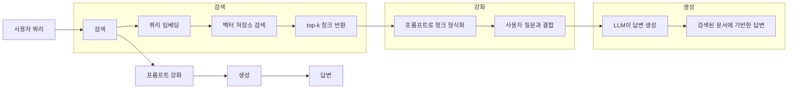
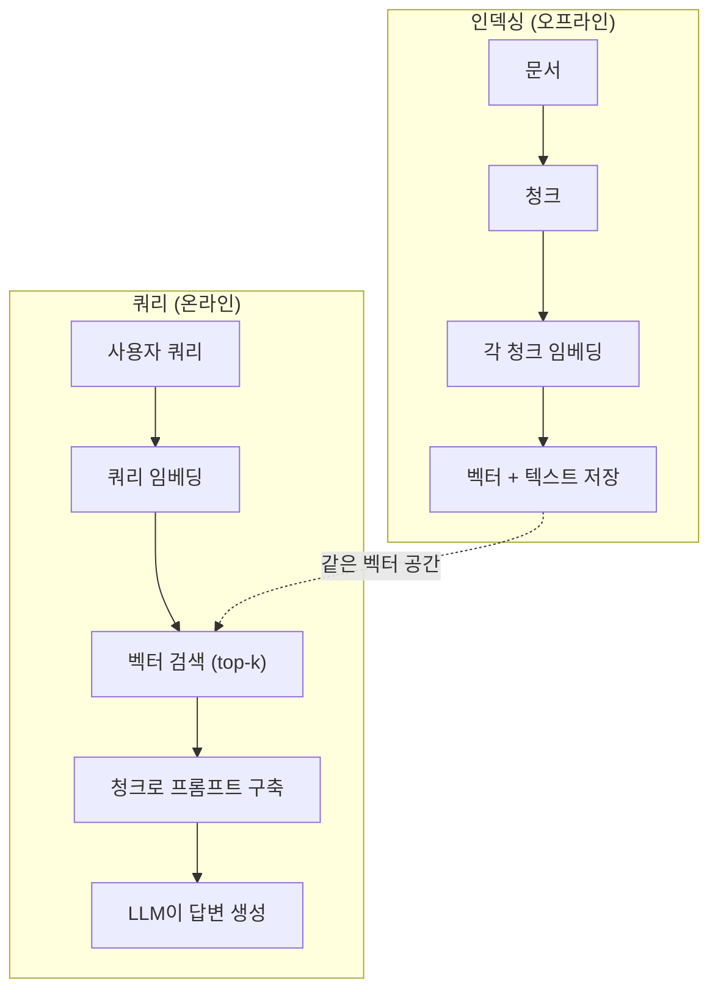

# RAG (검색 증강 생성)

> LLM은 학습 컷오프까지 모든 것을 알고 있습니다. 회사 문서, 코드베이스 또는 지난 주 회의 노트에 대해서는一无所知입니다. RAG는 관련 문서를 검색하여 프롬프트에 채워넣어解决这个问题합니다. production AI에서 가장 많이 배포된 패턴입니다. 이 과정에서의 하나의 것을 구축한다면 RAG 파이프라인을 구축하세요.

**유형:** 실습
**언어:** Python
**선수 과목:** Phase 10 (LLMs from Scratch), Phase 11 Lessons 01-05
**소요 시간:** ~90분
**관련:** Phase 5 · 23 (Chunking Strategies for RAG) -- 여섯 가지 청킹 알고리즘과 각기가 효과적인 경우를 다룹니다. Phase 5 · 22 (Embedding Models Deep Dive) -- 임베더 선택용. Phase 11 · 07 (Advanced RAG) -- 하이브리드 검색, 재순위화 및 쿼리 변환.

## 학습 목표

- 완전한 RAG 파이프라인 구축: 문서 로딩, 청킹, 임베딩, 벡터 저장, 검색 및 생성
- 적절한 인덱싱으로 벡터 데이터베이스(ChromaDB, FAISS 또는 Pinecone)를 사용한 의미론적 검색 구현
- RAG가 지식 기반 애플리케이션에서 fine-tuning보다 선호되는 이유 설명(비용, 신선도, 귀인)
- 검색 메트릭(precision, recall)과 생성 메트릭(faithfulness, relevance)을 사용한 RAG 품질 평가

## 문제

회사용 챗봇을 구축합니다. 고객이 "엔터프라이즈 요금제에 대한 환불 정책은 무엇입니까?"라고 묻습니다. LLM은 일반적인 SaaS 환불 정책에 대한 답변을 제공합니다. 실제 정책은 200페이지 내부 위키에 묻혀 있으며, 엔터프라이즈 고객은 60일 기간과 비례 환불을 받을 수 있다고 합니다. LLM은 이 문서를 본 적이 없습니다. 훈련되지 않은 것은 알 수 없습니다.

Fine-tuning이 하나의 해결책입니다. LLM을 가져와 내부 문서로 훈련시키고 업데이트된 모델을 배포합니다. 이것은 작동하지만 심각한 문제가 있습니다. Fine-tuning은 계산에数千 달러가 듭니다. 문서가 변경되는 순간 모델이 오래됩니다. 모델이 어느 소스에서 답변을 이끌어냈는지 알 방법이 없습니다. 그리고 회사가 다음 달에 다른 제품 라인을 인수하면 다시 fine-tuning합니다.

RAG가 다른 해결책입니다. 모델을 неизменен으로 둡니다. 질문이 들어오면 문서 저장소에서 관련 구절을 검색하고, 질문 전에 프롬프트에 붙여넣고, 해당 구절을 컨텍스트로 사용하여 모델이 답변하도록 합니다. 문서 저장소는 数분 내에 업데이트될 수 있습니다. 정확히 어떤 문서가 검색되었는지 볼 수 있습니다. 모델 자체는 절대 변경되지 않습니다. 이것이 RAG가 production에서 지배적인 패턴인 이유입니다: 더 저렴하고, 더 신선하며, 더 감사 가능하며, 모든 LLM과 함께 작동합니다.

## 개념

### RAG 패턴

전체 패턴은 네 단계에 맞습니다:



쿼리 -> 검색 -> 프롬프트 강화 -> 생성. 모든 RAG 시스템이 이 패턴을 따릅니다. 프로덕션 RAG 시스템 간의 차이점은 각 단계의 세부 사항에 있습니다: 청킹 방법, 임베딩 방법, 검색 방법 및 프롬프트 구성 방식.

### 왜 RAG가 Fine-tuning을 이기는가

| Concern | Fine-tuning | RAG |
|---------|------------|-----|
| 비용 | 훈련 실행당 $1,000-$100,000+ | 쿼리당 $0.01-$0.10 (임베딩 + LLM) |
| 신선도 | 재훈련 때까지 오래됨 | 문서 재인덱싱으로 数분 내에 업데이트 |
| 감사 가능성 | 답변을 소스에 추적할 수 없음 | 검색된 구절을 정확히 표시할 수 있음 |
| 할루시네이션 | 여전히 자유롭게 할루시네이트 | 검색된 문서에 기반 |
| 데이터 개인정보 보호 | 훈련 데이터가 가중치에 베이킹 | 문서가 벡터 저장소에 유지 |

Fine-tuning은 모델의 가중치를 영구적으로 변경합니다. RAG는 모델의 컨텍스트를 일시적으로 변경합니다. 대부분의 애플리케이션에서 일시적인 컨텍스트가 필요합니다.

Fine-tuning이 이기는 한 가지 경우: 프롬프팅만으로 달성할 수 없는 특정 스타일, 톤 또는 추론 패턴을 모델이 adopt해야 할 때. 사실적 지식 검색의 경우 RAG가 매번 이깁니다.

### 임베딩 모델

임베딩 모델은 텍스트를 밀집 벡터로 변환합니다. 유사한 텍스트는 이 고차원 공간에서 함께 가깝게 produces vectors. "비밀번호를 재설정하는 방법은?"과 "비밀번호를 변경해야 합니다"는 few words만 공유하지만 nearly identical vectors를 생성합니다. "The cat sat on the mat"는 매우 다른 벡터를 생성합니다.

일반적인 임베딩 모델 (2026 라인업 -- 전체 분석은 Phase 5 · 22 참조):

| 모델 | 차원 | 제공자 | 메모 |
|-------|-----------|----------|-------|
| text-embedding-3-small | 1536 (Matryoshka) | OpenAI | 대부분의 사용 사례에 대해 최고 가성비 |
| text-embedding-3-large | 3072 (Matryoshka) | OpenAI | 더 높은 정확도, 256/512/1024로 truncatable |
| Gemini Embedding 2 | 3072 (Matryoshka) | Google | 상위 MTEB 검색; 8K 컨텍스트 |
| voyage-4 | 1024/2048 (Matryoshka) | Voyage AI | 도메인 변형 (코드, 금융, 법률) |
| Cohere embed-v4 | 1024 (Matryoshka) | Cohere | 강력한 다국어, 128K 컨텍스트 |
| BGE-M3 | 1024 (dense + sparse + ColBERT) | BAAI (오픈 가중치) | 하나의 모델에서 세 가지 뷰 |
| Qwen3-Embedding | 4096 (Matryoshka) | Alibaba (오픈 가중치) | 상위 오픈 가중치 검색 점수 |
| all-MiniLM-L6-v2 | 384 | 오픈 가중치 (Sentence Transformers) | 프로토타이핑 기준선 |

이 단원에서는 TF-IDF를 사용한 간단한 임베딩을 구축합니다. TF-IDF가 프로덕션 시스템이 사용하는 것이 아니라 개념을 구체화하기 때문입니다: 텍스트가 들어가고 벡터가 나오며 유사한 텍스트가 유사한 벡터를 생성합니다.

### 벡터 유사도

두 벡터가 주어지면 어떻게 유사도를 측정합니까? 세 가지 옵션:

**Cosine 유사도**: 두 벡터 사이의 각도의 cosine입니다. -1(반대)에서 1(동일)까지 범위입니다. 크기를 무시하고 방향만 신경씁니다. 이것이 RAG의 기본값입니다.

```
cosine_sim(a, b) = dot(a, b) / (||a|| * ||b||)
```

**내적**: 원시 내부 곱입니다.更大的 벡터가 더 높은 점수를 얻습니다. 크기가 정보를 담을 때 유용합니다(더 긴 문서가 더 관련성이 높을 수 있음).

```
dot(a, b) = sum(a_i * b_i)
```

**L2 (유클리드) 거리**: 벡터 공간의 직선 거리입니다. 거리가 작을수록 더 유사합니다. 크기 차이에 민감합니다.

```
L2(a, b) = sqrt(sum((a_i - b_i)^2))
```

Cosine 유사도가 표준입니다. 크기로 정규화하기 때문에 다양한 길이의 문서를优雅하게 처리합니다. 누군가가 "벡터 검색"이라고 하면 거의 항상 cosine 유사도를 의미합니다.

### 청킹 전략

문서는 단일 벡터로 임베딩하기엔 너무 깁니다. 50페이지 PDF는 dozens of topics가 포함되어 있어 terrible 임베딩을 생성할 수 있습니다. 대신 문서를 청크로 분할하고 각 청크를 separately 임베딩합니다.

**고정 크기 청킹**: 매 N 토큰마다 분할합니다. 단순하고 예측 가능합니다. 50토큰 重疊으로 512토큰 청크는 청크 1이 토큰 0-511, 청크 2가 토큰 462-973임을 의미합니다. 重疊는 불운한 경계에서 문장을 분할하지 않도록确保합니다.

**의미론적 청킹**: 자연스러운 경계에서 분할합니다. 단락, 섹션 또는 마크다운 헤더. 각 청크는 일관된 의미 단위입니다. 구현이 더 복잡하지만 더 나은 검색을 생성합니다.

**재귀 청킹**: 가장 큰 경계(섹션 헤더)에서 분할을 시도합니다. 섹션이 여전히 너무 크면 단락 경계에서 분할합니다. 단락이 여전히 너무 크면 문장 경계에서 분할합니다. 이것이 LangChain RecursiveCharacterTextSplitter 접근 방식이며 실전에서 잘 작동합니다.

청크 크기가人们 생각하는 것보다 더 중요합니다:

- 너무 작음 (64-128 토큰): 각 청크가 컨텍스트가 부족합니다. "지난 분기에 15% 증가했습니다"는 "it"가 무엇을 참조하는지 알지 못하면 아무 의미도 없습니다.
- 너무 큼 (2048+ 토큰): 각 청크가 여러 주제를 다루어 관련성을 희석합니다. 수익 데이터를 검색할 때 수익에 대해 10%이고 직원 수에 대해 90%인 청크를 얻습니다.
-甜蜜점 (256-512 토큰): 자체 완전할 만큼 충분한 컨텍스트, 관련성 있을 만큼 집중됨.

대부분의 프로덕션 RAG 시스템은 50토큰 重疊으로 256-512 토큰 청크를 사용합니다. Anthropic의 RAG 가이드라인은 이 범위를 권장합니다.

### 벡터 데이터베이스

임베딩이 있으면 저장하고 검색할 곳이 필요합니다. 옵션:

| 데이터베이스 | 유형 | 최적 |
|----------|------|----------|
| FAISS | 라이브러리 (프로세스 내) | 프로토타이핑, 소중형 데이터세트 |
| Chroma | 경량 DB | 로컬 개발, 소규모 배포 |
| Pinecone | 관리형 서비스 | ops 오버헤드 없는 프로덕션 |
| Weaviate | 오픈소스 DB | 자체 호스팅 프로덕션 |
| pgvector | Postgres 확장 | 이미 Postgres 사용 중 |
| Qdrant | 오픈소스 DB | 고성능 자체 호스팅 |

이 단원에서는 간단한 인메모리 벡터 저장소를 구축합니다. 벡터를 리스트에 저장하고 무차별 대입 cosine 유사도 검색을 수행합니다. 이것은 플랫 인덱스가 있는 FAISS와 동일합니다. 느려지기 전에 약 100,000 벡터까지 확장됩니다. 프로덕션 시스템은 ANN(근사 최근접 이웃) 알고리즘(如HNSW)을 사용하여 수백만 벡터를 밀리초에 검색합니다.

### 전체 파이프라인



인덱싱 단계는 문서당 한 번 실행됩니다(또는 문서가 업데이트될 때). 쿼리 단계는 모든 사용자 요청에서 실행됩니다. 프로덕션에서 인덱싱은 수백만 문서를 시간에 걸쳐 처리할 수 있습니다. 쿼리는 1초 미만에 응답해야 합니다.

### 실제 수치

대부분의 프로덕션 RAG 시스템은これらの 파라미터를 사용합니다:

- **k = 5 to 10** 쿼리당 검색된 청크
- **청크 크기 = 256-512 토큰** 50토큰 重疊
- **컨텍스트 예산**: 쿼리당 검색된 콘텐츠 2,500-5,000 토큰
- **전체 프롬프트**: ~8,000-16,000 토큰 (시스템 프롬프트 + 검색된 청크 + 대화 이력 + 사용자 쿼리)
- **임베딩 차원**: 모델에 따라 384-3072
- **인덱싱 처리량**: API 임베딩으로 초당 100-1,000 문서
- **쿼리 지연시간**: 검색 50-200ms, 생성 500-3000ms

## 실습

### 단계 1: 문서 청킹

```python
def chunk_text(text, chunk_size=200, overlap=50):
    words = text.split()
    chunks = []
    start = 0
    while start < len(words):
        end = start + chunk_size
        chunk = " ".join(words[start:end])
        chunks.append(chunk)
        start += chunk_size - overlap
    return chunks
```

### 단계 2: TF-IDF 임베딩

간단한 임베딩 함수를 구축합니다. TF-IDF(Term Frequency-Inverse Document Frequency)는 신경 임베딩이 아니지만 단어 중요성을 포착하는 방식으로 텍스트를 벡터로 변환합니다. 문서에서 빈번한 단어는 더 높은 TF를 얻습니다. 코퍼스에서 희귀한 단어는 더 높은 IDF를 얻습니다. 제품은 중요한, distinctive한 단어가 높은 값을 가지는 벡터를 제공합니다.

```python
import math
from collections import Counter

def build_vocabulary(documents):
    vocab = set()
    for doc in documents:
        vocab.update(doc.lower().split())
    return sorted(vocab)

def compute_tf(text, vocab):
    words = text.lower().split()
    count = Counter(words)
    total = len(words)
    return [count.get(word, 0) / total for word in vocab]

def compute_idf(documents, vocab):
    n = len(documents)
    idf = []
    for word in vocab:
        doc_count = sum(1 for doc in documents if word in doc.lower().split())
        idf.append(math.log((n + 1) / (doc_count + 1)) + 1)
    return idf

def tfidf_embed(text, vocab, idf):
    tf = compute_tf(text, vocab)
    return [t * i for t, i in zip(tf, idf)]
```

### 단계 3: Cosine 유사도 검색

```python
def cosine_similarity(a, b):
    dot = sum(x * y for x, y in zip(a, b))
    norm_a = math.sqrt(sum(x * x for x in a))
    norm_b = math.sqrt(sum(x * x for x in b))
    if norm_a == 0 or norm_b == 0:
        return 0.0
    return dot / (norm_a * norm_b)

def search(query_embedding, stored_embeddings, top_k=5):
    scores = []
    for i, emb in enumerate(stored_embeddings):
        sim = cosine_similarity(query_embedding, emb)
        scores.append((i, sim))
    scores.sort(key=lambda x: x[1], reverse=True)
    return scores[:top_k]
```

### 단계 4: 프롬프트 구성

여기서 RAG의 "augmented"가 발생합니다. 검색된 청크를 가져와서 프롬프트로 형식화하고 제공된 컨텍스트를 기반으로 답변하도록 LLM에 요청합니다.

```python
def build_rag_prompt(query, retrieved_chunks):
    context = "\n\n---\n\n".join(
        f"[소스 {i+1}]\n{chunk}"
        for i, chunk in enumerate(retrieved_chunks)
    )
    return f"""다음 컨텍스트에만 기반하여 질문에 답변하세요.
컨텍스트에 충분한 정보가 없으면 "그 질문에 답변할 충분한 정보가 없습니다"라고 말하세요.

컨텍스트:
{context}

질문: {query}

답변:"""
```

### 단계 5: 완전한 RAG 파이프라인

```python
class RAGPipeline:
    def __init__(self):
        self.chunks = []
        self.embeddings = []
        self.vocab = []
        self.idf = []

    def index(self, documents):
        all_chunks = []
        for doc in documents:
            all_chunks.extend(chunk_text(doc))
        self.chunks = all_chunks
        self.vocab = build_vocabulary(all_chunks)
        self.idf = compute_idf(all_chunks, self.vocab)
        self.embeddings = [
            tfidf_embed(chunk, self.vocab, self.idf)
            for chunk in all_chunks
        ]

    def query(self, question, top_k=5):
        query_emb = tfidf_embed(question, self.vocab, self.idf)
        results = search(query_emb, self.embeddings, top_k)
        retrieved = [(self.chunks[i], score) for i, score in results]
        prompt = build_rag_prompt(
            question, [chunk for chunk, _ in retrieved]
        )
        return prompt, retrieved
```

### 단계 6: 생성 (시뮬레이션)

프로덕션에서는 여기서 LLM API를 호출합니다. 이 단원에서는 검색된 컨텍스트에서 가장 관련성 높은 문장을 추출하여 생성을 시뮬레이션합니다.

```python
def simple_generate(prompt, retrieved_chunks):
    query_words = set(prompt.lower().split("question:")[-1].split())
    best_sentence = ""
    best_score = 0
    for chunk in retrieved_chunks:
        for sentence in chunk.split("."):
            sentence = sentence.strip()
            if not sentence:
                continue
            words = set(sentence.lower().split())
            overlap = len(query_words & words)
            if overlap > best_score:
                best_score = overlap
                best_sentence = sentence
    return best_sentence if best_sentence else "충분한 정보가 없습니다."
```

## 활용

실제 임베딩 모델과 LLM과 함께 코드는 거의 변경되지 않습니다:

```python
from openai import OpenAI

client = OpenAI()

def embed(text):
    response = client.embeddings.create(
        model="text-embedding-3-small",
        input=text
    )
    return response.data[0].embedding

def generate(prompt):
    response = client.chat.completions.create(
        model="gpt-4o-mini",
        messages=[{"role": "user", "content": prompt}],
        temperature=0
    )
    return response.choices[0].message.content
```

Anthropic과 함께:

```python
import anthropic

client = anthropic.Anthropic()

def generate(prompt):
    response = client.messages.create(
        model="claude-sonnet-4-20250514",
        max_tokens=1024,
        messages=[{"role": "user", "content": prompt}]
    )
    return response.content[0].text
```

파이프라인은 동일합니다. 임베딩 함수를 교체합니다. 생성 함수를 교체합니다. 검색 로직, 청킹, 프롬프트 구성 -- 사용하는 모델에 관계없이 모두 동일합니다.

규모에서 벡터 저장을 위해 무차별 대입 검색을 적절한 벡터 데이터베이스로 교체합니다:

```python
import chromadb

client = chromadb.Client()
collection = client.create_collection("my_docs")

collection.add(
    documents=chunks,
    ids=[f"chunk_{i}" for i in range(len(chunks))]
)

results = collection.query(
    query_texts=["환불 정책은 무엇입니까?"],
    n_results=5
)
```

Chroma는 내부적으로 임베딩을 처리합니다(기본적으로 all-MiniLM-L6-v2 사용)하고 벡터를 로컬 데이터베이스에 저장합니다. 같은 패턴, 다른 배관.

## 결과물

이 단원은 다음을 생성합니다:
- `outputs/prompt-rag-architect.md` -- 특정 사용 사례에 대한 RAG 시스템을 설계하기 위한 프롬프트
- `outputs/skill-rag-pipeline.md` -- agent에게 RAG 파이프라인을 구축하고 디버깅하는 방법을 가르치는 skill

## 연습 문제

1. TF-IDF 임베딩을 간단한 bag-of-words 접근법으로 교체합니다(바이너리: 단어가 존재하면 1, 그렇지 않으면 0). 샘플 문서에서 검색 품질을 비교합니다. TF-IDF가 희귀 단어에 더 높은 가중치를 부여하기 때문에 outperform해야 합니다.

2. 청크 크기 실험: 동일한 문서 세트에서 50, 100, 200 및 500단어로 시도합니다. 각 크기에 대해 동일한 5개 쿼리를 실행하고 top-3에서 관련 청크가 반환되는 횟수를 카운트합니다. 검색 품질이 정점을 찍는甜蜜점을 찾으세요.

3. 각 청크에 메타데이터 추가(소스 문서 이름, 청크 위치). LLM이 출처를 인용하도록 프롬프트 템플릿을 수정하여 소스 귀인을 포함합니다.

4. 간단한 평가 구현: 10개의 질문-답변 쌍이 주어지면 각 질문을 RAG 파이프라인을 통해 실행하고 검색된 청크의 몇%가 답변을 포함하는지 측정합니다. 이것이 k에서의 검색 리콜입니다.

5. 대화 인식 RAG 파이프라인 구축: 마지막 3개의 교환 이력을 유지하고 검색된 청크와 함께 프롬프트에它们을 포함합니다. 가격에 대해聞いた 후 "엔터프라이즈는 어떻습니까?"와 같은 후속 질문으로 테스트합니다.

## 핵심 용어

| 용어 |人们在说什么 |실제로 의미하는 것 |
|------|----------------|----------------------|
| RAG | "내 문서를 읽는 AI" | 관련 문서를 검색하고 프롬프트에 붙여넣고 해당 문서에 기반한 답변을 생성 |
| 임베딩 | "텍스트를 숫자로 변환" | 유사한 의미가 유사한 벡터를 생성하는 텍스트의 밀집 벡터 표현 |
| 벡터 데이터베이스 | "AI용 검색 엔진" | 벡터를 저장하고 유사성으로 가장 가까운 이웃을 찾는 데 최적화된 데이터 저장소 |
| 청킹 | "문서를 조각으로 분할" | 문서를 더 작은 세그먼트(typically 256-512 토큰)로 분할하여 각기 독립적으로 임베딩되고 검색될 수 있도록 함 |
| Cosine 유사도 | "두 벡터가 얼마나 유사한가" | 두 벡터 사이의 각도의 cosine; 1 = 동일 방향, 0 = 직교, -1 = 반대 |
| Top-k 검색 | "k개의 최상위 일치 가져오기" | 벡터 저장소에서 쿼리에 가장 유사한 k개의 청크를 반환 |
| 컨텍스트 윈도우 | "LLM이 볼 수 있는 텍스트 양" | LLM이 단일 요청에서 처리할 수 있는 최대 토큰 수; 검색된 청크는 이것에 맞아야 함 |
| 증강 생성 | "주어진 컨텍스트를 사용하여 답변" | 훈련된 지식만으로ではなく 검색된 문서를 컨텍스트로 사용하여 응답 생성 |
| TF-IDF | "단어 중요도 점수 매기기" | Term Frequency times Inverse Document Frequency; 코퍼스 내에서 단어가 얼마나 distinctive한지에 따라 가중치 부여 |
| 인덱싱 | "검색용 문서 준비" | 청킹, 임베딩 및 문서 저장을 위한 오프라인 프로세스로 쿼리 시간에 검색할 수 있도록 함 |

## 추가 자료

- Lewis et al., "Retrieval-Augmented Generation for Knowledge-Intensive NLP Tasks" (2020) -- Facebook AI Research의 원본 RAG 논문으로 검색-然后-생성 패턴을 형식화
- Anthropic의 RAG 문서 (docs.anthropic.com) -- 청크 크기, 프롬프트 구성 및 평가에 대한 실용적 가이드라인
- Pinecone Learning Center, "What is RAG?" -- production 고려 사항과 함께 RAG 파이프라인의 명확한 시각적 설명
- Sentence-BERT: Reimers & Gurevych (2019) -- all-MiniLM 임베딩 모델 뒤의 논문으로 의미론적 유사성을 위해 bi-encoder를 훈련하는 방법을 보여줌
- [Karpukhin et al., "Dense Passage Retrieval for Open-Domain Question Answering" (EMNLP 2020)](https://arxiv.org/abs/2004.04906) -- 개방형 도메인 QA에서 dense bi-encoder 검색이 BM25를 이기고 현대 RAG 검색기의 패턴을 설정한 DPR 논문.
- [LlamaIndex High-Level Concepts](https://docs.llamaindex.ai/en/stable/getting_started/concepts.html) -- RAG 파이프라인을 구축할 때 알아야 할 주요 개념: 데이터 로더, 노드 파서, 인덱스, 검색기, 응답 합성기.
- [LangChain RAG tutorial](https://python.langchain.com/docs/tutorials/rag/) -- 반대 맛 오케스트레이터; 같은 검색-然后-생성 패턴의 체인-오브-러너블 뷰.