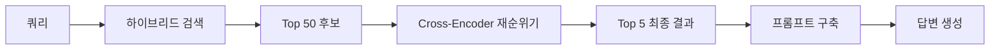
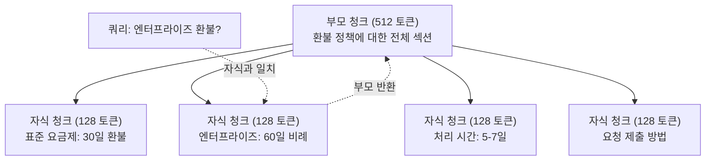
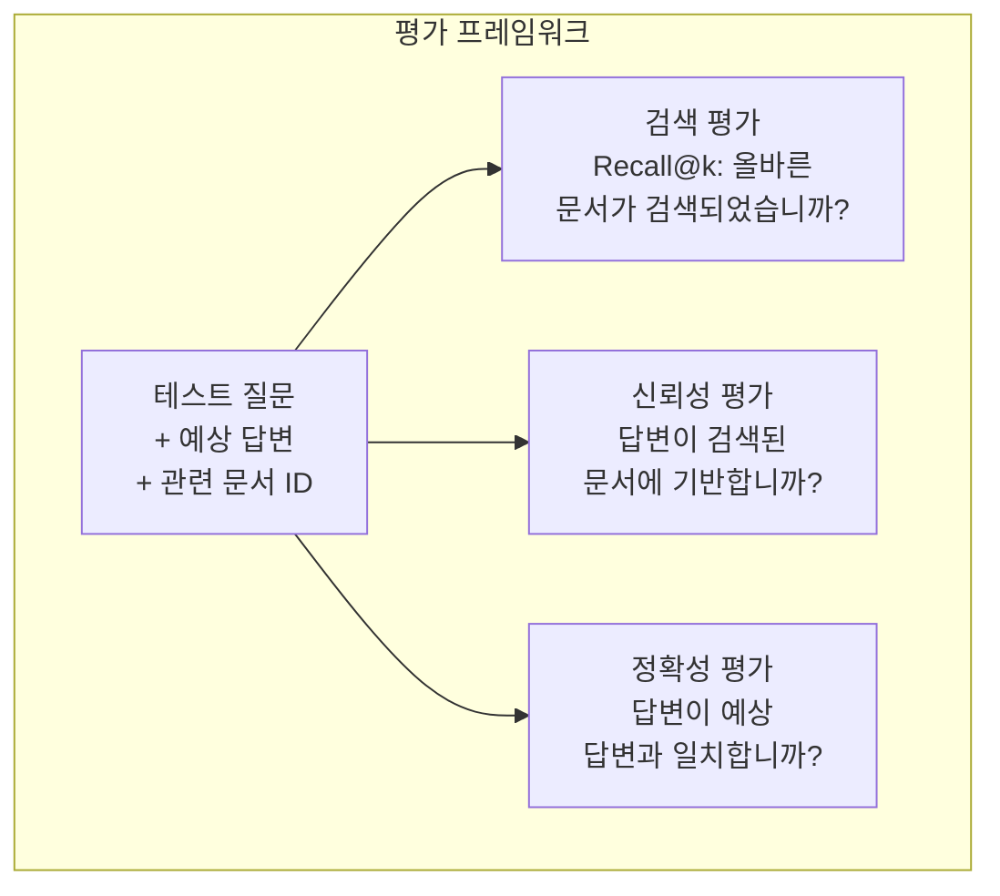

# 고급 RAG (청킹, 재순위화, 하이브리드 검색)

> 기본 RAG는 top-k 가장 유사한 청크를 검색합니다. 간단한 질문에는 작동합니다. 멀티홉 추론, 모호한 쿼리 및 대규모 코퍼스에서는崩溃합니다. 고급 RAG는 10개 문서에서 작동하는 데모와 1000만 개에서 작동하는 시스템의 차이입니다.

**유형:** 실습
**언어:** Python
**선수 과목:** Phase 11, Lesson 06 (RAG)
**소요 시간:** ~90분
**관련:** Phase 5 · 23 (Chunking Strategies for RAG)는 여섯 가지 청킹 알고리즘 모두를 다룹니다 -- 재귀, 의미론적, 문장, 부모-자식, 늦은 청킹, 문맥 검색 -- Vectara/Anthropic 벤치마크 포함. 이 단원은 위에 구축합니다: 하이브리드 검색, 재순위화, 쿼리 변환.

## 학습 목표

- 문서 구조와 컨텍스트를 보존하는 고급 청킹 전략(의미론적, 재귀, 부모-자식) 구현
- BM25 키워드 매칭과 의미론적 벡터 검색 및 cross-encoder 재순위기를 결합한 하이브리드 검색 파이프라인 구축
- 모호하거나 복잡한 질문에 대한 검색을 개선하기 위해 쿼리 변환 기법(HyDE, 다중 쿼리, step-back) 적용
- 일반적인 RAG 실패 진단 및 수정: 잘못된 청크 검색, 컨텍스트에 답변 없음, 멀티홉 추론崩溃

## 문제

단원 06에서 기본 RAG 파이프라인을 구축했습니다. 작은 코퍼스에서 간단한 질문에는 작동합니다. 이제 이것들을 시도해 보세요:

**모호한 쿼리**: "지난 분기 수익은 어느 정도였습니까?" 의미론적 검색은 수익 전략, 수익 예측 및 CFO의 수익 성장에 대한 생각에 대한 청크를 반환합니다. 모두 "revenue"라는 단어와 의미론적으로 유사합니다. 실제 숫자가 포함된 것은 없습니다. 올바른 청크는 "2025년 3분기 $47.2M"라고 말하지만 "revenue" 대신 "earnings"라는 단어를 사용합니다. 임베딩 모델은 "2025년 3분기 수익이 $47.2Mでした"보다 "수익 전략"이 쿼리에 더 가깝다고 생각합니다.

**멀티홉 질문**: "어떤 팀이 고객 만족도 점수 향상이 가장 높았습니까?" 이는 각 팀의 만족도 점수를 찾고, 비교하고, 최대값을 식별해야 합니다. 단일 청크에 답변이 없습니다. 정보가 팀 보고서에分散되어 있습니다.

**대규모 코퍼스 문제**: 200만 개의 청크가 있습니다. 정답은 청크 #1,847,293에 있습니다. top-5 검색이 청크 #14, #89,201, #1,200,000, #44 및 #901,333을 가져옵니다. 임베딩 공간에서 가깝지만 답변을 포함하는 것은 없습니다. 이 규모에서는 근사 최근접 이웃 검색이 충분한 오류를 도입하여 관련 결과가 top-k에서 밀려납니다.

기본 RAG가 실패하는 이유: 벡터 유사성은 관련성과 동일하지 않습니다. 쿼리와 의미론적으로 유사한 청크가 답변을 제공하는 데 유용하지 않을 수 있습니다. 고급 RAG는 네 가지 기술로 이것을 해결합니다: 하이브리드 검색(키워드 매칭 추가), 재순위화(후보 점수 매기기 더 정교하게), 쿼리 변환(검색 전 쿼리 수정), 더 나은 청킹(올바른 세분성에서 검색).

## 개념

### 하이브리드 검색: 의미론적 + 키워드

의미론적 검색(벡터 유사성)은 의미를 이해하는 데 좋습니다. "구독을 취소하는 방법은?"은 단어도 공유하지 않지만 "요금제를 종료하는 단계"와 일치합니다. 그러나 정확히 일치하는 것은 놓칩니다. "오류 코드 E-4021"은 임베딩 모델이 그것을 노이즈로 처리하면 "E-4021"이 포함된 청크와 일치하지 않을 수 있습니다.

키워드 검색(BM25)은 정반대입니다. 정확히 일치하는 것에 탁월합니다. "E-4021"은 완벽하게 일치합니다. 그러나 "구독 취소"는 문서가 "요금제 종료"라고 말하면 zero 결과를 반환합니다.

하이브리드 검색은 둘 다 실행한 다음 결과를 병합합니다.

**BM25** (Best Matching 25)는 표준 키워드 검색 알고리즘입니다. 1990년대 이후 검색 엔진의 중추였습니다. 공식:

```
BM25(q, d) = 용어 t in q에 대한 합계:
    IDF(t) * (tf(t,d) * (k1 + 1)) / (tf(t,d) + k1 * (1 - b + b * |d| / avgdl))
```

여기서 tf(t,d)는 문서 d에서 용어 t의 빈도, IDF(t)는 역문서 빈도, |d|는 문서 길이, avgdl은 평균 문서 길이, k1은 용어 빈도 포화度を控制하고 b는 길이 정규화를 제어합니다.

평범한 용어로: BM25는 쿼리 용어(특히 희귀한 용어)를 포함할 때 더 높은 문서 점수를 매기지만 반복 용어에 대한 수익 체감이 감소합니다. "revenue"라는 단어가 50번 있는 문서는 한 번 있는 문서보다 50배 더 관련성이 없습니다.

### 역순위 융합 (RRF)

두 개의 순위 리스트가 있습니다: 하나는 벡터 검색에서, 하나는 BM25에서. 어떻게 결합합니까? 역순위 융합이 표준 접근 방식입니다.

```
RRF_score(d) = 순위 R에 대한 합계:
    1 / (k + rank_R(d))
```

여기서 k는 상수(typically 60)로 최상위 결과가 지배하는 것을 방지합니다.

벡터 검색에서 #1이고 BM25에서 #5인 문서: 1/(60+1) + 1/(60+5) = 0.0164 + 0.0154 = 0.0318

벡터 검색에서 #3이고 BM25에서 #2인 문서: 1/(60+3) + 1/(60+2) = 0.0159 + 0.0161 = 0.0320

RRF는 자연스럽게 두 신호를 균형 맞춥니다. 두 리스트에서 모두 높은 순위를 받는 문서가 최상의 점수를 얻습니다. 하나의 리스트에서 #1이지만 다른 리스트에 없는 문서는 중간 점수를 얻습니다. 이것은 두 시스템 간의 점수 분포 차이가 중요하지 않기 때문에 순위를 사용하므로 강력합니다.

### 재순위화

검색(벡터, 키워드 또는 하이브리드 여부)은 빠르지만不正確합니다. bi-encoder를 사용합니다: 쿼리와 각 문서는 독립적으로 임베딩된 다음 비교됩니다. 임베딩은 한 번 계산되고 캐시됩니다. 이것은 수백만 문서로 확장됩니다.

재순위화는 cross-encoder를 사용합니다: 쿼리와 후보 문서가 함께 모델에 제공되어 관련성 점수를 출력합니다. 모델은 동시에 두 텍스트를 보고 그 사이의 세밀한 상호작용을 포착할 수 있습니다. cross-encoder는 "2025년 3분기 수익은?"이 "$47.2M in Q3"를 포함하는 청크와高度に 관련이 있음을 이해할 수 있습니다. bi-encoder가 연결을 놓쳤을 때도요.

 tradeoff: cross-encoder는 쿼리-문서 쌍을 공동으로 처리하기 때문에 bi-encoder보다 100-1000배 느립니다. 수백만 문서에 대해 cross-encoder 점수를 사전 계산할 수 없습니다. 솔루션: 더 큰 후보 세트 검색(하이브리드 검색에서 top-50), 그런 다음 최종 top-5를 얻기 위해 cross-encoder로 재순위화합니다.



일반적인 재순위 모델 (2026 라인업):
- Cohere Rerank 3.5: 관리형 API, 다국어, 혼합 코퍼스에서 최고 리콜 향상
- Voyage rerank-2.5: 관리형 API, 호스티드 옵션 중最低 지연시간
- Jina-Reranker-v2 Multilingual: 오픈 가중치, 100+ 언어
- bge-reranker-v2-m3: 오픈 가중치, 강력한 기준선
- cross-encoder/ms-marco-MiniLM-L-6-v2: 오픈 가중치, 프로토타이핑을 위해 CPU에서 실행
- ColBERTv2 / Jina-ColBERT-v2: late-interaction multi-vector 재순위기 -- 점수 시 O(tokens)가 아닌 O(docs)

### 쿼리 변환

문제가 검색이 아니라 쿼리 자체인 경우도 있습니다. "새 정책 변경에 대한 그 문제는 뭐였지?"는 terrible 검색 쿼리입니다. 특정 용어가 없습니다. 임베딩이 모호합니다. 이에서 올바른 문서를 찾을 수 있는 검색 시스템이 없습니다.

**쿼리 재작성**: 사용자의 쿼리를 더 나은 검색 쿼리로 재표현합니다. LLM이 이것을 할 수 있습니다:

```
사용자: "새 정책 변경에 대한 그 문제는 뭐였지?"
재작성됨: "최근 정책 변경 및 업데이트"
```

**HyDE (가설적 문서 임베딩)**: 쿼리로 검색하는 대신 가설적 답변을 생성하고, 그것을 임베딩하고, 유사한 실제 문서를 검색합니다.

```
쿼리: "엔터프라이즈 환불 정책은 무엇입니까?"
가설적 답변: "엔터프라이즈 고객은 구매 후 60일 이내에 전액 환불을 받을 자격이 있습니다. 환불은 남은 구독 기간에 따라 비례하여 계산되며 5-7 영업일 이내에 처리됩니다."
```

가설적 답변을 임베딩하고 그것과 유사한 실제 문서를 검색합니다. 직관: 가설적 답변은 원래 질문보다 실제 답변과 임베딩 공간에서 더 가깝습니다. 질문과 답변은 다른 언어 구조를 가지고 있습니다. 가설적 답변을 생성함으로써 임베딩에서 "질문 공간"과 "답변 공간" 사이의 격차를 메웁니다.

HyDE는 검색 전에 하나의 LLM 호출을 추가합니다. 이것은 지연시간을 500-2000ms 증가시킵니다. 원시 쿼리에서 검색 품질이 poor할 때 가치 있습니다.

### 부모-자식 청킹

표준 청킹은 tradeoff를 강제합니다: 정밀한 검색을 위한 작은 청크, 충분한 컨텍스트를 위한 큰 청크. 부모-자식 청킹은 이 tradeoff를 Eliminates합니다.

검색을 위해 작은 청크(128 토큰)를 인덱싱합니다. 작은 청크가 검색되면 프롬프트에 부모 청크(512 토큰)를 반환합니다. 작은 청크가 쿼리와 정밀하게 일치합니다. 부모 청크가 LLM이 좋은 답변을 생성するのに 충분한 컨텍스트를 제공합니다.



쿼리 "엔터프라이즈 환불?"이 자식 청크 C2와 정밀하게 일치합니다. 그러나 프롬프트는 처리 시간 및 제출 프로세스에 대한 주변 컨텍스트를 포함하는 전체 부모 청크 P를 수신합니다.

### 메타데이터 필터링

벡터 검색을 실행하기 전에 메타데이터로 코퍼스를 필터링합니다: 날짜, 소스, 범주, 작성자, 언어. 이것은 검색 공간을 줄이고 관련 없는 결과를 방지합니다.

"지난 달 보안 정책에서 무엇이 변경되었습니까?"는 보안 범주의 지난 30일 이내 문서만 검색해야 합니다. 메타데이터 필터링 없으면 전체 코퍼스를 검색하고 우연히 의미론적으로 유사한 2년 된 보안 문서를 검색할 수 있습니다.

프로덕션 RAG 시스템은 각 청크와 함께 메타데이터를 저장합니다: 소스 문서, 생성 날짜, 범주, 작성자, 버전. 벡터 데이터베이스는 유사성 검색 전에 메타데이터 사전 필터링을 지원하며, 대규모에서 성능에 중요합니다.

### 평가

RAG 시스템을 구축했습니다. 작동하는지 어떻게 알 수 있습니까? 세 가지 메트릭:

**검색 관련성 (Recall@k)**: 알려진 관련 문서가 있는 테스트 질문 세트에 대해 상위 k 결과에서 관련 문서의 몇%가 나타납니까? 질문에 대한 답변이 청크 #47에 있으면 청크 #47이 상위 5개에 나타납니까?

**신뢰성**: 생성된 답변이 검색된 문서에 기반합니까? 검색된 청크가 "60일 환불 기간"이라고 말하는데 모델이 "90일 환불 기간"이라고 말하면 신뢰성 실패입니다. 모델이 올바른 컨텍스트가 있음에도 할루시네이션했습니다.

**답변 정확성**: 생성된 답변이 예상 답변과 일치합니까? 이것이 종단 간 메트릭입니다. 검색 품질과 생성 품질을 결합합니다.

간단한 신뢰성 검사: 생성된 답변의 각 주장을 가져와 검색된 청크에 나타나는지(实质적으로) 확인합니다. 답변이 검색된 청크에 없는 사실을 포함하면 할루시네이션되었을 가능성이 높습니다.



## 실습

### 단계 1: BM25 구현

```python
import math
from collections import Counter

class BM25:
    def __init__(self, k1=1.2, b=0.75):
        self.k1 = k1
        self.b = b
        self.docs = []
        self.doc_lengths = []
        self.avg_dl = 0
        self.doc_freqs = {}
        self.n_docs = 0

    def index(self, documents):
        self.docs = documents
        self.n_docs = len(documents)
        self.doc_lengths = []
        self.doc_freqs = {}

        for doc in documents:
            words = doc.lower().split()
            self.doc_lengths.append(len(words))
            unique_words = set(words)
            for word in unique_words:
                self.doc_freqs[word] = self.doc_freqs.get(word, 0) + 1

        self.avg_dl = sum(self.doc_lengths) / self.n_docs if self.n_docs else 1

    def score(self, query, doc_idx):
        query_words = query.lower().split()
        doc_words = self.docs[doc_idx].lower().split()
        doc_len = self.doc_lengths[doc_idx]
        word_counts = Counter(doc_words)
        score = 0.0

        for term in query_words:
            if term not in word_counts:
                continue
            tf = word_counts[term]
            df = self.doc_freqs.get(term, 0)
            idf = math.log((self.n_docs - df + 0.5) / (df + 0.5) + 1)
            numerator = tf * (self.k1 + 1)
            denominator = tf + self.k1 * (1 - self.b + self.b * doc_len / self.avg_dl)
            score += idf * numerator / denominator

        return score

    def search(self, query, top_k=10):
        scores = [(i, self.score(query, i)) for i in range(self.n_docs)]
        scores.sort(key=lambda x: x[1], reverse=True)
        return scores[:top_k]
```

### 단계 2: 역순위 융합

```python
def reciprocal_rank_fusion(ranked_lists, k=60):
    scores = {}
    for ranked_list in ranked_lists:
        for rank, (doc_id, _) in enumerate(ranked_list):
            if doc_id not in scores:
                scores[doc_id] = 0.0
            scores[doc_id] += 1.0 / (k + rank + 1)
    fused = sorted(scores.items(), key=lambda x: x[1], reverse=True)
    return fused
```

### 단계 3: 하이브리드 검색 파이프라인

```python
def hybrid_search(query, chunks, vector_embeddings, vocab, idf, bm25_index, top_k=5, fusion_k=60):
    query_emb = tfidf_embed(query, vocab, idf)
    vector_results = search(query_emb, vector_embeddings, top_k=top_k * 3)
    bm25_results = bm25_index.search(query, top_k=top_k * 3)
    fused = reciprocal_rank_fusion([vector_results, bm25_results], k=fusion_k)
    return fused[:top_k]
```

### 단계 4: 간단한 재순위기

프로덕션에서는 cross-encoder 모델을 사용합니다. 여기서는 단어 중복, 용어 중요도 및 구 일치를 사용하여 쿼리-문서 관련성을 점수 매기는 재순위기를 구축합니다.

```python
def rerank(query, candidates, chunks):
    query_words = set(query.lower().split())
    stop_words = {"the", "a", "an", "is", "are", "was", "were", "what", "how",
                  "why", "when", "where", "do", "does", "for", "of", "in",
                  "and", "or", "on", "at", "by", "it", "its", "this", "that",
                  "with", "from", "be", "has", "have", "had", "not", "but"}
    query_terms = query_words - stop_words

    scored = []
    for doc_id, initial_score in candidates:
        chunk = chunks[doc_id].lower()
        chunk_words = set(chunk.split())

        term_overlap = len(query_terms & chunk_words)

        query_bigrams = set()
        q_list = [w for w in query.lower().split() if w not in stop_words]
        for i in range(len(q_list) - 1):
            query_bigrams.add(q_list[i] + " " + q_list[i + 1])
        bigram_matches = sum(1 for bg in query_bigrams if bg in chunk)

        position_boost = 0
        for term in query_terms:
            pos = chunk.find(term)
            if pos != -1 and pos < len(chunk) // 3:
                position_boost += 0.5

        rerank_score = (
            term_overlap * 1.0
            + bigram_matches * 2.0
            + position_boost
            + initial_score * 5.0
        )
        scored.append((doc_id, rerank_score))

    scored.sort(key=lambda x: x[1], reverse=True)
    return scored
```

### 단계 5: HyDE (가설적 문서 임베딩)

```python
def hyde_generate_hypothesis(query):
    templates = {
        "what": "'{query}'에 대한 답변은 다음과 같습니다: 우리의 문서에 따르면, {topic}은(는) 프로세스의 작동 방식을 정의하는 특정 정책 및 절차를 포함합니다.",
        "how": "'{query}'를 해결하려면: 이 프로세스에는 여러 단계가 있습니다. 먼저 요청을 시작해야 합니다. 그런 다음 정의된 규칙에 따라 시스템이 처리합니다.",
        "default": "'{query}'와 관련하여: 우리의 기록에 따르면 이 주제와 관련하여 포괄적인 답변을 제공하는 특정 세부 정보 및 정책이 있습니다."
    }
    query_lower = query.lower()
    if query_lower.startswith("what"):
        template = templates["what"]
    elif query_lower.startswith("how"):
        template = templates["how"]
    else:
        template = templates["default"]

    topic_words = [w for w in query.lower().split()
                   if w not in {"what", "is", "the", "how", "do", "does", "a", "an",
                                "for", "of", "to", "in", "on", "at", "by", "and", "or"}]
    topic = " ".join(topic_words) if topic_words else "this topic"

    return template.format(query=query, topic=topic)


def hyde_search(query, chunks, vector_embeddings, vocab, idf, top_k=5):
    hypothesis = hyde_generate_hypothesis(query)
    hypothesis_emb = tfidf_embed(hypothesis, vocab, idf)
    results = search(hypothesis_emb, vector_embeddings, top_k)
    return results, hypothesis
```

### 단계 6: 부모-자식 청킹

```python
def create_parent_child_chunks(text, parent_size=200, child_size=50):
    words = text.split()
    parents = []
    children = []
    child_to_parent = {}

    parent_idx = 0
    start = 0
    while start < len(words):
        parent_end = min(start + parent_size, len(words))
        parent_text = " ".join(words[start:parent_end])
        parents.append(parent_text)

        child_start = start
        while child_start < parent_end:
            child_end = min(child_start + child_size, parent_end)
            child_text = " ".join(words[child_start:child_end])
            child_idx = len(children)
            children.append(child_text)
            child_to_parent[child_idx] = parent_idx
            child_start += child_size

        parent_idx += 1
        start += parent_size

    return parents, children, child_to_parent
```

### 단계 7: 신뢰성 평가

```python
def evaluate_faithfulness(answer, retrieved_chunks):
    answer_sentences = [s.strip() for s in answer.split(".") if len(s.strip()) > 10]
    if not answer_sentences:
        return 1.0, []

    grounded = 0
    ungrounded = []
    context = " ".join(retrieved_chunks).lower()

    for sentence in answer_sentences:
        words = set(sentence.lower().split())
        stop_words = {"the", "a", "an", "is", "are", "was", "were", "and", "or",
                      "to", "of", "in", "for", "on", "at", "by", "it", "this", "that"}
        content_words = words - stop_words
        if not content_words:
            grounded += 1
            continue

        matched = sum(1 for w in content_words if w in context)
        ratio = matched / len(content_words) if content_words else 0

        if ratio >= 0.5:
            grounded += 1
        else:
            ungrounded.append(sentence)

    score = grounded / len(answer_sentences) if answer_sentences else 1.0
    return score, ungrounded


def evaluate_retrieval_recall(queries_with_relevant, retrieval_fn, k=5):
    total_recall = 0.0
    results = []

    for query, relevant_indices in queries_with_relevant:
        retrieved = retrieval_fn(query, k)
        retrieved_indices = set(idx for idx, _ in retrieved)
        relevant_set = set(relevant_indices)
        hits = len(retrieved_indices & relevant_set)
        recall = hits / len(relevant_set) if relevant_set else 1.0
        total_recall += recall
        results.append({
            "query": query,
            "recall": recall,
            "hits": hits,
            "total_relevant": len(relevant_set)
        })

    avg_recall = total_recall / len(queries_with_relevant) if queries_with_relevant else 0
    return avg_recall, results
```

## 활용

재순위화를 위한 실제 cross-encoder와 함께:

```python
from sentence_transformers import CrossEncoder

reranker = CrossEncoder("cross-encoder/ms-marco-MiniLM-L-6-v2")

def rerank_with_cross_encoder(query, candidates, chunks, top_k=5):
    pairs = [(query, chunks[doc_id]) for doc_id, _ in candidates]
    scores = reranker.predict(pairs)
    scored = list(zip([doc_id for doc_id, _ in candidates], scores))
    scored.sort(key=lambda x: x[1], reverse=True)
    return scored[:top_k]
```

Cohere의 관리형 재순위기와 함께:

```python
import cohere

co = cohere.Client()

def rerank_with_cohere(query, candidates, chunks, top_k=5):
    docs = [chunks[doc_id] for doc_id, _ in candidates]
    response = co.rerank(
        model="rerank-english-v3.0",
        query=query,
        documents=docs,
        top_n=top_k
    )
    return [(candidates[r.index][0], r.relevance_score) for r in response.results]
```

LLM과 함께 HyDE:

```python
import anthropic

client = anthropic.Anthropic()

def hyde_with_llm(query):
    response = client.messages.create(
        model="claude-sonnet-4-20250514",
        max_tokens=256,
        messages=[{
            "role": "user",
            "content": f"이 질문에 좋은 답변이 될 짧은 단락을 작성하세요. 모른다고 하지 마세요. 답변이 어떻게 보일지만 작성하세요.\n\n질문: {query}"
        }]
    )
    return response.content[0].text
```

Weaviate와 함께 프로덕션 하이브리드 검색:

```python
import weaviate

client = weaviate.connect_to_local()

collection = client.collections.get("Documents")
response = collection.query.hybrid(
    query="엔터프라이즈 환불 정책",
    alpha=0.5,
    limit=10
)
```

alpha 파라미터가 균형을控制합니다: 0.0 = 순수 키워드 (BM25), 1.0 = 순수 벡터, 0.5 = 동등 가중치. 대부분의 프로덕션 시스템은 0.3과 0.7 사이의 alpha를 사용합니다.

## 결과물

이 단원은 다음을 생성합니다:
- `outputs/prompt-advanced-rag-debugger.md` -- RAG 품질 문제를 진단하고 수정하기 위한 프롬프트
- `outputs/skill-advanced-rag.md` -- 하이브리드 검색과 재순위화가 있는 프로덕션 등급 RAG를 구축하기 위한 skill

## 연습 문제

1. 샘플 문서에서 BM25 대 벡터 검색 대 하이브리드 검색을 비교합니다. 각 5개 테스트 쿼리에 대해 어떤 접근 방식이 위치 #1에서 가장 관련성 높은 청크를 반환하는지 기록합니다. 하이브리드 검색이 최소 5개 중 3개 이상에서 이겨야 합니다.

2. 메타데이터 필터를 구현합니다. 각 문서에 범주 필드(보안, 결제, API, 제품)를 추가합니다. 벡터 검색을 실행하기 전에 청크를 관련 범주만으로 필터링합니다. "어떤 암호화가 사용되었습니까?"로 테스트하고 보안 범주 청크만 검색하는지 확인합니다.

3. 단원 06의 simple generate 함수를 사용하여 전체 HyDE 파이프라인을 구축합니다. 직접 쿼리 검색과 HyDE 검색에서 모든 5개 테스트 쿼리에 대한 검색 품질(top-3 관련성)을 비교합니다. HyDE는 모호한 쿼리에서 결과를 개선해야 합니다.

4. 샘플 문서에 부모-자식 청킹 전략을 구현합니다. child_size=30 및 parent_size=100을 사용합니다. 자식 청크로 검색하되 프롬프트에 부모 청크를 반환합니다. chunk_size=50의 표준 청킹과 생성된 답변을 비교합니다.

5. 평가 데이터세트 생성: 알려진 답변 청크가 있는 10개 질문. (a) 벡터 검색만, (b) BM25만, (c) 하이브리드 검색, (d) 하이브리드 + 재순위화에 대해 Recall@3, Recall@5 및 Recall@10을 측정합니다. 결과를 플롯하고 재순위화가 가장 많이 도움되는 곳을 식별합니다.

## 핵심 용어

| 용어 |人们在说什么 |실제로 의미하는 것 |
|------|----------------|----------------------|
| BM25 | "키워드 검색" | 용어 빈도, 역문서 빈도 및 문서 길이 정규화에 따라 문서를 점수 매기는 확률적 순위 알고리즘 |
| 하이브리드 검색 | "두 세계의 장점" | 의미론적(벡터) 및 키워드(BM25) 검색을 병렬로 실행한 다음 순위 융합으로 결과 병합 |
| 역순위 융합 | "순위 리스트 병합" | 모든 리스트에서 각 문서에 대해 1/(k + 순위)의 합계를 계산하여 여러 순위 리스트 결합 |
| 재순위화 | "두 번째 패스 점수 매기기" | 초기 검색에서 후보 세트를 다시 점수 매기기 위해 더 expensive한 cross-encoder 모델 사용 |
| Cross-encoder | "공동 쿼리-문서 모델" | 쿼리와 문서를 단일 입력으로 가져가서 관련성 점수를 생성하는 모델; bi-encoder보다 정확하지만 전체 코퍼스 검색에는 너무 느림 |
| Bi-encoder | "독립 임베딩 모델" | 쿼리와 문서를 독립적으로 임베딩하는 모델; 임베딩이 사전 계산되어 빠르지만 cross-encoder보다 정확도 낮음 |
| HyDE | "가짜 답변으로 검색" | 쿼리에 대한 가설적 답변을 생성하고, 그것을 임베딩하고, 그것과 유사한 실제 문서를 검색 |
| 부모-자식 청킹 | "작은 검색, 큰 컨텍스트" | 정밀한 검색을 위해 작은 청크를 인덱싱하지만 충분한 컨텍스트를 제공하기 위해 더 큰 부모 청크 반환 |
| 메타데이터 필터링 | "검색 전 축소" | 벡터 검색을 실행하기 전에 속성(날짜, 소스, 범주)으로 문서 필터링하여 검색 공간 줄이기 |
| 신뢰성 | "기반을 유지했습니까" | 생성된 답변이 검색된 문서에서 지원되는지, model's 훈련 데이터에서 할루시네이션되었는지 여부 |

## 추가 자료

- Robertson & Zaragoza, "The Probabilistic Relevance Framework: BM25 and Beyond" (2009) -- 공식 뒤의 확률적 토대를 설명하는 BM25에 대한 결정적 참조
- Cormack et al., "Reciprocal Rank Fusion Outperforms Condorcet and Individual Rank Learning Methods" (2009) -- 더 복잡한 융합 방법을 이기는 RRF 논문
- Gao et al., "Precise Zero-Shot Dense Retrieval without Relevance Labels" (2022) -- 훈련 데이터 없이 가설적 문서 임베딩이 검색을 개선함을 보여주는 HyDE 논문
- Nogueira & Cho, "Passage Re-ranking with BERT" (2019) -- BM25 상단에서 cross-encoder 재순위화가 검색 품질을 크게 향상시킴을 보여줌
- [Khattab et al., "DSPy: Compiling Declarative Language Model Calls into Self-Improving Pipelines" (2023)](https://arxiv.org/abs/2310.03714) -- 검색 파이프라인에서 프롬프트 구성 및 가중치 선택을 최적화 문제로 처리; "프롬프트 LLMs"가 아닌 "프로그램 LLMs"에 대해 읽으세요.
- [Edge et al., "From Local to Global: A Graph RAG Approach to Query-Focused Summarization" (Microsoft Research 2024)](https://arxiv.org/abs/2404.16130) -- GraphRAG 논문: 엔티티-관계 추출 + Leiden 커뮤니티 감지를 통한 쿼리 중심 요약; 글로벌 대 지역 검색 구분.
- [Asai et al., "Self-RAG: Learning to Retrieve, Generate, and Critique through Self-Reflection" (ICLR 2024)](https://arxiv.org/abs/2310.11511) -- 반성 토큰이 있는 자기 평가 RAG; 정적 검색-다음-생성 너머의 agentic 프런티어.
- [LangChain Query Construction blog](https://blog.langchain.dev/query-construction/) -- 검색 전 단계로서 자연어를 구조화된 데이터베이스 쿼리(Text-to-SQL, Cypher)로 변환하는 방법.