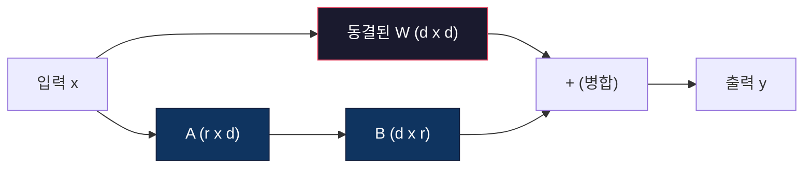

# LoRA 및 QLoRA를 사용한 Fine-Tuning

> 7B 모델을 전체 fine-tuning하려면 56GB의 VRAM이 필요합니다. 당신에게는 그게 없습니다. 대부분의 회사에도 없습니다. LoRA는 1% 미만의 파라미터를 훈련하여 같은 모델을 6GB에서 fine-tune할 수 있게 합니다. 이것은 절충안이 아닙니다 -- 대부분의 작업에서 전체 fine-tuning 품질과 일치합니다. 전체 오픈소스 fine-tuning 생태계가 이 하나의 트릭에서 실행됩니다.

**유형:** 실습
**언어:** Python
**선수 과목:** Phase 10, Lesson 06 (Instruction Tuning / SFT)
**소요 시간:** ~75분
**관련:** Phase 10은 처음부터 SFT/DPO 루프를 다룹니다. 이 단원은 그것들을 2026 PEFT 도구(TPEFT, TRL, Unsloth, Axolotl, LLaMA-Factory)에 연결합니다.

## 학습 목표

- 사전 훈련된 모델의 주의 레이어에 저랭크 어댑터 행렬(A와 B)을 주입하여 LoRA 구현
- LoRA 대 전체 fine-tuning의 파라미터 절감 계산: d_model 차원이 있는 순위 r은 d^2 대신 2*r*d 파라미터를 훈련
- QLoRA(4비트 양자화된 기본 모델 + LoRA 어댑터)를 사용하여 소비자 GPU 메모리에 맞추기 위해 모델 fine-tune
- 배포를 위해 LoRA 가중치를 기본 모델에 병합하고 어댑터 유무에 따른 추론 속도 비교

## 문제

기본 모델이 있습니다. Llama 3 8B. 고객 지원 티켓에 회사 목소리로 답변하게 싶습니다. SFT가 답입니다. 하지만 SFT에는 비용 문제가 있습니다.

전체 fine-tuning은 모델의 모든 파라미터를 업데이트합니다. Llama 3 8B에는 80억 개의 파라미터가 있습니다. fp16에서 각 파라미터는 2바이트를 차지합니다. 가중치만 로드하려면 16GB입니다. 훈련 중에는 그래디언트(16GB), Adam용 옵티마이저 상태(모멘텀 + 분산에 32GB) 및 활성화도 필요합니다. 총계: 단일 8B 모델에 대해 roughly 56GB의 VRAM.

A100 80GB는 barely 이것을 맞출 수 있습니다. 두 개의 A100은 클라우드 제공자에서 시간에 $3-4입니다. 50,000개 예제에서 3 epochs 훈련하려면 6-10시간이 걸립니다. 그것은 실험당 $30-40입니다. 하이퍼파라미터를 올바르게 얻으려면 10번의 실험을 실행하면 아무것도 배포하기 전에 $400을 spent했습니다.

이것을 Llama 3 70B로 확장하면 숫자가 황당해집니다. 가중치에만 140GB. 클러스터가 필요합니다. 실험당 $100 이상.

더 깊은 문제도 있습니다. 전체 fine-tuning은 모델의 모든 가중치를 수정합니다. 고객 지원 데이터로 fine-tune하면 모델의 일반 기능이 degraded될 수 있습니다. 이것을 catastrophic forgetting이라고 합니다. 모델이 작업에서 더 좋아지고 다른 모든 것에서 더 나빠집니다.

더 적은 파라미터를 훈련하고, 더 적은 메모리를 사용하며, 모델의 기존 지식을 파괴하지 않는 방법이 필요합니다.

## 개념

### LoRA: 저랭크 어�테이션

Microsoft의 Edward Hu와 동료들이 2021년 6월에 LoRA를公开发표했습니다. 논문의 통찰력: fine-tuning 중 가중치 업데이트에는 낮은 본질적 순위가 있습니다. 4096x4096 가중치 행렬에서 모든 1670만 개의 파라미터를 업데이트할 필요가 없습니다. 업데이트의 유용한 정보는 순위 16 또는 32의 행렬로 포착될 수 있습니다.

수학은 다음과 같습니다. 표준 선형 레이어는 계산합니다:

```
y = Wx
```

W는 d_out x d_in 행렬입니다. 4096x4096 주의 프로젝션에 대해 이것은 16,777,216개의 파라미터입니다.

LoRA는 W를 동결하고 저랭크 분해를 추가합니다:

```
y = Wx + BAx
```

B는 (d_out x r)이고 A는 (r x d_in)입니다. 순위 r은 d보다 훨씬 작습니다 -- typically 8, 16 또는 32.

r=16에서 4096x4096 레이어:
- 원래 파라미터: 4096 x 4096 = 16,777,216
- LoRA 파라미터: (4096 x 16) + (16 x 4096) = 65,536 + 65,536 = 131,072
- 감소: 131,072 / 16,777,216 = 0.78%

파라미터의 0.78%를 훈련하고 품질의 95-100%를 얻습니다.



A는 무작위 가우시안으로 초기화됩니다. B는 0으로 초기화됩니다. 이것은 LoRA 기여가 0에서 시작함을 의미합니다 -- 모델은 원래 동작에서 훈련을 시작하고 점진적으로 적응을 학습합니다.

### 스케일링 인자: Alpha

LoRA는 저랭크 업데이트가 출력에 영향을 미치는 정도를 제어하는 스케일링 인자 alpha를 도입합니다:

```
y = Wx + (alpha / r) * BAx
```

alpha = r일 때 스케일링은 1x입니다. alpha = 2r(일반적인 기본값)일 때 스케일링은 2x입니다. 이 하이퍼파라미터는 기본 학습 속도와 독립적으로 LoRA 경로의 학습 속도를 제어합니다.

실용적인 지침:
- alpha = 2 * rank는 일반적인 커뮤니티 규칙입니다 (원래 논문은 대부분의 실험에서 alpha = rank를 사용했습니다)
- alpha = rank는 1x 스케일링, 보수적이지만 안정적
- 더 높은 alpha는 단계당 더 큰 업데이트를 의미하며 수렴을 가속화하거나 불안정성을 유발할 수 있습니다

### LoRA 적용 위치

transformer에는 많은 선형 레이어가 있습니다. 모두에 LoRA를 추가할 필요가 없습니다. 원래 논문은 서로 다른 조합을 테스트했습니다:

| 대상 레이어 | 훈련 가능 파라미터 (7B) | 품질 |
|--------------|----------------------|---------|
| q_proj만 | 4.7M | 좋음 |
| q_proj + v_proj | 9.4M | 더 좋음 |
| q_proj + k_proj + v_proj + o_proj | 18.9M | 주의에 최적 |
| 모든 선형 (주의 + MLP) | 37.7M | 한계적 이익, 2배 파라미터 |

대부분의 작업에 대한甜蜜점: q_proj + v_proj. 이것은 모델이 attend하는 내용과 어떤 정보를 추출하는지를 제어하는 self-attention의 query 및 value 프로젝션을 대상으로 합니다. MLP 레이어 추가는 코드 생성과 같은 복잡한 작업에 도움이 되지만 더 간단한 작업에서 diminishing returns를 위해 파라미터 수를 두 배로 만듭니다.

### 순위 선택

순위 r은 적응의 표현력을 제어합니다:

| 순위 | 훈련 가능 파라미터 (레이어당) | 최적 |
|------|---------------------------|----------|
| 4 | 32,768 | 간단한 분류, 감정 |
| 8 | 65,536 | 단일 도메인 Q&A, 요약 |
| 16 | 131,072 | 다중 도메인 작업, 지시 따르기 |
| 32 | 262,144 | 복잡한 추론, 코드 생성 |
| 64 | 524,288 | 대부분의 작업에서 한계적 이익 |
| 128 | 1,048,576 | 드물게 정당화됨 |

Hu et al.은 r=4가 이미 간단한 작업의 대부분의 적응을 포착함을 보여주었습니다. r=8과 r=16이 실전에서 가장 흔한 선택입니다. r=64를 넘으면 품질이 향상되고 LoRA의 메모리 이점을 잃기 시작합니다.

### QLoRA: 4비트 양자화 + LoRA

Washington 대학의 Tim Dettmers와 동료들이 2023년 5월에 QLoRA를公开发표했습니다. 아이디어: 동결된 기본 모델을 4비트 정밀도로 양자화한 다음 그 위에 fp16에서 LoRA 어댑터를 연결합니다.

이것은 메모리 방정식을劇的に 변경합니다:

| 방법 | 가중치 메모리 (7B) | 훈련 메모리 (7B) | 필요한 GPU |
|--------|-------------------|---------------------|-------------|
| 전체 fine-tune (fp16) | 14GB | ~56GB | 1x A100 80GB |
| LoRA (fp16 기본) | 14GB | ~18GB | 1x A100 40GB |
| QLoRA (4비트 기본) | 3.5GB | ~6GB | 1x RTX 3090 24GB |

QLoRA는 세 가지 기술적 기여를 합니다:

**NF4 (Normal Float 4-bit)**: 신경망 가중치 전용으로 설계된 새로운 데이터 유형입니다. 신경망 가중치는 roughly 정규 분포를 따릅니다. NF4는 표준 정규 분포의 분위수에 16개의 양자화 레벨을 배치합니다. 이것은 정규 분포 데이터에 대해 정보 이론적으로 최적입니다. 균일 4비트 양자화(INT4) 또는 표준 Float4보다 적은 정보를 손실합니다.

**이중 양자화**: 양자화 상수 자체가 메모리를消費합니다. 64개의 가중치 블록마다 fp32 스케일 인자(4바이트)가 필요합니다. 7B 모델의 경우 이는额外的 0.4GB입니다. 이중 양자화는 이 상수를 fp8로 양자화하여 오버헤드를 0.1GB로 줄입니다. 작지만 누적됩니다.

**페이지된 옵티마이저**: 훈련 중 옵티마이저 상태(Adam의 모멘텀 및 분산)는 긴 시퀀스에서 GPU 메모리를 초과할 수 있습니다. 페이지된 옵티마이저는 NVIDIA의 통합 메모리를 사용하여 GPU 메모리가 소진될 때 옵티마이저 상태를 CPU RAM으로自動的に 페이징하고 필요할 때 다시 페이징합니다. 이것은 일부 처리량을 희생하여 OOM 크래시를防止합니다.

### 품질 문제

파라미터를 줄이거나 기본 모델을 양자화하면 품질이 떨어집니까? 여러 논문의 결과:

| 방법 | MMLU (5-shot) | MT-Bench | HumanEval |
|--------|--------------|----------|-----------|
| 전체 fine-tune (Llama 2 7B) | 48.3 | 6.72 | 14.6 |
| LoRA r=16 | 47.9 | 6.68 | 14.0 |
| QLoRA r=16 (NF4) | 47.5 | 6.61 | 13.4 |
| QLoRA r=64 (NF4) | 48.1 | 6.70 | 14.2 |

r=16의 LoRA는 대부분의 벤치마크에서 전체 fine-tuning의 1% 이내입니다. r=16의 QLoRA는 다시 분수의 퍼센트를 잃습니다. r=64의 QLoRA는 90% 적은 메모리를 사용하면서 essentially 전체 fine-tuning과 일치합니다.

### 실제 비용

50,000개 예제에서 Llama 3 8B fine-tuning (3 epochs):

| 방법 | GPU | 시간 | 비용 |
|--------|-----|------|------|
| 전체 fine-tune | 2x A100 80GB | 8시간 | ~$32 |
| LoRA r=16 | 1x A100 40GB | 4시간 | ~$8 |
| QLoRA r=16 | 1x RTX 4090 24GB | 6시간 | ~$5 |
| QLoRA r=16 (Unsloth) | 1x RTX 4090 24GB | 2.5시간 | ~$2 |
| QLoRA r=16 | 1x T4 16GB | 12시간 | ~$4 |

단일 소비자 GPU에서 QLoRA는 점심보다 적게 듭니다. 이것이 2023년에 오픈 가중치 fine-tuning 커뮤니티가 폭발한 이유이며 2026년 아래의 모든 훈련 프레임워크가 기본적으로 QLoRA를 shipping하는 이유입니다.

### 2026 PEFT 스택

| 프레임워크 | 무엇인가 | 선택할 때 |
|-----------|-----------|-----------|
| **Hugging Face PEFT** | 표준 LoRA/QLoRA/DoRA/IA3 라이브러리 | 원시 제어가 필요하고 훈련 루프가 이미 `transformers.Trainer`에 있음 |
| **TRL** | HF의 강화-from-피드백 훈련기 (SFT, DPO, GRPO, PPO, ORPO) | SFT 후 DPO/GRPO가 필요함; PEFT 위에 구축됨 |
| **Unsloth** | forward/backward 패스의 Triton 커널 재작성 | 정확도 손실 없이 2-5x 속도 향상 + 절반의 VRAM; Llama/Mistral/Qwen 제품군 |
| **Axolotl** | PEFT + TRL + DeepSpeed + Unsloth 위의 YAML-config 래퍼 | 재현 가능한 버전 관리 훈련 실행을 원함 |
| **LLaMA-Factory** | PEFT + TRL 위의 GUI/CLI/API | 제로 코드 fine-tuning을 원함; 100+ 모델 제품군 지원 |
| **torchtune** | 네이티브 PyTorch 레시피, `transformers` 의존성 없음 | 최소 의존성을 원하고 조직이 이미 PyTorch에 표준화됨 |

경험 규칙: 연구 사용 또는 일회성 실험 → PEFT. 반복 가능한 프로덕션 파이프라인 → Unsloth 커널이 활성화된 Axolotl. 일회성 프로토타이핑 → LLaMA-Factory.

### 어댑터 병합

훈련 후 두 가지 것이 있습니다: 동결된 기본 모델과 작은 LoRA 어댑터(typically 10-100MB). 다음 중 하나를 선택할 수 있습니다:

1. **它们を分开保管**: 기본 모델을 로드하고 어댑터를 위에 로드합니다. 작업마다 어댑터를 전환합니다. 이것이 한 기본 모델에서 여러 fine-tuned 변형을 서빙하는 방법입니다.

2. **영구적으로 병합**: W' = W + (alpha/r) * BA를 계산하고 결과를 새로운 전체 모델로 저장합니다. 병합된 모델은 원본과 동일한 크기입니다. 추론 오버헤드 없음. 관리할 어댑터 없음.

여러 작업 서빙(고객 지원 어댑터, 코드 어댑터, 번역 어댑터)의 경우它们を分开保管합니다. 단일 특수화된 모델 배포의 경우 병합합니다.

여러 어댑터 결합을 위한 고급 병합 기술:

- **TIES-Merging** (Yadav et al. 2023): 작은 크기 파라미터를 정리하고, 부호 충돌을 해결한 다음 병합합니다. 어댑터 간 간섭을 줄입니다.
- **DARE** (Yu et al. 2023): 병합하기 전에 어댑터 파라미터를 무작위로 드롭하고 나머지를 다시 스케일합니다. 능력을 결합하는 데驚くievably 효과적입니다.
- **Task arithmetic**: 단순히 어댑터 가중치를 더하거나 뺍니다. "코드" 어댑터와 "수학" 어댑터를 추가하면 often 둘 다에 좋은 모델이 생성됩니다.

### Fine-tuning을 하지 말아야 할 때

Fine-tuning은 세 번째 옵션이지 첫 번째가 아닙니다.

**첫 번째: 프롬프트 엔지니어링.** 더 나은 시스템 프롬프트를 작성합니다. 퓨샷 예제를 추가합니다. Chain-of-thought를 사용합니다. 이것은 비용이 들지 않고 분만 걸립니다. 프롬프팅이 80%까지 도달하면 fine-tuning이 필요하지 않을 수 있습니다.

**두 번째: RAG.** 문서를 검색하고 컨텍스트로 제공합니다. 이것은 모델의 지식을 업데이트하지 않고 동적인 새로운 정보에 접근할 수 있게 합니다. fine-tuning보다 훨씬 저렴하고 문서가 변경되면 쉽게 업데이트할 수 있습니다.

**세 번째: fine-tuning.** 프롬프트와 RAG로 달성할 수 없으면 fine-tuningを検討합니다. 모델이 특정 스타일, 톤 또는 작업별 지식을 일관되게 adopt해야 할 때만 fine-tune하세요.

## 실습

### 단계 1: LoRA 구성 설정

```python
from peft import LoraConfig, get_peft_model

def create_lora_config(rank=16, alpha=32, target_modules=None):
    if target_modules is None:
        target_modules = ["q_proj", "v_proj"]

    lora_config = LoraConfig(
        r=rank,
        lora_alpha=alpha,
        target_modules=target_modules,
        lora_dropout=0.05,
        bias="none",
        task_type="CAUSAL_LM"
    )
    return lora_config

def apply_lora_to_model(model, lora_config):
    model = get_peft_model(model, lora_config)
    model.print_trainable_parameters()
    return model
```

### 단계 2: QLoRA를 위한 양자화 구성

```python
from transformers import BitsAndBytesConfig

def create_quantization_config():
    return BitsAndBytesConfig(
        load_in_4bit=True,
        bnb_4bit_use_double_quant=True,
        bnb_4bit_quant_type="nf4",
        bnb_4bit_compute_dtype="float16"
    )
```

### 단계 3: 기본 모델 로드 (QLoRA)

```python
def load_model_for_qlora(model_name, quantization_config):
    from transformers import AutoModelForCausalLM, AutoTokenizer

    model = AutoModelForCausalLM.from_pretrained(
        model_name,
        quantization_config=quantization_config,
        device_map="auto"
    )
    tokenizer = AutoTokenizer.from_pretrained(model_name)
    return model, tokenizer
```

### 단계 4: 훈련 인자 정의

```python
def create_training_arguments(output_dir, per_device_train_batch_size=4, gradient_accumulation_steps=4):
    from transformers import TrainingArguments

    return TrainingArguments(
        output_dir=output_dir,
        per_device_train_batch_size=per_device_train_batch_size,
        gradient_accumulation_steps=gradient_accumulation_steps,
        optim="paged_adamw_32bit",
        learning_rate=2e-4,
        weight_decay=0.001,
        fp16=True,
        max_grad_norm=0.3,
        num_train_epochs=3,
        evaluation_strategy="no",
        save_strategy="epoch",
        logging_steps=10,
        warmup_ratio=0.03,
        push_to_hub=False,
        report_to="none"
    )
```

### 단계 5: 훈련기 설정 및 훈련

```python
def train_with_lora(model, tokenizer, train_dataset, eval_dataset, training_args, lora_config):
    from transformers import DataCollatorForLanguageModeling, Trainer

    def tokenize_function(examples):
        return tokenizer(
            examples["text"],
            truncation=True,
            max_length=512,
            padding="max_length"
        )

    train_dataset = train_dataset.map(tokenize_function, batched=True)
    eval_dataset = eval_dataset.map(tokenize_function, batched=True)

    data_collator = DataCollatorForLanguageModeling(
        tokenizer=tokenizer,
        mlm=False
    )

    trainer = Trainer(
        model=model,
        args=training_args,
        train_dataset=train_dataset,
        eval_dataset=eval_dataset,
        data_collator=data_collator
    )

    trainer.train()
    return model
```

### 단계 6: 어댑터 병합

```python
def merge_lora_adapters(model, base_model_path, output_path):
    from peft import PeftModel
    from transformers import AutoModelForCausalLM, AutoTokenizer

    base_model = AutoModelForCausalLM.from_pretrained(
        base_model_path,
        torch_dtype=torch.float16,
        device_map="auto"
    )

    model = PeftModel.from_pretrained(base_model, model.name_or_path)

    merged_model = model.merge_and_unload()
    merged_model.save_pretrained(output_path)

    tokenizer = AutoTokenizer.from_pretrained(base_model_path)
    tokenizer.save_pretrained(output_path)

    return merged_model
```

### 단계 7: 추론 비교

```python
def compare_inference(base_model, adapter_model, tokenizer, prompts):
    import torch

    results = {}

    for name, model in [("base", base_model), ("adapter", adapter_model)]:
        times = []
        for prompt in prompts:
            inputs = tokenizer(prompt, return_tensors="pt").to(model.device)

            import time
            start = time.time()
            with torch.no_grad():
                outputs = model.generate(**inputs, max_new_tokens=100)
            elapsed = time.time() - start

            times.append(elapsed)

        results[name] = {
            "avg_time": sum(times) / len(times),
            "outputs": [tokenizer.decode(o, skip_special_tokens=True) for o in outputs]
        }

    return results
```

## 활용

### Hugging Face TRL로 SFT

```python
from trl import SFTTrainer
from transformers import AutoModelForCausalLM, AutoTokenizer

model = AutoModelForCausalLM.from_pretrained("meta-llama/Llama-3.2-1B")
tokenizer = AutoTokenizer.from_pretrained("meta-llama/Llama-3.2-1B")

trainer = SFTTrainer(
    model=model,
    train_dataset=train_dataset,
    dataset_text_field="text",
    max_seq_length=512,
    tokenizer=tokenizer,
    args=training_args
)

trainer.train()
```

### DPO로 fine-tuning된 모델 개선

```python
from trl import DPOTrainer

dpo_trainer = DPOTrainer(
    model=model,
    ref_model=ref_model,
    beta=0.1,
    train_dataset=preference_dataset,
    tokenizer=tokenizer,
    args=training_args
)

dpo_trainer.train()
```

### Unsloth를 사용한 가속화

```python
from unsloth import FastLanguageModel

model, tokenizer = FastLanguageModel.from_pretrained(
    model_name="unsloth/Llama-3.2-1B-bnb-4bit",
    max_seq_length=2048,
    dtype=None,
    load_in_4bit=True
)

model = FastLanguageModel.get_peft_model(
    model,
    r=16,
    target_modules=["q_proj", "k_proj", "v_proj", "o_proj"],
    lora_alpha=32,
    lora_dropout=0.05,
    bias="none"
)
```

## 결과물

이 단원은 다음을 생성합니다:
- `outputs/skill-lora-finetuning.md` -- LoRA/QLoRA를 사용한 fine-tuning을 위한的决定 프레임워크
- `outputs/prompt-lora-config-advisor.md` -- 특정 작업에 대한 LoRA 순위 및 대상 레이어 선택을 위한 프롬프트

## 연습 문제

1. 다양한 순위(r=4, 8, 16, 32)로 Llama 모델에서 LoRA를训练的합니다. 각 구성에 대해 훈련 가능한 파라미터 수와训练 시간을 기록합니다. 품질 대 비용 tradeoff를 플롯합니다.

2. q_proj만 대 q_proj+v_proj 대 모든 주의 프로젝션에 LoRA를 적용합니다. 동일한 데이터 세트에서 훈련하고eval하여 어느 것이 가장 좋은 품질을 제공하는지 확인합니다.

3. 이중 양자화 vs non-이중 양자화로 QLoRA를训练的합니다. 메모리 사용량과 최종 모델 품질의 차이를 측정합니다.

4. LoRA 어댑터와 병합된 모델의 추론 속도를 비교합니다. 어댑터가 있는 모델과 없는 모델의 생성 속도와 출력 품질이 어떻게 다른지 측정합니다.

5. 두 개의 다른 작업(예: 요약 및 코드 생성)에 대해训练된 두 개의 LoRA 어댑터를 결합합니다. TIES-Merging 또는 DARE를 사용하여 결합하고 결합된 모델이 두 작업에서 모두 얼마나 잘 수행되는지 평가합니다.

## 핵심 용어

| 용어 |人们在说什么 |실제로 의미하는 것 |
|------|----------------|----------------------|
| LoRA | "저랭크 어�테이션" | 사전 훈련된 가중치의 저랭크 분해를 훈련하여 전체 fine-tuning보다 훨씬 적은 파라미터로 모델을 적용하는 기술 |
| QLoRA | "양자화된 LoRA" | 4비트 양자화된 기본 모델에 LoRA를 적용하여 단일 소비자 GPU에서大型 모델 훈련 가능 |
| 순위 (r) | "어댑터 크기" | LoRA 어댑터 행렬의 순위; 높을수록 표현력이 높지만 훈련 가능한 파라미터가 더 많음 |
| Target 모듈 | "어디에 적용합니까" | LoRA가 삽입되는 transformer 레이어 (typically q_proj 및 v_proj) |
| 어댑터 병합 | "영구화" | LoRA 가중치를 기본 모델에 합쳐서 추론을 위해 별도의 어댑터 없이 단일 모델 생성 |
| PEFT | "파라미터 효율적 fine-tuning" | 전체 모델을 훈련하지 않고 모델을 적용하기 위한 기술 모음 (LoRA, IA3, LoRA 등) |
| NF4 | "4비트 정규 부동 소수점" | 신경망 가중치용으로 설계된 4비트 데이터 타입; 정규 분포에 최적화된 양자화 수준 |
| catastrophic forgetting | "기존 지식 손실" | 새 작업으로 fine-tuning할 때 모델이 이전에 학습한 작업을 잊는 현상 |

## 추가 자료

- Hu et al., "LoRA: Low-Rank Adaptation of Large Language Models" (2021) -- LoRA의 원본 논문
- Dettmers et al., "QLoRA: Efficient Finetuning of Quantized LLMs" (2023) -- QLoRA 논문
- PEFT 라이브러리 문서 (huggingface.co/docs/peft) -- LoRA, QLoRA 및 기타 PEFT 기술의 실용적 가이드
- Unsloth 문서 (unsloth.ai) -- Triton 커널 가속에 대한 정보
- Axolotl 문서 (github.com/OpenAccess-AI-Collective/axolotl) -- YAML 구성 훈련을 위한 참조
- LLaMA-Factory (github.com/hiyouga/LLaMA-Factory) -- 제로 코드 fine-tuning을 위한 GUI 및 CLI