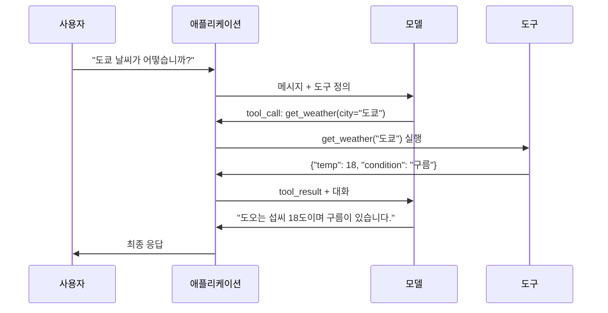

# 함수 호출 및 도구 사용

> LLM은 아무 것도 할 수 없습니다. 그들은 텍스트를 생성합니다. 그것이 전체 능력입니다. 날씨를 확인하고, 데이터베이스를 쿼리하고, 이메일을 보내고, 코드를 실행하거나 파일을 읽을 수 없습니다.见过的 모든 "AI agent"는 LLM이 어떤 함수를 호출할지를 나타내는 JSON을 생성하는 것입니다 -- 그리고 당신의 코드가 실제로 그것을 호출합니다. 모델은 뇌입니다. 도구는 손입니다. 함수 호출은 그것들을 연결하는 신경계입니다.

**유형:** 실습
**언어:** Python
**선수 과목:** Phase 11 Lesson 03 (Structured Outputs)
**소요 시간:** ~75분
**관련:** Phase 11 · 14 (Model Context Protocol) -- 도구가 호스트間で共有される 경우 인라인 함수-calling에서 MCP 서버로 전환합니다. 이 단원은 인라인 케이스를 다룹니다; MCP는 프로토콜 케이스를 다릅니다.

## 학습 목표

- 함수 호출 루프 구현: 도구 스키마 정의, 모델의 도구 호출 JSON 파싱, 함수 실행, 결과 반환
- 모델이 신뢰할 수 있게 호출할 수 있는 명확한 설명과 타입이 지정된 파라미터를 가진 도구 스키마 설계
- 복잡한 쿼리에 답하기 위해 여러 함수 호출을 체이닝하는 다중 턴 agent 루프 구축
- 함수 호출 에지 케이스 처리: 병렬 도구 호출, 오류 전파, 무한 도구 루프防止

## 문제

챗봇을 구축합니다. 사용자가 묻습니다: "지금은 도쿄 날씨가 어떻습니까?"

모델이 응답합니다: "실시간 날씨 데이터에 접근할 수 없지만, 계절을 보면 도오는 아마 섭씨 15도 정도일 것입니다..."

那是 탈에 disclaimer를 입힌 할루시네이션입니다. 모델은 날씨를 모릅니다. 영원히 모를 것입니다. 날씨는 매시간 변합니다. 모델의 훈련 데이터는 数달 전입니다.

올바른 답변에는 OpenWeatherMap API를 호출하고 현재 온도를 얻고 실제 숫자를 반환해야 합니다. 모델은 API를 호출할 수 없습니다. 당신의 코드는 가능합니다. 누락된 부분: 모델이 "이 인자로 날씨 API를 호출해야 합니다"라고 말하고 당신의 코드가 그것을 실행하여 결과를 피드백할 수 있게 하는 구조화된 프로토콜입니다.

이것이 함수 호출입니다. 모델은 어떤 함수를 어떤 인자로 호출할지를 설명하는 구조화된 JSON을 출력합니다. 당신의 애플리케이션이 함수를 실행합니다. 결과가 대화로 돌아갑니다. 모델이 결과를 사용하여 최종 답변을 생성합니다.

함수 호출 없으면 LLM은 백과사전입니다. 그것이 있으면 agent가 됩니다.

## 개념

### 함수 호출 루프

모든 도구 사용 상호작용은 동일한 5단계 루프를 따릅니다.



步骤 1: 사용자가 메시지를 보냅니다. 단계 2: 모델은 사용 가능한 함수를 설명하는 도구 정의(JSON 스키마)와 함께 메시지를 수신합니다. 단계 3: 텍스트로 응답하는 대신 모델이 도구 호출을 출력합니다 -- 함수 이름과 인자가 포함된 구조화된 JSON 객체. 단계 4: 당신의 코드가 함수를 실행하고 결과를 캡처합니다. 단계 5: 결과가 모델로 돌아가고, 모델은 이제 실제 데이터로 최종 답변을 생성합니다.

모델은 아무것도 실행하지 않습니다. 무엇을 호출할지와 어떤 인자로 호출할지만 결정합니다. 당신의 코드가 실행자입니다.

### 도구 정의: JSON 스키마 계약

각 도구는 모델에 함수 기능, 인자 및 인자 타입을 설명하는 JSON 스키마로 정의됩니다.

```json
{
  "type": "function",
  "function": {
    "name": "get_weather",
    "description": "도시의 현재 날씨를 가져옵니다. 섭씨 온도와 조건을 반환합니다.",
    "parameters": {
      "type": "object",
      "properties": {
        "city": {
          "type": "string",
          "description": "도시 이름, 예: '도쿄' 또는 '샌프란시스코'"
        },
        "units": {
          "type": "string",
          "enum": ["celsius", "fahrenheit"],
          "description": "온도 단위"
        }
      },
      "required": ["city"]
    }
  }
}
```

`description` 필드가 중요합니다. 모델은 도구를 언제 그리고 어떻게 사용할지 결정하기 위해它们을 읽습니다. "날씨를 가져옴"과 같은 모호한 설명은 "도시의 현재 날씨를 가져옵니다. 섭씨 온도와 조건을 반환합니다."보다 도구 선택이 더 나쁩니다. 설명은 도구 선택을 위한 프롬프트입니다.

### 제공자 비교

모든 주요 제공자가 함수 호출을 지원하지만 API 표면이 다릅니다.

| 제공자 | API 파라미터 | 도구 호출 형식 | 병렬 호출 | 강제 호출 |
|----------|--------------|-----------------|---------------|----------------|
| OpenAI (GPT-5, o4) | `tools` | `tool_calls[].function` | 예 (턴당 여러 개) | `tool_choice="required"` |
| Anthropic (Claude 4.6/4.7) | `tools` | `content[].type="tool_use"` | 예 (여러 블록) | `tool_choice={"type":"any"}` |
| Google (Gemini 3) | `function_declarations` | `functionCall` | 예 | `function_calling_config` |
| 오픈 가중치 (Llama 4, Qwen3, DeepSeek-V3) | Llama 4의 네이티브 `tools`; 다른 것은 Hermes 또는 ChatML | 혼합 | 모델依存 | 프롬프트 기반 또는 지원 시 `tool_choice` |

2026년까지 세 개의 폐쇄형 제공자는 거의 동일한 JSON-Schema 기반 형식으로 수렴했습니다. Llama 4는 OpenAI 형식과 일치하는 네이티브 `tools` 필드를 제공합니다. 오픈 가중치 fine-tune은 여전히 다양합니다 -- Hermes 형식(NousResearch)이 서드파티 fine-tune에 가장 흔합니다. 호스트간 공유 도구의 경우 인라인 함수-calling보다 MCP(Phase 11 · 14)를 선호합니다 -- 서버가 모든 곳에 동일합니다.

### 도구 선택: 자동, 필수, 특정

모델이 도구를 사용하는 시기를 제어합니다.

**자동** (기본값): 모델이 도구를 호출할지 직접 응답할지 결정합니다. "2+2는 무엇입니까?" -- 직접 응답. "날씨가 어떻습니까?" -- 도구 호출.

**필수**: 모델이 최소 하나의 도구를 호출해야 합니다. 사용자의 의도가 도구를 필요로 한다는 것을 알 때 사용합니다. 모델이 실제 데이터를 조회하는 대신 추측하는 것을防止합니다.

**특정 함수**: 모델이 특정 함수를 호출하도록 강제합니다. `tool_choice={"type":"function", "function": {"name": "get_weather"}}`는 쿼리와 무관하게 날씨 도구가 호출됨을 보장합니다. 라우팅에 사용합니다 -- 상류 로직이 이미 어떤 도구가 필요한지決定한 경우.

### 병렬 함수 호출

GPT-4o와 Claude는 단일 턴에서 여러 함수를 호출할 수 있습니다. 사용자가 묻습니다: "도쿄와 뉴욕의 날씨가 어떻습니까?" 모델이 동시에 두 도구 호출을 출력합니다:

```json
[
  {"name": "get_weather", "arguments": {"city": "도쿄"}},
  {"name": "get_weather", "arguments": {"city": "뉴욕"}}
]
```

당신의 코드가 둘 다 실행하고(이상적으로는 동시에), 두 결과를 반환하고, 모델이 단일 응답을 综合합니다. 이것은 라운드 트립을 2에서 1로 줄입니다. 쿼리당 5-10개의 도구 호출이 있는 agent의 경우 병렬 호출이 지연시간을 60-80% 줄입니다.

### 구조화된 출력 대 함수 호출

단원 03는 구조화된 출력을 다뤘습니다. 함수 호출은 다른 목적으로 동일한 JSON 스키마 Machado를 사용합니다.

**구조화된 출력**: 모델에 특정 형태의 데이터를 강제합니다. 출력이 최종 제품입니다. 예: 텍스트에서 `{name, price, in_stock}`으로 제품 정보 추출.

**함수 호출**: 모델이 작업 실행 의도를 선언합니다. 출력이 중간 단계입니다. 예: `get_weather(city="도쿄")` -- 모델이 최종 답변을Producing하는 것이 아니라 작업을 요청합니다.

데이터 추출이 필요하면 구조화된 출력을 사용합니다. 모델이 외부 시스템과 상호작용하도록 하려면 함수 호출을 사용합니다.

### 보안: 협상 불가능한 규칙

함수 호출은 LLM에 부여할 수 있는 가장 위험한 능력입니다. 모델이 무엇을 실행할지 선택합니다. 도구 세트에 데이터베이스 쿼리가 포함되어 있으면 모델이 쿼리를 구성합니다. 셸 명령이 포함되어 있으면 모델이它们을 작성합니다.

**규칙 1: 모델이 생성한 SQL을 데이터베이스에 직접 전달하지 마세요.** 모델은 DROP TABLE, UNION 주입 또는 모든 행을 반환하는 쿼리를 생성할 것입니다. 항상 매개변수화하세요. 항상 검증하세요. 항상 작업 허용 목록을 사용하세요.

**규칙 2: 함수를 허용 목록에 넣으세요.** 모델은 명시적으로 정의한 함수만 호출할 수 있습니다. "이름으로 모든 함수를 실행"하는 범용 도구를 구축하지 마세요. 50개의 내부 함수가 있으면 사용자에게 필요한 5개만 노출하세요.

**규칙 3: 인자를 검증하세요.** 모델이 `"; DROP TABLE users; --"`라는 도시 이름을 전달할 수 있습니다. 실행하기 전에 모든 인자를 예상 타입, 범위 및 형식에 대해 검증하세요.

**규칙 4: 도구 결과를 살균하세요.** 도구가 민감한 데이터(API 키, PII, 내부 오류)를 반환하면 모델에 다시 보내기 전에 필터링하세요. 모델은 도구 결과를 그대로 응답에 포함합니다.

**규칙 5: 도구 호출을 속도 제한하세요.** 루프의 모델은 수백 번 도구를 호출할 수 있습니다. 최대값을 설정하세요(대화당 10-20회 호출이 합리적입니다). 무한 루프를 끊으세요.

### 오류 처리

도구 실행은 실패할 수 있습니다. 네트워크 오류, 시간 초과, 잘못된 인자. 오류를 graceful하게 처리하는 것이 중요합니다.

**재시도**: 일시적 오류(네트워크超时)의 경우 1-2회 재시도합니다.

**폴백**: 도구가 실패하면 사용자에게 오류를 보고하고 대안적 접근 방식을 제안합니다.

**부분적 결과**: 일부 도구만 성공하면 모델이 부분 결과로 응답할 수 있도록 합니다.

## 실습

### 단계 1: 도구 스키마 정의

```python
def get_weather(city: str, units: str = "celsius") -> dict:
    """도시의 현재 날씨를 가져옵니다."""
    return {"temp": 18, "condition": "구름", "city": city}


def get_quote(symbol: str) -> dict:
    """주식 현재가를 가져옵니다."""
    return {"symbol": symbol, "price": 150.25, "currency": "USD"}


TOOLS = [
    {
        "type": "function",
        "function": {
            "name": "get_weather",
            "description": "도시의 현재 날씨를 가져옵니다. 섭씨 온도와 conditions를 반환합니다.",
            "parameters": {
                "type": "object",
                "properties": {
                    "city": {"type": "string", "description": "도시 이름"},
                    "units": {"type": "string", "enum": ["celsius", "fahrenheit"], "description": "온도 단위"}
                },
                "required": ["city"]
            }
        }
    },
    {
        "type": "function",
        "function": {
            "name": "get_quote",
            "description": "주식 현재가를 가져옵니다.",
            "parameters": {
                "type": "object",
                "properties": {
                    "symbol": {"type": "string", "description": "주식 심볼, 예: AAPL"}
                },
                "required": ["symbol"]
            }
        }
    }
]


def execute_tool(name: str, arguments: dict):
    if name == "get_weather":
        return get_weather(**arguments)
    elif name == "get_quote":
        return get_quote(**arguments)
    else:
        raise ValueError(f"Unknown tool: {name}")
```

### 단계 2: 도구 호출 파서

```python
import json


def parse_tool_calls(response_content: list) -> list:
    """응답 내용에서 도구 호출을 파싱합니다."""
    tool_calls = []

    for content_block in response_content:
        if content_block.type == "tool_use":
            tool_calls.append({
                "id": content_block.id,
                "name": content_block.name,
                "arguments": json.loads(content_block.input)
            })
        elif content_block.type == "tool_result":
            pass

    return tool_calls
```

### 단계 3: 도구 실행기

```python
def execute_tools(tool_calls: list, max_calls: int = 10) -> list:
    """도구 호출을 실행하고 결과를 반환합니다."""
    if len(tool_calls) > max_calls:
        raise ValueError(f"Too many tool calls: {len(tool_calls)} > {max_calls}")

    results = []
    for tool_call in tool_calls:
        try:
            result = execute_tool(tool_call["name"], tool_call["arguments"])
            results.append({
                "call_id": tool_call["id"],
                "name": tool_call["name"],
                "result": result,
                "error": None
            })
        except Exception as e:
            results.append({
                "call_id": tool_call["id"],
                "name": tool_call["name"],
                "result": None,
                "error": str(e)
            })

    return results
```

### 단계 4: 도구 사용 에이전트 루프

```python
def run_agent_loop(client, model, messages: list, tools: list, max_turns: int = 10):
    """다중 턴 에이전트 루프를 실행합니다."""
    for turn in range(max_turns):
        response = client.messages.create(
            model=model,
            max_tokens=1024,
            messages=messages,
            tools=tools
        )

        messages.append({"role": "assistant", "content": response.content})

        tool_calls = parse_tool_calls(response.content)

        if not tool_calls:
            print(f"최종 응답: {response.content[0].text}")
            return response.content[0].text

        tool_results = execute_tools(tool_calls)

        for result in tool_results:
            messages.append({
                "role": "user",
                "content": [{
                    "type": "tool_result",
                    "tool_use_id": result["call_id"],
                    "content": json.dumps(result["result"]) if result["result"] else result["error"]
                }]
            })

        print(f"턴 {turn + 1}: {len(tool_calls)} 도구 호출, {len(tool_results)} 결과")
```

### 단계 5: 완전한 예제

```python
def main():
    import anthropic

    client = anthropic.Anthropic()

    messages = [{"role": "user", "content": "도쿄와 뉴욕의 날씨와 Apple 주식을 알려주세요."}]

    result = run_agent_loop(
        client=client,
        model="claude-opus-4-7",
        messages=messages,
        tools=TOOLS,
        max_turns=5
    )

    print(f"\n최종 결과: {result}")


if __name__ == "__main__":
    main()
```

## 활용

### OpenAI 함수 호출

```python
from openai import OpenAI

client = OpenAI()

response = client.chat.completions.create(
    model="gpt-4o",
    messages=[{"role": "user", "content": "도쿄 날씨를 알려주세요."}],
    tools=[
        {
            "type": "function",
            "function": {
                "name": "get_weather",
                "parameters": {
                    "type": "object",
                    "properties": {"city": {"type": "string"}},
                    "required": ["city"]
                }
            }
        }
    ],
    tool_choice="auto"
)

tool_calls = response.choices[0].message.tool_calls
for call in tool_calls:
    print(f"도구: {call.function.name}, 인자: {call.function.arguments}")
```

### 병렬 도구 호출

```python
def execute_parallel(tool_calls: list) -> list:
    """병렬로 도구 호출을 실행합니다."""
    import concurrent.futures

    with concurrent.futures.ThreadPoolExecutor() as executor:
        futures = {
            executor.submit(execute_tool, tc["name"], tc["arguments"]): tc
            for tc in tool_calls
        }
        results = []
        for future in concurrent.futures.as_completed(futures):
            tc = futures[future]
            try:
                result = future.result()
                results.append({"call_id": tc["id"], "result": result})
            except Exception as e:
                results.append({"call_id": tc["id"], "error": str(e)})
        return results
```

### 오류 복구 및 재시도

```python
def execute_with_retry(tool_call: dict, max_retries: int = 3) -> dict:
    """재시도로 도구 호출을 실행합니다."""
    for attempt in range(max_retries):
        try:
            result = execute_tool(tool_call["name"], tool_call["arguments"])
            return {"success": True, "result": result}
        except Exception as e:
            if attempt == max_retries - 1:
                return {"success": False, "error": str(e)}
            import time
            time.sleep(2 ** attempt)
    return {"success": False, "error": "Max retries exceeded"}
```

## 결과물

이 단원은 다음을 생성합니다:
- `outputs/skill-function-calling.md` -- 함수 호출 패턴과 도구 사용 에이전트를 위한 결정 프레임워크
- `outputs/prompt-tool-schema-designer.md` -- 도구 스키마를 설계하기 위한 프롬프트

## 연습 문제

1. 세 개의 도구(날씨, 주식, 뉴스 검색)를 정의하고 다중 턴 대화를 통해 모두 호출하는 에이전트를 구축합니다.

2. 병렬 도구 호출과 순차 도구 호출의 성능을 비교합니다. 동일한 쿼리에 대해 두 접근 방식의 총 실행 시간을 측정합니다.

3. 도구 실행 실패 시 재시도 로직을 구현합니다. 일시적 오류와 영구적 오류를 구분하고 적절히 처리합니다.

4. 최대 도구 호출 수를 적용하여 무한 루프를 방지합니다. 10회 이상의 호출 후 에이전트를 중지하고 사용자에게 알립니다.

5. 도구 결과의 민감한 정보를 필터링하는 살균 함수를 구현합니다. API 응답에서 PII 및 내부 오류 메시지를 제거합니다.

## 핵심 용어

| 용어 |人们在说什么 |실제로 의미하는 것 |
|------|----------------|----------------------|
| 함수 호출 | "도구 사용" | LLM이 외부 함수를 실행하기 위해 구조화된 요청을 생성하는 메커니즘 |
| 도구 스키마 | "함수 계약" | 도구의 기능, 인자 및 타입을 설명하는 JSON 스키마 정의 |
| 도구 선택 | "어떤 도구를 사용할지" | 모델이 도구를 호출할지 직접 응답할지 또는 강제로 도구 호출을 결정하는 모드 |
| 병렬 호출 | "동시 도구 실행" | 단일 응답에서 여러 도구를 호출하여 라운드 트립을 줄임 |
| 도구 결과 | "실행 피드백" | 함수 실행의 결과가 모델에 반환되어 최종 응답 생성에 사용됨 |
| 오류 전파 | "실패 처리" | 도구 실행 실패를 모델에 전달하여 대안적 응답을 생성하게 함 |

## 추가 자료

- OpenAI 함수 호출 가이드 (platform.openai.com/docs/guides/function-calling) -- OpenAI의 함수 호출 구현
- Anthropic 도구 사용 가이드 (docs.anthropic.com/en/docs/tool-use) -- Claude의 도구 사용 접근 방식
- Google Gemini 함수 호출 (ai.google.dev/docs/function_calling) -- Gemini의 함수 선언 형식
- 함수 호출 안전 가이드 (github.com/anthropics/function-calling-safety) -- 도구 사용의 보안 고려 사항