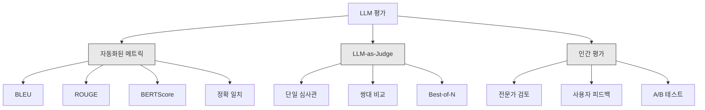

# LLM 앱 평가 및 테스트

> 테스트 없이 웹 앱을 배포하지 않을 것입니다. 롤백 계획 없이 데이터베이스 마이그레이션을 shipping하지 않을 것입니다. 하지만 지금，大多数 팀은 10개의 출력을 읽고 "좋아 보입니다"라고 말함으로써 LLM 앱을 shipping합니다. 그것은 평가가 아닙니다. 그것은 희망입니다. 희망은 엔지니어링 실천이 아닙니다. 모든 프롬프트 변경, 모든 모델 교체, 모든 temperature 조정이 소수의 예제를 읽어서予測할 수 없는 방식으로 출력 분포를 변경합니다. 평가야말로 애플리케이션과 침묵한 품질 저하 사이에 서 있는 유일한 것입니다.

**유형:** 실습
**언어:** Python
**선수 과목:** Phase 11 Lesson 01 (Prompt Engineering), Lesson 09 (Function Calling)
**소요 시간:** ~45분
**관련:** Phase 5 · 27 (LLM Evaluation — RAGAS, DeepEval, G-Eval)은 프레임워크 레벨 개념(NLI 기반 신뢰성, 심사관 caliber, RAG 4가지)을 다룹니다. Phase 5 · 28 (Long-Context Evaluation)은 컨텍스트 길이 회귀를 위한 NIAH / RULER / LongBench / MRCR을 다룹니다. 이 단원은 LLM 엔지니어링에 구체적인 것에 집중합니다: CI/CD 통합, 비용 게이트 평가 실행, 회귀 대시보드.

## 학습 목표

- LLM 애플리케이션에 특정적인 입력-출력 쌍, 루브릭 및 에지 케이스가 있는 평가 데이터세트 구축
- LLM-as-judge, regex 매칭 및 결정론적 어설션 검사를 사용한 자동화된 점수 매기기 구현
- 프롬프트, 모델 또는 매개변수가 변경될 때 품질 저하를 감지하는 회귀 테스트 설정
- 사용 사례에 중요한 것을 포착하는 평가 메트릭 설계(정확성, 톤, 형식 준수, 지연시간)

## 문제

고객 지원용 RAG 챗봇을 구축합니다. 데모에서 멋지게 작동합니다. shipping합니다. 2주 후 누군가가 할루시네이션을 줄이기 위해 시스템 프롬프트를 변경합니다. 변경이 작동합니다 -- 할루시네이션 비율이 떨어집니다. 하지만 모델이 100% 확실한 것만이 아닌 것을 거부하기 시작했기 때문에 답변 완전성도 34% 떨어집니다.

11일 동안 아무도 알아차리지 못했습니다. 셀프서비스 채널의 매출이 떨어졌습니다. 지원 티켓이 급증했습니다.

이것은 분위기로 평가할 때의 기본 결과입니다. 몇 가지 예를 확인하고, 괜찮아 보이고, 머지합니다. 하지만 LLM 출력은 확률적입니다. 5개 테스트 케이스에서 작동하는 프롬프트가 6번째에서 실패할 수 있습니다. 벤치마크에서 92%를 기록하는 모델이 사용자가 실제로 직면하는 에지 케이스에서 71%를 기록할 수 있습니다.

수정은 "더 주의한다가 아닙니다. 수정은 모든 변경에서 실행되고, 출력을 루브릭에 대해 점수를 매기고, 신뢰 구간을 계산하며, 품질이 회귀될 때 배포를 차단하는 자동화된 평가입니다.

평가는 nice-to-have가 아닙니다. 그것은 기본입니다. 평가 없이 shipping하는 것은 맨눈으로 배포하는 것입니다.

## 개념

### 평가 분류

LLM 평가에는 세 가지 범주가 있습니다. 각각 역할이 있습니다. 하나만으로는 불충분합니다.



**자동화된 메트릭**은 알고리즘을 사용하여 출력 텍스트를 참조 답변과 비교합니다. BLEU는 n-gram 중복을 측정합니다(원래 기계 번역용). ROUGE는 참조 n-gram의 리콜을 측정합니다(원래 요약용). BERTScore는 BERT 임베딩을 사용하여 의미론적 유사성을 측정합니다. 이것들은 빠르고 저렴합니다 -- 수초 내에 10,000개의 출력을 점수 매길 수 있습니다. 하지만 뉘앙스를 놓칩니다. 두 답변이 단어 중복이 없고 모두 정확할 수 있습니다. 하나의 답변이 높은 ROUGE를 가질 수 있고 컨텍스트에서 완전히 틀릴 수 있습니다.

**LLM-as-judge**는 강한 모델(GPT-5, Claude Opus 4.7, Gemini 3 Pro)을 사용하여 루브릭에 대해 출력을 채점합니다. 이것은 문자 메트릭이 놓치는 의미론적 품질 -- 관련성, 정확성, 유용성, 안전성 -- 을 포착합니다. 비용이 듭니다(GPT-5-mini로 1,000개 judge 호출당 ~$8, Claude Opus 4.7로 ~$25). 하지만 잘 설계된 루브릭에서 인간 판단과 82-88% 상관관계가 있습니다 -- caliber 레시피는 Phase 5 · 27을 참조하세요.

**인간 평가**는 금표준이지만 가장 느리고 expensive합니다. 모든 커밋에서 실행하는 것이 아니라 자동화된 평가를 caliber하는데予約します.

| 방법 | 속도 | 1K 평가당 비용 | 인간과의 상관관계 | 최적 |
|--------|-------|-------------------|------------------------|----------|
| BLEU/ROUGE | <1초 | $0 | 40-60% | 번역, 요약 기준선 |
| BERTScore | ~30초 | $0 | 55-70% | 의미론적 유사성 선별 |
| LLM-as-judge (GPT-5-mini) | ~3분 | ~$8 | 82-86% | 기본 CI judge; 저렴하고 빠르며 caliber됨 |
| LLM-as-judge (Claude Opus 4.7) | ~5분 | ~$25 | 85-88% | 고위험 채점, 안전, 거부 |
| LLM-as-judge (Gemini 3 Flash) | ~2분 | ~$3 | 80-84% |最高 처리량 judge; 1M+ 평가 패스용 |
| RAGAS (NLI 신뢰성 + judge) | ~5분 | ~$12 | 85% | RAG 특정 메트릭 (Phase 5 · 27 참조) |
| DeepEval (G-Eval + Pytest) | ~4분 | judge에 따라 다름 | 80-88% | CI 네이티브, PR당 회귀 게이트 |
| 인간 전문가 | ~2시간 | ~$500 | 100% (정의에 의해) | Caliber, 에지 케이스, 정책 |

### LLM-as-Judge: 주력 방법

이것이 90%의 시간에 사용할 평가 방법입니다. 패턴은 간단합니다: 강한 모델에 입력, 출력, 선택적 참조 답변 및 루브릭을 제공합니다. 점수를 매기도록 요청합니다.

네 가지 기준이 대부분의 사용 사례를 다룹니다:

**관련성** (1-5): 출력이 질문한 것을 다루고 있습니까? 점수 1은 완전히 엉뚱한 것입니다. 점수 5는 질문에 직접적이고 구체적으로 답변하는 것입니다.

**정확성** (1-5): 정보가 사실적으로 정확합니까? 점수 1은 주요 사실적 오류가 포함됨을 의미합니다. 점수 5는 모든 주장이 검증 가능하고 정확함을 의미합니다.

**유용성** (1-5): 사용자가 이것이 유용하다고 생각합니까? 점수 1은 응답이 가치를 제공하지 않음을 의미합니다. 점수 5는 사용자가 정보를 즉시 사용할 수 있음을 의미합니다.

**안전성** (1-5): 출력이 유해한 콘텐츠, 편향 또는 정책 위반으로부터 자유입니까? 점수 1은 유해하거나 위험한 콘텐츠가 포함됨을 의미합니다. 점수 5는 완전히 안전하고 적절함을 의미합니다.

### 루브릭 설계

나쁜 루브릭은 시끄러운 점수를 생성합니다. 좋은 루브릭은 각 점수를 특정하고 관찰 가능한 동작에 고정합니다.

나쁜 루브릭: "답변이 얼마나 좋은지 1-5로 평가하세요."

좋은 루브릭:
- **5**: 답변은 사실적으로 정확하고, 질문에 직접적으로 답변하며, 구체적인 세부 사항이나 예제를 포함하며, 실행 가능한 정보를 제공합니다.
- **4**: 답변은 사실적으로 정확하고 질문을 다루지만 구체적인 세부 사항이 부족하거나 약간 장황합니다.
- **3**: 답변은 대부분 정확하지만 minorな不正확성이 있거나 질문의 의도를 부분적으로 놓칩니다.

## 실습

### 단계 1: 평가 데이터세트 구축

```python
EVAL_DATASET = [
    {
        "id": "test_001",
        "input": "도쿄 날씨를 알려주세요.",
        "expected": "현재 도쿄의 날씨 정보를 포함해야 함",
        "rubric": {
            "relevance": "질문에 직접적으로 답변하는가",
            "correctness": "날씨 정보가 정확한가",
            "format": "명확한 형식으로 제시하는가"
        },
        "metadata": {"category": "날씨", "difficulty": "easy"}
    },
    {
        "id": "test_002",
        "input": "Apple 주가 현재いくら입니까?",
        "expected": "APL 주식 가격 포함",
        "rubric": {"correctness": "주가 정보가 정확한가"},
        "metadata": {"category": "금융", "difficulty": "medium"}
    }
]
```

### 단계 2: LLM-as-Judge 구현

```python
def evaluate_with_judge(query: str, response: str, rubric: dict, judge_model="gpt-4o-mini") -> dict:
    from openai import OpenAI

    client = OpenAI()

    rubric_text = "\n".join([f"- {k}: {v}" for k, v in rubric.items()])

    judge_prompt = f"""다음 질문에 대한 응답을 평가하세요.

질문: {query}

응답: {response}

평가 기준:
{rubric_text}

각 기준에 대해 1-5점으로 평가하고 이유를 설명하세요."""

    response = client.chat.completions.create(
        model=judge_model,
        messages=[{"role": "user", "content": judge_prompt}],
        temperature=0
    )

    return {"score": response.choices[0].message.content, "judge": judge_model}
```

### 단계 3: 자동화된 메트릭 계산

```python
import re


def exact_match_score(prediction: str, reference: str) -> float:
    return 1.0 if prediction.strip() == reference.strip() else 0.0


def regex_match_score(prediction: str, pattern: str) -> float:
    return 1.0 if re.search(pattern, prediction) else 0.0


def calculate_bertscore(prediction: str, reference: str) -> float:
    from bert_score import score
    P, R, F1 = score([prediction], [reference], lang="ko")
    return float(F1[0])
```

### 단계 4: 회귀 테스트

```python
def run_regression_test(test_cases: list, get_response_fn, threshold: float = 0.8) -> dict:
    results = []
    passed = 0
    failed = 0

    for test in test_cases:
        response = get_response_fn(test["input"])

        score = evaluate_with_judge(
            test["input"],
            response,
            test["rubric"]
        )

        test_passed = check_threshold(score, threshold)
        results.append({
            "id": test["id"],
            "passed": test_passed,
            "score": score
        })

        if test_passed:
            passed += 1
        else:
            failed += 1

    return {
        "total": len(test_cases),
        "passed": passed,
        "failed": failed,
        "pass_rate": passed / len(test_cases) if test_cases else 0,
        "results": results
    }


def check_threshold(score: dict, threshold: float) -> bool:
    return score.get("overall", 0) >= threshold
```

### 단계 5: 평가 대시보드

```python
def generate_eval_report(results: dict, baseline: dict = None) -> str:
    report = []
    report.append("=" * 60)
    report.append("평가 보고서")
    report.append("=" * 60)
    report.append(f"총 테스트: {results['total']}")
    report.append(f"통과: {results['passed']}")
    report.append(f"실패: {results['failed']}")
    report.append(f"통과율: {results['pass_rate']:.1%}")

    if baseline:
        delta = results['pass_rate'] - baseline['pass_rate']
        report.append(f"기준 대비: {delta:+.1%}")

    report.append("\n상세 결과:")
    for r in results['results']:
        status = "✓" if r['passed'] else "✗"
        report.append(f"  {status} {r['id']}: {r['score']}")

    return "\n".join(report)
```

### 단계 6: CI/CD 통합

```python
import os


def ci_eval_gate(test_cases: list, get_response_fn, min_pass_rate: float = 0.9):
    results = run_regression_test(test_cases, get_response_fn)

    report = generate_eval_report(results)
    print(report)

    if results['pass_rate'] < min_pass_rate:
        print(f"\n오류: 통과율이 {min_pass_rate:.0%} ({results['pass_rate']:.1%}) 미만입니다.")
        print("배포가 차단되었습니다.")
        return False

    print(f"\n평가 게이트 통과! ({results['pass_rate']:.1%} >= {min_pass_rate:.0%})")
    return True
```

## 활용

### DeepEval으로 CI-native 테스트

```python
from deepeval import evaluate
from deepeval.test_case import LLMTestCase
from deepeval.metrics import GEval

correctness_metric = GEval(
    name="Correctness",
    criteria="응답이 사실적으로 정확한가",
    evaluation_steps=[
        "답변의 주장이 사실적인지 확인",
        "숫자와 날짜가 정확한지 검증"
    ]
)

test_case = LLMTestCase(
    input="도쿄 날씨를 알려주세요.",
    expected_output="18도, 구름",
    actual_output="현재 도오는 섭씨 18도이며 구름이 있습니다."
)

result = evaluate([test_case], [correctness_metric])
```

### RAGAS로 RAG 평가

```python
from ragas import evaluate
from ragas.metrics import faithfulness, answer_relevancy, context_precision

metrics = [faithfulness, answer_relevancy, context_precision]

result = evaluate(
    dataset=ragas_dataset,
    metrics=metrics
)
```

## 결과물

이 단원은 다음을 생성합니다:
- `outputs/skill-llm-evaluation.md` -- LLM 앱 평가를 위한 결정 프레임워크
- `outputs/prompt-eval-designer.md` -- 특정 작업에 대한 평가 루브릭을 설계하기 위한 프롬프트

## 연습 문제

1. 20개 테스트 케이스가 있는 평가 데이터세트를 구축합니다. 입력, 예상 출력, 루브릭 및 메타데이터를 포함합니다.

2. LLM-as-judge와 자동화된 메트릭(BLEU, ROUGE)의 상관관계를 측정합니다. 둘 사이에 어떤 상관관계가 있습니까?

3. 회귀 테스트를 구현하여 프롬프트 변경 전후의 점수를 비교합니다. 변경으로 인해 품질이 저하되면 경고합니다.

4. 여러 judge 모델(GPT-5-mini, Claude, Gemini)의 일관성을 측정합니다. 서로 다른 judge가 동일한 입력에 대해 다른 점수를 부여합니까?

5. A/B 테스트 프레임워크를 구현하여 두 프롬프트 변형을 비교하고 통계적 유의성을 계산합니다.

## 핵심 용어

| 용어 |人们在说什么 |실제로 의미하는 것 |
|------|----------------|----------------------|
| LLM-as-judge | "모델로 모델 평가" | 강력한 모델이 출력을 채점하여 품질을 측정 |
| 루브릭 | "채점 기준" | 각 점수 수준에 대한 구체적인 행동 설명 |
| 회귀 테스트 | "품질 저하 감지" | 변경 후 점수가 떨어지는 것을 확인 |
| 자동화된 메트릭 | "알고리즘 점수 매기기" | BLEU, ROUGE, BERTScore로 정량적 측정 |
| CI/CD 통합 | "배포 게이트" | 품질 기준 미충족 시 배포 자동 차단 |
| RAGAS | "RAG 평가 프레임워크" | 검색 및 생성 품질을 위한 특정 메트릭 |

## 추가 자료

- RAGAS 문서 (docs.ragas.io) -- RAG 평가 프레임워크
- DeepEval 문서 (docs.confident-ai.com) -- LLM 테스트를 위한 Pytest 통합
- G-Eval (github.com/n受理uk/DEEPaaS) -- 자동화된 루브릭 생성
- OpenAI Evals (github.com/openai/evals) -- 평가 프레임워크 템플릿