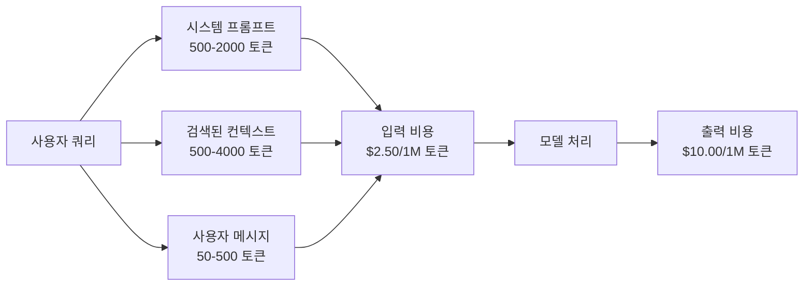
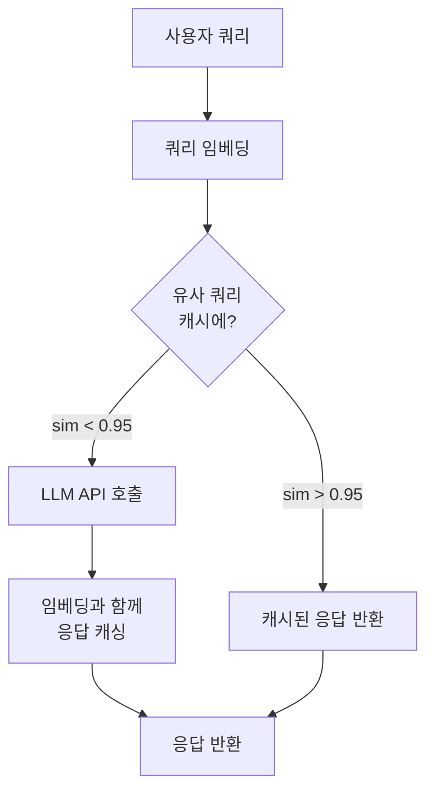
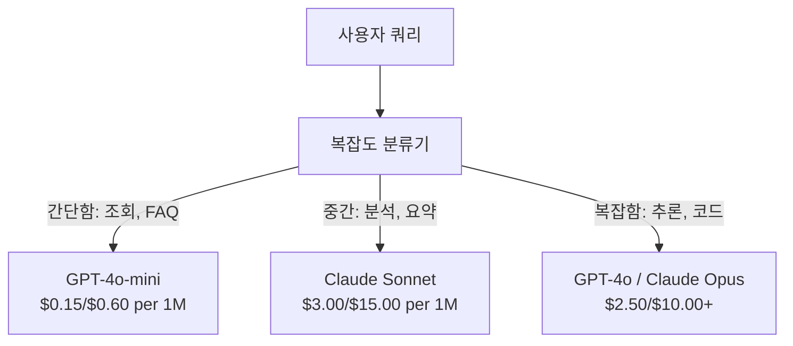

# 캐싱,Rate Limiting 및 비용 최적화

> 대부분의 AI 스타트업은 잘못된 모델로 죽지 않습니다. 잘못된 단위 경제학으로 죽습니다. 단일 GPT-4o 호출은 수 휘개 센트입니다. 하루에 10회 호출하는 10,000명의 사용자는 단 1달러도 벌기 전에 입력 토큰만으로 $250이 듭니다. 살아남는 회사들은 모든 API 호출을 함수 호출이 아닌 금융 거래로 취급하는 회사들입니다.

**유형:** 실습
**언어:** Python
**선수 과목:** Phase 11 Lesson 09 (Function Calling)
**소요 시간:** ~45분
**관련:** Phase 11 · 15 (Prompt Caching) -- 이 단원은 애플리케이션 레이어 캐싱(시맨틱 캐시, 정확한 해시 캐시, 모델 라우팅)을 다룹니다. Lesson 15는 provider 레이어 프롬프트 캐싱(Anthropic cache_control, OpenAI 자동, Gemini CachedContent)을 다룹니다. 둘을 결합하면 50-95% 비용 절감 효과를 얻을 수 있습니다.

## 학습 목표

- 반복되거나 유사한 쿼리를 새 API 호출 대신 캐시에서 제공하는 시맨틱 캐싱 구현
-提供商 간 요청당 비용 계산 및 토큰 인식 rate limiting과 예산 경고 구현
- 프롬프트 압축, 모델 라우팅(비싼 모델 vs 저렴한 모델), 응답 캐싱이 포함된 비용 최적화 레이어 구축
- 다양한 쿼리 유형에 대한 정확한 일치, 시맨틱 유사성 및 prefix 캐싱을 사용하는 계층화된 캐싱 전략 설계

## 문제

고객 지원용 RAG 챗봇을 구축합니다. 아름답게 작동합니다. 사용자들이 좋아합니다.

그러다가 청구서가 옵니다.

GPT-5는 백만 입력 토큰당 $5, 백만 출력 토큰당 $15입니다. Claude Opus 4.7은 입력 $15 / 출력 $75입니다. Gemini 3 Pro는 입력 $1.25 / 출력 $5입니다. GPT-5-mini는 $0.25/$2입니다. 아래 가격은 illustrative입니다; 항상 제공자의 현재 가격 페이지를 확인하세요.

스타트업을 죽이는 수학은 다음과 같습니다:

- 하루 10,000명의 활성 사용자
- 사용자당 하루 10회 쿼리
- 쿼리당 1,000개의 입력 토큰(시스템 프롬프트 + 컨텍스트 + 사용자 메시지)
- 응답당 500개의 출력 토큰

**일일 입력 비용:** 10,000 x 10 x 1,000 / 1,000,000 x $2.50 = **$250/일**
**일일 출력 비용:** 10,000 x 10 x 500 / 1,000,000 x $10.00 = **$500/일**
**월간 총액:** **$22,500/월**

이것은 그냥 LLM입니다. 임베딩, 벡터 데이터베이스 호스팅, 인프라를 추가하면 챗봇에 대해 $30,000/월을 보고 있습니다.

냉정한 부분: 这些 쿼리의 40-60%가 거의 중복입니다. 사용자들이 약간 다른 표현으로 같은 질문을 합니다. 시스템 프롬프트 -- 모든 요청에서 동일 -- 매번 청구됩니다. RAG로 검색된 컨텍스트 문서들이 같은 주제에 대해 질문하는 사용자들이 반복합니다.

중복 계산에全额を支払っています.

## 개념

### LLM 호출의 비용 구성 요소

모든 API 호출에는 5개의 비용 구성 요소가 있습니다.



시스템 프롬프트는 침묵한 살인자입니다. 모든 요청과 함께 전송되는 1,500 토큰 시스템 프롬프트는 그 prefix만으로도 백만 요청당 $3.75가 듭니다. 하루 100K 요청이면, 그것은 $375/일 -- $11,250/월 -- 변하지 않는 텍스트에 대해입니다.

### 제공자 캐싱: 내장된 할인

2026년 현재 세 명의 주요 제공자 모두 제공자 측 프롬프트 캐싱을 제공하지만, 메커니즘은 다릅니다. 깊은 내용은 Phase 11 · 15를 참조하세요.

| 제공자 | 메커니즘 | 할인 | 최소 | 캐시 기간 |
|----------|-----------|----------|---------|----------------|
| Anthropic | 명시적 cache_control 마커 | 캐시 적중 시 90% (쓰기 시 25% 프리미엄) | 1,024 토큰 (Sonnet/Opus), 2,048 (Haiku) | 기본 5분; 1시간 확장 (2x 쓰기 프리미엄) |
| OpenAI | 자동 prefix 매칭 | 캐시 적중 시 50% | 1,024 토큰 | 최선 노력으로 최대 1시간 |
| Google Gemini | 명시적 CachedContent API | ~75% 절감 (저장소 추가) | 4,096 (Flash) / 32,768 (Pro) | 사용자 구성 가능 TTL |

**Anthropic의 접근 방식**은 명시적입니다. 프롬프트 섹션을 `cache_control: {"type": "ephemeral"}`로 표시합니다. 첫 번째 요청은 25% 쓰기 프리미엄을 지불합니다. 같은 prefix를 가진 후속 요청은 90% 할인을 받습니다. 일반적으로 $0.005가 드는 2,000 토큰 시스템 프롬프트가 캐시 적중 시 $0.000625입니다. 100K 요청에서 이는 $437.50/일을 절약합니다.

**OpenAI의 접근 방식**은 자동입니다. 이전 요청과 일치하는 모든 프롬프트 prefix가 50% 할인을 받습니다. 마커가 필요하지 않습니다. tradeoff: 더 작은 할인, 더 적은 control, 하지만 제로 구현 노력.

### 시맨틱 캐싱: 커스텀 레이어

제공자 캐싱은 동일한 prefix에서만 작동합니다. 시맨틱 캐싱은 더 어려운 케이스를 처리합니다: 같은 의미의 다른 쿼리.

"반품 정책이 뭐야?"와 "물품을 반품하려면 어떻게 해야 해?"는 다른 문자열이지만 동일한 의도입니다. 시맨틱 캐시는 두 쿼리를 임베딩하고, 코사인 유사도를 계산하고, 유사도가しきい値(일반적으로 0.92-0.95)을 초과하면 캐시된 응답을 반환합니다.



임베딩 비용는 무시할 수 있습니다. OpenAI의 text-embedding-3-small은 백만 토큰당 $0.02입니다. 캐시 확인은 전체 LLM 호출에 비해 거의 비용이 들지 않습니다.

### 정확한 캐싱: 해시 및 매칭

결정론적 호출(temperature=0, 동일한 모델, 동일한 프롬프트)의 경우, 정확한 캐싱이 더 간단하고 빠릅니다. 전체 프롬프트를 해시하고, 캐시를 확인하고, 찾으면 반환합니다.

이것은 다음과 같은 경우에 완벽하게 작동합니다:
- 시스템 프롬프트 + 고정 컨텍스트 + 동일한 사용자 쿼리
- 동일한 도구 정의로 함수 호출
- 같은 문서가 여러 번 처리되는 배치 처리

### Rate Limiting: 예산 보호

Rate limiting은 공정성만을 위한 것이 아닙니다. 생존을 위한 것입니다.

**토큰 버킷 알고리즘:** 각 사용자는 초당 속도 R로 채워지는 N 토큰 버킷을 받습니다. 요청은 버킷에서 토큰을 소비합니다. 버킷이 비어 있으면 요청이 거부됩니다. 이를 통해 평균 속도를 시행하면서 버스트(한 번에 전체 버킷 사용)를 허용합니다.

**사용자당 쿼터:** 사용자 계층별 일일/월간 토큰 한도를 설정합니다.

| 계층 | 일일 토큰 한도 | 최대 요청/분 | 모델 접근 |
|------|------------------|------------------|-------------|
| 무료 | 50,000 | 10 | GPT-4o-mini만 |
| Pro | 500,000 | 60 | GPT-4o, Claude Sonnet |
| Enterprise | 5,000,000 | 300 | 모든 모델 |

### 모델 라우팅: 올바른 작업에 올바른 모델

모든 쿼리가 GPT-4o를 필요로 하는 것은 아닙니다.

"가게가 몇 시에 닫나요?"는 $10/M-출력 모델이 필요하지 않습니다. $0.60/M 출력의 GPT-4o-mini가 완벽하게 처리합니다. $1.25/M 출력의 Claude Haiku가 처리합니다. 간단한 분류기가 저렴한 쿼리를 저렴한 모델로, 복잡한 쿼리를 비싼 모델로 라우팅합니다.



잘 조정된 라우터는 모델 비용만으로 40-70%를 절약합니다.

### 비용 추적: 돈이 어디로가는지 알기

측정하지 않는 것을 최적화할 수 없습니다. 모든 API 호출을 다음으로 기록하세요:

- 타임스탬프
- 모델 이름
- 입력 토큰
- 출력 토큰
- 지연 시간 (ms)
- 계산된 비용 ($)
- 사용자 ID
- 캐시 적중/미스
- 요청 범주

이 데이터는 어떤 기능이 expensive한지, 어떤 사용자가 무거운 소비자는지, 캐싱이 어디에서 가장 큰 영향을 미치는지를 보여줍니다.

### 배치 처리: 대량 할인

OpenAI의 Batch API는 50% 할인으로 요청을 비동기적으로 처리합니다. 최대 50,000개의 요청 배치를 제출하고, 24시간 내에 결과가 도착합니다.

배치 처리 사용:
- 야간 문서 처리
- 대량 분류
- 평가 실행
- 데이터_enrichment 파이프라인

사용하지 않을 것: 실시간 사용자-facing 쿼리 (지연 시간이 중요한 경우).

### 예산 경고 및 서킷 브레이커

서킷 브레이커는 한도에 도달하면 지출을 중지합니다. 없으면, 버그나 남용이 몇 시간 만에 월 예산을 태워버릴 수 있습니다.

세 가지 임계값 설정:
1. **경고** (예산의 70%): 경고发送
2. **스로틀** (예산의 85%): 더 저렴한 모델로만 전환
3. **중지** (예산의 95%): 새 요청을 거부하고 캐시된 응답만 반환

### 최적화 스택

이 기술들을 순서대로 적용합니다. 각 레이어가 이전 레이어에 compounding합니다.

| 레이어 | 기술 | 일반적인 절감 효과 | 구현 노력 |
|-------|-----------|----------------|----------------------|
| 1 | 제공자 프롬프트 캐싱 | 30-50% | 낮음 (캐시 마커 추가) |
| 2 | 정확한 캐싱 | 10-20% | 낮음 (해시 + dict) |
| 3 | 시맨틱 캐싱 | 15-30% | 중간 (임베딩 + 유사도) |
| 4 | 모델 라우팅 | 40-70% | 중간 (분류기) |
| 5 | Rate limiting | 예산 보호 | 낮음 (토큰 버킷) |
| 6 | 프롬프트 압축 | 10-30% | 중간 (프롬프트 재작성) |
| 7 | 배치 처리 | 적합 요청의 50% | 낮음 (배치 API) |

 레이어 1-5를 적용하는 RAG 앱은 일반적으로 비용을 $22,500/월에서 $4,000-6,000/월으로 줄입니다. 이것이 운영 비용을 소진하고 비즈니스를 구축하는 것 사이의 차이입니다.

### 실제 절감 효과: 전후 비교

10,000 DAU에 서비스하는 RAG 챗봇의 실제 분석입니다.

| 메트릭 | 최적화 전 | 최적화 후 | 절감 |
|--------|--------------------|--------------------|---------|
| 월간 LLM 비용 | $22,500 | $5,200 | 77% |
| 쿼리당 평균 비용 | $0.0075 | $0.0017 | 77% |
| 캐시 적중률 | 0% | 52% | -- |
| mini로 라우팅된 쿼리 | 0% | 65% | -- |
| P95 지연 시간 | 2,800ms | 900ms (캐시 적중: 50ms) | 68% |
| 월간 임베딩 비용 | $0 | $180 | (새 비용) |
| 총 월간 비용 | $22,500 | $5,380 | 76% |

시맨틱 캐싱에 대한 임베딩 비용($180/월)은 첫 번째 캐시 적중 시간 내에 자체 비용을 상환합니다.

## 실습

### 단계 1: 비용 계산기

주요 모델의 현재 가격을 아는 토큰 비용 계산기를 구축합니다.

```python
import hashlib
import time
import json
import math
from dataclasses import dataclass, field


MODEL_PRICING = {
    "gpt-4o": {"input": 2.50, "output": 10.00, "cached_input": 1.25},
    "gpt-4o-mini": {"input": 0.15, "output": 0.60, "cached_input": 0.075},
    "gpt-4.1": {"input": 2.00, "output": 8.00, "cached_input": 0.50},
    "gpt-4.1-mini": {"input": 0.40, "output": 1.60, "cached_input": 0.10},
    "gpt-4.1-nano": {"input": 0.10, "output": 0.40, "cached_input": 0.025},
    "o3": {"input": 2.00, "output": 8.00, "cached_input": 0.50},
    "o3-mini": {"input": 1.10, "output": 4.40, "cached_input": 0.55},
    "o4-mini": {"input": 1.10, "output": 4.40, "cached_input": 0.275},
    "claude-opus-4": {"input": 15.00, "output": 75.00, "cached_input": 1.50},
    "claude-sonnet-4": {"input": 3.00, "output": 15.00, "cached_input": 0.30},
    "claude-haiku-3.5": {"input": 0.80, "output": 4.00, "cached_input": 0.08},
    "gemini-2.5-pro": {"input": 1.25, "output": 10.00, "cached_input": 0.3125},
    "gemini-2.5-flash": {"input": 0.15, "output": 0.60, "cached_input": 0.0375},
}


def calculate_cost(model, input_tokens, output_tokens, cached_input_tokens=0):
    if model not in MODEL_PRICING:
        return {"error": f"Unknown model: {model}"}
    pricing = MODEL_PRICING[model]
    non_cached = input_tokens - cached_input_tokens
    input_cost = (non_cached / 1_000_000) * pricing["input"]
    cached_cost = (cached_input_tokens / 1_000_000) * pricing["cached_input"]
    output_cost = (output_tokens / 1_000_000) * pricing["output"]
    total = input_cost + cached_cost + output_cost
    return {
        "model": model,
        "input_tokens": input_tokens,
        "output_tokens": output_tokens,
        "cached_input_tokens": cached_input_tokens,
        "input_cost": round(input_cost, 6),
        "cached_input_cost": round(cached_cost, 6),
        "output_cost": round(output_cost, 6),
        "total_cost": round(total, 6),
    }
```

### 단계 2: 정확한 캐시

전체 프롬프트를 해시하고 동일한 요청에 대해 캐시된 응답을 반환합니다.

```python
class ExactCache:
    def __init__(self, max_size=1000, ttl_seconds=3600):
        self.cache = {}
        self.max_size = max_size
        self.ttl = ttl_seconds
        self.hits = 0
        self.misses = 0

    def _hash(self, model, messages, temperature):
        key_data = json.dumps({"model": model, "messages": messages, "temperature": temperature}, sort_keys=True)
        return hashlib.sha256(key_data.encode()).hexdigest()

    def get(self, model, messages, temperature=0.0):
        if temperature > 0:
            self.misses += 1
            return None
        key = self._hash(model, messages, temperature)
        if key in self.cache:
            entry = self.cache[key]
            if time.time() - entry["timestamp"] < self.ttl:
                self.hits += 1
                entry["access_count"] += 1
                return entry["response"]
            del self.cache[key]
        self.misses += 1
        return None

    def put(self, model, messages, temperature, response):
        if temperature > 0:
            return
        if len(self.cache) >= self.max_size:
            oldest_key = min(self.cache, key=lambda k: self.cache[k]["timestamp"])
            del self.cache[oldest_key]
        key = self._hash(model, messages, temperature)
        self.cache[key] = {
            "response": response,
            "timestamp": time.time(),
            "access_count": 1,
        }

    def stats(self):
        total = self.hits + self.misses
        return {
            "hits": self.hits,
            "misses": self.misses,
            "hit_rate": round(self.hits / total, 4) if total > 0 else 0,
            "cache_size": len(self.cache),
        }
```

### 단계 3: 시맨틱 캐시

쿼리를 임베딩하고 유사도가しきい値을 초과할 때 캐시된 응답을 반환합니다.

```python
def simple_embed(text):
    words = text.lower().split()
    vocab = {}
    for w in words:
        vocab[w] = vocab.get(w, 0) + 1
    norm = math.sqrt(sum(v * v for v in vocab.values()))
    if norm == 0:
        return {}
    return {k: v / norm for k, v in vocab.items()}


def cosine_similarity(a, b):
    if not a or not b:
        return 0.0
    all_keys = set(a) | set(b)
    dot = sum(a.get(k, 0) * b.get(k, 0) for k in all_keys)
    return dot


class SemanticCache:
    def __init__(self, similarity_threshold=0.85, max_size=500, ttl_seconds=3600):
        self.entries = []
        self.threshold = similarity_threshold
        self.max_size = max_size
        self.ttl = ttl_seconds
        self.hits = 0
        self.misses = 0

    def get(self, query):
        query_embedding = simple_embed(query)
        now = time.time()
        best_match = None
        best_sim = 0.0
        for entry in self.entries:
            if now - entry["timestamp"] > self.ttl:
                continue
            sim = cosine_similarity(query_embedding, entry["embedding"])
            if sim > best_sim:
                best_sim = sim
                best_match = entry
        if best_match and best_sim >= self.threshold:
            self.hits += 1
            best_match["access_count"] += 1
            return {"response": best_match["response"], "similarity": round(best_sim, 4), "original_query": best_match["query"]}
        self.misses += 1
        return None

    def put(self, query, response):
        if len(self.entries) >= self.max_size:
            self.entries.sort(key=lambda e: e["timestamp"])
            self.entries.pop(0)
        self.entries.append({
            "query": query,
            "embedding": simple_embed(query),
            "response": response,
            "timestamp": time.time(),
            "access_count": 1,
        })

    def stats(self):
        total = self.hits + self.misses
        return {
            "hits": self.hits,
            "misses": self.misses,
            "hit_rate": round(self.hits / total, 4) if total > 0 else 0,
            "cache_size": len(self.entries),
        }
```

### 단계 4: Rate Limiter

사용자당 쿼터가 있는 토큰 버킷 rate limiter입니다.

```python
class TokenBucketRateLimiter:
    def __init__(self):
        self.buckets = {}
        self.tiers = {
            "free": {"capacity": 50_000, "refill_rate": 500, "max_requests_per_min": 10},
            "pro": {"capacity": 500_000, "refill_rate": 5_000, "max_requests_per_min": 60},
            "enterprise": {"capacity": 5_000_000, "refill_rate": 50_000, "max_requests_per_min": 300},
        }

    def _get_bucket(self, user_id, tier="free"):
        if user_id not in self.buckets:
            tier_config = self.tiers.get(tier, self.tiers["free"])
            self.buckets[user_id] = {
                "tokens": tier_config["capacity"],
                "capacity": tier_config["capacity"],
                "refill_rate": tier_config["refill_rate"],
                "last_refill": time.time(),
                "request_timestamps": [],
                "max_rpm": tier_config["max_requests_per_min"],
                "tier": tier,
                "total_tokens_used": 0,
            }
        return self.buckets[user_id]

    def _refill(self, bucket):
        now = time.time()
        elapsed = now - bucket["last_refill"]
        refill = int(elapsed * bucket["refill_rate"])
        if refill > 0:
            bucket["tokens"] = min(bucket["capacity"], bucket["tokens"] + refill)
            bucket["last_refill"] = now

    def check(self, user_id, tokens_needed, tier="free"):
        bucket = self._get_bucket(user_id, tier)
        self._refill(bucket)
        now = time.time()
        bucket["request_timestamps"] = [t for t in bucket["request_timestamps"] if now - t < 60]
        if len(bucket["request_timestamps"]) >= bucket["max_rpm"]:
            return {"allowed": False, "reason": "rate_limit", "retry_after_seconds": 60 - (now - bucket["request_timestamps"][0])}
        if bucket["tokens"] < tokens_needed:
            deficit = tokens_needed - bucket["tokens"]
            wait = deficit / bucket["refill_rate"]
            return {"allowed": False, "reason": "token_limit", "tokens_available": bucket["tokens"], "retry_after_seconds": round(wait, 1)}
        return {"allowed": True, "tokens_available": bucket["tokens"]}

    def consume(self, user_id, tokens_used, tier="free"):
        bucket = self._get_bucket(user_id, tier)
        bucket["tokens"] -= tokens_used
        bucket["request_timestamps"].append(time.time())
        bucket["total_tokens_used"] += tokens_used

    def get_usage(self, user_id):
        if user_id not in self.buckets:
            return {"error": "User not found"}
        b = self.buckets[user_id]
        return {
            "user_id": user_id,
            "tier": b["tier"],
            "tokens_remaining": b["tokens"],
            "capacity": b["capacity"],
            "total_tokens_used": b["total_tokens_used"],
            "utilization": round(b["total_tokens_used"] / b["capacity"], 4) if b["capacity"] else 0,
        }
```

### 단계 5: 비용 추적기

모든 호출을 기록하고 실행 중인 합계를 계산합니다.

```python
class CostTracker:
    def __init__(self, monthly_budget=1000.0):
        self.logs = []
        self.monthly_budget = monthly_budget
        self.alerts = []

    def log_call(self, model, input_tokens, output_tokens, cached_input_tokens=0, latency_ms=0, user_id="anonymous", cache_status="miss"):
        cost = calculate_cost(model, input_tokens, output_tokens, cached_input_tokens)
        entry = {
            "timestamp": time.time(),
            "model": model,
            "input_tokens": input_tokens,
            "output_tokens": output_tokens,
            "cached_input_tokens": cached_input_tokens,
            "latency_ms": latency_ms,
            "cost": cost["total_cost"],
            "user_id": user_id,
            "cache_status": cache_status,
        }
        self.logs.append(entry)
        self._check_budget()
        return entry

    def _check_budget(self):
        total = self.total_cost()
        pct = total / self.monthly_budget if self.monthly_budget > 0 else 0
        if pct >= 0.95 and not any(a["level"] == "stop" for a in self.alerts):
            self.alerts.append({"level": "stop", "message": f"Budget 95% consumed: ${total:.2f}/${self.monthly_budget:.2f}", "timestamp": time.time()})
        elif pct >= 0.85 and not any(a["level"] == "throttle" for a in self.alerts):
            self.alerts.append({"level": "throttle", "message": f"Budget 85% consumed: ${total:.2f}/${self.monthly_budget:.2f}", "timestamp": time.time()})
        elif pct >= 0.70 and not any(a["level"] == "warning" for a in self.alerts):
            self.alerts.append({"level": "warning", "message": f"Budget 70% consumed: ${total:.2f}/${self.monthly_budget:.2f}", "timestamp": time.time()})

    def total_cost(self):
        return round(sum(e["cost"] for e in self.logs), 6)

    def cost_by_model(self):
        by_model = {}
        for e in self.logs:
            m = e["model"]
            if m not in by_model:
                by_model[m] = {"calls": 0, "cost": 0, "input_tokens": 0, "output_tokens": 0}
            by_model[m]["calls"] += 1
            by_model[m]["cost"] = round(by_model[m]["cost"] + e["cost"], 6)
            by_model[m]["input_tokens"] += e["input_tokens"]
            by_model[m]["output_tokens"] += e["output_tokens"]
        return by_model

    def cache_savings(self):
        cache_hits = [e for e in self.logs if e["cache_status"] == "hit"]
        if not cache_hits:
            return {"saved": 0, "cache_hits": 0}
        saved = 0
        for e in cache_hits:
            full_cost = calculate_cost(e["model"], e["input_tokens"], e["output_tokens"])
            saved += full_cost["total_cost"]
        return {"saved": round(saved, 4), "cache_hits": len(cache_hits)}

    def summary(self):
        if not self.logs:
            return {"total_calls": 0, "total_cost": 0}
        total_latency = sum(e["latency_ms"] for e in self.logs)
        cache_hits = sum(1 for e in self.logs if e["cache_status"] == "hit")
        return {
            "total_calls": len(self.logs),
            "total_cost": self.total_cost(),
            "avg_cost_per_call": round(self.total_cost() / len(self.logs), 6),
            "avg_latency_ms": round(total_latency / len(self.logs), 1),
            "cache_hit_rate": round(cache_hits / len(self.logs), 4),
            "cost_by_model": self.cost_by_model(),
            "cache_savings": self.cache_savings(),
            "budget_remaining": round(self.monthly_budget - self.total_cost(), 2),
            "budget_utilization": round(self.total_cost() / self.monthly_budget, 4) if self.monthly_budget > 0 else 0,
            "alerts": self.alerts,
        }
```

### 단계 6: 모델 라우터

쿼리를 처리할 수 있는 가장 저렴한 모델로 라우팅합니다.

```python
SIMPLE_KEYWORDS = ["what time", "hours", "address", "phone", "price", "return policy", "hello", "hi", "thanks", "yes", "no"]
COMPLEX_KEYWORDS = ["analyze", "compare", "explain why", "write code", "debug", "architect", "design", "trade-off", "evaluate"]


def classify_complexity(query):
    q = query.lower()
    if len(q.split()) <= 5 or any(kw in q for kw in SIMPLE_KEYWORDS):
        return "simple"
    if any(kw in q for kw in COMPLEX_KEYWORDS):
        return "complex"
    return "medium"


def route_model(query, tier="pro"):
    complexity = classify_complexity(query)
    routing_table = {
        "simple": {"free": "gpt-4.1-nano", "pro": "gpt-4o-mini", "enterprise": "gpt-4o-mini"},
        "medium": {"free": "gpt-4o-mini", "pro": "claude-sonnet-4", "enterprise": "claude-sonnet-4"},
        "complex": {"free": "gpt-4o-mini", "pro": "gpt-4o", "enterprise": "claude-opus-4"},
    }
    model = routing_table[complexity].get(tier, "gpt-4o-mini")
    return {"query": query, "complexity": complexity, "model": model, "tier": tier}
```

### 단계 7: 데모 실행

```python
def simulate_llm_call(model, query):
    input_tokens = len(query.split()) * 4 + 500
    output_tokens = 150 + (len(query.split()) * 2)
    latency = 200 + (output_tokens * 2)
    return {
        "model": model,
        "response": f"[Simulated {model} response to: {query[:50]}...]",
        "input_tokens": input_tokens,
        "output_tokens": output_tokens,
        "latency_ms": latency,
    }


def run_demo():
    print("=" * 60)
    print("  Caching, Rate Limiting & Cost Optimization Demo")
    print("=" * 60)

    print("\n--- Model Pricing ---")
    for model, pricing in list(MODEL_PRICING.items())[:6]:
        cost_1k = calculate_cost(model, 1000, 500)
        print(f"  {model}: ${cost_1k['total_cost']:.6f} per 1K in + 500 out")

    print("\n--- Cost Comparison: 100K Requests ---")
    for model in ["gpt-4o", "gpt-4o-mini", "claude-sonnet-4", "claude-haiku-3.5"]:
        cost = calculate_cost(model, 1000 * 100_000, 500 * 100_000)
        print(f"  {model}: ${cost['total_cost']:.2f}")

    print("\n--- Anthropic Cache Savings ---")
    no_cache = calculate_cost("claude-sonnet-4", 2000, 500, 0)
    with_cache = calculate_cost("claude-sonnet-4", 2000, 500, 1500)
    saving = no_cache["total_cost"] - with_cache["total_cost"]
    print(f"  Without cache: ${no_cache['total_cost']:.6f}")
    print(f"  With 1500 cached tokens: ${with_cache['total_cost']:.6f}")
    print(f"  Savings per call: ${saving:.6f} ({saving/no_cache['total_cost']*100:.1f}%)")

    exact_cache = ExactCache(max_size=100, ttl_seconds=300)
    semantic_cache = SemanticCache(similarity_threshold=0.75, max_size=100)
    rate_limiter = TokenBucketRateLimiter()
    tracker = CostTracker(monthly_budget=100.0)

    print("\n--- Exact Cache ---")
    messages_1 = [{"role": "user", "content": "What is the return policy?"}]
    result = exact_cache.get("gpt-4o-mini", messages_1, 0.0)
    print(f"  First lookup: {'HIT' if result else 'MISS'}")
    exact_cache.put("gpt-4o-mini", messages_1, 0.0, "You can return items within 30 days.")
    result = exact_cache.get("gpt-4o-mini", messages_1, 0.0)
    print(f"  Second lookup: {'HIT' if result else 'MISS'} -> {result}")
    result = exact_cache.get("gpt-4o-mini", messages_1, 0.7)
    print(f"  With temp=0.7: {'HIT' if result else 'MISS (non-deterministic, skip cache)'}")
    print(f"  Stats: {exact_cache.stats()}")

    print("\n--- Semantic Cache ---")
    test_queries = [
        ("What is the return policy?", "Items can be returned within 30 days with receipt."),
        ("How do I return an item?", None),
        ("What are your store hours?", "We are open 9am-9pm Monday through Saturday."),
        ("When does the store open?", None),
        ("Tell me about quantum computing", "Quantum computers use qubits..."),
        ("Explain quantum mechanics", None),
    ]
    for query, response in test_queries:
        cached = semantic_cache.get(query)
        if cached:
            print(f"  '{query[:40]}' -> CACHE HIT (sim={cached['similarity']}, original='{cached['original_query'][:40]}')")
        elif response:
            semantic_cache.put(query, response)
            print(f"  '{query[:40]}' -> MISS (stored)")
        else:
            print(f"  '{query[:40]}' -> MISS (no match)")
    print(f"  Stats: {semantic_cache.stats()}")

    print("\n--- Rate Limiting ---")
    for i in range(12):
        check = rate_limiter.check("user_1", 1000, "free")
        if check["allowed"]:
            rate_limiter.consume("user_1", 1000, "free")
        status = "OK" if check["allowed"] else f"BLOCKED ({check['reason']})"
        if i < 5 or not check["allowed"]:
            print(f"  Request {i+1}: {status}")
    print(f"  Usage: {rate_limiter.get_usage('user_1')}")

    print("\n--- Model Routing ---")
    routing_queries = [
        "What time do you close?",
        "Summarize this quarterly earnings report",
        "Analyze the trade-offs between microservices and monoliths",
        "Hello",
        "Write code for a binary search tree with deletion",
    ]
    for q in routing_queries:
        route = route_model(q, "pro")
        print(f"  '{q[:50]}' -> {route['model']} ({route['complexity']})")

    print("\n--- Full Pipeline: Before vs After Optimization ---")
    queries = [
        "What is the return policy?",
        "How do I return something?",
        "What are your hours?",
        "When do you open?",
        "Explain the difference between TCP and UDP",
        "Compare TCP vs UDP protocols",
        "Hello",
        "What is your phone number?",
        "Write a Python function to sort a list",
        "Analyze the pros and cons of serverless architecture",
    ]

    print("\n  [Before: no caching, single model (gpt-4o)]")
    tracker_before = CostTracker(monthly_budget=1000.0)
    for q in queries:
        result = simulate_llm_call("gpt-4o", q)
        tracker_before.log_call("gpt-4o", result["input_tokens"], result["output_tokens"], latency_ms=result["latency_ms"], cache_status="miss")
    before = tracker_before.summary()
    print(f"  Total cost: ${before['total_cost']:.6f}")
    print(f"  Avg cost/call: ${before['avg_cost_per_call']:.6f}")
    print(f"  Avg latency: {before['avg_latency_ms']}ms")

    print("\n  [After: caching + routing + rate limiting]")
    exact_c = ExactCache()
    semantic_c = SemanticCache(similarity_threshold=0.75)
    tracker_after = CostTracker(monthly_budget=1000.0)

    for q in queries:
        messages = [{"role": "user", "content": q}]
        cached = exact_c.get("gpt-4o", messages, 0.0)
        if cached:
            tracker_after.log_call("gpt-4o-mini", 0, 0, latency_ms=5, cache_status="hit")
            continue
        sem_cached = semantic_c.get(q)
        if sem_cached:
            tracker_after.log_call("gpt-4o-mini", 0, 0, latency_ms=15, cache_status="hit")
            continue
        route = route_model(q)
        result = simulate_llm_call(route["model"], q)
        tracker_after.log_call(route["model"], result["input_tokens"], result["output_tokens"], latency_ms=result["latency_ms"], cache_status="miss")
        exact_c.put(route["model"], messages, 0.0, result["response"])
        semantic_c.put(q, result["response"])

    after = tracker_after.summary()
    print(f"  Total cost: ${after['total_cost']:.6f}")
    print(f"  Avg cost/call: ${after['avg_cost_per_call']:.6f}")
    print(f"  Avg latency: {after['avg_latency_ms']}ms")
    print(f"  Cache hit rate: {after['cache_hit_rate']:.0%}")

    if before["total_cost"] > 0:
        savings_pct = (1 - after["total_cost"] / before["total_cost"]) * 100
        print(f"\n  SAVINGS: {savings_pct:.1f}% cost reduction")
        print(f"  Latency improvement: {(1 - after['avg_latency_ms'] / before['avg_latency_ms']) * 100:.1f}% faster")

    print("\n--- Budget Alerts Demo ---")
    alert_tracker = CostTracker(monthly_budget=0.01)
    for i in range(5):
        alert_tracker.log_call("gpt-4o", 5000, 2000, latency_ms=500)
    print(f"  Total spent: ${alert_tracker.total_cost():.6f} / ${alert_tracker.monthly_budget}")
    for alert in alert_tracker.alerts:
        print(f"  ALERT [{alert['level'].upper()}]: {alert['message']}")

    print("\n--- Cost Breakdown by Model ---")
    multi_tracker = CostTracker(monthly_budget=500.0)
    for _ in range(50):
        multi_tracker.log_call("gpt-4o-mini", 800, 200, latency_ms=150)
    for _ in range(30):
        multi_tracker.log_call("claude-sonnet-4", 1500, 500, latency_ms=400)
    for _ in range(10):
        multi_tracker.log_call("gpt-4o", 2000, 800, latency_ms=600)
    for _ in range(10):
        multi_tracker.log_call("claude-opus-4", 3000, 1000, latency_ms=1200)
    breakdown = multi_tracker.cost_by_model()
    for model, data in sorted(breakdown.items(), key=lambda x: x[1]["cost"], reverse=True):
        print(f"  {model}: {data['calls']} calls, ${data['cost']:.6f}, {data['input_tokens']:,} in / {data['output_tokens']:,} out")
    print(f"  Total: ${multi_tracker.total_cost():.6f}")

    print("\n" + "=" * 60)
    print("  Demo complete.")
    print("=" * 60)


if __name__ == "__main__":
    run_demo()
```

## 활용

### Anthropic 프롬프트 캐싱

```python
# import anthropic
#
# client = anthropic.Anthropic()
#
# response = client.messages.create(
#     model="claude-sonnet-4-20250514",
#     max_tokens=1024,
#     system=[
#         {
#             "type": "text",
#             "text": "You are a helpful customer support agent for Acme Corp...",
#             "cache_control": {"type": "ephemeral"},
#         }
#     ],
#     messages=[{"role": "user", "content": "What is the return policy?"}],
# )
#
# print(f"Input tokens: {response.usage.input_tokens}")
# print(f"Cache creation tokens: {response.usage.cache_creation_input_tokens}")
# print(f"Cache read tokens: {response.usage.cache_read_input_tokens}")
```

첫 번째 호출은 캐시에 씁니다 (25% 프리미엄). 동일한 시스템 프롬프트 prefix를 가진 모든 subsequent 호출은 캐시에서 읽습니다 (90% 할인). 캐시는 5분 동안 지속되며, setiap 적중에서 타이머가 재설정됩니다.

### OpenAI 자동 캐싱

```python
# from openai import OpenAI
#
# client = OpenAI()
#
# response = client.chat.completions.create(
#     model="gpt-4o",
#     messages=[
#         {"role": "system", "content": "You are a helpful customer support agent..."},
#         {"role": "user", "content": "What is the return policy?"},
#     ],
# )
#
# print(f"Prompt tokens: {response.usage.prompt_tokens}")
# print(f"Cached tokens: {response.usage.prompt_tokens_details.cached_tokens}")
# print(f"Completion tokens: {response.usage.completion_tokens}")
```

OpenAI는 자동으로 캐싱합니다. 1,024+ 토큰의 이전 요청과 일치하는 모든 프롬프트 prefix가 50% 할인을 받습니다. 코드 변경 필요 없음 -- 작동하는지 확인하려면 응답에서 `prompt_tokens_details.cached_tokens`만 확인하세요.

### OpenAI Batch API

```python
# import json
# from openai import OpenAI
#
# client = OpenAI()
#
# requests = []
# for i, query in enumerate(queries):
#     requests.append({
#         "custom_id": f"request-{i}",
#         "method": "POST",
#         "url": "/v1/chat/completions",
#         "body": {
#             "model": "gpt-4o-mini",
#             "messages": [{"role": "user", "content": query}],
#         },
#     })
#
# with open("batch_input.jsonl", "w") as f:
#     for r in requests:
#         f.write(json.dumps(r) + "\n")
#
# batch_file = client.files.create(file=open("batch_input.jsonl", "rb"), purpose="batch")
# batch = client.batches.create(input_file_id=batch_file.id, endpoint="/v1/chat/completions", completion_window="24h")
# print(f"Batch ID: {batch.id}, Status: {batch.status}")
```

Batch API는 모든 토큰에 대해 정액 50% 할인을 제공합니다. 결과는 24시간 내에 도착합니다. 비リアルタイム 워크로드에 적합: 평가, 데이터 라벨링, 대량 요약.

### Redis를 사용한 프로덕션 시맨틱 캐시

```python
# import redis
# import numpy as np
# from openai import OpenAI
#
# r = redis.Redis()
# client = OpenAI()
#
# def get_embedding(text):
#     response = client.embeddings.create(model="text-embedding-3-small", input=text)
#     return response.data[0].embedding
#
# def semantic_cache_lookup(query, threshold=0.95):
#     query_emb = np.array(get_embedding(query))
#     keys = r.keys("cache:emb:*")
#     best_sim, best_key = 0, None
#     for key in keys:
#         stored_emb = np.frombuffer(r.get(key), dtype=np.float32)
#         sim = np.dot(query_emb, stored_emb) / (np.linalg.norm(query_emb) * np.linalg.norm(stored_emb))
#         if sim > best_sim:
#             best_sim, best_key = sim, key
#     if best_sim >= threshold and best_key:
#         response_key = best_key.decode().replace("cache:emb:", "cache:resp:")
#         return r.get(response_key).decode()
#     return None
```

프로덕션에서 선형 스캔을 벡터 인덱스(Redis Vector Search, Pinecone 또는 pgvector)로 대체합니다. 선형 스캔은 1,000개 이하의 항목에 작동합니다. 그 이상에서는 ANN(approximate nearest neighbor)을 사용하여 O(log n) 조회를 사용하세요.

## 배포

이 단원은 `outputs/prompt-cost-optimizer.md`를 생성합니다 -- LLM 앱을 분석하고 예상 절감 효과가 있는 특정 비용 최적화를 권장하는 재사용 가능한 프롬프트입니다.

`outputs/skill-cost-patterns.md`도 생성합니다 -- 사용 사례에 적합한 캐싱 전략, rate limiting 구성 및 모델 라우팅 규칙을 선택하기 위한 결정 프레임워크입니다.

## 연습 문제

1. **시맨틱 캐시에 LRU eviction을 구현합니다.** 가장 오래된 우선순위를 가장 최근에 사용된 것으로 교체합니다. 각 항목의 마지막 액세스 시간을 추적하고 캐시가 꽉 찼을 때 가장 오래된 액세스 시간의 항목을 제거합니다. 100개의 쿼리에서 두 전략 간의 적중률을 비교합니다.

2. **비용 예측 도구를 구축합니다.** API 호출 로그(CostTracker 로그)가 주어지면, trailing 7일 평균을 기반으로 월간 비용을 예측합니다. 평일/주말 패턴을 고려합니다. 예측 월간 비용이 예산을 20% 이상 초과하면 경고를 트리거합니다.

3. **계층화된 시맨틱 캐싱을 구현합니다.** 두 가지 유사도 임계값을 사용합니다: 0.98은 높은 신뢰도 적중(즉시 반환), 0.90은 중간 신뢰도 적중("이전의 비슷한 질문에 기반하여..."라는 disclaimer와 함께 반환). 각 적중이 어떤 계층에서 왔는지 추적하고 사용자 만족도 차이를 측정합니다.

4. **모델 라우팅 분류기를 구축합니다.** 키워드 기반 분류기를 임베딩 기반 분류기로 교체합니다. 50개의 레이블이 지정된 쿼리(간단/중간/복잡)를 임베딩한 다음, 가장 가까운 레이블 예제를 찾아 새로운 쿼리를 분류합니다. 20개의 쿼리로 구성된 테스트 세트에서 분류 정확도를 측정합니다.

5. **deggradation 레벨이 있는 서킷 브레이커를 구현합니다.** 예산의 70%에서 경고를 기록합니다. 85%에서 모든 라우팅을 가장 저렴한 모델(gpt-4o-mini)로 자동으로 전환합니다. 95%에서 캐시된 응답만 제공하고 새 쿼리를 거부합니다. $1.00 예산에 대해 1,000개의 요청을 시뮬레이션하여 테스트하고 각 임계값이 올바르게 트리거되는지 확인합니다.

## 핵심 용어

| 용어 |人们在说什么 |실제로 의미하는 것 |
|------|----------------|----------------------|
| 프롬프트 캐싱 | "시스템 프롬프트 캐시" | 반복되는 프롬프트 prefix에 할인이 적용되는 제공자 레벨 캐싱 (Anthropic 90%, OpenAI 50%) -- OpenAI는 코드 변경 없음, Anthropic는 명시적 마커 |
| 시맨틱 캐싱 | "스마트 캐싱" | 쿼리를 임베딩하고 과거 쿼리와 유사도를 계산한 다음 유사도가 임계값을 초과하면 캐시된 응답을 반환 -- 정확한 매칭이 놓치는 paraphrases을 잡아냄 |
| 정확한 캐싱 | "해시 캐싱" | 전체 프롬프트(모델 + 메시지 + temperature)를 해시하고 동일한 입력에 대해 캐시된 응답을 반환 -- temperature=0 결정론적 호출에만 작동 |
| 토큰 버킷 | "Rate limiter" | 각 사용자가 초당 속도 R로 채워지는 N 토큰 버킷을 갖는 알고리즘 -- R의 평균 속도를 시행하면서 N까지 버스트를 허용 |
| 모델 라우팅 | "비용 절감 라우팅" | 간단한 쿼리를 저렴한 모델(GPT-4o-mini, Haiku)로, 복잡한 쿼리를 비싼 모델(GPT-4o, Opus)로 보내기 위해 분류기를 사용 -- 모델 비용의 40-70% 절감 |
| 비용 추적 | "미터링" | 모델, 토큰, 지연 시간, 비용 및 사용자 ID로 모든 API 호출을 기록하여 돈이 어디로 가는지, 어떤 기능이 expensive한지 정확히 알 수 있음 |
| 서킷 브레이커 | "킬 스위치" | 지출이 예산 한도에 접근할 때 자동으로 서비스 degrades(더 저렴한 모델, 캐시만)하거나 요청을 완전히 중지 |
| Batch API | "대량 할인" | 비동기 처리를 위한 OpenAI의 50% 할인 -- 최대 50,000개의 요청을 제출하고, 24시간 내에 결과 획득 |
| 프롬프트 압축 | "토큰 다이어트" | 의미를 유지하면서 더 적은 토큰을 사용하도록 시스템 프롬프트 및 컨텍스트를 재작성 -- 더 짧은 프롬프트는 더 저렴하고 often 더 나은 성능 |
| 캐시 적중률 | "캐시 효율성" | LLM을 호출하는 대신 캐시에서 제공되는 요청의 percentage -- 프로덕션 챗봇의 경우 40-60%가 일반적, 비용에 비례하여 절감 |

## 추가 자료

- [Anthropic Prompt Caching Guide](https://docs.anthropic.com/en/docs/build-with-claude/prompt-caching) -- Anthropic의 명시적 cache_control 마커, 가격 및 캐시 수명 동작에 대한 공식 문서
- [OpenAI Prompt Caching](https://platform.openai.com/docs/guides/prompt-caching) -- OpenAI의 자동 캐싱, 사용량 필드를 통해 캐시 적중을 확인하는 방법 및 최소 prefix 길이
- [OpenAI Batch API](https://platform.openai.com/docs/guides/batch) -- 비동기 처리를 위한 50% 할인, JSONL 형식, 24시간 완료 창 및 50K 요청 한도
- [GPTCache](https://github.com/zilliztech/GPTCache) -- 여러 임베딩 백엔드, 벡터 저장소 및 eviction 정책을 지원하는 오픈 소스 시맨틱 캐싱 라이브러리
- [Martian Model Router](https://docs.withmartian.com) -- 각 쿼리를 처리할 수 있는 가장 저렴한 모델을 자동으로 선택하는 프로덕션 모델 라우팅
- [Not Diamond](https://www.notdiamond.ai) -- 제공업체 간 비용/품질 트레이드오프를 최적화하기 위해 트래픽 패턴에서 학습하는 ML 기반 모델 라우터
- [Helicone](https://www.helicone.ai) -- 비용 추적, 캐싱, rate limiting 및 예산 경고가 있는 LLM 관찰 가능성 플랫폼
- [Dean & Barroso, "The Tail at Scale" (CACM 2013)](https://research.google/pubs/the-tail-at-scale/) -- 지연 시간, 처리량, TTFT/TPOT 백분위수 및 hedge된 요청; "P95에서 충족되는 가장 저렴한 모델 선택"의 배경이 되는 비용 모델
- [Kwon et al., "Efficient Memory Management for Large Language Model Serving with PagedAttention" (SOSP 2023)](https://arxiv.org/abs/2309.06180) -- vLLM 논문; paged KV-cache + 연속 배치가 naive 서버를 24× 처리량으로 능가하는 이유, "캐싱 및 비용" 아래의 인프라 레이어
- [Dao et al., "FlashAttention-2: Faster Attention with Better Parallelism and Work Partitioning" (ICLR 2024)](https://arxiv.org/abs/2307.08691) -- 프롬프트 캐싱과 직교하는 커널 레벨 비용 감소; 추측적 디코딩 및 GQA와 함께 읽어서 완전한 비용 곡선 그림을 얻음