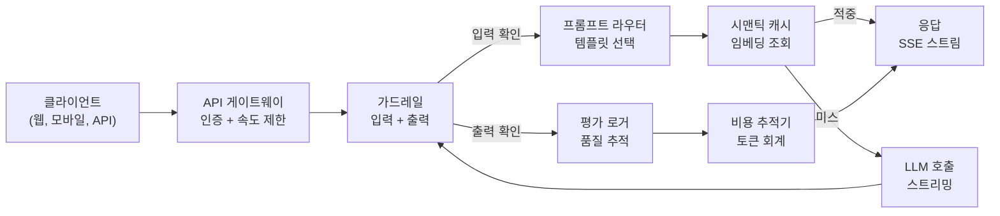
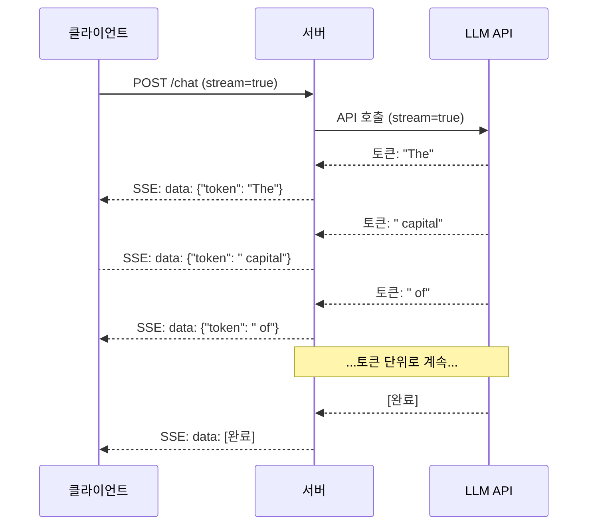

# 프로덕션 LLM 앱 구축

> 프롬프트, 임베딩, RAG 파이프라인, 함수 호출, 캐싱 레이어 및 가드레일을 개별적으로 구축했습니다. 격리로. Guitar scales를 연습하면서 결코 노래를 연주하지 않은 것처럼. 이 단원이 노래입니다. Lesson 01-12의 모든 구성 요소를 단일 프로덕션 준비 서비스로 연결합니다. 장난감이 아닙니다. 데모가 아닙니다. 실제 트래픽을 처리하고, 우아하게 실패하며, 토큰을 스트리밍하고, 비용을 추적하며, 처음 10,000명의 사용자를 버텨내는 시스템입니다.

**유형:** 실습 (Capstone)
**언어:** Python
**선수 과목:** Phase 11 Lessons 01-15
**소요 시간:** ~120분
**관련:** Phase 11 · 14 (MCP)는 커스텀 도구 스키마를 공유 프로토콜로 대체하기 위함; Phase 11 · 15 (Prompt Caching)는 안정적인 prefix에서 50-90% 비용 절감을 위함. 둘 다 2026년 serious 프로덕션 스택에서 기대됩니다.

## 학습 목표

- 모든 Phase 11 구성 요소(프롬프트, RAG, 함수 호출, 캐싱, 가드레일)를 단일 프로덕션 준비 서비스로 연결
- 스트리밍 토큰 전달, 우아한 오류 처리 및 요청 시간 초과 관리 구현
- 요청 로깅, 비용 추적, 지연 시간 백분위수 및 오류율 대시보드를 애플리케이션에 구축
- 상태 확인, 속도 제한 및 제공자 중단을 위한 폴백 전략과 함께 애플리케이션 배포

## 문제

LLM 기능을 구축하는 것은 오후가 걸립니다. LLM 제품을 shipping하는 것은 months가 걸립니다.

격차는 지능이 아닙니다. 인프라입니다. 프로토타입은 OpenAI를 호출하고, 응답을 받고, 출력합니다. 노트북에서 작동합니다. 그런 다음 현실이 도착합니다:

- 사용자가 50,000 토큰 문서를 보냅니다. 컨텍스트 창이 넘칩니다.
- 두 사용자가 4초 간격으로 같은 질문을 합니다. 둘 다 비용을 지불합니다.
- API가 새벽 2시에 500 오류를 반환합니다. 서비스가 충돌합니다.
- 사용자가 모델에 SQL을 생성하도록 요청합니다. 모델이 `DROP TABLE users`를 출력합니다.
- 월 청구서가 $12,000에 도달하고 어떤 기능이 원인인지 알 수 없습니다.
- 응답 시간이 평균 8초입니다. 사용자가 3초 후 떠납니다.

오늘 프로덕션의 모든 LLM 애플리케이션 -- Perplexity, Cursor, ChatGPT, Notion AI -- 은 이러한 문제를 해결했습니다. 프롬프트에 대해 더 똑똑해져서가 아니라 엔지니어링에 대해 엄격했기 때문입니다.

이것이 capstone입니다. 프롬프트 관리(L01-02), 임베딩 및 벡터 검색(L04-07), 함수 호출(L09), 평가(L10), 캐싱(L11), 가드레일(L12), 스트리밍, 오류 처리, 관찰 가능성 및 비용 추적을 통합하는 완전한 프로덕션 LLM 서비스를 구축합니다. 하나의 서비스. 모든 구성 요소가 함께 연결됩니다.

## 개념

### 프로덕션 아키텍처

모든 심각한 LLM 애플리케이션이 동일한 흐름을 따릅니다. 세부 사항은 다릅니다. 구조는 그렇지 않습니다.



요청은 인증 및 속도 제한을 처리하는 API 게이트웨이를 통해 들어옵니다. 입력 가드레일이 프롬프트 라우터가 올바른 템플릿을 선택하기 전에 프롬프트 인젝션 및 금지된 콘텐츠를 확인합니다. 시맨틱 캐시가 최근에 답변된 유사한 질문이 있는지 확인합니다. 캐시 미스에서 LLM이 스트리밍 활성화로 호출됩니다. 출력 가드레일이 응답을 검증합니다. 평가 로거가 품질 메트릭을 기록합니다. 비용 추적기가 모든 토큰을 회계 처리합니다. 응답이 클라이언트로 스트림됩니다.

일곱 개의 구성 요소. 각각이 이미 완료한 단원입니다. 엔지니어링은 연결에 있습니다.

### 스택

| 구성 요소 | 단원 | 기술 | 목적 |
|-----------|--------|------------|---------|
| API 서버 | -- | FastAPI + Uvicorn | HTTP 엔드포인트, SSE 스트리밍, 상태 확인 |
| 프롬프트 템플릿 | L01-02 | Jinja2 / 문자열 템플릿 | 변수 삽입이 있는 버전 관리 프롬프트 |
| 임베딩 | L04 | text-embedding-3-small | 캐시 및 RAG를 위한 시맨틱 유사성 |
| 벡터 저장소 | L06-07 | 인메모리 (프로드: Pinecone/Qdrant) | 컨텍스트 검색를 위한 최근접 이웃 검색 |
| 함수 호출 | L09 | 도구 레지스트리 + JSON 스키마 | 외부 데이터 액세스, 구조화된 작업 |
| 평가 | L10 | 커스텀 메트릭 + 로깅 | 응답 품질, 지연 시간, 정확도 추적 |
| 캐싱 | L11 | 시맨틱 캐시 (임베딩 기반) | 불필요한 LLM 호출 회피, 비용 및 지연 시간 절감 |
| 가드레일 | L12 | Regex + 분류기 규칙 | 프롬프트 인젝션, PII, 안전하지 않은 콘텐츠 차단 |
| 비용 추적기 | L11 | 토큰 카운터 + 가격 테이블 | 요청별 및 총 비용 회계 |
| 스트리밍 | -- | Server-Sent Events (SSE) | 토큰 단위 전달, 1초 미만의 첫 토큰 |

### 스트리밍: 왜 중요한가

500개의 출력 토큰이 있는 GPT-5 응답은 완전히 생성하는 데 3-8초가 걸립니다. 스트리밍 없이는 사용자가 전체 시간 동안 spinner를 바라봅니다. 스트리밍을 사용하면 첫 번째 토큰이 200-500ms에 도착합니다. 총 시간은 동일합니다. 인식된 지연 시간이 90% 감소합니다.



스트리밍용 세 가지 프로토콜:

| 프로토콜 | 지연 시간 | 복잡도 | 사용 시점 |
|----------|---------|------------|-------------|
| Server-Sent Events (SSE) | 낮음 | 낮음 | 대부분의 LLM 앱. 단방향, HTTP 기반, 어디서나 작동 |
| WebSockets | 낮음 | 중간 | 양방향 필요: 음성, 실시간 협업 |
| 롱 폴링 | 높음 | 낮음 | SSE 또는 WebSocket을 처리할 수 없는 레거시 클라이언트 |

SSE가 기본 선택입니다. OpenAI, Anthropic 및 Google 모두 SSE를 통해 스트리밍합니다. 서버는 LLM API에서 청크를 수신하고 SSE 이벤트로 클라이언트에 전달합니다. 클라이언트는 `EventSource`(브라우저) 또는 `httpx`(Python)를 사용하여 스트림을 소비합니다.

### 오류 처리: 세 가지 레이어

프로덕션 LLM 앱은 세 가지 다른 방식으로 실패합니다. 각각 다른 복구 전략이 필요합니다.

**레이어 1: API 실패.** LLM 제공자가 429(속도 제한), 500(서버 오류)를 반환하거나 시간 초과됩니다. 솔루션: 지수 백오프와 지터. 1초에서 시작하여 각 재시도마다 두 배로, 썬더링 헤드를 방지하기 위해 무작위 지터 추가. 최대 3회 재시도.

```
시도 1: 즉시
시도 2: 1초 + 랜덤(0, 0.5초)
시도 3: 2초 + 랜덤(0, 1.0초)
시도 4: 4초 + 랜덤(0, 2.0초)
포기: 폴백 응답 반환
```

**레이어 2: 모델 실패.** 모델이 잘못된 JSON을 반환하거나, 함수 이름을 환각하거나, 검증에 실패하는 출력을 생성합니다. 솔루션: 수정된 프롬프트로 재시도. 모델이 자체 수정할 수 있도록 재시도 메시지에 오류를 포함합니다.

**레이어 3: 애플리케이션 실패.** 하위 서비스에 연결할 수 없거나, 벡터 저장소가 느리거나, 가드레일이 예외를 throw합니다. 솔루션: 우아한 degradation. RAG 컨텍스트를 사용할 수 없으면 없이 진행합니다. 캐시가 다운되면 우회합니다. 보조 시스템이 기본 흐름을 충돌하지 않도록 합니다.

| 실패 | 재시도? | 폴백 | 사용자 영향 |
|---------|--------|----------|-------------|
| API 429 (속도 제한) | 예, 백오프와 함께 | 요청을 큐에 넣기 | "처리 중, 잠시 기다려주세요..." |
| API 500 (서버 오류) | 예, 3회 시도 | 폴백 모델로 전환 | 사용자에게 투명 |
| API 시간 초과 (>30초) | 예, 1회 시도 | 더 짧은 프롬프트, 더 작은 모델 | 약간 낮은 품질 |
| 잘못된 출력 | 오류 컨텍스트와 함께 예 | 원시 텍스트 반환 | 사소한 형식 문제 |
| 가드레일 차단 | 아니오 | 요청이 차단된 이유 설명 | 명확한 오류 메시지 |
| 벡터 저장소 다운 | 벡터 저장소에 재시도 안 함 | RAG 컨텍스트 건너뛰기 | 낮은 품질, 여전히 기능 |
| 캐시 다운 | 캐시에 재시도 안 함 | 직접 LLM 호출 | 더 높은 지연 시간, 더 높은 비용 |

**폴백 모델 체인.** 기본 모델을 사용할 수 없을 때 체인을 통해 폴백:

```
claude-sonnet-4-20250514 -> gpt-4o -> gpt-4o-mini -> 캐시된 응답 -> "서비스 일시적 사용 불가"
```

각 단계는 품질을 위해 가용성을 trade합니다. 사용자는 항상 무언가를 얻습니다.

## 실습

### 단계 1: 프로덕션 LLM 서비스 구축

```python
import time
import json
import uuid
import asyncio
from dataclasses import dataclass, field
from typing import Optional, List, Dict, Any, AsyncIterator
from enum import Enum


class ModelProvider(Enum):
    ANTHROPIC = "anthropic"
    OPENAI = "openai"
    GOOGLE = "google"


@dataclass
class LLMRequest:
    user_id: str
    query: str
    model: str = "gpt-4o"
    stream: bool = True
    temperature: float = 0.7
    max_tokens: int = 2048
    system_prompt: str = ""
    context_documents: List[str] = field(default_factory=list)
    tools: List[Dict] = field(default_factory=list)


@dataclass
class LLMResponse:
    request_id: str
    content: str
    model: str
    input_tokens: int
    output_tokens: int
    latency_ms: float
    cached: bool = False
    error: Optional[str] = None


@dataclass
class ServiceConfig:
    primary_model: str = "gpt-4o"
    fallback_models: List[str] = field(default_factory=list)
    max_retries: int = 3
    request_timeout_seconds: int = 30
    rate_limit_per_minute: int = 60
    max_tokens_per_request: int = 100000
    enable_streaming: bool = True
    enable_caching: bool = True
    cache_ttl_seconds: int = 3600


class RateLimiter:
    def __init__(self, requests_per_minute: int):
        self.requests_per_minute = requests_per_minute
        self.requests = {}

    def check(self, user_id: str) -> tuple[bool, Optional[float]]:
        now = time.time()
        if user_id not in self.requests:
            self.requests[user_id] = []

        self.requests[user_id] = [
            t for t in self.requests[user_id]
            if now - t < 60
        ]

        if len(self.requests[user_id]) >= self.requests_per_minute:
            wait_time = 60 - (now - self.requests[user_id][0])
            return False, wait_time

        self.requests[user_id].append(now)
        return True, None


class SemanticCache:
    def __init__(self, max_size: int = 1000, ttl_seconds: int = 3600, similarity_threshold: float = 0.92):
        self.entries = []
        self.max_size = max_size
        self.ttl = ttl_seconds
        self.threshold = similarity_threshold
        self.hits = 0
        self.misses = 0

    def simple_embed(self, text: str) -> Dict[str, float]:
        words = text.lower().split()
        vocab = {}
        for w in words:
            vocab[w] = vocab.get(w, 0) + 1
        norm = __import__("math").sqrt(sum(v * v for v in vocab.values()))
        if norm == 0:
            return {}
        return {k: v / norm for k, v in vocab.items()}

    def cosine_similarity(self, a: Dict[str, float], b: Dict[str, float]) -> float:
        if not a or not b:
            return 0.0
        all_keys = set(a) | set(b)
        dot = sum(a.get(k, 0) * b.get(k, 0) for k in all_keys)
        return dot

    def get(self, query: str) -> Optional[str]:
        query_emb = self.simple_embed(query)
        now = time.time()
        best_match = None
        best_sim = 0.0

        for entry in self.entries:
            if now - entry["timestamp"] > self.ttl:
                continue
            sim = self.cosine_similarity(query_emb, entry["embedding"])
            if sim > best_sim:
                best_sim = sim
                best_match = entry

        if best_match and best_sim >= self.threshold:
            self.hits += 1
            best_match["access_count"] += 1
            return best_match["response"]

        self.misses += 1
        return None

    def put(self, query: str, response: str):
        if len(self.entries) >= self.max_size:
            self.entries.sort(key=lambda e: e["timestamp"])
            self.entries.pop(0)

        self.entries.append({
            "query": query,
            "embedding": self.simple_embed(query),
            "response": response,
            "timestamp": now,
            "access_count": 1,
        })

    def stats(self) -> Dict:
        total = self.hits + self.misses
        return {
            "hits": self.hits,
            "misses": self.misses,
            "hit_rate": round(self.hits / total, 4) if total > 0 else 0,
            "size": len(self.entries),
        }


class CostTracker:
    MODEL_PRICING = {
        "gpt-4o": {"input": 2.50, "output": 10.00},
        "gpt-4o-mini": {"input": 0.15, "output": 0.60},
        "claude-opus-4": {"input": 15.00, "output": 75.00},
        "claude-sonnet-4": {"input": 3.00, "output": 15.00},
    }

    def __init__(self):
        self.logs = []
        self.budget_alerts = []

    def calculate_cost(self, model: str, input_tokens: int, output_tokens: int) -> float:
        if model not in self.MODEL_PRICING:
            return 0.0
        pricing = self.MODEL_PRICING[model]
        return (input_tokens / 1_000_000) * pricing["input"] + (output_tokens / 1_000_000) * pricing["output"]

    def log(self, model: str, input_tokens: int, output_tokens: int, latency_ms: float, cache_hit: bool = False):
        cost = self.calculate_cost(model, input_tokens, output_tokens)
        self.logs.append({
            "timestamp": time.time(),
            "model": model,
            "input_tokens": input_tokens,
            "output_tokens": output_tokens,
            "latency_ms": latency_ms,
            "cost": cost,
            "cache_hit": cache_hit,
        })

    def summary(self) -> Dict:
        if not self.logs:
            return {"total_requests": 0, "total_cost": 0.0}

        total_cost = sum(log["cost"] for log in self.logs)
        total_latency = sum(log["latency_ms"] for log in self.logs)
        cache_hits = sum(1 for log in self.logs if log["cache_hit"])

        return {
            "total_requests": len(self.logs),
            "total_cost": round(total_cost, 4),
            "avg_cost_per_request": round(total_cost / len(self.logs), 6),
            "avg_latency_ms": round(total_latency / len(self.logs), 1),
            "cache_hit_rate": round(cache_hits / len(self.logs), 4),
        }


class ObservabilityLogger:
    def __init__(self):
        self.metrics = []

    def log_request(self, request_id: str, user_id: str, query: str, model: str, latency_ms: float, success: bool, error: Optional[str] = None):
        self.metrics.append({
            "request_id": request_id,
            "user_id": user_id,
            "query_preview": query[:100],
            "model": model,
            "latency_ms": latency_ms,
            "success": success,
            "error": error,
            "timestamp": time.time(),
        })

    def get_latency_percentiles(self) -> Dict[str, float]:
        if not self.metrics:
            return {"p50": 0, "p95": 0, "p99": 0}

        latencies = sorted(m["latency_ms"] for m in self.metrics)
        n = len(latencies)

        return {
            "p50": round(latencies[int(n * 0.50)], 1),
            "p95": round(latencies[int(n * 0.95)], 1),
            "p99": round(latencies[int(n * 0.99)], 1),
        }

    def get_error_rate(self) -> float:
        if not self.metrics:
            return 0.0
        failures = sum(1 for m in self.metrics if not m["success"])
        return round(failures / len(self.metrics), 4)
```

### 단계 2: 완전한 프로덕션 서비스

```python
class ProductionLLMService:
    def __init__(self, config: ServiceConfig):
        self.config = config
        self.rate_limiter = RateLimiter(config.rate_limit_per_minute)
        self.semantic_cache = SemanticCache()
        self.cost_tracker = CostTracker()
        self.observability = ObservabilityLogger()

    async def process_request(self, request: LLMRequest) -> LLMResponse:
        request_id = str(uuid.uuid4())
        start_time = time.time()

        allowed, wait_time = self.rate_limiter.check(request.user_id)
        if not allowed:
            return LLMResponse(
                request_id=request_id,
                content="",
                model=request.model,
                input_tokens=0,
                output_tokens=0,
                latency_ms=(time.time() - start_time) * 1000,
                error=f"Rate limit exceeded. Retry after {wait_time:.1f}s"
            )

        if len(request.query) > self.config.max_tokens_per_request:
            return LLMResponse(
                request_id=request_id,
                content="",
                model=request.model,
                input_tokens=0,
                output_tokens=0,
                latency_ms=(time.time() - start_time) * 1000,
                error="Request too long"
            )

        cached_response = None
        if self.config.enable_caching:
            cached_response = self.semantic_cache.get(request.query)
            if cached_response:
                self.observability.log_request(
                    request_id, request.user_id, request.query,
                    request.model, (time.time() - start_time) * 1000, True
                )
                return LLMResponse(
                    request_id=request_id,
                    content=cached_response,
                    model=request.model,
                    input_tokens=0,
                    output_tokens=0,
                    latency_ms=(time.time() - start_time) * 1000,
                    cached=True
                )

        try:
            response_content = await self.call_llm_with_fallback(request)
            latency_ms = (time.time() - start_time) * 1000

            estimated_input = len(request.query.split()) * 4
            estimated_output = len(response_content.split()) * 4
            self.cost_tracker.log(request.model, estimated_input, estimated_output, latency_ms)

            if self.config.enable_caching:
                self.semantic_cache.put(request.query, response_content)

            self.observability.log_request(
                request_id, request.user_id, request.query,
                request.model, latency_ms, True
            )

            return LLMResponse(
                request_id=request_id,
                content=response_content,
                model=request.model,
                input_tokens=estimated_input,
                output_tokens=estimated_output,
                latency_ms=latency_ms,
            )

        except Exception as e:
            latency_ms = (time.time() - start_time) * 1000
            self.observability.log_request(
                request_id, request.user_id, request.query,
                request.model, latency_ms, False, str(e)
            )
            return LLMResponse(
                request_id=request_id,
                content="",
                model=request.model,
                input_tokens=0,
                output_tokens=0,
                latency_ms=latency_ms,
                error=str(e)
            )

    async def call_llm_with_fallback(self, request: LLMRequest) -> str:
        models_to_try = [request.model] + self.config.fallback_models

        for model in models_to_try:
            try:
                result = await self.simulate_llm_call(model, request)
                return result
            except Exception as e:
                if model == models_to_try[-1]:
                    raise e
                continue

        raise Exception("All models failed")

    async def simulate_llm_call(self, model: str, request: LLMRequest) -> str:
        await asyncio.sleep(0.1)
        return f"[Simulated {model} response to: {request.query[:50]}...]"

    def stream_response(self, request: LLMRequest) -> AsyncIterator[str]:
        async def generate():
            response = self.process_request(request)
            content = response.content if hasattr(response, 'content') else ""

            for i in range(0, len(content), 10):
                yield f"data: {json.dumps({'token': content[i:i+10]})}\n\n"
                yield from ""
            yield "data: [DONE]\n\n"

        return generate()

    def get_health_status(self) -> Dict:
        return {
            "status": "healthy",
            "cache_stats": self.semantic_cache.stats(),
            "cost_summary": self.cost_tracker.summary(),
            "latency_percentiles": self.observability.get_latency_percentiles(),
            "error_rate": self.observability.get_error_rate(),
        }

    def get_cost_alerts(self) -> List[Dict]:
        summary = self.cost_tracker.summary()
        alerts = []
        if summary["total_cost"] > 100:
            alerts.append({"level": "warning", "message": f"Cost exceeded $100: ${summary['total_cost']}"})
        if summary["error_rate"] > 0.05:
            alerts.append({"level": "error", "message": f"Error rate above 5%: {summary['error_rate']:.2%}"})
        return alerts
```

### 단계 3: API 엔드포인트

```python
from fastapi import FastAPI, HTTPException, Request
from fastapi.responses import StreamingResponse
from pydantic import BaseModel

app = FastAPI(title="Production LLM Service")
service = ProductionLLMService(ServiceConfig())


class ChatRequest(BaseModel):
    user_id: str
    query: str
    model: str = "gpt-4o"
    stream: bool = False


@app.post("/chat")
async def chat(request: ChatRequest):
    llm_request = LLMRequest(
        user_id=request.user_id,
        query=request.query,
        model=request.model,
        stream=request.stream,
    )

    if request.stream:
        return StreamingResponse(
            service.stream_response(llm_request),
            media_type="text/event-stream"
        )

    response = await service.process_request(llm_request)

    if response.error:
        raise HTTPException(status_code=429, detail=response.error)

    return {
        "request_id": response.request_id,
        "content": response.content,
        "model": response.model,
        "latency_ms": response.latency_ms,
        "cached": response.cached,
    }


@app.get("/health")
def health():
    status = service.get_health_status()
    alerts = service.get_cost_alerts()

    return {
        "status": status["status"],
        "metrics": status,
        "alerts": alerts,
    }


@app.get("/stats")
def stats():
    return {
        "cost": service.cost_tracker.summary(),
        "cache": service.semantic_cache.stats(),
        "latency": service.observability.get_latency_percentiles(),
        "error_rate": service.observability.get_error_rate(),
    }
```

### 단계 4: 데모 실행

```python
async def run_demo():
    print("=" * 60)
    print("  Production LLM Application Demo")
    print("=" * 60)

    config = ServiceConfig(
        primary_model="gpt-4o",
        fallback_models=["gpt-4o-mini", "claude-sonnet-4"],
        rate_limit_per_minute=60,
        enable_caching=True,
    )
    service = ProductionLLMService(config)

    print("\n--- Test 1: Normal Request ---")
    request = LLMRequest(
        user_id="user_123",
        query="What is the capital of France?",
        model="gpt-4o"
    )
    response = await service.process_request(request)
    print(f"  Response: {response.content}")
    print(f"  Latency: {response.latency_ms:.1f}ms")
    print(f"  Cached: {response.cached}")

    print("\n--- Test 2: Rate Limiting ---")
    for i in range(5):
        req = LLMRequest(user_id=f"user_{i}", query=f"Question {i}", model="gpt-4o")
        resp = await service.process_request(req)
        print(f"  User {i}: {resp.content[:40]}...")

    print("\n--- Test 3: Semantic Cache ---")
    queries = [
        "What is the weather like today?",
        "How is the weather today?",
        "What's today's weather?",
        "Tell me about Python",
    ]
    for q in queries:
        req = LLMRequest(user_id="user_1", query=q, model="gpt-4o")
        resp = await service.process_request(req)
        cached_str = "(cached)" if resp.cached else ""
        print(f"  '{q[:30]}' -> {cached_str}")

    print("\n--- Test 4: Health Status ---")
    health = service.get_health_status()
    print(f"  Status: {health['status']}")
    print(f"  Cache hit rate: {health['cache_stats']['hit_rate']:.1%}")
    print(f"  Error rate: {health['error_rate']:.2%}")

    print("\n--- Test 5: Cost Tracking ---")
    for i in range(10):
        req = LLMRequest(user_id=f"user_{i % 3}", query=f"Query {i}", model="gpt-4o")
        await service.process_request(req)

    cost_summary = service.cost_tracker.summary()
    print(f"  Total requests: {cost_summary['total_requests']}")
    print(f"  Total cost: ${cost_summary['total_cost']:.6f}")
    print(f"  Avg latency: {cost_summary['avg_latency_ms']:.1f}ms")

    print("\n--- Test 6: Fallback Chain ---")
    print("  Simulating primary model failure...")
    service.config.primary_model = "failing-model"
    service.config.fallback_models = ["gpt-4o-mini", "claude-sonnet-4"]
    req = LLMRequest(user_id="user_1", query="Test fallback", model="gpt-4o-mini")
    resp = await service.process_request(req)
    print(f"  Fallback response: {resp.content[:50]}...")

    print("\n" + "=" * 60)
    print("  Demo complete.")
    print("=" * 60)


if __name__ == "__main__":
    import asyncio
    asyncio.run(run_demo())
```

## 배포

이 단원은 다음을 생성합니다:
- `outputs/skill-production-llm-stack.md` -- 프로덕션 LLM 서비스를 구축하기 위한 체크리스트
- `outputs/prompt-production-checklist.md` -- shipping 전 검증할 항목 목록

## 연습 문제

1. **웹소ockets 스트리밍을 추가합니다.** SSE 대신 웹소ockets를 사용하여 양방향 실시간 통신을 지원합니다.

2. **감시 대시보드를 구축합니다.** Grafana 또는 similar 도구를 사용하여 지연 시간, 비용 및 오류율 대시보드를 시각화합니다.

3. **A/B 테스트 프레임워크를 구현합니다.** 두 프롬프트 변형을 비교하고 통계적 유의성을 계산합니다.

4. **지연 시간 알림을 추가합니다.** P95 지연 시간이 2초를 초과하면 Slack으로 알림을 보냅니다.

5. **서비스 메시 커머스 통합을 추가합니다.** 서비스 메시를 사용하여 서비스 간 통신을 보호합니다.

## 핵심 용어

| 용어 |人们在说什么 |실제로 의미하는 것 |
|------|----------------|----------------------|
| SSE | "서버 전송 이벤트" | HTTP를 통한 토큰 단위 스트리밍 프로토콜 |
| 속도 제한 | "요청 스로틀링" | 사용자가 너무 많은 요청을하지 못하도록 방지 |
| 폴백 체인 | "대체 모델" | 주 모델 실패 시 사용할 대체 모델 목록 |
| 우아한 degradation | "부분적 기능 유지" | 서비스가 완전히 중단되지 않고 계속 작동 |
| 관찰 가능성 | "모니터링" | 요청, 비용 및 오류를 추적하여 시스템 가시성 확보 |
| 시맨틱 캐시 | "지능형 캐시" | 유사 쿼리에 대해 동일한 응답 제공 |

## 추가 자료

- [FastAPI 문서](https://fastapi.tiangolo.com/) -- 프로덕션 API 구축을 위한Python 웹 프레임워크
- [OpenAI API 레퍼런스](https://platform.openai.com/docs/api-reference) -- OpenAI API 전체 레퍼런스
- [Anthropic API 레퍼런스](https://docs.anthropic.com/en/api) -- Anthropic API 전체 레퍼런스
- [LLM 관찰 가능성 도구들](https://langsmith.com) -- LangChain의 관찰 가능성 플랫폼
- [실시간 스트리밍 가이드](https://cookbook.openai.com/examples/streaming) -- OpenAI의 SSE 스트리밍 구현 가이드