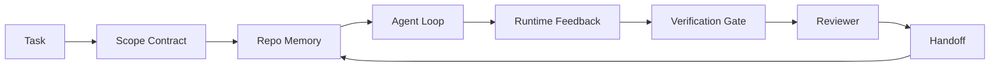

# 에이전트 워크벤치 엔지니어링: 유능한 모델도 실패하는 이유

> 유능한 모델만으로는 충분하지 않습니다. 신뢰할 수 있는 에이전트는 워크벤치가 필요합니다: 지침, 상태, 범위, 피드백, 검증, 검토, 핸드오프. 이것들을 제거하면 최첨단 모델조차도 출시하기에 안전하지 않은 작업을 생성합니다.

**Type:** Learn + Build
**Languages:** Python (stdlib)
**Prerequisites:** Phase 14 · 01 (Agent Loop), Phase 14 · 26 (Failure Modes)
**Time:** ~45분

## 학습 목표

- 모델 능력과 실행 신뢰성을 분리합니다.
- 에이전트 출시 여부를 결정하는 7가지 워크벤치 표면을 명명합니다.
- 작은 저장소 작업에서 프롬프트 전용 실행과 워크벤치 기반 실행을 비교합니다.
- 각 누락된 표면이 어떤 증상을 유발했는지 매핑하는 실패 모드 보고서를 생성합니다.

## 문제

최첨단 모델을 실제 저장소에 투입하고 입력 검증을 추가하라고 요청합니다. 네 개의 파일을 열고, 그럴듯한 코드를 작성하고, 성공을 선언하고, 멈춥니다. 테스트를 실행합니다. 두 개가 실패합니다. 검증과 전혀 관련 없는 세 번째 파일이 수정되었습니다. 에이전트가 무엇을 가정했는지, 무엇을 먼저 시도했는지, 무엇이 남았는지에 대한 기록이 없습니다.

모델이 Python에 대해 틀린 것이 아닙니다. 작업에 대해 틀린 것입니다. 무엇이 완료로 간주되는지, 어디에 쓸 수 있는지, 어떤 테스트가 권위적인지, 다음 세션이 어떻게 이어받아야 하는지 전혀 몰랐습니다.

이는 모델 버그가 아닙니다. 워크벤치 버그입니다. 에이전트 주변의 표면에 일회성 생성을 신뢰할 수 있고 재개 가능한 엔지니어링으로 바꾸는 부품이 빠져 있습니다.

## 개념

워크벤치는 작업 중에 모델을 감싸는 운영 환경입니다. 7가지 표면이 있습니다:

| 표면 | 전달하는 것 | 누락 시 실패 |
|------|------------|-------------|
| Instructions | 시작 규칙, 금지된 작업, 완료 정의 | 에이전트가 출시의 의미를 추측 |
| State | 현재 작업, 수정된 파일, 차단 요소, 다음 작업 | 각 세션이 0에서 재시작 |
| Scope | 허용된 파일, 금지된 파일, 승인 기준 | 수정이 관련 없는 코드로 누출 |
| Feedback | 루프에 캡처된 실제 명령 출력 | 에이전트가 400에서 성공 선언 |
| Verification | 테스트, 린트, 스모크 실행, 범위 확인 | "괜찮아 보임"이 main에 도달 |
| Review | 다른 역할을 가진 두 번째 패스 | 빌더가 자신의 숙제를 평가 |
| Handoff | 변경 사항, 이유, 남은 작업 | 다음 세션이 모든 것을 재발견 |

워크벤치는 모델과 독립적입니다. 모델을 교체하고 표면을 유지할 수 있습니다. 표면을 교체하고 신뢰성을 유지할 수는 없습니다.



루프는 채팅 기록이 아닌 상태 파일에서 닫힙니다. 채팅은 휘발성입니다. 저장소가 기록 시스템입니다.

### 워크벤치 대 프롬프트 엔지니어링

프롬프팅은 이번 턴에 원하는 것을 모델에 알려줍니다. 워크벤치는 턴과 세션에 걸쳐 작업하는 방법을 모델에 알려줍니다. 대부분의 에이전트 실패 이야기는 프롬프트 엔지니어링 옷을 입은 워크벤치 실패입니다.

### 워크벤치 대 프레임워크

프레임워크는 런타임(LangGraph, AutoGen, Agents SDK)을 제공합니다. 워크벤치는 에이전트가 해당 런타임 내에서 작업할 장소를 제공합니다. 둘 다 필요합니다. 이 미니 트랙은 두 번째에 관한 것입니다.

### 벤더 분류학이 아닌 기본 요소에서 추론

지금 "하네스 엔지니어링"에 대한 많은 글이 있습니다. Addy Osmani, OpenAI, Anthropic, LangChain, Martin Fowler, MongoDB, HumanLayer, Augment Code, Thoughtworks, walkinglabs awesome 리스트, 그리고 꾸준한 Medium과 Hacker News 게시물이 모두 다루고 있습니다. 그들은 하네스의 경계, 범위에 있는 것, 사용할 용어에 대해 의견이 다릅니다. 우리는 한 쪽을 선택할 필요가 없습니다. 7가지 표면은 UX 레이어입니다; 모든 워크벤치 아래에는 신뢰할 수 있는 백엔드를 지탱하는 동일한 분산 시스템 기본 요소 집합이 있습니다.

잠시 에이전트 레이블을 떼어보십시오. 에이전트 실행은 시간, 프로세스 및 머신을 가로지르는 계산입니다. 이를 신뢰할 수 있게 만들려면 모든 프로덕션 시스템에 필요한 동일한 기본 요소가 필요합니다.

| 기본 요소 | 무엇인가 | 에이전트를 위해 전달하는 것 |
|-----------|---------|---------------------------|
| Function | 타입화된 핸들러. 가능하면 순수 함수. 자체 입력과 출력 소유 | 도구 호출, 규칙 확인, 검증 단계, 모델 호출 |
| Worker | 하나 이상의 함수와 라이프사이클을 소유하는 장기 실행 프로세스 | 빌더, 리뷰어, 검증기, MCP 서버 |
| Trigger | 함수를 호출하는 이벤트 소스 | 에이전트 루프 틱, HTTP 요청, 큐 메시지, 크론, 파일 변경, 훅 |
| Runtime | 무엇이 어디서, 어떤 타임아웃과 리소스로 실행될지 결정하는 경계 | Claude Code의 프로세스, LangGraph의 런타임, 워커 컨테이너 |
| HTTP / RPC | 호출자와 워커 사이의 와이어 | 도구 호출 프로토콜, MCP 요청, 모델 API |
| Queue | 트리거와 워커 사이의 내구성 있는 버퍼; 역압력, 재시도, 멱등성 | 작업 보드, 피드백 로그, 검토 받은 편지함 |
| Session persistence | 크래시, 재시작, 모델 교체에서 생존하는 상태 | `agent_state.json`, 체크포인트, KV 저장소, 저장소 자체 |
| Authorization policy | 어떤 함수를 어떤 범위로 호출할 수 있는지 | 허용/금지 파일, 승인 경계, MCP 기능 목록 |

이제 7가지 워크벤치 표면을 이러한 기본 요소에 매핑하십시오.

- **Instructions** — 정책 + 함수 메타데이터. 규칙은 검사(함수)입니다. 라우터(`AGENTS.md`)는 런타임 시작에 첨부된 정책입니다.
- **State** — 세션 지속성. 런타임이 모든 단계에서 읽는 키 저장소. 파일, KV 또는 DB; 지속성 의미가 중요하고 스토리지 백엔드는 그렇지 않습니다.
- **Scope** — 작업별 권한 부여 정책. 허용/금지 글로브는 ACL입니다. 필요한 승인은 권한 격자입니다.
- **Feedback** — 큐에 기록된 호출 로그. 모든 셸 호출은 레코드이며, 내구성 있고 재생 가능합니다.
- **Verification** — 함수. 입력에 대해 결정론적. 작업 종료 시 트리거. 실패 시 폐쇄.
- **Review** — 빌더 아티팩트에 대한 읽기 전용 인증 및 검토 보고서에 대한 쓰기 전용 인증을 가진 별도의 워커.
- **Handoff** — 세션 종료 트리거에 의해 생성된 내구성 있는 레코드. 다음 세션의 시작 트리거가 읽습니다.

에이전트 루프 자체는 이벤트(사용자 메시지, 도구 결과, 타이머 틱)를 소비하고, 함수(모델, 그 다음 모델이 선택한 도구)를 호출하며, 레코드(상태, 피드백)를 쓰고, 트리거(verify, review, handoff)를 생성하는 워커입니다. 신비롭지 않습니다; 작업 프로세서와 동일한 형태입니다.

### 유통 중인 패턴, 기본 요소로 변환

모든 인기 있는 하네스 패턴은 8가지 기본 요소로 축소됩니다.

| 벤더 또는 커뮤니티 패턴 | 실제로 무엇인가 |
|-------------------------|--------------|
| Ralph Loop (Claude Code, Codex, agentic_harness 책) — 에이전트가 일찍 멈추려 할 때 원래 의도를 새 컨텍스트 창에 재주입 | 깨끗한 컨텍스트로 작업을 재대기열하는 트리거; 세션 지속성이 목표를 전달 |
| Plan / Execute / Verify (PEV) | 역할당 하나씩, 상태와 단계 간 큐를 통해 통신하는 세 개의 워커 |
| Harness-compute 분리 (OpenAI Agents SDK, 2026년 4월) — 제어 평면과 실행 평면 분리 | 제어-평면 / 데이터-평면 재진술. 에이전트 레이블보다 수십 년 앞섬 |
| Open Agent Passport (OAP, 2026년 3월) — 실행 전 선언적 정책에 대해 모든 도구 호출을 서명하고 감사 | 사전 작업 워커가 시행하는 권한 부여 정책, 서명된 감사 큐 포함 |
| Guides and Sensors (Birgitta Böckeler / Thoughtworks) — 피드포워드 규칙 + 피드백 관찰 가능성 | 권한 부여 정책 + 검증 함수 + 관찰 가능성 트레이스 |
| Progressive compaction, 5단계 (Claude Code 리버스 엔지니어링, 2026년 4월) | 버짓 내에서 유지하기 위해 세션 지속성에 대해 크론처럼 실행되는 상태 관리 워커 |
| Hooks / middleware (LangChain, Claude Code) — 모델 및 도구 호출 가로채기 | 런타임의 호출 경로를 감싸는 트리거 + 함수 |
| Skills as Markdown with progressive disclosure (Anthropic, Flue) | 함수 메타데이터가 필요 시 컨텍스트에 로드되는 함수 레지스트리 |
| Sandbox agents (Codex, Sandcastle, Vercel Sandbox) | 계산 평면: 격리된 파일시스템, 네트워크 및 라이프사이클을 가진 런타임 |
| MCP servers | 안정적인 RPC를 통해 함수를 노출하는 워커, 권한으로 기능 목록 포함 |

해당 테이블의 모든 항목은 에이전트 커뮤니티가 분산 시스템에 이미 이름이 있던 기본 요소에 도착하여 새 이름을 부여한 것입니다. 마케팅에 유용한 레이블; 엔지니어링 용어로는 유용하지 않습니다.

### 실제 증거

하네스-오버-모델 주장에는 이제 뒷받침하는 숫자가 있습니다. "더 똑똑한 모델을 기다리자"는 주장에 대한 유일한 정직한 반론이기도 합니다.

- Terminal Bench 2.0 — 동일 모델, 하네스 변경으로 코딩 에이전트가 30위 밖에서 5위로 상승 (LangChain, *Anatomy of an Agent Harness*).
- Vercel — 에이전트 도구의 80%를 삭제; 성공률이 80%에서 100%로 상승 (MongoDB).
- Harvey — 법률 에이전트가 하네스 최적화만으로 정확도 2배 이상 증가 (MongoDB).
- 엔터프라이즈 AI 에이전트 프로젝트의 88%가 프로덕션에 도달하지 못함. 실패는 추론이 아닌 런타임 주변에 집중 (preprints.org, *Harness Engineering for Language Agents*, 2026년 3월).
- 2025년 벤치마크 연구에서 세 가지 인기 오픈소스 프레임워크 전체에서 ~50% 작업 완료; 장기 컨텍스트 WebAgent가 40-50%에서 10% 미만으로 붕괴, 주로 무한 루프와 목표 상실.

핵심은 "하네스가 영원히 승리한다"가 아닙니다. 모델은 시간이 지남에 따라 하네스 트릭을 흡수합니다. 핵심은 오늘날 하중을 지탱하는 엔지니어링이 모델 내부가 아니라 주변에 있으며, 그 하중을 지탱하는 기본 요소는 모든 프로덕션 시스템이 항상 필요로 했던 것이라는 점입니다.

### 벤더 글의 한계

이것은 예의를 지킬 필요가 없는 부분입니다.

- LangChain의 *Anatomy of an Agent Harness*는 11가지 구성 요소 — 프롬프트, 도구, 훅, 샌드박스, 오케스트레이션, 메모리, 스킬, 하위 에이전트, "멍청한 루프" 런타임을 열거합니다. 큐, 배포 단위로서의 워커, 트리거 의미론, 별도의 관심사로서의 세션 지속성, 권한 부여 정책을 명명하지 않습니다. 하네스를 배포하는 시스템이 아니라 구성하는 객체로 취급합니다.
- Addy Osmani의 *Agent Harness Engineering*은 `Agent = Model + Harness` 프레임과 래칫 패턴을 제시하지만, 하네스가 무엇으로 구성되는지 말하는 데 그칩니다. 입장이지 스펙이 아닙니다.
- Anthropic과 OpenAI는 표면에 가장 깊이 들어가지만 자체 런타임 내에 머뭅니다. 2026년 4월 Agents SDK의 "harness-compute 분리" 발표는 제어-평면 / 데이터-평면 분할을 명시적으로 지지하는 첫 번째 벤더 자료입니다. 이는 기본 요소 아이디어이지 새로운 것이 아닙니다.
- agentic_harness 책은 하네스를 구성 객체로 취급하며 (Jaymin West의 *Agentic Engineering*, 6장), 가장 강력한 문장은 "하네스는 에이전틱 시스템의 주요 보안 경계"입니다. 이는 다시 말하면 권한 부여 정책입니다.
- Hacker News 스레드는 계속 같은 곳에 도달합니다. 2026년 4월 스레드 *에이전트 하네스는 샌드박스 외부에 있어야 함*은 하네스가 "모든 것 외부에 앉아 컨텍스트와 사용자에 따라 액세스를 승인하는 하이퍼바이저처럼" 있어야 한다고 주장합니다. 이는 다시 말하면 별도 평면으로서의 권한 부여 정책입니다.

이러한 글들과 의견이 다를 필요는 없습니다. 그들은 이미 존재하는 시스템의 UX 설명을 작성하고 있습니다. 우리는 시스템을 작성하고 있습니다. 시스템이 올바르게 구축되면 7가지 표면이 기본 요소에서 나옵니다. 잘못 구축되면 아무리 `AGENTS.md`를 다듬어도 누락된 큐를 해결할 수 없습니다.

따라서 다른 곳에서 "하네스 엔지니어링"을 들으면 기본 요소로 변환하십시오. 프롬프트와 규칙은 정책과 함수입니다. 스캐폴딩은 런타임입니다. 가드레일은 인증 + 검증입니다. 훅은 트리거입니다. 메모리는 세션 지속성입니다. Ralph Loop는 재대기열입니다. 하위 에이전트는 워커입니다. 샌드박스는 계산 평면입니다. 용어는 변하지만 엔지니어링은 변하지 않습니다. 워크벤치는 에이전트를 향한 UX입니다; 다음 벤더 리프레임에서 살아남는 의미의 하네스는 함수, 워커, 트리거, 런타임, 큐, 지속성 및 정책이 올바르게 연결된 것입니다.

## 빌드하기

`code/main.py`는 작은 저장소 작업을 두 번 실행합니다. 먼저 프롬프트만, 그 다음 7가지 표면을 연결하여. 동일한 모델, 동일한 작업. 스크립트는 실패한 실행에서 누락된 표면을 계산하고 실패 모드 보고서를 출력합니다.

저장소 작업은 의도적으로 작습니다: 단일 파일 FastAPI 스타일 핸들러에 입력 검증을 추가하고 통과 테스트를 작성합니다.

실행:

```
python3 code/main.py
```

출력: 두 실행의 나란히 로그, 프롬프트 전용 실행을 요약한 `failure_modes.json`, 워크벤치 실행에 대한 한 줄 판정.

에이전트는 작은 규칙 기반 스텁입니다; 요점은 모델이 아니라 표면입니다. 이 미니 트랙의 나머지 부분에서 각 표면을 실제 재사용 가능한 아티팩트로 재구축할 것입니다.

## 사용하기

야생에서 이미 존재하는 세 가지 워크벤치 표면 장소 (아무도 그렇게 부르지 않더라도):

- **Claude Code, Codex, Cursor.** `AGENTS.md`와 `CLAUDE.md`는 instructions 표면입니다. 슬래시 명령어는 scope입니다. 훅은 verification입니다.
- **LangGraph, OpenAI Agents SDK.** 체크포인트와 세션 저장소는 state 표면입니다. 핸드오프는 handoff 표면입니다.
- **실제 저장소의 CI.** 테스트, 린트, 타입 검사는 verification입니다. PR 템플릿은 handoff입니다. CODEOWNERS는 review입니다.

워크벤치 엔지니어링은 이러한 표면을 명시적이고 재사용 가능하게 만드는 규율이며, 각 팀이 이를 재발견하도록 두지 않습니다.

## 배포하기

`outputs/skill-workbench-audit.md`는 기존 저장소에서 7가지 워크벤치 표면을 감사하고 어떤 것이 누락되었는지, 일부인지, 건강한지 보고하는 이식 가능한 스킬입니다. 모든 에이전트 설정 옆에 배치하면 무엇을 먼저 수정해야 하는지 알려줍니다.

## 연습 문제

1. 이미 에이전트를 실행하는 저장소를 선택. 7가지 표면을 0(누락)에서 2(건강)로 평가. 가장 약한 표면은 무엇인가?
2. `main.py`를 확장하여 프롬프트 전용 실행도 가짜 "성공" 주장을 생성하도록 함. 검증 게이트가 이를 잡아냈을지 확인.
3. 자신의 제품을 위한 8번째 표면 추가. 기존 7가지 중 하나로 축소되지 않는 이유를 정당화.
4. 다른 스텁 에이전트(추가 파일 쓰기를 환각하는)로 스크립트 재실행. 어떤 표면이 먼저 잡아내는가?
5. Phase 14 · 26의 5가지 업계 반복 실패 모드를 7가지 표면에 매핑. 각 표면이 어떤 모드를 흡수하도록 설계되었는가?

## 주요 용어

| 용어 | 사람들이 말하는 것 | 실제 의미 |
|------|------------------|-----------|
| Workbench | "설정" | 작업을 신뢰할 수 있게 만드는 모델 주변의 엔지니어링된 표면 |
| Surface | "문서" 또는 "스크립트" | 에이전트가 매 턴 읽거나 쓰는 명명된 기계 판독 가능 입력 |
| System of record | "노트" | 채팅 기록이 사라졌을 때 에이전트가 진실로 간주하는 파일 |
| Definition of done | "승인" | 에이전트가 위조할 수 없는 객관적인 파일 기반 체크리스트 |
| Workbench audit | "저장소 준비 상태 확인" | 작업 시작 전 누락된 부분을 표시하는 7가지 표면 검토 |

## 추가 자료

이것들을 권위체가 아닌 데이터 포인트로 읽으십시오. 각각은 부분적인 분류학입니다. 채택 여부를 결정하기 전에 모든 개념을 기본 요소(함수, 워커, 트리거, 런타임, HTTP/RPC, 큐, 지속성, 정책)로 변환하십시오.

벤더 프레이밍:

- [Addy Osmani, Agent Harness Engineering](https://addyosmani.com/blog/agent-harness-engineeting/) — `Agent = Model + Harness` 및 래칫 패턴; 인프라에 대해 얇음
- [LangChain, The Anatomy of an Agent Harness](https://blog.langchain.com/the-anatomy-of-an-agent-harness/) — 11가지 구성 요소: 프롬프트, 도구, 훅, 오케스트레이션, 샌드박스, 메모리, 스킬, 하위 에이전트, 런타임; 큐, 배포, 인증 누락
- [OpenAI, Harness engineering: leveraging Codex in an agent-first world](https://openai.com/index/harness-engineering/) — Codex 팀의 런타임 주변 표면 관점
- [OpenAI, Unrolling the Codex agent loop](https://openai.com/index/unrolling-the-codex-agent-loop/) — 함수 호출에 대한 `while`로 축소된 에이전트 루프
- [Anthropic, Effective harnesses for long-running agents](https://www.anthropic.com/engineeting/effective-harnesses-for-long-running-agents) — 특정 런타임 내의 장기 표면
- [Anthropic, Harness design for long-running application development](https://www.anthropic.com/engineeting/harness-design-long-running-apps) — 적용 설계 노트
- [LangChain Deep Agents harness capabilities](https://docs.langchain.com/oss/python/deepagents/harness) — 런타임 구성 표면

실용적인 세부 정보가 있는 실무자 자료:

- [Martin Fowler / Birgitta Böckeler, Harness engineering for coding agent users](https://martinfowler.com/articles/harness-engineering.html) — 가이드(피드포워드) + 센서(피드백); 가장 깔끔한 제어 이론 프레이밍
- [HumanLayer, Skill Issue: Harness Engineering for Coding Agents](https://www.humanlayer.dev/blog/skill-issue-harness-engineering-for-coding-agents) — "모델 문제가 아니라 구성 문제"
- [MongoDB, The Agent Harness: Why the LLM Is the Smallest Part of Your Agent System](https://www.mongodb.com/company/blog/technical/agent-harness-why-llm-is-smallest-part-of-your-agent-system) — 증거: Vercel 80% → 100%, Harvey 2배 정확도, Terminal Bench 30위 → 5위
- [Augment Code, Harness Engineering for AI Coding Agents](https://www.augmentcode.com/guides/harness-engineering-ai-coding-agents) — 제약 우선 워크스루
- [Sequoia podcast, Harrison Chase on Context Engineering Long-Horizon Agents](https://sequoiacap.com/podcast/context-engineering-our-way-to-long-horizon-agents-langchains-harrison-chase/) — 모델 문제보다 런타임 문제

책, 논문 및 참조 구현:

- [Jaymin West, Agentic Engineering — Chapter 6: Harnesses](https://www.jayminwest.com/agentic-engineering-book/6-harnesses) — 책 길이의 처리, 하네스를 주요 보안 경계로 취급
- [preprints.org, Harness Engineering for Language Agents (March 2026)](https://www.preprints.org/manuscript/202603.1756) — 제어 / 에이전시 / 런타임으로서의 학술 프레이밍
- [walkinglabs/awesome-harness-engineering](https://github.com/walkinglabs/awesome-harness-engineering) — 컨텍스트, 평가, 관찰 가능성, 오케스트레이션에 걸친 큐레이티드 독서 목록
- [ai-boost/awesome-harness-engineering](https://github.com/ai-boost/awesome-harness-engineering) — 대체 큐레이티드 목록 (도구, 평가, 메모리, MCP, 권한)
- [andrewgarst/agentic_harness](https://github.com/andrewgarst/agentic_harness) — Redis 기반 메모리 및 평가 스위트가 있는 프로덕션 준비 참조 구현
- [HKUDS/OpenHarness](https://github.com/HKUDS/OpenHarness) — 내장 개인 에이전트가 있는 오픈 에이전트 하네스

합의보다는 의견 차이를 위해 읽을 가치가 있는 Hacker News 스레드:

- [HN: Effective harnesses for long-running agents](https://news.ycombinator.com/item?id=46081704)
- [HN: Improving 15 LLMs at Coding in One Afternoon. Only the Harness Changed](https://news.ycombinator.com/item?id=46988596)
- [HN: The agent harness belongs outside the sandbox](https://news.ycombinator.com/item?id=47990675) — 별도 평면으로서의 인증 주장

이 커리큘럼 내 상호 참조:

- Phase 14 · 23 — 센서 문헌이 가리키는 관찰 가능성 레이어인 OpenTelemetry GenAI 규칙
- Phase 14 · 26 — 7가지 표면이 흡수하도록 설계된 실패 모드 카탈로그
- Phase 14 · 27 — 권한 부여 정책 기본 요소에 위치한 프롬프트 인젝션 방어
- Phase 14 · 29 — 프로덕션 런타임 (큐, 이벤트, 크론): 이 레슨의 기본 요소가 배포에 존재하는 곳
