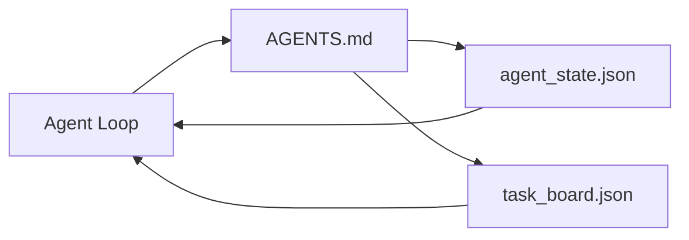

# 최소 에이전트 워크벤치

> 가장 작은 유용한 워크벤치는 세 개의 파일입니다: 루트 지침 라우터, 상태 파일, 작업 보드. 나머지는 그 위에 계층화됩니다. 저장소가 이 세 가지를 담을 수 없다면 어떤 모델도 그것을 구하지 못할 것입니다.

**Type:** Build
**Languages:** Python (stdlib)
**Prerequisites:** Phase 14 · 31 (Why Capable Models Still Fail)
**Time:** ~45분

## 학습 목표

- 최소 실행 가능 워크벤치를 형성하는 세 가지 파일을 정의합니다.
- 긴 단일 `AGENTS.md`보다 짧은 루트 라우터가 더 나은 이유를 설명합니다.
- 에이전트가 매 턴 읽고 마지막에 쓸 수 있는 상태 파일을 구축합니다.
- 채팅 기록 없이 다중 세션 작업을 지속하는 작업 보드를 구축합니다.

## 문제

대부분의 팀은 3000줄짜리 `AGENTS.md`를 작성하고 완료했다고 말하며 워크벤치에 도달합니다. 모델은 그것을 로드하고, 요약할 수 없는 부분을 무시하며, 여전히 항상 실패하던 동일한 표면에서 실패합니다.

반대가 필요합니다. 관련이 있을 때만 에이전트를 더 깊은 파일로 라우팅하는 작은 루트 파일. 에이전트가 행동하기 전에 읽고 후에 쓰는 내구성 있는 상태. 무엇이 진행 중이고, 무엇이 차단되었으며, 무엇이 다음인지 말하는 작업 보드.

세 개의 파일. 각각 임무가 있습니다. 각각 나중에 실제 시스템으로 진화할 수 있을 만큼 기계 판독 가능합니다.

## 개념



### AGENTS.md는 설명서가 아닌 라우터입니다

좋은 `AGENTS.md`는 짧습니다. 에이전트를 다음으로 안내합니다:

- 상태 파일 (현재 위치).
- 작업 보드 (남은 작업).
- 더 깊은 규칙 (`docs/agent-rules.md`).
- 검증 명령 (작동 확인 방법).

더 긴 내용은 더 깊은 문서에 들어가며 필요할 때만 로드됩니다. 긴 설명서는 무시됩니다. 짧은 라우터는 따라집니다.

### agent_state.json은 기록 시스템입니다

상태는 다음을 전달합니다: 활성 작업 ID, 수정된 파일, 작성된 가정, 차단 요소, 다음 작업. 에이전트는 매 턴 읽습니다. 다음 세션은 채팅을 재생하는 대신 이것을 읽습니다.

상태는 파일에 존재합니다. 채팅 기록은 신뢰할 수 없기 때문입니다. 세션은 죽습니다. 대화는 잘립니다. 파일은 그렇지 않습니다.

### task_board.json은 큐입니다

작업 보드는 `todo | in_progress | done | blocked` 상태의 모든 작업을 전달합니다. 상태가 비어있을 때 에이전트가 가져오는 큐이자, 에이전트가 올바른 궤도에 있는지 알고 싶을 때 읽는 큐입니다.

보드의 작업에는 ID, 목표, 소유자(`builder`, `reviewer`, 또는 `human`), 승인 기준이 있습니다. 보드는 의도적으로 작습니다: 한 화면을 넘어가면 보드 문제가 아니라 계획 문제입니다.

### 세 개의 파일은 최소이지 최대가 아닙니다

이후 레슨은 범위 계약, 피드백 실행기, 검증 게이트, 검토자 체크리스트 및 핸드오프 패킷을 추가합니다. 여기의 세 파일은 그들이 모두 가정하는 것입니다.

## 빌드하기

`code/main.py`는 빈 저장소에 최소 워크벤치를 작성하고 다음과 같은 단일 에이전트 턴을 보여줍니다:

1. `agent_state.json` 읽기.
2. 상태가 비어있으면 `task_board.json`에서 다음 작업 가져오기.
3. 범위 내의 단일 파일 수정.
4. 업데이트된 상태 쓰기.

실행:

```
python3 code/main.py
```

스크립트는 자신 옆에 `workdir/`을 생성하고, 세 개의 파일을 배치하며, 한 턴을 실행하고 diff를 출력합니다. 다시 실행하면 두 번째 턴이 첫 번째 턴이 중단된 곳에서 어떻게 이어받는지 확인할 수 있습니다.

## 사용하기

프로덕션 에이전트 제품 내에서 동일한 세 파일이 다른 이름으로 나타납니다:

- **Claude Code:** 라우터용 `AGENTS.md` 또는 `CLAUDE.md`, 상태용 `.claude/state.json` 스타일 저장소, 보드용 훅.
- **Codex / Cursor:** 라우터용 워크스페이스 규칙, 상태용 세션 메모리, 보드용 채팅 사이드바의 대기열 작업.
- **커스텀 Python 에이전트:** 방금 작성한 동일한 파일.

이름은 바뀝니다. 형태는 바뀌지 않습니다.

## 야생의 프로덕션 패턴

최소 워크벤치는 세 가지 패턴이 그 위에 계층화될 때 실제 모노레포와의 접촉에서 살아남습니다. 독립적입니다; 저장소에 실제로 필요한 것을 선택하십시오.

**중첩 `AGENTS.md`와 최근접 승리 우선 순위.** OpenAI는 주요 저장소 전체에 88개의 `AGENTS.md` 파일을 제공합니다(하위 구성 요소당 하나). Codex, Cursor, Claude Code 및 Copilot은 모두 작업 파일에서 저장소 루트로 이동하며途中에서 찾은 모든 `AGENTS.md`를 연결합니다. 하위 디렉토리 파일은 루트 파일을 확장합니다. Codex는 대체(확장이 아님)를 위해 `AGENTS.override.md`를 추가합니다; 재정의 메커니즘은 Codex 특화이므로 교차 도구 작업을 위해 피하십시오. Augment Code의 측정이 중요한 점입니다: 최고의 `AGENTS.md` 파일은 Haiku에서 Opus로 업그레이드하는 것과 동등한 품질 향상을 제공합니다; 최악의 파일은 파일이 전혀 없는 것보다 출력을 더 나쁘게 만듭니다.

**거부해야 할 안티패턴 (커버리지처럼 보여도).** 충돌하는 지침은 에이전트를 대화형에서 탐욕 모드로 자동 전환합니다 (ICLR 2026 AMBIG-SWE: 48.8% → 28% 해결률); 평평하게 쌓는 대신 번호 우선 순위를 지정하십시오. 시행 명령이 없는 확인 불가능한 스타일 규칙("Google Python Style Guide를 따르세요")은 에이전트가 준수를 발명하게 합니다; 모든 스타일 규칙을 정확한 린트 명령과 쌍으로 지정하십시오. 명령 대신 스타일로 시작하면 검증 경로가 묻힙니다; 명령 먼저, 스타일 마지막. 인간을 위해 쓰는 것은 컨텍스트 예산을 낭비합니다; 간결함은 기능입니다.

**교차 도구 심볼릭 링크.** 심볼릭 링크 (`ln -s AGENTS.md CLAUDE.md`, `ln -s AGENTS.md .github/copilot-instructions.md`, `ln -s AGENTS.md .cursorrules`)가 있는 단일 루트 파일은 모든 코딩 에이전트를 동일한 진실 공급원에 유지합니다. Nx의 `nx ai-setup`은 단일 구성에서 Claude Code, Cursor, Copilot, Gemini, Codex 및 OpenCode 전반에 걸쳐 이를 자동화합니다.

## 배포하기

`outputs/skill-minimal-workbench.md`는 모든 새 저장소에 대한 3파일 워크벤치를 생성합니다: 프로젝트에 맞춰진 `AGENTS.md` 라우터, 올바른 키가 있는 `agent_state.json`, 현재 백로그로 시드된 `task_board.json`.

## 연습 문제

1. `agent_state.json`에 `last_run` 타임스탬프 추가. 운영자가 확인하지 않으면 파일이 24시간보다 오래된 경우 실행 거부.
2. 작업 보드에 `priority` 필드를 추가하고 풀러가 항상 가장 높은 우선 순위의 `todo`를 선택하도록 변경.
3. `task_board.json`을 JSON Lines로 마이그레이션하여 각 작업이 한 줄이고 diff가 버전 관리에서 깔끔하도록 함.
4. `lint_workbench.py` 작성: `AGENTS.md`가 80줄을 초과하거나 존재하지 않는 파일을 참조하면 실패.
5. 세 파일 중 하나를 잃는 것이 가장 아플 것을 결정. 방어.

## 주요 용어

| 용어 | 사람들이 말하는 것 | 실제 의미 |
|------|------------------|-----------|
| Router | `AGENTS.md` | 에이전트를 더 깊은 문서와 파일로 안내하는 짧은 루트 파일 |
| State file | "노트" | 에이전트가 매 턴 쓰는 기계 판독 가능한 위치 기록 |
| Task board | "백로그" | 상태, 소유자, 승인 기준이 있는 JSON 작업 큐 |
| System of record | "진실 공급원" | 채팅이 사라졌을 때 워크벤치가 권위 있는 것으로 간주하는 파일 |

## 추가 자료

- [agents.md — 오픈 스펙](https://agents.md/) — Cursor, Codex, Claude Code, Copilot, Gemini, OpenCode에서 채택
- [Augment Code, A good AGENTS.md is a model upgrade. A bad one is worse than no docs at all](https://www.augmentcode.com/blog/how-to-write-good-agents-dot-md-files) — 측정된 품질 향상
- [Blake Crosley, AGENTS.md Patterns: What Actually Changes Agent Behavior](https://blakecrosley.com/blog/agents-md-patterns) — 경험적으로 작동하는 것, 작동하지 않는 것
- [Datadog Frontend, Steering AI Agents in Monorepos with AGENTS.md](https://dev.to/datadog-frontend-dev/steering-ai-agents-in-monorepos-with-agentsmd-13g0) — 실제 중첩 우선 순위
- [Nx Blog, Teach Your AI Agent How to Work in a Monorepo](https://nx.dev/blog/nx-ai-agent-skills) — 6개 도구에 걸친 단일 소스 생성
- [The Prompt Shelf, AGENTS.md Best Practices: Structure, Scope, and Real Examples](https://thepromptshelf.dev/blog/agents-md-best-practices/) — 검토에서 살아남는 섹션 순서
- [Anthropic, Claude Code subagents and session store](https://docs.anthropic.com/en/docs/agents-and-tools/claude-code/sub-agents)
- Phase 14 · 31 — 이 최소가 흡수하는 실패 모드
- Phase 14 · 34 — 이 레슨이 미리보는 내구성 있는 상태 스키마
