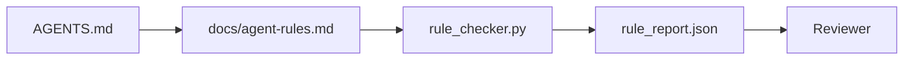

# 실행 가능한 제약 조건으로서의 에이전트 지침

> 산문으로 작성된 지침은 소원입니다. 제약 조건으로 작성된 지침은 테스트입니다. 워크벤치는 각 규칙을 에이전트가 런타임에 확인할 수 있고 검토자가 사후에 검증할 수 있는 것으로 바꿉니다.

**Type:** Build
**Languages:** Python (stdlib)
**Prerequisites:** Phase 14 · 32 (Minimal Workbench)
**Time:** ~50분

## 학습 목표

- 라우팅 산문과 운영 규칙을 분리합니다.
- 시작 규칙, 금지된 작업, 완료 정의, 불확실성 처리 및 승인 경계를 기계 확인 가능한 제약 조건으로 표현합니다.
- 규칙 집합에 대해 실행을 점수화하는 규칙 검사기를 구현합니다.
- 규칙 집합을 diff 친화적으로 만들어 검토가 변경 사항을 볼 수 있도록 합니다.

## 문제

일반적인 `AGENTS.md`는 온보딩 문서처럼 읽힙니다. 에이전트에게 "조심하세요"와 "철저히 테스트하세요"와 "확실하지 않으면 물어보세요"라고 말합니다. 3일 후, 에이전트는 테스트 없는 변경을 출시하고, 금지된 디렉토리에 쓰고, 선이 어디인지 몰랐기 때문에 절대 묻지 않습니다.

지침은 운영적일 때 강력하고 포부적일 때 약합니다. 해결책은 워크벤치가 해석할 수 있고 검토자가 점수화할 수 있는 규칙을 작성하는 것입니다.

## 개념

규칙은 짧은 루트 라우터와 분리된 `docs/agent-rules.md`에 속합니다. 각 규칙에는 이름, 범주 및 검사가 있습니다.



### 대부분의 규칙을 다루는 5가지 범주

| 범주 | 규칙이 답하는 질문 | 예 |
|------|-------------------|-----|
| Startup | 작업 시작 전에 무엇이 참이어야 하는가? | "상태 파일이 존재하고 신선함" |
| Forbidden | 절대 일어나지 말아야 할 것은? | "`scripts/release.sh`를 편집하지 마십시오" |
| Definition of done | 작업 완료를 증명하는 것은? | "pytest가 0으로 종료되고 승인 라인이 통과함" |
| Uncertainty | 확실하지 않을 때 에이전트는 무엇을 하는가? | "추측 대신 질문 노트 열기" |
| Approval | 인간 승인이 필요한 것은? | "새 종속성, 프로덕션 쓰기" |

이 5가지 중 하나에 맞지 않는 규칙은 보통 두 개의 규칙이 되어야 합니다. 분할을 강제하십시오.

### 규칙은 기계 판독 가능합니다

각 규칙에는 슬러그, 범주, 한 줄 설명 및 `rule_checker.py`의 함수를 명명하는 `check` 필드가 있습니다. 규칙을 추가한다는 것은 검사를 추가하는 것을 의미합니다; 검사기는 워크벤치와 함께 성장합니다.

### 규칙은 diff 친화적입니다

규칙은 단일 마크다운 파일에서 제목당 하나씩 존재합니다. 이름 변경은 diff에서 볼 수 있습니다. 새 규칙은 해당 범주의 맨 위에 위치합니다. 오래된 규칙은 주석 처리되지 않고 삭제됩니다. 워크벤치가 진실 공급원이지, 팀이 지난 분기에 어떻게 느꼈는지에 대한 채팅 로그가 아니기 때문입니다.

### 규칙 대 프레임워크 가드레일

프레임워크 가드레일 (OpenAI Agents SDK guardrails, LangGraph interrupts)은 런타임 수준에서 규칙을 시행합니다. 이 레슨의 규칙 집합은 해당 가드레일이 구현하는 인간 판독 가능하고 검토 가능한 계약입니다. 둘 다 필요합니다: 런타임은 턴 중 위반을 잡고, 규칙 집합은 런타임이 올바른 일을 하고 있음을 증명합니다.

### 점진적 공개: 백과사전이 아닌 지도

`AGENTS.md`가 계속 커지는 이유는 모든 사고가 규칙을 추가하고 어떤 사고도 규칙을 제거하지 않기 때문입니다. 1년 후 파일은 2,000줄이고, 에이전트는 첫 화면을 읽고, 주의 예산이 소진되며, 들은 내용의 일부만 가지고 행동합니다. 거대한 지침 파일은 40페이지 온보딩 문서와 같은 이유로 실패합니다: 독자는 한 번 훑어보고 중요했던 부분으로 다시 돌아오지 않습니다.

해결책은 더 짧은 파일이 아닙니다. 계층화된 파일입니다. 루트 라우터는 모든 세션에서 읽을 수 있을 만큼 작게 유지하고 포인터만 보유합니다. 깊이는 작업이 닿을 때만 에이전트가 로드하는 주제 파일에 있습니다. 에이전트에게 전체 백과사전 대신 지도를 주고 필요한 페이지로 걸어가게 하십시오.

```
AGENTS.md                  # 라우터, < 50줄: 이 저장소가 무엇인지, 어디를 봐야 하는지, 5가지 하드 규칙
docs/
  agent-rules.md           # 전체 규칙 집합 (이 레슨)
  architecture.md          # 작업이 모듈 경계에 닿을 때 로드
  testing.md              # 작업이 테스트를 쓰거나 실행할 때 로드
  deploy.md               # 승인 규칙 뒤에 게이트된 릴리스 작업에만 로드
feature_list.json          # 백로그 (Phase 14 · 36)
```

| 계층 | 위치 | 읽는 시기 | 크기 예산 |
|------|------|----------|-----------|
| Router | `AGENTS.md` | 모든 세션, 항상 | 약 50줄 미만 |
| Rules | `docs/agent-rules.md` | 모든 세션, 시작 시 | 범주당 한 화면 |
| Topic docs | `docs/<topic>.md` | 작업이 해당 주제에 닿을 때만 | 필요한 만큼 깊게 |

두 가지 테스트가 계층화를 정직하게 유지합니다. 도달 가능성 테스트: 에이전트는 라우터에서 최대 두 홉 안에 모든 규칙에 도달해야 하므로, 라우터는 모든 주제 문서를 산문으로 설명하지 않고 경로로 연결해야 합니다. 신선도 테스트: 라우터는 검토자가 모든 PR에서 다시 읽을 수 있을 만큼 짧아야 하며, 이것이 조용히 대체한 백과사전으로 다시 성장하는 것을 막는 유일한 방법입니다. 더 이상 확인되지 않는 포인터는 누락된 규칙보다 더 나쁜 실패이므로, 라우터의 끊어진 링크는 그 자체로 시작 검사 위반입니다.

## 빌드하기

`code/main.py`는 다음을 제공합니다:

- 규칙을 데이터클래스로 로드하는 `agent-rules.md` 파서.
- `check` 참조당 하나씩 `rule_checker.py` 스타일 검사기 함수.
- 두 가지 규칙을 위반하는 데모 에이전트 실행과 이를 잡는 검사 통과.

실행:

```
python3 code/main.py
```

출력: 파싱된 규칙 집합, 실행 트레이스, 규칙별 통과/실패, 스크립트 옆에 저장된 `rule_report.json`.

## 야생의 프로덕션 패턴

세 가지 패턴이 분기 동안 지속되는 규칙 집합과 일주일 만에 붕괴되는 규칙 집합을 구분합니다.

**작성 시 심각도 태깅.** 모든 규칙은 `severity`: `block`, `warn` 또는 `info`를 전달합니다. 검사기는 세 가지를 모두 보고합니다; 런타임은 `block`에서만 거부합니다. 대부분의 팀은 초기에 심각도를 과도하게 지정했다가 마감 압박 아래에서 조용히 약화시킵니다; 작성 시 태깅은 사전에 보정을 강제합니다. `block` 규칙의 모든 재정의를 `overrides.jsonl` 감사 로그에 서명하는 검증 게이트(Phase 14 · 38)와 쌍을 이루십시오.

**강제 기능으로서의 규칙 만료.** 모든 규칙은 `expires_at` 날짜(작성일로부터 기본 90일)를 전달합니다. 검사기는 60일 연속으로 위반이 없는 만료되지 않은 규칙이 있을 때 경고를 발행합니다; 다음 분기 검토는 유지를 정당화하거나, `info`로 약화시키거나, 삭제합니다. Cloudflare의 프로덕션 AI 코드 검토 데이터(2026년 4월, 30일 동안 5,169개 저장소에서 131,246회 검토 실행)는 명시적 만료가 있는 규칙 집합이 저장소당 30개 미만으로 유지되었음을 보여주었습니다; 만료가 없는 집합은 80개 이상으로 성장했으며 대부분이 한 번도 작동하지 않았습니다.

**소스로서의 마크다운, 캐시로서의 JSON.** `agent-rules.md`는 작성된 파일입니다; `agent-rules.lock.json`은 검사기가 핫 경로에서 읽는 캐시입니다. Lock은 pre-commit 훅에 의해 재생성됩니다. 마크다운 diff는 검토 가능합니다; JSON 파싱은 모든 턴에서 제외됩니다. `package.json` / `package-lock.json` 및 `Cargo.toml` / `Cargo.lock`과 동일한 형태입니다.

## 사용하기

프로덕션에서:

- Claude Code, Codex, Cursor는 세션 시작 시 규칙을 읽고 작업을 거부할 때 인용합니다. 검사기는 CI에서 다시 실행되어 조용한 드리프트를 잡습니다.
- OpenAI Agents SDK 가드레일은 동일한 검사를 입력 및 출력 가드레일로 등록합니다. 마크다운은 문서 표면이고 SDK는 런타임 표면입니다.
- LangGraph interrupts는 진행 중인 노드가 규칙을 위반할 때 작동합니다. 인터럽트 핸들러는 규칙을 읽고, 인간에게 물어보고, 재개합니다.

규칙 집합은 단지 마크다운과 함수 이름이기 때문에 세 가지 모두에서 이식 가능합니다.

## 배포하기

`outputs/skill-rule-set-builder.md`는 프로젝트 소유자를 인터뷰하고, 기존 산문 지침을 5가지 범주로 분류하며, 버전 관리된 `agent-rules.md`와 검사기 스텁을 생성합니다.

## 연습 문제

1. 제품에 진정으로 필요한 경우 여섯 번째 범주를 추가합니다. 기존 5가지 중 하나로 축소되지 않는 이유를 방어합니다.
2. 규칙이 심각도(`block`, `warn`, `info`)를 전달할 수 있도록 검사기를 확장하고 보고서가 이에 따라 집계되도록 합니다.
3. 검사기를 CI에 연결: 최신 에이전트 실행에서 block-심각도 규칙이 실패하면 빌드 실패.
4. 규칙당 "expiry" 필드를 추가합니다. 90일 후 검사 실패가 없으면 규칙은 검토 대상입니다.
5. 실제 `AGENTS.md`를 찾아 5가지 범주 규칙으로 다시 작성합니다. 그 줄 중 얼마나 많은 것이 운영적이었고 얼마나 많은 것이 포부적이었습니까?

## 주요 용어

| 용어 | 사람들이 말하는 것 | 실제 의미 |
|------|------------------|-----------|
| Operational rule | "실제 지침" | 워크벤치가 런타임에 확인할 수 있는 규칙 |
| Aspirational rule | "조심하세요" | 검사가 없는 규칙; 삭제하거나 업그레이드 |
| Definition of done | "승인" | 작업 완료를 증명하는 객관적 파일 기반 증거 |
| Block severity | "하드 규칙" | 위반 시 실행 중단; 운영자 없이 무음 불가 |
| Rule expiry | "오래된 규칙 정리" | N일 동안 실패가 없는 규칙은 폐기 대상 |

## 추가 자료

- [OpenAI Agents SDK guardrails](https://platform.openai.com/docs/guides/agents-sdk/guardrails)
- [LangGraph interrupts](https://langchain-ai.github.io/langgraph/how-tos/human_in_the_loop/breakpoints/)
- [Anthropic, Building Effective Agents](https://www.anthropic.com/research/building-effective-agents)
- [Rick Hightower, Agent RuleZ: A Deterministic Policy Engine](https://medium.com/@richardhightower/agent-rulez-a-deterministic-policy-engine-for-ai-coding-agents-9489e0561edf) — 프로덕션의 block/warn/info 심각도
- [Cloudflare, Orchestrating AI Code Review at Scale](https://blog.cloudflare.com/ai-code-review/) — 131k 검토 실행, 규칙 구성 교훈
- [microservices.io, GenAI development platform — part 1: guardrails](https://microservices.io/post/architecture/2026/03/09/genai-development-platform-part-1-development-guardrails.html) — 규칙과 CI 간의 심층 방어
- [Type-Checked Compliance: Deterministic Guardrails (arXiv 2604.01483)](https://arxiv.org/pdf/2604.01483) — 규칙-검사 상한으로서의 Lean 4
- [logi-cmd/agent-guardrails](https://github.com/logi-cmd/agent-guardrails) — 병합 게이트 구현: 범위, 변이 테스트, 위반 예산
- Phase 14 · 32 — 이 규칙 집합이 배치되는 최소 워크벤치
- Phase 14 · 38 — 규칙 보고서를 소비하는 검증 게이트
- Phase 14 · 39 — 규칙 준수를 점수화하는 검토자 에이전트
