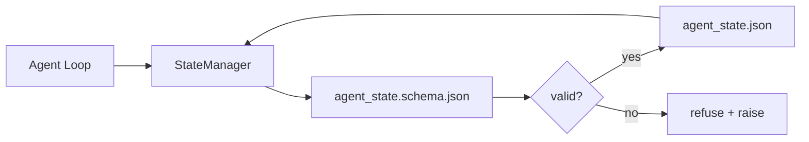

# 저장소 메모리와 내구성 있는 상태

> 채팅 기록은 휘발성입니다. 저장소는 내구성이 있습니다. 워크벤치는 에이전트 상태를 버전 관리된 파일에 저장하여 다음 세션, 다음 에이전트, 다음 검토자가 모두 동일한 진실 공급원에서 읽도록 합니다.

**Type:** Build
**Languages:** Python (stdlib + `jsonschema` 선택사항)
**Prerequisites:** Phase 14 · 32 (Minimal Workbench)
**Time:** ~60분

## 학습 목표

- 저장소 메모리에 속하는 것과 채팅 기록에 속하는 것을 정의합니다.
- `agent_state.json` 및 `task_board.json`에 대한 JSON Schema를 작성합니다.
- 상태를 원자적으로 로드, 검증, 변경 및 유지하는 상태 관리자를 구축합니다.
- 스키마를 사용하여 워크벤치를 손상시키기 전에 잘못된 쓰기를 거부합니다.

## 문제

에이전트가 세션을 마칩니다. 채팅이 닫힙니다. 다음 세션이 열리고 어디서부터 시작할지 묻습니다. 모델이 "파일을 확인하겠습니다"라고 말하고, 오래된 노트를 읽고, 이미 완료된 작업을 다시 수행합니다. 또는 더 나쁘게, 아무도 파일이 완료되었다고 말하지 않았기 때문에 완료된 파일을 다시 작성합니다.

워크벤치 해결책은 저장소 메모리입니다: 상태는 저장소의 JSON 파일에 존재하고, 스키마 아래에 작성되며, 원자적으로 유지되고, 코드 검토에서 diff 친화적입니다. 채팅은 일시적인 피드입니다; 저장소가 기록 시스템입니다.

## 개념



### 저장소 메모리에 속하는 것

| 속함 | 속하지 않음 |
|------|------------|
| 활성 작업 ID | 원시 채팅 대화록 |
| 이 세션에서 수정된 파일 | 토큰 수준 추론 트레이스 |
| 에이전트가 작성한 가정 | "사용자가 좌절한 것 같았음" |
| 열린 차단 요소 | 샘플링된 완료 |
| 다음 작업 | 벤더별 모델 ID |

테스트는 내구성입니다: 3개월 후 CI 재실행에서 유용하겠는가? 예이면 저장소, 아니오면 텔레메트리.

### 스키마 우선 상태

JSON Schema는 계약입니다. 그것 없이는 모든 에이전트가 새 필드를 발명하고, 모든 검토자가 새 형태를 배우며, 모든 CI 스크립트가 과거 버전을 특수 처리해야 합니다. 그것이 있으면 잘못된 쓰기는 거부된 쓰기입니다.

스키마는 다음을 다룹니다:

- 필수 키.
- 허용된 `status` 값.
- 금지된 값 (예: 배열의 `null`).
- 패턴 제약 조건 (작업 ID가 `T-\d{3,}`와 일치).
- 마이그레이션을 위한 버전 필드.

### 원자적 쓰기

상태 쓰기는 부분적 실패에서 살아남아야 합니다: 임시 파일에 쓰기, fsync, 대상 위로 이름 변경. 상태 파일은 진실 공급원입니다; 반쯤 작성된 것은 파일이 없는 것보다 더 나쁩니다.

### 마이그레이션

스키마가 변경되면 스키마 버프 옆에 마이그레이션 스크립트를 제공합니다. 상태 파일은 `schema_version` 필드를 전달합니다; 관리자는 마이그레이션할 수 없는 버전의 파일 로드를 거부합니다.

## 빌드하기

`code/main.py`는 다음을 구현합니다:

- `agent_state.schema.json` 및 `task_board.schema.json`.
- stdlib 전용 검증기 (JSON Schema 하위 집합: required, type, enum, pattern, items).
- 원자적 temp-and-rename 쓰기를 사용한 `StateManager.load`, `StateManager.update`, `StateManager.commit`.
- 상태를 변경하고, 유지하고, 다시 로드하고, 왕복을 증명하는 데모.

실행:

```
python3 code/main.py
```

스크립트는 `workdir/agent_state.json`과 `workdir/task_board.json`을 작성하고, 두 턴에 걸쳐 변경하며, 각 단계에서 검증된 상태를 출력합니다.

## 야생의 프로덕션 패턴

네 가지 패턴이 레슨의 최소를 다중 에이전트 모노레포가 생존할 수 있는 것으로 바꿉니다.

**원자적 temp-and-rename은 선택 사항이 아닙니다.** 2026년 3월 Hive 프로젝트 버그 보고서는 실패 모드를 깔끔하게 문서화합니다: `state.json`이 `write_text()`를 통해 작성되고 예외가 잡혀 무시되었습니다. 부분적 쓰기는 신호 없이 손상된 상태로 세션을 재개하게 했습니다. 해결책은 항상: 대상과 동일한 디렉토리에 `tempfile.mkstemp`, 쓰기, `fsync`, `os.replace` (POSIX 및 Windows에서 원자적 이름 변경). 이 레슨의 `atomic_write`가 정확히 그렇게 합니다.

**모든 비멱등 도구 호출의 멱등성 키.** 에이전트가 도구를 호출한 후 결과를 체크포인트하기 전에 충돌하면, 복구가 도구 호출을 재시도합니다. 읽기에는 안전; 이메일, DB 삽입, 파일 업로드에는 위험. 패턴: 실행 전에 모든 도구 호출 ID를 `pending_calls.jsonl`에 기록. 재시도 시 ID 확인; 있으면 호출을 건너뛰고 캐시된 결과 사용. Anthropic과 LangChain 모두 2026년 지침에서 이를 언급합니다; LangGraph의 체크포인터도 같은 이유로 보류 중인 쓰기를 유지합니다.

**큰 아티팩트를 상태와 분리.** CSV, 긴 대화록 또는 생성된 파일을 `agent_state.json`에 저장하지 마십시오. 아티팩트를 별도 파일로 저장하고(또는 객체 스토리지에 업로드) 상태에는 경로만 유지하십시오. 체크포인트는 작고 빠르게 유지됩니다; 아티팩트는 독립적으로 성장합니다.

**감사를 위한 이벤트 소싱, 재개를 위한 스냅샷.** 모든 변경 시 이벤트 로그(`state.events.jsonl`)에 추가; 주기적으로 `state.json`으로 스냅샷. 재개는 스냅샷을 읽은 후 스냅샷 타임스탬프 이후의 모든 이벤트를 재생합니다. 더 많은 디스크를 사용하지만 에이전트 결정을 그대로 재생할 수 있습니다 — 장기 실행 디버깅에 필수적. Postgres가 내부적으로 WAL에 사용하는 것과 동일한 형태입니다.

**스키마 마이그레이션 또는 로드 거부.** `schema_version` 정수가 계약입니다. 관리자가 알 수 없는 버전의 파일을 로드할 때 읽기를 거부합니다. 스키마 버프 옆에 마이그레이션 스크립트를 제공합니다; `tools/migrate_state.py`는 모든 시작 시 멱등적으로 실행됩니다.

## 사용하기

프로덕션에서:

- **LangGraph 체크포인터.** 동일한 아이디어, 다른 스토리지. 체크포인터는 그래프 상태를 SQLite, Postgres 또는 커스텀 백엔드에 유지합니다. 이 레슨이 가르치는 스키마는 체크포인터가 죽고 상태를 수동으로 읽어야 할 때 필요한 것입니다.
- **Letta 메모리 블록.** 구조화된 스키마가 있는 지속적 블록 (Phase 14 · 08). 장기 실행 페르소나로 범위가 지정된 동일한 규율.
- **OpenAI Agents SDK 세션 저장소.** 플러그형 백엔드, 스키마 인식. 이 레슨의 상태 파일은 로컬 파일 백엔드입니다.

## 배포하기

`outputs/skill-state-schema.md`는 프로젝트별 JSON Schema 쌍 (상태 + 보드), 원자적 쓰기에 연결된 Python `StateManager`, 다음 스키마 버프가 워크벤치를 깨뜨리지 않도록 하는 마이그레이션 스캐폴드를 생성합니다.

## 연습 문제

1. `last_human_touch` 타임스탬프 추가. 인간 편집 후 5초 이내의 모든 에이전트 쓰기 거부.
2. 검증기가 `oneOf`를 지원하도록 확장하여 작업이 다른 필수 필드를 가진 빌드 작업 또는 검토 작업이 될 수 있도록 함.
3. `schema_version` 필드를 추가하고 v1에서 v2로의 마이그레이션 작성 (`blockers`를 `risks`로 이름 변경).
4. 스토리지 백엔드를 로컬 파일에서 SQLite로 이동. `StateManager` API는 동일하게 유지.
5. 50ms 쓰기 경합으로 동일한 상태 파일에 대해 두 에이전트 실행. 무엇이 잘못되고 원자적 이름 변경이 어떻게 구하는가?

## 주요 용어

| 용어 | 사람들이 말하는 것 | 실제 의미 |
|------|------------------|-----------|
| Repo memory | "노트 파일" | 스키마 아래 저장소의 추적된 파일에 저장된 상태 |
| Schema-first | "입력 검증" | 작성자보다 먼저 계약을 정의, 드리프트 거부 |
| Atomic write | "그냥 이름 변경" | 임시 파일에 쓰기, fsync, 이름 변경으로 부분 실패가 손상시킬 수 없음 |
| Migration | "스키마 범프" | vN 상태를 v(N+1) 상태로 바꾸는 스크립트 |
| System of record | "진실 공급원" | 워크벤치가 권위 있는 것으로 간주하는 아티팩트 |

## 추가 자료

- [JSON Schema specification](https://json-schema.org/specification.html)
- [LangGraph checkpointers](https://langchain-ai.github.io/langgraph/concepts/persistence/)
- [Letta memory blocks](https://docs.letta.com/concepts/memory)
- [Fast.io, AI Agent State Checkpointing: A Practical Guide](https://fast.io/resources/ai-agent-state-checkpointing/) — 멱등성이 있는 스키마 우선 체크포인팅
- [Fast.io, AI Agent Workflow State Persistence: Best Practices 2026](https://fast.io/resources/ai-agent-workflow-state-persistence/) — 동시성 제어, TTL, 이벤트 소싱
- [Hive Issue #6263 — 비원자적 state.json 쓰기가 조용히 무시됨](https://github.com/aden-hive/hive/issues/6263) — 실제 프로젝트의 실패 모드
- [eunomia, Checkpoint/Restore Systems: Evolution, Techniques, Applications](https://eunomia.dev/blog/2025/05/11/checkpointrestore-systems-evolution-techniques-and-applications-in-ai-agents/) — OS 역사의 CR 기본 요소를 에이전트에 적용
- [Indium, 7 State Persistence Strategies for Long-Running AI Agents in 2026](https://www.indium.tech/blog/7-state-persistence-strategies-ai-agents-2026/)
- [Microsoft Agent Framework, Compaction](https://learn.microsoft.com/en-us/agent-framework/agents/conversations/compaction) — 벤더 체크포인트 관리자
- Phase 14 · 08 — 메모리 블록 및 슬립 타임 컴퓨트
- Phase 14 · 32 — 이 레슨이 스키마화하는 3파일 최소
- Phase 14 · 40 — 동일한 스키마에서 읽는 핸드오프 패킷
