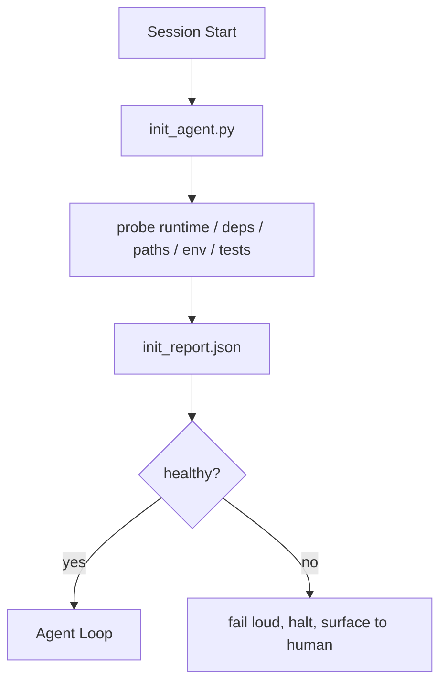

# 에이전트 초기화 스크립트

> 매번 콜드 스타트하는 세션은 비용을 지불합니다. 에이전트는 동일한 파일을 읽고, 동일한 프로브를 재시도하며, 동일한 경로를 재발견합니다. 초기화 스크립트는 비용을 한 번 지불하고 답을 상태에 기록합니다.

**Type:** Build
**Languages:** Python (stdlib)
**Prerequisites:** Phase 14 · 32 (Minimal Workbench), Phase 14 · 34 (Repo Memory)
**Time:** ~45분

## 학습 목표

- 에이전트가 세션당 절대 다시 수행하지 말아야 할 작업을 식별합니다.
- 런타임, 종속성 및 저장소 상태를 프로브하는 결정론적 초기화 스크립트를 구축합니다.
- 프로브 결과를 유지하여 에이전트가 검사를 다시 실행하는 대신 읽도록 합니다.
- 초기화 실패 시 크게, 빠르게, 한 곳에서 실패합니다.

## 문제

세션을 엽니다. 에이전트가 Python 버전을 추측합니다. 테스트 명령을 추측합니다. 저장소 루트를 다섯 번 나열하여 진입점을 찾습니다. 설치되지 않은 패키지를 가져오려고 시도합니다. 구성 파일이 어디 있는지 사용자에게 묻습니다. 실제 편집을 할 때쯤이면 만 개의 토큰이 단일 스크립트여야 했던 설정 작업에 사용되었습니다.

해결책은 에이전트가 다른 작업을 하기 전에 실행되고 에이전트가 시작 시 읽는 `init_report.json`을 작성하는 하나의 초기화 스크립트입니다.

## 개념



### 초기화 스크립트가 프로브하는 것

| 프로브 | 중요한 이유 |
|--------|------------|
| 런타임 버전 | 잘못된 Python 또는 Node 버전은 조용한 잘못된 버전 버그 발생 |
| 종속성 가용성 | 나중에 누락된 패키지는 지금 잡는 비용의 10배 |
| 테스트 명령 | 에이전트가 검증 방법을 알아야 함; 명령이 없으면 워크벤치가 손상됨 |
| 저장소 경로 | 하드코딩된 경로는 드리프트됨; 한 번 확인하고 고정 |
| 환경 변수 | 누락된 `OPENAI_API_KEY`는 런타임 미스터리가 아닌 실패 표면 |
| 상태 + 보드 신선도 | 충돌한 세션의 오래된 상태는 함정 |
| 마지막으로 알려진 정상 커밋 | 세션 종료 시 핸드오프 diff의 앵커 |

### 크게 실패, 빠르게 실패, 한 곳에서 실패

프로브 실패는 중단하고 인간에게 표면화하는 것을 의미합니다. "에이전트가 알아낼 것입니다"는 안 됩니다. Init의 요점은 워크벤치가 손상되었을 때 시작을 거부하는 것입니다.

### 멱등성

두 번 연속 실행합니다. 두 번째 실행은 신선한 타임스탬프를 제외하고는 no-op이어야 합니다. 멱등성은 스크립트를 CI, 훅 또는 사전 작업 슬래시 명령에 연결할 수 있게 하는 것입니다.

### Init 대 시작 규칙

규칙 (Phase 14 · 33)은 행동하기 위해 무엇이 참이어야 하는지 설명합니다. Init은 해당 규칙을 확인할 수 있음을 확립하는 스크립트입니다. 규칙 없는 Init은 "조심하세요"가 됩니다. Init 없는 규칙은 세련된 실패가 됩니다.

## 빌드하기

`code/main.py`는 `init_agent.py`를 구현합니다:

- 5개의 프로브: Python 버전, `importlib.util.find_spec`을 통한 나열된 종속성, 테스트 명령 확인 가능성, 필수 환경 변수, 상태 파일 신선도.
- 각 프로브는 `(name, status, detail)`을 반환.
- 스크립트는 전체 프로브 세트와 함께 `init_report.json`을 작성하고 block-심각도 프로브가 실패하면 0이 아닌 종료 코드로 종료.

실행:

```
python3 code/main.py
```

스크립트는 프로브 테이블을 출력하고, `init_report.json`을 작성하며, 정상 경로에서는 0으로 종료하거나 실패한 프로브 목록과 함께 0이 아닌 값으로 종료합니다.

## 야생의 프로덕션 패턴

세 가지 패턴이 유용한 init 스크립트와 의식적인 절차를 구분합니다.

**마지막으로 알려진 정상 커밋 앵커링.** 마지막 성공적인 병합 시 작성된 `LKG` 파일에 대해 현재 커밋을 프로브합니다. diff가 예산(기본 50개 파일)을 초과하면 시작을 거부하고 인간이 새 기준선을 비준할 것을 요구합니다. Cloudflare의 AI 코드 검토가 검토자 에이전트의 범위를 지정하는 데 사용하는 방법입니다: 모든 검토 세션은 동일한 마지막으로 알려진 정상에 앵커링되고 세션 간 드리프트를 누적하지 않습니다.

**TTL이 있는 잠금 파일.** 첫 번째 성공적인 프로브 통과 후 `prereqs.lock`을 작성합니다. 이후 실행은 N시간(기본 24시간) 동안 잠금을 신뢰하고 값비싼 프로브를 건너뜁니다. Init 스크립트는 먼저 잠금을 읽습니다; 신선하고 종속성 매니페스트 해시가 일치하면 단락됩니다. 이는 Docker가 레이어 캐시에 사용하는 것과 동일한 패턴입니다: 멱등성 프로브 + 콘텐츠 해시 = 건너뛰기.

**핫 경로에 네트워크, LLM, 예상치 못한 것 없음.** Init 프로브는 결정론적 배관입니다. 실패를 분류하기 위해 LLM을 호출하거나 라이선스를 확인하기 위해 외부 서비스를 호출하는 프로브는 프로브가 아니라 워크플로우입니다. 드라이 런에서 프로브가 3초 이상 걸리면 워크벤치 냄새로 처리하고 init에서 이동하거나 결과를 캐시하십시오.

## 사용하기

프로덕션에서:

- **Claude Code hooks.** `pre-task` 훅이 init 스크립트를 호출하고 실패하면 에이전트 실행을 거부.
- **GitHub Actions.** `setup-agent` 작업이 init 스크립트를 실행; 에이전트 작업이 이에 의존.
- **Docker entrypoint.** 에이전트 컨테이너가 에이전트 런타임을 exec하기 전에 init 스크립트를 실행; 실패 시 로그 표시.

Init 스크립트는 특정 프레임워크를 호출하지 않기 때문에 이식 가능합니다. Bash, Make 또는 작업 파일로 래핑할 수 있습니다.

## 배포하기

`outputs/skill-init-script.md`는 프로젝트를 인터뷰하고, 설정 작업을 프로브로 분류하며, 프로젝트별 `init_agent.py`와 에이전트 단계 전에 실행되는 CI 워크플로우를 생성합니다.

## 연습 문제

1. 현재 커밋을 마지막으로 알려진 정상 커밋과 비교하고 50개 이상의 파일이 변경된 경우 시작을 거부하는 프로브 추가.
2. 스크립트가 `prereqs.lock` 파일을 작성하고 7일보다 오래된 경우 시작을 거부하도록 연결.
3. `--fix` 플래그 추가: 누락된 개발 종속성은 자동 설치하지만 승인 없이 런타임 종속성은 수정하지 않음.
4. 프로브를 하드코딩된 함수에서 YAML 레지스트리로 이동. 트레이드오프 방어.
5. 프로브당 타이밍 예산 추가. 3초 이상 실행되는 프로브는 워크벤치 냄새.

## 주요 용어

| 용어 | 사람들이 말하는 것 | 실제 의미 |
|------|------------------|-----------|
| Probe | "검사" | `(name, status, detail)`을 반환하는 결정론적 함수 |
| Init report | "설정 출력" | 프로브 결과와 함께 상태 옆에 작성된 JSON |
| Idempotent | "재실행 안전" | 두 번 연속 실행이 타임스탬프를 제외하고 동일한 보고서 생성 |
| Fail loud | "삼키지 마십시오" | 중단하고 인간에게 표면화; 조용한 폴백 없음 |
| Setup tax | "부트스트랩 비용" | 에이전트가 세션당 명백한 것을 재발견하는 데 사용하는 토큰 |

## 추가 자료

- [Anthropic, Effective harnesses for long-running agents](https://www.anthropic.com/engineering/effective-harnesses-for-long-running-agents)
- [GitHub Actions, composite actions for setup](https://docs.github.com/en/actions/sharing-automations/creating-actions/creating-a-composite-action)
- [microservices.io, GenAI dev platform: guardrails](https://microservices.io/post/architecture/2026/03/09/genai-development-platform-part-1-development-guardrails.html) — init으로서의 pre-commit + CI 검사
- [Augment Code, How to Build Your AGENTS.md (2026)](https://www.augmentcode.com/guides/how-to-build-agents-md) — init 기대사항
- [Codex Blog, Codex CLI Context Compaction](https://codex.danielvaughan.com/2026/03/31/codex-cli-context-compaction-architecture/) — compaction 인식 init으로서의 세션 시작
- Phase 14 · 33 — 이 스크립트가 활성화하는 규칙 집합
- Phase 14 · 34 — 이 스크립트가 시드하는 상태 파일
- Phase 14 · 38 — init 스크립트가 공급하는 검증 게이트
- Phase 14 · 40 — init 보고서의 마지막으로 알려진 정상을 소비하는 핸드오프
