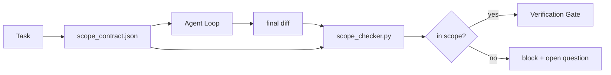

# 범위 계약과 작업 경계

> 모델은 작업이 끝나는 곳을 모릅니다. 범위 계약은 작업별 파일로, 작업이 시작되는 곳, 끝나는 곳, 그리고 넘칠 경우 롤백하는 방법을 명시합니다. 계약은 "범위 내에 머물기"를 소원에서 검사로 바꿉니다.

**Type:** Build
**Languages:** Python (stdlib)
**Prerequisites:** Phase 14 · 32 (Minimal Workbench), Phase 14 · 33 (Rules as Constraints)
**Time:** ~50분

## 학습 목표

- 에이전트가 작업 시작 시 읽고 검증기가 작업 종료 시 읽는 범위 계약을 작성합니다.
- 허용된 파일, 금지된 파일, 승인 기준, 롤백 계획 및 승인 경계를 지정합니다.
- diff를 계약과 비교하여 위반을 표시하는 범위 검사기를 구현합니다.
- 범위 확장(scope creep)을 가시적이고 자동화하며 검토 가능하게 만듭니다.

## 문제

에이전트는 범위를 넘어 확장합니다. 작업은 "로그인 버그 수정"입니다. diff는 로그인 라우터, 이메일 헬퍼, 데이터베이스 드라이버, README 및 릴리스 스크립트를 건드립니다. 각각의 수정에는 그 순간 그럴듯한 이유가 있었습니다. 함께라면 검토된 변경과는 다른 변경입니다.

범위 확장은 에이전트 작업에서 가장 덜 모니터링되는 실패 모드입니다. 에이전트가 각 단계를 선의로 설명하기 때문입니다. 해결책은 더 엄격한 프롬프트가 아닙니다. 해결책은 무엇이 약속되었는지 말하는 디스크 상의 계약과 약속에 대해 결과를 비교하는 검사입니다.

## 개념



### 범위 계약에 포함되는 것

| 필드 | 목적 |
|------|------|
| `task_id` | 보드의 작업에 연결 |
| `goal` | 검토자가 확인할 수 있는 한 문장 |
| `allowed_files` | 에이전트가 쓸 수 있는 글로브 |
| `forbidden_files` | 에이전트가 실수로도 건드리지 말아야 할 글로브 |
| `acceptance_criteria` | 완료를 증명하는 테스트 명령 또는 어설션 라인 |
| `rollback_plan` | 중단이 필요할 경우 운영자가 실행할 수 있는 한 문단 |
| `approvals_required` | 명시적 인간 승인이 필요한 범위 외 작업 |

`forbidden_files` 없는 계약은 불완전합니다. 부정적인 공간이 계약의 절반입니다.

### 원시 경로가 아닌 글로브

실제 저장소는 파일을 이동합니다. 글로브(`app/**/*.py`, `tests/test_signup*.py`)에 계약을 고정하여 세션 간 리팩터가 계약을 무효화하지 않도록 합니다.

### 롤백은 범위의 일부

롤백 방법을 나열하면 계약 작성자가 무엇이 잘못될 수 있는지 생각하게 됩니다. 롤백할 수 없는 계약은 승인되어서는 안 되는 계약입니다.

### 범위 검사는 diff 검사

에이전트가 diff를 작성합니다. 검사기는 diff, 허용된 글로브, 금지된 글로브 및 실행된 승인 명령 목록을 읽습니다. 각 위반은 검증 게이트가 거부할 수 있는 태그된 결과입니다.

### 두 가지 고도의 범위: 기능 목록과 작업 계약

범위 계약은 하나의 작업을 제한합니다. 프로젝트를 제한하지는 않습니다. 에이전트는 로그인 수정에 대한 계약 내에 완벽하게 머물 수 있지만, 다음 턴에는 프로젝트에 설정 페이지, 다크 모드 토글 및 라우터 재작성도 필요하다고 결정할 수 있습니다. 계약은 작업에 대해 어떤 파일이 범위 내인지만 물었을 뿐, 프로젝트에 대해 어떤 작업이 범위 내인지는 묻지 않았습니다.

두 번째 고도에는 자체 기본 요소가 필요합니다: 에이전트가 세션 시작 시 읽는 `feature_list.json`. 이는 기계 판독 가능하고 정렬된 파일로서의 프로젝트 백로그입니다. 에이전트는 `status`가 `todo`인 정확히 하나의 기능을 선택하고, 해당 `id`를 활성 범위 계약에 작성하며, 동일한 세션에서 두 번째 기능을 시작하는 것이 금지됩니다. "한 번에 하나의 기능"은 에이전트가 합리화할 수 있는 프롬프트의 한 줄이 아니라 디스크에서 읽고 게이트가 시행하는 값이 됩니다.

```json
{
  "project": "knowledge-base",
  "active": "import-pdf",
  "features": [
    { "id": "import-pdf",   "status": "in_progress", "goal": "라이브러리에 PDF 가져오기", "done_when": "pytest tests/test_import.py && 샘플 PDF가 라이브러리 보기에 나타남" },
    { "id": "full-text-search", "status": "todo", "goal": "문서 텍스트 검색 및 결과 순위화", "done_when": "쿼리가 스니펫과 함께 순위화된 결과 반환" },
    { "id": "cite-answers", "status": "todo", "goal": "답변에 출처 인용 포함", "done_when": "모든 답변이 하나 이상의 클릭 가능한 인용 표시" }
  ]
}
```

| 필드 | 목적 |
|------|------|
| `active` | 현재 세션이 건드릴 수 있는 단일 기능; 비어 있으면 하나를 선택하여 설정 |
| `features[].id` | 범위 계약의 `task_id`가 가리키는 안정적인 슬러그 |
| `features[].status` | `todo`, `in_progress`, `done`, `blocked`; 한 번에 하나만 `in_progress` |
| `features[].goal` | 검토자가 확인할 수 있는 한 문장 |
| `features[].done_when` | `in_progress`를 `done`으로 전환하는 승인 라인 |

두 가지 규칙이 목록을 장식용이 아닌 하중 지지로 만듭니다. 첫째, "최대 하나의 `in_progress`" 불변 조건은 그 자체로 시작 검사(Phase 14 · 33)입니다: 목록에 두 개가 표시되면 인간이 해결할 때까지 세션이 시작을 거부합니다. 둘째, 기능 목록은 채팅 메시지가 아닌 파일입니다. 채팅은 컨텍스트 밖으로 스크롤되고 파일은 세션과 에이전트를 넘어 지속되기 때문입니다. 핸드오프(Phase 14 · 40)는 완료된 기능의 상태를 `done`으로 다시 작성하여 다음 세션이 남은 것을 재유도하는 대신 정확한 보드로 열리게 합니다.

계약과 목록은 최소 권한으로 구성됩니다. 아래 설명된 병합과 동일합니다: 작업 계약의 `allowed_files`는 활성 기능이 건드리는 것 내에 있어야 하며, 절대 밖에 있지 않아야 합니다.

## 빌드하기

`code/main.py`는 다음을 구현합니다:

- `scope_contract.json` 스키마 (JSON Schema 하위 집합, 글로브 배열).
- 수정된 파일 목록과 실행된 명령 목록을 `RunSummary`로 바꾸는 diff 파서.
- 계약에 대해 `(violations, in_scope, off_scope)`를 반환하는 `scope_check`.
- 두 데모 실행: 하나는 범위 내에 머물고, 하나는 확장. 검사기가 정확한 파일과 이유와 함께 확장을 표시.

실행:

```
python3 code/main.py
```

출력: 계약, 두 실행, 실행별 판정, 저장된 `scope_report.json`.

## 야생의 프로덕션 패턴

"specsmaxxing"(에이전트 호출 전 YAML의 범위 계약)을 실행하는 실무자는 에이전트 변경 없이 3주 만에 토끼굴 비율이 52%에서 21%로 떨어졌다고 보고합니다. 계약이 작업을 수행했지 모델이 아닙니다. 세 가지 패턴이 이득을 지속하게 만듭니다.

**이진 실패가 아닌 위반 예산.** `agent-guardrails` (Claude Code, Cursor, Windsurf, Codex가 MCP를 통해 사용하는 OSS 병합 게이트)는 작업당 `violationBudget`을 제공합니다: 예산 내의 사소한 범위 위반은 경고로 표시; 예산이 초과될 때만 병합 게이트가 거부. `violationSeverity: "error" | "warning"`와 쌍을 이룹니다. 예산은 출시되는 게이트와 사용하는 팀이 싫어해서 비활성화되는 게이트의 차이입니다.

**경로군별 심각도 비대칭.** `docs/**`에 대한 범위 외 쓰기는 보통 `warn`; `scripts/**`, `migrations/**`, `config/prod/**`에 대한 것은 항상 `block`. 이 비대칭은 프로젝트별로 다르고 작업별로 변경되므로 런타임이 아닌 계약에 있어야 합니다.

**파일 예산 옆의 시간 및 네트워크 예산.** `time_budget_minutes` 필드는 벽시계 시간을 제한; 런타임은 재승인 없이 이를 초과하여 계속되지 않습니다. `network_egress` 호스트명 허용 목록은 에이전트가 작업의 일부가 아닌 외부 API를 조용히 호출하는 것을 방지합니다. 이들도 범위 차원입니다; 파일 글로브는 필요하지만 충분하지 않습니다.

**다중 계약 병합 시맨틱 (최소 권한).** 두 범위 계약이 적용될 때(예: 프로젝트 전체 계약 + 작업별 계약), 병합은: `allowed_files`는 **교차**(두 계약 모두 경로를 허용해야 함), `forbidden_files`는 **합집합**(둘 중 하나가 금지 가능), `time_budget_minutes`는 가장 제한적인 것(min), `approvals_required`는 누적. `network_egress`는 시행 없음은 `None`, 모두 거부는 `[]`, 허용 목록은 `[...]`; 병합 시 `None`은 다른 쪽에 위임, 두 목록은 교차, 모두 거부는 유지. 계약 스키마에 이를 명시하여 병합이 기계적이고 검토 가능하도록 합니다.

## 사용하기

프로덕션 패턴:

- **Claude Code 슬래시 명령.** `/scope` 명령이 계약을 작성하고 세션 컨텍스트로 고정. 하위 에이전트가 행동 전에 계약을 읽음.
- **GitHub PR.** 계약을 PR 본문의 JSON 파일 또는 체크인된 아티팩트로 푸시. CI가 병합 diff에 대해 범위 검사기를 실행.
- **LangGraph 인터럽트.** 범위 위반이 인터럽트를 트리거; 핸들러가 인간에게 계약을 확장해야 하는지 에이전트가 물러나야 하는지 질문.

계약은 작업과 함께 이동합니다. 작업이 종료되면 계약은 `outputs/scope/closed/` 아래에 보관됩니다.

## 배포하기

`outputs/skill-scope-contract.md`는 작업 설명에 대한 범위 계약과 모든 에이전트 diff에서 CI로 실행되는 글로브 인식 검사기를 생성합니다.

## 연습 문제

1. 허용된 외부 호스트를 나열하는 `network_egress` 필드 추가. 다른 호스트를 건드리는 실행 거부.
2. 검사기가 `docs/**`에서는 소프트 실패, `scripts/**`에서는 하드 실패하도록 확장. 비대칭성 정당화.
3. 계약이 정적 규칙 집합(LLM 없음)을 사용하여 `goal` 필드에서 `allowed_files`를 유도하도록 함. 첫 번째 엣지 케이스에서 무엇이 잘못되는가?
4. `time_budget_minutes` 추가 및 벽시계 시간이 초과되면 계속 거부.
5. 동일한 diff에 대해 두 계약 실행. 둘 다 적용될 때 올바른 병합 시맨틱은 무엇인가?

## 주요 용어

| 용어 | 사람들이 말하는 것 | 실제 의미 |
|------|------------------|-----------|
| Scope contract | "작업 브리핑" | 허용/금지 파일, 승인, 롤백을 나열하는 작업별 JSON |
| Scope creep | "또한 건드렸음..." | 동일한 작업에서 계약 외부의 파일 변경 |
| Rollback plan | "되돌릴 수 있음" | 중단을 위한 한 문단 운영자 런북 |
| Approval boundary | "서명 필요" | 명시적 인간 승인이 필요한 계약에 나열된 작업 |
| Diff check | "경로 감사" | 계약 글로브에 대해 수정된 파일 비교 |

## 추가 자료

- [LangGraph human-in-the-loop interrupts](https://langchain-ai.github.io/langgraph/concepts/human_in_the_loop/)
- [OpenAI Agents SDK tool approval policies](https://platform.openai.com/docs/guides/agents-sdk)
- [logi-cmd/agent-guardrails — merge gates and scope validation](https://github.com/logi-cmd/agent-guardrails) — 위반 예산, 심각도 계층
- [Dev|Journal, Preventing AI Agent Configuration Drift with Agent Contract Testing](https://earezki.com/ai-news/2026-05-05-i-built-a-tiny-ci-tool-to-keep-ai-agent-configs-from-drifting-in-my-repo/) — 외부 종속성 없는 `--strict` 모드
- [Agentic Coding Is Not a Trap (production logs)](https://dev.to/jtorchia/agentic-coding-is-not-a-trap-i-answered-the-viral-hn-post-with-my-own-production-logs-33d9) — specsmaxxing 증거: 52% → 21%
- [OpenCode permission globs](https://opencode.ai/docs/agents/) — 세분화된 권한별 범위
- [Knostic, AI Coding Agent Security: Threat Models and Protection Strategies](https://www.knostic.ai/blog/ai-coding-agent-security) — 최소 권한의 일부로서의 범위
- [Augment Code, AI Spec Template](https://www.augmentcode.com/guides/ai-spec-template) — 3계층 경계 시스템 (must/ask/never)
- Phase 14 · 27 — 범위 잠금과 쌍을 이루는 프롬프트 인젝션 방어
- Phase 14 · 33 — 이 계약이 작업별로 특화하는 규칙 집합
- Phase 14 · 38 — 검사기가 보고하는 검증 게이트
