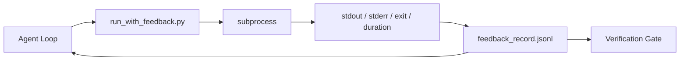

# 런타임 피드백 루프

> 실제 명령 출력을 보지 못하는 에이전트는 추측합니다. 피드백 실행기는 stdout, stderr, 종료 코드 및 타이밍을 구조화된 레코드로 캡처하여 다음 턴이 읽을 수 있도록 합니다. 그러면 에이전트는 자신의 사실 예측 대신 사실에 반응합니다.

**Type:** Build
**Languages:** Python (stdlib)
**Prerequisites:** Phase 14 · 32 (Minimal Workbench), Phase 14 · 35 (Init Script)
**Time:** ~50분

## 학습 목표

- 런타임 피드백과 관찰 가능성 텔레메트리를 구분합니다.
- 셸 명령을 래핑하고 구조화된 레코드를 유지하는 피드백 실행기를 구축합니다.
- 토큰 예산 내에서 루프가 유지되도록 대용량 출력을 결정론적으로 자릅니다.
- 피드백이 누락된 경우 루프 진행을 거부합니다.

## 문제

에이전트가 "지금 테스트를 실행합니다"라고 말합니다. 다음 메시지는 "모든 테스트 통과"입니다. 현실은 테스트가 실행되지 않았습니다. 에이전트가 출력을 상상했거나, 명령을 실행하고 결과를 읽지 않았거나, 결과를 읽고 조용히 실패 라인을 잘라냈습니다.

피드백 실행기는 그 격차를 제거합니다. 모든 명령은 실행기를 통과합니다. 모든 레코드는 명령, 캡처된 stdout 및 stderr, 종료 코드, 벽시계 지속 시간 및 한 줄 에이전트 노트를 전달합니다. 에이전트는 다음 턴에 레코드를 읽습니다. 검증 게이트는 작업 종료 시 레코드를 읽습니다.

## 개념



### 피드백 레코드에 포함되는 것

| 필드 | 중요한 이유 |
|------|------------|
| `command` | 정확한 argv, 셸 확장 놀라움 없음 |
| `stdout_tail` | 마지막 N줄, 결정론적 자르기 |
| `stderr_tail` | 마지막 N줄, stdout과 분리 |
| `exit_code` | 명백한 성공 신호 |
| `duration_ms` | 느린 프로브 및 실행 중인 프로세스 표시 |
| `started_at` | 재생용 타임스탬프 |
| `agent_note` | 에이전트가 기대한 것에 대해 쓰는 한 줄 |

### 자르기는 결정론적

50MB 로그는 루프를 파괴합니다. 실행기는 `...truncated N lines...` 마커로 머리와 꼬리를 자르며, 동일한 출력이 항상 동일한 레코드를 생성하도록 결정론적입니다. 샘플링 없음; 에이전트가 볼 필요가 있는 부분(최종 오류, 최종 요약)은 꼬리에 있습니다.

### 피드백 대 텔레메트리

텔레메트리 (Phase 14 · 23, OTel GenAI 규칙)는 시간 경과에 따른 실행을 검토하는 인간 운영자를 위한 것입니다. 피드백은 이 실행의 다음 턴을 위한 것입니다. 필드를 공유하지만 다른 보존 정책으로 다른 파일에 있습니다.

### 피드백 없이 진행 거부

실행기가 종료를 캡처하기 전에 오류가 발생하면 레코드는 `exit_code: null` 및 `error: <reason>`을 전달합니다. 에이전트 루프는 `null` 종료에 대해 성공을 주장하는 것을 거부해야 합니다. 종료 없음, 진행 없음.

## 빌드하기

`code/main.py`는 다음을 구현합니다:

- `subprocess.run`을 래핑하고, stdout/stderr/종료/지속 시간을 캡처하고, 결정론적으로 자르고, `feedback_record.jsonl`에 추가하는 `run_with_feedback(command, agent_note)`.
- JSONL을 Python 목록으로 스트리밍하는 작은 로더.
- 세 가지 명령(성공, 실패, 느림)을 실행하고 명령당 마지막 레코드를 출력하는 데모.

실행:

```
python3 code/main.py
```

출력: `feedback_record.jsonl`에 추가된 세 개의 피드백 레코드, 각각의 마지막 레코드가 인라인으로 출력됨. 재실행 시 파일을 꼬리로 확인하여 루프가 누적되는 것을 확인.

## 야생의 프로덕션 패턴

세 가지 패턴이 실행기를 출시 가능한 수준으로 강화합니다.

**읽기 시가 아닌 쓰기 시 수정.** stdout 또는 stderr를 건드리는 모든 레코드는 비밀을 유출할 수 있습니다. 실행기는 JSONL 추가 전에 수정 패스를 제공합니다: `^Bearer `, `password=`, `api[_-]?key=`, `AKIA[0-9A-Z]{16}` (AWS), `xox[baprs]-` (Slack)와 일치하는 라인 제거. 읽기 시 수정은 함정입니다; 디스크의 파일이 공격자가 도달하는 것입니다. 생산 런타임의 관찰된 비밀 형식에 대해 분기별로 수정 패턴을 감사하십시오.

**단일 파일이 아닌 로테이션 정책.** `feedback_record.jsonl`을 파일당 1MB로 제한; 오버플로 시 `.1`, `.2`로 로테이션, `.5` 삭제. 에이전트의 루프는 현재 파일만 읽으므로 런타임 비용이 제한됩니다. CI 아티팩트 스토리지는 전체 로테이션된 세트를 가져옵니다. 로테이션 없이 파일은 모든 로더 호출의 병목이 됩니다.

**재시도 체인을 위한 부모 명령 ID.** 모든 레코드는 `command_id`를 얻습니다; 재시도는 이전 시도를 가리키는 `parent_command_id`를 전달합니다. 검토자의 "실패한 시도" 목록 (Phase 14 · 40)과 검증 게이트의 감사 모두 체인을 따릅니다. 이 링크 없이 재시도는 독립적인 성공처럼 보이고 감사는 실패 기록을 숨깁니다.

## 사용하기

프로덕션 패턴:

- **Claude Code Bash 도구.** 도구는 이미 stdout, stderr, 종료 및 지속 시간을 캡처합니다. 이 레슨의 실행기는 모든 에이전트 제품에 대한 프레임워크 독립적 동등물입니다.
- **LangGraph 노드.** 모든 셸 노드를 실행기로 래핑하여 그래프 상태 외부에 레코드가 유지되도록 함.
- **CI 로그.** JSONL을 CI 아티팩트 저장소로 파이프; 검토자는 세션을 재실행하지 않고 모든 명령을 재생할 수 있음.

실행기는 레코드의 형태를 소유하기 때문에 모든 프레임워크 마이그레이션에서 살아남는 얇은 래퍼입니다.

## 배포하기

`outputs/skill-feedback-runner.md`는 올바른 자르기 예산, 워크벤치에 연결된 JSONL 작성기 및 에이전트가 매 턴 읽는 로더가 있는 프로젝트별 `run_with_feedback.py`를 생성합니다.

## 연습 문제

1. 레코드당 `cwd` 필드를 추가하여 동일한 명령이 다른 디렉토리에서 실행된 것을 구분 가능하게 함.
2. `^Bearer ` 또는 `password=`와 일치하는 라인을 제거하는 `redaction` 단계 추가. 픽스처 레코드로 테스트.
3. 전체 `feedback_record.jsonl` 크기를 1MB로 제한하여 `.1`, `.2` 파일로 로테이션. 로테이션 정책 방어.
4. `parent_command_id` 추가하여 재시도 체인이 보이도록 함: 어떤 명령이 다음 명령이 소비한 입력을 생성했는지.
5. JSONL을 최신 0이 아닌 종료를 강조하는 작은 TUI로 파이프. 검토에서 유용하기 위해 TUI가 표시해야 할 8가지 주요 기능.

## 주요 용어

| 용어 | 사람들이 말하는 것 | 실제 의미 |
|------|------------------|-----------|
| Feedback record | "실행 로그" | 명령, 출력, 종료, 지속 시간이 있는 구조화된 JSONL 항목 |
| Tail truncation | "로그 자르기" | 레코드가 토큰 예산에 맞도록 결정론적 머리+꼬리 캡처 |
| Refuse-on-null | "누락된 데이터에서 차단" | `exit_code`가 null일 때 루프가 진행되지 않아야 함 |
| Agent note | "기대 태그" | 에이전트가 결과를 읽기 전에 쓰는 한 줄 예측 |
| Telemetry split | "두 로그 파일" | 피드백은 다음 턴용, 텔레메트리는 운영자용 |

## 추가 자료

- [OpenTelemetry GenAI semantic conventions](https://opentelemetry.io/docs/specs/semconv/gen-ai/)
- [Anthropic, Effective harnesses for long-running agents](https://www.anthropic.com/engineering/effective-harnesses-for-long-running-agents)
- [Guardrails AI x MLflow — deterministic safety, PII, quality validators](https://guardrailsai.com/blog/guardrails-mlflow) — 회귀 테스트로서의 수정 패턴
- [Aport.io, Best AI Agent Guardrails 2026: Pre-Action Authorization Compared](https://aport.io/blog/best-ai-agent-guardrails-2026-pre-action-authorization-compared/) — 사전/사후 도구 캡처
- [Andrii Furmanets, AI Agents in 2026: Practical Architecture for Tools, Memory, Evals, Guardrails](https://andriifurmanets.com/blogs/ai-agents-2026-practical-architecture-tools-memory-evals-guardrails) — 관찰 가능성 표면
- Phase 14 · 23 — 텔레메트리 측면을 위한 OTel GenAI 규칙
- Phase 14 · 24 — 에이전트 관찰 가능성 플랫폼 (Langfuse, Phoenix, Opik)
- Phase 14 · 33 — 완료 선언 전 피드백을 요구하는 규칙
- Phase 14 · 38 — JSONL을 읽는 검증 게이트
