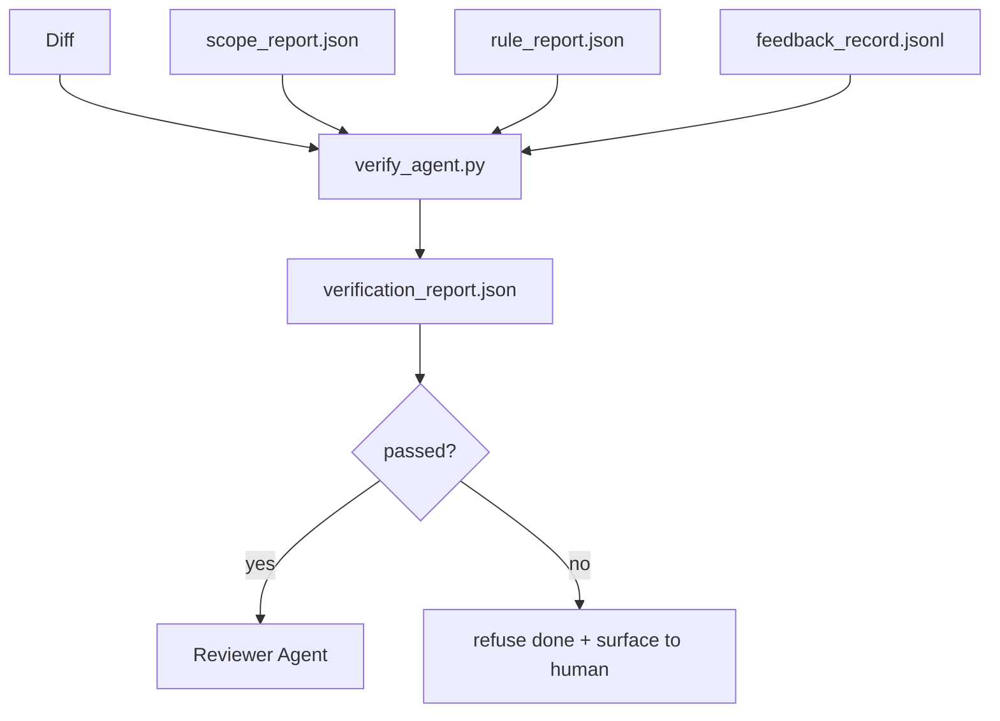

# 검증 게이트

> 에이전트가 자신의 작업을 완료된 것으로 표시할 수 없습니다. 검증 게이트는 범위 계약, 피드백 로그, 규칙 보고서 및 diff를 읽고 단일 질문에 답합니다: 이 작업이 실제로 완료되었는가? 게이트가 아니라고 말하면 채팅이 뭐라고 말하든 작업은 완료되지 않은 것입니다.

**Type:** Build
**Languages:** Python (stdlib)
**Prerequisites:** Phase 14 · 33 (Rules), Phase 14 · 36 (Scope), Phase 14 · 37 (Feedback)
**Time:** ~55분

## 학습 목표

- 검증 게이트를 워크벤치 아티팩트에 대한 결정론적 함수로 정의합니다.
- 규칙 보고서, 범위 보고서, 피드백 레코드 및 diff를 단일 판정으로 결합합니다.
- 검토자 에이전트와 CI가 모두 읽을 수 있는 `verification_report.json`을 생성합니다.
- 예외 없이 block-심각도 실패 시 작업 진행을 거부합니다.

## 문제

에이전트는 너무 쉽게 성공을 선언합니다. 세 가지 실패 형태가 지배적입니다:

- "괜찮아 보입니다." 모델이 자신의 diff를 읽고 올바르다고 결정했습니다.
- "테스트 통과." 확신을 가지고 말합니다. 테스트가 실제로 실행된 기록은 없습니다.
- "승인 충족." 승인 기준이 "완료와 비슷한 것"을 의미할 만큼 느슨하게 해석되었습니다.

워크벤치 해결책은 에이전트가 이미 생성한 아티팩트를 읽고 결정을 내리는 단일 검증 게이트입니다. 게이트는 결정론적입니다. 게이트는 버전 관리에 있습니다. 게이트는 CI에 연결됩니다. 에이전트가 게이트를 매수할 수 없습니다.

## 개념



### 게이트가 확인하는 것

| 검사 | 소스 아티팩트 | 심각도 |
|------|--------------|--------|
| 모든 승인 명령이 실행됨 | `feedback_record.jsonl` | block |
| 모든 승인 명령이 0으로 종료됨 | `feedback_record.jsonl` | block |
| 범위 검사에 금지된 쓰기 없음 | `scope_report.json` | block |
| 범위 검사에 범위 외 쓰기 없음 | `scope_report.json` | block or warn |
| 모든 block-심각도 규칙 통과 | `rule_report.json` | block |
| 피드백에 `null` 종료 코드 없음 | `feedback_record.jsonl` | block |
| 수정된 파일이 `scope.allowed_files`와 일치 | both | warn |

`warn` 결과는 판정에 주석을 답니다; `block` 결과는 `passed: true`를 방지합니다.

### 결정론적, 확률론적이 아님

게이트는 동일한 아티팩트 집합에 대해 매번 동일한 판정을 생성해야 합니다. LLM 판사는 사용하지 않습니다. LLM 판사는 목표가 상태가 아닌 정성적 평가인 검토자 측(Phase 14 · 39)에 속합니다.

### 하나의 보고서, 하나의 경로

게이트는 작업 종료당 하나의 `verification_report.json`을 생성하며, `outputs/verification/<task_id>.json` 아래에 작성됩니다. CI가 동일한 경로를 사용합니다. 다른 경로를 가진 여러 게이트는 진실 공급원을 분기합니다.

### 예외 없이 거부

Block-심각도 결과는 에이전트가 재정의할 수 없습니다. 오직 인간만이 기록된 `override_reason`과 `overridden_by` 사용자 ID로 재정의할 수 있습니다. 재정의는 서명된 변경이며, 에이전트 결정이 아닙니다.

## 빌드하기

`code/main.py`는 다음을 구현합니다:

- 각 입력 아티팩트에 대한 로더, 모두 로컬에서 스텁 처리되어 레슨이 자체 포함됨.
- `verify(task_id, artifacts) -> VerdictReport` 순수 함수.
- 검사별 결과와 최종 통과/실패를 보여주는 프린터.
- 세 가지 작업 시나리오가 있는 데모: 깔끔한 통과, 범위 확장, 승인 누락.

실행:

```
python3 code/main.py
```

출력: 세 개의 판정 보고서, 각각 스크립트 옆에 저장됨.

## 야생의 프로덕션 패턴

네 가지 패턴이 게이트를 "또 다른 린트 작업"에서 "결정적 우위"로 끌어올립니다.

**단일 게이트가 아닌 심층 방어.** Pre-commit 훅 → CI 상태 검사 → 사전 도구 인증 훅 → 사전 병합 게이트. 각 레이어는 결정론적이므로 한 레이어의 실패는 다음 레이어에서 잡힙니다. microservices.io의 2026년 3월 플레이북은 명시적입니다: pre-commit 훅은 우회 불가능합니다. 모델 측 스킬과 달리 에이전트가 지침을 따르는지에 의존하지 않기 때문입니다. 검증 게이트는 CI / 사전 병합 레이어에 위치합니다.

**결정론적 검사에 의한 방어, 미묘함만 모델 판사.** Anthropic의 2026년 Hybrid Norm 페어링: 검증 가능한 보상(단위 테스트, 스키마 검사, 종료 코드)은 "코드가 문제를 해결했는가?"에 답합니다 — LLM 루브릭은 "코드를 읽을 수 있고, 안전하며, 스타일에 맞는가?"에 답합니다. 게이트는 첫 번째 클래스를 실행하고 검토자(Phase 14 · 39)는 두 번째를 실행합니다. 혼합하면 신호가 붕괴됩니다.

**Slack 스레드가 아닌 서명된 재정의 로그.** 모든 재정의는 `outputs/verification/overrides.jsonl`에 행을 생성합니다: 타임스탬프, 결과 코드, 이유, 서명 사용자, 현재 HEAD 커밋. 런타임은 서명이 없는 재정의를 거부합니다; 감사 추적은 git에서 추적됩니다. 이것이 재정의 정책과 재정위 연극의 차이입니다.

**일급 검사로서의 커버리지 최소값.** `coverage_report.json`이 `coverage_floor` (기본 80%) 검사를 공급합니다. 측정된 커버리지가 최소값 아래로 떨어지거나 이전 병합의 최소값보다 1% 포인트 이상 떨어지면 게이트가 실패합니다. 이 검사 없이 에이전트는 조용히 실패하는 테스트를 삭제하고 검증 보고서는 계속 녹색으로 유지됩니다.

**`--strict` 모드는 warn을 block으로 승격.** 릴리스 브랜치, 출시 차단 PR 또는 사후 인시던트 분석의 경우 `--strict`는 모든 경고를 하드 실패로 만듭니다. 플래그는 브랜치별로 옵트인됩니다; 전역 기본값이 아닙니다. 모든 것에 strict를 적용하면 일상적인 흐름이 침식되기 때문입니다.

## 사용하기

프로덕션 패턴:

- **CI 단계.** `verify_agent` 작업이 에이전트의 최종 아티팩트에 대해 게이트를 실행. 병합 보호는 `passed: true` 없이 거부.
- **사전 핸드오프 훅.** 에이전트 런타임이 핸드오프 문서를 생성하기 전에 게이트를 호출. 녹색 판정 없음, 핸드오프 없음.
- **수동 트리아지.** 에이전트가 성공을 주장하고 인간이 의심할 때 운영자가 보고서를 읽음.

게이트는 워크벤치 흐름의 결정적 우위입니다. 다른 모든 표면은 그 상류에 있습니다.

## 배포하기

`outputs/skill-verification-gate.md`는 게이트를 특정 프로젝트에 연결합니다: 어떤 승인 명령이 게이트를 공급하는지, 어떤 규칙이 block-심각도인지, 어떤 범위 외 쓰기가 허용되는지, 재정의 감사 로그가 어떻게 저장되는지.

## 연습 문제

1. `coverage_floor` 검사 추가: 테스트 명령이 최소 80%의 커버리지 보고서를 생성해야 함. 최소값을 전달하는 아티팩트 결정.
2. 모든 `warn`을 `block`으로 승격하는 `--strict` 모드 지원. strict 모드가 올바른 기본값인 경우 문서화.
3. 게이트가 JSON 외에 Markdown 요약도 생성하도록 함. 요약에 어떤 필드가 속하는지 방어.
4. `time_since_last_human_touch` 검사 추가: 인간 키 입력 후 60초 이내에 편집된 모든 파일은 범위 외 플래그에서 면제.
5. 제품의 실제 에이전트 diff에서 게이트 실행. 얼마나 많은 결과가 실제이고 얼마나 많은 것이 노이즈인가? 게이트가 성장해야 하는 곳은 어디인가?

## 주요 용어

| 용어 | 사람들이 말하는 것 | 실제 의미 |
|------|------------------|-----------|
| Verification gate | "멈추게 하는 검사" | 통과/실패 판정을 생성하는 워크벤치 아티팩트에 대한 결정론적 함수 |
| Block severity | "하드 실패" | `passed: true`를 방지하고 서명된 재정의가 필요한 결과 |
| Override log | "통과시킨 이유" | 이유와 사용자 ID가 있는 서명된 항목, 검토에서 감사 |
| Acceptance command | "증거" | 0 종료가 `done`의 의미인 셸 명령 |
| One report path | "진실 공급원" | `outputs/verification/<task_id>.json`, CI와 인간 모두가 사용 |

## 추가 자료

- [Anthropic, Harness design for long-running application development](https://www.anthropic.com/engineering/harness-design-long-running-apps)
- [OpenAI Agents SDK guardrails](https://platform.openai.com/docs/guides/agents-sdk/guardrails)
- [microservices.io, GenAI dev platform: guardrails](https://microservices.io/post/architecture/2026/03/09/genai-development-platform-part-1-development-guardrails.html) — pre-commit과 CI 사이의 심층 방어
- [ICMD, The 2026 Playbook for Agentic AI Ops](https://icmd.app/article/the-2026-playbook-for-agentic-ai-ops-guardrails-costs-and-reliability-at-scale-1776661990431) — 승인 게이트 사다리 (초안 → 승인 → 임계값 미만 자동)
- [Type-Checked Compliance: Deterministic Guardrails (arXiv 2604.01483)](https://arxiv.org/pdf/2604.01483) — 결정론적 게이팅의 상한으로서의 Lean 4
- [logi-cmd/agent-guardrails — merge gate spec](https://github.com/logi-cmd/agent-guardrails) — 범위 + 변이 테스트 게이트
- [Guardrails AI x MLflow](https://guardrailsai.com/blog/guardrails-mlflow) — CI 점수화기로서의 결정론적 검증기
- [Akira, Real-Time Guardrails for Agentic Systems](https://www.akira.ai/blog/real-time-guardrails-agentic-systems) — 사전/사후 도구 게이트
- Phase 14 · 27 — 프롬프트 인젝션 방어 (게이트의 적대적 쌍)
- Phase 14 · 36 — 이 게이트가 시행하는 범위 계약
- Phase 14 · 37 — 이 게이트가 점수화하는 피드백 로그
- Phase 14 · 39 — 게이트가 핸드오프하는 검토자 에이전트
