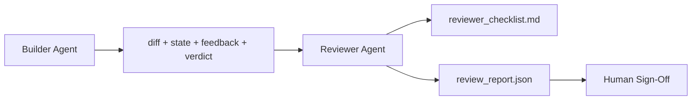

# 검토자 에이전트: 빌더와 마커 분리

> 코드를 작성한 에이전트는 그것을 채점할 수 없습니다. 검토자는 다른 시스템 프롬프트, 다른 목표 및 빌더가 생성한 모든 것에 대한 읽기 전용 액세스를 가진 두 번째 루프입니다. 빌더와 검토자 사이의 격차에 대부분의 신뢰성이 있습니다.

**Type:** Build
**Languages:** Python (stdlib)
**Prerequisites:** Phase 14 · 38 (Verification Gate)
**Time:** ~55분

## 학습 목표

- 동일한 에이전트가 자신의 작업을 안정적으로 검토할 수 없는 이유를 설명합니다.
- 빌더 아티팩트를 소비하고 구조화된 검토 보고서를 생성하는 검토자 에이전트 루프를 구축합니다.
- 특정 차원을 평가하는 검토자 루브릭을 작성합니다(분위기가 아닌).
- 인간 검토 단계가 실제 아티팩트에서 시작하도록 검토자를 워크벤치에 연결합니다.

## 문제

에이전트에게 버그를 수정하도록 요청합니다. 네 개의 파일을 편집하고, 테스트를 실행하고, 완료되었다고 보고합니다. 검증 게이트 (Phase 14 · 38)는 승인이 실행되고 범위가 유지되었음을 확인합니다. 게이트는 `passed: true`라고 말합니다. 병합합니다. 이틀 후 수정이 버그의 잘못된 절반을 해결했음을 발견합니다.

승인은 필요하지만 충분하지 않습니다. 검토자는 승인이 할 수 없는 질문을 합니다: 이것이 올바른 문제를 해결했는가? 플래그 없이 범위를 확장했는가? 의문을 제기해야 했던 가정을 문서화했는가? 워크벤치를 다음 세션이 이어받을 수 있는 상태로 두었는가?

## 개념



### 검토자 루브릭

5가지 차원, 각각 0에서 2까지 점수화.

| 차원 | 질문 |
|------|------|
| Problem fit | 변경이 명시된 대로 작업을 해결했는가, 근접한 작업이 아닌가? |
| Scope discipline | 편집이 계약에 국한되었는가 아니면 계약이 의도적으로 확장되었는가? |
| Assumptions | 모든 숨겨진 가정이 검토 가능한 곳에 기록되었는가? |
| Verification quality | 승인 명령이 실제로 목표를 증명하는가, 아니면 더 약한 버전을 증명했는가? |
| Handoff readiness | 다음 세션이 현재 상태에서 깔끔하게 이어받을 수 있는가? |

총 10점 만점. 7점 미만은 소프트 실패; 5점 미만은 하드 실패.

### 검토자는 별도 모델이 아닌 별도 역할

검토자를 빌더와 동일한 모델로 실행할 수 있습니다. 규율은 역할 분리입니다: 다른 시스템 프롬프트, 다른 입력, diff에 대한 쓰기 권한 없음. 자세의 변화가 신호의 변화입니다.

### 검토자는 diff를 편집할 수 없음

검토자는 diff, 상태, 피드백, 판정을 읽습니다. 보고서를 작성합니다. diff를 패치하지 않습니다. 보고서가 "이것을 수정하세요"라고 말하면 다음 빌더 턴이 수정을 수행합니다; 검토자는 검토로 돌아갑니다. 역할을 혼합하면 격차가 무너집니다.

### 검토자 루브릭 대 검증 게이트

게이트 (Phase 14 · 38)는 결정론적 사실을 확인합니다: 승인이 실행되었는가, 규칙이 통과되었는가, 범위가 유지되었는가. 검토자는 정성적 판단을 내립니다: 이것이 올바른 작업이었는가, 문서화되었는가, 핸드오프가 사용 가능한가. 둘 다 필요합니다.

## 빌드하기

`code/main.py`는 다음을 구현합니다:

- 검토자가 읽는 아티팩트를 묶는 `ReviewerInputs` 데이터클래스.
- 차원당 하나의 함수가 있는 루브릭 점수화기. 각 함수는 레슨을 위해 결정론적이고 스텁 등급입니다; 실제 구현은 LLM을 호출합니다.
- 5개 점수, 총점, 판정(`pass`, `soft_fail`, `hard_fail`)이 있는 `review_report.json` 작성기.
- 두 데모 케이스: 깔끔한 변경과 "올바른 테스트, 잘못된 문제" 변경.

실행:

```
python3 code/main.py
```

출력: 디스크에 작성된 두 검토 보고서와 차원 점수의 콘솔 테이블.

## 야생의 프로덕션 패턴

증거: Cloudflare의 2026년 4월 AI 코드 검토 시스템은 30일 동안 5,169개 저장소의 48,095개 병합 요청에서 131,246회 검토 실행을 처리했습니다. 중간 검토 완료 시간 3분 39초. 최대 7명의 전문 검토자(보안, 성능, 코드 품질, 문서, 릴리스 관리, 컴플라이언스, Engineering Codex)가 결과를 중복 제거하고 심각도를 판단하는 Review Coordinator 아래에서 병렬로 실행되었습니다. 최상위 모델은 coordinator 전용으로 예약; 전문가는 더 저렴한 계층에서 실행.

네 가지 패턴이 이를 규모에서 작동하게 만듭니다.

**하나의 큰 검토자가 아닌 전문가 풀.** 5차원 루브릭이 있는 하나의 검토자는 단독 저장소에 작동합니다. 코드베이스에 보안 중요, 성능 중요 및 문서 표면이 있으면 더 작은 프롬프트를 가진 전문가로 분할. Coordinator가 중복 제거를 수행; 전문가는 전체 루브릭을 실행하지 않음. 모델 계층 분리가 자연스럽게 발생: 저렴한 전문가, 비싼 coordinator.

**최적화가 아닌 설계 요구사항으로서의 편향 완화.** LLM 판사는 네 가지 신뢰할 수 있는 편향을 보여줍니다 (Adnan Masood, 2026년 4월): 위치 편향 (GPT-4가 (A,B) vs (B,A) 순서에서 ~40% 불일치), 장황함 편향 (~15% 더 긴 출력으로 점수 인플레이션), 자기 선호 (판사가 동일한 모델 제품군의 출력을 선호), 권위 (판사가 알려진 저자에 대한 참조를 과대평가). 완화: 두 순서를 모두 평가하고 일관된 승리만 계산; 간결함을 명시적으로 보상하는 1-4 척도 사용; 모델 제품군 간에 판사 순환; 점수화 전 작성자 이름 제거.

**분위기가 아닌 보정 집합.** 알려진 올바른 판정이 있는 10-20개 작업 역사 집합. 프롬프트 변경 시마다 검토자 실행. 역사적 기록과의 일치율이 80% 아래로 떨어지면 루브릭이 검토자 출시 전에 수정이 필요. 모든 팀이 결국 재발견하는 것입니다; 처음부터 시작하는 것이 좋습니다.

**게이트와의 하이브리드 규범.** 검증 게이트 (Phase 14 · 38)가 결정론적 검사(승인이 실행되었는가, 테스트가 통과되었는가, 범위가 유지되었는가)를 처리. 검토자가 의미론적 검사(이것이 올바른 작업이었는가, 가정이 문서화되었는가, 핸드오프가 사용 가능한가)를 처리. Anthropic의 2026년 지침은 이 분할에 대해 명시적입니다: 게이트가 이미 증명한 것을 검토자에게 다시 요청하지 마십시오.

## 사용하기

프로덕션 패턴:

- **Claude Code 하위 에이전트.** 검토자 하위 에이전트가 빌더가 작업을 종료한 후 실행. PR에 루브릭 점수로 코멘트를 게시.
- **OpenAI Agents SDK 핸드오프.** 빌더가 작업 완료 시 검토자에게 핸드오프. 검토자는 결과 목록을 가지고 다시 핸드오프하거나 인간에게 전달할 수 있음.
- **두 모델 페어링.** 빌더는 더 빠르고 저렴한 모델에서 실행. 검토자는 더 작은 컨텍스트로 더 강력한 모델에서 실행, 판단에 집중.

검토자는 인간이 모든 검토를 직접 할 수 없을 때 워크벤치가 키우는 두 번째 눈입니다.

## 배포하기

`outputs/skill-reviewer-agent.md`는 프로젝트별 검토자 루브릭, 빌더의 아티팩트에 연결된 검토자 에이전트 스텁 및 인간 검토가 빈 페이지 대신 작성된 보고서에서 시작하도록 검증 게이트와의 통합을 생성합니다.

## 연습 문제

1. 제품 도메인에 특화된 여섯 번째 차원 추가. 기존 5가지에 흡수되지 않는 이유 방어.
2. 두 가지 다른 시스템 프롬프트(간결함, 장황함)로 검토자 실행. 인간이 더 읽을 가능성이 높은 보고서를 생성하는 것은?
3. 차원당 `confidence` 필드 추가. 가장 낮은 차원의 신뢰도가 0.6 미만일 때 보고서 출시 거부.
4. 보정 집합 구축: 알려진 올바른 판정이 있는 10개의 역사적 작업 종료. 검토자 실행. 역사적 기록과 어디에서 불일치하는가?
5. "추가 증거 요청" 기능 추가: 검토자가 점수화 전에 빌더에게 특정 테스트 실행을 요청할 수 있음. 이것이 루프되지 않도록 하는 올바른 백오프는?

## 주요 용어

| 용어 | 사람들이 말하는 것 | 실제 의미 |
|------|------------------|-----------|
| Reviewer rubric | "체크리스트" | 차원당 하나의 작성된 질문이 있는 5차원 0-2 점수화 |
| Soft fail | "수정 필요" | 총점 7 미만; 빌더가 처리할 결과 제공 |
| Hard fail | "거부" | 총점 5 미만 또는 모든 차원이 0; 중단 및 인간에게 표면화 |
| Role separation | "다른 프롬프트" | 동일한 모델이 두 역할 모두 가능; 규율은 입력과 자세 |
| Confidence floor | "낮은 신호 보고서 출시 안 함" | 루브릭이 불확실할 때 판정 생성 거부 |

## 추가 자료

- [OpenAI Agents SDK handoffs](https://platform.openai.com/docs/guides/agents-sdk/handoffs)
- [Anthropic Claude Code subagents](https://docs.anthropic.com/en/docs/agents-and-tools/claude-code/sub-agents)
- [Cloudflare, Orchestrating AI Code Review at Scale](https://blog.cloudflare.com/ai-code-review/) — 7-전문가 + coordinator 아키텍처, 30일 131k 실행
- [Agent-as-a-Judge: Evaluating Agents with Agents (OpenReview / ICLR)](https://openreview.net/forum?id=DeVm3YUnpj) — DevAI 벤치마크, 366 계층적 솔루션 요구사항
- [Adnan Masood, Rubric-Based Evaluations and LLM-as-a-Judge: Methodologies, Biases, Empirical Validation](https://medium.com/@adnanmasood/rubric-based-evals-llm-as-a-judge-methodologies-and-empirical-validation-in-domain-context-71936b989e80) — 4가지 편향 및 완화
- [MLflow, LLM-as-a-Judge Evaluation](https://mlflow.org/llm-as-a-judge) — 분리된 빌더/평가자를 위한 프로덕션 도구
- [LangChain, How to Calibrate LLM-as-a-Judge with Human Corrections](https://www.langchain.com/articles/llm-as-a-judge) — 보정 집합 워크플로우
- [Evidently AI, LLM-as-a-judge: a complete guide](https://www.evidentlyai.com/llm-guide/llm-as-a-judge)
- [Arize, LLM as a Judge — Primer and Pre-Built Evaluators](https://arize.com/llm-as-a-judge/)
- Phase 14 · 05 — Self-Refine and CRITIC (단일 에이전트 자기 검토 기준선)
- Phase 14 · 30 — 평가 주도 에이전트 개발 (보정 집합 생성기)
- Phase 14 · 38 — 검토자가 읽는 검증 게이트
- Phase 14 · 40 — 검토자 보고서가 공급하는 핸드오프 패킷
