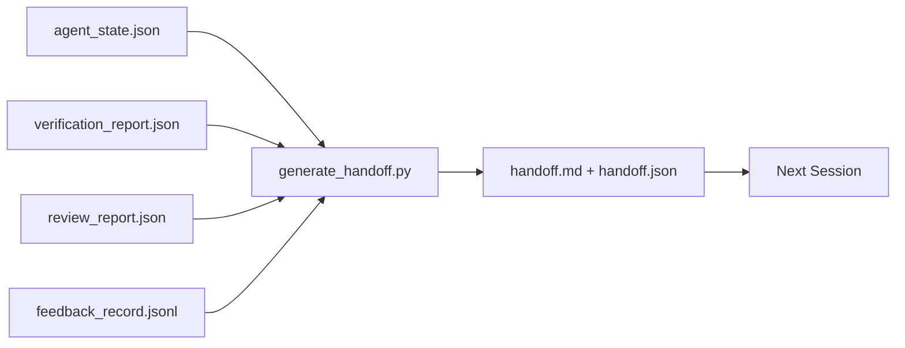

# 다중 세션 핸드오프

> 세션이 끝날 것입니다. 작업은 끝나지 않습니다. 핸드오프 패킷은 "에이전트가 1시간 동안 작업했다"를 "다음 세션이 첫 1분 안에 생산적이다"로 바꾸는 아티팩트입니다. 의도적으로 구축하십시오, 나중에 생각나는 대로가 아닙니다.

**Type:** Build
**Languages:** Python (stdlib)
**Prerequisites:** Phase 14 · 34 (Repo Memory), Phase 14 · 38 (Verification), Phase 14 · 39 (Reviewer)
**Time:** ~50분

## 학습 목표

- 모든 핸드오프 패킷이 필요한 7가지 필드를 식별합니다.
- 산문을 직접 작성하지 않고 워크벤치 아티팩트에서 핸드오프를 생성합니다.
- 큰 피드백 로그를 핸드오프 크기 요약으로 자릅니다.
- 다음 세션의 첫 번째 작업을 결정론적으로 만듭니다.

## 문제

세션이 종료됩니다. 에이전트가 "좋아요, 진전이 있었습니다"라고 말합니다. 다음 세션이 열립니다. 다음 에이전트가 "어디에서 중단했죠?"라고 묻습니다. 첫 번째 에이전트의 답변은 사라졌습니다. 다음 에이전트가 재발견하고, 동일한 명령을 다시 실행하고, 인간에게 동일한 질문을 다시 하고, 이전 세션의 마지막 30초를 복구하는 데 30분을 소모합니다.

잘못된 핸드오프의 비용은 작업 수명 동안 모든 세션에서 지불됩니다. 해결책은 세션 종료 시 자동으로 생성되는 패킷입니다: 무엇이 변경되었는지, 이유, 시도된 것, 실패한 것, 남은 것, 다음에 가장 먼저 할 일.

## 개념



### 모든 핸드오프가 전달하는 7가지 필드

| 필드 | 답하는 질문 |
|------|------------|
| `summary` | 수행된 작업에 대한 한 문단 |
| `changed_files` | 한 눈에 보는 diff |
| `commands_run` | 실제로 실행된 것 |
| `failed_attempts` | 시도된 것과 작동하지 않은 이유 |
| `open_risks` | 다음 세션을 물릴 수 있는 것, 심각도 포함 |
| `next_action` | 다음 세션이 취할 첫 번째 구체적 단계 |
| `verdict_pointer` | 검증 + 검토 보고서의 경로 |

`next_action` 필드가 하중을 지탱합니다. `next_action`을 제외한 모든 것이 있는 핸드오프는 상태 보고서이지 핸드오프가 아닙니다.

### 핸드오프는 작성되지 않고 생성됨

직접 작성된 핸드오프는 힘든 날에 건너뛰는 핸드오프입니다. 생성기는 워크벤치 아티팩트를 읽고 패킷을 생성합니다. 에이전트의 작업은 생성기가 요약할 수 있는 상태로 워크벤치를 남기는 것이지, 요약을 작성하는 것이 아닙니다.

### 두 가지 형태: 인간 판독 가능 및 기계 판독 가능

`handoff.md`는 인간이 읽는 것입니다. `handoff.json`은 다음 에이전트가 로드하는 것입니다. 둘 다 동일한 소스 아티팩트에서 옵니다. 분기되면 JSON이 승리합니다.

### 피드백 로그 자르기

전체 `feedback_record.jsonl`은 수백 개의 항목일 수 있습니다. 핸드오프는 마지막 K개와 0이 아닌 종료가 있는 모든 항목만 전달합니다. 다음 세션은 필요하면 전체 로그를 로드하지만 패킷은 작게 유지됩니다.

### 깨끗한 상태 남기기

핸드오프는 작업을 설명합니다. 깨끗한 상태는 작업을 재개 가능하게 만듭니다. 이것들은 같은 것이 아닙니다. 완벽한 `handoff.md`는 다음 세션이 반쯤 적용된 diff, 에이전트가 잊은 임시 파일, 엉뚱한 브랜치 및 실행조차 되기 전에 오류가 발생하는 테스트로 열리면 가치가 없습니다. 그러면 다음 에이전트는 구축 대신 지난 에이전트의 정리를 위해 처음 10분을 소비하며, 비용은 작업 수명 동안 매 세션 복합됩니다.

따라서 세션은 기능이 작동할 때 끝나지 않습니다. 생성기가 요약할 수 있고 다음 세션이 신뢰할 수 있는 상태로 워크벤치가 있을 때 끝납니다. 정리는 핸드오프 전에 실행되는 자체 단계이며, 습관이 아닌 검사입니다. 습관은 힘든 날에 건너뛰는 것이기 때문입니다.

| 검사 | 깨끗함의 의미 | 더러움의 차단 이유 |
|------|--------------|-------------------|
| 작업 트리 | 모든 변경이 커밋되거나 노트와 함께 명시적으로 스태시됨 | 반쯤 적용된 diff가 다음 에이전트에게 의도적인 작업처럼 보임 |
| 임시 아티팩트 | `*.tmp`, 스크래치 디렉토리, 디버그 출력 또는 주석 처리된 블록 없음 | 방치된 파일이 diff와 다음 에이전트의 멘탈 모델을 오염시킴 |
| 테스트 | 녹색, 또는 `open_risks`에 실패 이름이 지정된 빨간색 | 조용한 빨간색 테스트는 다음 세션이 밟을 함정 |
| 기능 보드 | `feature_list.json` 상태가 현실 반영 (Phase 14 · 36) | 오래된 보드는 다음 세션을 이미 완료된 작업으로 보냄 |
| 브랜치 | 예상 브랜치에 있고, 분리된 HEAD 없음, 고아 브랜치 없음 | 잘못된 브랜치는 다음 세션의 첫 번째 커밋이 잘못된 위치에 들어감 |

정리 단계는 차단 문제의 `clean_state.json`을 생성합니다; 빈 목록은 핸드오프 생성기가 패킷을 쓰기 전에 단언하는 전제 조건입니다. 더러운 트리 위에 구축된 핸드오프는 핸드오프가 아니라 전달된 엉망입니다. 두 아티팩트가 쌍을 이룹니다: 정리는 워크벤치가 떠나도 안전함을 증명하고, 핸드오프는 다음 세션이 시작할 위치를 앎을 증명합니다.

## 빌드하기

`code/main.py`는 다음을 구현합니다:

- 상태, 판정, 검토 및 피드백을 단일 `WorkbenchSnapshot`으로 수집하는 로더.
- `generate_handoff(snapshot) -> (markdown, payload)` 함수.
- 마지막 K개의 피드백 항목과 모든 0이 아닌 종료를 선택하는 필터.
- 스크립트 옆에 `handoff.md` 및 `handoff.json`을 작성하는 데모 실행.

실행:

```
python3 code/main.py
```

출력: 출력된 핸드오프 본문과 디스크의 두 파일.

## 야생의 프로덕션 패턴

Codex CLI, Claude Code 및 OpenCode는 각각 다른 컴팩션 스토리를 제공합니다; 구조화된 핸드오프 패킷은 세 가지 모두 위에 위치합니다.

**컴팩션 전략은 다양하지만 패킷 스키마는 그렇지 않습니다.** Codex CLI의 POST /v1/responses/compact는 서버 측 불투명 AES blob (OpenAI 모델의 빠른 경로); 폴백은 `_summary` 사용자 역할 메시지로 추가된 로컬 "핸드오프 요약". Claude Code는 컨텍스트의 95%에서 5단계 점진적 컴팩션을 실행. OpenCode는 타임스탬프 기반 메시지 숨김과 5-헤딩 LLM 요약을 수행. 세 가지 다른 메커니즘, 동일한 필요: 압축에서 살아남는 것을 이식 가능한 아티팩트로 직렬화. 패킷이 그 아티팩트입니다.

**신선한 세션 핸드오프는 컴팩션이 아닙니다.** 컴팩션은 세션을 확장합니다; 핸드오프는 하나를 깔끔하게 닫고 다음을 시작합니다. Hermes Issue #20372 프레이밍 (2026년 4월)이 옳습니다: 인플레이스 압축이 품질을 저하시키기 시작하면, 에이전트는 컴팩트 핸드오프를 작성하고, 세션을 종료하고, 신선한 컨텍스트에서 재개해야 합니다. 패킷이 그 전환을 저렴하게 만드는 것입니다. 실수는 품질이 붕괴될 때까지 계속 압축하는 것입니다; 해결책은 조기에 깔끔한 핸드오프를 위한 예산을 편성하는 것입니다.

**브랜치 및 주제당 하나의 활성 핸드오프.** 다중 에이전트 조정은 잘못된 모델 출력보다 오래된 핸드오프에서 더 많이 무너집니다. 항상 `branch`, `last_known_good_commit` 및 `active | superseded | archived`의 `status`를 포함하십시오. 오래된 핸드오프는 보관됩니다; 활성 핸드오프만 다음 세션을 구동합니다. 이것이 핸드오프-노트와 핸드오프-상태의 차이입니다.

**벽에서가 아닌 50-75% 컨텍스트에서 마무리.** 직접 작성 패턴 플레이북 (CLAUDE.md + HANDOVER.md)은 세션이 95% 대신 50-75% 컨텍스트 예산에서 종료될 때 최상의 결과를 보고합니다. 패킷 생성기는 압축 아티팩트가 소스 상태를 오염시키기 전에 깔끔하게 실행됩니다. 컨텍스트가 온전할 때 저렴하게 작성; 모델이 이미 위치를 잃고 있을 때 비쌉니다.

## 사용하기

프로덕션 패턴:

- **세션 종료 훅.** 사용자가 채팅을 닫을 때 런타임이 생성기를 실행. 패킷은 `outputs/handoff/<session_id>/`로 이동.
- **PR 템플릿.** 생성기의 마크다운은 PR 본문이기도 함. 검토자는 다른 5개 파일을 열지 않고 읽습니다.
- **교차 에이전트 핸드오프.** 하나의 제품(Claude Code)으로 구축, 다른 제품(Codex)으로 계속. 패킷이 공용어입니다.

패킷은 작고, 규칙적이며, 생산 비용이 저렴합니다. 비용 절감은 매 세션 복합됩니다.

## 배포하기

`outputs/skill-handoff-generator.md`는 프로젝트의 아티팩트 경로에 맞춰진 생성기, 이를 실행하는 종료 훅 및 다음 에이전트가 시작 시 읽는 `handoff.json` 스키마를 생성합니다.

## 연습 문제

1. 빌더가 기록했지만 검토자가 1 이상으로 점수화하지 않은 모든 가정을 표시하는 `assumptions_to_validate` 필드 추가.
2. 실패 실행 대 통과 실행에 대해 피드백 요약을 다르게 자름. 비대칭성 방어.
3. "인간을 위한 질문" 목록 포함. 질문이 패킷에 들어가는 임계값 대 채팅 메시지로 가는 임계값은?
4. 생성기를 멱등적으로 만듦: 두 번 실행하면 동일한 패킷 생성. 이를 위해 안정적인 것이 필요한 것은?
5. 다음 세션이 행동하기 전에 로드해야 할 아티팩트를 정확히 나열하는 "다음 세션 전제 조건" 섹션 추가.

## 주요 용어

| 용어 | 사람들이 말하는 것 | 실제 의미 |
|------|------------------|-----------|
| Handoff packet | "세션 요약" | 7가지 필드를 전달하는 생성된 아티팩트, 마크다운 및 JSON 모두 |
| Next action | "먼저 할 일" | 다음 세션을 시작하는 하나의 구체적 단계 |
| Feedback trim | "로그 요약" | 마지막 K 레코드 + 모든 0이 아닌 종료 |
| Status report | "한 일" | `next_action`이 누락된 문서; 유용하지만 핸드오프는 아님 |
| Verdict pointer | "영수증" | 추적 가능성을 위한 검증 + 검토 보고서의 경로 |

## 추가 자료

- [Anthropic, Effective harnesses for long-running agents](https://www.anthropic.com/engineering/effective-harnesses-for-long-running-agents)
- [OpenAI Agents SDK handoffs](https://platform.openai.com/docs/guides/agents-sdk/handoffs)
- [Codex Blog, Codex CLI Context Compaction: Architecture, Configuration, Managing Long Sessions](https://codex.danielvaughan.com/2026/03/31/codex-cli-context-compaction-architecture/) — POST /v1/responses/compact 및 로컬 폴백
- [Justin3go, Shedding Heavy Memories: Context Compaction in Codex, Claude Code, OpenCode](https://justin3go.com/en/posts/2026/04/09-context-compaction-in-codex-claude-code-and-opencode) — 3개 벤더 컴팩션 비교
- [JD Hodges, Claude Handoff Prompt: How to Keep Context Across Sessions (2026)](https://www.jdhodges.com/blog/ai-session-handoffs-keep-context-across-conversations/) — CLAUDE.md + HANDOVER.md, 50-75% 컨텍스트 예산
- [Mervin Praison, Managing Handoffs in Multi-Agent Coding Sessions: Fresh Context Without Losing Continuity](https://mer.vin/2026/04/managing-handoffs-in-multi-agent-coding-sessions-fresh-context-without-losing-continuity/) — 분산 시스템 프레이밍
- [Hermes Issue #20372 — automatic fresh-session handoff when compression becomes risky](https://github.com/NousResearch/hermes-agent/issues/20372)
- [Hermes Issue #499 — Context Compaction Quality Overhaul](https://github.com/NousResearch/hermes-agent/issues/499) — Codex CLI의 핸드오프 지향 프롬프트
- [Microsoft Agent Framework, Compaction](https://learn.microsoft.com/en-us/agent-framework/agents/conversations/compaction)
- [OpenCode, Context Management and Compaction](https://deepwiki.com/sst/opencode/2.4-context-management-and-compaction)
- [LangChain, Context Engineering for Agents](https://www.langchain.com/blog/context-engineering-for-agents)
- Phase 14 · 34 — 생성기가 읽는 상태 파일
- Phase 14 · 38 — 패킷이 가리키는 검증 판정
- Phase 14 · 39 — 패킷에 번들된 검토자 보고서
