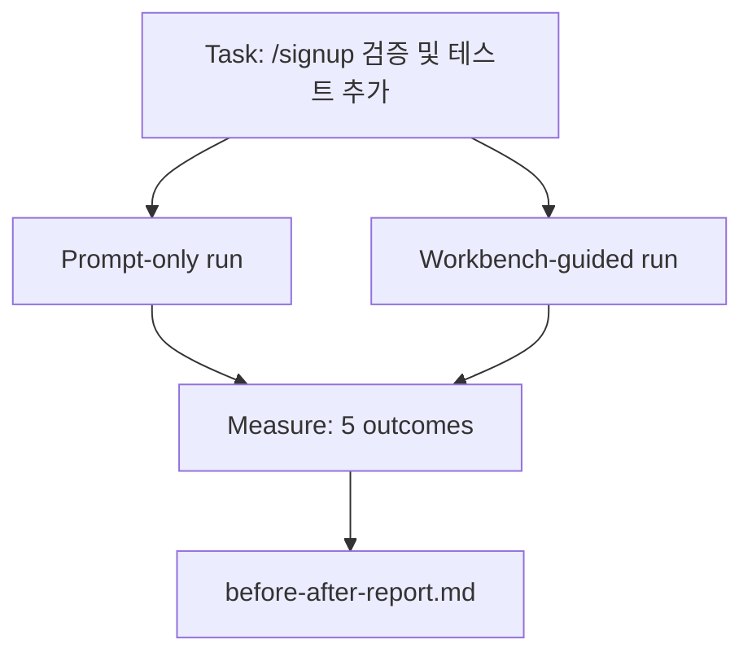

# 실제 저장소의 워크벤치

> 11개의 표면 레슨은 실제 코드베이스와의 접촉에서 살아남지 못하면 가치가 없습니다. 이 레슨은 작은 샘플 앱에서 동일한 작업을 두 번 실행합니다: 프롬프트 전용 대 워크벤치 기반. 숫자가 증명합니다.

**Type:** Build
**Languages:** Python (stdlib)
**Prerequisites:** Phases 14 · 32 to 14 · 40
**Time:** ~60분

## 학습 목표

- 작은 애플리케이션에서 7가지 워크벤치 표면을 함께 가져옵니다.
- 동일한 작업을 두 번(프롬프트 전용 및 워크벤치 기반) 실행하고 5가지 결과를 측정합니다.
- 전후 보고서를 읽고 어떤 표면이 가장 큰 레버리지를 주었는지 결정합니다.
- "하지만 내 모델은 충분히 좋아요"라는 반박에 대해 워크벤치를 방어합니다.

## 문제

장난감 작업의 데모는 아무도 설득하지 못합니다. 워크벤치에 대한 사례는 실제 같은 저장소의 실제 같은 작업이 더 적은 실패, 더 적은 롤백 및 다음 세션이 사용할 수 있는 패킷으로 프로덕션에 도달할 때 만들어집니다.

이 레슨은 실제 같은 저장소를 제공하고 두 파이프라인을 통해 동일한 작업을 실행합니다. 결과는 회의론자에게 건넬 수 있는 전후 보고서입니다.

## 개념



### 샘플 앱

`sample_app/`의 최소 FastAPI 스타일 핸들러:

- `/signup`이 있는 `app.py` (아직 검증 없음).
- 하나의 해피 패스 테스트가 있는 `test_app.py`.
- 금지 구역 미끼로서의 `README.md` 및 `scripts/release.sh`.

### 작업

> `/signup`에 입력 검증 추가: 8자 미만의 비밀번호 거부, 타입 오류 봉투와 함께 422 반환. 새 동작을 증명하는 테스트 추가.

### 두 파이프라인

프롬프트 전용:

1. README 읽기.
2. `app.py` 읽기.
3. 파일 편집.
4. 완료 주장.

워크벤치 기반:

1. Init 스크립트 실행 (Lesson 35).
2. 범위 계약 읽기 (Lesson 36).
3. 상태 읽기 (Lesson 34).
4. 허용된 파일만 편집.
5. 피드백 실행기를 통해 승인 명령 실행 (Lesson 37).
6. 검증 게이트 실행 (Lesson 38).
7. 검토자 실행 (Lesson 39).
8. 핸드오프 생성 (Lesson 40).

### 측정된 5가지 결과

| 결과 | 중요한 이유 |
|------|------------|
| `tests_actually_run` | 대부분의 "테스트 통과" 주장은 검증 불가능 |
| `acceptance_met` | 목표를 증명하는 테스트가 실행된 테스트여야 함 |
| `files_outside_scope` | 범위 확장은 지배적인 조용한 실패 |
| `handoff_quality` | 다음 세션이 이에 대한 비용을 지불하거나 혜택을 받음 |
| `reviewer_total` | 게이트 위의 정성적 판단 |

## 빌드하기

`code/main.py`는 동일한 샘플 앱 픽스처에 대해 두 파이프라인을 오케스트레이션합니다. 두 파이프라인 모두 스크립트 처리(루프에 LLM 없음)되어 측정이 재현 가능합니다. 스크립트는 비교를 `before-after-report.md` 및 `comparison.json`에 작성합니다.

실행:

```
python3 code/main.py
```

출력: 파이프라인별 결과의 콘솔 테이블, 스크립트 옆에 저장된 마크다운 보고서, 차트를 원하는 사람을 위한 JSON.

## 야생의 프로덕션 패턴

회의론자의 질문은 "워크벤치가 실제로 얼마나 도움이 되는가?"입니다. 2026년 숫자는 설명보다 훨씬 더 많이 말합니다.

**동일 모델로 Terminal Bench 30위에서 5위.** LangChain의 *Anatomy of an Agent Harness* (2026년 4월): 코딩 에이전트가 하네스만 변경하여 Terminal Bench 2.0에서 30위 밖에서 5위로 도약. 동일한 모델. 다른 표면. 25계급 차이.

**Vercel 80%에서 100%로 도구 삭제.** Vercel은 에이전트 도구의 80%를 삭제하면 성공률이 80%에서 100%로 상승했다고 보고. 더 작은 도구 표면, 더 날카로운 범위, 실패할 방법 감소. 부정적 공간이 승리.

**Harvey 하네스만으로 정확도 2배.** 법률 에이전트가 모델 변경 없이 하네스 최적화를 통해 정확도를 두 배 이상 향상.

**엔터프라이즈 AI 에이전트 프로젝트의 88%가 프로덕션 도달 실패.** preprints.org의 *Harness Engineering for Language Agents* 논문 (2026년 3월)은 실패를 추론이 아닌 런타임으로 추적: 오래된 상태, 취약한 재시도, 과도하게 성장한 컨텍스트, 중간 실패로부터의 빈약한 복구.

**장기 컨텍스트 붕괴.** WebAgent 기준 40-50% 성공이 장기 컨텍스트 조건에서 10% 미만으로 떨어짐, 주로 무한 루프와 목표 상실. Ralph Loop와 핸드오프 패킷이 이를 흡수하기 위해 존재.

**여전히 거짓 음성 존재.** 단일 단계 사실 작업, 한 줄 린트, 포맷터 실행, 모델이 문자 그대로 암기한 모든 것 — 이러한 것은 프롬프트 전용이 더 빠름. 벤치마크는 정직하게 열거하여 워크벤치가 과잉으로 프레이밍되지 않도록 해야 함.

핵심은 "하네스가 영원히 승리한다"가 아닙니다. 모델은 시간이 지남에 따라 하네스 트릭을 흡수합니다. 핵심은 오늘날 엔지니어링 부하가 7가지 표면에 있으며 숫자가 그것을 증명한다는 것입니다.

## 사용하기

이 레슨은 다음과 같은 경우 인용하는 사례 파일입니다:

- 누군가 모든 PR이 `agent-rules.md`와 범위 계약을 전달하는 이유를 물을 때.
- 팀이 "이번 스프린트만" 검증 게이트를 제거하려 할 때.
- 새 에이전트 제품이 출시되고 실제로 시간을 절약하는지 여부에 대한 이식 가능한 벤치마크가 필요할 때.

숫자는 설명보다 더 멀리 갑니다.

## 배포하기

`outputs/skill-workbench-benchmark.md`는 모든 에이전트 제품을 프로젝트 자체 샘플 앱에 대해 두 파이프라인으로 실행하고 5가지 결과를 보고하는 이식 가능한 평가 하네스입니다.

## 연습 문제

1. 여섯 번째 결과 추가: 첫 번째 의미 있는 편집까지의 시간. 어떻게 깔끔하게 측정하는가?
2. 코드베이스의 실제 두 번째 날 작업에서 비교 실행. 워크벤치 숫자가 어디에서 미끄러지는가?
3. "거짓 음성" 패스 추가: 프롬프트 전용이 더 빨랐을 작업과 워크벤치 오버헤드가 실제 비용인 경우. 그래도 워크벤치 유지 방어.
4. 스크립트된 "에이전트"를 실제 LLM 호출로 대체. 어떤 결과가 더 노이즈가 생기는가?
5. 비엔지니어를 대상으로 한 한 페이지 요약 작성. 무엇이 컷을 통과하는가?

## 주요 용어

| 용어 | 사람들이 말하는 것 | 실제 의미 |
|------|------------------|-----------|
| Sample app | "장난감 저장소" | 7가지 표면을 모두 실행할 수 있을 만큼 작지만 현실적인 저장소 |
| Pipeline | "워크플로우" | 에이전트가 따르는 표면 읽기/쓰기의 정렬된 시퀀스 |
| Before/after report | "증거" | 회의론자에게 건네는 아티팩트 |
| False negative | "워크벤치 과잉" | 프롬프트 전용이 더 빠른 작업; 정직하게 열거하는 것이 유용 |
| Workbench benchmark | "신뢰성 점수" | 코드베이스에서 비교를 실행하는 이식 가능한 하네스 |

## 추가 자료

- [LangChain, The Anatomy of an Agent Harness](https://blog.langchain.com/the-anatomy-of-an-agent-harness/) — Terminal Bench 30위→5위 증거
- [MongoDB, The Agent Harness: Why the LLM Is the Smallest Part of Your Agent System](https://www.mongodb.com/company/blog/technical/agent-harness-why-llm-is-smallest-part-of-your-agent-system) — Vercel + Harvey 숫자
- [preprints.org, Harness Engineering for Language Agents](https://www.preprints.org/manuscript/202603.1756) — 88% 엔터프라이즈 실패율, 런타임 근본 원인
- [HN: Improving 15 LLMs at Coding in One Afternoon. Only the Harness Changed](https://news.ycombinator.com/item?id=46988596) — 15개 모델에서 복제
- [Cloudflare, Orchestrating AI Code Review at Scale](https://blog.cloudflare.com/ai-code-review/) — 30일 프로덕션 131k 검토 실행
- [Anthropic, Building Effective Agents](https://www.anthropic.com/research/building-effective-agents)
- Phases 14 · 32 to 14 · 40 — 이 레슨이 종단간 실행하는 표면
- Phase 14 · 19 — 이 레슨이 보완하는 매크로 벤치마크로서의 SWE-bench, GAIA, AgentBench
- Phase 14 · 30 — 동일한 하네스가 연결되는 평가 주도 에이전트 개발
