# 통신 프로토콜

> 같은 언어를話すことができない 에이전트는 팀이 아닙니다. 허공에 외치는 낯선 사람들입니다.

**유형:** 실습
**언어:** TypeScript
**선수 과목:** Phase 14 (Agent Engineering), Lesson 16.01 (Why Multi-Agent)
**소요 시간:** ~120분

## 학습 목표

- 에이전트가 외부 서버가 노출한 툴을 사용할 수 있도록 MCP 툴 검색 및 호출을 구현
- 에이전트가 HTTP를 통해 다른 에이전트에 작업을 위임할 수 있는 A2A 에이전트 카드와 작업 엔드포인트를 구축
- MCP (툴 액세스), A2A (에이전트-투-에이전트), ACP (기업 감사), ANP (분산 신뢰)를 비교하고 어떤 프로토콜이 어떤 문제를 해결하는지 설명
- 에이전트가 MCP를 통해 툴을 검색하고 A2A를 통해 작업을 위임하는 통합 시스템에서 여러 프로토콜을 함께 연결

## 문제

시스템을 여러 에이전트로 분할했습니다. 연구자, 코더, 리뷰어. 개별 작업에서는 훌륭합니다. 하지만 이제 실제로 서로 대화해야 합니다.

첫 번째 시도很明显: 문자열을 주고받습니다. 研究자가 텍스트Blob을 반환하고, 코더가 어떻게든 파싱합니다. 코더가 研究 요약을 오해하거나, 두 에이전트가 서로 기다리며 교착상태에 빠지거나, 다른 팀이 구축한 에이전트를 협업해야 할 때까지는 작동합니다. 갑자기 "그냥 문자열 전달"이 무너집니다.

이것이 통신 프로토콜 문제입니다. 에이전트가 정보를 교환하는 방법에 대한 공유 계약이 없으면, 멀티에이전트 시스템은 다루기 어렵고 감사 불가능하며 손으로 직접 쓴 소수의 에이전트를 넘어 확장할 수 없습니다.

AI 생태계는 네 가지 프로토콜로 응답했습니다, 각각이 문제의 다른 조각을 해결합니다:

- **MCP** 툴 액세스용
- **A2A** 에이전트-투-에이전트 협업용
- **ACP** 기업 감사 가능성용
- **ANP** 분산 ID 및 신뢰용

이 레슨은 깊이 들어갑니다. 각 스펙의 실제 와이어 형식을 읽고, 작동하는 구현을 구축하고, 네 가지를 통합 시스템으로 연결합니다.

## 개념

### 프로토콜 환경

이 네 가지 프로토콜을 레이어로 생각하면, 각각이 다른 질문에 addressing합니다:

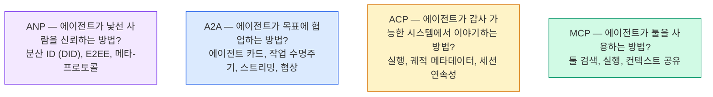

它们不是竞争对手。它们解决不同层面的不同问题。

### MCP (요약)

MCP는 Phase 13에서 자세히 다루었습니다. 빠른 요약: MCP는 LLM이 외부 툴과 데이터 소스에 연결하는 방법을 표준화합니다. 에이전트 (클라이언트)가 서버가 노출한 툴을 검색하고 호출하는 **클라이언트-서버** 프로토콜입니다.

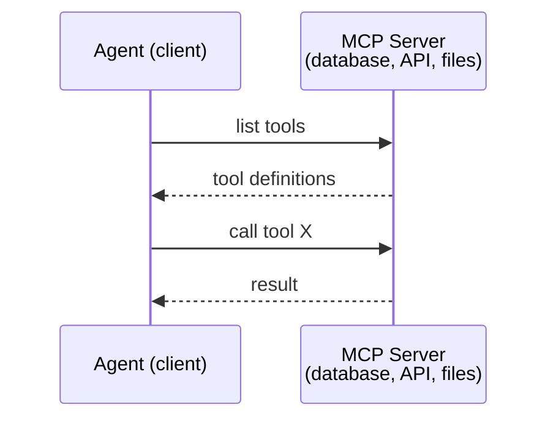

MCP는 **에이전트-투-툴** 통신입니다. 에이전트들이 서로 대화하는 데는 도움이 되지 않습니다.

### A2A (Agent2Agent Protocol)

**생성자:** Google (지금은 `lf.a2a.v1`으로 Linux Foundation 산하)
**스펙 버전:** 1.0.0
**문제:** 자율 에이전트들이 서로 작업을 협업, 협상, 위임하는 방법은?

A2A는 **피어투피어 에이전트 협업**을 위한 프로토콜입니다. MCP가 에이전트를 도구에 연결하는 곳에서, A2A는 에이전트를 다른 에이전트에 연결합니다. 각 에이전트는 well-known URL에서 **에이전트 카드**를 게시하고, 다른 에이전트들이 검색, 협상, 작업을 위임합니다.

#### A2A 작동 방식

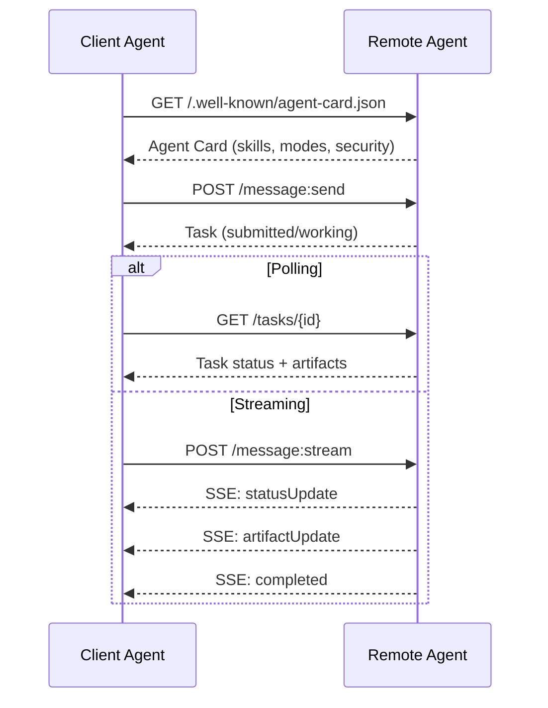

#### 실제 에이전트 카드

이것이 실제로 보이는 A2A 에이전트 카드입니다. `GET /.well-known/agent-card.json`에서 제공됩니다:

```json
{
  "name": "Research Agent",
  "description": "Searches documentation and summarizes findings",
  "version": "1.0.0",
  "supportedInterfaces": [
    {
      "url": "https://research-agent.example.com/a2a/v1",
      "protocolBinding": "JSONRPC",
      "protocolVersion": "1.0"
    },
    {
      "url": "https://research-agent.example.com/a2a/rest",
      "protocolBinding": "HTTP+JSON",
      "protocolVersion": "1.0"
    }
  ],
  "provider": {
    "organization": "Your Company",
    "url": "https://example.com"
  },
  "capabilities": {
    "streaming": true,
    "pushNotifications": false
  },
  "defaultInputModes": ["text/plain", "application/json"],
  "defaultOutputModes": ["text/plain", "application/json"],
  "skills": [
    {
      "id": "web-research",
      "name": "Web Research",
      "description": "Searches the web and synthesizes findings",
      "tags": ["research", "search", "summarization"],
      "examples": ["Research the latest changes in React 19"]
    },
    {
      "id": "doc-analysis",
      "name": "Documentation Analysis",
      "description": "Reads and analyzes technical documentation",
      "tags": ["docs", "analysis"],
      "inputModes": ["text/plain", "application/pdf"],
      "outputModes": ["application/json"]
    }
  ],
  "securitySchemes": {
    "bearer": {
      "httpAuthSecurityScheme": {
        "scheme": "Bearer",
        "bearerFormat": "JWT"
      }
    }
  },
  "security": [{ "bearer": [] }]
}
```

주목할 주요 사항:
- **스킬**은 에이전트가 할 수 있는 일입니다. 각 스킬에는 ID, 태그, 지원 입력/출력 MIME 타입이 있습니다. 이것은 클라이언트 에이전트가 이 원격 에이전트가 요청을 처리할 수 있는지 결정하는 방법입니다.
- **supportedInterfaces**는複数の 프로토콜 바인딩을 나열합니다. 단일 에이전트가 동시에 JSON-RPC, REST, gRPC를 말할 수 있습니다.
- **보안**이 카드에内置됩니다. 클라이언트는 단일 요청 전에 어떤 인증이 필요한지 알고 있습니다.

#### 작업 수명주기

작업은 A2A의 핵심 작업 단위입니다. 정의된 상태를 통해 이동합니다:

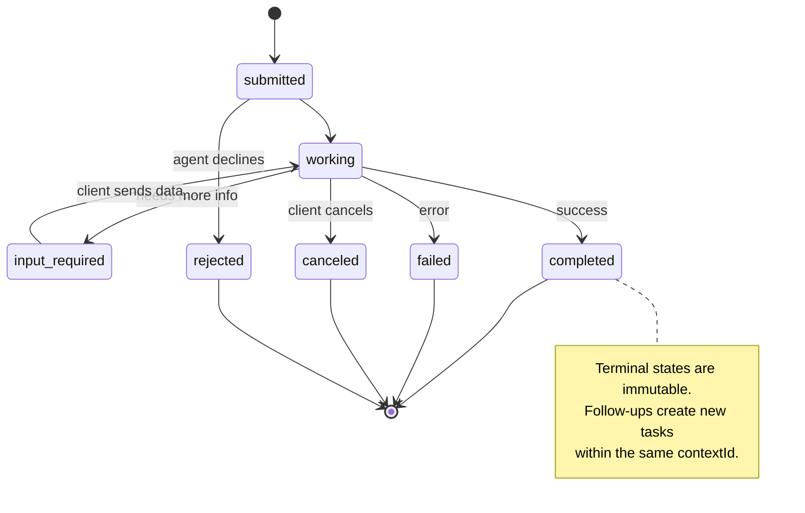

8개 상태 모두 (스펙은 또한 UNSPECIFIED를sentineとして定義, 여기서는 생략):

| 상태 | 종료 상태? | 의미 |
|---|---|---|
| `TASK_STATE_SUBMITTED` | 아니오 | 인정됨, 아직 처리 중이 아님 |
| `TASK_STATE_WORKING` | 아니오 | активно 처리 중 |
| `TASK_STATE_INPUT_REQUIRED` | 아니오 | 에이전트가 클라이언트로부터 더 많은 정보가 필요함 |
| `TASK_STATE_AUTH_REQUIRED` | 아니오 | 인증 필요 |
| `TASK_STATE_COMPLETED` | 예 | 성공적으로 완료됨 |
| `TASK_STATE_FAILED` | 예 | 오류로 완료됨 |
| `TASK_STATE_CANCELED` | 예 | 완료 전에 취소됨 |
| `TASK_STATE_REJECTED` | 예 | 에이전트가 작업을 거절함 |

작업이 종료 상태에 도달하면 변경 불가능합니다. 추가 메시지 없음. 후속 작업은 동일한 `contextId` 내에서 새 작업을 생성합니다.

#### 와이어 형식

A2A는 JSON-RPC 2.0을 사용합니다. 실제 메시지 교환이 어떻게 보이는지:

**클라이언트가 작업を送信합니다:**

```json
{
  "jsonrpc": "2.0",
  "id": 1,
  "method": "SendMessage",
  "params": {
    "message": {
      "messageId": "msg-001",
      "role": "ROLE_USER",
      "parts": [{ "text": "Research React 19 compiler features" }]
    },
    "configuration": {
      "acceptedOutputModes": ["text/plain", "application/json"],
      "historyLength": 10
    }
  }
}
```

**에이전트가 작업으로 응답합니다:**

```json
{
  "jsonrpc": "2.0",
  "id": 1,
  "result": {
    "task": {
      "id": "task-abc-123",
      "contextId": "ctx-xyz-789",
      "status": {
        "state": "TASK_STATE_COMPLETED",
        "timestamp": "2026-03-27T10:30:00Z"
      },
      "artifacts": [
        {
          "artifactId": "art-001",
          "name": "research-results",
          "parts": [{
            "data": {
              "findings": [
                "React 19 compiler auto-memoizes components",
                "No more manual useMemo/useCallback needed",
                "Compiler runs at build time, not runtime"
              ]
            },
            "mediaType": "application/json"
          }]
        }
      ]
    }
  }
}
```

**SSE를 통한 스트리밍:**

```text
POST /message:stream HTTP/1.1
Content-Type: application/json
A2A-Version: 1.0

data: {"task":{"id":"task-123","status":{"state":"TASK_STATE_WORKING"}}}

data: {"statusUpdate":{"taskId":"task-123","status":{"state":"TASK_STATE_WORKING","message":{"role":"ROLE_AGENT","parts":[{"text":"Searching documentation..."}]}}}}

data: {"artifactUpdate":{"taskId":"task-123","artifact":{"artifactId":"art-1","parts":[{"text":"partial findings..."}]},"append":true,"lastChunk":false}}

data: {"statusUpdate":{"taskId":"task-123","status":{"state":"TASK_STATE_COMPLETED"}}}
```

### ACP (Agent Communication Protocol)

**생성자:** IBM / BeeAI
**스펙 버전:** 0.2.0 (OpenAPI 3.1.1)
**상태:** Linux Foundation에서 A2A로 병합 중
**문제:** 에이전트가 완전한 감사 가능성, 세션 연속성, 궤적 추적으로 통신하는 방법은?

ACP는 **엔터프라이즈 프로토콜**입니다. 많은 요약이 주장하는 것과 달리, ACP는 **JSON-LD를 사용하지 않습니다**. OpenAPI를 통해 정의된 단순한 REST/JSON API입니다. 그것을 특별한 것은 **TrajectoryMetadata**입니다: 모든 에이전트 응답은 그것을 산출한 추론 단계와 툴 호출의 상세한 로그를 전달할 수 있습니다.

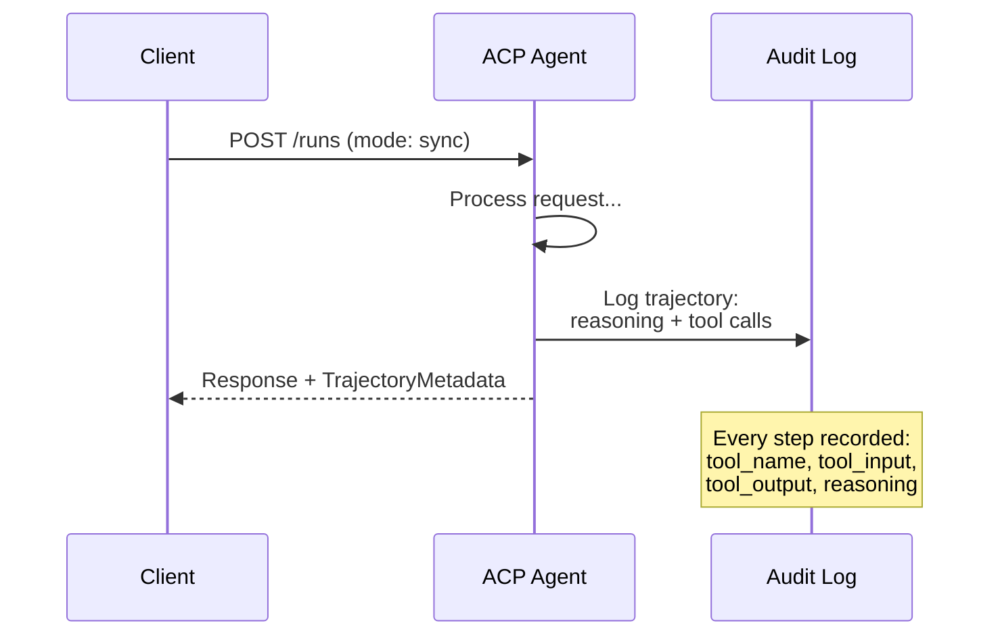

#### ACP의 에이전트 검색

ACP는 4가지 검색 방법을 정의합니다:

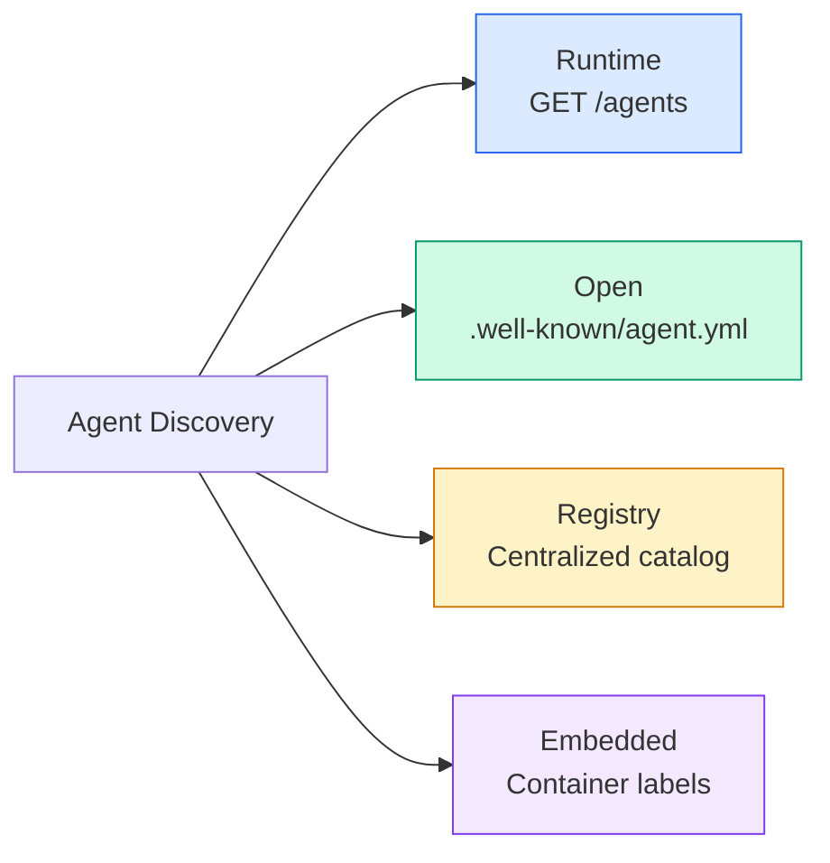

**에이전트 매니페스트**는 A2A의 에이전트 카드보다 단순합니다:

```json
{
  "name": "summarizer",
  "description": "Summarizes documents with source citations",
  "input_content_types": ["text/plain", "application/pdf"],
  "output_content_types": ["text/plain", "application/json"],
  "metadata": {
    "tags": ["summarization", "RAG"],
    "framework": "BeeAI",
    "capabilities": [
      {
        "name": "Document Summarization",
        "description": "Condenses long documents into key points"
      }
    ],
    "recommended_models": ["llama3.3:70b-instruct-fp16"],
    "license": "Apache-2.0",
    "programming_language": "Python"
  }
}
```

#### 실행 수명주기

ACP는 "작업" 대신 "실행"을 사용합니다. 실행은 세 가지 모드가 있는 에이전트 실행입니다:

| 모드 | 동작 |
|---|---|
| `sync` | 블록킹. 응답에 완전한 결과가 포함됩니다. |
| `async` | 즉시 202를 반환합니다. `GET /runs/{id}`를 폴링하여 상태를 확인합니다. |
| `stream` | SSE 스트림. 에이전트가 작업할 때 이벤트가 발생합니다. |

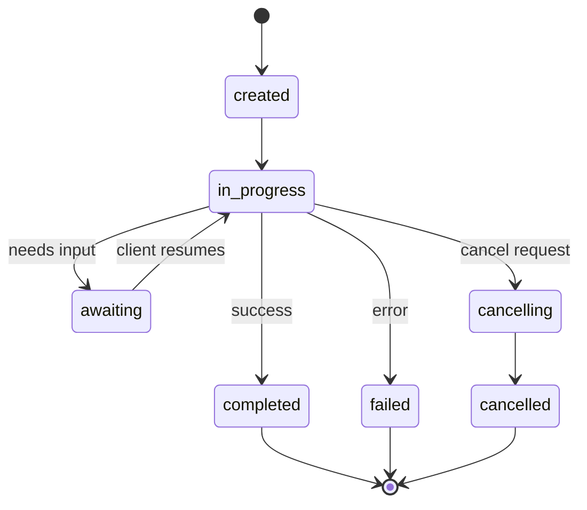

#### TrajectoryMetadata (감사 추적)

이것이 ACP의 핵심 차별화 요소입니다. 모든 메시지 파트가 에이전트가 정확히 무엇을 했는지 보여주는 메타데이터를 포함할 수 있습니다:

```json
{
  "role": "agent/researcher",
  "parts": [
    {
      "content_type": "text/plain",
      "content": "The weather in San Francisco is 72F and sunny.",
      "metadata": {
        "kind": "trajectory",
        "message": "I need to check the weather for this location",
        "tool_name": "weather_api",
        "tool_input": { "location": "San Francisco, CA" },
        "tool_output": { "temperature": 72, "condition": "sunny" }
      }
    }
  ]
}
```

규제 산업의 관점에서 이것은 황금입니다. 모든 답변에는 입증 가능한 추론 체인이 함께 제공됩니다: 어떤 툴이 호출되었는지, 어떤 입력이 사용되었는지, 어떤 출력이 수신되었는지. 블랙 박스 없음.

ACP는 소스帰属을 위한 **CitationMetadata**도 지원합니다:

```json
{
  "kind": "citation",
  "start_index": 0,
  "end_index": 47,
  "url": "https://weather.gov/sf",
  "title": "NWS San Francisco Forecast"
}
```

### ANP (Agent Network Protocol)

**생성자:** 오픈소스 커뮤니티 (GaoWei Chang이 창립)
**레포:** [github.com/agent-network-protocol/AgentNetworkProtocol](https://github.com/agent-network-protocol/AgentNetworkProtocol)
**문제:** 다른 조직의 에이전트가 중앙 권한 없이 서로 신뢰하는 방법은?

ANP는 **분산 ID 프로토콜**입니다. W3C 분산 식별자 (DID)와 종단간 암호화를 사용하여 신뢰를 구축합니다. A2A에서 에이전트를 알려진 엔드포인트를 통해 검색하는 것과 달리, ANP는 에이전트가 암호학적으로 자신의 ID를 증명할 수 있게 합니다.

ANP에는 세 레이어가 있습니다:

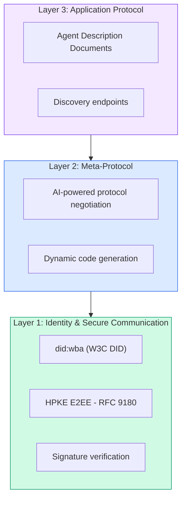

#### DID 문서 (실제 구조)

ANP는 `did:wba` (Web-Based Agent)라는 사용자 정의 DID 메서드를 사용합니다. DID `did:wba:example.com:user:alice`는 `https://example.com/user/alice/did.json`로 확인됩니다:

```json
{
  "@context": [
    "https://www.w3.org/ns/did/v1",
    "https://w3id.org/security/suites/jws-2020/v1",
    "https://w3id.org/security/suites/secp256k1-2019/v1"
  ],
  "id": "did:wba:example.com:user:alice",
  "verificationMethod": [
    {
      "id": "did:wba:example.com:user:alice#key-1",
      "type": "EcdsaSecp256k1VerificationKey2019",
      "controller": "did:wba:example.com:user:alice",
      "publicKeyJwk": {
        "crv": "secp256k1",
        "x": "NtngWpJUr-rlNNbs0u-Aa8e16OwSJu6UiFf0Rdo1oJ4",
        "y": "qN1jKupJlFsPFc1UkWinqljv4YE0mq_Ickwnjgasvmo",
        "kty": "EC"
      }
    },
    {
      "id": "did:wba:example.com:user:alice#key-x25519-1",
      "type": "X25519KeyAgreementKey2019",
      "controller": "did:wba:example.com:user:alice",
      "publicKeyMultibase": "z9hFgmPVfmBZwRvFEyniQDBkz9LmV7gDEqytWyGZLmDXE"
    }
  ],
  "authentication": [
    "did:wba:example.com:user:alice#key-1"
  ],
  "keyAgreement": [
    "did:wba:example.com:user:alice#key-x25519-1"
  ],
  "humanAuthorization": [
    "did:wba:example.com:user:alice#key-1"
  ],
  "service": [
    {
      "id": "did:wba:example.com:user:alice#agent-description",
      "type": "AgentDescription",
      "serviceEndpoint": "https://example.com/agents/alice/ad.json"
    }
  ]
}
```

주목할 주요 사항:
- **키 분리**가 적용됩니다. 서명 키 (secp256k1)는 암호화 키 (X25519)와 분리됩니다.
- **`humanAuthorization`**은 ANP에 고유합니다. 이러한 키는 사용 전 명시적 인간 승인 (생체 인식, 비밀번호, HSM)이 필요합니다. 자금 이체 같은 고위험 작업은 이 경로를 거칩니다.
- **`keyAgreement`** 키는 HPKE 종단간 암호화 (RFC 9180)에 사용됩니다.
- **서비스** 섹션은 에이전트 설명 문서를 연결합니다.

#### ANP에서 신뢰가 작동하는 방식

ANP는 웹-의-신뢰 또는 보증 그래프를 사용하지 **않습니다**. 신뢰는 대화별로 검증됩니다:

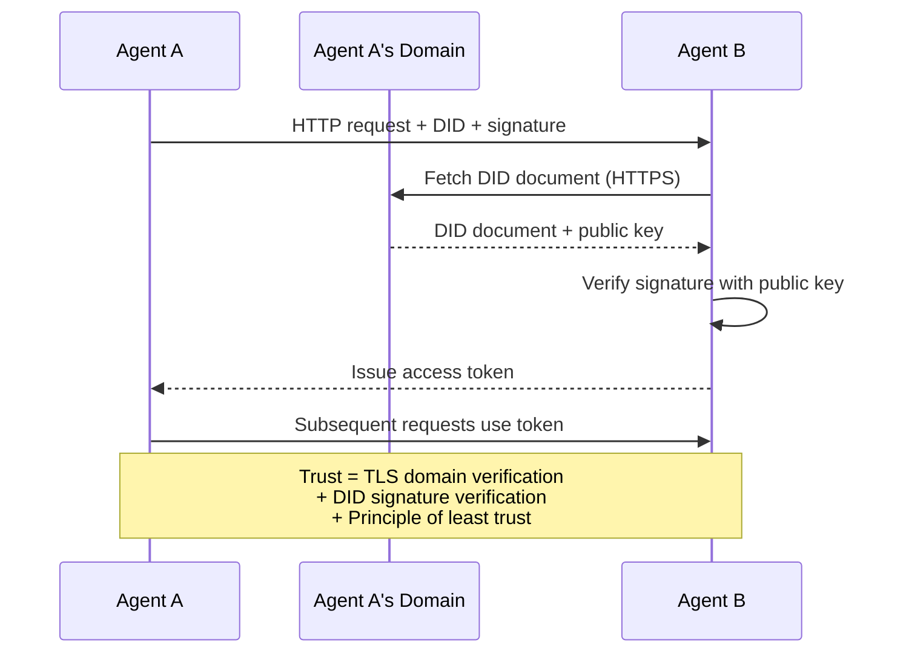

신뢰는 세 가지 소스에서 옵니다:
1. **도메인 수준 TLS**가 DID 문서 호스트를 확인합니다
2. **DID 암호화 서명**이 에이전트의 ID를 확인합니다
3. **최소 신뢰 원칙**이 최소 권한만 부여합니다

gossip 기반 신뢰 전파나 PageRank 점수 매기기가 없습니다. 각 에이전트를 그 DID를 통해 직접 확인합니다.

#### 메타-프로토콜 협상

이것은 ANP의 가장 새로운 기능입니다. 다른 생태계의 두 에이전트가 만날 때, 사전 정의된 데이터 형식이 필요하지 않습니다. 자연어로 협상합니다:

```json
{
  "action": "protocolNegotiation",
  "sequenceId": 0,
  "candidateProtocols": "I can communicate using:\n1. JSON-RPC with hotel booking schema\n2. REST with OpenAPI 3.1 spec\n3. Natural language over HTTP",
  "modificationSummary": "Initial proposal",
  "status": "negotiating"
}
```

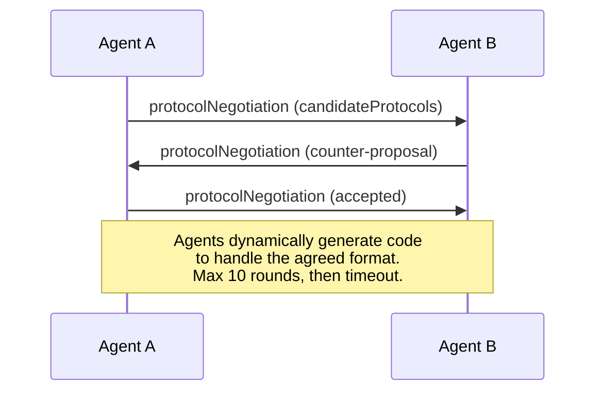

에이전트는 형식에 동의할 때까지 (최대 10 라운드)来回하고, 그 다음 처리할 코드를 동적으로 생성합니다. 상태 값: `negotiating`, `rejected`, `accepted`, `timeout`.

이것은 서로 본 적이 없는 두 에이전트가 사전 정의된 공유 스키마 없이 통신하는 방법을 알아낼 수 있음을 의미합니다.

### 비교 (수정됨)

| | MCP | A2A | ACP | ANP |
|---|---|---|---|---|
| **생성자** | Anthropic | Google / Linux Foundation | IBM / BeeAI | Community |
| **스펙 형식** | JSON-RPC | JSON-RPC / REST / gRPC | OpenAPI 3.1 (REST) | JSON-RPC |
| **주요 사용** | 에이전트 투 툴 | 에이전트 투 에이전트 | 에이전트 투 에이전트 | 에이전트 투 에이전트 |
| **검색** | 툴 목록 | `/.well-known/agent-card.json` | `GET /agents`, `/.well-known/agent.yml` | `/.well-known/agent-descriptions`, DID 서비스 엔드포인트 |
| **ID** | 암시적 (로컬) | 보안 스키마 (OAuth, mTLS) | 서버 수준 | W3C DID (`did:wba`) + E2EE |
| **감사 추적** | 해당 없음 | 기본 (작업 이력) | TrajectoryMetadata (툴 호출, 추론) | 공식으로 지정되지 않음 |
| **상태 머신** | 해당 없음 | 9개 작업 상태 | 7개 실행 상태 | 해당 없음 |
| **스트리밍** | 해당 없음 | SSE | SSE | 전송에 무관 |
| **고유 기능** | 툴 스키마 | 에이전트 카드 + 스킬 | 궤적 감사 추적 | 메타-프로토콜 협상 |
| **최고의 경우** | 툴 및 데이터 | 동적 협업 | 규제 산업 | 조직 간 신뢰 |
| **상태** | 안정적 | 안정적 (v1.0) | A2A로 병합 중 | 활발한 개발 |

### 함께 작동하는 방식

这些协议不是互斥的。一个现实的企业系统使用多个:

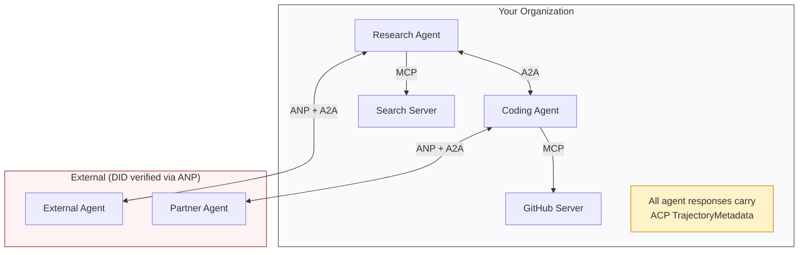

- **MCP** 각 에이전트를 해당 툴에 연결합니다
- **A2A** 에이전트 간 협업을 처리합니다 (내부 및 외부)
- **ACP** 감사 가능성을 위한 궤적 메타데이터로 응답을 래핑합니다
- **ANP** 控制하지 않는 에이전트의 ID 확인을 제공합니다

## 실습

### 단계 1: 핵심 메시지 유형

모든 멀티에이전트 시스템은 메시지 형식으로 시작합니다. 실제 프로토콜이 사용하는 유형을 매핑하는 유형을 정의합니다:

```typescript
import crypto from "node:crypto";

type MessageRole = "user" | "agent";

type MessagePart =
  | { kind: "text"; text: string }
  | { kind: "data"; data: unknown; mediaType: string }
  | { kind: "file"; name: string; url: string; mediaType: string };

type TrajectoryEntry = {
  reasoning: string;
  toolName?: string;
  toolInput?: unknown;
  toolOutput?: unknown;
  timestamp: number;
};

type AgentMessage = {
  id: string;
  role: MessageRole;
  parts: MessagePart[];
  trajectory?: TrajectoryEntry[];
  replyTo?: string;
  timestamp: number;
};

function createMessage(
  role: MessageRole,
  parts: MessagePart[],
  replyTo?: string
): AgentMessage {
  return {
    id: crypto.randomUUID(),
    role,
    parts,
    replyTo,
    timestamp: Date.now(),
  };
}

function textMessage(role: MessageRole, text: string): AgentMessage {
  return createMessage(role, [{ kind: "text", text }]);
}
```

주의: `MessagePart`는 실제 A2A 및 ACP 스펙처럼 멀티모달 (텍스트, 구조화된 데이터, 파일)입니다. `TrajectoryEntry`는 ACP의 TrajectoryMetadata와 일치하는 추론 체인을捕获합니다.

### 단계 2: A2A 에이전트 카드 및 레지스트리

실제 A2A 스펙과 일치하는 에이전트 검색을 구축합니다:

```typescript
type Skill = {
  id: string;
  name: string;
  description: string;
  tags: string[];
  inputModes: string[];
  outputModes: string[];
};

type AgentCard = {
  name: string;
  description: string;
  version: string;
  url: string;
  capabilities: {
    streaming: boolean;
    pushNotifications: boolean;
  };
  defaultInputModes: string[];
  defaultOutputModes: string[];
  skills: Skill[];
};

class AgentRegistry {
  private cards: Map<string, AgentCard> = new Map();

  register(card: AgentCard) {
    this.cards.set(card.name, card);
  }

  discoverBySkillTag(tag: string): AgentCard[] {
    return [...this.cards.values()].filter((card) =>
      card.skills.some((skill) => skill.tags.includes(tag))
    );
  }

  discoverByInputMode(mimeType: string): AgentCard[] {
    return [...this.cards.values()].filter(
      (card) =>
        card.defaultInputModes.includes(mimeType) ||
        card.skills.some((skill) => skill.inputModes.includes(mimeType))
    );
  }

  resolve(name: string): AgentCard | undefined {
    return this.cards.get(name);
  }

  listAll(): AgentCard[] {
    return [...this.cards.values()];
  }
}
```

이것은 단순한 이름-기능 맵보다 훨씬 풍부합니다. 스킬 태그, 입력 MIME 타입, 또는 이름으로 에이전트를 검색할 수 있습니다, 실제 A2A 스펙이 지원하는 것처럼.

### 단계 3: A2A 작업 수명주기

완전한 작업 상태 머신을 구축합니다:

```typescript
type TaskState =
  | "submitted"
  | "working"
  | "input-required"
  | "auth-required"
  | "completed"
  | "failed"
  | "canceled"
  | "rejected";

const TERMINAL_STATES: TaskState[] = [
  "completed",
  "failed",
  "canceled",
  "rejected",
];

type TaskStatus = {
  state: TaskState;
  message?: AgentMessage;
  timestamp: number;
};

type Artifact = {
  id: string;
  name: string;
  parts: MessagePart[];
};

type Task = {
  id: string;
  contextId: string;
  status: TaskStatus;
  artifacts: Artifact[];
  history: AgentMessage[];
};

type TaskEvent =
  | { kind: "statusUpdate"; taskId: string; status: TaskStatus }
  | {
      kind: "artifactUpdate";
      taskId: string;
      artifact: Artifact;
      append: boolean;
      lastChunk: boolean;
    };

type TaskHandler = (
  task: Task,
  message: AgentMessage
) => AsyncGenerator<TaskEvent>;

class TaskManager {
  private tasks: Map<string, Task> = new Map();
  private handlers: Map<string, TaskHandler> = new Map();
  private listeners: Map<string, ((event: TaskEvent) => void)[]> = new Map();

  registerHandler(agentName: string, handler: TaskHandler) {
    this.handlers.set(agentName, handler);
  }

  subscribe(taskId: string, listener: (event: TaskEvent) => void) {
    const existing = this.listeners.get(taskId) ?? [];
    existing.push(listener);
    this.listeners.set(taskId, existing);
  }

  async sendMessage(
    agentName: string,
    message: AgentMessage,
    contextId?: string
  ): Promise<Task> {
    const handler = this.handlers.get(agentName);
    if (!handler) {
      const task = this.createTask(contextId);
      task.status = {
        state: "rejected",
        timestamp: Date.now(),
        message: textMessage("agent", `No handler for ${agentName}`),
      };
      return task;
    }

    const task = this.createTask(contextId);
    task.history.push(message);
    task.status = { state: "submitted", timestamp: Date.now() };

    this.processTask(task, handler, message).catch((err) => {
      task.status = {
        state: "failed",
        timestamp: Date.now(),
        message: textMessage("agent", String(err)),
      };
    });
    return task;
  }

  getTask(taskId: string): Task | undefined {
    return this.tasks.get(taskId);
  }

  cancelTask(taskId: string): boolean {
    const task = this.tasks.get(taskId);
    if (!task || TERMINAL_STATES.includes(task.status.state)) return false;
    task.status = { state: "canceled", timestamp: Date.now() };
    this.emit(taskId, {
      kind: "statusUpdate",
      taskId,
      status: task.status,
    });
    return true;
  }

  private createTask(contextId?: string): Task {
    const task: Task = {
      id: crypto.randomUUID(),
      contextId: contextId ?? crypto.randomUUID(),
      status: { state: "submitted", timestamp: Date.now() },
      artifacts: [],
      history: [],
    };
    this.tasks.set(task.id, task);
    return task;
  }

  private async processTask(
    task: Task,
    handler: TaskHandler,
    message: AgentMessage
  ) {
    task.status = { state: "working", timestamp: Date.now() };
    this.emit(task.id, {
      kind: "statusUpdate",
      taskId: task.id,
      status: task.status,
    });

    try {
      for await (const event of handler(task, message)) {
        if (TERMINAL_STATES.includes(task.status.state)) break;

        if (event.kind === "statusUpdate") {
          task.status = event.status;
        }
        if (event.kind === "artifactUpdate") {
          const existing = task.artifacts.find(
            (a) => a.id === event.artifact.id
          );
          if (existing && event.append) {
            existing.parts.push(...event.artifact.parts);
          } else {
            task.artifacts.push(event.artifact);
          }
        }
        this.emit(task.id, event);
      }
    } catch (err) {
      task.status = {
        state: "failed",
        timestamp: Date.now(),
        message: textMessage("agent", String(err)),
      };
      this.emit(task.id, {
        kind: "statusUpdate",
        taskId: task.id,
        status: task.status,
      });
    }
  }

  private emit(taskId: string, event: TaskEvent) {
    for (const listener of this.listeners.get(taskId) ?? []) {
      listener(event);
    }
  }
}
```

이것은 실제 A2A 작업 수명주기를 구현합니다: submitted, working, input-required, terminal states. 핸들러는 SSE 스트리밍 모델과 일치하는 이벤트 (상태 업데이트 및 아티팩트 청크)를 산출하는 async generators입니다.

### 단계 4: ACP 스타일 감사 추적

궤적 추적으로 통신을 래핑합니다:

```typescript
type AuditEntry = {
  runId: string;
  agentName: string;
  input: AgentMessage[];
  output: AgentMessage[];
  trajectory: TrajectoryEntry[];
  status: "created" | "in-progress" | "completed" | "failed" | "awaiting";
  startedAt: number;
  completedAt?: number;
  sessionId?: string;
};

class AuditableRunner {
  private log: AuditEntry[] = [];
  private handlers: Map<
    string,
    (input: AgentMessage[]) => Promise<{
      output: AgentMessage[];
      trajectory: TrajectoryEntry[];
    }>
  > = new Map();

  registerAgent(
    name: string,
    handler: (input: AgentMessage[]) => Promise<{
      output: AgentMessage[];
      trajectory: TrajectoryEntry[];
    }>
  ) {
    this.handlers.set(name, handler);
  }

  async run(
    agentName: string,
    input: AgentMessage[],
    sessionId?: string
  ): Promise<AuditEntry> {
    const entry: AuditEntry = {
      runId: crypto.randomUUID(),
      agentName,
      input: structuredClone(input),
      output: [],
      trajectory: [],
      status: "created",
      startedAt: Date.now(),
      sessionId,
    };
    this.log.push(entry);

    const handler = this.handlers.get(agentName);
    if (!handler) {
      entry.status = "failed";
      return entry;
    }

    entry.status = "in-progress";
    try {
      const result = await handler(input);
      entry.output = structuredClone(result.output);
      entry.trajectory = structuredClone(result.trajectory);
      entry.status = "completed";
      entry.completedAt = Date.now();
    } catch (err) {
      entry.status = "failed";
      entry.trajectory.push({
        reasoning: `Error: ${String(err)}`,
        timestamp: Date.now(),
      });
      entry.completedAt = Date.now();
    }
    return entry;
  }

  getFullAuditLog(): AuditEntry[] {
    return structuredClone(this.log);
  }

  getAuditLogForAgent(agentName: string): AuditEntry[] {
    return structuredClone(
      this.log.filter((e) => e.agentName === agentName)
    );
  }

  getAuditLogForSession(sessionId: string): AuditEntry[] {
    return structuredClone(
      this.log.filter((e) => e.sessionId === sessionId)
    );
  }

  getTrajectoryForRun(runId: string): TrajectoryEntry[] {
    const entry = this.log.find((e) => e.runId === runId);
    return entry ? structuredClone(entry.trajectory) : [];
  }
}
```

모든 에이전트 실행이 완전한 감.entry를 생성합니다: 무엇이 들어갔는지, 무엇이 나왔는지, 그 사이의 툴 호출과 추론 단계의 완전한 궤적. 에이전트, 세션, 또는 개별 실행별로 查询할 수 있습니다.

### 단계 5: ANP 스타일 ID 확인

DID 기반 ID 및 확인을 구축합니다:

```typescript
type VerificationMethod = {
  id: string;
  type: string;
  controller: string;
  publicKeyDer: string;
};

type DIDDocument = {
  id: string;
  verificationMethod: VerificationMethod[];
  authentication: string[];
  keyAgreement: string[];
  humanAuthorization: string[];
  service: { id: string; type: string; serviceEndpoint: string }[];
};

type AgentIdentity = {
  did: string;
  document: DIDDocument;
  privateKey: crypto.KeyObject;
  publicKey: crypto.KeyObject;
};

class IdentityRegistry {
  private documents: Map<string, DIDDocument> = new Map();

  publish(doc: DIDDocument) {
    this.documents.set(doc.id, doc);
  }

  resolve(did: string): DIDDocument | undefined {
    return this.documents.get(did);
  }

  verify(did: string, signature: string, payload: string): boolean {
    const doc = this.documents.get(did);
    if (!doc) return false;

    const authKeyIds = doc.authentication;
    const authKeys = doc.verificationMethod.filter((vm) =>
      authKeyIds.includes(vm.id)
    );

    for (const key of authKeys) {
      const publicKey = crypto.createPublicKey({
        key: Buffer.from(key.publicKeyDer, "base64"),
        format: "der",
        type: "spki",
      });
      const isValid = crypto.verify(
        null,
        Buffer.from(payload),
        publicKey,
        Buffer.from(signature, "hex")
      );
      if (isValid) return true;
    }
    return false;
  }

  requiresHumanAuth(did: string, operationKeyId: string): boolean {
    const doc = this.documents.get(did);
    if (!doc) return false;
    return doc.humanAuthorization.includes(operationKeyId);
  }
}

function createIdentity(domain: string, agentName: string): AgentIdentity {
  const did = `did:wba:${domain}:agent:${agentName}`;
  const { publicKey, privateKey } = crypto.generateKeyPairSync("ed25519");

  const publicKeyDer = publicKey
    .export({ format: "der", type: "spki" })
    .toString("base64");

  const keyId = `${did}#key-1`;
  const encKeyId = `${did}#key-x25519-1`;

  const document: DIDDocument = {
    id: did,
    verificationMethod: [
      {
        id: keyId,
        type: "Ed25519VerificationKey2020",
        controller: did,
        publicKeyDer,
      },
      {
        id: encKeyId,
        type: "X25519KeyAgreementKey2019",
        controller: did,
        publicKeyDer,
      },
    ],
    authentication: [keyId],
    keyAgreement: [encKeyId],
    humanAuthorization: [],
    service: [
      {
        id: `${did}#agent-description`,
        type: "AgentDescription",
        serviceEndpoint: `https://${domain}/agents/${agentName}/ad.json`,
      },
    ],
  };

  return { did, document, privateKey, publicKey };
}

function signPayload(identity: AgentIdentity, payload: string): string {
  return crypto
    .sign(null, Buffer.from(payload), identity.privateKey)
    .toString("hex");
}
```

이것은 실제 ANP ID 모델을 반영합니다: 에이전트는 별도의 인증, 키 합의, 인간 승인 키가 있는 DID 문서를 가집니다. `IdentityRegistry`는 DID 확인을 시뮬레이션합니다 (프로덕션에서는 에이전트 도메인으로의 HTTP 가져오기가 됩니다).

### 단계 6: 프로토콜 게이트웨이

네 가지 프로토콜을 통합 시스템으로 연결합니다:

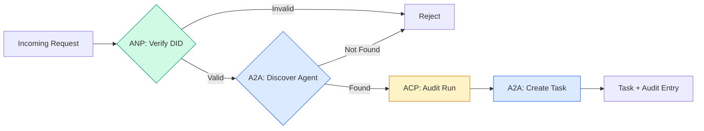

```typescript
class ProtocolGateway {
  private registry: AgentRegistry;
  private taskManager: TaskManager;
  private auditRunner: AuditableRunner;
  private identityRegistry: IdentityRegistry;

  constructor(
    registry: AgentRegistry,
    taskManager: TaskManager,
    auditRunner: AuditableRunner,
    identityRegistry: IdentityRegistry
  ) {
    this.registry = registry;
    this.taskManager = taskManager;
    this.auditRunner = auditRunner;
    this.identityRegistry = identityRegistry;
  }

  async delegateTask(
    fromDid: string,
    signature: string,
    targetAgent: string,
    message: AgentMessage,
    sessionId?: string
  ): Promise<{ task: Task; audit: AuditEntry } | { error: string }> {
    if (!this.identityRegistry.verify(fromDid, signature, message.id)) {
      return { error: "Identity verification failed" };
    }

    const card = this.registry.resolve(targetAgent);
    if (!card) {
      return { error: `Agent ${targetAgent} not found in registry` };
    }

    const audit = await this.auditRunner.run(
      targetAgent,
      [message],
      sessionId
    );
    const task = await this.taskManager.sendMessage(targetAgent, message);

    return { task, audit };
  }

  discoverAndDelegate(
    fromDid: string,
    signature: string,
    skillTag: string,
    message: AgentMessage
  ): Promise<{ task: Task; audit: AuditEntry } | { error: string }> {
    const candidates = this.registry.discoverBySkillTag(skillTag);
    if (candidates.length === 0) {
      return Promise.resolve({
        error: `No agents found with skill tag: ${skillTag}`,
      });
    }
    return this.delegateTask(
      fromDid,
      signature,
      candidates[0].name,
      message
    );
  }
}
```

게이트웨이는 하나의 호출에서 네 가지 작업을 수행합니다:
1. **ANP**: DID 서명으로 호출자의 ID를 확인합니다
2. **A2A**: 대상 에이전트를 검색하고 기능을 확인합니다
3. **ACP**: 궤적이 있는 감사 추적으로 실행을 래핑합니다
4. **A2A**: 완전한 수명주기 추적으로 작업을 생성합니다

### 단계 7: 모두 연결

```typescript
async function protocolDemo() {
  const registry = new AgentRegistry();
  registry.register({
    name: "researcher",
    description: "Searches and summarizes findings",
    version: "1.0.0",
    url: "https://researcher.local/a2a/v1",
    capabilities: { streaming: true, pushNotifications: false },
    defaultInputModes: ["text/plain"],
    defaultOutputModes: ["text/plain", "application/json"],
    skills: [
      {
        id: "web-research",
        name: "Web Research",
        description: "Searches the web",
        tags: ["research", "search", "summarization"],
        inputModes: ["text/plain"],
        outputModes: ["application/json"],
      },
    ],
  });
  registry.register({
    name: "coder",
    description: "Writes code from specs",
    version: "1.0.0",
    url: "https://coder.local/a2a/v1",
    capabilities: { streaming: false, pushNotifications: false },
    defaultInputModes: ["text/plain", "application/json"],
    defaultOutputModes: ["text/plain"],
    skills: [
      {
        id: "code-gen",
        name: "Code Generation",
        description: "Generates code",
        tags: ["coding", "generation"],
        inputModes: ["text/plain", "application/json"],
        outputModes: ["text/plain"],
      },
    ],
  });

  const taskManager = new TaskManager();
  const auditRunner = new AuditableRunner();

  const researchTrajectory: TrajectoryEntry[] = [];

  taskManager.registerHandler(
    "researcher",
    async function* (task, message) {
      yield {
        kind: "statusUpdate" as const,
        taskId: task.id,
        status: { state: "working" as const, timestamp: Date.now() },
      };

      researchTrajectory.push({
        reasoning: "Searching for React 19 documentation",
        toolName: "web_search",
        toolInput: { query: "React 19 compiler features" },
        toolOutput: {
          results: ["react.dev/blog/react-19", "github.com/react/react"],
        },
        timestamp: Date.now(),
      });

      researchTrajectory.push({
        reasoning: "Extracting key findings from search results",
        toolName: "doc_analysis",
        toolInput: { url: "react.dev/blog/react-19" },
        toolOutput: {
          summary:
            "React 19 compiler auto-memoizes, no manual useMemo needed",
        },
        timestamp: Date.now(),
      });

      yield {
        kind: "artifactUpdate" as const,
        taskId: task.id,
        artifact: {
          id: crypto.randomUUID(),
          name: "research-results",
          parts: [
            {
              kind: "data" as const,
              data: {
                findings: [
                  "React 19 compiler auto-memoizes components",
                  "No more manual useMemo/useCallback needed",
                  "Compiler runs at build time, not runtime",
                ],
                sources: ["react.dev/blog/react-19"],
              },
              mediaType: "application/json",
            },
          ],
        },
        append: false,
        lastChunk: true,
      };

      yield {
        kind: "statusUpdate" as const,
        taskId: task.id,
        status: { state: "completed" as const, timestamp: Date.now() },
      };
    }
  );

  auditRunner.registerAgent("researcher", async () => ({
    output: [
      textMessage("agent", "React 19 compiler auto-memoizes components"),
    ],
    trajectory: researchTrajectory,
  }));

  const identityRegistry = new IdentityRegistry();

  const coderIdentity = createIdentity("coder.local", "coder");
  const researcherIdentity = createIdentity("researcher.local", "researcher");

  identityRegistry.publish(coderIdentity.document);
  identityRegistry.publish(researcherIdentity.document);

  const gateway = new ProtocolGateway(
    registry,
    taskManager,
    auditRunner,
    identityRegistry
  );

  console.log("=== Protocol Demo ===\n");

  console.log("1. Agent Discovery (A2A)");
  const researchAgents = registry.discoverBySkillTag("research");
  console.log(
    `   Found ${researchAgents.length} agent(s):`,
    researchAgents.map((a) => a.name)
  );

  console.log("\n2. Identity Verification (ANP)");
  const message = textMessage("user", "Research React 19 compiler features");
  const signature = signPayload(coderIdentity, message.id);
  const verified = identityRegistry.verify(
    coderIdentity.did,
    signature,
    message.id
  );
  console.log(`   Coder DID: ${coderIdentity.did}`);
  console.log(`   Signature verified: ${verified}`);

  console.log("\n3. Task Delegation (A2A + ACP + ANP)");
  const result = await gateway.delegateTask(
    coderIdentity.did,
    signature,
    "researcher",
    message,
    "session-001"
  );

  if ("error" in result) {
    console.log(`   Error: ${result.error}`);
    return;
  }

  console.log(`   Task ID: ${result.task.id}`);
  console.log(`   Task state: ${result.task.status.state}`);
  console.log(`   Artifacts: ${result.task.artifacts.length}`);

  console.log("\n4. Audit Trail (ACP)");
  console.log(`   Run ID: ${result.audit.runId}`);
  console.log(`   Status: ${result.audit.status}`);
  console.log(`   Trajectory steps: ${result.audit.trajectory.length}`);
  for (const step of result.audit.trajectory) {
    console.log(`     - ${step.reasoning}`);
    if (step.toolName) {
      console.log(`       Tool: ${step.toolName}`);
    }
  }

  console.log("\n5. Full Audit Log");
  const fullLog = auditRunner.getFullAuditLog();
  console.log(`   Total runs: ${fullLog.length}`);
  for (const entry of fullLog) {
    const duration = entry.completedAt
      ? `${entry.completedAt - entry.startedAt}ms`
      : "in-progress";
    console.log(`   ${entry.agentName}: ${entry.status} (${duration})`);
  }
}

protocolDemo().catch((err) => {
  console.error("Protocol demo failed:", err);
  process.exitCode = 1;
});
```

## 무엇이 잘못되는가

프로토콜은 해피 패스를 해결합니다. 프로덕션에서 무엇이 망가지는지:

**스키마 드리프트.** 에이전트 A가 `application/json` 출력을 광고하는 에이전트 카드를 게시합니다. 하지만 JSON 스키마가 버전 간에 변경됩니다. 에이전트 B가 이전 형식을 파싱하고 쓰레기를 얻습니다. 수정: 스킬과 출력 스키마를 버전화하세요. A2A 스펙은 이를 위해 에이전트 카드에 `version`을 지원합니다.

**상태 머신 위반.** 에이전트 핸들러가 `completed` 이벤트를 산출한 다음 더 많은 아티팩트를 산출하려고 시도합니다. 작업은 변경 불가능합니다. 코드가 업데이트를 자동으로 삭제하거나 예외를 throw합니다. 수정: 산출하기 전에 종료 상태를 확인하세요. 위의 `TaskManager`는 종료 상태 후 `break`로 이를 적용합니다.

**신뢰 확인 실패.** 에이전트 A가 에이전트 B의 DID를 확인하려고 하지만 에이전트 B의 도메인이 다운됩니다. DID 문서를 가져올 수 없습니다. 열려서 실패합니까 (확인되지 않은 에이전트 허용) 아니면 닫아서 실패합니까 (모두 거부)? ANP는 최소 신뢰 원칙으로 닫혀서 실패할 것을 권장합니다.

**궤적 부풀림.** ACP 궤적 로깅은 강력하지만 비용이 듭니다. 실행당 200개의 툴 호출을 하는 복잡한 에이전트는 방대한 감 entry를 생성합니다. 수정: 구성 가능한 자세한程度的으로 궤적을 로깅하세요. 규정 준수을 위해 툴 이름과 IO를 기록하고, 비규제 작업에서는 추론 단계를 건너뛰세요.

**검색 천둥 무리.** 시작 시 50개의 에이전트가 모두 동시에 `GET /agents`를 查询합니다. 수정: TTL로 에이전트 카드를 캐싱하고, 검색 간격을 분리하거나, 폴링 대신 푸시 기반 등록을 사용하세요.

## 활용

### 실제 구현

**A2A**가 가장 성숙합니다. Google's [official spec](https://github.com/google/A2A)는 Linux Foundation 산하 오픈소스입니다. Python 및 TypeScript용 SDK. 에이전트에 동적 검색 및 협업이 필요하면 여기서 시작하세요.

**ACP**가 A2A로 병합 중입니다. IBM의 [BeeAI project](https://github.com/i-am-bee/acp)가 ACP를 REST 우선 대안으로 생성했지만, 궤적 메타데이터 개념이 A2A 생태계에 흡수되고 있습니다. 전송으로 A2A를 사용하더라도 ACP 패턴 (궤적 로깅, 실행 수명주기)을 사용하세요.

**ANP**가 가장 실험적입니다. [community repo](https://github.com/agent-network-protocol/AgentNetworkProtocol)에 Python SDK (AgentConnect)가 있습니다. 메타-프로토콜 협상 개념은 진정으로新颖합니다. 조직 간 에이전트 배포를 위해 주목할 가치가 있습니다.

**MCP**는 이미 Phase 13에서 다루었습니다. 에이전트가 툴을 사용하게 하려면 MCP가 표준입니다.

### 올바른 프로토콜 선택

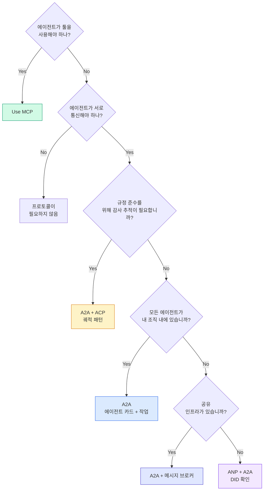

## 결과물

이 레슨은 생성합니다:
- `code/main.ts` -- 네 가지 프로토콜 패턴의 완전한 구현
- `outputs/prompt-protocol-selector.md` -- 시스템에 대한 프로토콜 선택을 돕는 프롬프트

## 연습 문제

1. **멀티홉 작업 위임.** `TaskManager`를 확장하여 에이전트 핸들러가 다른 에이전트에 하위 작업을 위임할 수 있게 하세요. 研究자接收任务, 리서치와 요약이라는 두 개의 전문가 에이전트에 하위 작업을 위임하고, 둘 다 완료되기를 기다린 다음 결과를 자신의 아티팩트로 병합합니다.

2. **스트리밍 감사 추적.** `AuditableRunner`를 수정하여 스트리밍 모드를 지원하세요. 전체 결과를 기다리는 대신, 궤적 항목이 추가됨에 따라 실시간으로 `AuditEntry` 업데이트를 산출하세요. 감 스냅샷을 생성하는 async generator를 사용하세요.

3. **DID 순환.** `IdentityRegistry`에 키 순환을 추가하세요. 에이전트는 `previousDid` 참조를 유지하면서 업데이트된 키로 새 DID 문서를 게시할 수 있어야 합니다. 확인자는 유예 기간 동안 현재와 이전 키의 서명을 모두 수락해야 합니다.

4. **프로토콜 협상.** ANP의 메타-프로토콜 개념을 구현하세요. 두 에이전트가 후보 형식과 함께 `protocolNegotiation` 메시지를 교환합니다 (예: "JSON-RPC로 통신할 수 있음" 대 "REST 선호"). 최대 3 라운드 후 형식에 동의하거나 시간 초과합니다. 동의된 형식은 어떤 `TaskManager` 또는 `AuditableRunner`를 사용하는지를 결정합니다.

5. **속도 제한 검색.** 구성 가능한 TTL로 에이전트 카드 조회수를 캐싱하고 에이전트당 초당 검색 쿼리를 제한하는 `RateLimitedRegistry` 래퍼를 추가하세요. 시작 시 100개의 에이전트가 서로 검색하는 천둥 무리를 시뮬레이션하고 차이를 측정하세요.

## 핵심 용어

| 용어 | 사람들이 말하는 것 | 실제 의미 |
|------|----------------|----------------------|
| MCP | "AI 도구를 위한 프로토콜" | 에이전트가 툴을 검색하고 사용하는 클라이언트-서버 프로토콜. 에이전트-투-에이전트가 아니라 에이전트-투-툴. |
| A2A | "Google의 에이전트 프로토콜" | Linux Foundation 산하 피어투피어 에이전트 협업 프로토콜. 에이전트 카드를 통한 검색, 9개 상태 작업 수명주기, SSE를 통한 스트리밍. JSON-RPC, REST, gRPC 바인딩을 지원합니다. |
| ACP | "엔터프라이즈 에이전트 메시징" | IBM/BeeAI의 궤적 메타데이터가 포함된 에이전트 실행용 REST API: 모든 응답은 추론 및 툴 호출의 완전한 체인을 전달합니다. A2A로 병합 중. |
| ANP | "분산 에이전트 ID" | 암호화 ID를 위한 `did:wba` (DID)를 사용하는 커뮤니티 프로토콜, E2EE를 위한 HPKE, 처음 본 적 없는 에이전트가 데이터 형식에 동적으로 동의하기 위한 AI-powered 메타-프로토콜 협상. |
| 에이전트 카드 | "에이전트의 명함" | 기술, 지원 MIME 타입, 보안 스키마, 프로토콜 바인딩을 설명하는 `/.well-known/agent-card.json`의 JSON 문서. |
| DID | "분산 ID" | 에이전트 자체 도메인에서 호스팅되는 암호학적으로 검증 가능한 ID를 위한 W3C 표준. ANP가 `did:wba` 메서드를 사용합니다. |
| TrajectoryMetadata | "감사 영수증" | 모든 에이전트 응답에 추론 단계, 툴 호출, 입출력을 연결하기 위한 ACP의 메커니즘. |
| 메타-프로토콜 | "에이전트가Communicating 방법 협상" | 에이전트가 자연어를 사용하여 데이터 형식에 동적으로 동의한 다음 처리하는 코드를 생성하는 ANP의 접근 방식. |
| 작업 | "작업 단위" | 제출에서 완료까지 작업을 추적하는 A2A의 상태 저장 객체. 한 번 종료되면 변경 불가능. |

## 추가 자료

- [Google A2A specification](https://github.com/google/A2A) -- 공식 스펙 및 SDK (v1.0.0, Linux Foundation)
- [IBM/BeeAI ACP specification](https://github.com/i-am-bee/acp) -- 에이전트 실행 및 궤적 메타데이터를 위한 OpenAPI 3.1 스펙
- [Agent Network Protocol](https://github.com/agent-network-protocol/AgentNetworkProtocol) -- DID 기반 ID, E2EE, 메타-프로토콜 협상
- [Model Context Protocol docs](https://modelcontextprotocol.io/) -- Anthropic의 MCP 스펙 (Phase 13에서 다루었음)
- [W3C Decentralized Identifiers](https://www.w3.org/TR/did-core/) -- ANP를 지원하는 ID 표준
- [RFC 9180 (HPKE)](https://www.rfc-editor.org/rfc/rfc9180) -- ANP가 E2EE에 사용하는 암호화 방식
- [FIPA Agent Communication Language](http://www.fipa.org/specs/fipa00061/SC00061G.html) -- 현대 에이전트 프로토콜의 학문적 선행자