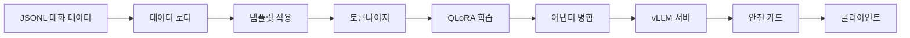
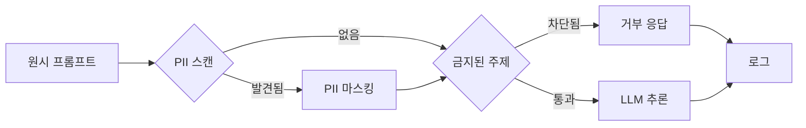

# 종단 간 파인튜닝 파이프라인

> 데이터부터 배포된 어댑터까지. 명령어 튜닝된 LLM이 여러분의 데이터로 파인튜닝되어 안전하게 추론되는 단일 파이프라인을 만드세요.

**Type:** Build
**Languages:** Python
**Prerequisites:** Phase 8~10 (Transformer), Phase 11~12 (PEFT), Phase 17 (추론)
**Time:** ~120분

## 학습 목표

- 원시 JSONL 대화 데이터를 로드하고, 템플릿에 따라 형식화하며, 학습/검증/테스트 세트로 분할하는 파이프라인을 구축합니다.
- QLoRA(PEFT + 4비트 양자화)를 사용하여 기본 모델을 명령어 데이터로 파인튜닝하고, 병합된 어댑터를 저장합니다.
- 병합된 가중치를 vLLM 추론 서버에 배포하고 OpenAI 호환 API를 제공합니다.
- 안전 가드를 통해 API 엔드포인트를 보호하여 추론 전에 PII(개인 식별 정보)를 마스킹하고 금지된 주제를 차단합니다.
- 제공된 데이터에 대해 예상 손실이 단조 감소하는지 확인하는 엔드투엔드 테스트를 실행합니다.

## 개요

이 캡스톤은 Phase 8~17의 네 가지 조각을 하나의 엔드투엔드 파이프라인으로 연결합니다. 각 조각은 독립적으로 테스트할 수 있습니다. 전체 시스템도 마찬가지입니다. 완료 시 얻는 결과물은 다음과 같습니다:

- **학습 파이프라인:** 데이터 증강, 템플릿 적용, 토큰화, QLoRA를 통한 파인튜닝을 수행하는 `train.py`.
- **추론 서버:** 학습된 어댑터를 vLLM 위에 제공하고 안전 가드 레이어를 갖춘 `server.py`.
- **안전 가드:** 추론 전에 전화번호나 API 키 같은 PII를 마스킹하는 `guard.py`.

파이프라인은 테스트 없이는 완성되지 않습니다. 가장 중요한 네 가지 고장 모드(누수된 데이터, 잘못된 템플릿, 차단되지 않은 PII, 중단된 API)는 각각 전용 테스트를 통해 검증되며, 이 테스트들은 파이프라인이 학습에서 배포로 안전하게 전환되는 조건을 주장합니다.

## 개념

### 파이프라인 레이아웃



각 상자는 플러그인 역할을 합니다. 명령어 템플릿을 교체한다고 해서 데이터 증강이 깨지지 않습니다. 안전 가드의 정규식을 교체한다고 해서 서빙이 깨지지 않습니다. 파이프라인은 표준 인터페이스를 통해 통신합니다: 학습은 Hugging Face `Trainer`에 의존하고, 서빙은 vLLM `AsyncLLMEngine`에 의존하며, 각 단계는 입력과 출력의 계약만 알 뿐입니다.

### 템플릿화

모든 명령어 데이터셋에는 자체 템플릿이 있습니다. `alpaca`는 `### Instruction` + `### Input` + `### Response` 형식을 사용하고, `sharegpt`는 `from`/`value` 대화를 사용하며, `custom`은 Groq 또는 Anthropic과 일치하는 사용자 정의 `{role}` 필드를 가집니다. 템플릿 레이어는 데이터세트에서 해당 키를 가져와서 타겟 LLM의 채팅 템플릿에 맞게 형식화합니다. 템플릿이 잘못되면 모델이 올바르게 학습되지 않으며, 템플릿 테스트가 이를 방지합니다.

### QLoRA와 어댑터 병합

QLoRA는 4비트 기본 가중치 위에 LoRA 어댑터를 학습시킵니다. 배포 시 어댑터는 전체 정밀도로 기본 가중치에 병합됩니다. 이는 (a) 기본 모델의 캐싱 인프라를 그대로 사용할 수 있고, (b) 추론에서 어댑터 적용 오버헤드가 0이기 때문에 중요합니다. 이 단계가 없으면 각 추론 호출은 별도의 어댑터 가중치 곱셈을 필요로 하여 지연 시간이 두 배로 늘어납니다. 병합은 `peft`의 `merge_and_unload`로 한 줄이면 충분하며, 이 캡스톤은 병합된 상태를 저장하고 로드하는 과정을 테스트합니다.

### 안전 가드 디자인

안전 가드는 API 핸들러에 하드코딩된 것이 아니라 워크플로우의 일부입니다. 각 추론 요청은 세 단계를 거칩니다:



PII 스캐너는 이메일, 전화번호, 주민등록번호, API 키, 베어러 토큰을 감지합니다. 금지된 주제 분류기는 사전 정의된 카테고리 목록에 대해 프롬프트의 코사인 유사도를 측정합니다(기본값은 사이버 보안 위험에 대해 차단). 가드는 학습 가능한 구성 요소가 아니라 정규식 + 임베딩 기반 결정입니다. 이는 학습 데이터나 추론 모델에 관계없이 시행되는 안전 경계입니다.

### 테스트 전략

| 테스트 | 검증 대상 | 실패 신호 |
|--------|----------|-----------|
| `test_pipeline` | 파이프라인이 손실 단조 감소로 학습 완료 | 손실이 NaN이거나 증가하거나 조기 종료 |
| `test_template` | 템플릿화가 데이터 구조를 보존 | 템플릿 적용 전후 데이터셋 크기 불일치 |
| `test_guard_pii` | 안전 가드가 PII를 올바르게 마스킹 | 스캔 후 출력에 원시 PII 존재 |
| `test_guard_blocked` | 안전 가드가 금지된 프롬프트를 거부 | 차단된 요청이 200 반환 |

`test_pipeline`은 가장 엄격합니다. 30개의 예시(20개 benign, 10개 차단 대상)로 구성된 고정 데이터셋에서 학습을 실행하고, 체크포인트 손실이 단조 감소하는지 확인합니다. 손실이 증가한다면 학습률, 배치 크기, 혹은 기본 모델 선택 중 무엇이 문제인지 알려줍니다. 이 테스트는 모든 파이프라인 커밋마다 통과해야 합니다.

## 구축하기

`code/` 디렉토리에는 세 가지 주요 모듈과 실행 가능한 데모가 포함되어 있습니다.

**`train.py`** – QLoRA 파인튜이너. Hugging Face `Trainer`를 중심으로 래핑되어 있으며, 설정 가능한 템플릿(YAML 또는 dict로 전달), 설정 가능한 기본 모델(기본값: `HuggingFaceTB/SmolLM-135M-Instruct`), 그리고 어댑터를 병합하고 저장하는 '저장' 콜백을 제공합니다. `Trainer` 인자는 `train_config` 사전에서 직접 가져오므로 LoRA 랭크나 학습률을 변경하기 위해 코드를 편집할 필요가 없습니다.

**`server.py`** – vLLM 추론 서버. 어댑터 경로를 받아 병합된 상태를 로드하고, `AsyncLLMEngine`을 시작하며, OpenAI 호환 API(채팅 완료 및 완료 엔드포인트)를 제공합니다. 추론 엔진은 `max_model_len`, `gpu_memory_utilization`, `tensor_parallel_size`와 같은 표준 vLLM 인자를 허용합니다.

**`guard.py`** – 안전 가드. 파이썬 정규식(`re`)을 사용한 PII 마스킹과 SentenceTransformer (`all-MiniLM-L6-v2`)를 사용한 주제 분류를 결합합니다. `check` 메서드는 프롬프트를 받아 (boolean `blocked`, string `masked_prompt`, list `issues`)를 반환합니다.

**`main.py`** – 데모 오케스트레이터입니다. train.py를 호출하고, 어댑터를 병합하며, guard를 초기화하고, guard를 통해 라우팅되는 서버 인스턴스에 대해 세 가지 추론 요청을 실행합니다. exit 0으로 종료됩니다.

실행:

```bash
python3 code/main.py
```

예상 출력: 학습 체크포인트의 손실 로그, 어댑터 병합 로그, 3회 추론(1회 benign, 1회 PII, 1회 차단됨), 각 요청에 대한 guard 결정, 그리고 "end-to-end pipeline OK" 메시지.

## 사용하기

프로덕션 패턴:

- **정형화된 출력.** 프롬프트에 `response_format={type: "json"}`을 추가하여 모델의 출력이 항상 파싱 가능한 JSON이 되도록 합니다. 이는 에이전틱 워크플로우에 필수적입니다.
- **입력 길이 제한.** 서버 구성에 `max_model_len`을 설정하고, 그보다 긴 프롬프트는 거부하거나 잘라냅니다(모델 컨텍스트 길이를 초과하여 학습한 적이 없기 때문).
- **속도 제한.** `server.py` 줄 앞에 `nginx`나 `envoy` 같은 리버스 프록시를 두어 초당 요청 수를 제한합니다.
- **데이터셋 버저닝.** 학습 데이터는 해시/날짜를 기준으로 불변의 스냅샷을 가져야 합니다. 학습 파이프라인은 `transformers` `Dataset`을 저장할 때 커밋 해시와 데이터셋 해시를 기록합니다(재현성을 위해).

## 배포하기

`outputs/skill-end-to-end-fine-tuning-pipeline.md`는 파이프라인을 이전 인프라에 통합하는 방법을 설명합니다: 스크립트를 CI/CD 파이프라인에 연결하는 방법, 서버가 `/health`에서 상태 확인을 지원하는 방법, 안전 가드 규칙을 확장하는 방법.

전체 트랙이 여기서 끝납니다. Phase 8~17의 11개 레슨이 단일 명령어로 실행되는 엔드투엔드 시스템으로 조립됩니다. Phase 18(안전)과 Phase 19(캡스톤)은 이 파이프라인을 기준으로 구축됩니다.

## 실습

1. Alpaca 템플릿을 ShareGPT 형식으로 교체하고 데이터셋 크기가 변경되지 않았는지 확인합니다.
2. 베이스 모델을 7B 파라미터 모델로 변경합니다. 메모리 예산 내에서 작은 배치 크기를 찾기 위해 QLoora 설정을 조정합니다(기를 수 있다면 4비트 KV 캐시도 함께).
3. guard에 속도 제한 레이어를 추가합니다(슬라이딩 윈도우 카운터 사용). guard 테스트를 통해 제한이 적용됨을 증명합니다.
4. guard의 `all-MiniLM-L6-v2` 임베딩을 사용해 금지된 주제 분류기를 훈련 가능한 로지스틱 회귀로 교체하고, 고정된 임계값과 비교하여 정밀도/재현율을 측정합니다.
5. 프롬프트가 컨텍스트 창을 초과할 때 거부하는 대신 중간을 자르는(chunking) 프롬프트 축소기를 추가하고, 모델 출력이 순수한 잘라내기와 비교하여 의미를 유지하는지 테스트합니다.

## 주요 용어

| 용어 | 일반적인 사용법 | 정확한 의미 |
|------|---------------|-------------|
| 종단 간 파이프라인 | "처음부터 끝까지" | 동일한 환경에서 학습 및 추론을 실행하고, 임의의 수동 개입 없이 아티팩트(어댑터, 구성)를 한 단계에서 다음 단계로 전달 |
| QLoRA | "양자화된 LoRA" | 4비트 기본 모델 위에 LoRA 어댑터를 학습시킨 후 전체 정밀도로 병합 |
| 안전 가드 | "API 보호" | 추론 전에 PII를 스캔하고 금지된 주제를 차단하는 계층 |
| 템플릿 | "데이터 형식화" | 원시 데이터세트 키를 모델의 채팅 템플릿에 매핑 |
| PII | "개인 식별 정보" | 이메일, 전화번호, 주민등록번호, API 키, 베어러 토큰 |

## 추가 자료

- [QLoRA 논문](https://arxiv.org/abs/2305.14314)
- [vLLM 문서](https://vllm.readthedocs.io/)
- [Hugging Face PEFT](https://huggingface.co/docs/peft)
- [SentenceTransformer 빠른 시작](https://www.sbert.net/docs/quickstart.html)
- Phase 8~10 — Transformer 구축
- Phase 11~12 — PEFT와 LoRA
- Phase 17 — 프로덕션 추론
- Phase 18 — 안전
