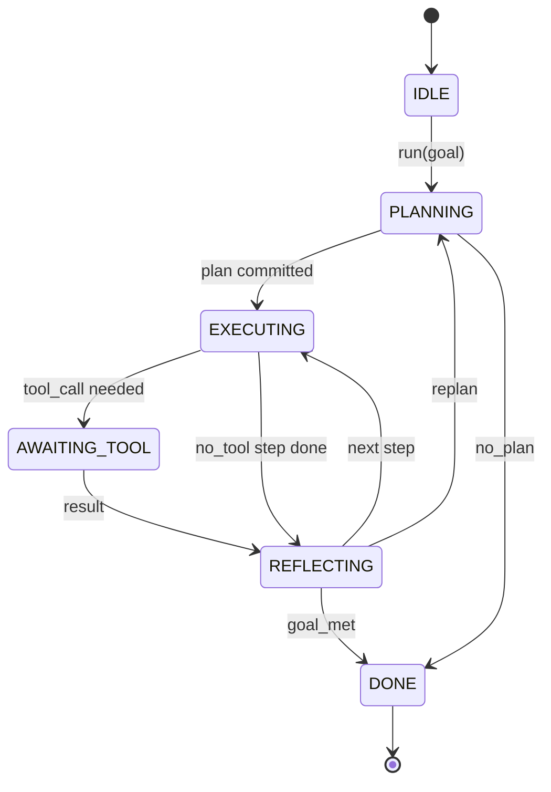

# 에이전트 하네스 루프 계약

> 하네스가 에이전트입니다. 모델은 코프로세서입니다. 이 수업은 모든 모델을 연결할 수 있는 루프 계약을 확정합니다.

**Type:** Build
**Languages:** Python
**Prerequisites:** Phase 13 수업 01-07, Phase 14 수업 01
**Time:** 약 90분

## 학습 목표
- 에이전트 하네스 루프를 명시적 전환을 갖는 결정론적 상태 머신으로 명세합니다.
- 운영자가 정책, 원격 측정, 가드레일을 연결하는 10가지 생명주기 훅 주제를 구현합니다.
- 루프가 호출자에게 제어권을 양보하고 새 입력에서 재개하는 두 개의 풀 포인트를 정의합니다.
- 세션당 예산(턴, 도구 호출, 벽시계 시간)을 초과 시 부분 상태를 누수하지 않고 적용합니다.
- 11가지 이벤트 유형의 타입화된 스트림을 방출하여 다운스트림 UI와 트레이서가 루프를 직접 검사하지 않고 구독할 수 있게 합니다.

## 프레임

40턴 동안 무인 실행되는 코딩 에이전트는 채팅 루프가 아닙니다. 운영자가 노드를 가로채고 엣지를 감사할 수 있는 상태 머신입니다. 계약을 한 번 작성하면 모델, 도구, 정책을 교체하는 것이 리팩터가 아니라 등록 호출이 됩니다.

이 수업은 그 계약을 구축합니다. 6가지 상태, 10가지 훅 주제, 2개의 풀 포인트, 11가지 이벤트 유형, 예산 범위를 명명합니다. 하네스의 다른 모든 것(도구 레지스트리, JSON-RPC 전송, 디스패처, 플래너)은 이 형태에 연결됩니다.

## 상태

루프는 6가지 상태를 갖습니다. 5개는 활성 상태입니다. 1개는 종료 상태입니다.



`IDLE`만이 유일한 합법적 진입점입니다. `DONE`만이 유일한 합법적 종료점입니다. `AWAITING_TOOL`만이 풀 포인트를 생성하는 유일한 상태입니다. 다른 모든 전환은 내부적입니다.

상태 머신은 결정론적입니다. 동일한 이벤트 로그가 주어지면 하네스는 동일한 상태로 재진입합니다. 이 속성은 모델을 다시 호출하지 않고 디버깅을 위해 세션을 재생할 수 있게 합니다.

## 훅 주제

훅은 운영자가 루프에 개입할 수 있는 지점입니다. 하네스는 10가지 주제를 실행합니다. 각 주제는 여러 구독자를 허용합니다. 구독자는 등록 순서대로 실행됩니다. 구독자는 페이로드를 변경하거나, 턴을 중단하기 위해 raise를 하거나, 다음 단계를 건너뛰기 위해 센티널을 반환할 수 있습니다.

```text
before_plan         after_plan
before_tool_call    after_tool_call
before_step         after_step
on_error
on_pause
on_budget_exceeded
on_complete
```

이 형태는 Claude Code, Cursor, OpenCode가 2025년 중반까지 모두 수렴한 것과 동일합니다. 이름은 기능적이며 브랜드와 무관합니다. `rm -rf`를 차단하는 훅은 `before_tool_call`에 있습니다. OpenTelemetry 스팬을 전송하는 훅은 `after_step`에 있습니다. 일시 중지된 세션을 재개하는 훅은 `on_pause`에 있습니다.

## 풀 포인트

루프는 두 번 제어권을 양보합니다. 첫 번째는 도구 결과 없이는 진행할 수 없는 `AWAITING_TOOL` 상태입니다. 두 번째는 예산이 소진되었거나 훅이 명시적으로 인간 검토를 요청한 `on_pause`에서입니다.

풀 포인트는 예외가 아닌 반환입니다. 호출자는 하네스 상태를 검사하고, 하네스가 요청한 것을 가져온 다음 `resume(payload)`를 호출합니다. 하네스는 중단된 지점에서 계속합니다. 이는 Python 제너레이터와 동일한 형태입니다. 풀 포인트 위의 전송은 선택 사항입니다. TUI에서는 키 입력이고, MCP 위에서는 `tools/call`이며, 큐 위에서는 작업 폴링입니다.

## 이벤트 스트림

루프는 계약의 특정 지점에서 이벤트를 타입화된 스트림에 추가합니다. 스트림은 추가 전용이며 구독자는 모든 오프셋에서 재생할 수 있습니다. 구현된 11가지 이벤트 유형은 다음과 같습니다:

- `session.start` — `run(goal)`이 호출될 때 한 번 방출됨
- `plan.draft` — 플래너가 초안 계획을 반환할 때 방출됨
- `plan.commit` — 초안이 활성 계획으로 확정된 후 방출됨
- `step.start` — 각 실행 단계 시작 시 방출됨
- `step.end` — 각 실행 단계 종료 시 방출됨
- `tool.call` — 도구가 필요한 단계가 호출자에게 제어권을 양보할 때 방출됨
- `tool.result` — 도구 결과와 함께 재개 시 방출됨
- `tool.error` — 오류와 함께 재개되거나 훅이 호출을 중단할 때 방출됨
- `budget.warn` — 예산 한도에 도달했을 때 방출됨
- `session.pause` — 루프가 일시 중지(예산 또는 훅)로 양보할 때 방출됨
- `session.complete` — 루프가 `DONE`에 도달했을 때 한 번 방출됨

이벤트는 훅 페이로드를 복제하지 않습니다. 훅은 명령형(변경, 중단)입니다. 이벤트는 관찰형(기록, 전송)입니다. 이 둘을 직교적인 것으로 취급하세요.

## 예산 범위

세션은 세 가지 제한을 갖습니다. 턴 수, 도구 호출 수, 벽시계 초. 각 턴은 턴 카운트를 1 증가시킵니다. 각 도구 호출은 도구 호출 카운트를 1 증가시킵니다. 벽시계는 모든 상태 전환 시 확인됩니다. 제한에 도달하면 루프는 `on_budget_exceeded`를 실행하고, `budget.warn`을 방출하며, 다음 풀 포인트에서 예산 초과 사유와 함께 `IDLE`로 전환됩니다.

예산은 킬 스위치가 아니라 양보입니다. 호출자는 예산을 연장하고 재개할지, 아니면 세션을 종료할지 결정합니다.

## 이 수업이 하지 않는 것

모델을 호출하지 않습니다. 실제 도구를 등록하지 않습니다. 전송을 구현하지 않습니다. 이는 다음 네 수업의 몫입니다. 이 수업은 계약을 확정하여 다음 네 수업이 재작성 없이 연결될 수 있게 합니다.

`main.py`의 결정론적 플래너는 대용입니다. 세 단계(그중 두 단계는 도구 결과 필요)의 하드코딩된 계획을 반환합니다. 핵심은 플랜이 아닌 루프입니다.

## 코드 읽는 방법

`HarnessLoop`가 메인 클래스입니다. 상태를 보유하고, 훅을 실행하며, 이벤트를 방출합니다. `Budget`은 제한을 추적합니다. `Event`는 스트림의 타입화된 봉투입니다. `HookRegistry`는 디스패치 테이블입니다. `_transition`은 상태를 변경하는 유일한 함수이므로 상태 머신 불변 조건이 한 곳에 있습니다.

`main.py`를 위에서 아래로 읽으세요. 그런 다음 `code/tests/test_loop.py`를 읽으세요. 테스트는 모든 전환과 모든 훅 실행 순서를 고정합니다.

## 더 나아가기

프로덕션에서 하네스를 구축할 때 가장 어려운 부분은 상태 머신이 아니라 계약을 강제 가능하게 만드는 것입니다. 계약은 플래너의 핫 리로드를 견뎌야 합니다. 잘못된 형식의 JSON을 반환하는 도구를 견뎌야 합니다. 40턴 세션의 2/3 지점에서 `before_tool_call`에서 예외를 발생시키는 훅을 견뎌야 합니다. 이 수업의 테스트는 이러한 실패 모드를 연습합니다. 실행하고, 깨뜨리고, 케이스를 추가하세요.

다음 수업은 도구 레지스트리를 추가합니다. 그 다음은 JSON-RPC 전송, 그 다음은 디스패처입니다. 24번 수업까지 이 파일의 루프는 실제 예산이 적용된 실제 도구에 대해 실제 계획을 실행할 것입니다.
