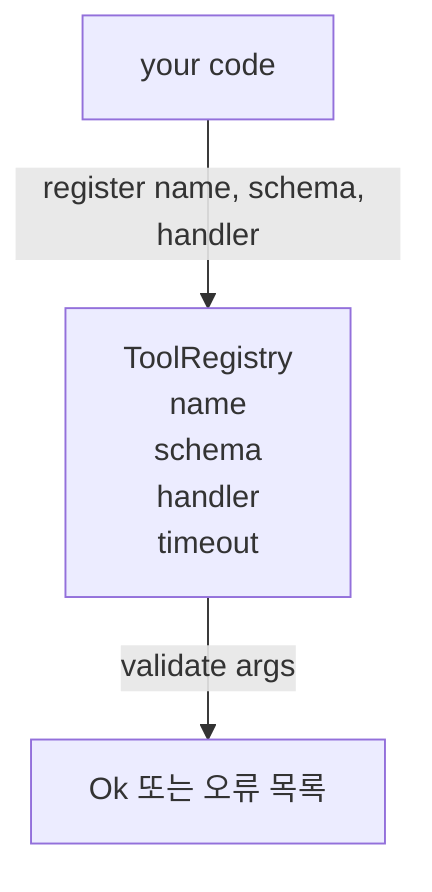

# 스키마 검증을 통한 도구 레지스트리

> 에이전트가 검증할 수 없는 도구는 에이전트가 호출할 수 없는 도구입니다. 도구를 만들기 전에 레지스트리와 스키마 검사기를 구축하세요.

**Type:** Build
**Languages:** Python
**Prerequisites:** Phase 13 수업 01-07, Phase 14 수업 01
**Time:** 약 90분

## 학습 목표
- 디스패처가 한 번 물어보고 이후에 신뢰할 수 있는 도구 이름 → 스키마 → 핸들러의 타입화된 레지스트리를 유지합니다.
- 실제 도구 호출의 90%가 사용하는 키워드를 커버하는 JSON Schema 2020-12 서브셋을 구현합니다.
- 모델이 한 번의 왕복으로 자체 수정할 수 있도록 정밀한 json-pointer 형태의 오류 경로를 반환합니다.
- 명시적 재정의 없이 재등록을 거부합니다. 무음 덮어쓰기가 프로덕션 도구 카탈로그를 표류시키기 때문입니다.
- 검증기를 순수하게 유지합니다(I/O 없음, 시간 없음, 전역 없음). 재생 로그에서 재실행할 수 있어야 합니다.

## 레지스트리가 도구보다 먼저인 이유

2026년 코딩 에이전트는 모델이 단일 컨텍스트 윈도우에 담을 수 있는 것보다 더 많은 등록된 도구를 가지고 있습니다. 중요하지 않은 하네스는 200개의 도구를 등록하고 주어진 턴에 10~40개를 표면화합니다. 레지스트리는 "어떤 도구가 존재하는지", "인수의 형태는 무엇인지", "어떤 핸들러를 호출할지"에 대한 진실 공급원입니다. 이 세 가지 답변이 고정되면 나머지 하네스는 추측을 멈출 수 있습니다.

우리가 피하려는 실수는 스키마 없이 핸들러를 제공하거나, 검증 없이 스키마를 제공하는 것입니다. 둘 다 일반적입니다. 둘 다 다음 계층(23번 수업의 디스패처)을 추측 게임으로 만들어 유일한 실패 모드가 핸들러의 스택 트레이스가 되게 만듭니다.

## 도구 레코드의 형태

```text
ToolRecord
  name        : str          (고유, 소문자 영숫자 및 밑줄 세그먼트를 점으로 구분, 예: snake_case.segment.case)
  description : str          (한 줄, 모델에 표시됨)
  schema      : dict         (JSON Schema 2020-12 서브셋)
  handler     : Callable     (async 또는 sync, Any 반환)
  idempotent  : bool         (디스패처가 재시도 결정에 사용)
  timeout_ms  : int          (도구별 디스패처 기본값 재정의)
```

스키마는 검증기가 만지는 유일한 필드입니다. 핸들러는 검증기에 불투명합니다. 의도적으로 분리합니다. 스키마는 데이터입니다. 핸들러는 코드입니다. 이 둘을 혼합하면 검증 로직을 핸들러 내부에 넣고 싶어지는데, 그것이 우리가 막는 버그입니다.

## JSON Schema 2020-12 서브셋

전체 2020-12 명세는 논문입니다. 8개의 키워드가 필요합니다.

```text
type           string / number / integer / boolean / object / array / null
properties     속성 이름 -> 스키마 맵
required       속성 이름 목록
enum           허용된 원시 값 목록
minLength      정수, 문자열에 적용
maxLength      정수, 문자열에 적용
pattern        ECMA-262 호환 정규식, 문자열에 적용
items          모든 배열 요소에 적용되는 스키마
```

이것은 도구 API가 실제로 필요로 하는 것을 커버하기에 충분합니다. 추가하지 않는 키워드(oneOf, anyOf, allOf, $ref, 조건부)는 프로덕션 스키마에서 유효하지만 검증기를 사이클이 있는 트리 워커로 만듭니다. 우리는 JSON Schema 엔진이 아니라 레지스트리를 구축하고 있습니다.

## Json 포인터 오류 경로

검증 실패 시 검증기는 오류 목록을 반환합니다. 각 오류는 입력에 대한 json-pointer 경로를 전달합니다. 포인터는 슬래시 접두사가 있는 속성 이름과 배열 인덱스의 시퀀스입니다.

```text
{"a": {"b": [1, 2, "x"]}}
                    ^
                    /a/b/2
```

모델은 문장보다 오류 경로를 더 잘 읽습니다. 스키마가 `args.user.email`을 요구하고 모델이 정수를 전달했다면 오류는 `expected_type: string`과 함께 `/user/email`이어야 합니다. 모델은 자연어 왕복 없이 다음 호출에서 수정합니다.

## 등록 및 재정의

`register(name, schema, handler, **opts)`는 기본적으로 재등록을 거부합니다. 호출자는 교체를 위해 `override=True`를 전달해야 합니다. 이는 운영 위생입니다. 코드베이스의 두 부분이 동일한 도구 이름을 무음으로 등록하는 것은 프로덕션에서 찾는 데 일주일이 걸리는 종류의 버그입니다.

레지스트리는 세 가지 읽기 메서드를 제공합니다. `get(name)`은 레코드를 반환하거나 raise합니다. `validate(name, args)`는 `Ok` 또는 오류 목록을 반환합니다. `names()`는 등록 순서대로 도구 이름을 반환합니다.

## 검증기의 역할과 한계

스키마 트리에 대한 단일 패스, 재귀적입니다. 순수합니다. 핸들러를 호출하지 않습니다. 타입을 강제 변환하지 않습니다(문자열 `"42"`는 숫자 스키마를 통과하지 않음). 무음 자르기를 하지 않습니다.

보안 경계가 아닙니다. 악의적인 핸들러는 검증 통과 후에도 여전히 잘못 동작할 수 있습니다. 23번 수업의 디스패처는 타임아웃과 샌드박스 계층을 추가합니다. 레지스트리는 형태를 추가합니다.

## 형태



## 코드 읽는 방법

`code/main.py`는 `ToolRegistry`, `ToolRecord`, `ValidationError`, 그리고 8개의 검증기 함수를 정의합니다. 검증기는 `schema["type"]`으로 디스패치합니다(또는 `enum`이 있는 스키마를 타입 없는 enum 검사로 처리). 각 타입 검증기는 빈 목록 또는 `ValidationError` 목록을 반환합니다. 최상위 워커는 오류를 연결하고 내려가면서 경로 세그먼트를 앞에 추가합니다.

`code/tests/test_registry.py`는 등록, 재정의, 검증 성공, 경로가 있는 검증 실패, 서브셋의 모든 키워드를 커버합니다.

## 더 나아가기

이 수업이 자리잡은 후에 원하게 될 두 가지 확장은 로컬 정의 블록에 대한 `$ref` 해석과 엄격한 형태를 위한 `additionalProperties: false`입니다. 둘 다 작습니다. 둘 다 도구 카탈로그가 50개를 넘어가면 추가하는 것이 일반적입니다. 파일을 한 번에 읽을 수 있게 유지하기 위해 수업에서 제외했습니다.

다음 수업(22번)은 이 레지스트리를 모델 클라이언트에 표면화하는 JSON-RPC stdio 전송을 구축합니다. 그 다음 수업(23번)은 타임아웃과 재시도가 있는 디스패처 뒤에 둘 다를 래핑합니다.
