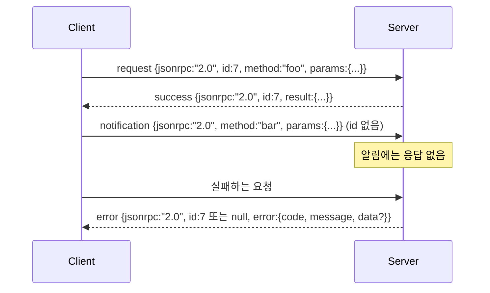

# 개행 구분 Stdio 위의 JSON-RPC 2.0

> 모델 클라이언트와 도구 서버 간의 전송은 stdio 위의 JSON-RPC입니다. 직접 한 번 만들어보면 모든 프레이밍 계층이 무엇을 위해 비용을 지불하는지 알게 됩니다.

**Type:** Build
**Languages:** Python
**Prerequisites:** Phase 13 수업 01-07, Phase 14 수업 01
**Time:** 약 90분

## 학습 목표
- stdin과 stdout 위에 개행 구분 JSON으로 프레임된 JSON-RPC 2.0을 구사합니다.
- 다섯 가지 표준 오류 코드(-32700, -32600, -32601, -32602, -32603)를 매핑하고 올바른 의미로 표면화합니다.
- 새 봉투 키를 발명하지 않고 요청, 응답, 알림, 배치를 구분합니다.
- 스트림의 나머지를 오염시키지 않고 줄당 하나의 파싱 오류를 처리합니다.
- io.BytesIO를 사용하여 자체 종료 데모를 구축하여 자식 프로세스를 생성하지 않고 수업이 실행됩니다.

## JSON-RPC가 링구아 프랑카로 남는 이유

2026년 코딩 에이전트는 단일 세션에서 약 12개의 도구 서버와 통신합니다. 각 서버는 별도의 프로세스 또는 원격 엔드포인트입니다. 와이어 포맷은 2013년부터 동일합니다. JSON-RPC 2.0은 2페이지짜리 명세입니다. 대안들(gRPC, 호출당 HTTP, 사용자 정의 바이너리)이 모두 JSON-RPC가 부과하지 않는 트레이드오프를 선택하기 때문에 살아남았습니다. 스트리밍 또는 배치 또는 전송 결합 중 하나를 선택해야 합니다. JSON-RPC는 stdio, 소켓, 웹소켓, HTTP에서 대칭적이며, 클라이언트는 명세를 존중하기만 하면 본 적 없는 서버도 구동할 수 있습니다.

이 수업은 stdio 변형을 구축합니다. 개행 구분 JSON입니다. 각 요청은 한 줄입니다. 각 응답은 한 줄입니다. 전송 경계는 `\n`입니다.

## 와이어 형태

4가지 봉투 형태가 존재합니다. 두 가지는 클라이언트가 말하고 두 가지는 서버가 말합니다.



알림에는 `id`가 없습니다. 서버는 이에 응답하지 않아야 합니다. 서버가 알림에 대한 응답을 반환하면 클라이언트가 이를 호출 사이트에 연결할 방법이 없습니다. 이 단일 규칙이 프레이밍 계산을 단순하게 유지합니다.

배치는 요청 또는 알림의 JSON 배열입니다. 서버는 비알림 항목당 하나씩, 임의의 순서로 응답 배열로 응답합니다. 배치의 모든 항목이 알림이면 서버는 아무것도 보내지 않습니다.

## 다섯 가지 오류 코드

```text
-32700  Parse error      JSON을 파싱할 수 없음
-32600  Invalid Request  봉투 형태가 잘못됨
-32601  Method not found
-32602  Invalid params
-32603  Internal error
```

-32000에서 -32099 사이의 코드는 서버 정의 오류용입니다. 그 외의 모든 것은 애플리케이션 정의입니다. 이 수업은 다섯 가지에 충실합니다. 핸들러가 예외를 발생시키면 전송은 `data.exception`에 예외 클래스 이름과 함께 -32603으로 래핑합니다.

파싱 오류에는 특별한 규칙이 있습니다. 응답의 `id`는 `null`입니다. 요청이 ID를 추출할 만큼 파싱되지 않았기 때문입니다.

## 개행 프레이밍과 BytesIO 데모

전송은 한 번에 한 줄씩 읽습니다. 줄은 `\n`을 포함한 바이트입니다. 줄을 파싱할 수 없으면 전송은 `id: null`인 -32700 응답을 쓰고 계속합니다. 스트림은 오염되지 않습니다. 다음 줄은 새롭게 파싱됩니다.

수업에서는 `io.BytesIO` 쌍을 stdin과 stdout으로 래핑합니다. 서버는 EOF까지 요청을 읽고, 각각에 대한 응답을 쓴 후 반환합니다. 클라이언트는 응답을 다시 읽습니다. 프로세스 생성이 없고 타임아웃이 없습니다. Python의 `io` 인터페이스가 동일한 `.readline()` 및 `.write()` 계약을 제공하므로 전송 동작은 실제 서브프로세스 파이프와 동일합니다.

## 메서드 디스패치

전송은 어떤 메서드가 존재하는지 알지 못합니다. 하네스가 제공하는 호출 가능한 `handler(method, params)`로 전달합니다. 핸들러는 결과를 반환하거나 예외를 발생시킵니다. 세 가지 예외 클래스가 특정 코드를 표면화합니다.

```text
MethodNotFound -> -32601
InvalidParams  -> -32602
그 외 모든 것  -> -32603, data에 예외 이름 포함
```

전송은 도구 레지스트리를 보지 않습니다. 레지스트리는 핸들러 뒤에 있습니다. 이것이 우리가 원하는 계층화입니다. 전송은 JSON-RPC를 말합니다. 레지스트리는 도구 형태를 말합니다. 디스패처(23번 수업)가 이들을 연결합니다.

## 오류 시 스트림 동작

```text
클라이언트 작성               서버 읽기             서버 작성
---------------           -----------           -------------
{...유효한 요청...}       파싱 성공             {...응답, id 일치...}
{...깨진 json...          파싱 실패             {id:null, error: -32700}
{...유효한 요청...}       파싱 성공             {...응답, id 일치...}
{...메서드 없음...}       유효하지 않은 봉투    {id:X, error: -32600}
```

깨진 JSON 줄은 루프를 중단하지 않습니다. 누락된 `method` 필드는 루프를 중단하지 않습니다. 핸들러 예외는 루프를 중단하지 않습니다. 전송은 EOF까지 계속 읽습니다.

## 알림과 비대칭 흐름

알림은 발사 후 망각입니다. 하네스는 진행 이벤트, 취소 신호, 로그 라인에 알림을 사용합니다. 알림은 장기 실행 도구가 각각에 대해 왕복하지 않고 상태 업데이트를 스트리밍할 수 있는 방법입니다.

이 수업은 하나의 아웃바운드 알림 헬퍼인 `write_notification`을 구현합니다. 서버는 요청이 처리 중일 때 진행 상황을 방출하는 데 사용합니다. 데모는 패턴을 보여줍니다: 요청이 들어오고, 핸들러가 두 개의 진행 알림을 방출한 후 최종 응답을 씁니다.

## 코드 읽는 방법

`code/main.py`는 `StdioTransport`, 파싱 헬퍼(`parse_request`), 세 가지 쓰기 헬퍼(`write_response`, `write_error`, `write_notification`), 디스패치 루프 `serve`를 정의합니다. 오류 코드 상수는 모듈 범위에 있습니다.

`code/tests/test_transport.py`는 다섯 가지 오류 코드, 알림(응답 없음), 배치(배열 입력, 배열 출력, 알림 건너뛰기), 깨진 JSON(파싱 오류 후 계속), 핸들러가 호출 중간에 알림을 쓰는 비대칭 흐름을 커버합니다.

## 더 나아가기

이 전송은 이후 수업에 충분합니다. 프로덕션 전송은 세 가지를 추가합니다. 포워딩을 견디는 상관관계 ID 필드(이미 `id`가 이것이지만 메시에서는 외부 추적 ID도 필요), 취소 채널(`$/cancelRequest`와 같은 알림으로 처리 중인 호출의 ID 포함), 동일한 소켓이 JSON-RPC와 Streamable HTTP를 말할 수 있도록 하는 콘텐츠 타입 협상 핸드셰이크. 이들 중 어느 것도 와이어를 변경하지 않습니다. 메타데이터를 추가합니다.
