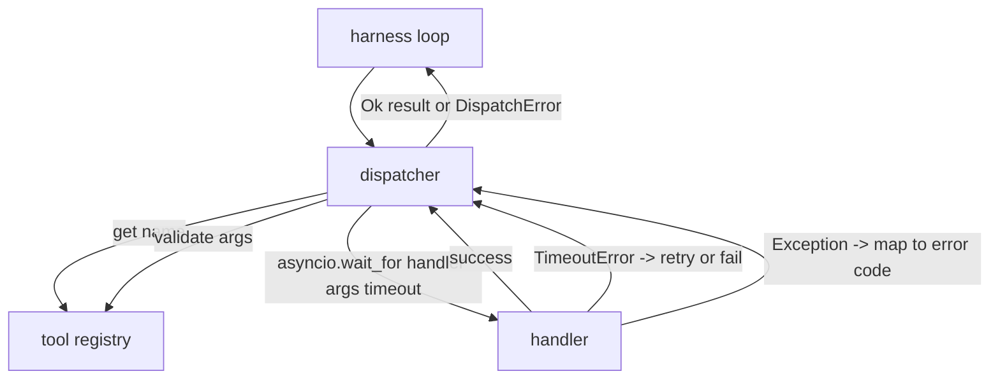
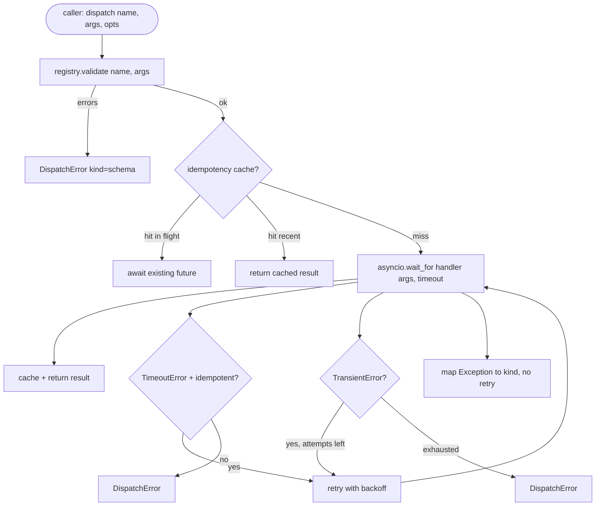

# 함수 호출 디스패처

> 디스패처는 하네스가 스키마가 한 모든 약속에 대한 대가를 지불하는 곳입니다. 타임아웃, 재시도, 중복 제거, 오류 매핑. 모두 하나의 연결점에서 처리됩니다.

**Type:** Build
**Languages:** Python
**Prerequisites:** Phase 13 수업 01-07, Phase 14 수업 01
**Time:** 약 90분

## 학습 목표
- 도구 핸들러를 호출당 타임아웃으로 래핑하여 루프를 중단시키는 대신 타입화된 오류를 반환합니다.
- 지수 백오프 재시도에 지터(jitter)와 최대 시도 횟수를 적용합니다.
- 멱등성 키로 재시도를 중복 제거하여 느린 원본과 경쟁하는 재시도가 두 번 실행되지 않도록 합니다.
- 핸들러 예외와 전송 오류를 하네스 루프가 이미 이해하는 단일 오류 봉투에 매핑합니다.
- 동시성 제한으로 병렬 디스패치를 제한하여 40개의 도구 호출 팬아웃이 이벤트 루프를 소진하지 않도록 합니다.

## 디스패처의 위치

하네스 루프(20번 수업)와 도구 레지스트리(21번 수업) 사이에 있습니다. 전송(22번 수업)은 루프에 공급합니다. 루프는 도구 호출을 디스패처에 전달합니다. 디스패처는 레지스트리를 호출하고, 핸들러를 실행하며, 결과 또는 JSON-RPC 형태의 오류 봉투를 반환합니다.



디스패처는 타이머, 재시도, 멱등성에 대해 아는 유일한 계층입니다. 루프는 모릅니다. 레지스트리는 모릅니다. 핸들러는 모릅니다. 그 격리가 핵심입니다.

## 타임아웃

각 도구에는 기본 타임아웃이 있습니다. 레지스트리 레코드는 `timeout_ms`를 전달합니다. 디스패처는 하네스가 전달하는 호출별 재정의로 이를 재정의합니다. `asyncio.wait_for`를 사용합니다. 타임아웃 시 핸들러 작업이 취소되고 디스패처는 `DispatchError(kind="timeout")`을 반환합니다.

타임아웃은 기본적으로 멱등하지 않은 도구에 대해 재시도 가능한 오류가 아닙니다. 타임아웃된 `db.write`는 커밋되었을 수도 있고 아닐 수도 있습니다. 재시도는 쓰기를 중복합니다. 디스패처는 레지스트리 레코드의 `idempotent` 플래그를 존중합니다. 멱등 도구는 재시도합니다. 비멱등 도구는 재시도하지 않습니다.

## 지수 백오프 재시도

재시도 정책은 최대 3회 시도입니다. 백오프는 지터가 있는 지수입니다.

```text
attempt 1  -> delay 0
attempt 2  -> delay 0.1s * (1 + random[0..0.5])
attempt 3  -> delay 0.4s * (1 + random[0..0.5])
```

`timeout`과 `transient` 오류만 재시도합니다. `schema` 오류, `not_found`, 또는 `internal` 오류는 재시도하지 않습니다. 스키마 오류는 결정론적입니다. 재시도해도 결과가 바뀌지 않고 예산만 소모됩니다.

재시도 루프는 하네스의 예산을 존중합니다. 호출자의 예산에 남은 도구 호출이 0이면 디스패처는 첫 번째 시도에서 빠르게 실패하고 `kind="budget_exceeded"`를 반환합니다.

## 멱등성 키 중복 제거

원본이 아직 처리 중일 때 재시도가 실행되는 것은 실제 프로덕션 버그입니다. 첫 번째 호출이 4.9초(타임아웃 직전)에 걸려 있습니다. 재시도는 5초에 실행됩니다. 이제 두 요청이 동일한 백엔드와 경쟁합니다. 도구가 `payments.charge`라면 두 번 청구된 것입니다.

디스패처는 선택적 `idempotency_key`를 받습니다. 호출이 도착할 때 동일한 키가 처리 중이면 디스패처는 처리 중인 퓨처를 기다렸다가 그 결과를 반환합니다. 캐시는 완료 후 60초 동안 키를 보유하여 늦은 재시도를 흡수합니다.

키는 호출자의 책임입니다. 하네스는 플래너에서 키를 파생합니다: `f"{step_id}:{tool_name}:{hash(args)}"`. 디스패처는 키를 발명하지 않습니다. 인수만으로 키를 파생하면 의미상 다른 두 호출이 동일하게 보이기 때문입니다.

## 오류 봉투

실패한 디스패치는 단일 형태를 반환합니다.

```text
DispatchError
  kind        : "timeout" | "transient" | "schema" | "not_found" | "internal" | "budget_exceeded"
  message     : str
  attempts    : int
  jsonrpc_code: int   (-32601, -32602, -32603 중 하나)
```

하네스 루프는 `kind`를 다음 상태로 매핑합니다. `schema`와 `not_found`는 `on_error`로 가서 재계획을 트리거합니다. `timeout`과 `transient`는 `on_error`로 가고 시도 횟수에 따라 재계획할 수도 있고 아닐 수도 있습니다. `budget_exceeded`는 `on_budget_exceeded`를 트리거합니다.

## 팬아웃의 동시성 제한

`gather(*calls)`는 모든 코루틴을 동시에 실행합니다. 40개의 도구 호출은 40개의 열린 소켓 또는 40개의 서브프로세스 파이프입니다. 대부분의 백엔드는 하나의 클라이언트에서 40개의 병렬 연결을 좋아하지 않습니다.

디스패처는 `gather`를 세마포어로 래핑합니다. 기본 동시성 제한은 8입니다. 각 호출은 디스패치 전에 세마포어를 획득하고 완료 시 해제합니다. 호출자는 `gather` 형태의 출력을 보지만 실제 스케줄링은 제한됩니다.

## 하나의 호출에 대한 흐름



## 코드 읽는 방법

`code/main.py`는 `Dispatcher`, `DispatchError`, `TransientError`를 정의합니다. 디스패처는 생성 시 레지스트리를 받습니다. async `dispatch(name, args, ...)`가 유일한 진입점입니다. 시도별 타임아웃은 `_run_with_retries` 내부에서 `asyncio.wait_for`를 사용하여 인라인으로 적용됩니다. `gather_bounded(calls)`는 동시성 제한으로 여러 디스패치를 실행합니다.

`code/tests/test_dispatcher.py`는 타임아웃 실행, 일시적 오류 재시도, 스키마 오류 비재시도, 멱등성 중복 제거(동일한 키를 가진 두 동시 호출이 하나의 핸들러 호출로 축소됨), 동시성 제한(세마포어 작동)을 커버합니다.

테스트는 `asyncio.sleep(0)`과 결정론적 `Counter` 기반 핸들러를 사용하므로 밀리초 단위로 완료되며 벽시계 타이밍에 의존하지 않습니다.

## 더 나아가기

프로덕션 디스패처가 추가하는 두 가지 확장. 첫째, 모든 전환에서 구조화된 로깅(루프의 이벤트 스트림이 이미 제공하지만 디스패처도 `dispatch.attempt` 및 `dispatch.retry` 이벤트를 방출해야 함). 둘째, 서킷 브레이커: 윈도우에서 N회 실패 후 도구는 냉각 기간을 가지며, 그 동안 디스패치는 핸들러를 시도하는 대신 `kind="circuit_open"`으로 즉시 반환합니다. 둘 다 계약을 변경하지 않고 이 디스패처 위에 맞습니다.

24번 수업은 디스패처를 계획-및-실행 에이전트에 연결하여 네 조각이 모두 움직이는 것을 볼 수 있게 합니다.
