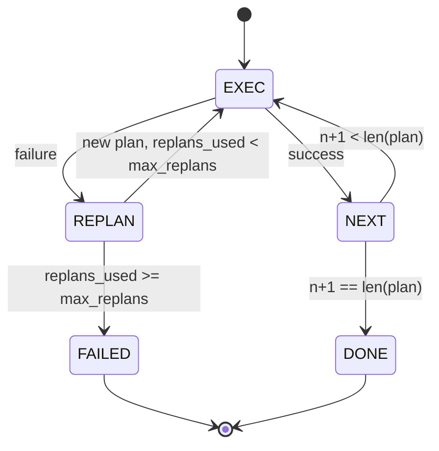

# 계획-실행 제어 흐름

> 실패에서 살아남지 못하는 계획은 스크립트입니다. 재계획할 수 있는 스크립트는 에이전트입니다. 먼저 재플래너를 구축하세요.

**Type:** Build
**Languages:** Python
**Prerequisites:** Phase 13 수업 01-07, Phase 14 수업 01
**Time:** 약 90분

## 학습 목표
- 계획을 타입화된 단계의 정렬된 목록으로 표현하여 실행기가 진행 상황과 결과를 추론할 수 있게 합니다.
- 제어된 실패 핸드오프로 단계를 순차적으로 실행하여 플래너로 다시 전달합니다.
- 컨텍스트에 이전 오류를 포함하여 현재 커서에서 재계획하여 다음 계획이 정보를 기반으로 할 수 있게 합니다.
- 각 수정 시 계획 diff를 방출하여 다운스트림 트레이서나 UI가 계획이 변경된 이유를 표시할 수 있게 합니다.
- 두 가지 예산을 적용합니다: 하드 단계 상한과 하드 재계획 상한.

## 계획 및 실행, 사고 사슬이 아닌

사고 사슬 에이전트는 토큰을 방출하고 루프가 도구 호출이 끝나는 위치를 추측하게 합니다. 계획 및 실행 에이전트는 먼저 구조화된 계획을 방출한 다음 각 단계를 결정론적으로 실행합니다. 계획은 하네스가 내부를 검사할 수 있는 데이터입니다. 실행은 하네스가 디스패처를 통해 그 데이터를 실행하는 것입니다.

두 조각. 계획을 생성하는 플래너. 계획을 실행하는 실행기. 흥미로운 작업은 실행기가 실패했을 때 일어나는 일입니다. 세 가지 옵션:

```text
1. 중단         (실패 반환, 오류 표면화)
2. 건너뛰기      (단계 실패 표시, 나머지 계속)
3. 재계획        (오류를 플래너에 전달, 커서에서 새 계획 가져오기)
```

재계획이 스크립트를 에이전트로 바꾸는 것입니다.

## 단계 형태

```text
Step
  id              : int           (계획 수정 내에서 단조 증가)
  tool_name       : str
  args            : dict
  expected_outcome: str           (플래너가 명시한 성공 조건)
  result          : Any | None
  error           : str | None
```

`expected_outcome`은 플래너가 단계와 함께 방출하는 짧은 문장입니다. 실행기에 의해 강제되지 않습니다. 두 가지 용도가 있습니다: 재플래너가 계획을 수정할 때 읽고, 이벤트 스트림이 방출하여 트레이서가 "이 단계는 X를 수행해야 했습니다"를 표시할 수 있게 합니다.

## 플래너 형태

```python
def planner(goal: str, history: list[Step], last_error: str | None) -> list[Step]:
    ...
```

순수 함수입니다. `goal`은 사용자 목표입니다. `history`는 이미 실행된 단계(결과와 오류가 채워짐)입니다. `last_error`는 첫 번째 호출 시 None이고 이후 호출 시 가장 최근 실패 메시지입니다. 플래너는 커서에서 시작하는 다음 계획을 반환합니다.

플래너는 실행기에 대해 알지 못합니다. 재시도에 대해 알지 못합니다. 타임아웃에 대해 알지 못합니다. 계획을 생성합니다. 그게 전부입니다.

## 실행기

실행기는 작은 상태 머신입니다. 각 단계는 디스패처를 통해 실행됩니다. 결과는 세 가지 중 하나입니다: 성공, 실패-재계획가능, 실패-치명적. 재계획 가능한 실패는 플래너로 다시 전달됩니다. 치명적 실패(예산 초과, 재계획 상한 도달)는 `FAILED` 세션 결과를 반환합니다.



## 수정 시 계획 diff

실패 후 플래너가 새 계획을 반환하면 실행기는 세 가지 필드와 함께 `plan.diff` 이벤트를 방출합니다.

```text
removed: 이전 계획에 있었고 새 계획에 없는 단계 id 목록
added  : 새 계획에 있고 이전 계획에 없었던 단계 id 목록
revised: tool_name 또는 args가 변경된 단계 id 목록
```

트레이서나 UI는 이를 제거된 단계에 취소선을 그리고 추가된 단계에 강조 표시하는 방식으로 렌더링할 수 있습니다. 요점은 diff 형식이 아니라 수정이 보이는 이벤트이며 무음 재작성이 아니라는 것입니다.

## 두 가지 예산, 모두 하드

`max_steps`는 재계획을 포함하여 전체 세션에서 총 단계 실행 횟수를 제한합니다. 기본값은 12입니다. 두 번 재계획하고 매번 세 단계를 추가하는 선형 5단계 계획은 16회 실행되어 예산을 초과합니다. 실행기는 재계획을 거부하고 FAILED를 반환합니다.

`max_replans`는 첫 번째 계획 후 플래너가 호출되는 횟수를 제한합니다. 기본값은 5입니다. 이것이 더 중요한 제한입니다. 동일한 깨진 계획을 다섯 번 연속 반환하는 플래너는 그렇지 않으면 단계 예산이 잡을 때까지 루프됩니다. 재계획을 제한하면 실패가 더 빠르고 이유가 더 명확해집니다.

## 이 수업의 결정론적 플래너

이 수업에서는 모델을 호출하지 않습니다. 이 수업은 `last_error`에 기반하여 계획을 선택하는 결정론적 플래너를 제공합니다.

```text
last_error is None    -> 4단계 계획 방출
last_error matches X  -> X를 우회하는 3단계 계획 방출
last_error matches Y  -> 우아하게 포기하는 2단계 계획 방출
그 외                 -> [] 반환 (재계획할 것 없음 신호)
```

이것은 성공, 한 번 재계획, 두 번 재계획, 재계획 소진, 단계 예산 소진 등 모든 전환 경로에서 실행기의 동작을 테스트하기에 충분합니다.

## 결과 형태

```text
SessionResult
  status      : "completed" | "failed"
  reason      : str     ("goal_met" | "step_budget" | "replan_budget" | "no_plan")
  history     : list[Step]
  revisions   : list[PlanDiff]
  events      : list[Event]
```

20번 수업의 하네스 루프는 이것을 직접 읽을 수 있습니다. 23번 수업의 디스패처는 각 단계를 실행하는 것입니다. 21번 수업의 레지스트리는 각 단계의 인수를 검증합니다. 22번 수업의 전송은 이 전체 흐름을 JSON-RPC를 통해 모델 클라이언트에 표면화합니다.

## 코드 읽는 방법

`code/main.py`는 `PlanExecuteAgent`, `Step`, `PlanDiff`, `SessionResult`, 결정론적 플래너를 정의합니다. 실행기는 `SessionResult`를 반환하는 단일 `run(goal)` 메서드입니다. 계획 diff는 단계 id와 `(tool_name, args)` 튜플을 비교하여 계산됩니다.

`code/tests/test_agent.py`는 선형 성공, 한 번 재계획하는 중간 계획 실패, `failed:replan_budget`을 반환하는 재계획 소진, 단계 예산 소진, 계획-diff 이벤트 형식을 커버합니다.

## 더 나아가기

이것을 실제 모델에 연결한 후에 원하게 될 두 가지 확장. 첫째, 부분 계획 캐싱: 계획이 6단계 중 처음 3단계를 성공하고 실패했을 때 처음 3단계를 다시 실행하고 싶지 않습니다. 실행기는 이미 기록을 유지합니다; 플래너가 그것을 읽기만 하면 됩니다. 둘째, 병렬 브랜치: 현재 실행기는 엄격히 순차적입니다. 독립적인 브랜치를 방출하는 플래너(`next_step` 대신 `gather_step`)는 디스패처를 통해 두 도구 호출을 동시에 실행할 수 있습니다.

둘 다 실제 복잡성을 추가합니다. 둘 다 선형 실행기가 고정된 후에 추가하기 더 쉽습니다. 이것이 이 수업이 하는 일입니다.
