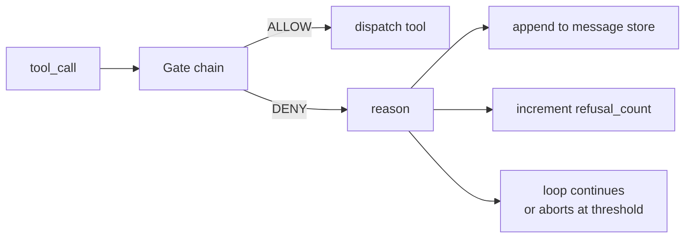
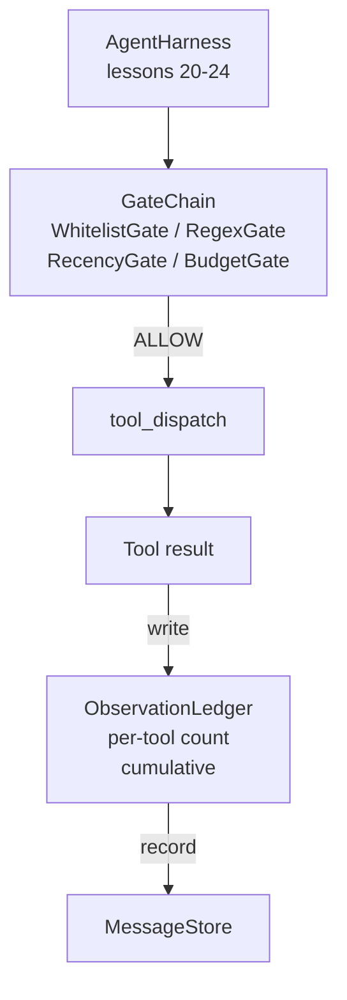

# 캡스톤 수업 25: 검증 게이트와 관측 예산

> 검증 계층이 없는 에이전트 하네스는 소원을 빌고 있는 트렌치코트입니다. 이 수업은 도구 호출이 실행되어도 되는지, 에이전트가 그 출력 중 얼마나 많이 볼 수 있는지, 에이전트가 너무 많이 읽었을 때 루프가 언제 중단되어야 하는지를 결정하는 결정론적 게이트 체인을 구축합니다. 이 체인은 작고 명명된 게이트와 모델이 본 모든 토큰을 추적하는 관측 원장(ledger)의 함수입니다.

**Type:** Build
**Languages:** Python (stdlib)
**Prerequisites:** Phase 19 · 20-24 (트랙 A1: 에이전트 루프, 도구 레지스트리, 메시지 저장소, 프롬프트 빌더, 모델 라우터), Phase 14 · 33 (제약 조건으로서의 명령), Phase 14 · 36 (범위 계약), Phase 14 · 38 (검증 게이트)
**Time:** 약 90분

## 학습 목표

- 결정론적 `evaluate(call)` 메서드를 가진 `VerificationGate` 프로토콜을 구축합니다.
- 예산, 최신성, 허용 목록, 정규식 게이트를 단락 의미론으로 체인으로 구성합니다.
- 도구와 턴을 키로 하는 `ObservationLedger`를 통해 모든 관측을 추적합니다.
- 누적 관측 예산이 초과될 때 도구 호출을 거부합니다.
- 다운스트림 관측 가능성이 수집할 수 있는 구조화된 `GateDecision` 레코드를 표면화합니다.

## 문제

에이전트 하네스가 모델이 도구를 자유롭게 호출하도록 두면, 실제 사용 첫 시간 내에 세 가지 종류의 버그가 나타납니다.

첫째는 무제한 관측입니다. 200K라인 저장소에 대한 grep은 다음 턴에 50만 토큰의 출력을 덤프합니다. 모델은 킬로바이트당 하나의 일치를 보고 나머지 컨텍스트는 낭비됩니다. 토큰 비용은 크고 에이전트는 작업에서 더 나빠집니다.

둘째는 오래된 최신성입니다. 장기 실행 작업은 50개의 도구 호출을 누적합니다. 모델은 3번 턴의 첫 번째 read_file을 마치 라이브 상태인 것처럼 다시 읽습니다. 47번 턴에서 이루어진 편집은 프롬프트 빌더가 가장 이른 관측을 먼저 직렬화하기 때문에 나타나지 않습니다.

셋째는 권한 상승입니다. 연구 작업이 `web_search`를 호출하여 시작하고, 모델이 도구 이름을 발명하고 하네스가 허용적으로 기본 설정되어 어쩌다 `shell`을 실행하게 됩니다. 누군가 추적을 읽을 때쯤에는 /tmp에 정크 파일이 있고 개인 API에 대한 curl이 실행되었습니다.

검증 게이트는 '아니오'라고 말하는 하네스 구성 요소입니다. 모델이 아니고 판사가 아닙니다. `(call, history, ledger)`의 결정론적 함수로, 이유와 함께 ALLOW 또는 DENY를 반환합니다. 이유는 기록됩니다. 모델에게 알려집니다. 루프는 계속되거나 중단됩니다.

## 개념



게이트는 `evaluate(call, ctx) -> GateDecision` 메서드를 가진 모든 것입니다. 체인은 정렬된 목록입니다. 평가는 첫 번째 거부에서 단락됩니다. 순서가 중요합니다: 저렴한 구조적 게이트가 비싼 토큰 계산 게이트보다 먼저 실행됩니다.

이 수업은 네 개의 게이트를 제공합니다:

- `WhitelistGate`. 허용된 도구 이름은 명시적 집합입니다. 그 외의 모든 것은 거부됩니다. 이것이 가장 저렴한 게이트이며 먼저 실행됩니다.
- `RegexGate`. 도구 인수가 정규식과 일치하는지 확인합니다. `rm -rf`가 포함된 shell 호출이나 내부 IP에 대한 HTTP 호출을 거부하는 데 유용합니다. 호출 페이로드에 대해 순수합니다.
- `RecencyGate`. 모델은 지난 N턴의 관측만 봅니다. 더 오래된 관측은 마스킹됩니다. 게이트는 결과가 이미 만료된 관측 창을 확장할 도구 호출을 거부합니다.
- `BudgetGate`. 모델이 세션 전체에서 읽은 누적 토큰에는 상한이 있습니다. 원장이 상한에 도달했다고 말하면 모든 추가 도구 호출이 거부됩니다.

관측 원장은 장부입니다. 성공적인 모든 도구 호출은 하나의 행을 기록합니다: 도구 이름, 턴, 방출된 토큰, 누계. 원장은 두 가지 질문에 답합니다: 모델이 총 얼마나 보았는지, 그리고 도구 X에 대해 얼마나 보았는지. 예산 게이트는 첫 번째를 읽습니다. 실습으로 작성할 도구별 예산 게이트는 두 번째를 읽습니다.

## 아키텍처



하네스는 체인에 묻습니다. 체인은 승인하거나 거부합니다. 승인하면 도구가 실행되고, 원장이 업데이트되며, 결과가 메시지 저장소에 추가됩니다. 거부하면 모델에 거부가 시스템 메시지로 전달되고 루프는 재시도할지 중단할지 결정합니다.

## 구축할 것

구현은 하나의 `main.py`와 테스트입니다.

1. `Observation` 및 `ToolCall` 데이터클래스가 와이어 형태를 정의합니다.
2. `ObservationLedger`는 `(turn, tool, tokens)` 행을 기록하고 `cumulative()` 및 `per_tool(name)`에 답합니다.
3. `GateDecision`은 `(allow, reason, gate_name)`을 전달합니다.
4. `VerificationGate`는 프로토콜입니다. 각 게이트는 `evaluate(call, ctx)`를 구현합니다.
5. `GateChain`은 정렬된 목록을 래핑합니다. 각 게이트를 호출하고, 첫 번째 거부를 반환하거나 모든 게이트가 통과하면 allow를 반환합니다.
6. 데모는 작은 합성 에이전트 루프를 실행합니다. 세 턴. 세 번째 턴은 예산 게이트를 트리거하고 루프는 0이 아닌 거부 횟수와 함께 깔끔한 거부를 보고합니다.

토큰 카운터는 의도적으로 어리석은 `len(text) // 4` 휴리스틱입니다. 이 수업의 핵심은 게이트 배관이지 토크나이저가 아닙니다. 프로덕션에서는 실제 토크나이저를 사용하세요.

## 체인 순서가 중요한 이유

거부는 허용보다 저렴합니다. `WhitelistGate`는 O(1) 해시 조회로 실행됩니다. `RegexGate`는 O(pattern * argv)로 실행됩니다. `RecencyGate`는 메시지 저장소의 작은 조각을 읽습니다. `BudgetGate`는 전체 원장을 읽습니다. 비용이 오름차순으로 정렬하여 거부된 호출이 비싼 작업을 수행하기 전에 단락되도록 합니다.

또한 폭발 반경으로 정렬합니다. 허용 목록은 가장 강력한 주장입니다: 이 도구는 계약에 없습니다. 정규식 게이트가 다음입니다: 이 인수는 계약에 없습니다. 최신성은 그 다음입니다: 하네스는 여전히 신경 쓰지만 호출은 구조적으로 합법적입니다. 예산은 마지막입니다. 정의상 다른 모든 것이 통과된 경우에만 실행되기 때문입니다.

## 트랙 A의 나머지와의 구성

이전 수업들은 루프, 도구 레지스트리, 메시지 저장소, 프롬프트 빌더, 모델 라우터를 제공했습니다. 이 수업은 모델과 도구 사이의 계층을 추가합니다. 26번 수업은 게이트 체인이 ALLOW를 말한 후 디스패처가 도구 호출을 전달하는 샌드박스를 제공합니다. 27번 수업은 거부 횟수를 품질 신호로 기록하는 평가 하네스를 제공합니다. 28번 수업은 게이트 결정을 OpenTelemetry 스팬으로 연결합니다. 29번 수업은 모든 것을 작동하는 코딩 에이전트로 연결합니다.

## 실행

```bash
cd phases/19-capstone-projects/25-verification-gates-observation-budget
python3 code/main.py
python3 -m pytest code/tests/ -v
```

데모는 모든 게이트 결정을 포함한 턴별 추적을 출력하고 0으로 종료됩니다. 테스트는 원장, 각 게이트를 개별적으로, 체인 단락, 합성 루프 종단 간을 커버합니다.
