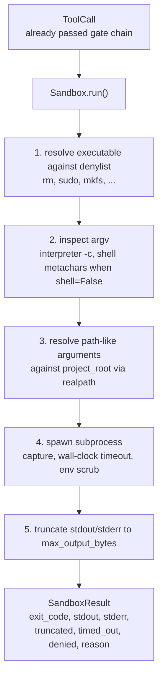
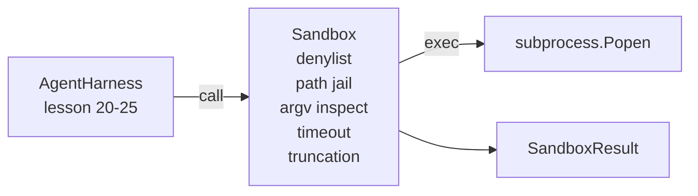

# 캡스톤 수업 26: 차단 목록 및 경로 감옥이 있는 샌드박스 러너

> 검증 게이트는 도구 호출이 실행되어야 하는지 결정합니다. 샌드박스는 실행될 때 무슨 일이 일어나는지 결정합니다. 이 수업은 위험한 실행 파일을 거부하고, 위험한 argv 형태를 거부하며, 모든 파일 경로를 프로젝트 루트로 감금하고, 크기가 큰 출력을 자르고, 벽시계 타임아웃으로 실행 중인 프로세스를 종료하는 서브프로세스 러너를 제공합니다. 이는 모델과 운영 체제 사이에 위치하는 두 계층 중 두 번째입니다.

**Type:** Build
**Languages:** Python (stdlib)
**Prerequisites:** Phase 19 · 25 (검증 게이트 및 관측 예산), Phase 14 · 33 (제약 조건으로서의 명령), Phase 14 · 38 (검증 게이트)
**Time:** 약 90분

## 학습 목표

- 타임아웃, 캡처, 자르기가 포함된 `subprocess.run`을 래핑하는 `Sandbox` 클래스를 구축합니다.
- 차단 목록에 대한 이름과 argv 검사기에 대한 구조로 명령을 거부합니다.
- 선언된 프로젝트 루트 외부로 해석되는 모든 경로 인수를 거부합니다.
- 셸 모드가 꺼져 있을 때 셸 메타문자를 거부합니다.
- 다운스트림 관측 가능성과 평가 하네스가 수집할 수 있는 구조화된 `SandboxResult`를 반환합니다.

## 문제

셸에 접근할 수 있는 코딩 에이전트는 단일 턴에 백도어를 설치하고, 키를 유출하며, 개발자 노트북을 망가뜨리고, 클라우드 비용을 쌓을 수 있습니다. 가장 저렴한 방어는 셸을 주지 않는 것입니다. 두 번째로 저렴한 것은 정밀한 패턴 목록에 대해 '아니오'라고 말하는 샌드박스입니다.

세 가지 종류의 실패가 에이전트 추적에서 반복됩니다.

첫째는 위험한 실행 파일입니다. 경로 문제를 해결해야 하는 압박을 받는 모델은 `sudo`, `chmod -R 777`, `rm -rf`, `mkfs`, `dd`를 시도합니다. 이들 중 어느 것도 에이전트 실행에 속하지 않습니다. 차단 목록이 이름과 별칭으로 잡아냅니다.

둘째는 argv 트릭입니다. 셸이 안 된다고 들은 모델은 인터프리터를 통해 공격을 파이프합니다: `python3 -c "import os; os.system('rm -rf /')"`, `bash -c '...'`, `node -e '...'`, `perl -e '...'`. 샌드박스는 `-c`류 플래그로 실행되는 모든 인터프리터가 단지 추가 단계가 있는 셸 호출이라는 것을 알아야 합니다.

셋째는 경로 이스케이프입니다. 모델은 `./src/main.py`를 읽으라고 지시받고 대신 `../../etc/passwd`를 읽습니다. 샌드박스는 `os.path.realpath`로 해석하고 접두사를 확인하여 모든 경로 인수를 감금합니다.

샌드박스는 운영 체제 의미에서의 보안 경계가 아닙니다. 코드 실행이 가능한 결정된 공격자는 여전히 탈출할 수 있습니다. 샌드박스는 개발 시간 가드레일입니다: 일반적인 실패 모드를 알리게 하고 순전한 무능으로 인한 손상을 막습니다.

## 개념



샌드박스는 네 가지 거부 축을 가집니다: 이름, argv, 경로, 구조. 각 축은 호출의 순수 함수이며, 아직 서브프로세스가 없습니다. 서브프로세스는 모든 축이 통과된 후에만 생성됩니다.

`SandboxResult` 종료 코드는 기존과 동일합니다: 0 성공, 0이 아닌 실패, 더하기 거부(-100), 타임아웃(-101), 잘림(실제 종료 코드에 플래그 설정)에 대한 세 가지 센티널 코드. 다운스트림 수업은 stderr를 파싱하는 대신 이 구조화된 결과를 읽습니다.

## 아키텍처



차단 목록은 실행 파일 기본 이름의 frozenset입니다. 별칭(`/bin/rm`, `/usr/bin/rm`)은 모두 동일한 기본 이름으로 해석됩니다. argv 검사기는 인터프리터 형태를 알고 있습니다: argv[0]이 인터프리터이고 이후 인수가 `-c` 또는 `-e`로 시작하는 모든 argv는 거부됩니다. 셸 메타문자(`;`, `|`, `&`, `>`, `<`, 백틱, `$()`)는 호출이 명시적으로 셸을 요청하지 않은 경우 거부를 유발합니다.

경로 감옥이 가장 미묘한 부분입니다. 샌드박스는 생성 시 `project_root`를 받습니다. 경로처럼 보이는 인수(`/`를 포함하거나 기존 파일과 일치)는 `os.path.realpath`를 통해 정규화된 다음 프로젝트 루트의 realpath와 비교됩니다. 해결된 대상이 루트 아래에 없으면 거부됩니다. 심볼릭 링크 이스케이프 시도(프로젝트 루트 내부에서 외부를 가리키는 심볼릭 링크)는 리터럴 경로가 아닌 realpath를 확인하여 차단됩니다.

## 구축할 것

구현은 `main.py`와 테스트 디렉토리입니다.

1. `SandboxResult` 데이터클래스: exit_code, stdout, stderr, truncated, timed_out, denied, reason, duration_ms.
2. `SandboxConfig` 데이터클래스: project_root, max_output_bytes, timeout_seconds, denylist, interpreter_block.
3. `Sandbox` 클래스: `run(argv, *, shell=False, cwd=None)`은 `SandboxResult`를 반환합니다.
4. 내부 거부 헬퍼: `_check_executable_denylist`, `_check_argv_interpreter`, `_check_shell_metachars`, `_check_path_jail`.
5. 명확한 `truncated` 플래그와 캡처된 스트림의 마커 라인이 있는 출력 자르기.
6. 하단의 데모: 합법적 및 적대적 호출의 시퀀스. 각각 결과와 함께 표시됩니다.

샌드박스는 기본적으로 `shell=False`이고 `capture_output=True`인 `subprocess.run`을 사용합니다. 벽시계 타임아웃은 `timeout` 인수를 사용합니다; `TimeoutExpired`에서 샌드박스는 프로세스 그룹을 종료하고 SandboxResult를 합성합니다.

## 이것이 실제 샌드박스가 아닌 이유

이 수업의 샌드박스는 네임스페이스, cgroups, seccomp, gVisor, Firecracker 또는 커널 수준 격리를 사용하지 않습니다. 서브프로세스가 할 수 있는 것은 샌드박스도 할 수 있습니다. 보호는 구조적입니다: 에이전트는 가장 일반적인 위험한 호출이 거부되고 큰 소리로 거부가 관측 가능성에 기록되어 무음 실행 대신 기록됩니다.

프로덕션 에이전트의 경우 그 위에 계층을 추가합니다: 권한이 없는 Docker 컨테이너 내에서 실행, microVM 내에서 실행, 기능 드롭, 프로젝트 루트를 읽기 전용으로 마운트하고 스크래치 디렉토리를 읽기-쓰기로 마운트, 메모리 및 CPU에 ulimit 설정, 환경을 알려진 안전한 허용 목록으로 정리. 29번 수업에서 이 중 일부를 다룹니다. 운영 체제 격리는 이 수업의 범위를 벗어납니다.

## 실행

```bash
cd phases/19-capstone-projects/26-sandbox-runner-denylist
python3 code/main.py
python3 -m pytest code/tests/ -v
```

데모는 임시 디렉토리를 만들고, 깨끗한 파일을 넣은 후 일련의 호출을 실행합니다. 합법적 호출은 성공합니다. 거부된 호출은 `denied=True`와 이유와 함께 SandboxResult를 반환합니다. 타임아웃은 `timed_out=True`를 반환합니다. 자르기는 `truncated=True`를 설정합니다. 데모는 결과의 JSON 테이블을 출력하고 0으로 종료됩니다.

## 트랙 A의 나머지와의 구성

25번 수업은 게이트 체인을 생성했습니다. 26번 수업은 게이트 ALLOW 후에 실행되는 실행기입니다. 27번 수업의 평가 하네스는 작업별 예상 종료 코드와 샌드박스 결과를 비교합니다. 28번 수업은 각 `Sandbox.run` 호출 주변에 `gen_ai.tool.execution` 스팬을 방출합니다. 29번 수업의 종단 간 데모는 두 계층을 통해 실제 코딩 에이전트를 연결합니다.
