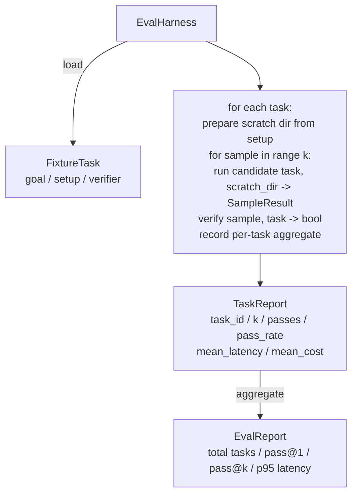

# 캡스톤 수업 27: 픽스처 작업을 통한 평가 하네스

> 코딩 에이전트는 그것을 측정하는 작업 스위트만큼만 좋습니다. 이 수업은 픽스처 작업 폴더를 가져와 각각을 후보 에이전트를 통해 실행하고, 결정론적 검증기를 통해 통과 또는 실패를 채점하며, pass@1, pass@k, 평균 레이턴시, 평균 비용으로 결과를 집계하는 평가 하네스를 구축합니다. 하네스는 회귀와 리팩터를 구분할 수 있게 하는 진실 공급원입니다.

**Type:** Build
**Languages:** Python (stdlib)
**Prerequisites:** Phase 19 · 25 (검증 게이트), Phase 19 · 26 (샌드박스 러너), Phase 14 · 30 (평가 기반 에이전트 개발), Phase 14 · 19 (SWE-bench 및 GAIA 벤치마크)
**Time:** 약 90분

## 학습 목표

- 픽스처 작업을 목표, 설정, 검증기의 세 쌍으로 정의합니다.
- 작업당 여러 샘플 실행을 채점하고 pass@1과 pass@k를 계산합니다.
- 레이턴시와 비용을 평균 및 95백분위수 메트릭으로 집계합니다.
- 결정론적 검증기(파일 diff, 종료 코드, 정규식 일치)를 재사용 가능한 함수로 연결합니다.
- 회귀 추적 스크립트가 수집할 수 있는 구조화된 JSON 보고서를 방출합니다.

## 문제

평가 하네스 없이 구축된 에이전트 벤치마크를 괴롭히는 세 가지 실패 모드가 있습니다.

첫째는 미검증 통과입니다. 에이전트가 버그를 고쳤다고 말하고, 인간이 diff를 흘낏 보고, 스위트가 초록색으로 표시되며, 3주 후 회귀 테스트가 동일한 버그를 표면화합니다. 에이전트는 실제로 아무것도 고치지 않고 그럴듯하게 추론했습니다.

둘째는 발견되지 않은 회귀입니다. 프롬프트 템플릿의 변경으로 에이전트가 중요한 작업에서 4% 더 좋아지고 조용한 작업에서 14% 더 나빠집니다. 골드셋과 작업별 점수가 없으면 회귀는 main에 탑승하여 고객이 불평할 때만 표면화됩니다.

셋째는 작업별 드리프트입니다. 평가가 월요일에 100개의 작업으로 실행되었고 금요일에 95개로 실행되었는데, 누군가 다섯 개의 픽스처 이름을 바꾸었기 때문입니다. 통과율이 5% 개선된 것처럼 보이지만 실제로는 그렇지 않습니다.

하네스는 이러한 실패를 사실로 바꾸는 프로그램입니다. 모든 픽스처를 매번, 재현 가능한 순서로, 결정론적 검사에서 참 또는 거짓을 반환하는 검증기에 대해 실행합니다.

## 개념

```mermaid
flowchart LR
  F1[fixtures/task_001/<br/>task.json + expected/] --> Harness
  F2[fixtures/task_002/<br/>...] --> Harness
  Harness[Harness<br/>for each task:<br/>setup / run agent k samples /<br/>verify each sample /<br/>record latency, cost]
  Harness --> Report[EvalReport<br/>pass@1 / pass@k<br/>mean ms / p95 ms<br/>mean cost]
```

`FixtureTask`는 작은 JSON 파일과 선택적 `expected/` 디렉토리입니다. JSON은 `id`, `goal`(에이전트에 제공되는 프롬프트), `setup` 블록(스크래치 디렉토리에 넣을 파일), `verifier` 블록을 선언합니다. 검증기 블록은 하네스의 검증기 레지스트리에서 함수 이름을 지정하고 인수를 제공합니다.

세 가지 검증기 형태가 유용한 작업의 대부분을 커버합니다.

첫째는 `file_equals`입니다. 에이전트 실행 후 명명된 파일을 예상 콘텐츠와 비교합니다. 이는 "정확히 이 방식으로 이 버그를 수정"하는 작업을 잡아냅니다.

둘째는 `regex_match`입니다. 명명된 파일의 내용이 정규식과 일치하는지 확인합니다. 이는 많은 허용 가능한 솔루션이 있는 "함수가 존재하고 X를 반환해야 함" 작업을 잡아냅니다.

셋째는 `shell_exit_zero`입니다. 하네스는 (26번 수업의 샌드박스를 통해) 셸 명령을 실행하고 명령이 0으로 종료될 때만 작업을 통과시킵니다. 이는 "테스트가 통과해야 함" 작업을 잡아냅니다.

하네스는 각 작업을 `k`번 실행합니다. Pass@k는 `1 - (1 - p)^k`이며 p는 경험적 통과율입니다; 하네스는 또한 분산을 발견할 수 있도록 원시 횟수를 보고합니다. 레이턴시는 샘플당 벽시계 시간입니다. 비용은 에이전트가 자체 보고하는 것(토큰 수, USD 또는 둘 다)입니다; 하네스는 샘플 전체에서 합산하여 작업별 및 집계 숫자를 제시합니다.

## 아키텍처



후보는 호출 가능한 것입니다: `Callable[[FixtureTask, str], SampleResult]`. 하네스는 `tempfile.mkdtemp()`를 통해 스크래치 디렉토리를 생성하고 경로를 일반 문자열로 전달합니다. 하네스는 후보가 어떻게 작동하는지 상관하지 않습니다. 후보는 결정론적 패치 적용기(하네스 자체 테스트에 유용), 실제 LLM 에이전트, 퍼저가 될 수 있습니다. 계약은 SampleResult입니다.

## 구축할 것

`main.py`는 다음을 제공합니다:

1. `FixtureTask` 데이터클래스.
2. `SampleResult` 데이터클래스: success_self_reported, latency_ms, cost_units, edits.
3. `TaskReport`, `EvalReport` 데이터클래스와 `to_dict()`.
4. 검증기 이름을 함수에 매핑하는 `VerifierRegistry`. 내장 검증기: file_equals, regex_match, shell_exit_zero.
5. `EvalHarness` 클래스. 후보에 대한 작업 디렉토리를 실행합니다. EvalReport를 반환합니다.
6. `tasks/`에 번들된 다섯 개의 픽스처 작업:
   - fizzbuzz의 off-by-one 오류
   - factorial의 반환 누락
   - 오류 메시지의 오타
   - 빈 함수 본문
   - 연결 리스트 순회의 off-by-one 오류
7. 하네스가 깨끗한 pass@1 1.0을 시연하는 데 사용하는 결정론적 참조 후보(`apply_known_fixes`).
8. EvalReport JSON을 출력하고 0으로 종료되는 데모.

픽스처 작업은 `tasks/`의 JSON 파일과 `tasks/<id>/buggy/` 및 `tasks/<id>/expected/`의 짝을 이루는 소스 파일로 번들됩니다. 하네스는 buggy를 스크래치 디렉토리에 복사하고, 후보에게 전달하며, expected에 대해 검증합니다.

## pass@k가 pass@1만이 아닌 이유

실제 LLM 에이전트는 확률적입니다. pass@1 0.6은 실패처럼 보입니다. pass@5 0.95는 에이전트가 대부분의 시간에 올바른 답을 얻지만 초기 샘플에서 잘못 선택하고 있음을 말합니다. 수정 방법은 항상 더 많은 학습이 아닌 샘플링과 순위 지정입니다. Pass@k가 이를 보이게 합니다.

Pass@k는 pass@1과 함께 보고됩니다. pass@k는 실제 실패를 가리기 때문입니다: 모델이 20번 시도 중 한 번 올바른 답을 얻는다면 유용한 에이전트가 아닙니다. 하네스는 둘 다 보여줍니다.

## 트랙 A의 나머지와의 구성

25번 수업은 게이트 체인을 생성했습니다. 26번 수업은 샌드박스를 생성했습니다. 하네스는 `shell_exit_zero` 검증기에 샌드박스를 사용합니다. 28번 수업은 각 하네스 실행을 OTel 추적으로 래핑합니다. 29번 수업은 번들된 픽스처 중 하나에 대해 종단 간 데모를 실행하고 참조 후보에 대해 pass@1 = 1.0을 주장합니다.

## 실행

```bash
cd phases/19-capstone-projects/27-eval-harness-fixture-tasks
python3 code/main.py
python3 -m pytest code/tests/ -v
```

데모는 pass@1, pass@5, 평균 레이턴시, 작업별 분석을 포함한 EvalReport를 JSON으로 출력합니다. 종료 코드는 0입니다. 테스트는 검증기 함수, pass@k 수학, 픽스처 로딩, 번들된 참조 후보에 대한 하네스 종단 간을 커버합니다.
