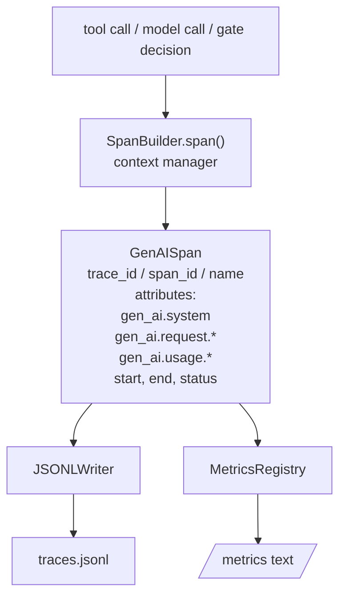
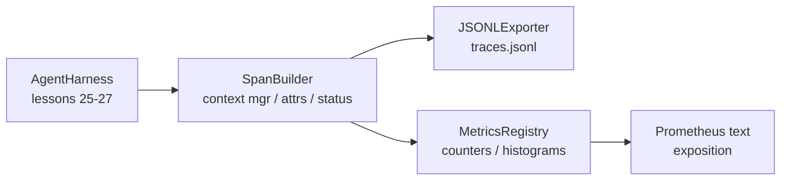

# 캡스톤 수업 28: OTel GenAI 스팬 및 Prometheus 메트릭을 통한 관측 가능성

> 관측 가능성이 없는 에이전트 하네스는 비용이 드는 블랙박스입니다. 이 수업은 OpenTelemetry GenAI 시맨틱 규칙을 준수하는 레코드를 방출하고, 스팬당 한 줄씩 JSON-Lines 파일에 쓰며, Prometheus 텍스트 형식으로 카운터와 히스토그램을 노출하는 스팬 빌더를 직접 만듭니다. 전체가 stdlib Python으로 작성되었으며 오프라인에서 실행됩니다.

**Type:** Build
**Languages:** Python (stdlib)
**Prerequisites:** Phase 19 · 25 (검증 게이트), Phase 19 · 26 (샌드박스), Phase 19 · 27 (평가 하네스), Phase 13 · 20 (OpenTelemetry GenAI), Phase 14 · 23 (OTel GenAI 규칙)
**Time:** 약 90분

## 학습 목표

- OpenTelemetry GenAI 시맨틱 규칙에 맞춰진 스팬 데이터 클래스를 구축합니다.
- 줄당 하나의 자체 포함 스팬을 쓰는 JSONL 익스포터를 구현합니다.
- 레이블과 Prometheus 텍스트 형식 노출이 있는 카운터와 히스토그램을 구축합니다.
- 지속 시간, 상태, 예외를 기록하는 스팬 컨텍스트 관리자로 호출 가능한 모든 것을 래핑합니다.
- 방출된 스팬이 `json.loads`를 통해 왕복하고 명세 형태와 일치하는지 확인합니다.

## 문제

프로덕션의 코딩 에이전트는 매 턴마다 세 가지 종류의 아티팩트를 생성합니다: 모델 호출, 도구 실행, 검증 게이트 결정. 이들 중 어느 것도 구조화된 원격 측정 없이는 유용하지 않습니다.

첫 번째 실패 모드는 누락된 추적입니다. 화요일에 무언가 잘못되었지만 유일한 기록은 500줄짜리 채팅 로그입니다. 어떤 도구가 실행되었는지, 얼마나 걸렸는지, 프롬프트에 얼마나 많은 토큰이 들어갔는지, 게이트가 무언가를 거부했는지에 대한 기록이 없습니다. 에이전트 작성자는 추측해야 합니다.

두 번째 실패 모드는 파싱 불가능한 추적입니다. 하네스가 스팬을 작성했지만 자체 임시 필드 이름을 사용했습니다. Grafana, Honeycomb, Jaeger 또는 로컬 CLI에서 읽을 수 있는 것이 없습니다. 팀 스택에 존재하는 도구는 스팬이 비표준이기 때문에 낭비됩니다.

세 번째 실패 모드는 집계되지 않은 메트릭입니다. 추적에서 하나의 느린 도구 호출을 볼 수 있지만 "지난 1시간 동안 read_file 호출의 p95 레이턴시는 얼마인가?"에 답할 수 없습니다. 메트릭이 없고 추적만 있기 때문입니다.

OpenTelemetry GenAI 시맨틱 규칙이 정확히 이것을 위해 존재합니다. 이들은 LLM 프레임워크 전반의 스팬 이미터가 공유하는 작은 표준 속성 집합을 정의합니다. 하네스가 해당 속성을 작성하면 모든 OTel 호환 백엔드가 읽을 수 있습니다.

## 개념



하네스의 모든 작업은 스팬을 생성합니다. 스팬에는 추적 ID(전체 에이전트 호출), 스팬 ID(이 하나의 작업), 이름(예: `gen_ai.chat`, `gen_ai.tool.execution`), GenAI 규칙을 따르는 속성, 시작 및 종료 시간, 상태가 있습니다.

GenAI 규칙은 이러한 속성 키를 표준화합니다: `gen_ai.system` (제공자, 예: `anthropic`, `openai`), `gen_ai.request.model` (모델 ID), `gen_ai.request.max_tokens`, `gen_ai.usage.input_tokens`, `gen_ai.usage.output_tokens`, `gen_ai.response.model`, `gen_ai.response.id`, `gen_ai.operation.name`, 더하기 도구별 키 `gen_ai.tool.name` 및 `gen_ai.tool.call.id`.

익스포터는 JSONL을 씁니다. 줄당 하나의 JSON 객체입니다. 이것은 다운스트림 도구가 스트리밍, grep, 가져오기할 수 있는 가장 간단한 가능한 형식입니다. 실제 OTel 익스포터는 OTLP gRPC를 사용합니다; 이 수업의 JSONL 익스포터는 오프라인 등가물이며 모든 워크스테이션에서 0으로 종료됩니다.

메트릭은 추적 옆에 있습니다. 각 도구 호출에서 카운터가 증가합니다: `tools_called_total{tool="read_file"}`. 히스토그램은 관찰된 레이턴시를 기록합니다: `tool_latency_ms{tool="read_file"}`. 둘 다 풀 기반 메트릭의 사실상 표준인 Prometheus 텍스트 노출 형식으로 직렬화됩니다.

## 아키텍처



스팬 빌더는 `span(name, attrs)` 메서드가 컨텍스트 관리자를 반환하는 작은 클래스입니다. 컨텍스트 관리자는 진입 시 시작 시간을 기록하고, 종료 시 종료 시간을 기록하며, 예외가 발생하면 첨부하고, 완성된 스팬을 익스포터에 푸시합니다.

메트릭 레지스트리는 두 개의 딕셔너리입니다. 카운터는 `{(name, frozen_labels): int}`입니다. 히스토그램은 리스트에 원시 샘플을 보관하고 노출 시 Prometheus 히스토그램 버킷으로 직렬화합니다.

## 구축할 것

`main.py`는 다음을 제공합니다:

1. `GenAISpan` 데이터클래스: trace_id, span_id, parent_span_id, name, attributes, start_unix_nano, end_unix_nano, status, status_message, events.
2. `SpanBuilder` 클래스와 `span(name, attrs, parent=None)` 컨텍스트 관리자.
3. `JSONLExporter` 클래스와 `export(span)` (한 줄 추가).
4. `Counter` 및 `Histogram` 클래스와 `MetricsRegistry`.
5. 텍스트 형식 출력을 생성하는 `prometheus_exposition(registry)`.
6. 스팬을 방출하고 메트릭을 업데이트하는 `wrap_tool_call(name)` 데코레이터.
7. 데모: 완전한 에이전트 호출을 합성하고(도구 스팬 주변의 gen_ai.chat 스팬), traces.jsonl을 쓰고, Prometheus 노출을 출력하며, 0으로 종료됩니다.

스팬 ID와 추적 ID는 `os.urandom`에서 생성된 16바이트 16진수 문자열입니다. 이는 OTel의 W3C 추적 컨텍스트와 일치합니다. 익스포터는 절대 예외를 발생시키지 않습니다; IO 오류는 표면화되지만 하네스는 계속 실행됩니다.

히스토그램은 고정 버킷 집합(밀리초 단위 레이턴시에 대한 OTel 기본값: 5, 10, 25, 50, 100, 250, 500, 1000, 2500, 5000, 10000, +Inf)을 가집니다. 샘플은 리스트로 저장됩니다; 노출은 요청 시 버킷별 개수를 계산합니다.

## opentelemetry-sdk 대신 직접 만든 이유

OTel Python SDK는 실제 의존성입니다. 또한 수천 줄의 코드, OTLP 익스포터를 위한 여러 프로세스, 수업 예산을 압도하는 런타임 비용이 있습니다. 직접 만든 버전은 와이어 형식을 가르칩니다. 프로덕션에서는 동일한 속성을 실제 SDK에 연결하고 OTLP 익스포터, 배치, 리소스 감지를 무료로 얻습니다.

규칙은 안정적입니다. 이 수업이 방출하는 와이어 형식은 2030년에도 계속 파싱될 것입니다. OTel이 GenAI 속성 이름을 절대 깨뜨리지 않고 새 속성만 추가하기 때문입니다.

## 트랙 A의 나머지와의 구성

25번 수업은 게이트 체인을 생성했습니다. 26번 수업은 샌드박스를 생성했습니다. 27번 수업은 평가 하네스를 생성했습니다. 28번 수업은 세 가지 모두를 관측 가능하게 만듭니다. 29번 수업은 종단 간 데모의 모든 단계를 스팬으로 래핑하고 마지막에 Prometheus 텍스트를 출력합니다.

## 실행

```bash
cd phases/19-capstone-projects/28-observability-otel-traces
python3 code/main.py
python3 -m pytest code/tests/ -v
```

데모는 수업 작업 디렉토리에 `traces.jsonl`을 방출하고(마지막에 정리됨), 세 개의 스팬 샘플을 출력한 다음, 카운터와 히스토그램에 대한 Prometheus 노출을 출력합니다. 테스트는 스팬이 왕복 직렬화되는지, 표준 GenAI 속성이 존재하는지, 카운터가 올바르게 증가하는지, 히스토그램 노출에 예상 버킷 개수가 포함되어 있는지 확인합니다.
