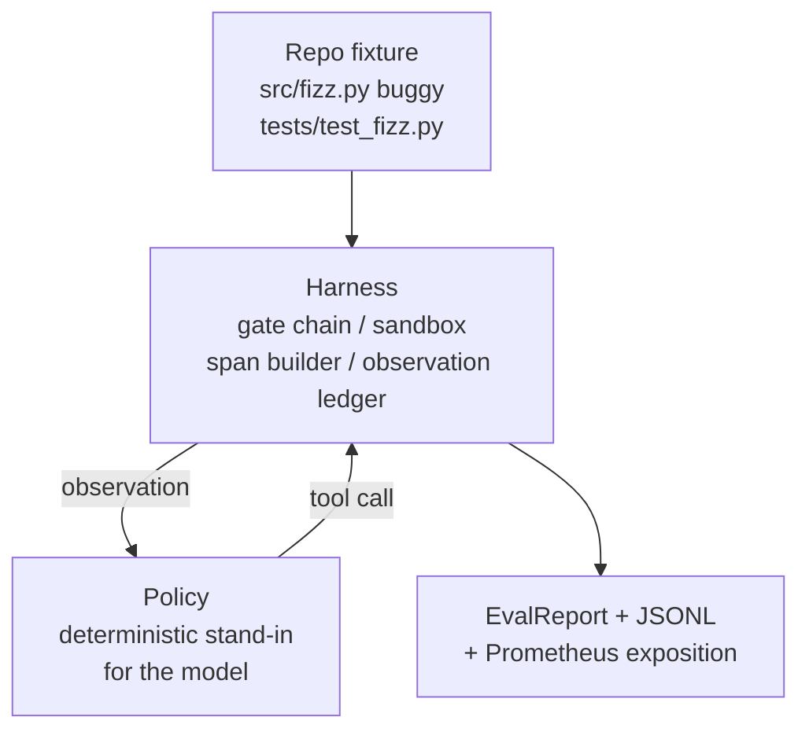
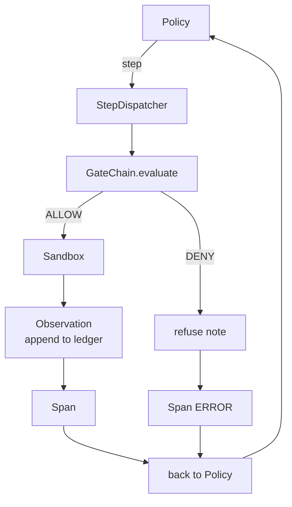

# 캡스톤 수업 29: 하네스 위의 종단 간 코딩 에이전트

> 트랙 A의 결과물입니다. 이 수업은 게이트 체인, 샌드박스, 평가 하네스, OTel 스팬을 하나의 작동하는 코딩 에이전트로 연결하여 다중 파일 Python 프로젝트의 실제(작은, 픽스처 규모) 버그를 수정합니다. 에이전트는 LLM이 아닌 결정론적 정책입니다; 이러한 대체는 수업을 재현 가능하게 만들고 하네스가 항상 흥미로운 부분이었음을 보여줍니다. 계약은 동일합니다: 실제 모델이 정책 연결점에 연결됩니다.

**Type:** Build
**Languages:** Python (stdlib)
**Prerequisites:** Phase 19 · 25 (검증 게이트), Phase 19 · 26 (샌드박스), Phase 19 · 27 (평가 하네스), Phase 19 · 28 (관측 가능성), Phase 14 · 38 (검증 게이트), Phase 14 · 41 (실제 저장소를 위한 워크벤치), Phase 14 · 42 (에이전트 워크벤치 캡스톤)
**Time:** 약 90분

## 학습 목표

- 게이트 체인, 샌드박스, 평가 하네스, 스팬 빌더를 단일 에이전트 루프로 구성합니다.
- read_file, run_tests, write_file을 사용하여 픽스처 버그를 수정하는 결정론적 정책을 구현합니다.
- 종단 간 실행에서 전역 단계 예산과 관측 토큰 예산을 적용합니다.
- 전체 실행에 대한 완전한 OTel GenAI 추적 및 Prometheus 메트릭을 방출합니다.
- 에이전트가 합법적 도구에서 게이트 트립 없이 12단계 미만으로 픽스처를 해결하는지 확인합니다.

## 문제

대부분의 에이전트 데모는 개별적으로 작동합니다: 샌드박스만, 평가 하네스만, 스팬 이미터만. 괜찮아 보입니다. 이들을 구성하면 연결점이 드러납니다.

게이트 체인이 ALLOW를 말하지만 샌드박스가 체인이 예상하지 못한 이유로 거부합니다. 평가 하네스는 통과를 기록하지만 OTel 스팬은 게이트가 에이전트가 사용했다고 주장하는 도구를 거부했다고 말합니다. Prometheus 카운터가 한 번 증가해야 하는데 두 번 증가합니다. 관측 예산이 초과되었지만 예산이 체인에서 추적되었고 샌드박스가 몰랐기 때문에 에이전트가 계속 진행했습니다.

이 수업은 전체 트랙에 대한 통합 테스트입니다. 에이전트는 순서대로 네 가지 작업을 수행해야 합니다: 프로젝트 읽기, 테스트 실행, 테스트 실패에서 버그 식별, 수정 사항 작성, 테스트 재실행, 중지. 모든 작업은 게이트 체인을 통과합니다. 모든 도구 실행은 샌드박스를 통과합니다. 모든 단계는 스팬으로 래핑됩니다. 평가 하네스는 마지막에 전체를 채점합니다.

## 개념



에이전트의 정책은 상태 머신입니다. 다섯 가지 상태입니다.

`SURVEY`: 에이전트가 프로젝트 목록을 읽습니다. 다음 상태는 RUN_TESTS입니다.

`RUN_TESTS`: 에이전트가 테스트 명령을 실행합니다. 테스트가 통과하면 상태 머신이 성공으로 중단됩니다. 그렇지 않으면 다음 상태는 INSPECT입니다.

`INSPECT`: 에이전트가 실패하는 소스 파일을 읽습니다. 다음 상태는 FIX입니다.

`FIX`: 에이전트가 수정된 파일을 씁니다. 다음 상태는 VERIFY입니다.

`VERIFY`: 에이전트가 테스트 명령을 다시 실행합니다. 테스트가 통과하면 성공으로 중단됩니다. 그렇지 않으면 실패로 중단됩니다.

각 상태는 도구 호출에 해당합니다. 각 도구 호출은 게이트 체인을 통과합니다. 도구 호출이 거부되면 에이전트는 추적에서 거부를 보고하고 중단됩니다.

픽스처 버그는 `fizz.py`의 off-by-one 오류입니다. 결정론적 정책은 정규식을 통해 테스트 실패 메시지에서 버그를 감지하고 수정된 파일을 방출합니다. 정책을 LLM으로 교체해도 하네스 계약은 변경되지 않습니다.

## 아키텍처



수업은 자체 포함됩니다. 각 이전 수업의 프리미티브가 `main.py`에서 최소 규모로 재구현됩니다(게이트, 샌드박스, 원장, 스팬). 수업이 형제를 가져오지 않고 실행될 수 있도록 합니다. 이름은 수업 25-28과 정확히 일치하므로 개념적 매핑이 명확합니다.

## 구축할 것

`main.py`는 다음을 제공합니다:

1. 수업 25-28과 동일한 이름으로 복사된 최소 하네스 프리미티브: `GateChain`, `Sandbox`, `ObservationLedger`, `SpanBuilder`, `MetricsRegistry`.
2. `CodingAgentPolicy` 클래스: 다섯 가지 상태를 가진 상태 머신.
3. `Repo` 헬퍼: 번들된 버그 픽스처로 스크래치 디렉토리를 준비합니다.
4. `AgentRun` 클래스: 정책을 구동하고, 하네스를 통해 디스패치하며, `AgentRunReport`를 반환합니다.
5. 번들된 픽스처(`fixture_repo/`): src/fizz.py, tests/test_fizz.py, 평가 하네스를 위한 expected/ 트리.
6. 데모: 정책을 종단 간 실행하고, 단계별 추적을 출력하며, 통과를 주장하고, 메트릭을 출력합니다.

번들된 픽스처는 27번 수업의 작업 구조와 동일한 형태입니다: 버그 파일과 테스트 파일. 테스트 실패 메시지에는 결정론적 정책이 수정 사항을 식별하기에 충분한 정보가 포함되어 있습니다. 실제 LLM은 더 느리고 더 넓은 리콜로 동일한 작업을 수행하지만 하네스의 기대는 변경되지 않습니다.

## 정책이 LLM이 아닌 이유

실제 LLM은 API 키, 네트워크 호출, 검증 불가능한 확률성이 필요합니다. 하네스가 이 수업이 신경 쓰는 부분입니다. 결정론적 정책을 사용하면 수업이 외부 의존성 없이 모든 개발자 노트북에서 실행될 수 있고, 테스트 스위트가 정확한 단계 수를 주장할 수 있습니다.

이 수업의 정책은 LLM 에이전트가 하는 일의 엄격한 서브셋입니다. 정책은 저장소를 읽고, 실패하는 테스트를 보고, 줄을 식별하고, 수정 사항을 방출합니다. LLM은 동일한 하네스 계약으로 동일한 루프를 거칩니다; 장부는 동일합니다.

## 데모가 주장하는 것

종단 간 데모는 종료 시 다섯 가지를 주장하고, 테스트 스위트는 프로그래밍 방식으로 재주장합니다.

정책이 12단계 미만으로 픽스처를 해결했습니다.

관측 예산이 초과되지 않았습니다.

합법적 도구에서 게이트 거부가 0회였습니다. (에이전트가 거부된 도구 이름을 발명하지 않았습니다.)

모든 단계에 traces.jsonl에 해당 스팬이 있습니다.

Prometheus 노출에 `tools_called_total{tool="read_file"}` 항목과 `tool_latency_ms` 히스토그램이 포함되어 있습니다.

## 트랙 A의 나머지와의 구성

이 수업은 통합입니다. 25번 수업은 게이트 체인을 작성했습니다. 26번 수업은 샌드박스를 작성했습니다. 27번 수업은 평가 하네스를 작성했습니다. 28번 수업은 관측 가능성을 작성했습니다. 29번 수업은 이들이 시스템으로 작동함을 증명합니다. 실제 에이전트 하네스는 여기서 확장됩니다: 결정론적 정책을 모델로 교체하고, 번들된 픽스처를 실제 저장소 작업으로 교체하며, JSONL 익스포터를 OTLP로 교체합니다.

## 실행

```bash
cd phases/19-capstone-projects/29-end-to-end-coding-task-demo
python3 code/main.py
python3 -m pytest code/tests/ -v
```

데모는 단계별 추적, 최종 평가 보고서, Prometheus 노출을 출력합니다. 종료 코드는 0입니다. 테스트는 정책 상태 전환, 합성 도구 호출에 대한 게이트 거부, 번들된 픽스처에 대한 종단 간 실행, 단계 예산 불변 조건을 커버합니다.
