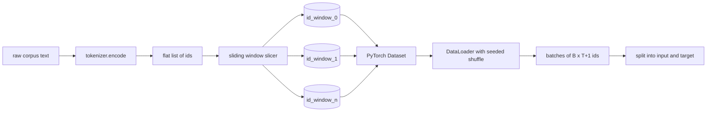
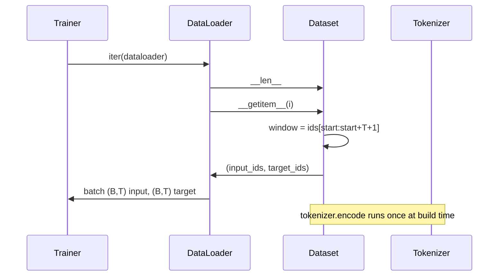

# 토큰화 데이터셋과 슬라이딩 윈도우

> 사전 학습 실행은 토큰 ID에서 그래디언트로의 함수입니다. 이 수업은 ID를 공급하는 컨베이어를 구축합니다.

**Type:** Build
**Languages:** Python
**Prerequisites:** Phase 04 수업, Phase 07 트랜스포머 수업, 이 Phase의 수업 30
**Time:** 약 90분

## 학습 목표
- 토크나이저를 한 번 호출하여 원시 코퍼스를 토큰 ID 스트림으로 변환합니다.
- 구성 가능한 오버랩 스트라이드로 ID 스트림을 고정 길이 윈도우로 슬라이싱합니다.
- 다음 토큰 예측을 위한 입력 및 타겟 텐서를 반환하는 PyTorch Dataset을 구축합니다.
- 에포크별 시드된 결정론적 셔플로 데이터셋을 DataLoader에 래핑합니다.
- 스트라이드, 중복, 유효 데이터셋 크기 간의 트레이드오프를 추론합니다.

## 프레임

사전 학습 실행은 한 번에 하나의 배치 토큰 ID를 읽고 모델을 업데이트합니다. 각 배치의 형태는 학습 계약에 의해 고정됩니다. 인과 언어 모델의 경우 배치는 `(B, T)` 입력 ID와 `(B, T)` 타겟 ID를 보유하며, 타겟은 입력을 왼쪽으로 하나씩 이동시킨 것입니다. 데이터 파이프라인의 작업은 수 기가바이트의 원시 텍스트일 수 있는 코퍼스에서 이 계약을 요청 시, 결정론적이고 재현 가능한 방식으로 생성하는 것입니다.

이 수업은 파이프라인을 구축합니다. 이전 수업의 토크나이저는 텍스트를 긴 평면 ID 목록으로 변환합니다. 슬라이딩 윈도우가 이 목록을 학습 예제로 슬라이싱합니다. 사용자 정의 Dataset이 예제를 텐서로 노출합니다. DataLoader가 이를 배치하고 알려진 시드로 셔플합니다.

## 형태 계약

인과 LM은 `(B, T)` 형태의 ID를 소비하며, `B`는 배치 크기, `T`는 컨텍스트 길이입니다. 위치 `t`의 타겟은 위치 `t+1`의 입력입니다. 즉, 모든 학습 예제는 `T+1`개의 원시 ID를 커버합니다. 윈도우 스트라이드는 연속 예제 간의 중복 양을 제어합니다.

슬라이서는 코퍼스의 경계와 절대 겹치지 않습니다. 마지막 윈도우에 `T+1` 위치를 채울 ID가 충분하지 않으면 슬라이서는 이를 버립니다. 패딩 토큰으로 꼬리를 채우는 것도 유효한 선택이지만 손실 마스크가 복잡해집니다. 이 수업에서는 버리는 방식을 사용합니다.

## 슬라이딩 윈도우가 필요한 이유

사전 학습 코퍼스는 하나의 긴 ID 스트림입니다. 모델이 겹치지 않는 윈도우만 보았다면 모든 학습 예제가 동일한 `T` 경계를 가르칠 것입니다. 스트라이드를 조정하면 경계가 이동하여 모델이 더 다양한 다음-토큰-예측 작업을 보게 됩니다.

스트라이드가 `T`이면 겹치지 않는 윈도우가 생성됩니다. 스트라이드가 `T // 2`이면 50% 중복을 생성하고 유효 데이터셋을 두 배로 늘립니다. 스트라이드가 `1`이면 최대 중복을 생성하고 데이터셋을 `T` 배수로 증가시킵니다. 비용은 에포크당 더 많은 계산입니다. 이점은 더 많은 경계 다양성입니다. 대부분의 사전 학습 실행은 코퍼스가 이미 모델이 한 에포크에 완료할 수 있는 것보다 훨씬 크기 때문에 컨텍스트 길이와 동일한 스트라이드를 사용합니다.

## Dataset 클래스

PyTorch Dataset에는 두 가지 필수 메서드가 있습니다. `__len__`은 예제 수를 반환합니다. `__getitem__`은 하나의 예제를 텐서 쌍으로 반환합니다. 우리의 Dataset은 인코딩된 ID 스트림과 스트라이드를 저장합니다. 인덱싱은 즉석에서 윈도우의 시작을 계산하므로 스트라이드가 생성하는 예제 수에 관계없이 메모리 비용은 ID 스트림의 복사본 하나입니다.

한 칸씩 밀기는 `__getitem__` 내부에서 발생합니다. Dataset은 `(input, target)`을 반환하며, `input = window[:-1]`이고 `target = window[1:]`입니다. 둘 다 PyTorch long 텐서입니다. 학습 루프는 이를 ground truth로 취급합니다.

## 결정론적 셔플

`shuffle=True`인 DataLoader는 PyTorch 난수 생성기에서 읽습니다. 에포크별로 시드된 명시적 `torch.Generator`를 전달하면 실행이 다시 시작될 때마다 동일한 셔플을 얻을 수 있습니다. 이 속성은 단일 하이퍼파라미터만 다른 두 실행을 비교하려는 경우에 중요합니다. 시드가 없으면 두 실행이 데이터를 다른 순서로 보고 손실 곡선이 변경과 무관한 이유로 발산합니다.

이 수업의 시드 계약은 간단합니다. `epoch_seed = base_seed + epoch_index`입니다. 기본 시드는 생성 시 전달됩니다. 에포크 인덱스는 각 에포크의 시작에서 트레이너에 의해 증가됩니다. 동일한 기본 시드로 재실행하면 항상 모든 에포크에서 동일한 순서를 봅니다.

## 배치 샘플러

PyTorch의 기본 샘플러는 교체 없이 균일하게 무작위로 인덱스를 선택합니다. 이것이 사전 학습에 원하는 것입니다. 작은 데이터셋의 파인튜닝에도 계약은 동일합니다. DataLoader는 `__getitem__`을 `B`번 호출하고 결과를 스택하여 배치를 조립합니다. 모든 예제가 구조상 동일한 길이이므로 패딩 로직이 필요 없습니다.

이 수업은 단순화를 위해 `num_workers=0`을 유지합니다. 프로덕션 실행에서는 워커가 `__getitem__` 호출을 병렬화합니다. 우리의 파이프라인에서는 작업이 메모리 내 텐서의 슬라이스일 뿐이므로 대부분 no-op이지만, 동일한 Dataset API가 워커를 깔끔하게 지원합니다.

## 예제 수 계산

길이 `N`의 ID 스트림, 컨텍스트 길이 `T`, 스트라이드 `S`에 대해 예제 수는 `max(0, 1 + (N - (T + 1)) // S)`입니다. 이 수업은 해당 계산을 Dataset의 정적 메서드로 노출하여 트레이너가 반복 없이 에포크당 총 단계 수를 계산할 수 있게 합니다.

## 이 수업이 하지 않는 것

디스크에서 스트리밍하지 않습니다. 코퍼스는 메모리에 완전히 인코딩되어 단일 텐서로 유지됩니다. 수백만 ID의 코퍼스의 경우 100MB 미만이며 수업에 적합한 형태입니다. 디스크 스트리밍은 저장소를 교체하지만 Dataset 계약을 유지함으로써 연결되는 별도의 관심사입니다.

여러 문서를 처리하지 않습니다. 코퍼스는 하나의 연속적인 ID 스트림으로 취급됩니다. 코퍼스가 여러 문서로 구축될 때 `<|endoftext|>` ID를 삽입하여 다음 문서 경계가 인코딩됩니다. 모델은 경계 주변을 예측하는 방법을 학습합니다.

## 코드 읽는 방법

`main.py`는 두 개의 클래스와 하나의 헬퍼를 정의합니다. `SlidingWindowDataset`는 PyTorch Dataset입니다. `make_dataloader`는 시드된 생성기로 구성된 DataLoader를 반환합니다. `_encode_corpus_to_ids`는 단발성 토크나이저 호출입니다. 하단의 데모는 프로세스 내에서 작은 토크나이저를 구축하고, 내장 코퍼스를 인코딩하며, 데이터셋과 데이터로더를 구성하고, 하나의 배치를 출력하며, 형태 계약을 주장합니다. `code/tests/test_dataset.py`의 테스트는 윈도우 수 공식, 한 칸씩 밀기 속성, 결정론적 셔플, 스트라이드 트레이드오프를 고정합니다.

데모를 실행하세요. 그런 다음 컨텍스트 길이를 16에서 32로 변경하고 에포크당 예제 수가 어떻게 줄어드는지 확인하세요. 그 숫자가 단계-에포크당 예산입니다.
