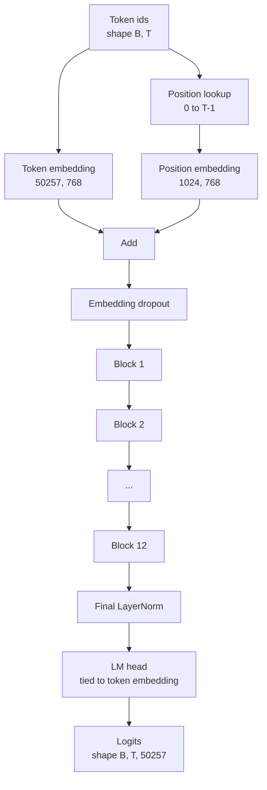
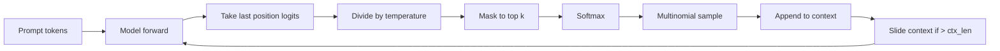

# GPT 모델 조립

> 열두 개의 블록을 쌓고, 토큰 임베딩, 학습된 위치 임베딩, 최종 LayerNorm, 그리고 연결된 언어 모델 헤드. 이것이 전체 1억 2400만 파라미터 GPT 모델입니다. 이 레슨에서는 이 조각들을 조립하여 작동하는 클래스를 만들고, 파라미터 수를 계산하여 모델이 참조 124M 형태와 일치하는지 확인하며, multinomial 샘플링, temperature, top-k를 사용하여 텍스트를 생성합니다.

**Type:** Build
**Languages:** Python
**Prerequisites:** Phase 19 lessons 30 to 34
**Time:** ~90 minutes

## Learning Objectives

- 레슨 34의 트랜스포머 블록을 완전한 GPT 모델로 조립: 토큰 임베딩, 위치 임베딩, N개 블록, 최종 LayerNorm, 언어 모델 헤드.
- 1억 2400만 파라미터 설정 재현: vocab 50257, context 1024, embedding 768, 12개 헤드, 12개 레이어.
- 언어 모델 헤드 가중치를 토큰 임베딩에 연결하고 이것이 이 스케일에서 약 3800만 파라미터를 절약하는 이유를 설명.
- 프롬프트에서 multinomial 샘플링, temperature 스케일링, top-k 절단을 사용하여 텍스트를 생성하고 슬라이딩 윈도우로 컨텍스트 길이 유지.
- 파라미터 수와 순전파 비용을 124M 목표와 비교 측정.

## The Problem

트랜스포머 블록은 단독으로 아무것도 하지 않습니다. 토큰 ID를 벡터로 바꾸고, 위치 정보를 혼합하고, 스택을 통과시키고, 어휘 로짓으로 다시 투영해야 합니다. 이 네 단계 중 하나라도 빼먹으면 모델이 순전파에 실패하거나, 위치 정보에서 표류하거나, 말을 할 수 없게 됩니다.

모델의 형태도 중요합니다. 참조 GPT-2 small은 위의 정확한 설정에서 1억 2400만 파라미터입니다. 숫자는 마법이 아닙니다. Vocab 50257 곱하기 embedding 768이 토큰 테이블입니다. Position 1024 곱하기 768이 위치 테이블입니다. 각각 약 700만 파라미터인 12개 블록은 8400만입니다. 최종 헤드는 weight tying을 통해 토큰 테이블을 재사용합니다. 조각들을 합하면 1억 2400만이 됩니다. 파라미터 수가 참조와 일치하지 않는 모델을 구축하는 것은 무언가 잘못 연결했다는 신호입니다.

## The Concept



토큰 ID는 토큰 벡터가 됩니다. 위치 ID는 위치 벡터가 됩니다. 둘은 더해져서 스택을 통과합니다. 최종 LayerNorm은 모든 현대 변형에서 살아남는 블록 외부의 한 조각입니다. LM 헤드는 토큰 임베딩 행렬을 재사용하며, 이것이 weight tying이 의미하는 바입니다.

### Weight tying

토큰 임베딩은 `(vocab, d_model)` 형태를 가집니다. 언어 모델 헤드는 `d_model`에서 `vocab`으로 다시 투영해야 합니다. 이들은 서로의 전치입니다. 둘을 연결한다는 것은 말 그대로 동일한 파라미터 텐서를 두 번 사용한다는 의미입니다. Vocab 50257과 d_model 768에서 행렬은 3800만 파라미터입니다. 연결하지 않으면 두 번 비용을 지불합니다. 연결하면 한 번만 지불하고, 임베딩과 헤드가 함께 업데이트되므로 약간 더 깨끗한 그래디언트 신호를 얻을 수 있습니다.

### Position embedding is learned, not sinusoidal

GPT-2는 학습된 위치 임베딩을 사용합니다. 위치 테이블은 `(1024, 768)` 형태의 하나의 파라미터 텐서입니다. 모델은 매 순전파마다 위치 0부터 T-1까지를 조회하고 그 결과를 토큰 임베딩에 더합니다. 이것은 가장 간단한 위치 방식(RoPE, ALiBi, T5 상대적 편향이 대안)이며 124M 참조가 사용하는 방식입니다.

### Generation: temperature, top-k, multinomial

생성은 자기회귀적입니다. 매 단계마다 모델은 모든 위치에서 전체 어휘에 대한 로짓을 반환합니다. 마지막 위치만 가져와서 temperature로 나누고, 선택적으로 상위 k개 로짓만 남기고 나머지를 음의 무한대로 마스킹한 후, softmax로 확률을 구하고, 결과 분포에서 하나의 토큰을 샘플링합니다.



세 개의 노브, 세 가지 다른 동작. Temperature가 0에 가까우면 greedy로 수렴합니다. Temperature 1은 모델의 자연 분포와 일치합니다. Top-k 1은 greedy입니다. Top-k 40는 긴 꼬리를 필터링합니다. 조합이 중요합니다; 다음 훈련 레슨에서는 생성을 정성적 평가 신호로 사용합니다.

## Build It

`code/main.py` implements:

- 124M 기본값을 가진 `class GPTConfig` 데이터클래스: `vocab_size=50257`, `context_length=1024`, `d_model=768`, `num_heads=12`, `num_layers=12`, `mlp_expansion=4`, `dropout=0.1`, `use_bias=True`, `weight_tying=True`.
- 토큰 임베딩, 위치 임베딩, 임베딩 드롭아웃, 12개의 `TransformerBlock`, 최종 LayerNorm, 그리고 플래그가 설정될 때 토큰 임베딩에 연결되는 `lm_head`를 가진 `class GPTModel`.
- 고유 파라미터 수를 반환하는 `count_parameters` 헬퍼(weight tying이 카운트에 반영됨).
- temperature, top-k, multinomial 및 슬라이딩 윈도우 컨텍스트를 수행하는 `generate` 함수.
- 모델을 구축하고, 파라미터 수를 참조 124M과 함께 출력하고, 고정 프롬프트에서 짧은 시퀀스를 생성하여 파이프라인이 처음부터 끝까지 작동함을 보여주는 데모.

Run it:

```bash
python3 code/main.py
```

출력: 124M 참조와 함께 파라미터 수, 랜덤 프롬프트에서 생성된 토큰 ID, 그리고 LM 헤드와 토큰 임베딩이 tying이 켜져 있을 때 저장소를 공유한다는 확인.

데모를 빠르게 유지하기 위해 스크립트는 작은 설정(`d_model=64`, `num_layers=2`)도 처음부터 끝까지 실행하고 생성된 토큰 시퀀스를 인라인으로 출력합니다. 124M 설정은 빌드되지만 파라미터 수와 한 번의 순전파만 실행됩니다.

## Stack

- `torch` for the tensor math, autograd, and module plumbing.
- `code/main.py` reimplements the same block pattern from lesson 34 locally.

## Production patterns in the wild

세 가지 패턴이 실행되는 모델과 배송되는 모델의 차이를 만듭니다.

**Initialize the residual projections small.** 어텐션의 출력 투영과 MLP의 두 번째 선형은 모두 직접 잔차 연결로 공급됩니다. 이것들을 다른 모든 선형과 동일한 표준 편차로 초기화하면 깊이에 따라 잔차 스트림이 성장하고 최종 LayerNorm을 과열 영역으로 밀어넣습니다. 이 두 투영에 대해 `1 / sqrt(2 * num_layers)`로 std를 조정하면 잔차 스트림이 12개 레이어를 통해 합리적인 범위를 유지합니다.

**Cache the position id tensor, do not recompute.** `torch.arange(T)`는 매 순전파마다 새로운 메모리를 할당합니다. 최대 컨텍스트에 대해 `__init__`에서 한 번 할당하고, 호출당 처음 T개 항목만 슬라이싱하여 할당자 왕복을 건너뜁니다.

**Tie weights at parameter level, not just by copying.** `lm_head.weight = token_embedding.weight`를 설정하면 텐서를 공유합니다; 복사는 공유하지 않습니다. 옵티마이저는 하나의 파라미터를 업데이트해야 하고 autograd 그래프는 하나의 누적이 필요합니다. 복사하면 헤드가 임베딩에서 멀어져 weight tying이 아무 소용이 없습니다.

## Use It

- 이 레슨의 모델 클래스는 다음 레슨에서 훈련할 모델과 같은 형태입니다.
- 학습된 위치 임베딩을 RoPE로 교체하면 블록이나 헤드를 건드리지 않고 LLaMA 제품군을 얻을 수 있습니다.
- GELU를 SiLU로, LayerNorm을 RMSNorm으로 교체하면 LLaMA 제품군의 나머지 변경사항을 얻을 수 있습니다.
- 생성 함수는 이 모델뿐만 아니라 모든 로짓 소스에서 작동합니다. 레슨 37에서 사전 훈련된 GPT-2 파일에서 로짓을 가져와 동일한 생성 루프를 재사용할 수 있습니다.

## Exercises

1. LM 헤드를 토큰 임베딩에서 분리하고 파라미터를 다시 계산합니다. 차이가 50257 곱하기 768 = 3800만인지 확인합니다.
2. 학습된 위치 임베딩을 구성 시간에 계산된 정현파 테이블로 교체합니다. 모델이 여전히 순전파되고 파라미터 수가 786,432만큼 감소하는지 확인합니다.
3. 생성에 샘플링을 건너뛰고 argmax를 선택하는 `greedy=True` 플래그를 추가합니다. 시퀀스가 실행 간에 결정론적인지 확인합니다.
4. 프롬프트나 생성된 기록의 토큰 로짓을 softmax 전에 상수로 나누는 `repetition_penalty` 노브를 추가합니다. 고정 프롬프트에서 1보다 큰 값이 출력의 반복 횟수를 줄이는지 보여줍니다.
5. `top_k` 옆에 `top_p`(nucleus) 샘플링을 추가합니다. 유지된 토큰의 확률 합이 `top_p`를 초과하는지 확인하는 두 줄 검사.

## Key Terms

| Term | What people say | What it actually means |
|------|-----------------|------------------------|
| Weight tying | "Tied embeddings" | LM 헤드와 토큰 임베딩이 동일한 파라미터 텐서를 공유함; vocab 곱하기 d_model 파라미터를 절약하고 GPT-2 참조와 일치함 |
| Position embedding | "Learned positions" | (컨텍스트 길이, d_model) 형태의 별도 테이블이 토큰 벡터에 더해짐; 처음부터 끝까지 학습됨 |
| Sliding window context | "Context cap" | 프롬프트와 생성된 토큰이 컨텍스트 길이를 초과하면 가장 오래된 토큰을 버려 활성 윈도우가 맞도록 함 |
| Top-k sampling | "K truncation" | 가장 높은 값을 가진 K개의 로짓을 유지하고 나머지를 음의 무한대로 마스킹한 후, 나머지에 대해 softmax 적용 |
| Temperature | "Sampling temperature" | softmax 전에 로짓을 T로 나눔; T가 1보다 작으면 날카로워지고, T가 1이면 자연 분포를 유지하며, T가 1보다 크면 평탄해짐 |

## Further Reading

- Phase 19 lesson 34 for the block this model stacks.
- Phase 19 lesson 36 for the training loop that drives this model with cross entropy loss.
- Phase 19 lesson 37 for loading pretrained GPT-2 weights into this exact architecture.
- Phase 7 lesson 07 (GPT causal language modeling) for the math of next token prediction.
- Phase 10 lesson 04 (pre training mini GPT) for the original training procedure on the same architecture.
