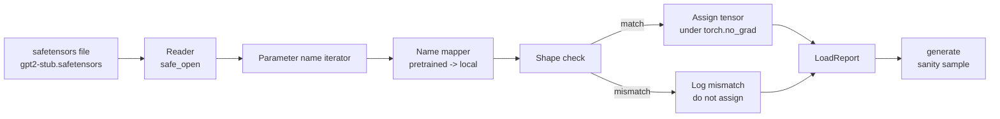

# 사전 훈련된 가중치 로딩

> 1억 2400만 파라미터 모델을 처음부터 훈련하는 것은 예산 결정입니다; 공개된 체크포인트를 로딩하는 것은 평범한 화요일입니다. 이 레슨에서는 사전 훈련된 GPT-2 스타일 가중치를 safetensors 파일에서 레슨 35의 정확한 아키텍처로 로딩하고, 파라미터 이름 매핑을 조각별로 살펴보고, 로드가 작동했음을 증명하기 위해 sanity 생성을 수행합니다. 네트워크 없음, 타사 로더 없음, 불투명한 마법 없음.

**Type:** Build
**Languages:** Python
**Prerequisites:** Phase 19 lessons 30 to 36
**Time:** ~90 minutes

## Learning Objectives

- `safetensors` 파이썬 라이브러리로 safetensors 파일을 읽고 텐서 이름과 형태를 검사합니다.
- 각 사전 훈련된 파라미터 이름을 레슨 35 GPT 모델 내부의 파라미터에 매핑합니다.
- 공개된 GPT-2 가중치와 이 트랙의 모델 간에 다른 두 가지 이름 규칙을 처리합니다: `wte/wpe/h.N.attn.c_attn/c_proj` 및 `mlp.c_fc/c_proj` 대 로컬 명명법 `tok_embed/pos_embed/blocks.N.attn.qkv/out_proj` 및 `mlp.fc1/fc2`.
- 가중치 할당 전에 형태 불일치를 명확한 오류로 감지하고 거부합니다.
- 로드된 가중치로 짧은 생성을 수행하고 토큰이 무작위 초기화된 분포가 아닌 로드된 분포에서 왔음을 확인합니다.

## The Problem

공개된 가중치는 여러분의 아키텍처에 맞게 패키징되어 있지 않습니다. 원래 구현에서 사용한 이름을 가지고 있습니다. 사전 훈련된 파일에는 `transformer.h.0.attn.c_attn.weight` 형태 `(2304, 768)`이 있습니다; 여러분의 모델은 `blocks.0.attn.qkv.weight` 형태 `(2304, 768)`을 기대합니다(다른 레이아웃 규칙의 동일한 행렬이거나) 또는 여러분의 모델이 `nn.Linear`를 사용하여 행렬을 전치하여 저장합니다. 동일한 파라미터가 미묘하게 다른 세 가지 정체성(이름, 형태, 바이트 레이아웃)으로 나타나며 로더가 세 가지를 모두 조정해야 합니다.

맹목적으로 복사하는 로더는 올바른 텐서를 잘못된 위치에 넣고 모델이 의미 없는 것을 생성합니다. 형태가 다를 때 복사를 거부하지만 아무것도 기록하지 않는 로더는 어떤 텐서가 로드에 실패했는지 추측하게 만듭니다. 이 레슨의 로더는 명시적입니다: 모든 할당이 기록되고, 모든 형태가 확인되며, `LoadReport`가 히트, 미스, 형태 불일치를 요약하여 무슨 일이 일어났는지 읽을 수 있습니다.

## The Concept



이름 매퍼는 단순히 문자열에서 문자열로의 함수입니다. 형태 검사는 하나의 if 문입니다. 할당은 `torch.no_grad()` 내에서 이루어져 autograd가 로드를 추적하지 않습니다. 보고서는 모든 이름의 결과를 담고 있습니다.

### The GPT-2 naming convention

공개된 GPT-2 가중치는 다음과 같은 이름으로 저장됩니다:

| Pretrained name | Shape | Meaning |
|-----------------|-------|---------|
| `wte.weight` | (50257, 768) | 토큰 임베딩 |
| `wpe.weight` | (1024, 768) | 위치 임베딩 |
| `h.N.ln_1.weight` | (768,) | 블록 N의 LayerNorm 1 스케일 |
| `h.N.ln_1.bias` | (768,) | 블록 N의 LayerNorm 1 시프트 |
| `h.N.attn.c_attn.weight` | (768, 2304) | 융합 QKV 선형 가중치 |
| `h.N.attn.c_attn.bias` | (2304,) | 융합 QKV 선형 편향 |
| `h.N.attn.c_proj.weight` | (768, 768) | 어텐션 출력 투영 |
| `h.N.attn.c_proj.bias` | (768,) | 어텐션 출력 투영 편향 |
| `h.N.ln_2.weight` | (768,) | LayerNorm 2 스케일 |
| `h.N.ln_2.bias` | (768,) | LayerNorm 2 시프트 |
| `h.N.mlp.c_fc.weight` | (768, 3072) | MLP fc1 가중치 |
| `h.N.mlp.c_fc.bias` | (3072,) | MLP fc1 편향 |
| `h.N.mlp.c_proj.weight` | (3072, 768) | MLP fc2 가중치 |
| `h.N.mlp.c_proj.bias` | (768,) | MLP fc2 편향 |
| `ln_f.weight` | (768,) | 최종 LayerNorm 스케일 |
| `ln_f.bias` | (768,) | 최종 LayerNorm 시프트 |

두 가지 예상해야 할 사항이 있습니다. `c_attn`, `c_proj`, `c_fc` 선형은 `nn.Linear.weight`가 기대하는 것과 반대로 행렬이 전치되어 저장됩니다. 로더는 할당 중에 전치합니다. LM 헤드는 파일에 전혀 없습니다; 모델은 `wte`와의 weight tying에 의존하므로, `wte`가 로드되면 헤드가 별칭으로 설정됩니다.

### The local naming convention

이 트랙의 모델은 설명적인 이름을 사용합니다:

| Local name | Meaning |
|------------|---------|
| `tok_embed.weight` | 토큰 임베딩 |
| `pos_embed.weight` | 위치 임베딩 |
| `blocks.N.ln1.scale` | 블록 N의 LayerNorm 1 스케일 |
| `blocks.N.ln1.shift` | 블록 N의 LayerNorm 1 시프트 |
| `blocks.N.attn.qkv.weight` | 융합 QKV |
| `blocks.N.attn.qkv.bias` | 융합 QKV 편향 |
| `blocks.N.attn.out_proj.weight` | 어텐션 출력 투영 |
| `blocks.N.attn.out_proj.bias` | 출력 투영 편향 |
| `blocks.N.ln2.scale` | LayerNorm 2 스케일 |
| `blocks.N.ln2.shift` | LayerNorm 2 시프트 |
| `blocks.N.mlp.fc1.weight` | MLP fc1 |
| `blocks.N.mlp.fc1.bias` | MLP fc1 편향 |
| `blocks.N.mlp.fc2.weight` | MLP fc2 |
| `blocks.N.mlp.fc2.bias` | MLP fc2 편향 |
| `final_ln.scale` | 최종 LayerNorm 스케일 |
| `final_ln.shift` | 최종 LayerNorm 시프트 |

매핑은 고정 함수입니다. 이 레슨은 로더가 반복하는 딕셔너리로 제공합니다.

### The stub fixture

실제 GPT-2 가중치는 0.5 GB입니다. 데모는 다운로드하지 않습니다; 첫 실행에서 작은 safetensors 픽스처를 생성하며, 정확한 GPT-2 명명 규칙과 768 대신 d_model 192인 12블록 모델에 적합한 형태를 사용합니다. 픽스처는 로더의 모든 코드 경로를 실행할 수 있는 올바른 구조를 가지고 있습니다. 픽스처를 실제 파일로 교체하면 로더가 수정 없이 작동합니다.

## Build It

`code/main.py` implements:

- 이 레슨이 자체 포함되도록 레슨 35 `GPTModel`의 작은 복제본.
- 레이어별 항목을 확장하는 `make_pretrained_to_local(num_layers)`.
- 이름을 반복하고, 매핑하고, 형태를 확인하고, conv1d 스타일 가중치를 전치하고, `torch.no_grad()` 아래에 할당하는 `load_safetensors(model, path)`. `LoadReport`를 반환합니다.
- 정확한 사전 훈련된 명명 규칙을 가진 픽스처 파일을 생성하는 `make_stub_safetensors(path, cfg)`.
- 첫 실행에서 `outputs/gpt2-stub.safetensors`를 생성하고, 새 모델을 빌드하고, 무작위 초기화에서 하나의 생성된 연속을 캡처하고, 스텁을 로드하고, 다른 연속을 캡처하고, 둘을 출력하고, 둘이 다른지 확인하는 데모(로드가 실제로 모델을 변경했음).

Run it:

```bash
python3 code/main.py
```

출력: 픽스처 경로, 이름별 로드 로그, `LoadReport` 요약, 로드 전 연속, 로드 후 연속, 그리고 실패 경로를 실행하기 위해 픽스처에 의도적으로 주입된 하나의 형태 불일치.

## Stack

- `safetensors` for the on disk format and a streaming reader.
- `torch` for the model and the assignment math.
- No `transformers`, no `huggingface_hub`, no network calls.

## Production patterns in the wild

세 가지 패턴이 로더가 여러분이 만들지 않은 가중치와 접촉해도 살아남게 합니다.

**Always validate the file before any assignment.** 파일을 열고, 모든 텐서 이름을 dtype과 형태와 함께 나열하고, 형태 검사로 전체 매핑을 실행하고, 성공 시에만 할당을 시작합니다. 반쯤 로드된 모델은 조용한 실패 기계입니다.

**Log every assignment with the source name and the destination name.** 무언가 잘못 보일 때, 로그는 어떤 텐서가 어디에 도착했는지 알려줍니다; 대안은 16진수 덤프를 읽는 것입니다. 이 레슨의 `LoadReport` 데이터클래스는 `loaded`, `missing`, `unexpected`, `shape_mismatch` 목록을 추적하고 끝에 요약을 출력합니다.

**The LM head is a weight tying alias, not a separate copy.** `tok_embed`를 로드한 후 `model.lm_head.weight = model.tok_embed.weight`를 설정하는 것이 표준 패턴입니다. 임베딩 행렬을 새로운 `lm_head.weight` 파라미터에 복사하면 tying이 깨지고 조용히 파라미터 수가 두 배가 됩니다.

## Use It

- 로더는 사전 훈련된 명명 규칙을 사용하는 모든 safetensors 파일에서 작동합니다. 실제 GPT-2 파일(small / medium / large / xl)은 코드 변경 없이 작동합니다; 모델 설정만 다릅니다.
- 동일한 패턴은 이름 맵을 업데이트하면 LLaMA, Mistral, Qwen 가중치로 확장됩니다. 형태 검사와 보고서는 동일하게 유지됩니다.
- 로드 후 sanity 생성은 빠른 게이트입니다: 로드 후 샘플이 로드 전 샘플처럼 보이면 로드가 모델을 변경하지 않은 것이며, 매핑이 모든 텐서를 조용히 놓쳤음을 의미합니다.

## Exercises

1. 로더에 `dtype` 인수를 추가하여 할당 중에 각 텐서를 대상 dtype(`bfloat16`, `float16`, `float32`)으로 변환합니다. `float32` 모델이 `bfloat16`으로 다운캐스트되어도 여전히 생성할 수 있는지 확인합니다.
2. `h.N` 인덱스가 모델의 `num_layers`와 일치하지 않는 체크포인트를 거부하는 `expected_layers` 인수를 추가합니다.
3. 로더를 레슨 35 생성 함수에 연결하고 두 샘플을 나란히 생성합니다: 하나는 무작위 초기화, 하나는 로드된 픽스처.
4. 내보내기 경로 추가: 현재 모델 상태를 사전 훈련된 명명 규칙을 사용하여 새로운 safetensors 파일에 씁니다. 로더를 라운드트립하고 보고서에 형태 불일치가 0인지 확인합니다.
5. `NAME_MAP`을 LLaMA 명명 규칙(편향 없음, RMSNorm, 융합 qkv 레이아웃)을 처리하도록 확장하고 여러분이 생성한 스텁 LLaMA 픽스처에서 로더를 다시 실행합니다.

## Key Terms

| Term | What people say | What it actually means |
|------|-----------------|------------------------|
| Name map | "Key remapping" | 사전 훈련된 텐서 이름에서 로컬 파라미터 이름으로의 함수; 보통 레이어 인덱스당 하나의 항목이 루프로 확장된 리터럴 딕셔너리 |
| Shape mismatch | "Bad shape" | 사전 훈련된 텐서가 매핑된 이름 아래 존재하지만 그 차원이 로컬 파라미터와 일치하지 않음; 로더가 할당을 거부하고 쌍을 기록함 |
| Transpose-on-load | "Conv1d layout" | 공개된 GPT-2는 어텐션과 MLP 투영을 nn.Linear가 기대하는 것의 전치로 저장함; 로더가 할당 중에 전치함 |
| Weight tying alias | "Shared LM head" | `model.lm_head.weight = model.tok_embed.weight`를 설정하여 헤드와 임베딩이 저장소를 공유함; 이 때문에 헤드가 파일에 없음 |
| Load report | "Coverage summary" | 로드됨, 누락됨, 예상치 못함, 형태 불일치 목록을 추적하는 작은 데이터클래스; 출력하는 것이 로드가 성공했는지 알려주는 방법 |

## Further Reading

- Phase 19 lesson 35 for the architecture that receives the weights.
- Phase 19 lesson 36 for the training loop that produces a checkpoint of the same shape.
- Phase 10 lesson 11 (quantization) for what to do with the loaded weights when memory is tight.
- Phase 10 lesson 13 (building a complete LLM pipeline) for the full lifecycle around load and inference.
