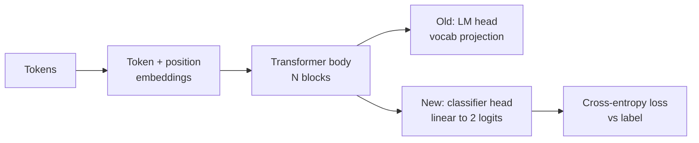
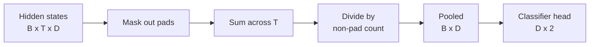
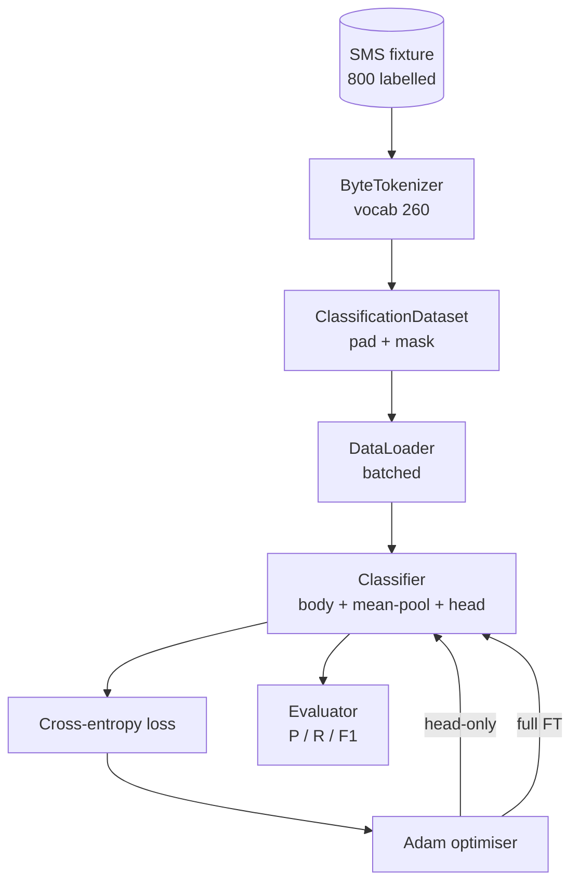

# Capstone Lesson 38: 헤드 교체를 통한 분류기 파인튜닝

> 트랙 B의 첫 번째 캡스톤. 사전 훈련된 언어 모델은 토큰 예측 헤드로 끝나는 자기 어텐션 블록 스택입니다. 스팸 대 햄을 원할 때, 헤드는 틀렸지만 본체는 대부분 맞습니다. 이 레슨에서는 헤드를 떼어내고, 풀링된 표현 위에 2클래스 선형 레이어를 붙이고, 두 가지 다른 방식으로 분류기를 훈련합니다: 최종 레이어만, 그리고 전체 파인튜닝. 평가는 분할된 데이터에서 정밀도, 재현율, F1입니다. 각 전략이 무엇을 제공하고 무엇을 비용으로 하는지 배웁니다.

**Type:** Build
**Languages:** Python (torch, numpy)
**Prerequisites:** Phase 19 lessons 30-37 (NLP LLM track: tokenizer, embedding table, attention block, transformer body, pre-training loop, checkpointing, generation, perplexity)
**Time:** ~90 minutes

## Learning Objectives

- 언어 모델 헤드를 본체를 다시 초기화하지 않고 분류 헤드로 교체합니다.
- 두 가지 훈련 방식을 구현합니다: 동결된 본체(헤드 전용)와 전체 파인튜닝, 하나의 훈련 루프 공유.
- 토크나이저를 인식하는 데이터 파이프라인을 구축하여 패딩, 패딩 마스킹, 어텐션 출력 풀링을 수행합니다.
- 로짓에서 정밀도, 재현율, F1 및 혼동 행렬을 계산합니다.
- 파라미터 수, 훈련 시간, 성능 간의 트레이드오프를 추론합니다.

## The Problem

일반 말뭉치에서 작은 트랜스포머를 사전 훈련했습니다. 출력 헤드는 마지막 은닉 상태를 1000개 토큰 어휘로 투영합니다. 이제 스팸 또는 햄으로 레이블이 지정된 800개의 SMS 메시지가 있고 이진 분류기를 원합니다. 세 가지 옵션이 있습니다.

잘못된 옵션은 800개의 예제로 처음부터 새 분류기를 훈련하는 것입니다. 사전 훈련된 모델의 본체는 이미 유용한 구조(단어 식별, 위치, 단순 공동 발생)를 인코딩합니다. 이를 버리는 것은 그것을 구축한 계산을 낭비하는 것입니다.

두 가지 올바른 옵션은 본체를 동결한 상태에서 헤드 교체, 그리고 본체를 훈련 가능한 상태에서 헤드 교체입니다. 헤드 전용 훈련은 빠르고, 메모리가 거의 들지 않으며, 이 적은 데이터로 과적합이 드뭅니다. 전체 파인튜닝은 더 느리고, 작은 데이터에서 과적합될 수 있지만, 다운스트림 도메인이 사전 훈련 말뭉치에서 벗어날 때 더 높은 정확도에 도달합니다.

이 레슨은 동일한 픽스처에서 비교할 수 있도록 둘 다 구축합니다.

## The Concept

모델은 함수 `f_theta(tokens) -> hidden_states`입니다. 헤드는 함수 `g_phi(hidden) -> logits`입니다. 헤드를 교체한다는 것은 `theta`를 유지하고 `g_phi`를 교체하는 것을 의미합니다. 본체의 파라미터가 비용이 많이 드는 부분입니다. 헤드는 단일 선형 레이어입니다.

두 가지 훈련 가능한 파라미터 세트가 중요합니다:

- `theta` (본체): 어텐션 블록당 수만 개의 가중치.
- `phi` (헤드): `hidden_dim * num_classes` 가중치 + 편향.

헤드 전용 훈련에서는 `phi`에 대한 그래디언트를 계산하고 `theta`에 대해서는 0으로 만듭니다. PyTorch에서는 본체 파라미터에 `requires_grad=False`를 설정하여 이를 수행할 수 있습니다. 그러면 옵티마이저는 헤드만 보고 본체는 동결된 상태로 유지됩니다.

전체 파인튜닝에서는 그래디언트가 전체 스택을 통해 역전파되도록 합니다. 본체의 가중치는 분류 목적에 맞게 이동합니다. 위험은 작은 데이터에서의 catastrophic forgetting입니다: 본체의 사전 훈련이 과적합 노이즈로 인해 씻겨 나갑니다.

## The Pooling Question

분류기는 토큰당 하나의 벡터가 아니라 시퀀스당 하나의 벡터가 필요합니다. 세 가지 일반적인 선택이 있습니다:

- **Mean pool**: 어텐션 마스크로 가중치를 준 은닉 상태를 시퀀스 전체에 걸쳐 평균냅니다.
- **CLS pool**: 특별 토큰을 앞에 추가하고 그 출력만 사용합니다. 이것이 BERT가 하는 방식입니다.
- **Last-token pool**: 마지막 비패딩 토큰을 사용합니다. 이것이 GPT-클래스 분류기가 하는 방식입니다.

이 레슨은 명시적 어텐션 마스크 가중치를 사용한 평균 풀링을 사용합니다. 가장 간단하고, 시퀀스 길이에 걸쳐 안정적인 신호를 제공하며, CLS 토큰의 사전 훈련이 필요하지 않습니다.

## The Data

800개의 SMS 메시지, 400개 스팸과 400개 햄으로 균형을 이루며, `code/main.py`에서 결정론적으로 생성됩니다. 생성기는 고정 시드를 사용하고, 템플릿을 선택하고 슬롯 필러를 대체하며, 5에서 25 토큰 길이의 메시지를 생성합니다. 실제 데이터셋에는 이 픽스처에는 없는 노이즈가 있습니다. 픽스처의 요점은 재현성입니다.

데이터는 80/20으로 분할됩니다: 640 훈련, 160 테스트. 분할은 층화되어 테스트 세트가 50/50 균형을 유지합니다. 알려진 균형을 가진 분할 세트는 정밀도와 재현율을 정직한 숫자로 읽을 수 있게 합니다.

## The Metrics

클래스 1을 양성 클래스(스팸)로 하는 이진 분류. 카운트는 다음과 같습니다:

- `TP`: 스팸으로 예측, 실제로 스팸.
- `FP`: 스팸으로 예측, 실제로 햄.
- `FN`: 햄으로 예측, 실제로 스팸.
- `TN`: 햄으로 예측, 실제로 햄.

세 가지 주요 지표:

- `precision = TP / (TP + FP)`. 스팸으로 플래그된 메시지 중 실제로 스팸인 비율?
- `recall = TP / (TP + FN)`. 실제 스팸 중 모델이 플래그한 비율?
- `F1 = 2 * P * R / (P + R)`. 두 지표의 조화 평균.

혼동 행렬은 네 개의 카운트를 2x2 그리드로 출력합니다. 데모는 두 훈련 방식 모두에 대해 이것을 stdout에 씁니다.

## Architecture

본체는 의도적으로 아주 작은 트랜스포머입니다: vocab 260, hidden 64, 4개 헤드, 2개 블록, 최대 시퀀스 32. CPU에서 90초 안에 두 방식을 수렴시킬 수 있을 만큼 작습니다. 이 레슨에서 사전 훈련되지 않습니다; 대신 `pretrain_quick` 헬퍼는 동일한 픽스처의 텍스트에 대해 5 에폭의 LM 훈련을 수행하여 본체에 중요한 시작점을 제공합니다. 이는 레슨을 자체 포함되게 유지합니다.

## What you will build

구현은 하나의 `main.py`와 하나의 테스트 모듈(`code/tests/test_main.py`)입니다.

1. `ByteTokenizer`: 바이트를 ID로 매핑하고, 패드 ID를 예약합니다.
2. `Block`: 멀티헤드 어텐션과 피드포워드 레이어를 가진 트랜스포머 블록. Pre-norm.
3. `LMBody`: 토큰 + 위치 임베딩과 블록 스택. 은닉 상태를 반환합니다.
4. `MeanPool`: 마스크 가중치가 적용된 시퀀스 축 평균.
5. `Classifier`: 본체, 풀, 선형 헤드. 본체는 방식 간에 동일한 인스턴스입니다.
6. `freeze_body` 및 `unfreeze_body`: 본체 파라미터의 `requires_grad`를 전환합니다.
7. `train_classifier`: 하나의 공유 루프. 모델과 훈련 가능한 파라미터 그룹에 맞게 구성된 옵티마이저를 받습니다.
8. `evaluate`: 테스트 세트를 실행하고 `Metrics(precision, recall, f1, confusion)`를 반환합니다.
9. `run_demo`: 본체를 잠시 사전 훈련한 다음, 헤드 전용, 그 다음 전체를 훈련 및 평가하고, 두 보고서를 출력하고, 0으로 종료합니다.

## Why the comparison matters

헤드 전용 방식은 일반적으로 더 빠르게 훈련되고 더 우아하게 과소적합됩니다. 이 픽스처에서는 일반적으로 20 에폭의 헤드 전용 훈련 후 정밀도가 약 0.9, 재현율이 약 0.85 부근에 도달합니다. 전체 파인튜닝은 약 3배 더 오래 걸리며, 무작위 시드에 따라 양쪽으로 몇 포인트 차이로 수렴합니다.

이 레슨은 승자를 고르지 않습니다. 숫자와 비용을 읽는 방법을 가르칩니다. 800개의 예제와 작은 본체에서는 헤드 전용이 올바른 선택입니다. 80,000개의 예제와 더 큰 본체에서는 전체 파인튜닝이 효과를 발휘하기 시작합니다. 이 레슨에서 얻는 계약은 API입니다: 동일한 `train_classifier` 함수가 둘 다 처리하고, 전환은 한 번의 호출입니다.

## Stretch goals

- 마지막 블록만 동결 해제하는 세 번째 방식을 추가합니다. 이를 부분 파인튜닝이라고도 합니다. 전체 FT보다 비용이 적게 들고 헤드 전용보다 더 많이 학습합니다.
- 학습률 스케줄러를 추가합니다. 헤드에 코사인 스케줄을 사용하고 본체에 더 작은 상수율을 사용하는 것은 일반적인 프로덕션 설정입니다.
- 평균 풀링을 학습된 어텐션 풀로 교체합니다: 하나의 학습된 쿼리를 가진 작은 어텐션 레이어. 이는 더 긴 시퀀스에서 평균 풀을 능가하는 경우가 많습니다.

구현은 훅을 제공합니다. 테스트는 계약을 고정합니다. 숫자는 여러분이 밀어붙일 것입니다.
