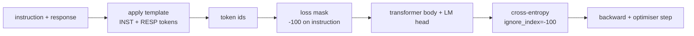
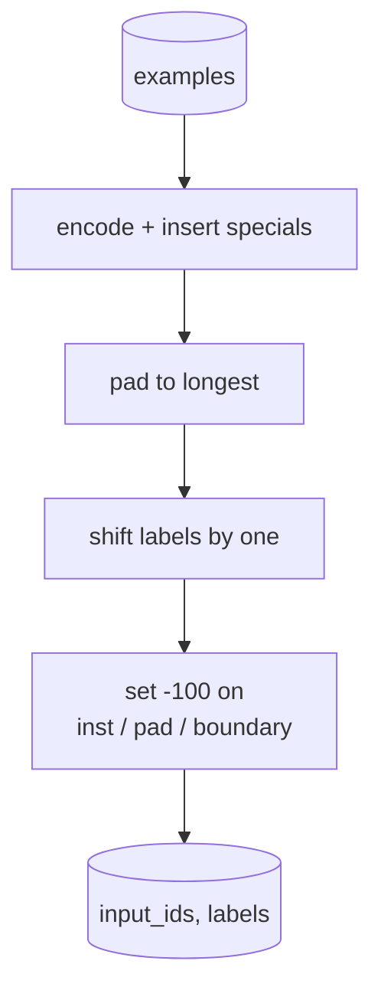
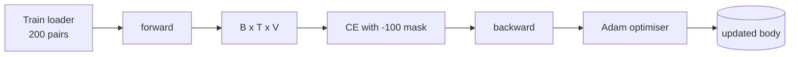

# Capstone Lesson 39: 지도 파인튜닝을 통한 명령어 튜닝

> 사전 훈련된 기본 모델은 시퀀스를 확장할 수 있지만 명령어를 따를 수는 없습니다. 지도 파인튜닝(SFT)은 이를 수정하는 가장 작은 변경입니다: 명령어와 원하는 응답의 쌍으로 된 예제를 모델에 제공하고, 본체가 응답 토큰을 예측하도록 훈련합니다. 핵심은 손실이 명령어가 아닌 응답만 계산하도록 하는 것입니다. 이 레슨은 `ignore_index=-100`으로 명령어 토큰을 마스킹하는 사용자 정의 collate 함수로 Alpaca 스타일 SFT 루프를 구축하고, 200개의 명령어-응답 쌍으로 훈련하며, 정확히 일치(exact-match)를 사용하여 분할된 데이터에서 평가합니다.

**Type:** Build
**Languages:** Python (torch, numpy)
**Prerequisites:** Phase 19 lessons 30-37 (NLP LLM track: tokenizer, embedding table, attention block, transformer body, pre-training loop, checkpointing, generation, perplexity)
**Time:** ~90 minutes

## Learning Objectives

- 쌍으로 된 명령어-응답 데이터를 명시적 경계 토큰이 있는 단일 인과 시퀀스로 형식화합니다.
- 크로스 엔트로피가 응답 토큰만 계산하도록 명령어 토큰을 마스킹하는 collate 함수를 구축합니다.
- SFT 목적 함수로 작은 트랜스포머 본체를 훈련하고 평가 지표가 움직이는 것을 관찰합니다.
- 응답 시작 경계를 존중하는 greedy 및 temperature 샘플링 생성을 구현합니다.
- 생성된 완료에 대해 분할된 정확히 일치를 계산합니다.

## The Problem

다음 토큰 예측으로 훈련된 기본 모델은 명령어가 무엇인지 전혀 모릅니다. `"프랑스의 수도는 어디인가요?"`라는 문자열을 보여주면 질문을 계속하거나 새로운 문장을 만들어냅니다. 모델은 언어를 가지고 있지만 형식 계약은 없습니다.

SFT 계약은 문자열 템플릿입니다. 모든 훈련 예제는 세 영역이 있는 단일 시퀀스가 됩니다:

```text
<INST> 프랑스의 수도는 어디인가요? <RESP> 프랑스의 수도는 파리입니다.
```

경계 토큰은 훈련 시간에 예약된 특별 토큰입니다. 모델은 `<RESP>` 이후의 모든 것이 응답이고 응답이 평가된다는 것을 학습합니다. 기본 모델의 다음 토큰 목적 함수는 여전히 적용됩니다; 모든 예제가 이 형태를 가진 말뭉치에서 훈련될 뿐입니다.

하지만 함정이 있습니다. 전체 시퀀스를 일반 크로스 엔트로피 손실에 공급하면 명령어 토큰도 예측하도록 모델을 훈련하는 것입니다. 명령어는 주어집니다. 해당 위치에서는 그래디언트가 0이 되길 원합니다. 해결책은 마스크입니다.

## The Concept



`ignore_index`는 `torch.nn.functional.cross_entropy`의 기능입니다. `ignore_index`와 같은 대상 위치는 0 손실과 0 그래디언트를 기여합니다. PyTorch의 관례는 `-100`입니다. collate 함수는 예제당 두 개의 텐서를 구축합니다: `input_ids`(전체 시퀀스)와 `labels`(명령어 위치가 `-100`으로 덮어쓰여진 `input_ids`의 복사본).

모델은 순전파 중에 전체 시퀀스를 봅니다; 어텐션은 명령어에 주목할 수 있습니다. 손실은 응답 토큰만 계산합니다. 이것이 정확히 원하는 것입니다: 명령어를 조건으로 하고 응답을 예측합니다.

## The Data

200개의 명령어-응답 쌍이 `main.py`에서 결정론적으로 생성됩니다. 여섯 가지 작업 유형을 다룹니다:

- 사실 단일 샷(X의 수도)
- 산술
- 목록 추출
- 한 문장 요약
- 코드(print, sort)
- 정의

각 작업은 템플릿화된 명령어와 결정론적 응답을 가지고 있습니다. 이것은 의도적으로 단순합니다. 정확히 일치는 취약하며, 이 레슨은 정답이 하나의 특정 문자열인 픽스처를 사용합니다. 실제 SFT 데이터셋은 퍼지 지표가 필요합니다; 원칙은 동일합니다.

분할은 160 훈련, 40 테스트입니다. 테스트 세트는 여섯 가지 작업 유형을 모두 다루므로 범주별 정확히 일치를 보고할 수 있습니다.

## Tokenisation and Padding

토크나이저는 바이트 수준이며 세 가지 예약된 특수 토큰이 있습니다:

- `INST_ID = 256`: 명령어 영역의 시작을 표시합니다.
- `RESP_ID = 257`: 명령어와 응답 사이의 경계를 표시합니다.
- `PAD_ID = 258`: 가변 길이 배치를 위한 패딩.

시퀀스는 `[INST] inst_bytes [RESP] resp_bytes [PAD]*`입니다. collate 함수:

1. 각 예제를 토큰화합니다.
2. 배치의 모든 예제를 배치에서 가장 긴 시퀀스로 패딩합니다.
3. `labels` = `input_ids`를 하나씩 이동(인과 LM 대상)하여 구축하고:
   - 명령어 영역은 `-100`으로 대체됩니다.
   - 패딩 영역은 `-100`으로 대체됩니다.
   - `RESP_ID` 경계 위치 자체는 `-100`으로 대체됩니다(모델이 경계 토큰을 예측하도록 훈련하지 않음; 뒤에 오는 것을 예측함).



이동은 표준 인과 트릭입니다: `input_ids`의 위치 `i`는 위치 `i+1`을 예측하므로, `labels[i] = input_ids[i+1]`입니다(마지막 위치는 입력에서 제거되고 첫 번째는 대상에서 제거됨). 마스크는 올바른 위치에 도달하기 위해 이동 후에 적용됩니다.

## Training



루프는 표준 PyTorch SFT 루프입니다. Adam, 학습률 약 3e-4 ~ 1e-3, 이 픽스처에서 10~20 에폭, 스케줄러 없음. 모델은 충분히 작아서(hidden 96, 2개 블록, 최대 길이 64) CPU에서 2분 안에 수렴하도록 훈련할 수 있습니다.

5 에폭마다 루프는 분할된 세트에서 작은 평가 패스를 실행하고 정확히 일치를 출력합니다. 정확히 일치가 1 에폭의 0.0에서 15 에폭의 약 0.85로 증가하는 것을 보는 것이 이 레슨의 효과입니다: 모델이 형식과 답변을 동시에 학습하는 것을 볼 수 있습니다.

## Generation

평가 시간에 모델은 명령어 접두사 `[INST] inst_bytes [RESP]`를 받고 다음 중 하나가 발생할 때까지 토큰을 생성합니다:

- 시퀀스가 `max_len`에 도달하거나,
- 모델이 특별 중단 휴리스틱(두 개의 연속 문장 종료 바이트(`.`, `!`, `?`))을 방출합니다.

이 레슨은 greedy 디코딩과 선택적 temperature 샘플러를 제공합니다. 정확히 일치는 temperature가 지표를 확률적으로 만들기 때문에 greedy를 사용합니다. 실제 시스템은 종종 샘플링한 다음 퍼지하게 판단합니다; 그 파이프라인은 레슨 41입니다.

## Exact-Match Evaluation

정확히 일치는 가장 엄격한 텍스트 지표입니다. 예측된 응답 문자열은 정규화되고(소문자, 공백 제거, 이중 공백 축소) 참조 응답과 동일하게 정규화되어 비교됩니다. 지표는 예제당 1 또는 0입니다. 집계는 평균입니다.

실제 SFT 파이프라인은 정확히 일치를 토큰 수준 F1(레슨 41) 및 판사 모델로 보완합니다. 정확히 일치는 모호하지 않기 때문에 여전히 유용합니다; 0.7이라고 말하면 정확히 70%의 테스트 명령어가 문자 그대로 금색 응답을 생성한 것입니다.

## What you will build

구현은 하나의 `main.py`와 테스트입니다.

1. `InstructionTokenizer`: 예약된 특수 토큰이 있는 바이트 수준 인코더. 명령어 접두사 또는 전체 쌍을 인코딩합니다.
2. `make_dataset`: 고정 시드로 여섯 가지 작업 유형에 걸쳐 200개의 쌍을 생성합니다.
3. `SFTDataset`: 예제당 `(input_ids, labels)`를 반환하며, 이미 마스크가 준비되어 있습니다.
4. `sft_collate`: 동적 패딩, 배치 텐서 구축, 명령어 및 패드 위치에 `-100` 설정.
5. `TinyGPT`: 연결되거나 연결되지 않은 LM 헤드가 있는 트랜스포머 본체.
6. `train_sft`: SFT 루프, 에폭당 평가 훅 포함.
7. `generate`: 접두사에서 인과 디코딩, greedy 또는 샘플링, 중단 휴리스틱 포함.
8. `exact_match`: 정규화된 문자열 비교, `[0, 1]`의 float 반환.
9. `run_demo`: 데이터 구축, 20 에폭 훈련, 평가, 범주별 분석 출력, 성공 시 0으로 종료.

## Why the mask matters

마스크가 없으면 손실이 명령어 토큰을 대상으로 처리합니다. 모델은 명령어를 예측하는 법을 배웁니다. 이는 다른 목적 함수이며 두 가지 방식으로 더 나쁜 모델을 생성합니다. 첫째, 모델 용량이 사용자가 항상 제공하는 입력을 재구성하는 데 낭비됩니다. 둘째, 대부분의 배치에서 명령어 토큰이 응답 토큰보다 많기 때문에 응답 손실이 그래디언트 합계에서 더 작습니다; 관심 있는 부분에 대한 옵티마이저의 유효 학습률이 의도한 것보다 낮습니다. 마스크는 다듬기가 아니라 목적 함수입니다.

## Stretch goals

- 학습률 웜업 후 코사인 감쇠를 추가합니다. SFT는 사전 훈련보다 LR에 더 민감합니다.
- 토큰별 손실 로깅을 추가하고 훈련 중 손실 곡선을 플롯합니다. 초기 에폭은 템플릿 토큰(`<RESP>`, 공통 접두사)이 지배하고 후기 에폭은 실제 답변 토큰이 지배한다는 점에 주목합니다.
- 평가를 BLEU-1 또는 chrF로 확장합니다. 정확히 일치는 동일한 답변으로 의역을 생성하는 모델을 과소평가합니다.
- 다중 턴 형식의 채팅 템플릿을 추가하고 후속 질문이 포함된 픽스처에서 훈련합니다.

구현은 형식 계약, 마스크 및 루프를 제공합니다. 기본 모델에서 명령어 추종자로의 목적 함수 변경은 하나의 collate 함수입니다.
