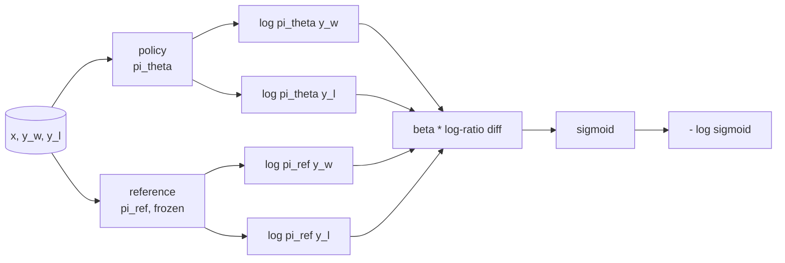
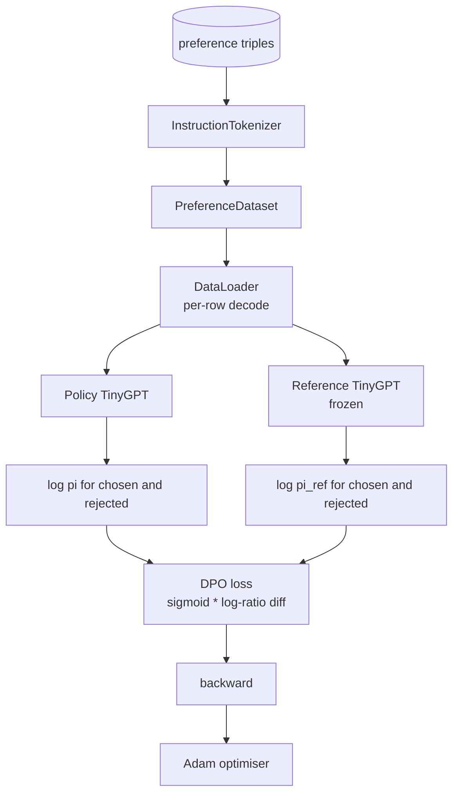

# Capstone Lesson 40: 처음부터 직접 선호도 최적화(DPO)

> 보상 모델과 PPO는 고전적인 RLHF 스택입니다. DPO는 그 스택을 선호도 쌍에 대해 직접 정책을 피팅하는 단일 지도 손실로 축소합니다. 이 레슨은 보상 차이 항등식에서 DPO 손실을 유도하고, 작동하는 참조 모델 및 정책 모델을 제공하며, 토큰별 로그 확률을 계산하고, 선택 및 거부된 완료의 선호도 픽스처에서 작은 트랜스포머를 훈련합니다. 테스트는 손실 수학과 그래디언트 방향을 고정하여 구현이 논문과 일치하는지 확인합니다.

**Type:** Build
**Languages:** Python (torch, numpy)
**Prerequisites:** Phase 19 lessons 30-37 (NLP LLM track: tokenizer, embedding table, attention block, transformer body, pre-training loop, checkpointing, generation, perplexity)
**Time:** ~90 minutes

## Learning Objectives

- DPO 손실을 스케일된 로그-비율 차이에 대한 시그모이드로 유도하고 암시적 보상에 연결합니다.
- 동결된 참조와 훈련 가능한 정책을 가진 참조 모델 + 정책 모델 쌍을 구축합니다.
- 프롬프트 토큰을 마스킹하여 두 모델에서 시퀀스 수준 로그 확률을 계산합니다.
- `(프롬프트, 선택됨, 거부됨)` 트리플에 대해 정책을 훈련하고 선택된 로그 확률이 거부된 것에 비해 상승하는 것을 관찰합니다.
- 손실 수학, 그래디언트 부호 및 참조 불변성에 대한 테스트로 동작을 고정합니다.

## The Problem

SFT 모델이 있습니다. 명령어를 따르지만 출력이 고르지 않습니다; 일부 완료는 명확하고, 일부는 장황하거나 틀렸습니다. 또한 선호도 쌍의 작은 데이터셋이 있습니다: 동일한 프롬프트에 대해 사람이 하나의 완료를 선택하고 다른 하나를 거부했습니다.

고전적인 RLHF 답변은 2단계 파이프라인입니다. 선호도에 대한 보상 모델을 훈련합니다. PPO로 보상에 대해 정책을 최적화합니다. 이것은 작동하지만 비용이 많이 듭니다: PPO 동안 두 모델이 메모리에 있고, 정책을 참조 근처에 유지하기 위한 KL 제어, 보상 모델이 취약할 때 보상 해킹이 발생합니다.

DPO는 두 단계를 단일 지도 손실로 대체합니다. 보상 모델은 명시적으로 존재하지 않습니다. 정책은 명시적 KL 패널티로 SFT 참조를 향해 선호도 쌍에서 직접 훈련됩니다. Bradley-Terry 선호도 모델 하에서 동일한 최적 솔루션, 훨씬 적은 코드.

## The Concept

Bradley-Terry 모델부터 시작합니다. 프롬프트 `x`와 두 완료 `y_w`(선택됨) 및 `y_l`(거부됨)이 주어지면 사람이 `y_w`를 선호할 확률은 다음과 같습니다:

```text
P(y_w > y_l | x) = sigmoid( r(x, y_w) - r(x, y_l) )
```

여기서 `r`은 잠재적 보상 함수입니다. RLHF는 먼저 선호도에서 `r`을 피팅한 다음, KL 앵커로 `r`을 최대화하도록 정책 `pi`를 훈련합니다:

```text
max_pi   E_{x, y~pi} [ r(x, y) ] - beta * KL(pi || pi_ref)
```

DPO 유도는 이 목적 하에서 최적 정책 `pi*`가 `r`의 관점에서 폐쇄 형태를 가짐을 관찰합니다:

```text
pi*(y | x) = (1/Z(x)) * pi_ref(y | x) * exp( r(x, y) / beta )
```

`r`에 대해 재배열:

```text
r(x, y) = beta * ( log pi*(y | x) - log pi_ref(y | x) ) + beta * log Z(x)
```

`log Z(x)` 항은 `y_w`와 `y_l` 모두에 대해 동일하므로(`x`에 의존하고 `y`에는 의존하지 않음), 선호도 차이를 계산할 때 상쇄됩니다:

```text
r(x, y_w) - r(x, y_l) = beta * ( log pi_theta(y_w|x) - log pi_ref(y_w|x)
                                - log pi_theta(y_l|x) + log pi_ref(y_l|x) )
```

Bradley-Terry 시그모이드에 대입하고 선호도 쌍에 대한 음의 로그 우도를 취합니다:

```text
L_DPO(theta) = - E_{(x, y_w, y_l)} [
  log sigmoid( beta * ( log pi_theta(y_w|x) - log pi_ref(y_w|x)
                       - log pi_theta(y_l|x) + log pi_ref(y_l|x) ) )
]
```

이것이 손실입니다. 예제당 하나의 스칼라에 대한 시그모이드이며, 네 개의 로그 확률에서 계산됩니다. 별도의 보상 모델이 없습니다. PPO가 없습니다. 손실에 KL 항이 없습니다; KL 제약은 폐쇄 형태 유도에 내장되어 있습니다.



## The Sign of the Gradient

훈련 실행 전에 유용한 sanity 검사입니다. `log pi_theta(y_w | x)`에 대한 그래디언트를 취합니다:

```text
d L_DPO / d log pi_theta(y_w | x) = - beta * (1 - sigmoid(z))
```

여기서 `z`는 시그모이드의 인수입니다. 이는 모든 `z`에 대해 음수이며, 이는 다음을 의미합니다: 정책의 선택된 완료에 대한 로그 확률을 증가시키면 손실이 감소합니다. 대칭적으로, `log pi_theta(y_l | x)`에 대한 그래디언트는 양수입니다: 거부된 로그 확률을 증가시키면 손실이 증가합니다. 훈련은 선택된 것을 올리고 거부된 것을 내립니다. 참조는 동결되어 움직이지 않습니다.

## The Data

12개의 선호도 트리플이 이 레슨과 함께 제공됩니다. 각각은 `(프롬프트, 선택됨, 거부됨)`입니다. 선택된 완료는 짧고 정확합니다. 거부된 것은 장황하거나, 주제에서 벗어나거나, 틀렸습니다. 쌍은 레슨 39와 동일한 작업 제품군(수도, 산술, 목록)을 다루므로 SFT 기반에서 시작한 정책이 합리적인 출발점을 가집니다.

픽스처는 의도적으로 작습니다. DPO는 프로덕션에서 수만 개의 쌍에서 작동합니다; 여기서 요점은 손실 수학과 루프가 작은 데이터셋에서 처음부터 끝까지 실행되고 선택 대 거부 로그 확률 격차가 눈에 띄게 증가한다는 것입니다.

## Reference Invariance

DPO 구현은 참조 모델을 신중하게 처리해야 합니다. 참조는 제자리에 동결된 SFT 모델입니다. 세 가지 속성이 유지되어야 합니다:

- 참조 파라미터는 그래디언트를 받지 않습니다.
- 참조 로그 확률은 에폭 간에 변경되지 않습니다.
- 정책은 참조와 동일한 가중치로 시작합니다. (최적 `theta`는 참조에 학습된 업데이트를 더한 것입니다; 정책을 참조의 복사본으로 초기화하는 것이 잘 정의된 시작점입니다.)

구현은 다음을 통해 이를 강제합니다:

- 순전파 중에 참조를 `torch.no_grad()`로 래핑합니다.
- 모든 참조 파라미터에 `requires_grad=False`를 설정합니다.
- 참조가 구축된 후 `policy.load_state_dict(reference.state_dict())`를 통해 정책을 구성합니다.

## Architecture



모델은 레슨 39에서 사용된 것과 동일한 TinyGPT(디코더 전용, 인과, 바이트 토크나이저)입니다. 참조와 정책은 아키텍처를 공유합니다; 정책의 가중치는 훈련 중에 참조에서 벗어나고 참조는 고정되어 있습니다.

## What you will build

구현은 하나의 `main.py`와 테스트입니다.

1. `InstructionTokenizer`: `INST` 및 `RESP` 특수 토큰이 있는 바이트 토크나이저. 레슨 39와 동일한 형태.
2. `TinyGPT`: 디코더 전용 트랜스포머. 레슨 39를 건너뛰어도 레슨이 자체 포함되도록 레슨 39와 동일한 형태.
3. `make_preferences`: 12개의 `(프롬프트, 선택됨, 거부됨)` 트리플을 반환합니다.
4. `sequence_log_prob`: 모델, 프롬프트 접두사 및 완료가 주어지면 완료에 대한 다음 토큰 로그 확률의 합을 반환합니다(프롬프트 위치 기여 없음).
5. `dpo_loss`: 네 개의 로그 확률과 `beta`를 받아 예제별 손실 텐서와 로깅용 암시적 보상 델타를 반환합니다.
6. `train_dpo`: 정책 및 참조 하에서 선택 및 거부된 로그 확률을 계산하고, 손실을 적용하고, Adam을 스텝하는 에폭당 루프입니다.
7. `evaluate_margins`: 임의 시점에서 정책 하의 평균 선택-거부 로그 확률 마진을 반환합니다.
8. `run_demo`: 작은 웜업 사전 훈련에서 참조와 정책을 구축하고, 가중치를 복사하고, 30 스텝 동안 훈련하고, 스텝별 손실과 마진을 출력하고, 성공 시 0으로 종료합니다.

## Why DPO works

DPO는 Bradley-Terry 선호도 모델 하에서 보상의 매개변수화까지 RLHF와 수학적으로 동등합니다. 암시적 보상 `r(x, y) = beta * (log pi(y|x) - log pi_ref(y|x))`는 `x`의 함수까지 선호도에서 식별 가능하며, 이는 차이에서 상쇄됩니다. 폐쇄 형태 정책을 사용하면 명시적 보상 모델을 건너뛸 수 있습니다. KL 제약은 구조적으로 강제됩니다: `pi`가 `pi_ref`에서 벗어나면 로그 비율이 커지고 시그모이드가 포화되어 정책이 너무 멀리 이동할 때 그래디언트를 감쇠시킵니다. 참조가 여러분의 안전망입니다.

## Stretch goals

- 로그 확률 합에 길이 정규화를 추가합니다: 완료 길이로 나눕니다. 길이 편향은 정책이 절대적 측면에서 로그 확률이 더 크기 때문에 더 짧은 완료를 선택적으로 선호하는 알려진 DPO 실패 모드입니다.
- 손실의 IPO 변형을 추가합니다: 시그모이드 + 로그를 `(z - 1)^2`로 교체합니다. 픽스처에서 수렴을 비교합니다.
- 하드 선택-거부 레이블과 균일 0.5 사이를 보간하는 레이블 스무딩 파라미터를 추가합니다.
- 참조를 더 작고 저렴한 모델로 교체합니다(지식 증류 방식).

구현은 손실, 참조 불변성 및 훈련 루프를 제공합니다. 수학이 레슨입니다. 코드가 수학을 구체적으로 만듭니다.
