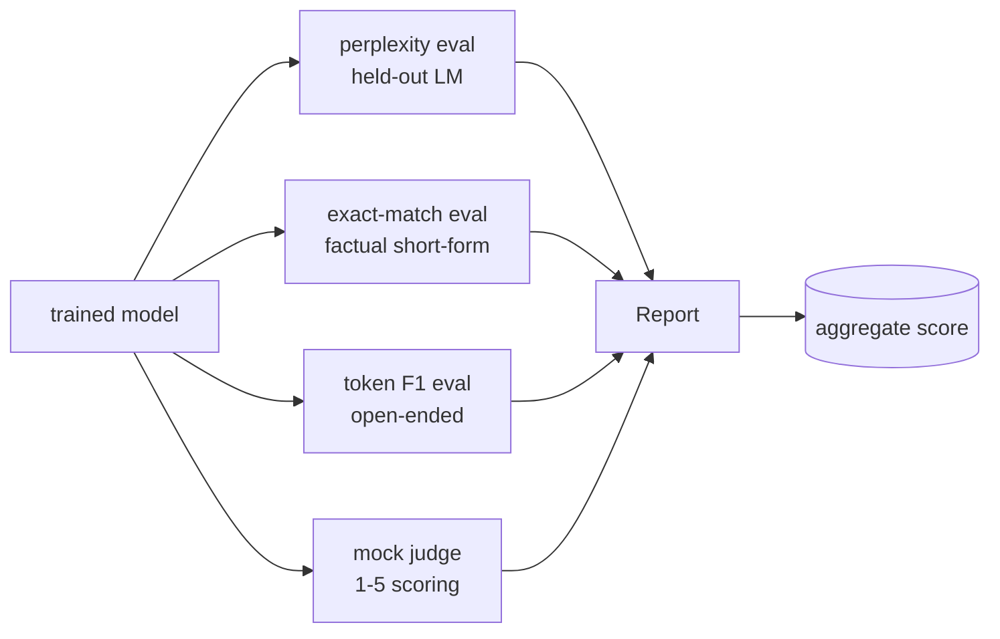
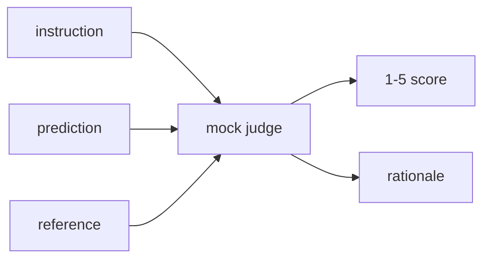
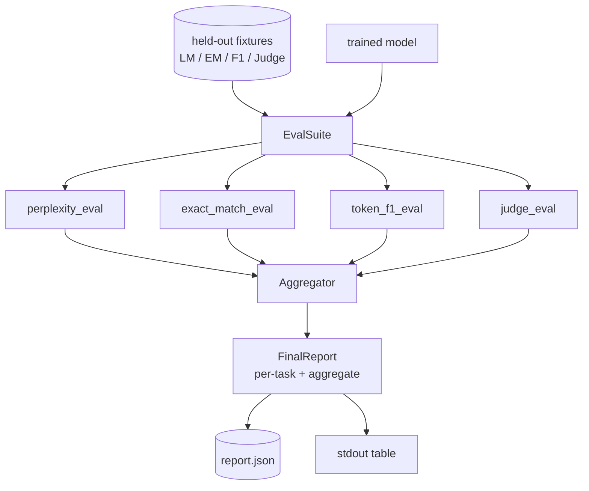

# Capstone Lesson 41: 전체 평가 파이프라인

> 훈련은 손실 곡선으로 모니터링할 수 있는 부분입니다. 평가는 설계해야 하는 부분입니다. 이 레슨은 훈련된 언어 모델을 받아 네 가지 이질적 평가를 실행하고, 결과를 작업별 보고서로 집계하며, 로컬 모의 LLM-as-judge를 제공하여 루프가 네트워크 없이 실행되도록 하는 통합 평가 파이프라인을 구축합니다. 네 가지 평가는 모든 출시 모델에 필요한 차원을 다룹니다: 언어 모델링(perplexity), 단답형 정확성(정확히 일치), 개방형 유사성(토큰 F1), 정성적 점수(판사).

**Type:** Build
**Languages:** Python (torch, numpy)
**Prerequisites:** Phase 19 lessons 30-37 (NLP LLM track: tokenizer, embedding table, attention block, transformer body, pre-training loop, checkpointing, generation, perplexity)
**Time:** ~90 minutes

## Learning Objectives

- 마스크된 토큰 회계로 작은 트랜스포머에서 분할된 perplexity를 계산합니다.
- 단답형 사실 프롬프트에서 정확히 일치 평가를 실행합니다.
- 정규화를 사용하여 예측 및 참조 문자열 간의 토큰 수준 F1을 계산합니다.
- 모델 출력을 1-5 척도로 점수화하는 로컬 모의 LLM-as-judge를 구축합니다.
- 네 가지 평가를 작업별 분석이 있는 단일 가중치 보고서로 집계합니다.

## The Problem

단일 지표는 언어 모델을 결코 설명하지 못합니다. Perplexity는 모델이 언어 분포에 얼마나 잘 맞는지 말하지만 질문에 답하는지 여부는 말하지 않습니다. 정확히 일치는 모델이 금색 문자열을 생성하는지 여부를 말하지만 올바른 의역을 처벌합니다. 토큰 F1은 의역을 용서하지만 잘못된 내용과의 어휘적 중복에 속습니다. LLM-as-judge는 정성적 차원을 포착하지만 비용이 많이 들고 확률적입니다.

실제로 원하는 파이프라인은 네 가지를 모두 가지고 있습니다. 각 평가는 다른 평가가 놓치는 차원을 다룹니다. 각각은 해당 지표에 맞게 구성된 분할된 데이터의 다른 하위 집합에서 실행됩니다. 최종 보고서는 작업별 숫자를 나란히 보여주고 집계를 제공하여 검토자가 모델이 어떤 트레이드오프를 하고 있는지 한눈에 볼 수 있습니다.

이 레슨은 하나의 파일에서 처음부터 끝까지 그 파이프라인을 구축합니다.

## The Concept

각 평가는 `(model, dataset) -> EvalResult`의 함수입니다. 결과는 지표 값, 검사를 위한 예제별 세부 정보, 집계를 위한 이름을 담고 있습니다. 파이프라인은 실행할 평가와 가중치를 지정하는 설정으로 구성됩니다.

## Perplexity, properly counted

Perplexity는 `exp(토큰당 평균 음의 로그 우도)`입니다. 구현에는 두 가지 함정이 있습니다:

- 평균은 배치 * 시퀀스가 아닌 실제 토큰 위치에 대한 것이어야 합니다. 패딩 토큰은 분모에서 제외되어야 합니다. 그렇지 않으면 perplexity가 실제보다 좋게 보입니다.
- 모델은 다음 토큰을 예측하므로 위치 `i`의 로짓은 위치 `i+1`의 토큰을 예측합니다. 여기서의 오프바이원 실수는 조용합니다: 손실은 여전히 훈련되지만 지표는 의미 없어집니다.

평가는 패드가 아닌 위치에 대한 `-log p(token)`의 배치별 합과 배치별 토큰 수를 계산한 다음 마지막에 나눕니다. 이는 배치별 perplexity를 평균내는 것(짧은 시퀀스를 과소 가중)보다 수치적으로 안전하며 교과서 정의와 일치합니다.

## Exact-match, with normalisation

하네스는 비교 전에 예측과 참조를 모두 정규화합니다:

- 소문자로 변환.
- 주변 공백 제거.
- 내부 공백 실행을 단일 공백으로 축소.
- 양쪽이 구두점만 다른 경우 후행 종료 구두점(`.`, `!`, `?`) 제거.

정규화는 실제로 정확히 일치를 유용하게 만듭니다. `"Paris"`라고 말하는 모델은 맞습니다; `"Paris."`라고 말하는 것도 맞습니다; `"  paris  "`라고 말하는 것도 맞습니다. 지표는 여전히 정규화 후에 답변이 동일한 문자열이어야 합니다.

## Token F1, the right way

토큰 F1은 토큰 가방에 대해 계산된 정밀도와 재현율의 조화 평균입니다. 단계:

1. 예측과 참조를 정규화합니다(정확히 일치와 동일한 규칙).
2. 각각을 토큰 목록으로 분할합니다(공백 토큰화).
3. 다중 집합 교집합을 계산합니다.
4. 정밀도 = `intersection_count / len(pred_tokens)`. 재현율 = `intersection_count / len(ref_tokens)`. F1 = 조화 평균.

예측과 참조가 모두 비어 있으면 F1은 1(공허 일치)입니다. 하나만 비어 있으면 F1은 0입니다. 이 패턴은 SQuAD 평가 참조와 일치하며 의역 전반에 걸쳐 안정적인 숫자를 생성합니다.

## Local Mock LLM-as-Judge

실제 판사는 API 뒤의 최첨단 모델입니다. 이 레슨의 판사는 오프라인으로 실행되어야 합니다. 모의 판사는 명령어, 모델의 예측 및 참조를 받아 `{1, 2, 3, 4, 5}`의 점수와 한 줄 설명을 반환하는 결정론적 스코어러입니다. 점수 규칙은 명시적입니다:

- 5: 정규화된 예측이 정규화된 참조와 같음.
- 4: 예측과 참조 간의 토큰 F1이 최소 0.8.
- 3: 토큰 F1이 `[0.5, 0.8)` 내.
- 2: 토큰 F1이 `[0.2, 0.5)` 내.
- 1: 그 외.

이것은 실제 판사가 아니지만 올바른 인터페이스를 가지고 있습니다. 나중에 하나의 함수를 변경하여 실제 모델로 교체하십시오. 파이프라인은 신경 쓰지 않습니다.

## Aggregation

집계는 정규화된 평가 점수의 가중 평균입니다. 각 평가는 `[0, 1]`의 자체 숫자를 보고합니다:

- Perplexity: `1 / (1 + log(perplexity))`로 정규화. Perplexity 1은 1에 매핑되고, 무한대는 0에 매핑됩니다.
- 정확히 일치: 이미 `[0, 1]` 내.
- 토큰 F1: 이미 `[0, 1]` 내.
- 판사: 5로 나눔.

가중치는 설정 가능합니다. 기본 조합은 0.2 perplexity, 0.3 정확히 일치, 0.3 토큰 F1, 0.2 판사입니다. 가중치 선택은 제품 결정입니다; 레슨은 실험할 수 있도록 노브를 노출합니다.

## Architecture

`EvalSuite`는 얇은 오케스트레이터입니다. 각 개별 평가는 `(model, tokenizer, dataset, config)`를 받아 `EvalResult`를 반환하는 자유 함수입니다. `Aggregator`는 결과를 수집하고 최종 보고서를 생성합니다. 데모는 테이블을 출력하고 다운스트림 CI가 수집할 수 있는 JSON 복사본을 작성합니다.

## What you will build

구현은 하나의 `main.py`와 테스트입니다.

1. `TinyGPT`: 레슨 38-40에서 사용된 동일한 디코더 전용 아키텍처로, 레슨이 단독으로 작동하도록 포함됨.
2. `InstructionTokenizer`: INST / RESP / PAD 특수 토큰이 있는 바이트 토크나이저.
3. 네 개의 픽스처: LM 말뭉치, EM 세트, F1 세트, 판사 세트. 각각 20개 예제, 결정론적.
4. `perplexity_eval`: perplexity 값과 토큰별 손실 히스토그램이 있는 `EvalResult` 반환.
5. `exact_match_eval`: 평균 EM과 예제별 레코드 반환.
6. `token_f1_eval`: 평균 토큰 F1과 예제별 레코드 반환.
7. `mock_judge` 및 `judge_eval`: 예제별 점수와 설명, 세트 전체의 평균 점수.
8. `Aggregator.normalise`: 평가별 정규화 규칙.
9. `Aggregator.aggregate`: 가중 평균과 조립된 보고서.
10. `run_demo`: 작은 모델을 간단히 훈련하고, 네 가지 평가를 모두 실행하고, 보고서 테이블을 출력하고 JSON을 작성하며, 성공 시 0으로 종료.

## Reading the report

보고서에는 세 개의 레이어가 있습니다. 상단은 집계 점수입니다. 그 아래는 네 가지 평가별 숫자입니다. 그 아래는 진단을 위한 예제별 분석입니다. 실패한 CI 실행은 일반적으로 집계를 원하지만, 회귀를 추적하는 검토자는 모델이 어떤 입력을 틀렸는지 보기 위해 예제별 분석을 원합니다.

JSON 덤프는 안정적인 키를 사용하므로 CI 대시보드가 버전 간 추세선을 플롯할 수 있습니다. 예쁘게 인쇄된 테이블은 훈련 실행 후 터미널을 응시하는 사람들을 위한 것입니다.

## Stretch goals

- 교정 평가 추가: 모델의 softmax 확률이 정확도와 일치합니까? 신뢰도별로 예측을 버킷화하고 버킷별 empirical 정확도를 보고합니다.
- 강건성 평가 추가: 각 예제에 변형(오타, 의역, 방해 요소)을 태그하고 변형별 지표 하락을 보고합니다.
- 모의 판사를 HTTP 호출 뒤의 실제 모델로 교체합니다. 함수 시그니처는 변경되지 않습니다.
- 작업별 가중치 학습 추가: 고정 가중치 대신, 모델에 대한 대상 선호도 순서에 가중치를 피팅합니다.

구현은 네 가지 평가, 집계기 및 보고서를 제공합니다. 실제 평가 파이프라인은 그 위에 더 많은 차원을 계층화합니다; 패턴은 동일하게 유지됩니다: 평가당 하나의 함수, 하나의 집계기, 하나의 보고서.
