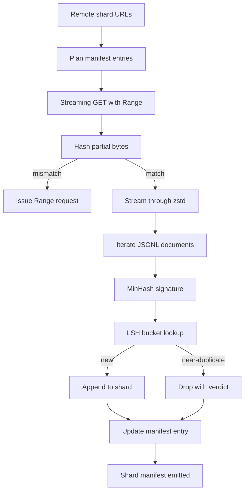

# 대규모 말뭉치 다운로더

> 언어 모델 훈련은 첫 번째 순전파 훨씬 전에 시작됩니다. 말뭉치는 디스크에 저장되고, 압축 해제되고, 중복 제거되고, 접근 가능해야 하며, 네트워크가 4%에서 끊어지기 전에 재개 스토리가 이미 준비되어 있어야 합니다. 이 레슨은 압축된 샤드를 스트리밍 방식으로 가져오고, Zstandard로 즉시 압축 해제하고, MinHash와 locality-sensitive hashing으로 유사 중복을 지문 처리하고, 파이프라인의 나머지가 신뢰할 수 있는 샤드 매니페스트를 작성하는 스트리밍 다운로더를 구축합니다.

**Type:** Build
**Languages:** Python
**Prerequisites:** Phase 19 lessons 30-37
**Time:** ~90 minutes

## Learning Objectives

- `urllib`로 원격 샤드를 스트리밍하고 `zstandard`로 전체 파일을 버퍼링하지 않고 압축 해제합니다.
- 검증된 바이트 오프셋에 대해 HTTP `Range` 요청을 발행하여 부분 다운로드를 재개합니다.
- 문서당 MinHash 서명을 구축하고 LSH로 버킷화하여 유사 중복이 충돌하도록 합니다.
- 콘텐츠 해시, 바이트 크기, 문서 수 및 중복 제거 판정이 포함된 샤드 매니페스트를 출력합니다.

## The Problem

200 GB 말뭉치에서 처음 훈련할 때 네트워크가 41%에서 끊어지고 스크립트가 `urllib` 예외로 종료됩니다. 두 번째에는 78%에서 끊어집니다. 99%가 되면 루프를 세 번 다시 작성했습니다. 첫 순간부터 설계해야 하는 두 가지 실패는 부분 다운로드 재개와 중복 문서 제거입니다. 둘 다 잘 알려진 솔루션이 있으며, 둘 다 파이프라인이 이빨이 돋은 한 줄 `requests.get` 호출로 시작했기 때문에 일상적으로 건너뛰어집니다.

재개는 HTTP 문제입니다. 서버가 `Range`를 존중해야 하고, 클라이언트가 디스크의 레코드에 대해 검증된 오프셋을 추적해야 하며, 검증된 오프셋이 프로세스 종료를 견뎌야 합니다. 오프셋과 파일이 단 1바이트라도 차이가 나면 재개된 다운로드는 쓰레기를 쓰고 말뭉치는 토큰화 중에만 드러나는 방식으로 손상됩니다.

중복 제거는 서명 문제입니다. 정확한 해시 중복 제거는 유사 중복을 놓칩니다: 동일한 Wikipedia 기사가 세 가지 다른 상용구 바닥글로 나타나고, 동일한 코드 파일이 다른 라이선스 헤더로 나타나고, 동일한 블로그 게시물이 모든 링크에 추적 파라미터로 나타납니다. MinHash와 LSH는 이들을 선형 미만 비용으로 잡아냅니다. 비용은 문서당 하나의 서명과 서명당 하나의 버킷 조회입니다.

## The Concept



### Streaming with `urllib`

표준 라이브러리 `urllib.request.urlopen`은 파일과 유사한 객체를 반환합니다. `zstandard.ZstdDecompressor().stream_reader`로 래핑하면 바이트가 네트워크에서 압축 해제기를 통해 문서 반복자로 흐르며 압축된 샤드나 압축 해제된 샤드를 메모리에 구체화하지 않습니다. 유일한 메모리 비용은 라인 버퍼, 현재 문서의 MinHash 서명 및 LSH 인덱스입니다.

### Resume with `Range`

다운로더는 샤드당 두 개의 파일을 씁니다: 샤드 자체와 `.partial.json` 체크포인트. 체크포인트는 `verified_bytes`, `expected_size`, `sha256_prefix`(처음 `verified_bytes` 바이트에 대해 계산됨) 및 소스 URL을 기록합니다. 시작 시 다운로더는 체크포인트를 읽고, 디스크의 바이트에 대해 `sha256_prefix`를 다시 계산하고, 다시 계산된 해시가 일치하는 경우에만 재개합니다. 해시가 틀리면 부분 파일은 폐기되고 다운로드는 0바이트부터 다시 시작됩니다. 검증된 바이트가 가정되지 않고 확인되므로 조용한 손상은 불가능합니다.

### MinHash plus LSH

MinHash는 고정 공간에서 두 집합의 Jaccard 유사도를 추정합니다. 문서의 경우 집합은 텍스트의 shingle(겹치는 n-gram)입니다. 서명은 독립적인 해시 함수당 하나씩 `k`개의 최소 해시 값입니다. Jaccard 유사도 `s`를 가진 두 문서는 서명의 단일 구성 요소에 대해 확률 `s`로 일치합니다.

LSH는 `k` 구성 요소를 `b`개의 밴드(각각 `r`개의 행)로 그룹화하며, 여기서 `k = b * r`입니다. 두 문서는 `1 - (1 - s^r)^b`의 확률로 적어도 하나의 밴드에서 충돌하며, 이는 `(b, r)`을 튜닝하는 `s` 값 주변의 날카로운 임계값입니다. 일반적인 말뭉치 중복 제거의 임계값은 `s = 0.8`이며, LSH 연구 문헌은 `k = 128`, `b = 32`, `r = 4`로 이에 도달합니다.

### Shard manifest as a contract

다운로더의 유일한 내구성 있는 출력은 매니페스트입니다. 매니페스트는 샤드당 URL, 압축 해제된 바이트 수, 문서 수, 중복 제거 후 고유 문서 수 및 최종 샤드 파일의 sha256을 보유합니다. 다운스트림 토큰화는 디렉터리 목록이 아닌 매니페스트를 읽습니다. 샤드가 누락되었거나 sha256이 잘못된 경우 매니페스트는 다음 단계에게 시작을 거부하도록 지시합니다. 매니페스트는 "데이터가 다운로드되었습니다"와 "데이터가 다운로드되어 검증 가능합니다" 사이의 결정적 가장자리입니다.

## Build It

`code/main.py` implements:

- `ShardPlanner` - 샤드 URL 목록을 읽고 계획된 매니페스트 항목을 생성합니다.
- `StreamingDownloader` - 선택적 `Range`로 `urllib` 스트림을 열고, 임시 파일에 쓰고, 모든 청크에서 `.partial.json` 체크포인트를 업데이트하고, 재개 시 sha256 접두사를 확인합니다.
- `ZstdDocIterator` - 파일과 유사한 스트림을 `zstandard.ZstdDecompressor`로 래핑하고 라인당 하나의 문서를 생성합니다.
- `MinHasher` - 고정된 해시 시드 제품군을 사용하여 문자열에 대한 `k` 구성 요소 서명을 생성합니다.
- `LSHIndex` - 밴드별로 서명을 버킷화하고 충돌을 보고합니다.
- `Dedup` - 해셔와 인덱스를 결합하여 각 문서를 일치하는 샤드 ID와 함께 `keep` 또는 `near_duplicate`로 레이블링합니다.
- `ManifestWriter` - 샤드별 통계를 수집하고 `manifest.json`을 씁니다.

파일 하단의 데모는 디스크에 작은 합성 말뭉치를 구축하고, `zstandard`로 압축하고, `file://` URL을 통해 다운로드하고, 중복 제거하고, 매니페스트를 출력합니다.

Run it:

```bash
python3 code/main.py
```

스크립트는 0으로 종료되고 매니페스트 요약을 출력합니다.

## Production Patterns

네 가지 패턴이 이 레슨을 실제 말뭉치로 확장합니다.

**Checkpoint before write.** `.partial.json`은 바이트가 샤드에 추가되기 전에 `fsync`되어야 합니다. 그렇지 않으면 정전이 순서를 역전시킵니다: 샤드 바이트가 디스크에 있고, 체크포인트가 없으면, 다음 재개는 실제보다 적은 검증된 바이트를 믿고, 중복된 접미사 바이트가 파일을 손상시킵니다. 체크포인트 먼저, 그런 다음 쓰기. 이것은 쓰기 전 로그와 동일한 규율입니다.

**Sharded LSH index.** 200 GB 규모에서 전체 말뭉치에 대한 단일 LSH 인덱스는 RAM에 맞지 않습니다. 첫 번째 밴드 해시로 LSH 인덱스를 분할하고, 파티션을 디스크에 저장하고, 새 서명이 들어갈 파티션만 참조합니다. 비용은 문서당 한 번의 추가 디스크 읽기입니다; 이점은 LSH 인덱스가 더 이상 하드 메모리 상한이 아니라는 것입니다.

**Tombstone, not delete.** 삭제된 중복은 판정 `near_duplicate`와 충돌한 문서의 샤드 ID와 함께 매니페스트에 기록됩니다. 삭제하면 중복과 그 보관인 사이의 연결이 손실됩니다. Tombstone은 감사 추적을 보존하고 다운스트림 패스가 임계값에 대한 결정을 변경할 수 있게 합니다.

**Per-shard sha256 in the manifest, plus a manifest sha256.** 매니페스트 자체는 콘텐츠 해시를 얻습니다. 다운스트림 단계는 매니페스트 해시를 확인한 후에야 샤드별 항목을 신뢰합니다. 이것이 없으면 매니페스트는 조용한 공격 표면입니다: 단일 파일을 편집할 수 있는 공격자는 전체 파이프라인을 손상시킬 수 있습니다.

## Use It

프로덕션 패턴:

- **Resume on every CI run.** CI 실행기는 일시적입니다. 다운로더는 매 실행마다 새 디스크를 가정하고 캐시나 원격에서 복구해야 합니다. `--cache-dir`은 일급 플래그입니다.
- **Dedup before tokenization.** 토큰화는 비용이 많이 듭니다. 동일한 문서에서 두 번 실행하면 동일한 손실 곡선에 대해 두 배의 비용이 듭니다. 중복 제거는 토큰화의 업스트림이지 다운스트림이 아닙니다.
- **Manifest as merge gate.** 훈련 실행은 고정된 커밋에서 매니페스트 sha256을 읽습니다. 새 데이터셋 버전은 새 매니페스트 커밋이 필요합니다. 코드와 데이터 사이의 링크는 git이지, 민간 전승이 아닙니다.

## Ship It

`outputs/skill-corpus-downloader.md`는 실제 프로젝트에서 어떤 URL이 다운로더를 공급하는지, 체크포인트 디렉터리가 어떻게 배치되는지, 중복 제거가 어떤 shingle 너비와 `(k, b, r)` 트리플을 사용하는지, 매니페스트가 버전 관리에서 어디에 있는지 설명합니다. 이 레슨은 엔진을 제공합니다.

## Exercises

1. `--shingle-width` 플래그를 추가하고 중복 제거 판정이 너비 3, 5, 9에서 어떻게 변하는지 측정합니다. 선택한 기본값을 방어합니다.
2. 매직 바이트를 스니핑하여 zstd 옆에 gzip 지원을 추가합니다. 다운로더가 호출자에게 코덱을 지정하도록 요구하지 않아야 합니다.
3. 체크포인트가 없으면 새 다운로드를 거부하는 `--resume-only` 모드를 추가합니다. CI에서 한 실행이 실수로 200 GB를 다시 당기는 것을 방지하는 데 유용합니다.
4. LSH 인덱스를 shelf 또는 sqlite 파일로 이동하고 메모리 내 변형과 처리량을 측정합니다.
5. 시작 시 매니페스트 sha256 검사를 추가합니다. 디스크의 매니페스트가 `manifest.lock`의 매니페스트 해시와 일치하지 않으면 다운로더가 실패-폐쇄되어야 합니다.

## Key Terms

| Term | What people say | What it actually means |
|------|-----------------|------------------------|
| Shard | "A file" | 자체 sha256을 가진 말뭉치의 자체 포함된 조각, 재개 및 중복 제거의 단위로 사용됨 |
| MinHash signature | "Fingerprint" | 집합의 `k` 구성 요소 스케치, 각 구성 요소는 집합에 대한 하나의 독립적 해시의 최소값 |
| LSH band | "Bucket" | 충돌 감지를 위한 단일 버킷 키로 사용되는 `r`개의 서명 구성 요소 그룹 |
| Verified bytes | "Resume offset" | sha256 접두사가 체크포인트와 일치하는 디스크의 바이트; 재개할 유일한 안전한 오프셋 |
| Manifest | "The index" | 다운로더가 생성한 것의 단일 내구성 있는 레코드, 콘텐츠 해시 포함 |

## Further Reading

- [RFC 7233](https://datatracker.ietf.org/doc/html/rfc7233) - HTTP Range requests, the resume protocol
- [Zstandard format specification](https://datatracker.ietf.org/doc/html/rfc8478) - frame format that makes streaming decompression safe
- [MinHash](https://en.wikipedia.org/wiki/MinHash) - the signature family this lesson uses
- [Locality-sensitive hashing](https://en.wikipedia.org/wiki/Locality-sensitive_hashing) - the banding scheme behind the dedup threshold
- Phase 19 · 43 - the HDF5 tokenized corpus the downloader feeds
- Phase 19 · 44 - the cosine schedule that trains on the corpus
- Phase 19 · 45 - the AMP loop that consumes the schedule
