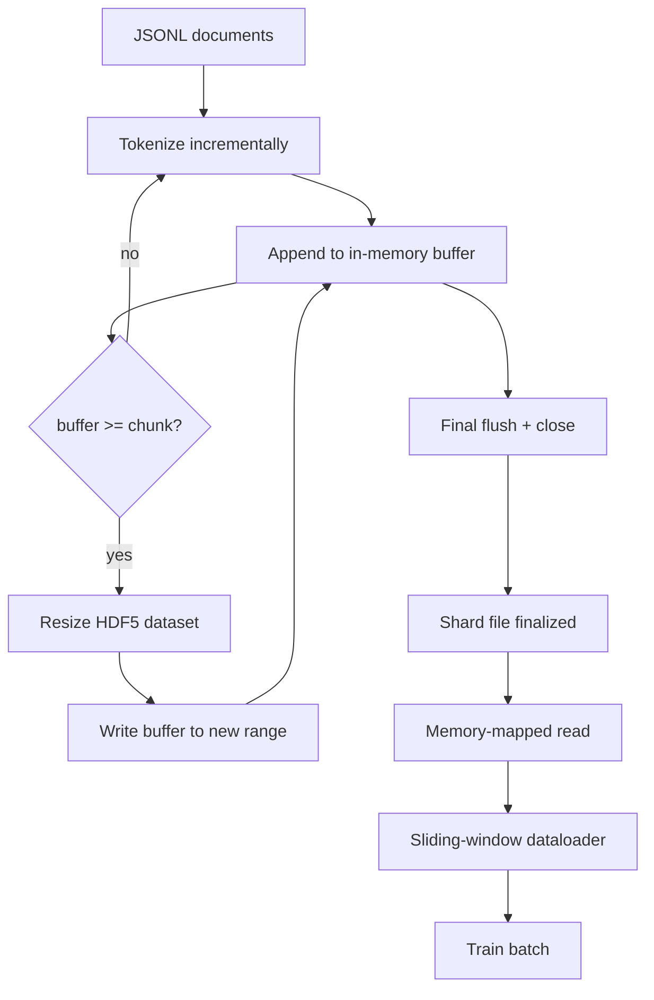

# HDF5 토큰화된 말뭉치

> 다운로드된 말뭉치는 트레이너가 라인 속도로 스트리밍할 수 있는 레이아웃으로 배치되어야 합니다. 디스크의 JSONL은 16개의 데이터로더 워커에서 살아남지 못합니다. 크기 조정 가능하고 청크화된 정수 데이터셋이 있는 HDF5는 살아남습니다. 이 레슨은 크기 조정 가능한 HDF5 데이터셋에 스트리밍 토큰화를 구축하고, 여러 파일에 걸쳐 샤드화된 쓰기, 훈련 시간의 메모리 매핑된 읽기 및 올바른 패킹으로 고정 길이 시퀀스를 생성하는 슬라이딩 윈도우 데이터로더를 구축합니다.

**Type:** Build
**Languages:** Python
**Prerequisites:** Phase 19 lessons 30-37
**Time:** ~90 minutes

## Learning Objectives

- 결정론적 청킹으로 크기 조정 가능한 HDF5 정수 데이터셋에 문서를 스트리밍합니다.
- 실패가 제한되고 병렬성이 가능하도록 여러 HDF5 파일에 걸쳐 쓰기를 샤드화합니다.
- HDF5의 페이지 캐시 지원 청크 레이아웃을 통해 토큰을 다시 읽어 데이터로더가 배치 시간에만 배치 버퍼로 복사하도록 합니다.
- 명시적 패킹 규칙으로 고정 길이 훈련 시퀀스를 생성하는 슬라이딩 윈도우 데이터로더를 구현합니다.

## The Problem

현대 언어 모델 훈련 실행은 수십만 개의 워커에서 초당 수십만 샘플의 속도로 토큰을 읽습니다. 디스크의 JSONL은 첫 번째 콜드 캐시 페이지 폴트에서 죽습니다: JSON 파서는 느리고, 문서 경계는 주소 지정이 가능하지 않으며, "샘플 4,217,884"를 찾는 것은 파일 스캔이 필요합니다. 잘 압축되는 Parquet조차도 트레이너가 열을 원하지 않기 때문에 적합하지 않습니다; 그것은 O(1) 랜덤 액세스가 있는 평면 토큰 스트림을 원합니다.

HDF5는 청크화되고 크기 조정 가능하며 정수 전용 데이터셋을 제공하기 때문에 적합하며, 청크는 읽기 시간에 페이지 캐시 친화적입니다. 트레이너는 `tokens[3,200,000 : 3,200,8192]`의 슬라이스를 요청하고 HDF5는 요청된 하이퍼슬래브를 페이지 캐시에서 새로 할당된 NumPy 배열로 복사합니다. 비용은 워커당 하나의 열린 파일 핸들과 청크 크기의 페이지 캐시 풋프린트로, JSONL 디코딩 비용에 비해 무시할 수 있습니다.

빌드 문제는 쓰기 측을 정직하게 만드는 것입니다. 크기 조정 가능한 데이터셋은 오용하기 쉽습니다: 한 번에 하나의 문서를 쓰면 HDF5 파일이 사용할 수 없을 정도로 조각납니다. 한 번의 크기 조정으로 모든 문서를 쓰면 프로세스 종료가 전체 샤드를 잃습니다. 올바른 규율은 버퍼-후-확장이며, 버퍼 크기가 청크 크기와 일치하고, 작업 부하를 파일 간에 분할하는 샤드화된 쓰기로 충돌 시 최대 하나의 샤드만 손실됩니다.

## The Concept



### Resizable HDF5 done right

토큰 데이터셋은 `maxshape=(None,)` 및 고정 `chunks=(chunk_size,)`로 생성됩니다. 쓰기는 `chunk_size` 길이의 NumPy 배열에 토큰을 버퍼링하여 진행됩니다. 버퍼가 채워지면 데이터셋이 정확히 `chunk_size`만큼 크기 조정되고 버퍼가 새 범위에 작성됩니다. 샤드 종료 시 잔여 버퍼는 최종 부분 범위에 작성됩니다. 마지막 쓰기를 제외한 모든 쓰기는 연속적이고 청크 정렬되어 있으며, 판독기는 샤드의 HDF5 속성에 기록된 `token_count`에서 잘라내도록 지시받습니다.

### Sharded write

단일 HDF5 파일은 단일 실패 지점입니다. 파이프라인은 샤드를 병렬로 작성합니다: Phase 19 레슨 42의 각 입력 샤드는 하나의 HDF5 출력 샤드를 생성합니다. `shards.json` 인덱스는 샤드당 파일 경로, 토큰 수, 문서 수 및 토큰에 대한 sha256을 기록합니다. 트레이너는 `shards.json`을 읽어 전역 오프셋을 계산하고 말뭉치를 검증합니다.

### Memory-mapped read

훈련 시간에 각 워커는 HDF5 파일을 `swmr=True` 모드로 열고 `tokens[start:stop]`을 요청합니다. HDF5의 청크 레이아웃은 청크가 뜨거워지면 페이지 캐시 지원 읽기가 됩니다. 워커는 전체 파일을 구체화하지 않습니다: 슬라이스는 데이터로더의 배치 버퍼로 복사되며, 데이터로더는 배치 시간에 이를 고정 메모리 훈련 텐서로 복사합니다. 핫 경로는 청크 전환당 하나의 시스템 콜을 가집니다; 그 외의 모든 것은 RAM 액세스입니다.

### Sliding-window dataloader

데이터로더는 훈련 시퀀스 길이를 아는 유일한 단계입니다. 전역 토큰 스트림에서 무작위 시작 인덱스를 선택하고, `window_size + 1` 토큰을 읽고, `(input, target) = (tokens[:-1], tokens[1:])`를 반환합니다. 문서 경계는 강제되지 않습니다: 윈도우는 두 문서에 걸쳐 있을 수 있으며, 그 사이에 명시적 `boundary_token_id`가 있어 모델이 구분 기호를 사용하는 방법을 학습합니다. 이것은 표준 패킹 규칙입니다; 또한 초보자가 잊어버려 말뭉치가 8% 훈련 경계 토큰과 92% 자연 텍스트가 되는 규칙이기도 합니다.

## Build It

`code/main.py` implements:

- `Tokenizer` - 데모에 충분한 바이트 수준 결정론적 토크나이저. 인터페이스는 `encode(text) -> list[int]` 및 `vocab_size`입니다.
- `HDF5ShardWriter` - 크기 조정 가능한 정수 데이터셋을 열고, 토큰을 청크 크기로 버퍼링하고, 고정 크기 스트라이드로 크기 조정 및 쓰기, 닫을 때 HDF5 속성으로 `token_count` 및 `sha256` 기록.
- `ShardedTokenizationPipeline` - 입력 문서를 반복하고, 작성자에게 라우팅하고, `shards.json` 인덱스를 생성합니다.
- `MmapTokenStore` - 메모리 매핑된 읽기를 위해 샤드 파일을 열고, 전역 오프셋을 계산하고, 단일 `get_slice(start, stop)` API를 노출합니다.
- `SlidingWindowDataloader` - 전역 스트림에서 무작위 윈도우를 선택하고 `(input_ids, target_ids)` NumPy 배열을 생성합니다.

파일 하단의 데모는 작은 메모리 내 말뭉치를 구축하고, 두 개의 샤드로 토큰화하고, 메모리 맵을 통해 열고, 10개 배치에 대해 데이터로더를 실행하고, 배치별 형태와 체크섬을 출력합니다.

Run it:

```bash
python3 code/main.py
```

스크립트는 0으로 종료되고 배치 체크섬을 출력합니다.

## Production Patterns

네 가지 패턴이 이 레슨을 실제 훈련 실행으로 확장합니다.

**Chunk size equals the typical read.** 트레이너는 샘플당 `window_size + 1` 토큰을 읽습니다. HDF5 청크를 `window_size`의 배수로 설정하면 읽기가 페이지 캐시 정렬됩니다. 일치하지 않는 청크는 모든 샘플이 두 청크에 닿기 때문에 처리량이 절반으로 줄어듭니다.

**Token count in attributes, not in the dataset.** 데이터셋의 후행 슬라이스는 청크 크기가 문서 경계를 나누지 않기 때문에 부분적으로 채워질 수 있습니다. 실제 `token_count`를 HDF5 속성으로 저장하고 판독기가 해당 값에서 잘라내도록 합니다. 이것이 없으면 판독기는 끝을 넘어 0으로 채워진 토큰으로 걸어가고 모델은 0을 예측하는 법을 배웁니다.

**Sharded sha256 with parallel verification.** 각 샤드는 토큰 바이트에 대한 자체 sha256을 가지고 있습니다. 트레이너는 훈련 시작 전에 모든 샤드를 병렬로 검증할 수 있습니다. 잘못된 sha256은 16시간 후 3 에폭이 아니라 일찍 실행을 실패시킵니다.

**`swmr=True` on both sides, with `libver="latest"` on the writer.** SWMR(Single-Writer-Multiple-Reader) 모드는 작성자가 `libver="latest"`로 열고, 모든 데이터셋을 미리 생성한 다음 `file.swmr_mode = True`를 설정해야 합니다. 그 후 작성자는 각 크기 조정 후 `dataset.flush()`를 호출해야 `swmr=True`로 열린 판독기 워커가 일관된 데이터를 볼 수 있습니다. `libver="latest"`를 건너뛰거나 구조적 변경 후 SWMR을 활성화하면 "파일이 잠겼습니다" 실패의 일반적인 원인입니다.

## Use It

프로덕션 패턴:

- **One HDF5 per source shard.** 다운로더(레슨 42)는 URL당 하나의 샤드를 생성합니다; 토큰화(이 레슨)는 소스 샤드당 하나의 HDF5를 생성합니다. 1:1 매핑은 재개 및 부분 실패 복구를 간단하게 만듭니다.
- **Boundary token id.** 경계 토큰은 토크나이저 어휘의 일부이며 데이터로더가 주입하는 유일한 토큰입니다. 모델이 무시해야 하는 경우 훈련 손실은 경계 토큰을 마스킹합니다; 그렇지 않으면 시퀀스 구분 기호로 사용하는 법을 배웁니다.
- **`shards.json` as the source of truth.** 새 샤드를 추가하는 것은 HDF5를 쓰고, sha256을 계산하고, 항목을 추가하는 것을 의미합니다. 트레이너는 시작 시 파일을 한 번 읽고 디렉터리 목록을 건드리지 않습니다.

## Ship It

`outputs/skill-hdf5-tokenized-corpus.md`는 실제 프로젝트에서 어떤 토크나이저가 파이프라인을 공급하는지, 어떤 청크 크기가 트레이너의 윈도우와 일치하는지, `shards.json`이 버전 관리에서 어디에 있는지, 데이터로더 워커가 파일 간에 어떻게 샤드화되는지 설명합니다. 이 레슨은 엔진을 제공합니다.

## Exercises

1. HDF5 작성자에 `--compression gzip` 플래그를 추가하고 데모 말뭉치에서 처리량 비용을 측정합니다. 선택한 기본값을 방어합니다.
2. 슬라이딩 윈도우 데이터로더에 결정론적 시드를 추가하고 동일한 시드를 가진 두 실행이 동일한 배치를 생성하는지 확인합니다.
3. 모든 샤드를 읽고, 토큰에 대한 sha256을 다시 계산하고, `shards.json`과 비교하는 `--validate` 모드를 추가합니다. CI는 훈련 시작 전에 이것을 실행해야 합니다.
4. 청크 크기가 윈도우 크기와 같을 때, 절반일 때, 두 배일 때 데이터로더 처리량을 비교합니다. 페이지 캐시 효과를 보고합니다.
5. 쓰기 시간에 매우 긴 문서를 자르는 `--max-document-tokens` 플래그를 추가합니다. 읽기 시간에 결정하는 것과의 트레이드오프를 방어합니다.

## Key Terms

| Term | What people say | What it actually means |
|------|-----------------|------------------------|
| Resizable dataset | "Append-only" | `maxshape=(None,)`로 생성되고 청크 크기 스트라이드의 `resize` 호출을 통해 증가하는 HDF5 데이터셋 |
| Chunked layout | "How HDF5 stores it" | 커널이 메모리 매핑할 수 있고 데이터로더가 연속적으로 읽을 수 있는 고정 크기 디스크 페이지 |
| `swmr` mode | "Read-while-write" | 데이터로더 워커가 파일을 안전하게 공유할 수 있는 SWMR(Single-Writer-Multiple-Reader) 모드 |
| Shard index | "shards.json" | 모든 토큰 샤드의 오프셋과 콘텐츠 해시가 있는 내구성 있는 인덱스 |
| Sliding window | "Training sample" | 트레이너가 하나씩 이동된 대상과 쌍을 이루는 전역 토큰 스트림의 고정 길이 슬라이스 |

## Further Reading

- [HDF5 chunking documentation](https://docs.hdfgroup.org/hdf5/v1_14/) - the chunked, resizable dataset layout this lesson uses
- [h5py user guide](https://docs.h5py.org/en/stable/) - Python bindings for HDF5
- [NumPy memory mapping](https://numpy.org/doc/stable/reference/generated/numpy.memmap.html) - the read-side primitive HDF5 exposes through h5py
- Phase 19 · 42 - the downloader whose output this lesson tokenizes
- Phase 19 · 44 - the cosine schedule that consumes this dataloader
- Phase 19 · 45 - the AMP loop that wraps the training step
