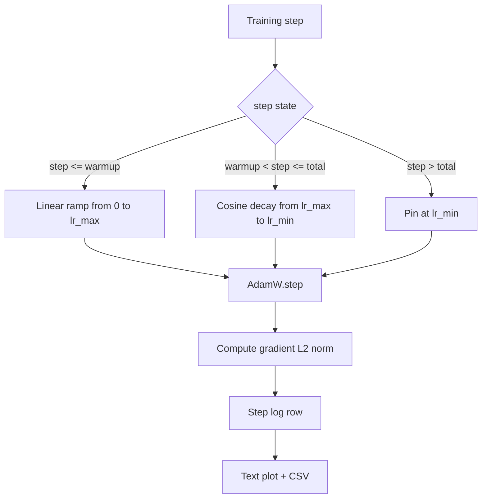

# 선형 웜업이 있는 코사인 학습률

> 학습률 스케줄은 손실 함수 다음으로 두 번째로 중요한 결정입니다. 코사인 감쇠와 선형 웜업이 있는 AdamW는 취약한 첫 천 개 업데이트 동안 모델이 작은 유효 스텝 크기를 보고, 설정된 피크까지 상승하며, 부드럽게 0으로 감쇠하기 때문에 언어 모델 훈련의 현대적 기본값입니다. 이 레슨은 그 스케줄을 구축하고, 훈련 단계에 걸쳐 곡선을 플롯하며, 그래디언트 노름을 스케줄 옆에 기록하고, 스케줄이 웜업, 피크 및 감쇠 경계를 존중함을 증명합니다.

**Type:** Build
**Languages:** Python
**Prerequisites:** Phase 19 lessons 30-37
**Time:** ~90 minutes

## Learning Objectives

- 선형 웜업이 있는 코사인 학습률 스케줄에 연결된 AdamW 옵티마이저를 구현합니다.
- 실행 간 부동 소수점 드리프트 없이 임의 단계에서 스케줄의 정확한 값을 계산합니다.
- 그래디언트 L2 노름을 학습률과 나란히 기록하여 훈련 건강 상태를 관찰 가능하게 합니다.
- 눈으로 읽을 수 있는 텍스트 플롯과 어떤 도구에서든 소비할 수 있는 CSV로 스케줄을 렌더링합니다.

## The Problem

처음 천 개의 훈련 업데이트가 가장 시끄럽습니다. 모델의 가중치는 여전히 초기화에 가깝습니다. 옵티마이저의 실행 중인 두 번째 모멘트 추정치는 안정화되지 않았습니다. 그래디언트 노름은 크고 시끄럽습니다. 이 업데이트 동안 학습률이 피크에 있으면 모델은 완전히 발산하거나 결코 벗어나지 못하는 손실 고원에 정착합니다. 두 가지 잘 알려진 해결책은 그래디언트 클리핑(Phase 19 레슨 45의 주제)과 작게 시작하여 상승하는 학습률 스케줄입니다.

코사인-웜업 스케줄은 세 영역이 있습니다. 0단계에서 `warmup_steps`까지 학습률은 0에서 설정된 피크 `lr_max`까지 선형적으로 확장됩니다. `warmup_steps`에서 `total_steps`까지 학습률은 코사인 곡선의 위쪽 절반을 따라 `lr_max`에서 `lr_min`으로 감쇠합니다. `total_steps` 후에는 학습률이 `lr_min`에 고정되어 잘못 설정된 트레이너가 초과해도 조용히 스케줄을 벗어나지 않도록 합니다.

빌드 문제는 스케줄이 오프바이원으로 틀리기 쉽다는 것입니다. 오프바이원은 훈련 6시간 후에 모델이 과적합을 시작하는 순간 학습률이 1% 너무 높거나 낮은 것으로 나타나며, 스케줄이 경계에서 철저히 테스트되지 않으면 보이지 않습니다.

## The Concept



### Warmup formula

`warmup_steps > 0`인 `[0, warmup_steps]`의 `step`에 대해 학습률은 `lr_max * step / warmup_steps`입니다. `warmup_steps = 0`인 퇴화 경우는 "웜업 없음"으로 처리됩니다: 스케줄은 0단계에서 `lr_max`에서 직접 시작하고 즉시 코사인 감쇠에 들어갑니다. 일부 테스트 하네스는 스케줄이 여전히 사용 가능한 곡선을 생성하는지 확인하기 위해 `warmup_steps = 0`을 전달합니다.

### Cosine formula

`(warmup_steps, total_steps]`의 `step`에 대해 학습률은 `lr_min + 0.5 * (lr_max - lr_min) * (1 + cos(pi * progress))`이며, 여기서 `progress = (step - warmup_steps) / max(1, total_steps - warmup_steps)`입니다. `step = warmup_steps`에서 코사인은 `cos(0) = 1`로 평가되어 `lr_max`를 제공하며, 웜업 끝점과 정확히 일치합니다. `step = total_steps`에서 코사인은 `cos(pi) = -1`로 평가되어 `lr_min`을 제공하며, 감쇠 끝점과 정확히 일치합니다.

두 끝점에서의 연속성은 우연이 아닙니다. 스케줄이 함께 붙인 세 개의 다른 함수가 아니라 `step`에 대한 단일 함수로 구현되는 이유입니다. 붙인 스케줄은 `lr_max`가 처음 변경될 때 하나의 경계를 잃습니다.

### Floor after total steps

`step > total_steps`에 대해 학습률은 `lr_min`에 유지됩니다. 계약은 명시적입니다: 스케줄은 오류를 내지 않고 외삽하지 않습니다; 바닥에 고정되고 트레이너가 경고를 기록하도록 합니다. 훈련을 확장해야 하는 트레이너는 루프가 아닌 스케줄의 `total_steps`를 변경합니다.

### Gradient norm logging alongside the rate

스케줄은 훈련 건강의 절반입니다. 그래디언트 노름은 나머지 절반입니다. 훈련 루프는 둘 다 단계별로 기록합니다. 발산하는 훈련 실행은 손실보다 먼저 그래디언트 노름이 급증하는 것을 보여줍니다; 잘 조정된 웜업은 노름이 비율과 함께 선형적으로 상승하게 합니다; 너무 공격적인 피크는 웜업 후에도 노름이 높게 유지되는 것으로 나타납니다. 디스크의 데이터셋은 `step, lr, grad_l2_norm, loss`입니다. CSV는 유일한 내구성 있는 레코드입니다.

## Build It

`code/main.py` implements:

- `CosineWithWarmup` - 설정된 스케줄에 대한 무상태 함수 `lr(step) -> float`.
- `TrainState` - 모델, `AdamW` 옵티마이저 및 스케줄을 단일 단계 함수로 래핑합니다.
- `TrainState.step` - 하나의 순전파, 하나의 역전파를 실행하고, 그래디언트 L2 노름을 기록하고, 옵티마이저에 `lr(step)`을 적용합니다.
- `plot_schedule_ascii` - 눈으로 읽을 수 있는 텍스트 플롯으로 스케줄을 렌더링합니다.
- `write_schedule_csv` - 학습률과 함께 단계당 한 행을 출력합니다.

파일 하단의 데모는 고정 입력 배치에 대해 20단계 동안 작은 `nn.Linear` 모델을 훈련하고, 단계별 학습률, 그래디언트 노름 및 손실을 출력합니다. 스케줄은 시각적 sanity 검사를 위해 텍스트 플롯으로도 렌더링됩니다.

Run it:

```bash
python3 code/main.py
```

스크립트는 0으로 종료되고 단계별 훈련 로그와 스케줄 플롯을 출력합니다.

## Production Patterns

네 가지 패턴이 스케줄을 프로덕션 아티팩트로 격상시킵니다.

**Schedule lives in a config, not in code.** 트레이너는 git에 커밋된 YAML 또는 JSON 설정에서 `warmup_steps`, `total_steps`, `lr_max`, `lr_min`을 읽습니다. 설정이 콘텐츠 주소 지정이 가능하므로 스케줄은 재현 가능합니다; 설정이 PR diff의 일부이므로 스케줄은 감사 가능합니다.

**Step counter is monotonic and decoupled from epochs.** 일부 프레임워크는 데이터셋이 샤드화되거나 데이터로더가 다시 시작될 때 단계와 에폭을 혼동합니다. 스케줄은 로컬 카운터가 아닌 트레이너의 체크포인트에서 `global_step`을 읽습니다. 단계 카운터가 내구성 있는 축이므로 재개된 실행은 올바른 스케줄 위치에서 계속됩니다.

**Schedule plot in the run directory.** 모든 훈련 실행은 `outputs/lr_schedule.png`(또는 이 레슨에서는 텍스트 플롯)를 실행 디렉터리에 씁니다. 디렉터리를 훑어보는 검토자는 아무것도 다시 실행하지 않고 스케줄을 sanity 검사할 수 있습니다. 이는 PR 시간에 잘못 설정된 스케줄 클래스의 버그를 잡아냅니다.

**Log row schema is fixed.** `step, lr, grad_l2_norm, loss` 순서입니다. 다운스트림 노트북이나 대시보드는 스키마를 읽습니다; 버전을 올리지 않고 열 이름을 바꾸면 모든 기존 대시보드가 무효화됩니다.

## Use It

프로덕션 패턴:

- **Sweep peak before sweeping anything else.** `lr_max`가 가장 민감한 노브입니다. 먼저 작은 모델에서 스윕하십시오; 최적 `lr_max`는 모델 크기에 따라 약하게 확장되므로 작은 모델 스윕은 강력한 사전 지식입니다.
- **Warmup is a fraction of total steps, not an absolute count.** 2억 단계 실행에 2,000 웜업 단계는 거의 즉시 피크에서 시작합니다; 동일한 숫자의 20,000 단계 실행은 10% 동안 웜업됩니다. 웜업을 분수(일반적: 1-3%)로 설정하면 스케줄이 훈련 기간에 따라 확장됩니다.
- **`lr_min` is non-zero on purpose.** `lr_max`의 10%인 바닥은 긴 꼬리 동안 옵티마이저가 계속 학습하게 합니다. `lr_min = 0` 스케줄은 플롯에서 멋져 보이지만 실제로 훈련을 완료하지 않은 모델을 생성합니다.

## Ship It

`outputs/skill-cosine-warmup.md`는 실제 프로젝트에서 어떤 설정이 스케줄을 담고 있는지, 어떤 트레이너 단계에서 전역 카운터를 읽는지, 어떤 `lr_max` 스윕이 배포된 값을 생성했는지 설명합니다. 이 레슨은 엔진을 제공합니다.

## Exercises

1. 스케줄의 역제곱근 변형을 추가하고 200단계 장난감 훈련 실행에서 비교합니다. 어떤 곡선이 더 낮은 최종 손실을 생성합니까?
2. `total_steps / 2`에 두 번째 웜업을 추가하는 `--restart` 플래그를 추가합니다. 웜 재시작이 장난감 실행에서 개선되는지 해가 되는지 방어합니다.
3. 스케줄이 연속적임을 확인하는 단위 테스트를 추가합니다: `[0, total_steps]`의 모든 단계에 대해 차이 `|lr(step+1) - lr(step)|`는 `lr_max / warmup_steps`로 제한됩니다.
4. 스케줄을 `torch.optim.lr_scheduler.LambdaLR`에 연결하여 프레임워크 코드와 구성되도록 합니다. 이 레슨은 평범한 단계 함수를 사용합니다; 래퍼가 무엇을 변경합니까?
5. `matplotlib`를 통해 실제 플롯을 쓰는 `--plot-png` 플래그를 추가합니다. 레슨의 텍스트 플롯과 PNG 중 CI 실행에 더 나은 기본값이 무엇인지 방어합니다.

## Key Terms

| Term | What people say | What it actually means |
|------|-----------------|------------------------|
| Warmup | "Slow start" | 처음 `warmup_steps` 업데이트 동안 0에서 `lr_max`까지의 선형 상승 |
| Cosine decay | "Smooth drop" | 나머지 단계에 걸쳐 `lr_max`에서 `lr_min`까지의 위쪽 절반 코사인 곡선 |
| Floor | "After training" | 스케줄이 `total_steps` 이후에 고정되는 고정 `lr_min` 값 |
| Gradient norm | "L2 of grads" | 연결된 그래디언트 벡터의 유클리드 노름, 각 단계에 기록됨 |
| Global step | "Schedule axis" | 재시작을 견디고 스케줄을 구동하는 단조 단계 카운터 |

## Further Reading

- [Loshchilov and Hutter, SGDR: Stochastic Gradient Descent with Warm Restarts (arXiv 1608.03983)](https://arxiv.org/abs/1608.03983) - the cosine schedule's reference paper
- [Loshchilov and Hutter, Decoupled Weight Decay Regularization (arXiv 1711.05101)](https://arxiv.org/abs/1711.05101) - AdamW's reference paper
- [PyTorch torch.optim.lr_scheduler](https://pytorch.org/docs/stable/optim.html#how-to-adjust-learning-rate) - how step functions compose with framework schedulers
- Phase 19 · 42 - the downloader whose corpus this schedule consumes
- Phase 19 · 43 - the dataloader the schedule co-evolves with
- Phase 19 · 45 - gradient clipping and AMP, the next layer in the loop
