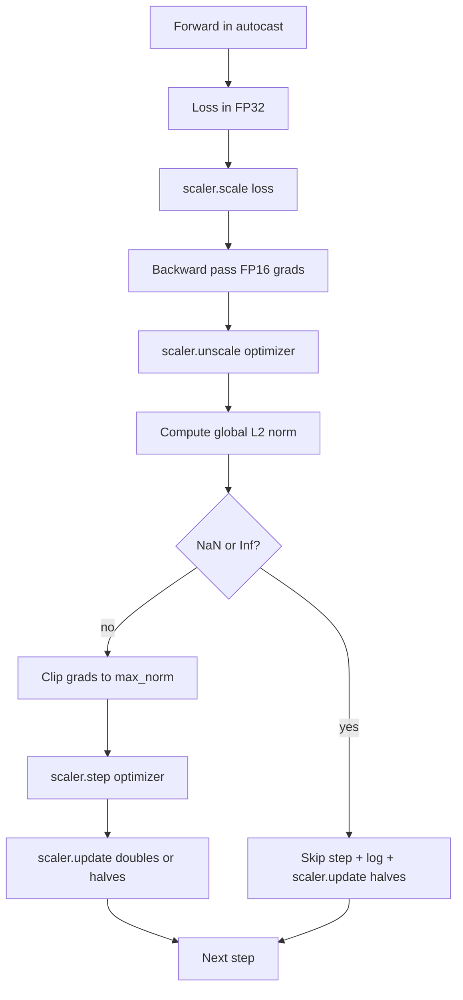

# 그래디언트 클리핑 및 혼합 정밀도

> 이전 레슨의 옵티마이저와 스케줄은 그래디언트가 정상이라고 가정합니다. 보통은 그렇지 않습니다. 단일 나쁜 배치가 그래디언트 노름을 세 자릿수만큼 급증시킬 수 있습니다. 혼합 정밀도 훈련은 FP16 오버플로를 손실 측에 도입하여 이를 증폭시킵니다. 이 레슨은 프로덕션 훈련이 없이는 출시할 수 없는 두 가지 안전 벨트를 구축합니다: 설정된 전역 L2 노름으로의 그래디언트 클리핑, 그리고 NaN 및 Inf를 감지하고, 단계를 깨끗하게 건너뛰고, 포렌식을 위해 스케일링 팩터를 기록하는 autocast 및 GradScaler를 사용한 혼합 정밀도 루프.

**Type:** Build
**Languages:** Python
**Prerequisites:** Phase 19 lessons 30-37
**Time:** ~90 minutes

## Learning Objectives

- 모든 파라미터 그래디언트에 대한 전역 L2 노름을 계산하고 설정된 임계값을 초과할 때 제자리에서 클리핑합니다.
- 훈련 단계를 autocast와 GradScaler로 래핑하여 FP16 순전파 및 역전파가 오버플로에서 살아남도록 합니다.
- 손실 또는 그래디언트에서 NaN 및 Inf를 감지하고, 옵티마이저 단계를 건너뛰고, 건너뛰기를 기록합니다.
- 매 단계마다 GradScaler의 스케일링 팩터를 보고하여 긴 건너뛰기 시퀀스가 즉시 보이도록 합니다.

## The Problem

어제 깨끗하게 실행된 훈련 실행이 8,217단계에서 손실 곡선이 수직으로 올라갑니다. 원인은 그래디언트 노름이 4,200인 단일 배치로, 이전 피크의 20배입니다. 클리핑이 없으면 옵티마이저는 모델이 이전 시간에 한 모든 학습을 재설정하는 단계를 적용합니다. 노름 1.0에서 전역 L2 클립을 사용하면 동일한 배치가 단위 노름 업데이트를 기여합니다; 손실은 추세선에 머물고; 실행은 살아남습니다.

혼합 정밀도 훈련은 순전파와 대부분의 역전파를 FP16으로 계산하여 처리량을 2-3배 높입니다. 비용은 FP16의 좁은 지수 범위입니다. FP16에서 오버플로되는 일반적인 그래디언트는 Inf로 평가되고, 이는 후속 레이어를 통해 NaN으로 전파되며, 다음 옵티마이저 단계에서 모든 가중치를 NaN으로 설정합니다. PyTorch의 GradScaler는 역전파 전에 손실에 큰 스케일링 팩터를 곱하고 옵티마이저 단계 전에 그래디언트를 동일한 팩터로 나누어 이를 해결합니다. 언스케일 시간에 그래디언트가 Inf 또는 NaN이면 스케일러는 단계를 건너뛰고 스케일링 팩터를 반으로 줄입니다; 이전 N단계가 깨끗하면 스케일러는 팩터를 두 배로 늘립니다. 훈련 과정에 걸쳐 팩터는 FP16 범위가 허용하는 가장 높은 값을 찾습니다.

빌드 문제는 둘을 올바르게 연결하는 것입니다. 언스케일 전에 클리핑하면 임계값이 스케일된 그래디언트에 있습니다; 언스케일 후에 클리핑하면 GradScaler의 작업 순서가 중요합니다. 올바른 순서는: `scaler.scale(loss).backward()`, 그 다음 `scaler.unscale_(optimizer)`, 그 다음 `clip_grad_norm_`, 그 다음 `scaler.step(optimizer)`, 그 다음 `scaler.update()`입니다. 다른 순서는 조용히 깨진 루프를 생성합니다.

## The Concept



### Global L2 norm

전역 L2 노름은 파라미터별 노름이 아닌 연결된 그래디언트 벡터의 유클리드 노름입니다. PyTorch는 이를 `torch.nn.utils.clip_grad_norm_(parameters, max_norm)`으로 구현합니다. 함수는 클립 전 노름을 반환하므로 레슨이 자연 값과 클리핑된 값 모두를 기록할 수 있으며, 이는 "모든 단계에서 클리핑 중" 진단에 필요합니다.

### autocast and GradScaler

`torch.amp.autocast(device_type)`는 적격 연산(대부분 matmul-클래스 연산)을 FP16에서 선택적으로 실행하는 컨텍스트 관리자입니다. `torch.amp.GradScaler(device_type)`는 역전파 전에 손실을 스케일링하고 옵티마이저 단계 전에 그래디언트를 역스케일링하는 헬퍼입니다. 둘은 함께 설계되었습니다; 하나 없이 다른 하나를 사용하는 것은 테스트가 잡아야 할 설정 오류입니다.

이 레슨은 CI에서 실행되기 때문에 CPU autocast를 사용합니다; 동일한 패턴은 `device_type="cpu"`를 `device_type="cuda"`로 변경하여 CUDA에 그대로 전송됩니다. CPU의 GradScaler는 스텁입니다(CPU autocast는 기본적으로 BF16에서 이미 작동하며 손실 스케일링이 필요하지 않음), 그러나 레슨은 호출 사이트를 포함하여 배선이 GPU 루프와 동일하도록 합니다.

### NaN and Inf detection

감지는 두 곳에서 발생합니다. 첫째, 손실 자체는 역전파 전에 `torch.isfinite`로 확인됩니다; Inf 또는 NaN 손실은 유용한 그래디언트를 생성하지 않으며 옵티마이저에 들어가지 않고 건너뜁니다. 둘째, `scaler.unscale_(optimizer)` 후에 레슨은 `has_non_finite_grad(...)`로 언스케일된 그래디언트를 스캔하고 Inf 또는 NaN을 건너뛰기로 처리합니다. 두 검사가 함께 순전파 및 역전파 실패 모드를 모두 다룹니다.

### Scaling factor diagnostics

스케일링 팩터는 GradScaler의 내부 상태입니다. 매 단계마다 레슨은 `scaler.get_scale()`을 읽고 학습률 및 그래디언트 노름 옆에 기록합니다. 건강한 실행은 스케일링 팩터가 2의 거듭제곱으로 `2^17` 또는 `2^18` 근처에서 포화될 때까지 상승하는 것을 보여줍니다. 잘못된 실행은 팩터가 높은 값과 낮은 값 사이에서 진동하는 것을 보여주며, 이는 모델의 그래디언트가 때로는 범위 내에 있고 때로는 그렇지 않다는 신호입니다. 기록하지 않으면 진단이 보이지 않습니다.

## Build It

`code/main.py` implements:

- `clip_global_l2_norm` - 클립 전 및 클립 후 노름을 모두 반환하는 `torch.nn.utils.clip_grad_norm_` 주변의 래퍼.
- `has_non_finite_grad` - NaN 및 Inf에 대해 그래디언트를 스캔하는 헬퍼.
- `AmpTrainState` - 모델, `AdamW` 옵티마이저, GradScaler 및 autocast 장치를 래핑합니다. 전체 클리핑, 스케일링 및 NaN 시 건너뛰기 파이프라인을 실행하는 `step(inputs, targets)`를 노출합니다.
- `StepLog` 및 `SkipLog` - 구조화된 단계별 레코드.
- 5단계에서 그래디언트에 Inf를 주입하여 건너뛰기 경로를 실행하고 결과 로그를 출력하는 20단계 동안 작은 `nn.Linear` 모델을 훈련하는 데모.

Run it:

```bash
python3 code/main.py
```

스크립트는 0으로 종료되고 각 행이 `STEP` 또는 `SKIP`으로 태그된 단계별 로그를 출력합니다; 적어도 하나의 행은 `SKIP`입니다.

## Production Patterns

네 가지 패턴이 루프를 프로덕션 훈련 단계로 격상시킵니다.

**Skip counter as an alert, not a log line.** 훈련 실행당 소수의 건너뛴 단계는 건강합니다. 에폭당 수백 개의 건너뛰기는 심각한 경보입니다: 모델이 FP16이 유지할 수 없는 영역에 있으며 루프가 조용히 실패하고 있습니다. 이 레슨은 1,000단계 롤링 건너뛰기 비율을 추적하고 프로덕션에서는 5% 이상의 비율에서 페이지를 호출합니다.

**Clip threshold lives in the config.** `max_norm = 1.0`은 언어 모델 훈련의 현대적 기본값입니다. 먼저 작은 모델에서 스윕하십시오; 더 큰 임계값은 모델이 진정으로 어려운 배치에서 복구할 수 있게 합니다; 더 작은 임계값은 더 시끄러운 손실 곡선의 비용으로 최악의 경우를 제한합니다. 임계값은 레슨 44의 스케줄과 동일한 YAML 또는 JSON 설정에 속합니다.

**Norm log goes to a CSV with the schedule.** CSV 열은 `step, lr, grad_l2_pre_clip, grad_l2_post_clip, loss, skipped, skip_reason, scaler_scale`입니다. 파일을 여는 검토자는 스케줄, 그래디언트 스토리, 스케일링 팩터 및 건너뛰기 결과(이유 포함)를 한 행에서 봅니다. 열을 여러 파일로 분할하는 것은 정렬되지 않은 분석을 위한 레시피입니다.

**`scaler.update()` runs every step, even on skip.** 깨끗한 단계에서 스케일러는 no-inf 카운터를 읽고, 증가시키고, 팩터를 두 배로 늘립니다. 건너뛴 단계에서 스케일러는 팩터를 반으로 줄이고 카운터를 재설정합니다. 건너뛰기 경로에서 `update()`를 잊어버리는 것이 "스케일링 팩터가 변경되지 않음"을 생성하는 버그입니다.

## Use It

프로덕션 패턴:

- **Autocast device matches optimizer device.** GPU 훈련의 경우 `torch.amp.autocast(device_type="cuda")`; CPU의 경우 `torch.amp.autocast(device_type="cpu")`. 장치를 혼합하면 손실 곡선은 괜찮아 보이지만 모델이 학습하지 않는 조용한 타입 오류가 발생합니다.
- **Loss check before backward.** `torch.isfinite(loss).all()`은 하나의 텐서 축소입니다; 비용은 무시할 수 있고 NaN 손실에 대한 절약은 전체 훈련 단계입니다. 항상 실행하십시오.
- **`set_to_none=True` in `zero_grad`.** 그래디언트를 0 대신 `None`으로 설정하여 옵티마이저가 영향을 받지 않은 파라미터 그룹에 대한 계산을 건너뛸 수 있습니다. 이 설정은 무료 처리량 개선과 약간의 버그 표면 감소입니다.

## Ship It

`outputs/skill-clip-amp.md`는 실제 프로젝트에서 훈련 단계가 어떤 클립 임계값과 autocast 장치를 사용하는지, 단계별 CSV가 버전 관리에서 어디에 있는지, 프로덕션 건너뛰기 비율 경보 임계값이 무엇인지 설명합니다. 이 레슨은 엔진을 제공합니다.

## Exercises

1. 합성 Inf 주입을 실제 손실 급증(한 배치의 대상을 1e8로 곱하기)으로 교체하고 건너뛰기 경로가 트리거되는지 확인합니다.
2. autocast를 FP16 대신 BF16으로 전환하는 `--bf16` 모드를 추가합니다. BF16은 FP16보다 더 넓은 지수 범위를 가지며 손실 스케일링이 거의 필요하지 않습니다; 동일한 데모에서 건너뛰기 비율이 0으로 떨어지는지 확인합니다.
3. 클리핑이 발생하지 않을 때 그래디언트-클립 래퍼가 클립 전 및 클립 후 노름을 올바르게 반환하는 단위 테스트를 추가합니다.
4. 롤링 윈도우 건너뛰기 비율 계산과 100 연속 단계 동안 비율이 설정된 임계값을 초과하면 실행을 실패시키는 CLI 플래그를 추가합니다.
5. 루프가 표준 CSV(`step, lr, grad_l2_pre_clip, grad_l2_post_clip, loss, skipped, skip_reason, scaler_scale`)를 쓰도록 연결하고 모든 행 후에 플러시하여 파일이 Ctrl-C에서 살아남는지 확인합니다.

## Key Terms

| Term | What people say | What it actually means |
|------|-----------------|------------------------|
| Global L2 norm | "Clip target" | 모든 훈련 가능한 파라미터에 걸쳐 연결된 그래디언트 벡터의 유클리드 노름 |
| autocast | "Mixed precision" | `with` 블록 내에서 적격 연산의 선택적 FP16(또는 BF16) 실행 |
| GradScaler | "Loss scaler" | 역전파 전에 손실을 곱하고 옵티마이저 단계 전에 그래디언트를 역스케일링하는 헬퍼 |
| Skip | "Bad step" | 그래디언트 또는 손실이 유한하지 않아 거부된 옵티마이저 단계; 스케일러가 팩터를 반으로 줄임 |
| Scaling factor | "Scaler state" | GradScaler의 현재 승수; 깨끗한 구간 후 두 배, 건너뛰기마다 반으로 줄어듦 |

## Further Reading

- [Micikevicius et al., Mixed Precision Training (arXiv 1710.03740)](https://arxiv.org/abs/1710.03740) - the original loss-scaling proposal
- [Pascanu, Mikolov, Bengio, On the difficulty of training recurrent neural networks (arXiv 1211.5063)](https://arxiv.org/abs/1211.5063) - the gradient-clipping reference paper
- [PyTorch torch.amp.GradScaler](https://pytorch.org/docs/stable/amp.html) - the scaler API this lesson wraps
- [PyTorch torch.nn.utils.clip_grad_norm_](https://pytorch.org/docs/stable/generated/torch.nn.utils.clip_grad_norm_.html) - the clipping primitive this lesson uses
- Phase 19 · 42 - the downloader whose corpus feeds the loop
- Phase 19 · 43 - the dataloader the loop consumes
- Phase 19 · 44 - the schedule this loop composes with
