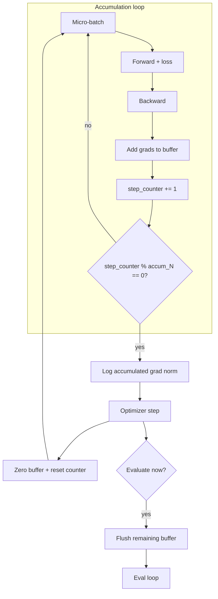

# 그래디언트 누적

> 작은 배치는 학습률을 제한하고 통계적 노이즈를 증가시킵니다. GPU 메모리는 유효 배치 크기를 제한합니다. 그래디언트 누적은 여러 역전파의 그래디언트를 하나의 옵티마이저 단계로 누적하여 이 긴장을 해소합니다. 이 레슨은 가장자리에서 올바른 누적 파이프라인을 구축합니다: 누적 버퍼 초기화, N개의 역전파 후 옵티마이저 단계 실행, 체계적으로 누적 카운터 재설정, 평가 및 체크포인팅과의 상호 작용 처리.

**Type:** Build
**Languages:** Python
**Prerequisites:** Phase 19 lessons 30-37
**Time:** ~90 minutes

## Learning Objectives

- 누적 버퍼를 0으로 초기화하고, 각 역전파 후에 그라디언트를 추가하고, N개 후에 옵티마이저 단계를 실행합니다.
- 단계 재설정: 누적 버퍼를 0으로 설정하고, 카운터를 재설정하고, 데이터로더가 중간 재설정 없이 계속되도록 합니다.
- 누적 중간에 그래디언트 노름을 기록하고, 로그를 누적별 그룹화합니다.
- 평가 및 체크포인팅과의 상호 작용을 처리합니다: 드물게 실행하고, 평가 전에 누적 버퍼를 플러시합니다.

## The Problem

단일 GPU에 대해 합리적인 배치 크기는 256-1024 시퀀스입니다(모델 메모리 풋프린트에 따라 다름). 언어 모델 훈련의 유효 배치 크기는 종종 64k-512k 시퀀스입니다. GPU가 8개 미만인 한 단일 GPU는 일치시킬 수 없는 격차가 있습니다. 그래디언트 누적은 물리적 배치에 대한 옵티마이저 단계당 더 많은 역전파를 실행하여 간격을 메웁니다. 누적 단계 N개마다 하나의 옵티마이저 단계를 실행하면 GPU 수를 변경하지 않고 유효 배치 크기가 N배 증가합니다.

"공짜 점심이 아니다" 부분은 명확합니다: 누적은 전체 역전파와 옵티마이저 단계 사이의 전역 그라디언트 동기화를 N-1 패스 연기합니다. N이 충분히 크면(일반적으로 1024 이상) 그라디언트가 오래되어 옵티마이저 단계가 이미 약간 벗어난 그라디언트에 적용됩니다. 그러나 언어 모델 훈련에서 기본값 N=32가 모든 사이클 시간을 동기화의 전체 비용을 흡수하는 것보다 더 나은 처리량을 제공한다는 것이 경험적으로 확립되어 있습니다.

빌드 문제는 누적기를 올바르게 연결하는 것입니다. 누적기 재설정을 잊어버리면 누적이 누설되어 지난주부터 그라디언트를 추가하게 됩니다. 옵티마이저 단계 후 재설정을 잊어버리면 누적이 절대 0으로 돌아가지 않습니다. 옳지 않은 경계에서 재설정하면 데이터로더 순서가 끊어집니다. 평가 전에 재설정을 잊어버리면 평가가 부분적으로 누적된 버퍼로 실행됩니다.

## The Concept



### Buffer initialization and accumulation

그라디언트 누적 버퍼는 모델과 동일한 파라미터 그룹을 가지며 각각 `.grad`를 `torch.zeros_like(p)`로 초기화합니다. 각 `backward()` 후에 호출자는 `torch.add(accum_buffer[i], p.grad, out=accum_buffer[i])`로 스케일링되지 않은 그라디언트(AMP 언스케일 전, 레슨 45 참조)를 추가합니다. N개 후에 `accum_buffer`의 평균(각 요소를 `N`으로 나눈 값)이 `p.grad`를 대체하고 옵티마이저 단계가 실행됩니다.

### Optimizer step and counter reset

옵티마이저 단계 후 누적기는 두 가지 작업을 수행합니다: 모든 누적 버퍼를 0으로 설정하고, 단계 카운터를 재설정합니다(증분이 아닌 0으로). 재설정은 누적이 다음 사이클의 깨끗한 상태에서 시작되도록 보장합니다. 두 작업을 잊어버리면 루프가 고장납니다.

### Gradient norm logging across accumulation

레슨 45의 그라디언트 노름 로깅은 누적된 값에 작동합니다. 로그 라인에는 누적 색인(`3/16`)과 옵티마이저 단계 횟수가 포함됩니다. 로그의 수신자는 "이 그라디언트 노름은 16개의 누적된 배치를 평균한 것"을 읽고, 옵티마이저 단계당 하나 대신 마이크로배치당 하나의 라인과 비교합니다.

### Evaluation interaction

평가는 누적기 상태에 대해 신경 쓰지 않지만, 누적기는 평가에 대해 신경 씁니다. 평가가 일부 누적되지 않은 배치 그라디언트를 사용하여 실행되고 평가 후 훈련이 다른 누적 색인에서 재개되면, 평가 지표가 훈련 지표와 올바르게 정렬되지 않습니다. 해결책: 평가가 `accum_step_counter % accum_N == 0`에서만 시작되도록 하고, 평가 전에 누적기를 플러시하고, 평가 중에는 누적기를 비활성화합니다.

## Build It

`code/main.py` implements:

- `GradAccumulator` - 누적 버퍼, 단계 카운터 및 `reset()`, `accumulate(grads)`, `step(optimizer)` 메서드.
- `AccumTrainState` - 모델, 옵티마이저, GradScaler 및 누적기를 래핑합니다. 누적 파이프라인을 실행하는 `step(inputs, targets)`를 노출하고, 옵티마이저 단계가 실행될 때 그라디언트 노름을 기록합니다.
- `AccumStepLog` - `log["step_type"] = "micro" | "optim"` 레코드; 옵티마이저 단계 로그는 누적 색인과 누적된 그라디언트 노름을 포함합니다.
- 8번의 역전파(즉, 8개의 마이크로배치, 2개의 누적 주기) 후에 하나의 옵티마이저 단계를 실행하는 `N=4` 누적기로 32단계의 장난감 훈련 실행을 하는 데모. 각 로그 라인은 옵티마이저 단계와 마이크로배치 단계 사이의 구분을 명확히 하기 위해 태그됩니다.

Run it:

```bash
python3 code/main.py
```

스크립트는 0으로 종료되고 `MICRO` 또는 `OPTIM`으로 태그된 단계별 로그를 출력합니다.

## Production Patterns

세 가지 패턴이 누적기를 프로덕션에 적합하게 만듭니다.

**Accumulation schedule lives in the config.** `accum_N`은 레슨 44의 스케줄과 동일한 설정 파일에 속합니다. 대부분의 실행은 변경할 필요가 없는 단일 `accum_N`을 사용합니다; 변경하는 실행은 감사 가능한 커밋 diff가 필요합니다.

**Accumulation and AMP interact carefully.** `scaler.unscale_(optimizer)`는 AMP 언스케일이 옵티마이저 단계 전에 단 한 번 실행될 것을 요구합니다. 누적기는 언스케일 전에 그라디언트를 누적하여 누적된 그라디언트가 동일한 스케일링 팩터로 역스케일링되도록 합니다. 개별 마이크로배치 그라디언트를 언스케일링한 다음 누적하면 스케일이 일치하지 않습니다.

**Accumulation with distributed training.** DDP(Phase 19 레슨 77)는 `backward()`가 각 마이크로배치에서 all-reduce를 트리거합니다. `accum_N`을 늘리면 all-reduce 빈도가 감소하여 처리량이 향상됩니다; 그러나 N이 너무 높으면 all-reduce가 고대역폭보다 레이턴시 친화적이기 때문에 처리량이 감소하기 시작합니다. 프로젝트가 이 레슨의 누적기로 스윕하여 올바른 N을 찾습니다.

## Use It

프로덕션 패턴:

- **Default `accum_N=1`.** 누적기는 항상 존재하며 기본적으로 비활성화됩니다. 새 실행은 `accum_N=1`에서 디버깅되고, 안정화된 다음 증가됩니다. 누적기를 조건부로 설정하면 사라지는 버그가 발생합니다.
- **Learning rate warmup interacts with accumulation.** 레슨 44의 웜업은 옵티마이저 단계에 적용됩니다. `accum_N=4`와 `warmup_steps=1000`은 4000개의 마이크로배치가 웜업 중임을 의미합니다. 스케줄러가 카운터에 대해 알아야 할 것이 있습니다: 옵티마이저 단계인지 마이크로배치인지. 이 레슨은 옵티마이저 단계를 사용합니다(표준 관행).
- **Checkpoint before accumulation flush.** 체크포인트는 옵티마이저 단계가 실행된 후에 저장되어야 하며, 그렇지 않으면 체크포인트가 옵티마이저 단계가 이미 실행되었다고 잘못 가정하여 누적 버퍼가 재설정되고 다음 재개가 이전 누적을 누락합니다. 체크포인트는 옵티마이저 단계 카운터와 동일한 카운터를 사용해야 합니다.

## Ship It

`outputs/skill-gradient-accumulation.md`는 실제 프로젝트가 어떤 `accum_N`을 사용하는지, 어떤 설정 파일이 이를 구성하는지, 누적기가 DDP와 함께 어떻게 배치되는지 설명합니다. 이 레슨은 엔진을 제공합니다.

## Exercises

1. 누적기의 내부 버퍼 상태를 덤프하고 재설정 전후에 0인지 확인하는 `--debug` 플래그를 추가합니다.
2. 누적기가 로깅되지 않은 옵티마이저 단계(예: 마이크로배치당 하나의 그래디언트 노름, 옵티마이저 단계당 하나의 평균)로 올바른 그라디언트 노름을 보고하는지 확인하는 단위 테스트를 추가합니다.
3. 동적 누적: `accum_N`이 유효 배치 크기를 변경하고 손실 곡선을 그대로 유지하면서 변경 후에만 트리거되는 평가 사이클에서만 변경되는 스케줄을 허용합니다.
4. `GradAccumulator`와 `GradScaler`를 연결하는 통합 테스트를 추가합니다: 언스케일링된 누적 그라디언트는 옵티마이저 단계 전에 스케일링된 그라디언트와 동일한 노름을 가집니다.
5. `accum_N` 스윕(1, 2, 4, 8, 16)을 200단계 장난감 실행에서 실행하고 출력 로그에서 처리량 차이를 보고합니다.

## Key Terms

| Term | What people say | What it actually means |
|------|-----------------|------------------------|
| Accumulation buffer | "Grad bucket" | 옵티마이저 단계를 생성하기 전에 여러 역전파의 그라디언트를 저장하는 텐서 |
| Accumulation step | "Micro-batch" | 누적기에 추가되는 단일 순전파 + 역전파 |
| Optimizer step | "Update" | 누적기가 플러시되고 옵티마이저가 적용되는 단계 |
| Effective batch | "Virtual batch" | `accum_N * physical_batch_size`, 그라디언트가 평균화되는 창 |
| Accumulation schedule | "N" | 하나의 옵티마이저 단계를 생성하는 마이크로배치 수 |

## Further Reading

- [Goyal et al., Accurate, Large Minibatch SGD: Training ImageNet in 1 Hour (arXiv 1706.02677)](https://arxiv.org/abs/1706.02677) - 그라디언트 누적이 선형 확장 법칙과 어떻게 상호 작용하는지 보여줍니다
- [PyTorch ZeroRedundancyOptimizer](https://pytorch.org/docs/stable/distributed.optim.html) - 누적 버퍼가 분산 샤딩과 어떻게 상호 작용하는지에 대한 대안적 관점
- Phase 19 · 44 - 코사인 웜업 스케줄, 누적기를 구동하는 옵티마이저에 연결됨
- Phase 19 · 45 - AMP 및 클리핑 루프, 누적기가 삽입되는 곳
- Phase 19 · 77 - DDP, 누적기가 all-reduce 빈도를 제어하는 분산 래퍼
