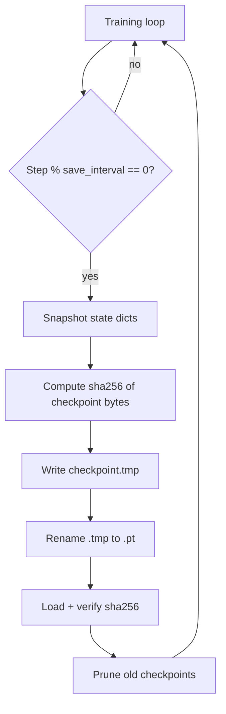

# 체크포인트 저장 및 재개

> 훈련 실행은 수주 또는 수개월 동안 지속됩니다. 실행 중간에 실패하면 처음부터 다시 시작해야 합니다. 체크포인트는 모델 가중치, 옵티마이저 상태, 스케줄러 카운터, 데이터로더 위치 및 RNG 상태가 포함된 내구성 있는 "중단점"입니다. 이 레슨은 별도의 저장 및 로드 경로로 체크포인트 시스템을 구축하고, 저장된 체크포인트와 현재 모델 간의 일관성을 확인하며, 오래된 체크포인트를 정리하는 정리 정책을 구현합니다.

**Type:** Build
**Languages:** Python
**Prerequisites:** Phase 19 lessons 30-37
**Time:** ~90 minutes

## Learning Objectives

- 모델 가중치, 옵티마이저 상태, 스케줄러 단계 카운터, 데이터로러 배치 인덱스 및 RNG 상태를 포함하는 체크포인트 딕셔너리를 작성합니다.
- 체크포인트의 sha256을 계산하고 로드 전에 검증하여 손상된 체크포인트가 조용히 로드되지 않도록 합니다.
- 체크포인트를 로드하고, 현재 모델의 가중치가 원래 체크포인트에 기록된 것과 일치하는지 확인하며, 모델이 체크포인트와 다른 경우 오류를 발생시킵니다.
- 로드되지 않았거나 체크포인트 손상이 있는 상태에서 재개를 시도할 때 오류를 발생시키는 실패-폐쇄 정책을 구현합니다.
- 가장 최근 N개를 유지하고 더 오래된 체크포인트를 제거하는 정리 정책을 구현합니다.

## The Problem

체크포인트의 가장 일반적인 실패는 두 가지입니다. 첫째, 체크포인트가 기록되는 동안(디스크 쓰기 중간) 프로세스가 충돌하면 디스크의 파일이 일관성 없는 상태가 됩니다. 둘째, 체크포인트가 생성된 이후 모델 코드가 변경되어 재개할 때 가중치 형태가 일치하지 않거나 레이어가 없는 경우, 재개가 어떤 상태에 도달하지 않고 오류를 발생시킵니다.

첫 번째 문제의 해결책은 원자적 쓰기입니다: 체크포인트를 임시 파일에 쓰고, `os.rename`으로 대상 파일로 원자적으로 이동합니다. 원자적 쓰기 없이 충돌 시 체크포인트의 절반만 디스크에 기록되고 절반은 사라지며, 재개 시 손상된 텐서가 발생합니다.

두 번째 문제의 해결책은 체크포인트 메타데이터를 검증하는 것입니다: 체크포인트를 로드할 때 sha256을 확인하고, sha256이 일치하지 않으면 오류를 발생시킵니다. 또한 모델 가중치의 sha256이 체크포인트에 기록된 sha256과 일치하는지 확인합니다. sha256이 일치하지 않으면 체크포인트가 현재 코드와 호환되지 않는 것입니다.

## The Concept



### What a checkpoint contains

체크포인트는 다섯 가지 상태를 패키지화합니다:

- **model_state_dict** - 재개 시 모델 가중치를 복원하는 데 필요한 `nn.Module.state_dict()`.
- **optimizer_state_dict** - 옵티마이저 실행 통계(`AdamW`의 exp_avg, exp_avg_sq 등)를 복원하는 `optimizer.state_dict()`.
- **scheduler_step** - 스케줄러의 단계 카운터(레슨 44). `CosineWithWarmup`에 대해 이는 마지막 옵티마이저 단계에서의 전역 단계 카운터입니다.
- **dataloader_batch_index** - 재개할 때 데이터로더가 다시 시작되는 인덱스.
- **rng_state** - `torch.random.get_rng_state()` 및 `numpy.random.get_state()` 및 `random.getstate()`. 이는 재개가 동일한 드롭아웃 마스크를 생성할 필요가 없도록 보장합니다; 덜 중요한 세 가지이지만, 완전히 결정론적인 재개에 필요합니다.

### Atomic write

`torch.save(checkpoint, temp_path)`는 임시 파일에 체크포인트를 씁니다. 저장이 성공하면 `os.replace(temp_path, checkpoint_path)`는 대상 파일을 원자적으로 교체합니다(OS가 동일한 파일 시스템에서 지원하는 경우). 이 패턴 없이는 충돌 시 체크포인트 쓰기가 중단되고 파일이 일관성 없는 상태가 됩니다.

### sha256 verification

체크포인트가 기록되면 sha256이 계산되어 파일과 함께 저장됩니다. 체크포인트가 로드되면 sha256이 다시 계산되고 저장된 값과 일치하는지 확인됩니다. 이는 체크포인트 파일이 기록 후 변경되지 않았음을 보장합니다. 또한 모델 가중치의 sha256이 체크포인트에 기록된 sha256과 일치하는지 확인하여 체크포인트가 예상 가중치를 포함하는지 확인합니다.

## Build It

`code/main.py` implements:

- `CheckpointManager` - 체크포인트 저장/로드를 위한 save/load 인터페이스, sha256 검증, 정리 및 경로 관리를 처리합니다.
- `save_checkpoint(state, path)` - 체크포인트를 임시 파일에 쓰고, sha256을 계산하고, 파일로 원자적으로 이동합니다. sha256은 별도 파일에 기록되거나 체크포인트 딕셔너리의 일부가 될 수 있습니다.
- `load_checkpoint(path)` - sha256을 검증하고, 상태 딕셔너리를 로드하고, sha256이 일치하지 않으면 오류를 발생시킵니다.
- `verify_model_weights(checkpoint, model)` - 모델 가중치의 sha256이 체크포인트에 기록된 것과 일치하는지 확인합니다.
- `prune_checkpoints(directory, keep_last_n)` - 가장 최근 N개를 유지하고 더 오래된 것을 제거합니다.
- `CheckpointDemo` - 주기적으로 체크포인트를 저장하고 실패 시 재개를 시뮬레이션하는 루프.

Run it:

```bash
python3 code/main.py
```

스크립트는 0으로 종료되고 체크포인트 생성, sha256 검증 및 정리를 출력합니다.

## Production Patterns

세 가지 패턴이 체크포인트를 프로덕션에 적합하게 만듭니다.

**Checkpoint frequency is a multiple of evaluation frequency.** 평가가 500단계마다 실행된다면 체크포인트는 1000 또는 2000단계마다 저장되어 평가가 항상 저장된 체크포인트 상태에서 실행되도록 합니다. 평가는 체크포인트를 로드할 필요가 없지만, 일관성을 위해 "내가 저장한 곳에서 평가한다"는 약속을 합니다.

**Checkpoint in the background.** 체크포인트 저장은 디스크 I/O를 포함하며, 이는 훈련 루프를 차단할 수 있습니다. 프로덕션 시스템은 체크포인트 저장을 별도 스레드로 오프로드합니다. 이 레슨은 동기 저장을 사용합니다(단순함을 위해); 프로덕션 각주는 비동기 저장을 설명합니다.

**Checkpoint pruning is conservative.** `keep_last_n=5`는 일반적인 기본값입니다. 너무 많은 체크포인트를 유지하면 디스크가 채워집니다; 너무 적게 유지하면 연구자가 "재개하지만 체크포인트 A로 돌아가서 하이퍼파라미터를 변경"할 수 없습니다. 보수적인 기본값을 가지고 가이드를 따르십시오.

## Use It

프로덕션 패턴:

- **Checkpoint at the end of training, not just during.** 마지막 체크포인트는 모델의 최종 상태입니다. 저장되지 않으면 훈련 실행이 완전히 낭비됩니다. 훈련 완료 시 체크포인트가 저장되도록 `--save-on-exit` 플래그를 추가하십시오.
- **Checkpoint in the same filesystem as the model directory.** 체크포인트가 모델과 동일한 파일 시스템에 있으면 재개가 더 빠르고 안정적입니다. 별도의 볼륨은 마운트 문제를 발생시킵니다.
- **Checkpoint before distributed training init.** 분산 훈련(Phase 19 레슨 77)은 초기화에 체크포인트가 필요합니다. 데이터로더 샤딩 파라미터가 저장됩니다.

## Ship It

`outputs/skill-checkpoint.md`는 실제 프로젝트가 체크포인트를 저장하기 전에 몇 단계를 기다리는지, 어떤 디렉터리 구조를 사용하는지, 정리가 얼마나 보수적인지 설명합니다. 이 레슨은 엔진을 제공합니다.

## Exercises

1. 각 체크포인트에 부모 체크포인트의 sha256으로 `parent_checkpoint_sha256` 필드를 추가하도록 저장 경로를 수정합니다. sha256 불일치에 대한 목록을 재귀적으로 검증합니다.
2. 체크포인트가 기록되는 동안 시뮬레이션된 충돌로 `--crash-after-save` 플래그를 추가하고 재개 시 체크포인트가 여전히 유효한지 확인합니다.
3. 체크포인트가 저장될 때, 마이크로배치 수가 아니라 옵티마이저 단계 카운터가 저장되었는지 확인하는 단위 테스트를 추가합니다.
4. 모델 가중치와 일치하지 않는 체크포인트를 로드할 때 `load_checkpoint`가 오류를 발생시키는 단위 테스트를 추가합니다.
5. 체크포인트 저장이 eval의 모델 상태를 평가하고 저장하며, 누적기 상태를 플러시하고 저장하지 않는지 통합 테스트를 추가합니다(레슨 46).

## Key Terms

| Term | What people say | What it actually means |
|------|-----------------|------------------------|
| Checkpoint | "Save file" | 모델, 옵티마이저 및 데이터로더 상태가 포함된 내구성 있는 스냅샷 |
| Atomic write | "Crash-safe" | 대상 파일이 완전히 기록된 후에만 업데이트되도록 하는 임시 파일 + 이름 변경 패턴 |
| sha256 | "Checksum" | 파일 내용의 암호화 해시, 손상 감지에 사용됨 |
| Prune | "Cleanup" | 디스크 사용량을 제한하기 위해 가장 오래된 체크포인트 제거 |
| Resume | "Restart" | 이전 실행이 중단된 지점에서 훈련 계속 |

## Further Reading

- [PyTorch save/load documentation](https://pytorch.org/docs/stable/notes/serialization.html) - `torch.save` / `torch.load` API
- [Atomic file operation patterns](https://www.weinholt.se/articles/atomic-file-operations/) - `os.replace` 및 충돌 안전성에 대한 배경 지식
- [NumPy random state](https://numpy.org/doc/stable/reference/random/generated/numpy.random.get_state.html) - `numpy.random.get_state()` / `set_state()` API
- Phase 19 · 44 - 스케줄러 카운터가 체크포인트에 포함되는 곳
- Phase 19 · 45 - AMP GradScaler 상태가 체크포인트에 포함되는 곳
- Phase 19 · 46 - 누적기 상태가 체크포인트에 포함되지 않는 곳
- Phase 19 · 77 - 분산 훈련 체크포인트
