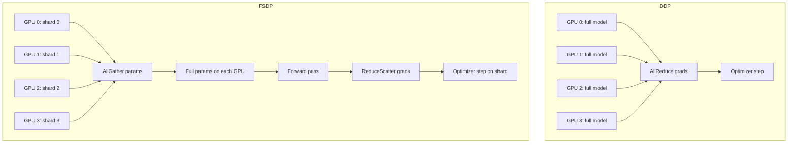

# 분산 훈련: FSDP 및 DDP

> 단일 GPU는 기본 모델조차 훈련하기에 충분한 메모리를 가지고 있지 않습니다. 7B 파라미터 모델은 FP32에서 28GB의 GPU 메모리를 필요로 하고, 옵티마이저 상태는 그 2-3배를 필요로 하며, 활성화는 더 많은 메모리를 필요로 합니다. 분산 훈련은 이 부담을 GPU 클러스터 전체에 분산시킵니다. 이 레슨은 DDP(데이터 분산 병렬 처리)와 FSDP(완전 샤딩된 데이터 병렬 처리)를 구축합니다. DDP는 각 GPU에 전체 모델 사본을 유지하고 그라디언트만 동기화합니다. FSDP는 모델 파라미터, 그라디언트 및 옵티마이저 상태를 GPU 전체에 분할합니다. 둘 다 PyTorch의 분산 패키지를 통해 단일 작성자, 다중 판독기 통신 패턴을 사용합니다.

**Type:** Build
**Languages:** Python
**Prerequisites:** Phase 19 lessons 30-37
**Time:** ~90 minutes

## Learning Objectives

- `torch.distributed.init_process_group`으로 분산 프로세스 그룹을 초기화하고 각 랭크에 고유한 ID를 할당합니다.
- DDP(distributed data parallel) 래퍼를 구현하여 각 GPU가 전체 모델 사본을 유지하고 그라디언트에서 all-reduce를 실행합니다.
- FSDP(fully sharded data parallel) 래퍼를 구현하여 모델 파라미터를 GPU 전체에 분할하고 순전파/역전파 시에만 전체 파라미터를 구체화합니다.
- FSDP의 메모리 사용량을 DDP와 비교하고, FSDP의 메모리 절약이 통신 오버헤드를 통해 측정 가능한지 확인합니다.
- 분산 체크포인팅: DDP 또는 FSDP 모델에서 저장하고 로드합니다.

## The Problem

7B 파라미터 모델을 단일 80GB A100 GPU에 맞추는 것은 불가능하지는 않지만 어렵습니다. 옵티마이저 상태(AdamW는 파라미터당 8바이트: 두 개의 실행 평균)는 56GB를 추가합니다. 활성화 체크포인팅은 순전파 활성화를 저장하지 않음으로써 메모리를 절약하지만 추가 역전파 비용이 듭니다. 충분한 GPU 메모리에 도달하는 유일한 방법은 GPU 클러스터 전체에 부하를 분산시키는 것입니다.

DDP는 가장 간단한 접근 방식입니다. 각 GPU는 전체 모델 사본을 유지합니다. 각 GPU는 다른 데이터 배치를 처리합니다. 각 역전파 후에 GPU는 그라디언트에서 all-reduce를 실행합니다. 모든 GPU는 동일한 그라디언트를 가지며 동일한 옵티마이저 단계를 적용합니다. DDP는 GPU당 모델 메모리 사용량이 동일하므로 모델이 단일 GPU에 맞을 때만 작동합니다.

FSDP는 모델 파라미터, 그라디언트 및 옵티마이저 상태를 GPU 전체에 분할합니다. 순전파 중에 FSDP는 현재 레이어의 파라미터를 all-gather하고, 파라미터를 구체화하고, 순전파를 실행하고, 구체화된 파라미터를 해제합니다. 역전파 중에 FSDP는 현재 레이어의 그라디언트를 reduce-scatter합니다. FSDP는 GPU당 메모리 사용량을 GPU 수로 나눕니다. GPU가 많을수록 GPU당 메모리가 줄어듭니다.

## The Concept



### DDP: Data parallel with all-reduce

DDP에서 각 GPU는 전체 모델을 유지합니다. 모든 GPU는 다른 데이터를 봅니다. 각 GPU는 자체 그라디언트를 계산합니다. 역전파 후에 모든 GPU는 `torch.distributed.all_reduce`로 그라디언트를 합산하고 GPU 수로 나눕니다(평균). 이제 모든 GPU가 동일한 그라디언트를 가지며 동일한 옵티마이저 단계에 들어갑니다. DDP는 all-reduce를 단일 동기화 지점으로 사용합니다.

### FSDP: Fully sharded data parallel

FSDP는 모델 파라미터를 GPU 전체에 분할합니다. 순전파 중에 FSDP는 현재 레이어의 파라미터를 all-gather하여 각 GPU가 레이어의 전체 사본을 가지도록 합니다. 그런 다음 FSDP는 순전파를 실행합니다. 순전파 후에 FSDP는 구체화된 파라미터를 해제합니다. 역전파 중에 FSDP는 현재 레이어의 그라디언트를 reduce-scatter합니다. FSDP는 파라미터, 그라디언트 및 옵티마이저 상태에서 GPU당 메모리 사용량을 GPU 수로 나눕니다.

### Communication patterns

DDP와 FSDP는 다른 통신 프리미티브를 사용합니다. DDP는 all-reduce를 사용합니다(모든 GPU가 그라디언트를 합산하고 결과를 모든 GPU에 브로드캐스트). FSDP는 순전파를 위한 all-gather와 역전파를 위한 reduce-scatter를 사용합니다. all-gather는 각 GPU의 샤드를 수집하여 모든 GPU가 전체 텐서를 가지도록 합니다. reduce-scatter는 그라디언트를 합산하고 각 GPU에 합계의 샤드를 남깁니다.

## Build It

`code/main.py` implements:

- `dist_init(rank, world_size)` - 분산 프로세스 그룹 초기화. 프로세스 그룹은 분산 통신이 작동하는 컨텍스트입니다.
- `DDPWrapper(module)` - 모델 주변의 DDP 래퍼. `forward`를 실행하고, 역전파 후 all-reduce로 그라디언트를 동기화합니다.
- `FSDPWrapper(module)` - 모델 주변의 FSDP 래퍼. 파라미터를 GPU 전체에 분할하고, all-gather로 구체화하고, reduce-scatter로 동기화합니다.
- 분산 루프 - 분산 데이터로더를 반복하고, DDP 또는 FSDP 모델을 훈련하고, 체크포인트를 저장하고, 로드하는 분산 훈련 스크립트.
- 메모리 프로파일러 - `torch.cuda.memory_allocated()`로 DDP와 FSDP 사이의 GPU 메모리 사용량을 비교합니다.

Run it:

```bash
torchrun --nproc_per_node=4 python3 code/main.py
```

스크립트는 0으로 종료되고 GPU당 메모리 사용량, 체크포인트 sha256 및 손실 곡선을 출력합니다.

## Production Patterns

세 가지 패턴이 이 레슨을 프로덕션 분산 훈련으로 확장합니다.

**Use NCCL backend for GPU communication.** `init_process_group(backend="nccl")`은 GPU 간 통신을 위해 NCCL(NVIDIA Collective Communications Library)을 선택합니다. NCCL은 NVIDIA GPU에 최적화되어 있으며 all-reduce, all-gather 및 reduce-scatter에 대해 가장 높은 대역폭을 제공합니다. Gloo는 CPU 폴백이며, MPI는 라이브러리 의존성이 필요합니다. NCCL은 프로덕션 분산 훈련의 표준 선택입니다.

**Shard the dataloader, not the data.** 분산 데이터로더는 데이터셋을 샤드로 분할하고 각 GPU에 하나의 샤드를 할당합니다. `torch.utils.data.distributed.DistributedSampler`는 이를 처리합니다. 각 GPU는 총 데이터셋의 `1/world_size`를 봅니다. FSDP가 모델 파라미터를 샤딩하는 동안 데이터로더는 입력 데이터를 샤딩합니다.

**DDP for small models, FSDP for large models.** 모델이 단일 GPU에 맞으면 DDP를 사용하십시오. all-reduce만 필요하므로 통신 오버헤드가 더 낮습니다. 모델이 단일 GPU에 맞지 않으면 FSDP를 사용하십시오. all-gather 및 reduce-scatter는 더 많은 통신을 필요로 하지만 모델이 GPU에 맞는 유일한 방법입니다.

## Use It

프로덕션 패턴:

- **Gradient accumulation with DDP/FSDP.** 각 GPU는 자체 마이크로배치에서 `backward()`를 호출하고, DDP/FSDP는 `backward()` 후에 동기화를 트리거합니다. 누적기를 `accum_N` 마이크로배치 후에만 동기화하도록 설정하면 통신 빈도가 줄어듭니다. 이는 하나의 옵티마이저 단계당 `world_size * accum_N`의 유효 배치 크기를 생성합니다.
- **Checkpoint only on rank 0.** 분산 훈련에서 모든 랭크에 체크포인트를 저장하면 디스크가 N개의 동일한 사본으로 채워집니다. 랭크 0만 체크포인트를 저장합니다. 재개 시 랭크 0이 체크포인트를 로드하고 브로드캐스트합니다.
- **FSDP with activation checkpointing.** 활성화 체크포인팅은 순전파 활성화를 저장하지 않음으로써 메모리를 절약합니다. FSDP와 결합하면 GPU당 메모리 사용량이 크게 줄어듭니다. 이는 가장 큰 모델을 가능하게 하는 조합입니다.

## Ship It

`outputs/skill-distributed-training.md`는 실제 프로젝트에서 사용되는 GPU 수, 어떤 분산 백엔드(NCCL), 체크포인트가 저장되는 위치(랭크 0만) 및 모델이 FSDP를 필요로 하는 크기 임계값을 설명합니다. 이 레슨은 엔진을 제공합니다.

## Exercises

1. DDP와 FSDP 사이의 처리량 비교(샘플/초)를 위한 벤치마크 모드를 추가합니다. 더 작은 모델에서는 DDP가 우세하고 더 큰 모델에서는 FSDP가 우세해야 합니다.
2. FSDP에서 분산 체크포인팅을 활성화하는 `--sharded-checkpoint` 플래그를 추가합니다. 각 랭크는 자체 샤드만 저장하고 로드 시 재구성합니다.
3. FSDP 하이브리드 샤딩: FSDP가 모델을 샤딩하기 전에 DDP가 데이터를 복제하는 하이브리드 병렬 처리를 구현합니다. 이는 모델이 GPU 전체에 샤딩될 때 DDP가 랭크 간에 데이터를 복제하므로 단일 GPU 모델보다 더 많은 메모리가 필요합니다.
4. FSDP 통신 오버헤드 모니터: all-gather 및 reduce-scatter의 대기 시간을 측정하는 `--profile-communication` 플래그를 추가합니다.
5. GPU가 2개만 있는 경우 GPU가 8개인 경우와 FSDP 메모리 사용량을 비교합니다. 선형 스케일링을 확인합니다.

## Key Terms

| Term | What people say | What it actually means |
|------|-----------------|------------------------|
| DDP | "Data parallel" | 각 GPU가 전체 모델을 유지하고 그라디언트에서 all-reduce를 실행하는 분산 래퍼 |
| FSDP | "Fully sharded" | 모델 파라미터, 그라디언트 및 옵티마이저 상태를 GPU 전체에 분할하는 분산 래퍼 |
| All-reduce | "Sum and broadcast" | 모든 GPU에서 값을 합산하고 결과를 모든 GPU에 브로드캐스트하는 통신 프리미티브 |
| All-gather | "Collect full tensor" | 각 GPU의 샤드를 수집하여 모든 GPU가 전체 텐서를 가지도록 하는 통신 프리미티브 |
| Reduce-scatter | "Sum and shard" | 그라디언트를 합산하고 각 GPU에 합계의 샤드를 남기는 통신 프리미티브 |

## Further Reading

- [PyTorch DDP documentation](https://pytorch.org/docs/stable/notes/ddp.html) - DDP 구현 세부 사항
- [PyTorch FSDP documentation](https://pytorch.org/docs/stable/fsdp.html) - FSDP 구현 세부 사항, 샤딩 전략 포함
- [Zhao et al., ZeRO: Memory Optimizations Toward Training Trillion Parameter Models (arXiv 1910.02054)](https://arxiv.org/abs/1910.02054) - FSDP가 구현하는 ZeRO 최적화 단계
- [NCCL documentation](https://docs.nvidia.com/deeplearning/nccl/user-guide/docs/index.html) - 분산 GPU 통신의 기본
- Phase 19 · 46 - 그라디언트 누적, 분산 훈련과 함께 사용할 때
- Phase 19 · 47 - 체크포인트 저장, 분산 훈련을 위한 랭크 0 전용 관행
- Phase 19 · 49 - LM evaluation harness, 분산 훈련 모델 평가
