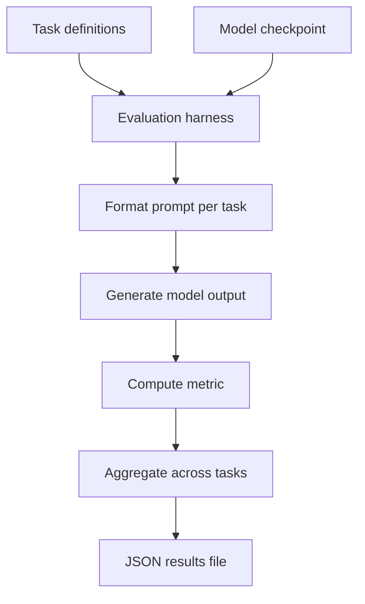

# LM 평가 하네스

> 언어 모델은 훈련 손실이 아닌 다운스트림 작업으로 평가됩니다. 훈련 손실은 모델이 데이터에 얼마나 잘 맞는지 측정하지만, 실제로 중요한 것은 모델이 사실, 추론 및 명령어를 얼마나 잘 이해하는지입니다. LM 평가 하네스는 모델을 평가 작업의 제품군에 대해 실행하고, 정확도, F1, perplexity 및 기타 메트릭을 집계하고, 결과를 재현 가능한 형식으로 저장합니다. 이 레슨은 사용자 정의 평가 작업을 지원하고, 모델 크기와 메트릭 간의 상관관계를 찾으며, 벤치마크 전반에 걸쳐 실행 간 차이를 측정하는 평가 하네스를 구축합니다.

**Type:** Build
**Languages:** Python
**Prerequisites:** Phase 19 lessons 30-37
**Time:** ~90 minutes

## Learning Objectives

- 모델 구현에서 분리된 평가 작업의 플러그형 제품군을 정의합니다.
- perplexity, 정확히 일치, F1 및 선택적 ROUGE-L을 포함한 메트릭을 구현합니다.
- 평가 작업 전반에 걸쳐 모델을 실행하고, 메트릭을 집계하고, 재현 가능한 JSON 결과 파일을 저장합니다.
- 여러 모델 크기에 대해 평가 작업 제품군을 실행하고, 모델 크기와 메트릭 간의 상관관계를 찾습니다.
- 동일한 시드로 하네스를 다시 실행하고 실행 간 차이를 측정합니다.

## The Problem

단일 평가 작업에서 모델의 성능을 측정하는 것은 모델의 성능을 포착하지 못합니다. 모델은 여러 작업에서 평가되어야 합니다. 각 작업은 모델의 다른 측면을 측정합니다: 사실 이해, 추론, 명령어 따르기, 코드 생성 등. 각 작업은 고유한 프롬프트 형식과 평가 메트릭을 가지고 있습니다.

평가 하네스가 없으면 각 작업에 대해 평가를 처음부터 작성해야 합니다. 하네스는 작업 사양을 위한 표준 형식, 메트릭 계산의 공유 구현 및 결과 집계를 위한 공유 형식을 제공합니다.

## The Concept



### Task definition

평가 작업은 다음 필드를 포함하는 데이터 클래스로 정의됩니다:

- `task_name` - 작업의 고유 식별자
- `dataset` - 작업을 위한 프롬프트 및 참조 답변을 포함하는 데이터셋
- `prompt_template` - 프롬프트를 형식화하는 템플릿 문자열
- `metric` - 사용할 메트릭(perplexity, 정확히 일치, F1, ROUGE-L)
- `num_fewshot` - 프롬프트에 포함할 few-shot 예제 수

### Prompt formatting

각 작업은 작업별 템플릿에 따라 해당 프롬프트를 형식화합니다. 템플릿은 `{input}`을 현재 입력으로, `{fewshot}`을 few-shot 예제로, `{instruction}`을 작업별 명령어로 대체합니다. 템플릿 시스템은 프롬프트 엔지니어링을 데이터 정의의 문제로 만듭니다.

### Metrics

하네스는 네 가지 메트릭을 구현합니다:

- **Perplexity** - 모델이 생성된 토큰에 얼마나 확신하는지 측정. 분류 작업에서 손실 함수와 동일하며 모델의 확신의 대리 지표입니다.
- **Exact match** - 생성된 출력이 참조 답변과 정확히 일치하는지 측정. 예제의 경우 "Yes"는 "yes"와 일치하지 않습니다.
- **F1** - 참조 답변과 생성된 텍스트 사이의 토큰 중복. 두 집합 사이의 유사도 측정입니다.
- **ROUGE-L** - 가장 긴 공통 부분 수열 기반의 생성 텍스트 품질 측정. F1에서 포착되지 않는 생성 텍스트의 순서 구조를 포착합니다.

### Result aggregation

모든 작업이 실행되면 하네스는 모든 작업에서 메트릭을 집계합니다. 각 작업에 대해 하네스는 메트릭 값, 신뢰 구간 및 작업이 실행된 횟수를 보고합니다. 결과는 재현 가능한 JSON 파일에 저장됩니다.

## Build It

`code/main.py` implements:

- `EvalTask` - 작업 이름, 데이터셋, 프롬프트 템플릿, 메트릭 및 few-shot 수를 포함하는 데이터 클래스.
- `PromptFormatter` - 주어진 작업에 대해 프롬프트를 형식화하고, `{input}`, `{fewshot}`, `{instruction}`을 대체합니다.
- `MetricCalculator` - perplexity, 정확히 일치, F1 및 ROUGE-L을 계산합니다.
- `EvalHarness` - 평가 하네스 자체. 작업 제품군에서 모델을 실행하고, 메트릭을 계산하고, 결과를 집계합니다.
- `CorrelationFinder` - 모델 크기(파라미터 수)와 각 작업의 메트릭 간의 상관관계를 계산합니다.
- `RunDiff` - 동일한 시드로 하네스를 다시 실행하고 실행 간 차이를 측정합니다.

파일 하단의 데모는 두 가지 평가 작업(사실 이해, 간단한 추론)을 정의하고, 작은 모델과 더 큰 모델에서 실행하고, 결과를 집계하고, 모델 크기-메트릭 상관관계를 찾고, 실행 간 차이를 측정합니다.

Run it:

```bash
python3 code/main.py
```

스크립트는 0으로 종료되고 작업별 메트릭, 모델 크기-메트릭 상관관계 및 실행 간 차이를 출력합니다.

## Production Patterns

세 가지 패턴이 이 레슨 하네스를 프로덕션 평가 제품군으로 확장합니다.

**Tasks as YAML files, not Python classes.** 작업 정의를 작업 디렉터리의 YAML 파일로 외부화합니다. 각 작업은 데이터셋 경로, 프롬프트 템플릿, 메트릭 및 few-shot 수를 지정하는 자체 YAML 파일을 가져옵니다. 평가 하네스는 YAML 파일을 읽고 작업을 등록하며, 프로덕션 평가자나 CI 봇이 YAML 파일을 git에 푸시하여 작업을 추가할 수 있습니다.

**Few-shot examples are random, not fixed.** 고정된 few-shot 예제는 평가 실행 전반에 걸쳐 메트릭에 편향을 주입합니다. 각 few-shot 예제는 작업의 데이터셋에서 무작위로 샘플링되어야 하며, 하네스는 시드를 기록해야 합니다. 이렇게 하면 실행 간에 몇 샷 예제가 달라지고 메트릭이 예제 선택에 덜 민감해집니다.

**Results include the seed and model hash.** 결과 JSON에는 평가 실행을 완전히 재현하는 데 필요한 모든 메타데이터가 포함되어야 합니다: 시드, 모델 체크포인트의 sha256 및 평가 하네스 버전. 이렇게 하면 결과가 모델과 평가 코드의 특정 버전에 고정됩니다.

## Use It

프로덕션 패턴:

- **Evaluate at every checkpoint.** 훈련 중에 모델이 몇 단계마다 체크포인트되면, 각 체크포인트는 평가 하네스에 대해 실행되어야 합니다. 메트릭이 시간에 따라 어떻게 진화하는지에 대한 평가 곡선을 제공합니다.
- **Evaluate on a fixed test set.** 테스트 세트는 시간이 지남에 따라 변경되어서는 안 됩니다. 각 모델 버전은 동일한 테스트 세트에 대해 평가되어야 합니다. 시간이 지남에 따라 메트릭이 어떻게 변하는지 측정할 수 있기 때문입니다.
- **Report confidence intervals.** 단일 메트릭 값은 샘플링 잡음으로 인해 실행마다 다릅니다. 하네스는 각 작업에 대한 신뢰 구간을 계산해야 합니다. 값이 겹치면 메트릭 차이가 유의하지 않습니다.

## Ship It

`outputs/skill-eval-harness.md`는 실제 프로젝트가 포함하는 평가 작업, 사용되는 평가 메트릭, 결과가 저장되는 위치 및 평가가 CI에서 실행되는 방식을 설명합니다. 이 레슨은 엔진을 제공합니다.

## Exercises

1. 모델 로딩을 캐싱하여 작업 간에 모델 사본을 재사용하는 `--share-model` 플래그를 추가합니다. 여러 작업에 대해 동일한 모델이 여러 번 로드되지 않습니다.
2. 각 평가 작업의 시드와 sha256이 결과 JSON에 포함되었는지 확인하는 단위 테스트를 추가합니다.
3. 작업 정의를 YAML 파일로 외부화합니다. 하네스는 작업 디렉터리에서 YAML 파일을 읽습니다.
4. 작업 간 비교에 대한 통계적 유의성을 계산하는 `--significance` 플래그를 추가합니다. 모델 A가 작업에서 모델 B를 능가하는 경우, 그 차이가 통계적으로 유의한지 측정합니다.
5. 평가 하네스가 CI에서 제품군을 자동으로 실행하는 `--ci-mode` 플래그를 추가합니다.

## Key Terms

| Term | What people say | What it actually means |
|------|-----------------|------------------------|
| Eval task | "Benchmark" | 프롬프트 템플릿과 데이터셋에 연결된 메트릭을 가진 평가 작업 |
| Prompt template | "Format string" | `{fewshot}` 및 `{instruction}`을 대체하여 프롬프트를 생성하는 템플릿 |
| Metric | "Score" | 생성된 출력을 참조 답변과 비교하는 함수 |
| Aggregate | "Average" | 비독립적 평가 작업 전반에 걸친 결과 집계 |
| Confidence interval | "Error bar" | 샘플링 잡음으로 인한 메트릭 값의 범위 |

## Further Reading

- [Gao et al., A Framework for Few-shot Language Model Evaluation (arXiv 2206.04615)](https://arxiv.org/abs/2206.04615) - LM Evaluation Harness의 원본
- [Lin, ROUGE: A Package for Automatic Evaluation of Summaries (ACL 2004)](https://aclanthology.org/W04-1013/) - ROUGE 메트릭 참조
- [Papineni et al., BLEU: a Method for Automatic Evaluation of Machine Translation (ACL 2002)](https://aclanthology.org/P02-1040/) - BLEU 메트릭 참조
- Phase 19 · 39 - 지도 파인튜닝, 평가 하네스가 평가하는 모델
- Phase 19 · 40 - 선호도 최적화(DPO), 평가 하네스가 평가하는 모델
- Phase 19 · 47 - 체크포인트 저장, 평가 하네스가 체크포인트를 로드하는 곳
