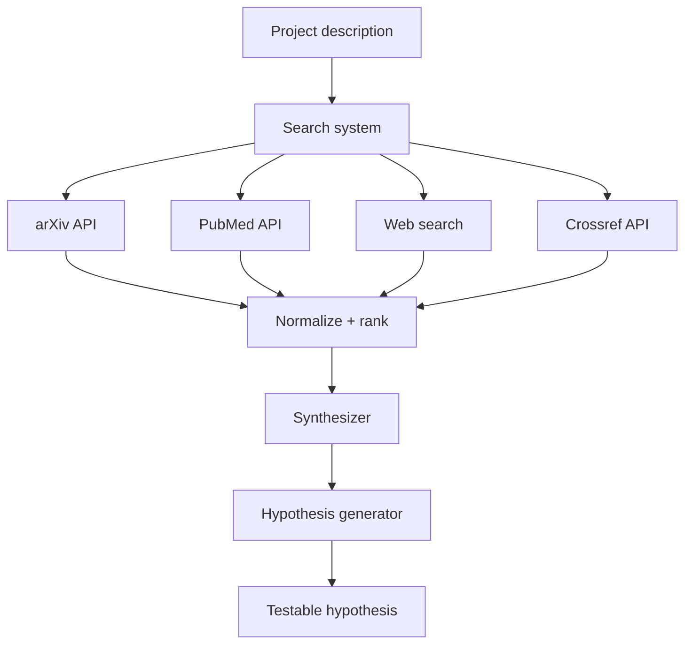

# 가설 생성기

> 연구는 가설로 시작됩니다. 가설은 인터넷과 연구 논문을 검색하고, 이전 결과를 검토하고, 현재 프로젝트의 다음 단계가 무엇인지 묻는 연구자에 의해 생성됩니다. 이 에이전트는 그 과정을 자동화합니다: 사용자로부터 설명을 받고, arXiv, PubMed, Crossref 및 일반 웹 검색에서 관련 논문 및 리소스를 검색하고, 검색 결과를 종합하여 현재 프로젝트의 맥락에서 구체적이고 테스트 가능하며 새로운 다음 단계를 생성합니다.

**Type:** Build
**Languages:** Python
**Prerequisites:** Phase 19 lessons 30-37
**Time:** ~90 minutes

## Learning Objectives

- 웹 검색, arXiv API, PubMed API 및 Crossref에서 관련 연구 및 리소스를 검색하는 검색 시스템을 구축합니다.
- 검색 결과를 정규화된 표현으로 파싱하고 순위를 매깁니다.
- 검색 결과를 소화하고 발견과 종합을 생성하는 LLM 기반 종합가를 구현합니다.
- 프로젝트 설명과 검색 종합을 기반으로 테스트 가능한 가설을 생성하는 가설 생성기를 구축합니다.

## The Problem

연구는 새롭고 중요한 작업을 찾는 것으로 정의됩니다. 블랭크 페이지는 저주받은 것입니다. 인터넷은 너무 방대합니다. arXiv에는 매일 수천 개의 논문이 있습니다. PubMed에는 수백만 개가 있습니다. 연구자는 어디서부터 시작해야 할지 모릅니다.

가설 생성기는 이 문제를 해결합니다: 프로젝트 설명에서 가설로 가는 지름길을 생성합니다. 검색 시스템은 소음을 필터링합니다. 검색 결과에서 현재 프로젝트와 관련된 것만 유지합니다. 종합가는 관련성을 소화합니다. 가설 생성기는 테스트 가능한 예측을 출력합니다.

## The Concept



### Search sources

에이전트는 네 가지 소스를 검색합니다:

- **arXiv API** - 컴퓨터 과학, 수학, 물리학, 통계학의 논문. `http://export.arxiv.org/api/query`를 통해 검색 가능합니다.
- **PubMed API** - 생명 과학 및 생명 공학의 논문. `https://eutils.ncbi.nlm.nih.gov/entrez/eutils/esearch.fcgi`를 통해 검색 가능합니다.
- **Web search** - 일반 웹 검색, 현재 프로젝트와 관련된 일반 지식.
- **Crossref API** - 학술 출판물 전반에 걸친 메타데이터 검색. `https://api.crossref.org/works`를 통해 검색 가능합니다.

### Normalize and rank

각 검색 소스는 고유한 응답 형식을 반환합니다. 정규화 시스템은 각 응답을 공통된 표현(제목, 저자, 초록, 링크, 메트릭)으로 변환합니다. 그런 다음 순위 시스템은 현재 프로젝트와의 관련성을 기준으로 결과를 정렬합니다. 순위는 소스의 검색 점수와 프로젝트 설명에 대한 결과의 TF-IDF 유사도의 가중 조합입니다.

### Synthesizer

종합가는 검색 결과를 가져와서 프로젝트 설명의 맥락에서 요약합니다. 프롬프트 엔지니어링을 수행하는 LLM(이 에이전트의 사용자에게)입니다: "현재 연구에서 주제 X의 상태는 무엇입니까? 향후 작업은 무엇입니까?" 종합가는 각 검색 결과에서 핵심 발견을 추출하고, 프로젝트 설명과의 관련성에 주석을 달고, 관련성 순으로 정렬하여 반환합니다. 결과는 주석이 달린 참고 문헌 목록입니다.

### Hypothesis generator

가설 생성기는 프로젝트 설명과 종합을 가져와서 테스트 가능한 가설을 생성합니다. 각 가설에는 다음이 포함됩니다: 가설 설명, 근거(왜 이 특정 실험이 연구의 다음 단계가 되어야 하는지), 예측(실험이 확인해야 하는 것), 제안된 실험 및 예상 메트릭. 출력은 JSON 형식으로 되어 있어 연구자가 검토하고 순위를 매길 수 있습니다.

## Build It

`code/main.py` implements:

- `SearchEngine` - arXiv, PubMed, 웹, Crossref API 주변의 통합 검색 인터페이스. 각 API에 대한 응답을 정규화합니다.
- `ResultRanker` - TF-IDF 유사도와 소스 검색 점수를 결합하여 관련성을 기준으로 검색 결과의 순위를 매깁니다.
- `Synthesizer` - 검색 결과를 가져와서 프로젝트 설명의 맥락에서 요약하고, 발견에 주석을 답니다.
- `HypothesisGenerator` - 프로젝트 설명과 종합을 가져와서 테스트 가능한 가설을 생성합니다.

파일 하단의 데모는 프로젝트 설명("트랜스포머 기반 언어 모델의 추론 기능 개선")을 취하고, 검색 시스템을 실행하고, 결과를 정규화하고, 종합을 생성하고, 가설을 생성합니다.

Run it:

```bash
python3 code/main.py
```

스크립트는 0으로 종료되고 검색 결과 순위, 종합 및 생성된 가설을 출력합니다.

## Production Patterns

세 가지 패턴이 이 레슨을 프로덕션 연구 보조 도구로 확장합니다.

**Search across domains, not within domains.** 단일 API에서 검색하면 뷰가 제한됩니다. 도메인 전반에 걸쳐 검색하면 현재 프로젝트와 관련이 없는 영역에서 통찰력을 얻을 수 있습니다. 예를 들어, 언어 모델의 추론에 대한 연구는 시각적 추론(컴퓨터 비전) 또는 신경 과학(인지 과학)의 작업에서 이점을 얻을 수 있습니다.

**Deduplicate results across sources.** arXiv와 Crossref는 종종 동일한 논문을 색인화합니다. 검색 결과를 정규화한 후, 시스템은 중복을 제거해야 합니다. 동일한 논문이 두 소스에서 나타나는 경우 한 번만 유지하되 두 소스 모두 태그합니다.

**Cache search results.** 검색은 느리고 속도 제한이 있습니다. 가설 생성기가 동일한 프로젝트 설명에 대해 다시 실행되면 이전 검색 결과를 캐시에서 재사용해야 합니다. TTL이 있는 간단한 파일 캐시는 속도 제한을 방지하고 재현성을 향상시킵니다.

## Use It

프로덕션 패턴:

- **Human in the loop for hypothesis selection.** 가설 생성기는 후보를 생성합니다; 연구자는 실험을 실행하기 위해 어떤 후보를 선택합니다. 생성기는 연구자를 대체하지 않고, 연구자가 시작할 자료를 제공합니다.
- **Hypotheses are version-controlled.** 가설은 프로젝트 저장소에 JSON 파일로 저장됩니다. 각 파일에는 가설, 근거 및 예측 레이블이 포함됩니다. 연구자는 검증되려면 가설을 기록해야 하기 때문입니다.
- **Hypotheses update as the project evolves.** 프로젝트가 진행됨에 따라 가설 생성기로 다시 피드백됩니다. 업데이트된 설명은 이전 실험의 결과와 함께 생성기에 입력됩니다. 생성기는 정제된 가설을 생성합니다.

## Ship It

`outputs/skill-hypothesis-generator.md`는 실제 프로젝트에서 검색에 사용되는 API 키, 가설이 저장되는 위치 및 연구자가 생성된 가설과 상호 작용하는 방식을 설명합니다. 이 레슨은 엔진을 제공합니다.

## Exercises

1. Semantics Scholar API를 다섯 번째 검색 소스로 추가합니다.
2. 사용자가 검색을 건너뛰고 검색 결과의 로컬 캐시만 사용할 수 있도록 하는 `--offline` 플래그를 추가합니다.
3. 검색 결과가 최근성을 기준으로 순위가 매겨지도록 하는 `--recent` 플래그를 추가합니다.
4. 생성기가 생성할 가설 수를 제어하는 `--max-hypotheses` 플래그를 추가합니다.
5. 사용자가 생성된 가설을 대화형으로 검토하고 순위를 매기고 가설을 거부할 수 있는 대화형 `--interactive` 모드를 추가합니다.

## Key Terms

| Term | What people say | What it actually means |
|------|-----------------|------------------------|
| Search source | "API we call" | arXiv, PubMed, Crossref 등 관련 리소스를 검색하는 API |
| Normalize | "Convert to common format" | 각 검색 API의 응답을 공통된 하나의 표현으로 변환 |
| Rank | "Sort by relevance" | TF-IDF 또는 다른 유사도 메트릭을 사용하여 프로젝트 설명에 대한 관련성을 기준으로 검색 결과 정렬 |
| Synthesize | "Summarize findings" | 검색 결과에서 핵심 발견을 추출하고 관련성에 주석 달기 |
| Hypothesis | "Testable prediction" | 생성기의 결과물: 설명, 근거, 예측, 제안된 실험 및 예상 메트릭 |

## Further Reading

- [arXiv API documentation](https://info.arxiv.org/help/api/index.html) - arXiv 검색 API 참조
- [PubMed E-utilities documentation](https://www.ncbi.nlm.nih.gov/books/NBK25501/) - PubMed 검색 API 참조
- [Crossref REST API documentation](https://api.crossref.org/swagger-ui/index.html) - Crossref 검색 API 참조
- [Semantic Scholar API documentation](https://api.semanticscholar.org/) - 의미론적 검색을 위한 대체 검색 API
- Phase 19 · 41 - 평가 파이프라인, 생성된 가설 테스트에 사용
- Phase 19 · 51 - 문헌 검색 에이전트, 이 에이전트가 검색 및 종합을 수행하는 곳
