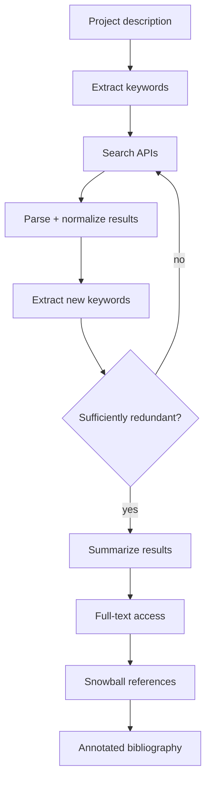

# 문헌 검색 에이전트

> 연구는 기존 작업 위에 구축됩니다. 문헌 검색은 연구자가 관련 작업을 빠르고 체계적으로 찾을 수 있도록 하는 프로세스입니다. 이 에이전트는 여러 검색 단계로 구성된 깊이 우선 검색을 통해 문헌 검색을 자동화합니다: 프로젝트 설명 읽기, 키워드 구성, 논문 데이터베이스 검색, 검색 결과에서 추가 키워드 추출, 풀 텍스트 액세스, 참고 문헌 목록으로 스노우볼링, 프로젝트 설명에 대한 검색 결과 요약. 결과는 연구 질문에 체계적으로 답하는 주석이 달린 참고 문헌 목록입니다.

**Type:** Build
**Languages:** Python
**Prerequisites:** Phase 19 lessons 30-37
**Time:** ~90 minutes

## Learning Objectives

- 여러 검색 단계(키워드, 스노우볼링, 풀 텍스트)로 구성된 깊이 우선 검색을 구현합니다.
- 검색 결과를 소화하고, 관련성에 따라 순위를 매기고, 주석이 달린 참고 문헌 목록을 생성하는 검색 에이전트를 구축합니다.
- 사용자 지정 검색 필터(연도, 인용, 저널)를 지원합니다.
- 검색 결과의 요약 메트릭(논문 수, 검색된 키워드 수, 검색 깊이)을 출력합니다.

## The Problem

연구자가 새로운 프로젝트를 시작할 때 문헌 검색이 첫 번째 단계입니다. 검색은 연구자가 관련 작업을 식별하고, 방법론을 이해하고, 격차를 찾는 데 도움이 됩니다. 질 좋은 문헌 검색은 리뷰 시간을 며칠에서 몇 시간으로 줄입니다.

문헌 검색 에이전트는 깊이 우선 검색을 통해 이 프로세스를 자동화합니다. 검색 에이전트는 검색 결과를 읽고, 검색 결과에서 새로운 키워드를 추출하고, 해당 새 키워드로 검색을 반복합니다. 검색 깊이는 키워드 중복이 충분해지면(검색 결과가 충분히 유사해져서 더 이상의 검색이 새로운 결과를 생성하지 않을 때) 정지합니다.

## The Concept



### Keyword extraction and search

검색 에이전트는 프로젝트 설명에서 키워드를 추출함으로써 시작합니다. 키워드는 단어(예: "트랜스포머") 또는 구절(예: "언어 모델 추론")일 수 있습니다. 검색 에이전트는 각 키워드를 검색 API(arXiv, PubMed, Crossref)로 보냅니다. 각 검색에 대해 검색 에이전트는 결과를 파싱하고 정규화합니다.

### Redundancy stopping criterion

검색 에이전트는 각 검색 라운드에서 논문 제목과 초록을 수집합니다. 두 연속 라운드의 제목과 초록 사이의 Jaccard 유사도가 설정된 임계값(예: 0.8)을 초과하면 검색 에이전트는 검색이 충분히 중복되었다고 결론 내리고 검색을 중단합니다. 중복 임계값은 검색 깊이를 제어합니다: 임계값이 낮을수록 검색이 더 일찍 중단되고, 임계값이 높을수록 검색이 더 깊어집니다.

### Full-text access

정규화된 검색 결과에서 검색 에이전트는 각 논문의 arXiv PDF 또는 PubMed Central HTML에 대한 직접 링크를 추출합니다. 검색 에이전트는 풀 텍스트를 가져와서(오픈 액세스인 경우) 텍스트를 청크로 분할하고 각 청크의 관련성에 주석을 답니다. 풀 텍스트 청크는 검색 결과의 일부가 되어 연구자에게 요약만이 아닌 전체 텍스트 청크를 제공합니다.

### Snowballing

검색 에이전트는 각 검색 결과의 참고 문헌을 검사하여 추가 관련 논문을 찾습니다. 참고 문헌 목록을 스노우볼링하면 중복 임계값에 도달할 때까지 새 논문이 추가됩니다. 스노우볼링 검색이 키워드 검색보다 더 관련성 높은 논문을 생성하는 경우가 많습니다.

### Annotated bibliography

검색 에이전트의 출력은 주석이 달린 참고 문헌 목록입니다. 각 항목에는 다음이 포함됩니다: 표준 인용(저자, 제목, 저널, 연도), 검색 에이전트의 주석(프로젝트 설명과의 관련성, 핵심 발견, 방법론), 프로젝트 설명의 관점에서의 격차 또는 향후 작업 및 풀 텍스트가 있는 경우 해당 청크에 대한 링크.

## Build It

`code/main.py` implements:

- `KeywordExtractor` - 프로젝트 설명에서 TF-IDF로 키워드를 추출합니다.
- `SearchAgent` - 여러 검색 단계로 깊이 우선 검색을 실행합니다: 키워드 검색, 스노우볼링 및 풀 텍스트 액세스.
- `RedundancyChecker` - 두 연속 검색 라운드 사이의 Jaccard 유사도를 계산하고 중복 임계값에 도달하면 중단합니다.
- `FullTextAccessor` - arXiv HTML 또는 PubMed Central HTML에서 풀 텍스트를 가져와서 청크로 분할합니다.
- `Snowballer` - 각 검색 결과의 참고 문헌 목록을 검사하고 추가 관련 논문을 추출합니다.
- `BibliographyCompiler` - 검색 결과를 수집하고, 풀 텍스트 청크로 주석을 달고, 참고 문헌 목록을 스노우볼링하고, 주석이 달린 참고 문헌 목록을 출력합니다.

파일 하단의 데모는 프로젝트 설명("트랜스포머 기반 언어 모델의 추론 기능 개선")을 취하고, 키워드 추출기로 키워드를 추출하고, 검색 에이전트를 실행하고, 중복 임계값에서 중단하고, 풀 텍스트에 액세스하고, 참고 문헌 목록을 스노우볼링하고, 주석이 달린 참고 문헌 목록을 생성합니다.

Run it:

```bash
python3 code/main.py
```

스크립트는 0으로 종료되고 주석이 달린 참고 문헌 목록과 요약 메트릭을 출력합니다.

## Production Patterns

세 가지 패턴이 검색 에이전트를 프로덕션 연구 보조 도구로 확장합니다.

**Domain-specific embeddings for relevance ranking.** TF-IDF 기반 키워드 추출은 간단한 도메인에서 작동합니다. 특화된 도메인에서 검색 에이전트는 미세 조정된 도메인 임베딩을 사용하여 논문과 프로젝트 설명 간의 의미적 유사도를 측정함으로써 이점을 얻습니다. SciBERT 또는 BioBERT를 관련성 순위 매김에 사용할 수 있습니다.

**Parallel search across sources.** 검색 에이전트는 각 검색 라운드에서 모든 검색 API를 동시에 호출해야 합니다. 순차 검색은 API 호출 사이의 대기 시간으로 인해 느립니다. 각 API를 별도의 스레드로 호출하면 전체 검색 시간이 줄어듭니다.

**Caching at every layer.** 검색 결과는 각 API에 대해 캐시되어야 합니다. 풀 텍스트는 각 논문에 대해 캐시되어야 합니다. 스노우볼링된 참고 문헌 목록도 캐시되어야 합니다. 캐싱은 반복되는 검색 실행의 속도를 높이고 속도 제한을 방지합니다. 각 캐시 항목에는 TTL(Time-To-Live)이 있어야 하며, 오래된 검색 결과는 재검색됩니다.

## Use It

프로덕션 패턴:

- **Human in the loop for keyword refinement.** 검색 에이전트는 초기 키워드 세트를 생성합니다; 연구자는 검색 전에 키워드를 추가, 제거 또는 수정하여 키워드를 개선할 수 있습니다. 인간의 개입은 첫 번째 검색 라운드의 품질을 향상시킵니다.
- **Export to citation manager.** 주석이 달린 참고 문헌 목록은 BibTeX, RIS 또는 CSV로 내보낼 수 있어야 합니다. 연구자는 출력을 Zotero, Mendeley 또는 EndNote로 가져올 수 있습니다. BIB 내보내기는 각 참고 문헌 항목을 BibTeX 항목으로 변환합니다.
- **Search depth as a CLI flag.** 깊이 우선 검색의 깊이는 CLI 플래그로 제어되어야 합니다. `--depth 1`의 얕은 검색은 키워드 검색만 실행합니다. `--depth 3`의 깊은 검색은 키워드 검색, 스노우볼링 및 풀 텍스트 검색을 실행합니다. 연구자는 검색 속도와 포괄성의 균형을 맞추기 위해 깊이를 선택합니다.

## Ship It

`outputs/skill-lit-search-agent.md`는 실제 프로젝트에서 검색 에이전트가 검색하는 데 사용하는 API 키, 검색 캐시가 저장되는 위치 및 연구자가 사람이 개입하는 루프와 상호 작용하는 방식을 설명합니다. 이 레슨은 엔진을 제공합니다.

## Exercises

1. 검색 결과의 도메인별 관련성 순위 매김을 위한 SciBERT 통합을 추가합니다.
2. 검색 에이전트가 여러 API에서 동시에 검색하는 `--parallel` 플래그를 추가합니다.
3. 검색 결과 캐시를 지우는 `--clear-cache` 플래그를 추가합니다.
4. 검색 결과를 BibTeX 및 CSV로 내보내기를 추가합니다.
5. `--depth` CLI 플래그를 추가합니다: 값 1은 키워드 검색만, 2는 키워드 + 스노우볼링, 3은 키워드 + 스노우볼링 + 풀 텍스트를 의미합니다.

## Key Terms

| Term | What people say | What it actually means |
|------|-----------------|------------------------|
| Search depth | "Deep search" | 중복 중단 기준에 도달할 때까지의 검색 라운드 수 |
| Redundancy | "Similar results" | Jaccard 유사도로 측정된 두 연속 검색 라운드 결과 간의 중복 |
| Snowballing | "Reference chasing" | 각 검색 결과의 참고 문헌 목록을 검사하여 추가 관련 논문 찾기 |
| Annotated bibliography | "Results with notes" | 관련성 및 핵심 발견에 대한 검색 에이전트의 주석이 포함된 참고 문헌 목록 |
| Full-text access | "Get the paper" | arXiv 또는 PubMed Central에서 논문의 전체 텍스트 가져오기 |

## Further Reading

- [Wohlin, Guidelines for Snowballing in Systematic Literature Studies (ACM 2014)](https://dl.acm.org/doi/10.1145/2601248.2601268) - 스노우볼링 방법론
- [SciBERT: A Pretrained Language Model for Scientific Text (EMNLP 2019)](https://aclanthology.org/D19-1371/) - 도메인별 임베딩을 사용한 관련성 순위 매김
- [BibTeX format documentation](https://www.bibtex.com/format/) - 문헌 관리 내보내기 형식
- Phase 19 · 50 - 가설 생성기, 이 에이전트의 검색 결과가 가설 생성을 공급합니다.
- Phase 19 · 52 - 실험 러너, 생성된 가설과 찾은 문헌이 실험 실행을 알려줍니다.
